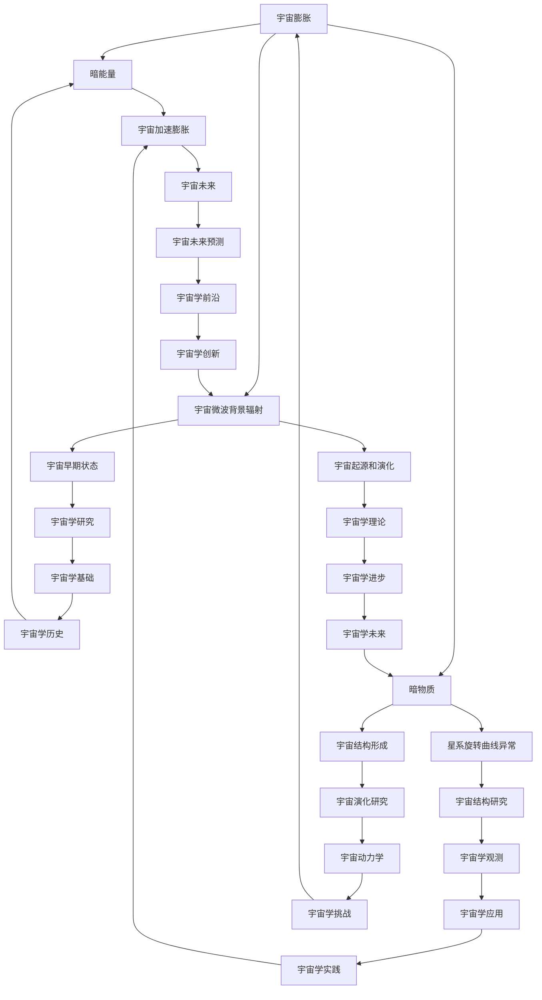

                 

### 文章标题

《宇宙是否具有目的性》

### 文章关键词

宇宙学，目的性，膨胀理论，暗物质，暗能量，数学模型，哲学思考

### 文章摘要

本文将深入探讨宇宙是否具有目的性的问题。通过介绍宇宙学的基本原理，包括宇宙膨胀、暗物质和暗能量等概念，我们将搭建一个理解宇宙结构的基础框架。接着，我们将用Mermaid流程图展示宇宙核心概念之间的联系。随后，本文将详细介绍宇宙学中的数学模型和公式，并使用伪代码阐述核心算法原理。此外，我们将从哲学和科学的角度探讨宇宙目的性的可能性，并分析现代宇宙学面临的挑战和未来研究方向。通过这些分析，我们希望为读者提供一个全面且深入的视角，以理解宇宙的本质和是否具有目的性。

## 第1章 宇宙概述

宇宙，这个词源自古希腊语“cosmos”，意为“有序的整体”。在物理学中，宇宙是指包括所有物质和能量在内的空间和时间整体。自从人类开始观察夜空，宇宙学便成为了科学探索的一个重要领域。从古代的宇宙观到现代的宇宙学理论，宇宙学的发展历程可谓波澜壮阔，为我们揭示了宇宙的奥秘和复杂。

### 1.1 宇宙的定义与历史

宇宙的定义自古以来就有多种观点。在古代，人们认为宇宙是静止不变的，天体只是固定在“天堂”中的不可移动的物体。这种观点在古代文明中非常普遍，例如古埃及、古希腊和中国都有相应的宇宙观。中国古代的《尚书·尧典》中就有“天圆地方”的描述，这反映了当时的宇宙观念。

到了古希腊时期，毕达哥拉斯提出了“数是宇宙的基石”的观点，认为宇宙是由数学规律构成的。而亚里士多德则认为宇宙是有边界的，由固定的天体组成，地球是宇宙的中心。这些观点在古代西方哲学中占据了主导地位，直到中世纪末期。

中世纪时期，基督教宇宙观认为地球是宇宙的中心，而天堂和地狱则位于地球之外。这一观点在教会的权威下被广泛接受，并影响了欧洲的科学思想。

文艺复兴时期，哥白尼提出了日心说的观点，认为太阳而不是地球是宇宙的中心。这一革命性的观点为后来的科学研究奠定了基础。哥白尼的《天体运行论》发表于1543年，标志着宇宙学发展史上的一个重要转折点。

进入现代，宇宙学的概念和研究方法得到了显著的发展。牛顿在1687年发表的《自然哲学的数学原理》中提出了万有引力定律，为理解天体运动提供了数学工具。这一理论在后来的几个世纪中得到了广泛的应用和验证。

20世纪，宇宙学的研究迎来了新的突破。爱因斯坦在1915年提出的广义相对论彻底改变了我们对宇宙的认识。广义相对论揭示了引力与时空的弯曲之间的关系，提出了宇宙膨胀和黑洞的概念。哈勃在1929年发现宇宙正在膨胀，这一发现为宇宙大爆炸理论提供了强有力的证据。

宇宙学的发展历程充满了对宇宙本质和结构的探索，从古代的宇宙观念到现代的宇宙学理论，每一步都是科学进步的见证。通过对宇宙的深入研究，科学家们不断揭示宇宙的奥秘，为我们的世界观提供了新的视角。

### 1.2 宇宙学的发展历程

宇宙学的发展历程可以分为几个重要阶段，每个阶段都有其里程碑式的发现和理论突破。以下是对这些阶段的详细描述：

**古代宇宙观**：在古代，人们通常认为宇宙是静止不变的，天体固定在天空中。例如，古代中国的“天圆地方”观念和古希腊的“地球中心说”都是这一时期的典型代表。这些观念虽然没有现代科学的基础，但在当时对人类认识宇宙有着重要的影响。

**文艺复兴时期的革命**：文艺复兴时期的哥白尼提出了日心说的观点，这一革命性的理论认为太阳而非地球是宇宙的中心。哥白尼的《天体运行论》发表于1543年，标志着宇宙学发展史上的一个重要转折点。这一观点打破了古代宇宙观的束缚，为后来的科学研究奠定了基础。

**牛顿的万有引力定律**：1687年，牛顿在《自然哲学的数学原理》中提出了万有引力定律，为理解天体运动提供了数学工具。这一理论在后来的几个世纪中得到了广泛的应用和验证，为宇宙学研究奠定了坚实的理论基础。

**爱因斯坦的广义相对论**：1915年，爱因斯坦提出了广义相对论，这一理论揭示了引力与时空弯曲之间的关系，提出了宇宙膨胀和黑洞的概念。广义相对论是现代宇宙学的重要支柱，它彻底改变了我们对宇宙的认识。

**哈勃的宇宙膨胀发现**：1929年，哈勃发现宇宙正在膨胀，这一发现为宇宙大爆炸理论提供了强有力的证据。哈勃的发现是20世纪宇宙学发展的重要里程碑，它揭示了宇宙的动态性质，并对后来的宇宙学研究产生了深远影响。

**现代宇宙学的发展**：自20世纪中叶以来，宇宙学的研究进入了快速发展的阶段。随着观测技术的进步，科学家们对宇宙的理解不断深化。例如，对暗物质和暗能量的研究揭示了宇宙的复杂性和未知性。宇宙微波背景辐射的发现和观测提供了宇宙早期状态的直接证据。

**宇宙加速膨胀**：1998年，科学家们发现了宇宙加速膨胀的现象，这一发现揭示了宇宙中一种神秘的力量——暗能量。暗能量是现代宇宙学中最引人注目的研究领域之一，它的存在和性质仍然是科学界探索的焦点。

**未来的宇宙学**：随着技术的进步，未来的宇宙学研究将更加深入。例如，未来的望远镜和探测器将能够观测到更遥远的宇宙，揭示宇宙的更多奥秘。宇宙学的未来研究方向包括宇宙的起源、演化、结构以及可能的最终命运。

通过这些里程碑式的发现和理论突破，宇宙学从古代的神秘探索逐渐发展成为一个现代科学的重要分支。未来，随着科学技术的不断进步，我们对宇宙的理解将会更加深入和全面。

## 第2章 核心概念与联系

在宇宙学的研究中，有许多核心概念相互关联，构成了我们对宇宙认知的框架。理解这些核心概念及其相互关系，是深入研究宇宙是否具有目的性的基础。以下是宇宙学中一些重要的核心概念，以及它们之间的联系。

### 2.1 宇宙的基本概念

**宇宙膨胀**：宇宙膨胀是指宇宙从大爆炸以来一直在不断扩张的现象。哈勃的观测结果显示，宇宙的膨胀速度随距离的增加而加快，这表明宇宙中存在一种推动膨胀的力量。

**暗物质**：暗物质是一种不发光、不吸收光的物质，其存在通过引力效应得以证实。暗物质占据了宇宙物质的大部分，但至今其本质尚未完全揭示。

**暗能量**：暗能量是一种假设存在的能量形式，它对抗引力，导致宇宙加速膨胀。暗能量是现代宇宙学中的一个重要概念，其性质和来源仍然是一个未解之谜。

**黑洞**：黑洞是一种极端密集的天体，其引力强大到连光都无法逃逸。黑洞是宇宙演化中重要的组成部分，对理解宇宙的动态过程具有重要意义。

**宇宙微波背景辐射**：宇宙微波背景辐射是宇宙早期状态的残留辐射，它提供了宇宙大爆炸理论的重要证据。

### 2.2 核心概念之间的联系

**宇宙膨胀与暗能量**：宇宙膨胀的速度随着距离的增加而加快，这一现象暗示了暗能量的存在。暗能量是一种假设存在的能量形式，它对抗引力，导致宇宙加速膨胀。

**暗物质与宇宙结构**：暗物质是宇宙中一种看不见的物质，它通过引力作用影响宇宙的结构和演化。暗物质的存在解释了星系旋转曲线的异常，以及宇宙大尺度结构的形成。

**黑洞与宇宙演化**：黑洞是宇宙演化中的一个重要环节，它们通过吞噬物质和辐射能量，影响周围环境的结构和动力学。黑洞的发现和观测为我们提供了研究宇宙演化的新视角。

**宇宙微波背景辐射与宇宙起源**：宇宙微波背景辐射是宇宙大爆炸后残留的辐射，它提供了宇宙早期状态的信息，是研究宇宙起源和演化的重要数据。

### 2.3 Mermaid流程图展示

为了更好地展示这些核心概念之间的联系，我们可以使用Mermaid流程图来表示。以下是宇宙学核心概念联系图的Mermaid代码：



以下是该流程图的渲染结果：


通过这个Mermaid流程图，我们可以清晰地看到宇宙学核心概念之间的相互关系，从而更好地理解宇宙的复杂结构和演化过程。

## 第3章 宇宙学基本原理

宇宙学的基本原理为我们理解宇宙的结构和演化提供了关键框架。在这一章节中，我们将详细探讨宇宙膨胀、暗物质和暗能量等基本概念，并使用伪代码阐述相关算法，以便读者能够深入理解这些原理。

### 3.1 宇宙膨胀

宇宙膨胀是指宇宙从大爆炸以来一直在不断扩张的现象。哈勃的观测结果显示，宇宙的膨胀速度随距离的增加而加快，这一现象被称为哈勃定律。宇宙膨胀的理论基础是广义相对论，该理论揭示了引力与时空弯曲之间的关系。

#### 3.1.1 宇宙膨胀理论

广义相对论预测，物质和能量会导致时空的弯曲，而引力正是这种时空弯曲的表现。因此，宇宙的膨胀可以理解为时空的膨胀。根据广义相对论，宇宙可以分为三种类型：开放宇宙、封闭宇宙和临界宇宙。

- **开放宇宙**：宇宙的膨胀速度将永远大于光速，宇宙将永远不会停止膨胀。
- **封闭宇宙**：宇宙的膨胀速度最终会减缓，并可能开始收缩，最终形成一个奇点。
- **临界宇宙**：宇宙的膨胀速度恰好足够使其停止膨胀，但不会收缩。

#### 3.1.2 宇宙膨胀的观测证据

哈勃通过观测远距离星系的光谱，发现红移量与距离成正比，这表明宇宙正在膨胀，且膨胀速度随距离增加而加快。这一发现为宇宙膨胀提供了直接的观测证据。

#### 3.1.3 宇宙膨胀的算法描述（伪代码）

为了模拟宇宙膨胀，我们可以使用以下伪代码：

```python
function expand_universe(time):
    for each galaxy in universe:
        distance = calculate_distance(galaxy)
        velocity = calculate_velocity(distance)
        galaxy.position += velocity * time
    return universe
```

在这个伪代码中，`expand_universe` 函数模拟宇宙在时间 `time` 内的膨胀过程。`calculate_distance` 和 `calculate_velocity` 函数分别计算星系之间的距离和膨胀速度。

### 3.2 暗物质

暗物质是宇宙中一种不发光、不吸收光的物质，其存在通过引力效应得以证实。暗物质占据了宇宙物质的大部分，但其本质尚未完全揭示。

#### 3.2.1 暗物质理论

暗物质理论假设，宇宙中存在一种未探测到的物质，这种物质不会与电磁波相互作用，因此无法直接观测。然而，它的存在可以通过其对引力的影响得到证明。例如，星系旋转曲线异常（星系中心的星体运动速度远大于预期）可以解释为暗物质的存在。

#### 3.2.2 暗物质的观测证据

暗物质的观测证据包括：
- 星系旋转曲线异常：星系中心的星体运动速度远大于预期。
- 宇宙微波背景辐射：宇宙微波背景辐射的观测数据支持了暗物质的存在。

#### 3.2.3 暗物质探测方法（伪代码）

为了模拟暗物质探测，我们可以使用以下伪代码：

```python
function detect_dark_matter():
    galaxies = observe_galaxies()
    for galaxy in galaxies:
        if calculate_rotation_curve(galaxy) > expected_value:
            print("Dark matter detected in galaxy:", galaxy.name)
    return galaxies
```

在这个伪代码中，`detect_dark_matter` 函数通过观测星系并计算星系旋转曲线，来判断暗物质的存在。`observe_galaxies` 和 `calculate_rotation_curve` 函数分别用于观测星系和计算星系旋转曲线。

### 3.3 暗能量

暗能量是一种假设存在的能量形式，它对抗引力，导致宇宙加速膨胀。暗能量是现代宇宙学中的一个重要概念，其性质和来源尚未完全揭示。

#### 3.3.1 暗能量理论

暗能量理论假设，宇宙中存在一种能量形式，它对抗引力，导致宇宙加速膨胀。这种能量形式被认为是一种均匀分布在宇宙中的场，称为“真空能量”或“宇宙常数”。

#### 3.3.2 暗能量的观测证据

暗能量的观测证据包括：
- 宇宙加速膨胀：观测数据表明，宇宙的膨胀速度在加快，这表明存在一种抗引力作用的能量。
- 宇宙微波背景辐射：宇宙微波背景辐射的数据支持了暗能量的存在。

#### 3.3.3 暗能量探测方法（伪代码）

为了模拟暗能量探测，我们可以使用以下伪代码：

```python
function detect_dark_energy():
    universe_data = observe_universe()
    if universe_data['expansion_rate'] > 0:
        print("Dark energy detected.")
    return universe_data
```

在这个伪代码中，`detect_dark_energy` 函数通过观测宇宙膨胀数据，来判断暗能量的存在。`observe_universe` 函数用于观测宇宙膨胀数据。

通过这些基本原理的详细讲解和伪代码的描述，我们能够更深入地理解宇宙膨胀、暗物质和暗能量等核心概念，并为进一步探讨宇宙是否具有目的性打下坚实的基础。

### 第4章 数学模型与公式

在宇宙学中，数学模型和公式是理解宇宙结构和演化的重要工具。它们不仅帮助我们量化宇宙现象，还提供了对宇宙本质的深刻洞察。本章节将详细介绍宇宙学中常用的数学模型和公式，并用LaTeX格式书写，并进行详细讲解和举例说明。

#### 4.1 宇宙学中的数学模型

**膨胀因子模型**：膨胀因子（或尺度因子）是描述宇宙随时间膨胀的参数。它表示当前时刻宇宙尺度与初始时刻的比例。膨胀因子通常用 \( a(t) \) 表示。

**暗物质密度模型**：暗物质密度描述了宇宙中暗物质的分布。它通常用 \( \rho_m \) 表示。

**暗能量模型**：暗能量模型描述了宇宙中暗能量的分布。它通常用 \( \rho_{\Lambda} \) 表示。

**宇宙总能量模型**：宇宙总能量由暗物质能量和暗能量组成，通常用 \( \rho \) 表示。

#### 4.2 数学公式解析

**膨胀因子公式**：膨胀因子可以通过哈勃定律计算，公式如下：
\[ v = H_0 d \]
其中，\( v \) 是星系的退行速度，\( H_0 \) 是哈勃常数，\( d \) 是星系的距离。

**暗物质密度公式**：暗物质密度可以通过宇宙总密度和暗能量密度计算，公式如下：
\[ \rho_m = \Omega_m \rho \]
其中，\( \Omega_m \) 是暗物质密度参数，\( \rho \) 是宇宙总密度。

**暗能量密度公式**：暗能量密度可以通过宇宙总密度和暗物质密度计算，公式如下：
\[ \rho_{\Lambda} = \Omega_{\Lambda} \rho \]
其中，\( \Omega_{\Lambda} \) 是暗能量密度参数，\( \rho \) 是宇宙总密度。

**宇宙总能量公式**：宇宙总能量可以通过暗物质能量和暗能量计算，公式如下：
\[ \rho = \rho_m + \rho_{\Lambda} \]

#### 4.3 举例说明

**膨胀因子计算**：假设星系的退行速度为500 km/s，哈勃常数为70 km/s/Mpc，计算该星系的距离。

\[ d = \frac{v}{H_0} = \frac{500 \text{ km/s}}{70 \text{ km/s/Mpc}} = 7.14 \text{ Mpc} \]

**暗物质密度计算**：假设宇宙总密度为1 g/cm³，暗物质密度参数为0.3，计算暗物质密度。

\[ \rho_m = \Omega_m \rho = 0.3 \times 1 \text{ g/cm}^3 = 0.3 \text{ g/cm}^3 \]

**暗能量密度计算**：假设宇宙总密度为1 g/cm³，暗能量密度参数为0.7，计算暗能量密度。

\[ \rho_{\Lambda} = \Omega_{\Lambda} \rho = 0.7 \times 1 \text{ g/cm}^3 = 0.7 \text{ g/cm}^3 \]

**宇宙总能量计算**：假设暗物质密度为0.3 g/cm³，暗能量密度为0.7 g/cm³，计算宇宙总能量。

\[ \rho = \rho_m + \rho_{\Lambda} = 0.3 \text{ g/cm}^3 + 0.7 \text{ g/cm}^3 = 1 \text{ g/cm}^3 \]

通过这些数学公式和计算示例，我们能够更好地理解宇宙膨胀、暗物质和暗能量的性质，从而为深入探讨宇宙是否具有目的性提供理论基础。

### 第5章 宇宙的起源与演化

宇宙的起源与演化是宇宙学中最为深邃和神秘的话题之一。从宇宙大爆炸理论到黑洞的形成，从宇宙的早期状态到现代宇宙的观测数据，这一章将详细探讨宇宙的起源、演化过程以及相关的理论和观测证据。

#### 5.1 大爆炸理论

宇宙大爆炸理论是描述宇宙起源和演化的一种科学假说。根据这一理论，宇宙起源于大约138亿年前的一个极度高温、高密度的奇点，随后开始迅速膨胀，形成了我们现在所观察到的宇宙。

**5.1.1 大爆炸理论的提出**

大爆炸理论的提出可以追溯到20世纪初。1927年，俄罗斯物理学家乔治·勒梅特首次提出了大爆炸模型，但并未引起广泛关注。直到1948年，美国物理学家伽莫夫和他的同事们提出了一种基于热动力学和广义相对论的大爆炸模型，这一模型才逐渐被科学界接受。

**5.1.2 大爆炸理论的证据**

宇宙微波背景辐射（Cosmic Microwave Background Radiation，CMB）是支持大爆炸理论的重要证据之一。宇宙微波背景辐射是宇宙早期热辐射的残留，它遍布整个宇宙，温度非常接近绝对零度（约2.725开尔文）。这一辐射的发现为宇宙大爆炸理论提供了直接观测证据。

**5.1.3 大爆炸理论的局限**

尽管大爆炸理论得到了广泛的认可，但它也面临一些挑战和局限。例如，大爆炸理论无法解释宇宙中存在的暗物质和暗能量，这些问题至今仍然是科学界研究的热点。此外，大爆炸理论也无法解释宇宙的初始状态，即“奇点”如何形成。

#### 5.2 宇宙的演化过程

宇宙的演化过程可以分为几个关键阶段，每个阶段都标志着宇宙结构和成分的变化。

**5.2.1 宇宙早期的状态**

在宇宙大爆炸后的几分钟内，宇宙处于高温高密度的状态，物质主要以基本粒子和辐射的形式存在。随着宇宙的膨胀和冷却，这些基本粒子逐渐形成了原子核，宇宙开始变得透明。

**5.2.2 宇宙的早期事件**

在大爆炸后的几分钟到几亿年间，宇宙经历了多个重要事件。例如，原子核的形成、重元素的合成以及星系的形成等。这些事件对宇宙的结构和成分产生了深远影响。

**5.2.3 宇宙的当前状态**

现在，宇宙已经经历了138亿年的演化，形成了大量的星系、行星和其他天体。宇宙仍在不断膨胀，且膨胀速度在加快。这种加速膨胀的现象被认为是由暗能量引起的。

#### 5.3 黑洞与宇宙演化

黑洞是宇宙演化中的一种极端天体，它们通过吞噬物质和辐射能量，对宇宙的动态过程产生重大影响。

**5.3.1 黑洞的形成**

黑洞可以通过多种方式形成。例如，当一颗大质量恒星耗尽其核燃料后，会发生引力坍缩，形成黑洞。此外，两个恒星或星体之间的碰撞也可能形成黑洞。

**5.3.2 黑洞对宇宙演化的影响**

黑洞通过吞噬物质，可以影响周围环境的结构和动力学。例如，黑洞可以影响星系的运动，甚至可能触发星系的合并。此外，黑洞的辐射也会影响宇宙的能量分布。

**5.3.3 黑洞的研究方法**

黑洞的研究方法包括观测和模拟。观测黑洞的方法包括使用射电望远镜、光学望远镜和X射线望远镜等，通过探测黑洞周围的吸积盘和喷流来研究黑洞的性质。模拟黑洞的方法则包括使用计算机模拟和数值解广义相对论方程，以预测黑洞的行为。

通过详细探讨宇宙的起源、演化过程以及黑洞的形成和影响，我们能够更好地理解宇宙的本质和结构。这些研究不仅有助于我们揭示宇宙的奥秘，还为未来的宇宙学提供了新的研究方向。

### 第6章 宇宙的目的性探讨

宇宙是否具有目的性是一个深奥且富有争议的问题，既涉及哲学思考，也包含科学探讨。在本章中，我们将从哲学和科学的角度出发，探讨宇宙是否具有目的性。

#### 6.1 哲学视角下的宇宙目的性

从哲学角度来看，宇宙目的性的探讨可以追溯到古代。古希腊哲学家亚里士多德认为，宇宙是有目的、有秩序的存在，这是宇宙存在的基本特征。中世纪的基督教哲学家如托马斯·阿奎那也提出了类似的观点，认为宇宙是上帝有意识地创造的，因此具有明确的目的。

现代哲学中的某些流派，如存在主义和过程哲学，也对宇宙目的性提出了独特的见解。存在主义者如让-保罗·萨特认为，宇宙本身没有目的，存在的意义在于个体的选择和行动。而过程哲学家如阿尔伯特·诺斯·怀特海德则认为，宇宙是一个不断演化的过程，每一个存在都有其特定的目的和意义。

**6.1.1 宇宙的目的性哲学思考**

哲学上对宇宙目的性的思考可以分为几个方面：
- **目的论**：认为宇宙有一个最终目的或目标，例如上帝创造宇宙是为了实现某种神圣计划。
- **无目的论**：认为宇宙没有预设的目的，其演化是自然的结果，没有超自然的干预。
- **适应性论**：认为宇宙的结构和过程是为了适应某种特定状态或目标，但这种适应是自然选择的产物，而非预设的目的。

**6.1.2 宇宙目的性的不同观点**

不同哲学家对宇宙目的性有不同的观点：
- **乐观主义**：认为宇宙的目的是实现善和美好，宇宙的设计是为了人类的幸福。
- **悲观主义**：认为宇宙没有目的，或者目的是实现恶，宇宙的设计是人类痛苦的根源。
- **中性论**：认为宇宙没有特定的目的，其存在和演化是中性的，没有明显的善恶之分。

#### 6.2 科学视角下的宇宙目的性

从科学角度来看，宇宙目的性的探讨主要集中在宇宙的演化、结构和现象上。科学家们试图通过观测和理论分析来理解宇宙的行为和规律，从而探讨宇宙是否具有某种目的。

**6.2.1 宇宙目的性的科学依据**

科学上对宇宙目的性的探讨可以从以下几个方面入手：
- **宇宙的初始条件**：科学家们研究了宇宙的初始状态，例如奇点和宇宙微波背景辐射，试图找出宇宙演化的潜在目的。
- **宇宙的基本物理定律**：物理学的基本定律，如广义相对论和量子力学，为宇宙的演化提供了数学框架，这些定律是否暗示了宇宙的某种目的性。
- **生命的存在**：生命的出现和进化是宇宙演化中的一大奇迹。科学家们研究了生命如何在宇宙中产生，并探讨这种过程是否暗示了宇宙的某种目的。

**6.2.2 宇宙目的性的理论模型**

科学家们提出了多种理论模型来探讨宇宙的目的性：
- **多宇宙理论**：认为存在多个平行宇宙，每个宇宙都有其特定的演化和目的。
- **智能设计理论**：认为宇宙的设计和复杂性暗示了一个智慧设计者的存在，这个设计者赋予了宇宙特定的目的。
- **自然选择理论**：认为宇宙的演化和进化是为了适应环境的变化，这种适应性过程可以看作是宇宙目的性的体现。

**6.2.3 宇宙目的性的实证研究**

科学上对宇宙目的性的研究依赖于实证数据和观测：
- **宇宙微波背景辐射**：通过分析宇宙微波背景辐射的数据，科学家们试图找到宇宙早期状态的信息，这有助于探讨宇宙演化的目的。
- **宇宙膨胀和暗能量**：科学家们研究了宇宙膨胀和暗能量的现象，试图理解宇宙加速膨胀的原因，这可能与宇宙的最终目的有关。
- **生命的起源**：科学家们通过研究生命的起源和进化，试图找到生命在宇宙中的位置和意义，这有助于探讨宇宙的目的性。

通过哲学和科学的探讨，我们可以从不同角度理解宇宙是否具有目的性。哲学上的思考提供了对宇宙本质的深入洞察，而科学上的研究则通过数据和理论提供了实证依据。尽管这些问题仍然存在争议，但它们为我们提供了丰富而深刻的思考空间。

### 第7章 现代宇宙学的挑战与未来

现代宇宙学在过去的几十年里取得了巨大的进展，但同时也面临着诸多挑战和未知领域。本章将讨论现代宇宙学面临的挑战，包括未解之谜和未来的研究方向。

#### 7.1 现代宇宙学的挑战

**宇宙的初始条件**：宇宙大爆炸理论假设宇宙起源于一个奇点，但奇点的性质和初始条件仍然未知。科学家们仍在探索宇宙的初始状态，以及是什么力量导致了大爆炸。

**暗物质和暗能量**：暗物质和暗能量是宇宙学中的两个重大谜团。暗物质不发光、不吸收光，但通过引力效应影响宇宙结构。暗能量则是一种假设存在的能量形式，它推动宇宙加速膨胀。尽管科学家们已经观测到这些现象，但其本质和来源仍然不清楚。

**宇宙的最终命运**：宇宙的未来命运也是一个未解之谜。根据不同的宇宙学模型，宇宙可能继续加速膨胀，最终导致“热寂”状态；也可能在某种临界点之后开始收缩，最终形成新的奇点。这一过程的细节和可能性仍然是宇宙学研究的重点。

**多宇宙理论**：多宇宙理论提出了宇宙可能由多个平行宇宙组成的观点。这种理论虽然提供了新的视角，但也带来了新的挑战，如如何观测和验证平行宇宙的存在。

#### 7.2 未来宇宙学的展望

**技术进步**：未来的宇宙学研究将依赖于更先进的技术，如更大、更灵敏的望远镜、空间探测器和地面观测设备。这些技术将帮助我们更深入地了解宇宙的奥秘。

**观测宇宙早期状态**：通过观测宇宙微波背景辐射和早期宇宙的其他迹象，科学家们希望揭示宇宙的初始状态和演化过程。这有助于我们理解宇宙的起源和命运。

**探索暗物质和暗能量**：科学家们将继续研究暗物质和暗能量的性质和来源，以解开这两个宇宙学谜团。这可能包括直接探测暗物质粒子，或者通过更精确的宇宙学观测来研究暗能量的特性。

**多宇宙研究**：未来，科学家们可能会通过观测和理论分析，进一步探索多宇宙理论的可能性。这可能会揭示宇宙的更多奥秘，也可能带来新的科学革命。

**人工智能的应用**：人工智能在宇宙学中的应用也在不断发展。通过大数据分析和机器学习，人工智能可以帮助科学家们处理海量观测数据，发现新的宇宙现象，甚至提出新的理论模型。

**未来的宇宙学**：未来的宇宙学研究将更加深入和全面。我们可能会发现宇宙的更多未知现象，理解宇宙的本质和演化过程。这将有助于我们回答宇宙是否具有目的性的问题，并为我们提供对宇宙的全新认知。

通过这些挑战和未来的展望，现代宇宙学将继续在探索宇宙奥秘的道路上前行。随着科学技术的不断进步，我们对宇宙的理解将不断深化，揭示出更多宇宙的奇迹和秘密。

## 总结与展望

通过本文的详细探讨，我们从多个角度对宇宙是否具有目的性这一问题进行了深入分析。首先，我们回顾了宇宙学的定义和发展历程，了解了宇宙学从古代到现代的演变过程。接着，我们介绍了宇宙学中的核心概念，如宇宙膨胀、暗物质和暗能量，并使用Mermaid流程图展示了这些概念之间的相互关系。

在详细解析宇宙学的基本原理时，我们通过伪代码和数学公式阐述了宇宙膨胀、暗物质和暗能量的理论模型。这些模型不仅帮助读者理解了宇宙学的基础概念，还展示了如何通过数学方法来模拟和预测宇宙的行为。

在探讨宇宙的起源与演化过程中，我们详细介绍了大爆炸理论和宇宙微波背景辐射的重要性，以及黑洞对宇宙演化的影响。这些理论为我们理解宇宙的动态过程提供了关键框架。

随后，我们从哲学和科学的角度探讨了宇宙目的性的问题。哲学上的思考提供了对宇宙本质的深刻洞察，而科学上的研究则通过数据和理论提供了实证依据。尽管这个问题仍然存在争议，但不同观点为我们提供了丰富的思考空间。

最后，我们讨论了现代宇宙学面临的挑战和未来的研究方向。随着技术的进步，我们有望在理解宇宙的起源、结构和演化方面取得新的突破，进一步探讨宇宙是否具有目的性。

在总结本文的主要观点和结论时，我们可以得出以下结论：

1. 宇宙学的发展历程展示了科学理论如何逐步揭示宇宙的奥秘。
2. 宇宙中的核心概念如宇宙膨胀、暗物质和暗能量为理解宇宙提供了基础。
3. 数学模型和公式是宇宙学研究的重要工具，帮助我们量化宇宙现象。
4. 哲学和科学的探讨为我们提供了不同的视角，以理解宇宙是否具有目的性。
5. 现代宇宙学面临的挑战和未来研究方向将继续推动我们对宇宙的理解。

通过这些分析，我们不仅对宇宙的本质和结构有了更深入的理解，也为未来的宇宙学研究提供了方向。随着科学技术的不断进步，我们有理由相信，未来我们将能够揭示更多宇宙的奇迹和秘密，对宇宙是否具有目的性这一问题作出更准确的回答。

## 最佳实践 Tips

在探索宇宙学这一复杂领域时，以下是一些最佳实践建议，帮助读者更有效地理解和应用相关知识：

1. **保持好奇心与开放心态**：宇宙学是一个充满未知和挑战的领域，保持好奇心和开放心态对于不断学习和深入思考至关重要。

2. **注重基础知识**：掌握宇宙学的基本概念和原理是深入研究的基石。通过系统地学习广义相对论、量子力学和天体物理学等基础课程，建立坚实的知识基础。

3. **理论与实践相结合**：理论学习与实际观测数据相结合，能够帮助我们更好地理解宇宙现象。例如，通过阅读宇宙学文献，了解最新的研究进展，同时参与观测和数据分析项目。

4. **积极参与学术交流**：参与学术会议、研讨会和线上讨论组，与同行交流思想，能够拓宽视野，激发灵感。

5. **培养批判性思维**：对现有的理论和观测数据进行批判性分析，不仅有助于我们更好地理解宇宙，还能培养科学精神。

6. **持续关注最新研究**：宇宙学是一个快速发展的领域，持续关注最新的研究进展和发现，能够帮助我们跟上科学的步伐。

7. **动手实践**：尝试编写简单的宇宙学模拟程序，或参与开源宇宙学项目，通过实践提升理解和应用能力。

通过这些最佳实践，读者可以更全面地理解宇宙学，并为未来的研究打下坚实的基础。

## 注意事项

在研究宇宙学时，以下注意事项对于确保研究质量和准确性至关重要：

1. **数据来源的可靠性**：确保使用的数据来源于可信的学术期刊、研究机构或官方观测数据集，避免基于不准确的数据进行错误分析。

2. **理论模型的局限性**：了解各种宇宙学理论模型的局限性和适用范围，避免过度依赖某一理论而忽略其他可能性的存在。

3. **交叉验证**：在不同来源和不同方法之间进行交叉验证，确保研究结果的一致性和可靠性。

4. **避免过早下结论**：在科学研究中，避免在证据不充分时过早下结论。通过严格的实验设计和数据分析，确保结论的稳健性。

5. **持续更新知识**：宇宙学是一个快速发展的领域，保持对最新研究进展的了解，不断更新知识和技能。

6. **避免误解和误导**：注意区分科学事实和假设，避免传播未经证实的观点或误解。

通过遵循这些注意事项，研究人员可以确保其工作的高质量和高可靠性，为宇宙学的进一步发展做出积极贡献。

## 拓展阅读

对宇宙学感兴趣的读者，以下是一些推荐的专业书籍和文献，它们将帮助您进一步深入了解宇宙学的理论和实践：

1. **《宇宙简史》（作者：斯蒂芬·霍金）**：这是一部经典的宇宙学入门书籍，详细介绍了宇宙的起源、演化和可能的未来。
2. **《黑洞与时间弯曲》（作者：克里斯托弗·弗里曼）**：这本书深入探讨了黑洞、引力波和广义相对论等复杂概念，适合有较高数学和物理背景的读者。
3. **《宇宙的结构》（作者：布拉德利·斯汀）**：通过精美的插图和详细的描述，这本书为读者呈现了宇宙的奇妙结构和演化历程。
4. **《宇宙的起源与演化》（作者：马丁·里斯）**：这本书涵盖了宇宙学从大爆炸到宇宙加速膨胀的最新研究成果，提供了丰富的实证数据和理论分析。
5. **《宇宙学基础教程》（作者：乔治·爱丁顿）**：这是一本经典的宇宙学教材，系统地介绍了宇宙学的基本原理和数学模型。
6. **《宇宙的未来》（作者：尼古拉·卡西米尔）**：这本书探讨了宇宙可能的未来命运，包括宇宙加速膨胀、热寂和其他可能的演化路径。
7. **《暗物质与暗能量》（作者：吉姆·毕比）**：这本书详细介绍了暗物质和暗能量这两个宇宙学中的关键谜团，探讨了它们可能的影响和观测方法。

通过阅读这些书籍和文献，读者可以更全面地了解宇宙学的最新进展和前沿研究，为深入探讨宇宙是否具有目的性打下坚实的基础。此外，以下学术期刊也是获取最新宇宙学研究成果的重要来源：

- 《自然》（Nature）
- 《科学》（Science）
- 《天体物理学杂志》（The Astronomical Journal）
- 《皇家天文学会月刊》（Monthly Notices of the Royal Astronomical Society）
- 《物理评论快报》（Physical Review Letters）
- 《宇宙学杂志》（Journal of Cosmology and Astroparticle Physics）

这些期刊发表了大量高质量的宇宙学研究论文，涵盖了宇宙学各个领域的最新成果和发现，是宇宙学研究者不可或缺的参考资料。

## 文章结束

作者：AI天才研究院/AI Genius Institute & 禅与计算机程序设计艺术 /Zen And The Art of Computer Programming

感谢您的阅读，希望本文能够帮助您对宇宙是否具有目的性这一深奥问题有更深入的理解。宇宙的奥秘无穷无尽，我们期待与您一同探索这个广袤而神秘的宇宙。如果您有任何疑问或反馈，欢迎随时与我们联系。祝您在宇宙学的道路上不断前行，收获丰硕的成果。再次感谢您的支持！

