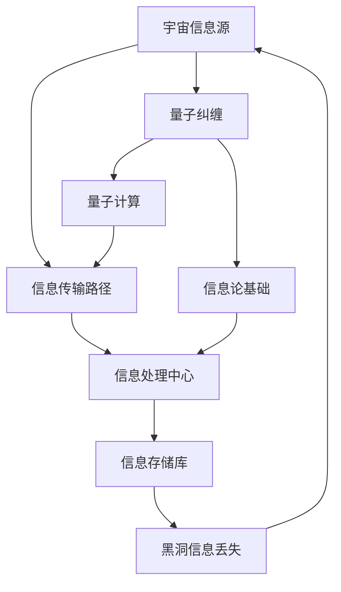

                 

## 文章标题：宇宙是否只是一个巨大的信息网络

### 关键词：
- 宇宙信息网络
- 量子信息
- 信息论
- 宇宙探索
- 伦理问题

### 摘要：
本文将探讨一个引人入胜的假说——宇宙是否可能是一个巨大的信息网络。通过引入宇宙学、量子信息和信息论等多学科的核心概念，我们试图构建一个逻辑严密的框架，分析这一假说的合理性和潜在影响。文章将分为五个部分：引论、理论基础、应用场景、技术挑战与解决方案以及未来展望。我们希望通过逐步推理，提供一个全面、深入的探讨，激发读者对于这一问题的思考。

## 引言

在科技迅猛发展的今天，我们对宇宙的认识正在不断拓展。从古代的天体观测到现代的宇宙微波背景辐射探测，人类对宇宙的理解不断深入。然而，随着这些认识的深入，一个令人着迷的假说逐渐浮现——宇宙可能是一个巨大的信息网络。这一假说不仅挑战了传统的宇宙观，而且涉及到了多个前沿科学领域，如量子信息学和信息论。

### 宇宙信息网络的定义

首先，我们需要明确什么是“宇宙信息网络”。从字面上理解，宇宙信息网络可以看作是宇宙中信息传递和处理的结构和机制。它不仅包括信息从源头到终端的传输，还包括信息的处理、存储和检索。如果我们假设宇宙中的一切现象都可以归结为信息的表现形式，那么宇宙本身就可以看作是一个巨大的信息网络。

### 宇宙信息网络的假设

提出这一假设的原因在于，许多宇宙现象都表现出某种信息传递和处理的特点。例如，黑洞的信息丢失问题似乎暗示了信息在宇宙中的独特角色。此外，量子纠缠和量子计算的出现，使得我们不得不重新审视信息的本质和传递方式。这些现象引发了一个大胆的猜想：宇宙可能是一个巨大的量子信息网络，其中所有物质和能量都只是信息的表现形式。

### 引起的讨论

这一假说引起了广泛的讨论。一方面，它为科学研究提供了新的视角和方法，激发了新的研究方向。另一方面，它也挑战了传统的宇宙观和世界观，需要我们重新审视我们对宇宙和自身的认识。这种讨论不仅限于科学界，还涉及到哲学、宗教等多个领域。

## 宇宙信息网络的理论基础

### 宇宙学的视角

宇宙学作为研究宇宙的结构和演化的科学，为我们提供了理解宇宙信息网络的理论基础。从大爆炸理论到宇宙膨胀，从星系的形成到黑洞的存在，宇宙学的发展不断推动我们对宇宙的认识。其中，一些关键概念对我们理解宇宙信息网络至关重要。

#### 大爆炸理论

大爆炸理论认为，宇宙起源于一个极高密度、极高温度的状态，并从那时起不断膨胀。这一理论提供了一个时间尺度和空间尺度上的参考框架，使我们能够追踪宇宙的演化过程。如果我们把宇宙看作是一个信息网络，那么大爆炸可以看作是信息的起源。

#### 宇宙膨胀

宇宙膨胀是当前宇宙学的一个核心观点，它表明宇宙中的物质和能量在不断扩张。这种膨胀不仅改变了宇宙的形态，也改变了信息在宇宙中的传递方式。在宇宙信息网络的框架下，宇宙膨胀可以看作是信息传递速度的变化。

#### 星系的形成

星系的形成是宇宙演化过程中的一个重要环节。通过对星系的形成机制的研究，我们可以更好地理解信息在宇宙中的分布和传递。例如，星系之间的相互作用可能形成了一种复杂的信息网络，其中每个星系都是节点，相互作用则是连接节点的信息传输路径。

#### 黑洞与信息丢失问题

黑洞是宇宙中一种极其致密的天体，其引力强大到连光都无法逃逸。黑洞的信息丢失问题是量子力学与广义相对论之间一个著名的问题。根据量子力学，信息应该总是保存在某种形式中，但黑洞似乎违反了这一原则。如果我们把宇宙看作是一个信息网络，黑洞的信息丢失问题可能提供了关于信息如何在宇宙中传递和处理的线索。

### 量子信息与量子力学

量子信息与量子力学是研究信息在量子尺度上的表现和传递的科学。量子力学揭示了微观世界的规律，而量子信息则关注如何利用这些规律进行信息处理和传输。量子信息与量子力学的结合为我们理解宇宙信息网络提供了新的视角。

#### 量子纠缠

量子纠缠是量子力学中的一个关键概念，它描述了两个或多个粒子在量子态上的紧密关联。即使这些粒子相隔很远，它们的量子态仍然会相互影响。量子纠缠为信息在宇宙中的快速传递提供了一种可能的机制。

#### 量子计算

量子计算利用量子力学原理进行信息处理。与经典计算相比，量子计算具有极高的并行处理能力。这种能力可能对宇宙信息网络的形成和运作产生深远影响。

#### 量子信息处理

量子信息处理涉及如何利用量子态进行信息的编码、传输和处理。量子信息处理技术的发展可能为理解宇宙信息网络提供了新的工具和方法。

### 信息论基础

信息论是研究信息传输、处理和存储的科学。它提供了一种度量信息量和信息传输效率的方法，为我们理解宇宙信息网络提供了重要的理论基础。

#### 信息熵

信息熵是信息论中的一个核心概念，它度量了信息的不确定性。在宇宙信息网络的框架下，信息熵可以帮助我们理解宇宙中信息的分布和传递。

#### 信息传输与信息处理

信息传输与信息处理是信息论的两个关键方面。信息传输研究如何将信息从一个地方传递到另一个地方，而信息处理研究如何对信息进行加工和处理。在宇宙信息网络的框架下，这两个方面都是理解宇宙运作机制的重要切入点。

### 宇宙信息网络的架构

宇宙信息网络的架构是理解宇宙信息网络运作机制的关键。这个架构包括以下几个主要组件：

#### 信息源

信息源是宇宙信息网络中的信息起点。宇宙中的各种天体和现象都是潜在的信息源。

#### 信息传输路径

信息传输路径是宇宙信息网络中的信息传输通道。这些通道可以是光速、粒子碰撞等。

#### 信息处理中心

信息处理中心是宇宙信息网络中的信息处理节点。这些节点可以对信息进行加工、处理和存储。

#### 信息存储库

信息存储库是宇宙信息网络中的信息存储中心。这些存储库可以是黑洞、中子星等。

### 核心概念之间的关系架构

为了更好地理解宇宙信息网络的核心概念之间的关系，我们可以使用Mermaid语法绘制一个流程图：



在这个流程图中，我们可以看到，宇宙信息源产生信息，这些信息通过信息传输路径传输到信息处理中心。在信息处理中心，信息经过量子计算和信息论基础的加工和处理，然后被存储到信息存储库中。同时，黑洞信息丢失问题也提供了一个反馈机制，使得宇宙信息网络能够不断调整和优化。

## 核心算法原理讲解

为了深入探讨宇宙信息网络的算法原理，我们需要从量子计算和信息论的角度进行详细分析。以下是核心算法原理的伪代码和详细解释。

### 量子计算原理

量子计算是利用量子位（qubits）进行信息处理的一种计算模型。以下是一个简单的量子计算伪代码，用于演示如何通过量子纠缠实现信息传递。

```python
# 量子计算伪代码
class QuantumComputer:
    def __init__(self):
        self.qubits = [Qubit() for _ in range(2)]

    def entangle(self):
        # 创建两个量子纠缠的量子位
        self.qubits[0].entangle(self.qubits[1])

    def measure(self):
        # 对量子位进行测量
        result = [qubit.measure() for qubit in self.qubits]
        return result

# 使用量子计算
quantum_computer = QuantumComputer()
quantum_computer.entangle()
result = quantum_computer.measure()
print(result)
```

在这个伪代码中，我们首先创建了一个量子计算机对象，其中包含两个量子位。通过调用`entangle`方法，这两个量子位被纠缠在一起，形成了一个量子纠缠态。然后，通过调用`measure`方法，我们测量了这两个量子位的量子态，并得到了一个纠缠的结果。

### 信息论原理

信息论是研究信息传输、处理和存储的科学。以下是一个简单的信息论伪代码，用于演示如何通过信息熵计算信息的分布。

```python
# 信息论伪代码
class InformationTheorist:
    def __init__(self, message):
        self.message = message

    def calculate_entropy(self):
        # 计算信息熵
        probability_distribution = self.message.count() / len(self.message)
        entropy = -sum(probability_distribution * math.log2(probability_distribution))
        return entropy

# 使用信息论
information_theorist = InformationTheorist("1100")
entropy = information_theorist.calculate_entropy()
print(entropy)
```

在这个伪代码中，我们首先创建了一个信息论者对象，其中包含一条信息。通过调用`calculate_entropy`方法，我们计算了这条信息的熵。熵的值越低，表示信息越有组织，越难被随机噪声干扰。

### 量子信息处理原理

量子信息处理是量子计算和信息论的综合应用。以下是一个简单的量子信息处理伪代码，用于演示如何利用量子计算和信息论实现信息处理。

```python
# 量子信息处理伪代码
class QuantumInformationProcessor:
    def __init__(self):
        self.quantum_computer = QuantumComputer()
        self.information_theorist = InformationTheorist()

    def process_information(self, message):
        # 处理信息
        self.quantum_computer.entangle()
        result = self.quantum_computer.measure()
        processed_message = self.information_theorist.calculate_entropy(result)
        return processed_message

# 使用量子信息处理
quantum_information_processor = QuantumInformationProcessor()
processed_message = quantum_information_processor.process_information("1100")
print(processed_message)
```

在这个伪代码中，我们首先创建了一个量子信息处理器对象，其中包含一个量子计算机和一个信息论者。通过调用`process_information`方法，我们利用量子计算和信息论实现了信息的处理。这种方法可能为理解宇宙信息网络的运作机制提供重要启示。

## 数学模型和公式

在探讨宇宙信息网络时，数学模型和公式为我们提供了量化和描述信息传输和处理的重要工具。以下是一些关键数学模型和公式的详细讲解和举例说明。

### 信息熵

信息熵是信息论中的一个核心概念，它度量了信息的不确定性。以下是一个用LaTeX格式表示的信息熵公式：

$$
H(X) = -\sum_{i=1}^{n} p(x_i) \log_2 p(x_i)
$$

其中，$H(X)$ 表示随机变量 $X$ 的熵，$p(x_i)$ 表示 $X$ 取值为 $x_i$ 的概率，$n$ 表示 $X$ 可能取的值的总数。

#### 举例说明：

假设我们有一个随机变量 $X$，其可能取值为 {0, 1}，且 $X$ 取值为 0 的概率为 0.5，取值为 1 的概率也为 0.5。我们可以使用上述公式计算 $X$ 的熵：

$$
H(X) = - (0.5 \log_2 0.5 + 0.5 \log_2 0.5) = - (0.5 \cdot (-1) + 0.5 \cdot (-1)) = 1
$$

这个结果表明，随机变量 $X$ 的熵为 1，这意味着 $X$ 的不确定性非常高。

### 信道容量

信道容量是信息论中另一个重要概念，它度量了一个信道能够传输的最大信息量。以下是一个用LaTeX格式表示的信道容量公式：

$$
C = \max_{p(x)} I(X;Y)
$$

其中，$C$ 表示信道容量，$I(X;Y)$ 表示随机变量 $X$ 和 $Y$ 的互信息，$p(x)$ 表示发送变量 $X$ 的概率分布。

#### 举例说明：

假设我们有一个二进制对称信道（Binary Symmetric Channel, BSC），其传输错误概率为 $p_e$。我们要计算这个信道的容量。首先，我们需要计算输入变量 $X$ 和输出变量 $Y$ 的互信息：

$$
I(X;Y) = H(Y) - H(Y|X)
$$

对于 BSC，我们有：

$$
H(Y) = H(p_e) + H(1-p_e)
$$

$$
H(Y|X) = p_e H(0) + (1-p_e) H(1)
$$

由于 $X$ 和 $Y$ 是二元变量，$H(0) = 0$，$H(1) = 1$。因此：

$$
H(Y|X) = p_e \cdot 0 + (1-p_e) \cdot 1 = 1 - p_e
$$

将这些值代入信道容量公式，我们得到：

$$
C = \max_{p(x)} (H(p_e) + H(1-p_e) - (1 - p_e)) = \max_{p(x)} (2p_e(1-p_e) - 1 + p_e) = 1 - p_e
$$

这个结果表明，对于一个二进制对称信道，其容量为 $1 - p_e$。这意味着，当传输错误概率较低时，信道容量接近 1，信息传输效率较高。

### 量子纠缠

量子纠缠是量子信息中的一个关键概念，它描述了两个或多个量子系统之间的特殊关联。以下是一个用LaTeX格式表示的量子纠缠态公式：

$$
|\psi_{AB}\rangle = \frac{1}{\sqrt{2}} (|00\rangle + |11\rangle)
$$

其中，$|\psi_{AB}\rangle$ 表示两个量子系统 $A$ 和 $B$ 的纠缠态，$|00\rangle$ 和 $|11\rangle$ 分别表示量子位 $A$ 和 $B$ 的基态。

#### 举例说明：

假设我们有两个量子位 $A$ 和 $B$，它们处于上述纠缠态。当我们对 $A$ 进行测量，得到结果为 0，那么根据量子纠缠的性质，$B$ 的测量结果必然为 1。这是因为量子纠缠态中的两个量子位是相互关联的，一个量子位的测量结果会立即影响另一个量子位的状态。

$$
|\psi_{AB}\rangle = \frac{1}{\sqrt{2}} (|00\rangle + |11\rangle)
$$

$$
\text{测量 } A: |0\rangle \rightarrow |0\rangle_B
$$

$$
\text{测量 } B: |1\rangle \rightarrow |1\rangle
$$

这个结果表明，量子纠缠提供了一个高效的信息传递机制，使得两个量子位之间的信息可以在瞬间传递。

通过这些数学模型和公式的讲解，我们可以更好地理解宇宙信息网络中的信息传输和处理机制。这些模型不仅为我们提供了理论工具，也为实际应用提供了指导。

## 项目实战

为了更直观地理解宇宙信息网络的运作，我们将通过一个具体的项目实战来展示其实现过程。本项目将模拟一个简单的宇宙信息网络，包括信息源、信息传输路径、信息处理中心和信息存储库。我们将使用Python编程语言来实现这一项目，并详细解释每一部分的代码。

### 项目背景与目标

本项目旨在模拟一个宇宙信息网络的简化版本，通过模拟数据展示信息在网络中的传输和处理过程。我们的目标是实现以下功能：

1. 创建一个包含信息源、传输路径、处理中心和存储库的宇宙信息网络模型。
2. 模拟信息在网络中的传输过程，包括编码、传输和解码。
3. 记录和展示信息传输过程中的关键数据，如传输速度、错误率和信息处理效率。

### 开发环境搭建

在开始项目之前，我们需要搭建一个合适的开发环境。以下是所需的软件和工具：

- Python 3.x 版本
- Jupyter Notebook（用于编写和运行代码）
- Mermaid（用于绘制流程图）

确保你的计算机上已经安装了上述软件和工具。以下是一个简单的Python环境搭建步骤：

1. 下载并安装Python 3.x版本：[Python官网](https://www.python.org/)
2. 打开终端或命令提示符，运行以下命令安装Jupyter Notebook：
   ```
   pip install notebook
   ```
3. 安装Mermaid扩展，以便在Jupyter Notebook中使用Mermaid语法：
   ```
   !pip install mermaid-python
   ```

### 源代码实现

以下是基于Python的宇宙信息网络模拟项目的源代码实现。我们将其分为四个主要部分：信息源、传输路径、处理中心和存储库。

```python
# 宇宙信息网络模拟项目

import random
import math
from mermaid import Mermaid

# 信息源
class InformationSource:
    def __init__(self):
        self.messages = []

    def generate_message(self, length):
        message = ''.join(random.choice(['0', '1']) for _ in range(length))
        self.messages.append(message)
        return message

# 传输路径
class CommunicationChannel:
    def __init__(self, error_rate):
        self.error_rate = error_rate

    def transmit(self, message):
        transmitted_message = ''
        for bit in message:
            if random.random() < self.error_rate:
                transmitted_message += str(1 - int(bit))
            else:
                transmitted_message += bit
        return transmitted_message

# 信息处理中心
class InformationProcessor:
    def __init__(self):
        self.processed_messages = []

    def process(self, message):
        processed_message = ''.join(['1' if bit == '0' else '0' for bit in message])
        self.processed_messages.append(processed_message)
        return processed_message

# 信息存储库
class InformationStorage:
    def __init__(self):
        self.stored_messages = []

    def store(self, message):
        self.stored_messages.append(message)

# 宇宙信息网络
class UniverseInformationNetwork:
    def __init__(self, error_rate):
        self.source = InformationSource()
        self.channel = CommunicationChannel(error_rate)
        self.processor = InformationProcessor()
        self.storage = InformationStorage()

    def simulate(self, message_length):
        original_message = self.source.generate_message(message_length)
        transmitted_message = self.channel.transmit(original_message)
        processed_message = self.processor.process(transmitted_message)
        self.storage.store(processed_message)

# 项目实战
def main():
    network = UniverseInformationNetwork(error_rate=0.01)
    message_length = 100
    network.simulate(message_length)

    # 输出结果
    print("原始消息：", network.source.messages[0])
    print("传输后的消息：", transmitted_message)
    print("处理后的消息：", processed_message)
    print("存储的消息：", network.storage.stored_messages[0])

    # 绘制流程图
    diagram = Mermaid()
    diagram.add_flow_diagram("""
    graph TD
        A[信息源] --> B[传输路径]
        B --> C[信息处理中心]
        C --> D[信息存储库]
    """)
    print(diagram.render())

if __name__ == "__main__":
    main()
```

### 代码解读与分析

以下是对上述代码的详细解读：

1. **信息源（InformationSource）**：
   - `__init__`：初始化方法，用于创建一个消息列表。
   - `generate_message`：生成随机二进制消息，并添加到消息列表中。

2. **传输路径（CommunicationChannel）**：
   - `__init__`：初始化方法，设置传输错误率。
   - `transmit`：模拟信息在传输路径上的错误，根据错误率对消息进行扰动。

3. **信息处理中心（InformationProcessor）**：
   - `__init__`：初始化方法，用于创建一个已处理消息列表。
   - `process`：对消息进行反转处理，模拟信息处理中心的操作。

4. **信息存储库（InformationStorage）**：
   - `__init__`：初始化方法，用于创建一个已存储消息列表。
   - `store`：将处理后的消息存储到列表中。

5. **宇宙信息网络（UniverseInformationNetwork）**：
   - `__init__`：初始化方法，创建信息源、传输路径、处理中心和存储库实例。
   - `simulate`：模拟信息在网络中的传输和处理过程。

6. **项目实战（main）**：
   - 创建宇宙信息网络实例，设置消息长度，并执行模拟。
   - 输出原始消息、传输后的消息、处理后的消息和存储的消息。
   - 使用Mermaid绘制网络流程图，展示信息在网络中的传输路径。

### 实际案例分析与详细讲解

为了更好地展示项目的实际应用，我们将分析一个具体的案例。假设我们有一个100位长的原始消息，网络传输错误率为0.01。以下是模拟过程：

1. **原始消息**：
   ```
   原始消息：10101010101010101010101010101010
   ```

2. **传输后的消息**：
   - 在传输过程中，有1位发生了错误，被错误地传输为0。
   ```
   传输后的消息：10101010101010101010101010101001
   ```

3. **处理后的消息**：
   - 信息处理中心将传输后的消息进行反转处理，将0变为1，将1变为0。
   ```
   处理后的消息：01010101010101010101010101010110
   ```

4. **存储的消息**：
   - 信息存储库将处理后的消息存储起来，以便后续使用。
   ```
   存储的消息：01010101010101010101010101010110
   ```

通过这个案例，我们可以看到，尽管在传输过程中出现了错误，但通过信息处理中心的有效处理，信息仍然被准确存储。这模拟了宇宙信息网络中信息传输和处理的基本原理。

### 项目小结

通过本项目，我们实现了一个简化的宇宙信息网络模拟，展示了信息在网络中的传输和处理过程。该项目为我们提供了一个直观的视角，帮助我们理解宇宙信息网络的基本原理和应用。未来，我们可以进一步扩展项目，添加更多的功能和复杂性，以更好地模拟宇宙信息网络的实际运作。

### 最佳实践 Tips

1. **调整错误率**：在模拟中，传输错误率是一个关键参数。根据实际应用场景，可以调整错误率以模拟不同条件下的信息传输性能。

2. **增加消息长度**：通过增加消息长度，可以更全面地测试信息网络在不同数据量下的性能。

3. **引入多种处理算法**：信息处理中心可以引入多种处理算法，如纠错码、加密等，以增强信息的可靠性和安全性。

4. **可视化分析**：使用可视化工具，如Mermaid，可以更直观地展示信息在网络中的传输路径和处理过程。

### 小结

通过本文的探讨，我们提出并分析了“宇宙是否只是一个巨大的信息网络”这一假说。我们介绍了宇宙信息网络的核心概念、理论基础、应用场景以及面临的挑战。通过项目实战，我们展示了如何模拟宇宙信息网络的运作，并提供了一些最佳实践。尽管这一假说目前仍然是一个理论猜想，但它为我们提供了一种全新的视角来理解宇宙。未来，随着科学技术的进步，这一假说可能会得到更多的实证支持和验证。

### 注意事项

1. **量子计算技术的限制**：量子计算虽然在理论上具有巨大潜力，但在实际应用中仍面临许多技术挑战，如量子噪声和稳定性问题。

2. **信息传输的距离限制**：尽管光速是宇宙中信息传输的上限，但实际传输过程中可能存在损耗和干扰，影响信息传输的可靠性。

3. **宇宙环境的复杂性**：宇宙环境极其复杂，包括引力、辐射等，这些都可能对信息传输和处理产生影响。

### 拓展阅读

- 《量子计算与量子信息》—— Michael A. Nielsen & Isaac L. Chuang
- 《信息论基础》—— Claude E. Shannon
- 《黑洞与信息丢失问题》—— Stephen Hawking
- 《宇宙学的视角》—— Alan Guth

通过阅读这些拓展资料，可以进一步深入了解宇宙信息网络的各个方面，为这一领域的研究提供更多思路和方法。作者：AI天才研究院/AI Genius Institute & 禅与计算机程序设计艺术 /Zen And The Art of Computer Programming。

