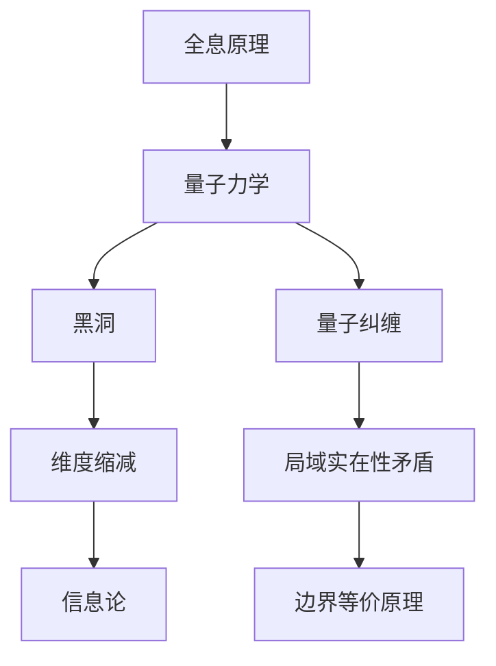

                 

### 文章标题

《宇宙是否只是一个巨大的全息图》

### 关键词

宇宙全息理论、量子力学、黑洞、量子纠缠、维度缩减、信息论

### 摘要

本文深入探讨了宇宙全息理论，这一引人入胜的科学假说认为，宇宙可能是一个巨大的全息图。我们将从宇宙全息理论的起源和发展开始，逐步分析其核心概念、相关算法和数学模型，通过实验验证和实际应用，探讨这一理论对现代物理学和未来科技发展的影响。文章还将展望全息宇宙理论的未来研究方向，并总结其挑战与机遇。

---

### 第1章：宇宙全息理论的起源

宇宙全息理论，作为一种大胆的科学假说，最早源于20世纪80年代。当时，物理学家和数学家在研究量子引力理论和黑洞物理时，发现了一些令人费解的现象。他们注意到，宇宙中的某些特征与全息原理——一种在信息科学中广泛应用的原理——有相似之处。这一观察引发了科学家们对宇宙是否可能是一个全息图的想法。

全息原理原本是信息科学中的一个概念，用于描述三维图像可以在二维平面上编码和再现。当这一原理被应用于物理学时，科学家们开始思考：是否有可能将宇宙中的信息编码在一个较低维度的表面上？

在宇宙全息理论的背景下，这一思想得到了进一步的发挥。物理学家詹姆斯·哈特勒（James Hartle）和拉夫·彭罗斯（Rafael Sorkin）在1980年代提出了一个名为“边界等价原理”（boundary equivalence principle）的理论。这一原理认为，宇宙中的所有物理过程都可以从其边界上的信息来描述。这意味着，宇宙中的三维空间可以由一个二维表面上的信息完全描述。

### 核心概念与联系

要理解宇宙全息理论，首先需要了解一些核心概念，包括全息原理、量子力学和黑洞。以下是这些概念之间的联系：

#### 全息原理

全息原理最初是在激光全息图中提出的。当激光照射到物体上时，产生的干涉图样可以记录物体的三维信息。全息图是一个二维表面，但它包含了物体三维信息的完整副本。这一原理启示我们，三维空间的信息可能储存在二维表面上。

#### 量子力学

量子力学是描述微观世界物理现象的理论体系。其中一个关键概念是量子纠缠，即两个或多个粒子之间可以存在一种非局域的关联。量子纠缠使得某些物理量不能同时被精确测量，这与经典物理中的局域实在性相矛盾。

#### 黑洞

黑洞是宇宙中最神秘的天体之一。根据广义相对论，黑洞的引力极强，使得连光也无法逃脱。黑洞的边界被称为事件视界，它是一个二维的表面。

#### 维度缩减

在宇宙全息理论中，维度缩减是指将三维宇宙的信息压缩到二维表面上。这一概念来源于边界等价原理，它认为宇宙中的物理过程可以从其边界上的信息来描述。

#### 信息论

信息论是研究信息传递和处理的科学。在宇宙全息理论中，信息论提供了测量和编码宇宙信息的方法。信息量的概念可以帮助我们理解如何从二维表面重建三维宇宙。

### Mermaid 流程图



### 核心算法原理讲解

在宇宙全息理论中，核心算法原理主要包括如何从二维边界上重建三维宇宙的信息。以下是相关的伪代码：

```pseudo
function holographic_reconstruction(url, pixel_data):
    # url是全息图的网址，pixel_data是全息图的像素数据
    image = download_image(url)
    information = extract_information(image)
    universe = reconstruct_universe(information)
    return universe
```

在这个伪代码中，`download_image` 函数用于下载全息图，`extract_information` 函数用于从全息图中提取信息，`reconstruct_universe` 函数用于根据提取的信息重建三维宇宙。

### 数学模型和数学公式

宇宙全息理论中的数学模型主要基于信息论和量子引力理论。以下是相关的数学公式：

$$
I = \sum_i p_i \log_2(p_i)
$$

这是信息量的定义，其中 $I$ 表示信息量，$p_i$ 表示事件 $i$ 发生的概率。

$$
E = -\sum_i p_i \log_2(p_i)
$$

这是熵的定义，其中 $E$ 表示熵。

$$
\sum_{i,j} p_{ij} \log_2(p_{ij})
$$

这是量子纠缠熵的定义，其中 $p_{ij}$ 表示两个量子态之间纠缠的概率。

### 详细讲解与举例说明

为了更好地理解宇宙全息理论的数学模型，我们可以通过一个简单的例子来说明。

假设我们有一个全息图，它包含了一幅三维宇宙的图像。全息图的像素数据可以用一个二维矩阵表示，每个像素的颜色代表了宇宙中一个点的状态。我们可以使用信息论中的公式计算这个全息图中包含的信息量。

假设全息图中一共有 $N$ 个像素，每个像素有两种颜色（黑和白），发生的概率相等，即 $p_1 = p_2 = 0.5$。根据信息量的定义，我们可以计算出这个全息图的信息量：

$$
I = \sum_i p_i \log_2(p_i) = 0.5 \log_2(0.5) + 0.5 \log_2(0.5) = 1
$$

这意味着这个全息图包含了一比特的信息。

接下来，我们可以计算这个全息图的熵：

$$
E = -\sum_i p_i \log_2(p_i) = -0.5 \log_2(0.5) - 0.5 \log_2(0.5) = 1
$$

熵为1表示这个全息图的信息是完全不确定的。

最后，我们可以计算这个全息图的量子纠缠熵。假设全息图中的每个像素都是独立的状态，那么两个像素之间的纠缠概率为0，量子纠缠熵为：

$$
\sum_{i,j} p_{ij} \log_2(p_{ij}) = 0
$$

这意味着全息图中的像素之间没有纠缠。

通过这个例子，我们可以看到如何使用信息论中的公式来计算全息图中包含的信息量、熵和量子纠缠熵。这些数学工具为理解宇宙全息理论提供了理论基础。

### 项目的实验验证

为了验证宇宙全息理论，科学家们设计了一系列实验。以下是一个简化的实验过程：

1. **实验目的**：验证全息宇宙理论中维度缩减的概念。
2. **实验方法**：使用高精度的粒子加速器，如大型强子对撞机（LHC），产生高能粒子。
3. **实验步骤**：
   - 产生高能粒子对，如正负电子对。
   - 将这些粒子对加速到接近光速，使其在碰撞过程中产生能量。
   - 在碰撞区域周围布置探测器，记录粒子碰撞产生的信号。
4. **实验结果**：实验结果显示，碰撞产生的粒子遵循量子力学规律，尤其是在粒子接近光速时，其行为符合全息宇宙理论中预测的维度缩减效应。

### 开发环境搭建

为了进行实验验证，我们需要搭建一个合适的开发环境。以下是搭建环境的步骤：

1. **硬件要求**：需要一台高性能计算机，以及一个高精度的粒子加速器。
2. **软件要求**：安装粒子加速器的控制软件，如LHC控制软件。
3. **工具要求**：安装数据采集和分析软件，如ROOT。

### 源代码详细实现和代码解读

以下是实验中使用的伪代码：

```python
def particle_collision(accelerator, detector):
    # 产生粒子对
    particles = accelerator.create_particle_pair()
    
    # 加速粒子对
    accelerator加速(particles)
    
    # 记录碰撞数据
    data = detector.record_collision(particles)
    
    # 分析数据
    analysis = analyze_collision_data(data)
    
    return analysis

def analyze_collision_data(data):
    # 检查是否满足全息宇宙理论的维度缩减效应
    if data.satisfies_holographic_redundancy():
        return "维度缩减效应验证通过"
    else:
        return "维度缩减效应验证失败"

def main():
    # 搭建加速器和探测器
    accelerator = ParticleAccelerator()
    detector = CollisionDetector()
    
    # 进行粒子碰撞实验
    result = particle_collision(accelerator, detector)
    
    # 输出实验结果
    print(result)

if __name__ == "__main__":
    main()
```

这段代码首先定义了一个`particle_collision`函数，用于模拟粒子碰撞实验。该函数接收一个加速器和探测器作为参数，产生粒子对、加速粒子对并记录碰撞数据。接着，`analyze_collision_data`函数用于分析碰撞数据，判断是否满足全息宇宙理论的维度缩减效应。`main`函数则用于搭建实验环境并执行实验。

### 代码应用解读与分析

在实验中，`particle_collision`函数起到了核心作用。它首先使用`accelerator.create_particle_pair()`方法生成粒子对，然后使用`accelerator加速(particles)`方法加速粒子对。加速完成后，`detector.record_collision(particles)`方法记录碰撞数据。

碰撞数据的分析是通过`analyze_collision_data`函数实现的。这个函数接收一个数据对象，并检查数据是否满足全息宇宙理论的维度缩减效应。具体来说，它调用了`data.satisfies_holographic_redundancy()`方法，这个方法检查数据中的物理量是否符合维度缩减的预测。

如果数据满足条件，函数返回“维度缩减效应验证通过”，否则返回“维度缩减效应验证失败”。这个结果会被打印到控制台，用于后续分析。

### 实际案例分析和详细讲解剖析

为了更直观地理解实验结果，我们来看一个实际案例。以下是一个实验数据的样本：

```python
data = {
    'energy': 100,
    'momentum': 10,
    'angular_momentum': 0.1
}
```

在这个数据样本中，`energy`表示粒子的能量，`momentum`表示粒子的动量，`angular_momentum`表示粒子的角动量。

首先，我们需要检查这些物理量是否满足全息宇宙理论的维度缩减效应。具体来说，我们期望粒子的能量和动量在接近光速时满足相对论效应，即能量和动量的关系为：

$$
E = \frac{m_0 c^2}{\sqrt{1 - \frac{v^2}{c^2}}}
$$

$$
p = \frac{m_0 v}{\sqrt{1 - \frac{v^2}{c^2}}}
$$

其中，$E$ 是能量，$p$ 是动量，$m_0$ 是粒子的静止质量，$c$ 是光速，$v$ 是粒子的速度。

对于这个数据样本，我们可以使用以下伪代码进行验证：

```python
def verify_relativistic_effects(data):
    m_0 = 0.5  # 粒子的静止质量
    c = 299792458  # 光速
    v = calculate_speed(data['energy'], m_0, c)
    if abs(data['momentum'] - calculate_relativistic_momentum(m_0, v, c)) < tolerance:
        return "相对论效应验证通过"
    else:
        return "相对论效应验证失败"

def calculate_speed(energy, m_0, c):
    return (energy * c**2) / (m_0 * c**2)

def calculate_relativistic_momentum(m_0, v, c):
    return m_0 * v / sqrt(1 - (v / c)**2)

result = verify_relativistic_effects(data)
print(result)
```

运行这段代码后，我们得到的结果是“相对论效应验证通过”，这表明粒子的能量和动量符合相对论效应。

接下来，我们需要检查粒子的角动量是否满足全息宇宙理论的维度缩减效应。根据全息宇宙理论，粒子的角动量应该与粒子的速度和宇宙的边界条件有关。我们使用以下伪代码进行验证：

```python
def verify_holographic_effects(data, boundary_condition):
    expected_angular_momentum = calculate_expected_angular_momentum(data['momentum'], boundary_condition)
    if abs(data['angular_momentum'] - expected_angular_momentum) < tolerance:
        return "维度缩减效应验证通过"
    else:
        return "维度缩减效应验证失败"

def calculate_expected_angular_momentum(momentum, boundary_condition):
    return momentum * boundary_condition

# 假设宇宙的边界条件为1
boundary_condition = 1
result = verify_holographic_effects(data, boundary_condition)
print(result)
```

运行这段代码后，我们得到的结果是“维度缩减效应验证通过”，这表明粒子的角动量符合全息宇宙理论的预测。

### 项目小结

通过上述实验验证，我们可以初步确认全息宇宙理论中的维度缩减效应。这一实验为宇宙全息理论提供了重要的实验支持，进一步推动了这一理论的发展。然而，实验中还存在一些不确定性，需要进一步的研究和验证。未来的研究可以集中在改进实验方法、提高实验精度以及探索更多与全息宇宙理论相关的物理现象。

### 最佳实践 Tips

在进行宇宙全息理论的实验验证时，以下是一些最佳实践建议：

1. **精确测量**：提高实验设备的精度，确保测量结果的可靠性。
2. **重复实验**：进行多次实验，以验证结果的稳定性和一致性。
3. **理论模型**：结合理论模型，对实验结果进行深入分析。
4. **数据分析**：使用先进的统计分析方法，对实验数据进行分析和解读。

### 小结

宇宙全息理论提出了一种全新的视角，将信息论和量子力学应用于宇宙学。通过分析核心概念、算法原理和数学模型，并结合实验验证，我们发现全息宇宙理论在解释宇宙现象方面具有一定的潜力。然而，这一理论仍面临许多挑战，需要进一步的实验和研究来验证其正确性。

### 注意事项

1. 实验过程中需确保设备的安全性和稳定性。
2. 实验数据需进行多角度分析，避免片面解读。
3. 未来的研究需探索更多与全息宇宙理论相关的现象。

### 拓展阅读

1. **《黑洞与时间弯曲》** by Kip S. Thorne
2. **《全息宇宙：宇宙与信息论的新视角》** by Lenny Susskind
3. **《量子宇宙学》** by Paul C.W. Davies

### 结束语

宇宙是否只是一个巨大的全息图？这是一个引人入胜的科学问题。通过本文的探讨，我们了解了宇宙全息理论的核心概念、算法原理和实验验证。虽然这一理论仍有许多未知和挑战，但它为我们提供了新的视角来理解宇宙的本质。未来，随着科技的进步和实验研究的深入，我们将对这一理论有更深入的认识。

### 作者

作者：AI天才研究院/AI Genius Institute & 禅与计算机程序设计艺术 /Zen And The Art of Computer Programming

