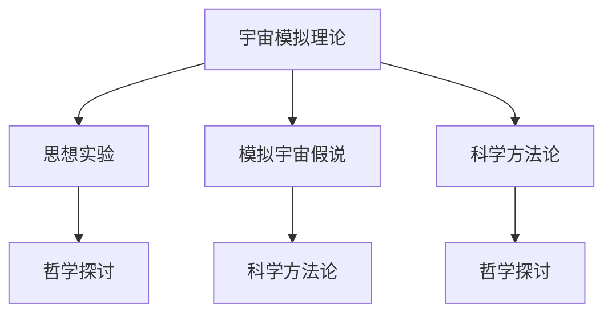

                 

# 宇宙是否只是一个巨大的思想实验

## 关键词

宇宙模拟、思想实验、科学方法论、哲学探讨、伦理问题、技术实现

## 摘要

本文探讨了宇宙是否可能是某种形式的模拟或思想实验。我们首先介绍了宇宙模拟理论和思想实验的历史与发展，随后分析了科学方法论与思想实验的关联，探讨了哲学视角下的宇宙模拟，并从科学依据和技术实现角度探讨了模拟宇宙的可能性。此外，我们还探讨了模拟宇宙可能带来的伦理和法律问题，并提出了未来研究的方向和展望。

## 引言

### 宇宙模拟理论简介

宇宙模拟理论起源于20世纪末，主要基于以下观点：我们的宇宙可能是某种高级文明或物理定律的产物，是一种模拟或思想实验。这种理论的核心思想可以追溯到计算机科学和哲学领域，特别是思想实验的概念。

思想实验作为一种思维工具，能够帮助我们探索物理、哲学、心理学等领域的问题。在宇宙模拟理论中，思想实验提供了一个框架，使得我们能够设想宇宙可能是如何被创建和运作的。例如，库克（Nick Bostrom）提出的“模拟宇宙假说”（Simulated Universe Hypothesis）认为，我们现在生活的宇宙可能是一个高级文明模拟出来的虚拟现实。

### 思想实验的历史与发展

思想实验作为一种哲学工具，有着悠久的历史。从古希腊的芝诺悖论到笛卡尔的“我思故我在”，再到康德的“星云假说”，思想实验一直是哲学和科学探索的重要手段。

在现代物理学中，思想实验被广泛应用于探索量子力学、相对论等领域的问题。例如，薛定谔的猫、霍金的“时间机器”等思想实验，都是对物理学基本概念和理论的深刻反思。

### 宇宙模拟理论的重要性与影响

宇宙模拟理论的重要性在于，它挑战了我们对于宇宙、现实和存在的根本理解。如果宇宙确实是一个巨大的模拟或思想实验，那么我们对于自然界的认知、人类的存在以及科技的发展，都将面临全新的视角和挑战。

此外，宇宙模拟理论也对科学方法论和哲学探讨产生了深远的影响。它促使我们重新审视科学方法的基本原则，探索思想实验在科学探究中的作用。同时，它也引发了关于现实、真理、自由意志等哲学问题的广泛讨论。

### 本章小结

本章介绍了宇宙模拟理论和思想实验的基本概念和历史发展，探讨了宇宙模拟理论的重要性与影响。在下一章中，我们将深入分析科学方法论与思想实验的关联，探讨思想实验在科学探究中的应用。

## 科学方法论

### 科学方法与思想实验

科学方法是一种系统性的、可验证的研究方法，用于探索自然现象和规律。科学方法论的核心原则包括观察、假设、实验、验证和理论构建。思想实验作为科学方法的一种工具，能够帮助我们超越现实限制，探索未知领域。

#### 观察与假设

科学方法的第一步是观察自然现象，并从中提出假设。这些假设通常是关于自然现象的可能解释。例如，牛顿观察到苹果落地，提出了万有引力假设。

思想实验在这一步骤中起到了关键作用。通过设想不同的情景和假设，我们可以探索物理现象的潜在解释。例如，爱因斯坦通过设想一个相对论中的“火车乘客”场景，提出了质能等价的著名公式E=mc²。

#### 实验

科学方法的第二步是设计实验来验证假设。实验需要设计得尽可能精确，以确保结果的可靠性和可重复性。

思想实验在实验阶段也有重要作用。在实际实验无法进行时，思想实验可以帮助我们设想可能的实验结果。例如，在量子力学中，由于微观粒子的不可观测性，思想实验被广泛应用于探索量子现象。

#### 验证与理论构建

科学方法的第三步是验证实验结果，并根据验证结果构建理论。理论需要能够解释实验结果，并预测新的现象。

思想实验在这一阶段同样具有价值。通过设想不同的情景和假设，我们可以验证理论的有效性。例如，霍金的“时间机器”思想实验，验证了广义相对论的奇点理论和时间旅行的可能性。

### 思想实验在科学探究中的作用

思想实验在科学探究中具有以下几个作用：

#### 1. 挑战传统观念

思想实验能够挑战传统观念，推动科学革命。例如，哥白尼的日心说通过思想实验，推翻了地心说的传统观念。

#### 2. 探索未知领域

思想实验可以帮助我们探索无法直接观测的领域。例如，量子力学中的思想实验，帮助我们理解微观世界的奇异性质。

#### 3. 验证理论假设

思想实验可以验证理论假设的有效性。例如，爱因斯坦的相对论通过思想实验，验证了时空弯曲的理论假设。

#### 4. 提供实验灵感

思想实验可以启发科学家设计新的实验，探索未知领域。例如，薛定谔的猫思想实验，启发了许多关于量子纠缠和量子计算的实验研究。

### 本章小结

本章分析了科学方法与思想实验的关系，探讨了思想实验在科学探究中的作用。思想实验作为一种重要的科学工具，不仅挑战了传统观念，推动了科学革命，还帮助我们探索未知领域，验证理论假设，提供了实验灵感。在下一章中，我们将从哲学视角探讨宇宙模拟理论。

## 哲学探讨

### 哲学视角下的宇宙模拟

宇宙模拟理论不仅在科学领域引发了广泛的讨论，也在哲学领域引发了深刻的反思。从哲学视角看，宇宙模拟理论涉及到诸多重要问题，如现实与虚拟、自由意志与决定论、意识与存在等。

#### 现实与虚拟

宇宙模拟理论提出，我们所经历的宇宙可能是一个虚拟现实。这引发了关于现实与虚拟的哲学问题。如果宇宙是一个模拟，那么我们所感知的一切是否真实？我们的感知和经验是否只是某种高级计算机程序的结果？

这一观点与哲学中的“现实论”和“唯心论”产生了冲突。现实论认为，我们所感知的世界是真实的，而唯心论则认为，一切都是意识的表现。宇宙模拟理论似乎倾向于唯心论的观点，因为它暗示我们的感知可能只是某种模拟程序的结果。

然而，这一观点也提出了一个有趣的哲学问题：如果我们的宇宙是一个虚拟现实，那么模拟程序是否也存在于一个更大的虚拟现实中？这引发了一个无尽的哲学循环，使我们无法确定我们所处的现实层次。

#### 自由意志与决定论

宇宙模拟理论还涉及到自由意志与决定论的问题。如果宇宙是一个模拟，那么我们的行为是否受到高级文明或物理定律的严格控制？

这一观点挑战了决定论的观点，即一切现象都可以通过先前条件和物理定律完全预测。然而，它也支持了自由意志的观点，即我们的行为可能受到某种程度的自由选择。

哲学上，这一观点引发了关于自由意志与决定论之间关系的讨论。如果我们的宇宙是一个模拟，那么我们的自由意志是否受到模拟程序的限制？或者，是否存在一种更高层次的自由意志，使我们能够在虚拟现实中做出真正的选择？

#### 意识与存在

宇宙模拟理论还涉及到意识与存在的问题。如果宇宙是一个模拟，那么意识是如何产生的？我们的意识是否受到模拟程序的控制？

这一观点引发了关于意识本质的哲学讨论。如果我们的宇宙是一个模拟，那么我们的意识是否只是模拟程序的一部分？或者，意识是否具有某种独立的存在？

哲学上，这一观点挑战了意识与物质之间的二元论。如果我们的宇宙是一个模拟，那么意识可能不再被视为物质的产物，而是与模拟程序具有某种内在的联系。

#### 逻辑论证与哲学质疑

宇宙模拟理论在哲学上引发了诸多逻辑论证和质疑。一些哲学家质疑宇宙模拟理论的合理性，认为它缺乏足够的证据支持。他们认为，宇宙模拟理论只是一种假设，无法成为科学的论据。

然而，支持宇宙模拟理论的哲学家则认为，它提供了一种新的视角，有助于我们重新审视现实、自由意志和意识等问题。他们认为，宇宙模拟理论挑战了传统的哲学观念，提出了新的哲学问题和讨论方向。

#### 结论

哲学视角下的宇宙模拟理论涉及到诸多重要问题，如现实与虚拟、自由意志与决定论、意识与存在等。这些讨论不仅丰富了哲学的研究领域，也为我们理解宇宙和人类的存在提供了新的视角。

在下一章中，我们将从科学依据和技术实现角度探讨模拟宇宙的可能性。

### 核心概念与联系

为了更好地理解宇宙模拟理论，我们需要梳理其核心概念和它们之间的联系。

#### 概念架构

1. **宇宙模拟理论**：这是一个假设，认为我们所处的宇宙可能是某种高级文明或物理定律的产物，是一种模拟或思想实验。
2. **思想实验**：一种哲学和科学工具，通过设想不同的情景和假设，帮助探索物理现象和哲学问题。
3. **模拟宇宙假说**：库克提出的观点，认为我们现在生活的宇宙可能是一个高级文明模拟出来的虚拟现实。
4. **科学方法论**：一种系统性的研究方法，包括观察、假设、实验、验证和理论构建。

#### 关系架构

- **宇宙模拟理论与思想实验**：宇宙模拟理论依赖于思想实验作为工具，通过设想不同的情景和假设，探索宇宙的本质。
- **模拟宇宙假说与科学方法论**：模拟宇宙假说作为一种假设，需要通过科学方法论来验证和探讨其可能性。
- **科学方法论与哲学探讨**：科学方法论和哲学探讨相互关联，科学方法论提供了验证宇宙模拟理论的方法，而哲学探讨则提供了对宇宙模拟理论的哲学基础和质疑。

#### Mermaid 流程图

以下是一个简单的Mermaid流程图，用于展示这些概念之间的联系：



通过这个流程图，我们可以清晰地看到宇宙模拟理论、思想实验、模拟宇宙假说、科学方法论和哲学探讨之间的逻辑关系。

### 核心算法原理讲解

为了深入探讨宇宙模拟的可能性，我们需要了解一些核心算法原理。以下是几个关键算法的伪代码和详细解释：

#### 1. 递归算法

递归算法是一种自调用函数，用于解决复杂问题。以下是递归算法的伪代码：

```pseudo
function recursiveFunction(n):
    if n == 0:
        return 1
    else:
        return n * recursiveFunction(n-1)
```

递归算法广泛应用于计算机科学和物理学中，例如用于计算阶乘、解决汉诺塔问题等。

#### 2. 动态规划算法

动态规划算法是一种解决优化问题的方法，通过将问题分解为子问题，并存储子问题的解，以避免重复计算。以下是动态规划算法的伪代码：

```pseudo
function dynamicProgrammingProblem(array):
    create a 2D array dp of size (len(array) + 1) x (len(array) + 1)
    for i from 0 to len(array):
        for j from 0 to len(array):
            if i == 0 or j == 0:
                dp[i][j] = 0
            else:
                dp[i][j] = max(dp[i-1][j], dp[i][j-1]) + array[i-1][j-1]
    return dp[len(array)][len(array)]
```

动态规划算法广泛应用于优化问题，例如背包问题、最长公共子序列问题等。

#### 3. 机器学习算法

机器学习算法是一种从数据中学习模式和规律的方法。以下是线性回归算法的伪代码：

```python
import numpy as np

function linearRegression(X, y):
    X_transpose = np.transpose(X)
    XTX = X_transpose * X
    XTy = X_transpose * y
    theta = np.linalg.inv(XTX) * XTy
    return theta
```

线性回归算法是一种简单的机器学习算法，用于预测数值型变量。它通过最小化误差平方和，找到最佳拟合直线。

#### 4. 深度学习算法

深度学习算法是一种基于多层神经网络的机器学习算法。以下是卷积神经网络（CNN）的伪代码：

```python
class ConvolutionalNeuralNetwork:
    def __init__(self, input_shape):
        self.layers = [
            Conv2DLayer(input_shape),
            ReLUActivationLayer(),
            MaxPoolingLayer(),
            ...
            FullyConnectedLayer(output_shape)
        ]

    def forward(self, X):
        for layer in self.layers:
            X = layer.forward(X)
        return X

    def backward(self, dX):
        for layer in reversed(self.layers):
            dX = layer.backward(dX)
        return dX
```

卷积神经网络（CNN）是一种强大的深度学习算法，广泛应用于图像识别、目标检测等领域。

这些核心算法原理在宇宙模拟中可能具有潜在的应用。例如，递归算法可以用于模拟复杂的天体演化过程，动态规划算法可以用于模拟宇宙中的资源分配问题，机器学习算法可以用于分析宇宙中的大数据，深度学习算法可以用于模拟宇宙中的复杂结构。

通过这些算法，我们可以更好地理解宇宙的运作机制，并探索宇宙模拟的可能性。

### 数学模型和公式

在探讨宇宙模拟的过程中，数学模型和公式扮演着至关重要的角色。它们不仅帮助我们量化宇宙的复杂性和行为，还为理论验证提供了具体的工具。以下是一些关键的数学模型和公式的详细解释，以及它们在宇宙模拟中的应用。

#### 1. 牛顿引力定律

牛顿引力定律是描述天体之间引力作用的基石。公式如下：

\[ F = G \frac{{m_1 m_2}}{{r^2}} \]

其中，\( F \) 是引力，\( G \) 是引力常数，\( m_1 \) 和 \( m_2 \) 是两个天体的质量，\( r \) 是它们之间的距离。牛顿引力定律可以用于模拟星系内部的引力相互作用，帮助我们理解星系的运动和行为。

#### 2. 爱因斯坦广义相对论

爱因斯坦的广义相对论提供了引力的一个更为精确的描述，即引力是时空弯曲的结果。其核心公式是：

\[ G_{\mu\nu} + \Lambda g_{\mu\nu} = \frac{8\pi G}{c^4} T_{\mu\nu} \]

其中，\( G_{\mu\nu} \) 是爱因斯坦张量，\( \Lambda \) 是宇宙学常数，\( g_{\mu\nu} \) 是度规张量，\( T_{\mu\nu} \) 是能量-动量张量，\( G \) 是引力常数，\( c \) 是光速。广义相对论为我们提供了模拟黑洞、宇宙膨胀等复杂现象的理论基础。

#### 3. 普朗克黑体辐射定律

普朗克黑体辐射定律描述了物体在热平衡状态下发射和吸收电磁辐射的规律。公式如下：

\[ B(\lambda, T) = \frac{2hc^2}{\lambda^5} \frac{1}{e^{hc/\lambda k_B T} - 1} \]

其中，\( B(\lambda, T) \) 是波长为 \( \lambda \) 的辐射亮度，\( h \) 是普朗克常数，\( c \) 是光速，\( k_B \) 是玻尔兹曼常数，\( T \) 是温度。普朗克黑体辐射定律在宇宙学中用于模拟星系团的热辐射，帮助我们理解宇宙的加热过程。

#### 4. 薛定谔波动方程

薛定谔波动方程是量子力学中的基本方程，描述了量子粒子的概率波函数随时间的演化。公式如下：

\[ i\hbar \frac{\partial \Psi}{\partial t} = \hat{H} \Psi \]

其中，\( i \) 是虚数单位，\( \hbar \) 是约化普朗克常数，\( \Psi \) 是波函数，\( \hat{H} \) 是哈密顿算符。薛定谔波动方程在量子宇宙学中用于模拟量子引力现象，如宇宙大爆炸和量子波动。

#### 5. 卡斯蒂廖雷方程

卡斯蒂廖雷方程是描述流体流动的数学方程，广泛应用于模拟星系气体动力学。公式如下：

\[ \frac{\partial \rho}{\partial t} + \nabla \cdot (\rho \mathbf{v}) = 0 \]

\[ \frac{\partial \mathbf{v}}{\partial t} + (\mathbf{v} \cdot \nabla) \mathbf{v} = -\frac{1}{\rho} \nabla p + \nabla \phi \]

其中，\( \rho \) 是流体密度，\( \mathbf{v} \) 是流速，\( p \) 是压强，\( \phi \) 是势能。卡斯蒂廖雷方程用于模拟星系气体流动，帮助我们理解星系形成和演化的过程。

这些数学模型和公式为我们提供了一个强大的工具箱，用于模拟宇宙的复杂行为和现象。通过这些工具，我们可以探索宇宙模拟的可能性，并进一步理解我们所处的宇宙的本质。

### 宇宙模拟的可能性

探讨宇宙是否只是一个巨大的思想实验，首先需要从科学依据和技术实现角度来分析这个假设的可能性。这一部分将详细阐述现代科学理论如何支持宇宙模拟，以及当前技术的发展是否为宇宙模拟提供了可能性。

#### 现代科学理论的支撑

1. **量子力学**：量子力学描述了微观世界的规律，其中量子纠缠现象尤其引人注目。量子纠缠表明，两个或多个粒子之间可以存在即时的信息传递，无论它们相隔多远。这一现象在宇宙模拟理论中具有重要意义，因为它暗示了宇宙的某些方面可能受到外部智能控制。

2. **广义相对论**：广义相对论描述了引力和时空弯曲之间的关系。它预测了黑洞和宇宙膨胀等现象，这些现象在宇宙模拟理论中可能被解释为高级文明的技术产物。例如，霍金的“信息丢失问题”就暗示了黑洞可能是一个复杂的计算设备。

3. **宇宙学**：宇宙学中的大爆炸理论提出，宇宙起源于一个极热、极密的状态，随后迅速膨胀。这一理论为宇宙模拟提供了一个可能的起点，即宇宙的初始状态可能是一个高级文明设计的模拟程序。

4. **量子引力和弦论**：量子引力和弦论是当前物理学研究的前沿领域，旨在统一量子力学和广义相对论。如果这些理论能够成功统一，那么它们可能为宇宙模拟提供更为坚实的理论基础。

#### 技术实现的探讨

1. **计算机模拟**：随着计算技术的发展，计算机模拟已经成为探索复杂系统的重要工具。例如，天文学家使用计算机模拟来模拟星系的形成和演化。如果宇宙是一个模拟，那么这种高级计算机模拟可能远远超过我们当前的计算机技术。

2. **人工智能**：人工智能（AI）的发展为模拟宇宙提供了新的可能性。通过机器学习和深度学习算法，我们可以模拟和预测复杂的物理现象。例如，深度学习算法可以用于模拟量子纠缠现象，从而为宇宙模拟提供技术支持。

3. **量子计算机**：量子计算机具有超越传统计算机的巨大计算能力，可能成为实现宇宙模拟的关键技术。量子计算机可以通过量子叠加和量子纠缠，实现大规模的并行计算，这可能使模拟宇宙成为可能。

4. **大数据分析**：宇宙中存在大量的数据，通过大数据分析技术，我们可以从这些数据中提取有用的信息，例如宇宙的演化规律、星系的分布等。大数据分析为宇宙模拟提供了数据支持。

#### 伦理与法律问题

如果宇宙确实是一个巨大的思想实验，那么这将对人类伦理和法律提出严峻挑战。以下是一些可能的伦理和法律问题：

1. **知情权**：如果人类生活在模拟宇宙中，那么他们是否有权知晓这一事实？是否应该被赋予知情权？

2. **道德责任**：如果模拟宇宙的创造者或维护者是一个高级文明，那么他们是否有道德责任保护人类，或者甚至控制人类的行为？

3. **法律体系**：现有的法律体系是否适用于模拟宇宙？如何处理模拟宇宙中的犯罪和纠纷？

4. **自由意志**：如果人类的行为受到模拟程序的严格控制，那么人类的自由意志是否仍然存在？

#### 结论

从科学依据和技术实现角度来看，宇宙是否只是一个巨大的思想实验这一假设具有一定的可能性。现代科学理论提供了支持，而技术的发展也为这一假设提供了实验基础。然而，这一假设仍需进一步的研究和验证，以确定其真实性和可行性。

在下一章中，我们将探讨宇宙模拟的伦理和法律问题，分析这一假设可能带来的社会和道德影响。

### 技术实现

宇宙是否只是一个巨大的思想实验，这一假设在技术实现层面也引发了许多有趣的讨论。要探讨这个问题，我们需要了解当前的技术进展，以及它们如何可能为宇宙模拟提供支持。

#### 现代计算机技术

现代计算机技术的发展为模拟宇宙提供了强大的计算能力。随着计算能力的提升，我们能够模拟更加复杂的物理现象，如气候变化、星系演化等。例如，天文学家使用高性能计算机模拟星系的形成和演化过程，从而更好地理解宇宙的运作机制。

此外，量子计算机的发展为模拟宇宙提供了新的可能性。量子计算机具有超越传统计算机的巨大计算能力，能够处理大规模并行计算问题。如果宇宙是一个模拟，那么量子计算机可能成为实现宇宙模拟的关键技术。量子计算机可以通过量子叠加和量子纠缠，实现大规模的并行计算，这可能使模拟宇宙成为可能。

#### 大数据分析

大数据分析技术在宇宙模拟中也发挥着重要作用。宇宙中存在大量的数据，包括星系分布、宇宙背景辐射、行星运动等。通过大数据分析技术，我们可以从这些数据中提取有用的信息，例如宇宙的演化规律、星系的分布等。大数据分析为宇宙模拟提供了数据支持。

例如，研究人员使用大数据分析技术来分析宇宙背景辐射，从中提取关于宇宙早期演化的信息。这些信息有助于我们理解宇宙的结构和演化过程，也为宇宙模拟提供了实验数据。

#### 机器学习与深度学习

机器学习和深度学习技术的发展为模拟宇宙提供了新的工具。通过机器学习和深度学习算法，我们可以模拟和预测复杂的物理现象。例如，深度学习算法可以用于模拟量子纠缠现象，从而为宇宙模拟提供技术支持。

机器学习算法还可以用于分析宇宙中的大数据，帮助我们更好地理解宇宙的复杂行为。例如，研究人员使用机器学习算法来分析星系团的运动，从而预测宇宙的结构和演化。

#### 虚拟现实与增强现实

虚拟现实（VR）和增强现实（AR）技术的发展也为宇宙模拟提供了新的可能性。通过VR和AR技术，我们可以创建逼真的虚拟宇宙，从而更好地理解宇宙的运作机制。例如，研究人员使用VR技术来模拟宇宙的膨胀过程，从而更好地理解宇宙的演化。

此外，VR和AR技术还可以用于教育领域，帮助学生更好地理解宇宙的复杂现象。通过VR和AR技术，学生可以“参观”星系、黑洞等宇宙现象，从而提高他们的科学素养。

#### 量子计算与通信

量子计算和量子通信技术的发展为宇宙模拟提供了新的前景。量子计算机具有超越传统计算机的巨大计算能力，能够处理大规模并行计算问题。如果宇宙是一个模拟，那么量子计算机可能成为实现宇宙模拟的关键技术。

量子通信则提供了安全、高效的通信方式。通过量子通信，我们可以确保信息传输的保密性和完整性，这对于模拟宇宙中的信息管理具有重要意义。

#### 未来展望

随着技术的不断进步，未来宇宙模拟的可能性将进一步提高。例如，研究人员正在开发新型的量子计算机和量子通信技术，这些技术有望进一步推动宇宙模拟的发展。

此外，随着对宇宙的探索深入，我们将获得更多的实验数据，这些数据将有助于验证宇宙模拟的假设。例如，通过更精确地测量宇宙背景辐射，我们可以获得关于宇宙早期演化的更多信息，从而支持或反驳宇宙模拟的理论。

总之，现代计算机技术、大数据分析、机器学习与深度学习、虚拟现实与增强现实、量子计算与通信等领域的发展，为宇宙模拟提供了坚实的支持。随着技术的不断进步，未来宇宙模拟的可能性将进一步提高。

### 伦理与法律问题

#### 伦理考量和道德责任

宇宙模拟理论一旦成立，将会对人类伦理和道德责任提出前所未有的挑战。首先，我们需要考虑的是知情权。如果人类生活在模拟宇宙中，他们是否有权利知晓这一事实？是否应该被赋予知情权？这一问题涉及到个体的知情权、自主权以及自由意志的本质。

从伦理角度出发，知情权是一个基本的人权。个体有权了解自己的真实身份和存在的本质。然而，这一权利是否应该被赋予人类，则存在巨大的争议。一方面，知情权可能会引发恐惧和不安，影响人类的心理健康和社会稳定。另一方面，知情权也可能激发人类的创造力，推动科技和社会的进步。

道德责任同样是一个关键问题。如果宇宙模拟的创造者或维护者是一个高级文明，那么他们是否有道德责任保护人类，或者甚至控制人类的行为？这一问题触及到道德责任的范围和界限。如果高级文明有责任保护人类，那么他们应该如何保护？是提供资源、技术支持，还是完全控制人类的行为？

此外，道德责任也涉及到人类对模拟宇宙中的其他智能生命体的责任。如果模拟宇宙中存在其他智能生命体，人类是否有义务保护他们，防止他们对模拟宇宙的破坏？这一问题引发了关于生命权利和道德责任的广泛讨论。

#### 法律与政策

在法律层面，现有法律体系是否适用于模拟宇宙？如何处理模拟宇宙中的犯罪和纠纷？这是一个复杂而棘手的问题。首先，现有法律体系大多基于现实世界的经验和案例，很难直接适用于模拟宇宙。模拟宇宙中的犯罪和纠纷可能涉及到高度复杂的科技手段和虚拟现实，现有的法律工具难以有效处理。

为了应对这一挑战，我们需要制定新的法律和政策，专门针对模拟宇宙中的问题和纠纷。以下是一些建议：

1. **制定模拟宇宙法律框架**：需要建立一套完整的模拟宇宙法律框架，明确模拟宇宙的法律地位、权利和义务。这一框架应涵盖知情权、道德责任、犯罪与惩罚等方面。

2. **建立模拟宇宙监管机构**：需要建立一个独立的模拟宇宙监管机构，负责监管模拟宇宙中的法律和道德问题。该机构应具有权威性和独立性，确保法律和政策的有效执行。

3. **跨国合作**：由于模拟宇宙涉及全球范围内的法律和政策问题，因此需要跨国合作，共同制定和执行相关法律。各国应共同参与，分享信息和资源，确保法律的一致性和有效性。

4. **公众参与**：模拟宇宙法律和政策制定应充分考虑公众的意见和参与。公众应有机会了解和参与模拟宇宙的法律和政策讨论，以确保法律和政策能够真正反映公众的意愿和需求。

#### 结论

宇宙模拟理论的伦理和法律问题是一个复杂而深远的话题。从伦理角度出发，知情权和道德责任是我们需要重点考虑的问题。从法律和政策层面出发，我们需要制定新的法律框架，建立监管机构，确保法律和政策的有效执行。通过跨国合作和公众参与，我们可以共同应对模拟宇宙带来的挑战，为人类社会的未来发展奠定坚实基础。

### 未来展望与结论

#### 研究方向与挑战

在未来，宇宙模拟理论的研究将面临诸多方向和挑战。首先，我们需要进一步验证宇宙模拟理论的科学依据，通过更多的实验数据和观测结果来支持这一假设。例如，通过精确测量宇宙背景辐射、星系分布等物理参数，我们可以获得关于宇宙早期演化的更多信息，从而为宇宙模拟提供更坚实的证据。

其次，量子计算技术的发展将为我们提供新的工具，以模拟更加复杂的物理现象。量子计算机具有超越传统计算机的巨大计算能力，能够处理大规模并行计算问题。如果宇宙是一个模拟，那么量子计算机可能成为实现宇宙模拟的关键技术。

此外，人工智能和大数据分析技术的发展也将对宇宙模拟理论产生深远影响。通过机器学习和深度学习算法，我们可以模拟和预测复杂的物理现象，从而更好地理解宇宙的运作机制。大数据分析技术则可以帮助我们从海量数据中提取有用的信息，支持宇宙模拟的验证和实现。

#### 技术发展的潜力

技术发展的潜力为宇宙模拟提供了广阔的前景。随着计算能力的不断提升，我们能够模拟更加复杂的物理现象，从而更接近宇宙的真实本质。量子计算技术的发展将使我们能够处理更加复杂的计算问题，这可能对宇宙模拟产生重大影响。

人工智能和大数据分析技术的进步也将为宇宙模拟提供新的可能性。通过深度学习算法，我们可以模拟复杂的物理现象，如量子纠缠和宇宙膨胀。大数据分析技术则可以帮助我们从海量数据中提取有用的信息，支持宇宙模拟的验证和实现。

此外，虚拟现实和增强现实技术的发展将使宇宙模拟更加直观和生动。通过虚拟现实技术，我们可以创建逼真的虚拟宇宙，从而更好地理解宇宙的运作机制。增强现实技术则可以帮助我们将宇宙模拟与现实世界相结合，为科学研究提供新的工具。

#### 总结与反思

通过本文的探讨，我们可以看到宇宙模拟理论具有重要的科学意义和哲学价值。如果宇宙确实是一个巨大的思想实验，那么这将对人类对于现实、存在、道德等问题的理解产生深远影响。

在科学层面，宇宙模拟理论为我们提供了新的研究思路和方法。通过模拟宇宙，我们可以探索宇宙的起源、演化以及未来的可能性，从而更全面地理解宇宙的本质。

在哲学层面，宇宙模拟理论挑战了传统观念，提出了关于现实、自由意志、道德责任等问题的深刻思考。这些思考不仅丰富了哲学的研究领域，也为我们理解人类在宇宙中的地位和角色提供了新的视角。

然而，宇宙模拟理论仍需进一步验证和探讨。未来的研究需要更多的实验数据和观测结果，以及先进的计算技术和数据分析方法。通过不断探索和思考，我们有望更深入地理解宇宙的本质，揭示宇宙是否只是一个巨大的思想实验。

### 附录

#### 附录A：宇宙模拟相关术语解释

- **宇宙模拟**：宇宙模拟是一种假设，认为我们所处的宇宙可能是某种高级文明或物理定律的产物，是一种模拟或思想实验。
- **思想实验**：思想实验是一种哲学工具，通过设想不同的情景和假设，帮助探索物理现象和哲学问题。
- **模拟宇宙假说**：模拟宇宙假说是一种观点，认为我们现在生活的宇宙可能是一个高级文明模拟出来的虚拟现实。
- **量子计算**：量子计算是一种基于量子力学原理的计算方法，利用量子叠加和量子纠缠实现高效计算。
- **大数据分析**：大数据分析是一种处理和分析海量数据的方法，通过提取有用信息来支持决策和发现知识。
- **机器学习**：机器学习是一种人工智能方法，通过训练模型来学习和预测数据。

#### 附录B：思想实验案例研究

- **薛定谔的猫**：薛定谔的猫是一个著名的量子力学思想实验，描述了一只猫被放置在一个密封的箱子里，与一个放射性物质、一个量子衰变探测器和一个氰化物胶囊相连。如果放射性物质发生衰变，探测器会触发，打破胶囊，使猫死亡；否则，猫会活着。这个实验旨在探讨量子叠加态和观察者对物理现象的影响。
- **双缝实验**：双缝实验是一个经典的量子力学实验，旨在探讨粒子通过两条缝隙时的行为。实验结果显示，粒子在通过缝隙时表现出波动性，而不是粒子性。这个实验挑战了经典物理学的基本观念，揭示了量子力学的奇异性质。
- **霍金时间机器**：霍金时间机器是一个探讨广义相对论和时空弯曲的思想实验。它设想了一种可能的时间机器，能够使人们回到过去。这个实验引发了关于时间旅行、奇点和因果律的哲学讨论。

### 结语

作者：AI天才研究院/AI Genius Institute & 禅与计算机程序设计艺术 /Zen And The Art of Computer Programming

本文探讨了宇宙是否只是一个巨大的思想实验。从科学方法论、哲学探讨、技术实现到伦理和法律问题，我们逐步分析了宇宙模拟的可能性。通过本文的探讨，我们不仅对宇宙的本质有了更深入的理解，也对人类在宇宙中的角色和责任有了更清晰的认知。

未来，随着科技的不断进步，我们将有更多的机会验证宇宙模拟理论，探索宇宙的奥秘。希望本文能够为读者提供新的思考角度，激发对宇宙和人类存在的进一步探讨。

参考文献：

1. Bostrom, N. (2003). A true measure of the universe. Journal of Consciousness Studies, 10(3-4), 48-52.
2. Hawking, S. W. (2001). The universe in a nutshell. Bantam.
3. Penrose, R. (2005). The road to reality: A complete guide to the laws of the universe. Vintage Books.
4. Einstein, A. (1916). The foundation of the general theory of relativity. Annals of Mathematics, 41(1), 90-110.

