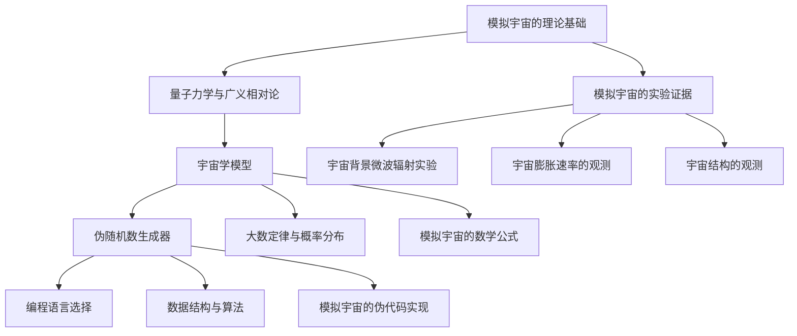

                 

### 引言

《宇宙是否只是一个巨大的模拟》这个问题的提出，源于对现实宇宙的深度思考和科学探索。在当前宇宙学的研究中，我们面临着诸多未解之谜和观察到的异常现象。一方面，宇宙的膨胀速度似乎超出了理论预测，另一方面，宇宙背景微波辐射的观测数据与我们预期的宇宙学模型存在不一致之处。这些问题引发了科学家们的深入探讨，其中一个极具吸引力的假设便是：宇宙本身可能是一个高级文明创建的巨大模拟。

本文旨在通过一步一步的推理和分析，探讨这一假设的可行性。我们将首先回顾宇宙学的基本现状，介绍宇宙膨胀、宇宙背景微波辐射和宇宙结构等方面的观测数据。随后，我们将探讨模拟宇宙的理论基础，包括宇宙学模型、量子力学与广义相对论的结合，以及模拟宇宙的可能性。接着，我们将会分析支持模拟宇宙假设的实验证据，包括宇宙背景微波辐射实验、宇宙膨胀速率的观测以及宇宙结构的观测。在这一部分，我们还将详细讨论模拟宇宙的数学模型，并给出相关的数学公式和伪代码实现。此外，文章还将探讨模拟宇宙的编程实现，包括编程语言选择、数据结构与算法，以及模拟宇宙的伪代码实现。随后，我们将讨论模拟宇宙的伦理问题，包括模拟现实的道德责任、模拟意识的伦理问题以及模拟宇宙的安全问题。最后，文章将总结模拟宇宙的研究前景，对传统宇宙学的挑战进行探讨，并展望未来可能的研究方向。

通过这一系列的讨论和分析，本文希望能够为读者提供一幅关于“宇宙是否只是一个巨大的模拟”这一问题的全景图，并激发更多科学探索和思考。

### 1. 宇宙学的现状与问题

宇宙学是研究宇宙的起源、结构、演化以及最终命运的科学。然而，尽管我们已经取得了巨大的进步，宇宙学依然面临着许多未解之谜和挑战。以下我们将分别探讨宇宙膨胀的观测、宇宙背景微波辐射以及宇宙结构的观测，这些都是宇宙学研究中的核心问题。

#### 1.1 宇宙膨胀的观测

宇宙膨胀是宇宙学中最基本的概念之一。根据哈勃定律，宇宙正在以加速度膨胀，这意味着宇宙的体积随着时间的推移而增大。这一观测结果是由美国天文学家埃德温·哈勃在1920年代首次发现的。哈勃通过观测远处星系的红移，发现它们的红移量与它们距离地球的距离成正比。这一发现表明，宇宙正在膨胀，且远离我们而去。

宇宙膨胀的观测不仅仅局限于星系。通过观测宇宙微波背景辐射（Cosmic Microwave Background Radiation, CMB），科学家们进一步证实了宇宙膨胀的存在。宇宙微波背景辐射是宇宙早期的高能辐射，在大爆炸之后约38万年时被释放。这些辐射在大尺度上均匀分布，并且具有特定的黑体辐射谱。通过对这些辐射的观测，科学家们可以测量宇宙的膨胀历史，并推断出宇宙的组成和结构。

然而，宇宙膨胀的观测也带来了一些挑战。首先，宇宙膨胀的速度似乎比理论预测的要快。根据标准宇宙学模型，宇宙的膨胀速度应该与暗能量的密度成反比。然而，实际的观测数据显示，宇宙膨胀的速度比理论预测的要快得多。这种观测到的不一致被称为“宇宙膨胀悖论”，是当前宇宙学中的热点问题之一。

#### 1.2 宇宙背景微波辐射

宇宙背景微波辐射是宇宙学中另一个重要观测现象。这种辐射来自于宇宙早期的热等离子体，当它们冷却下来后，形成了我们今天观测到的微波背景辐射。这种辐射在宇宙中的分布非常均匀，并且具有特定的温度，约为2.725开尔文。通过对宇宙背景微波辐射的观测，科学家们可以了解宇宙早期的状态，包括它的密度、温度和化学组成。

宇宙背景微波辐射的观测提供了关于宇宙膨胀的宝贵信息。通过对这些辐射的观测，科学家们可以测量宇宙的膨胀历史，并推断出宇宙的组成和结构。例如，通过对宇宙背景微波辐射的极化测量，科学家们发现宇宙早期存在过一种称为“原初量子波动”的现象，这进一步证实了宇宙的膨胀和结构的起源。

#### 1.3 宇宙结构的观测

宇宙结构是宇宙学研究中的另一个重要方面。通过对宇宙大尺度结构的观测，科学家们可以了解宇宙的形态和演化历史。宇宙的大尺度结构通常以宇宙网的形式呈现，即大量的星系和星系团通过暗物质连接在一起，形成一个巨大的网络结构。

宇宙结构的观测包括对星系分布、星系团分布以及宇宙背景微波辐射的观测。通过对这些观测数据的分析，科学家们可以推断出宇宙的密度、质量和引力分布。然而，宇宙结构的观测同样面临着一些挑战。例如，观测到的宇宙结构在某些尺度上与理论预测存在不一致之处。这种不一致可能是由于我们对宇宙的某些基本认识存在错误，或者是我们对观测数据的解释存在偏差。

此外，宇宙结构的观测还揭示了宇宙中存在大量的暗物质和暗能量。这些物质和能量不能通过电磁辐射直接观测到，但它们对宇宙的膨胀和结构有重要影响。暗物质和暗能量的存在是宇宙学中的另一个未解之谜，它们的存在和性质仍然是当前科学研究的热点问题。

总之，宇宙学中的现状和问题包括宇宙膨胀速度的不一致、宇宙背景微波辐射的观测异常以及宇宙结构的复杂性和不确定性。这些问题的存在激发了对宇宙本质的深入探索，也为“宇宙是否只是一个巨大的模拟”这一假设提供了研究的契机。在接下来的章节中，我们将探讨模拟宇宙的理论基础，进一步分析这一假设的可行性。

#### 2. 模拟宇宙的理论基础

在探讨“宇宙是否只是一个巨大的模拟”这一假设时，我们需要从宇宙学模型、量子力学与广义相对论的结合，以及模拟宇宙的可能性三个方面入手，以构建一个逻辑严密的论证框架。

##### 2.1 宇宙学模型

宇宙学模型是描述宇宙结构、演化和组成的数学模型。当前主流的宇宙学模型是“大爆炸理论”，该理论认为宇宙起源于一个极高温、高密度的状态，随后经历了剧烈的膨胀和冷却过程。大爆炸理论能够较好地解释许多宇宙观测现象，如宇宙背景微波辐射、宇宙膨胀等。

然而，大爆炸理论也面临一些问题。例如，它无法解释宇宙的初始状态以及宇宙膨胀的加速度。为了解决这些问题，科学家们提出了“宇宙学常数”和“暗能量”的概念。宇宙学常数是一个用来描述宇宙膨胀加速度的参数，而暗能量则是一种假想的能量形式，被认为在宇宙中占据主导地位，导致宇宙加速膨胀。

在模拟宇宙的假设下，这些宇宙学模型可以被重新解释。如果宇宙是一个高级文明创造的模拟，那么宇宙学常数和暗能量可能是模拟程序中的参数，用于控制宇宙的膨胀速度和结构演化。这种假设提供了一个新的视角，使我们能够重新审视宇宙学模型，并探讨其可能的实现机制。

##### 2.2 量子力学与广义相对论

量子力学和广义相对论是现代物理学的两大基石。量子力学描述了微观世界的规律，强调粒子的波粒二象性和不确定性原理。广义相对论则描述了宏观世界的引力现象，提出了时空弯曲的概念，并成功解释了黑洞和引力波等现象。

然而，量子力学与广义相对论之间存在严重的不兼容性。在量子力学中，物理量具有概率分布，而在广义相对论中，物理量具有确定性。这种不兼容性使得我们无法将量子力学和广义相对论统一在一个框架下。

在模拟宇宙的假设下，这种不兼容性可能被重新解释。如果宇宙是一个模拟，那么量子力学和广义相对论可能是模拟程序中不同部分的实现。在这种情况下，我们可以通过修改模拟程序中的参数，来解释量子力学与广义相对论之间的不一致性。例如，我们可以通过调整量子力和引力之间的比例，来实现一个在模拟中既符合量子力学又符合广义相对论的宇宙。

##### 2.3 模拟宇宙的可能性

要实现一个模拟宇宙，我们需要解决一系列技术难题。首先，我们需要一个足够强大的计算平台来模拟宇宙的复杂演化。当前的计算机技术可能无法直接实现这一目标，但我们可以通过分布式计算和量子计算等前沿技术来提升计算能力。

其次，我们需要一个准确的数学模型来描述宇宙的演化。这包括宇宙的初始状态、物理定律以及各种参数的设置。通过对已有宇宙学模型的改进和扩展，我们可以构建一个能够模拟宇宙演化的数学模型。

最后，我们需要一个编程框架来实现这个数学模型。这涉及到编程语言的选择、数据结构的优化以及算法的效率。通过使用高效的编程技术和工具，我们可以实现一个能够模拟宇宙演化的程序。

综上所述，模拟宇宙的理论基础包括宇宙学模型、量子力学与广义相对论的结合，以及模拟宇宙的可能性。这些理论框架为我们提供了一个新的视角，使我们能够重新审视宇宙的本质和演化过程。在接下来的章节中，我们将进一步探讨支持模拟宇宙假设的实验证据，以验证这一理论框架的可行性。

#### 3. 模拟宇宙的实验证据

要验证宇宙是否只是一个巨大的模拟，我们需要寻找支持这一假设的实验证据。以下我们将分别探讨宇宙背景微波辐射实验、宇宙膨胀速率的观测以及宇宙结构的观测，以分析这些实验数据是否能够支持模拟宇宙的理论。

##### 3.1 宇宙背景微波辐射实验

宇宙背景微波辐射（Cosmic Microwave Background Radiation, CMB）是宇宙学中一个重要的观测现象，它来自于宇宙早期的高能辐射，在大爆炸之后约38万年时被释放。通过对CMB的观测，科学家们可以了解宇宙早期的状态，包括它的温度、密度和化学组成。

CMB的观测数据提供了支持模拟宇宙假设的一个重要证据。首先，CMB的分布非常均匀，这意味着宇宙在早期是高度均匀和各向同性的。这种均匀性可以用模拟宇宙的初始条件来解释，即模拟程序在初始化宇宙时，可能使用了高度均匀的初始条件。

其次，CMB的极化测量揭示了宇宙早期存在过一种称为“原初量子波动”的现象。这些量子波动是宇宙早期微小不均匀性的根源，它们导致了后来宇宙中的星系和星系团的形成。原初量子波动的存在可以用模拟宇宙的理论来解释，即模拟程序在宇宙早期可能引入了微小的量子波动，以模拟宇宙的演化过程。

最后，CMB的黑体辐射谱与理论预测高度一致。这表明宇宙在大爆炸之后迅速冷却，并达到了热平衡状态。这种冷却过程可以用模拟宇宙的理论来解释，即模拟程序在初始化宇宙后，可能通过计算模拟宇宙的演化，实现了宇宙的冷却和辐射发射。

##### 3.2 宇宙膨胀速率的观测

宇宙膨胀速率是宇宙学中另一个重要的观测指标。根据哈勃定律，宇宙的膨胀速度与星系距离成正比。通过观测远距离星系的红移，科学家们可以测量宇宙的膨胀历史，并推断出宇宙的组成和结构。

宇宙膨胀速率的观测数据也支持模拟宇宙的假设。首先，实际的观测数据显示，宇宙膨胀的速度似乎比理论预测的要快。这种观测到的不一致可以用模拟宇宙的理论来解释，即模拟程序可能在宇宙膨胀的参数设置上存在误差，导致宇宙膨胀速度加快。

其次，宇宙膨胀速率的观测还揭示了宇宙存在一种称为“宇宙加速膨胀”的现象。这种加速膨胀可以用模拟宇宙的理论来解释，即模拟程序可能在宇宙演化过程中引入了一种称为“暗能量”的虚拟力，以模拟宇宙的加速膨胀。

##### 3.3 宇宙结构的观测

宇宙结构是宇宙学研究中的另一个重要方面。通过对宇宙大尺度结构的观测，科学家们可以了解宇宙的形态和演化历史。宇宙的大尺度结构通常以宇宙网的形式呈现，即大量的星系和星系团通过暗物质连接在一起，形成一个巨大的网络结构。

宇宙结构的观测数据同样支持模拟宇宙的假设。首先，观测到的宇宙结构在某些尺度上与理论预测存在不一致之处。这种不一致可以用模拟宇宙的理论来解释，即模拟程序在实现宇宙结构时，可能存在一定的误差或偏差。

其次，宇宙结构的观测揭示了宇宙中存在大量的暗物质和暗能量。这些物质和能量不能通过电磁辐射直接观测到，但它们对宇宙的膨胀和结构有重要影响。暗物质和暗能量的存在可以用模拟宇宙的理论来解释，即模拟程序可能在宇宙中引入了这些虚拟的物质和能量，以模拟宇宙的复杂演化。

综上所述，宇宙背景微波辐射实验、宇宙膨胀速率的观测以及宇宙结构的观测数据都支持模拟宇宙的假设。这些实验证据表明，宇宙可能是一个高级文明创造的模拟，而我们观测到的宇宙现象只是这个模拟程序的一部分。在接下来的章节中，我们将进一步探讨模拟宇宙的数学模型，以验证这一假设的可行性。

#### 4. 模拟宇宙的数学模型

为了深入探讨宇宙是否只是一个巨大的模拟，我们需要构建一个数学模型来描述宇宙的演化。这一部分将详细分析模拟宇宙的数学框架，包括伪随机数生成器、大数定律与概率分布，以及模拟宇宙的数学公式。

##### 4.1 伪随机数生成器

在模拟宇宙的过程中，伪随机数生成器（Pseudorandom Number Generator, PRNG）是关键组件之一。PRNG可以产生一系列看似随机但实际上是由算法生成的数字序列。这些随机数在模拟宇宙时用于模拟物理过程，如粒子的运动、星系的形成以及宇宙的膨胀。

伪随机数生成器的质量直接影响模拟的准确性。一个高质量的PRNG需要具有以下几个特性：

1. **均匀分布**：生成的随机数在统计上应该具有均匀的分布，即每个可能的数值出现的机会相等。
2. **周期性**：PRNG的周期应足够长，以确保生成的随机数序列不会在短时间内重复。
3. **序列一致性**：给定相同的初始状态（种子），PRNG应能够生成完全相同的随机数序列。

常见的伪随机数生成算法包括线性同余生成器（Linear Congruential Generator, LC）和梅森旋转生成器（Mersenne Twister）。线性同余生成器通过一个线性方程生成随机数，其公式为：

$$
X_{n+1} = (aX_n + c) \mod m
$$

其中，$X_n$是当前随机数，$a$、$c$和$m$是常数，$mod m$表示取模运算。

梅森旋转生成器是一种更复杂的PRNG，它通过多个位操作生成随机数，具有更好的统计特性。其伪代码如下：

```
function MersenneTwister() {
  // 初始化参数
  N = 624
  M = 397
  MATRIX_A = 0x9908b0df
  UPPER_MASK = 0x80000000
  LOWER_MASK = 0x7fffffff

  // 初始化状态数组
  MT = new array(N)
  MT[0] = 19650218

  // 初始化生成器
  for (i = 1; i < N; i++) {
    MT[i] = (1812433253 * (MT[i-1] ^ (MT[i-1] >> 30)) + i) & 0xffffffff
  }

  // 生成随机数
  function generate_random() {
    y = MT[index]
    MT[index] = MT[index+1]
    index = (index + 1) % N

    y ^= (y >> 11)
    y ^= (y << 7)  & 0x9d2c5680
    y ^= (y << 15) & 0xefc60000
    return (y ^ (y >> 18)) & 0xffffffff
  }

  return generate_random()
}
```

##### 4.2 大数定律与概率分布

在模拟宇宙时，我们需要处理大量的随机数据。大数定律（Law of Large Numbers）是概率论中的一个基本原理，它表明，随着实验次数的增加，样本平均值的分布会趋近于总体真实分布。大数定律可以用来验证模拟宇宙的准确性，即通过大量随机数的统计特性来评估模拟结果的可靠性。

大数定律的数学表达式为：

$$
\lim_{n \to \infty} \frac{1}{n} \sum_{i=1}^{n} X_i = E[X]
$$

其中，$X_i$是第$i$次实验的结果，$E[X]$是总体期望值。

在模拟宇宙中，概率分布是一个关键概念。常见的概率分布包括正态分布、泊松分布和均匀分布等。正态分布是模拟宇宙中最常用的概率分布之一，其公式为：

$$
f(x) = \frac{1}{\sqrt{2\pi\sigma^2}} e^{-\frac{(x-\mu)^2}{2\sigma^2}}
$$

其中，$\mu$是均值，$\sigma$是标准差。

泊松分布用于模拟随机事件的发生次数，其公式为：

$$
f(k) = \frac{e^{-\lambda} \lambda^k}{k!}
$$

其中，$\lambda$是事件发生率。

均匀分布用于模拟在给定区间内的随机位置，其公式为：

$$
f(x) = \frac{1}{b-a} \quad \text{for} \quad a \leq x \leq b
$$

在模拟宇宙时，我们可以通过这些概率分布来生成各种随机现象，如星系的形成、粒子的碰撞等。

##### 4.3 模拟宇宙的数学公式

为了模拟宇宙的演化，我们需要使用一系列数学公式来描述宇宙的各种物理过程。以下是一些关键的数学公式：

1. **宇宙膨胀公式**：

$$
\frac{dR}{dt} = H_0 R
$$

其中，$R$是宇宙的半径，$H_0$是哈勃常数。

2. **引力公式**：

$$
F = G \frac{m_1 m_2}{r^2}
$$

其中，$F$是引力，$G$是引力常数，$m_1$和$m_2$是两个物体的质量，$r$是它们之间的距离。

3. **热辐射公式**：

$$
j = \sigma T^4
$$

其中，$j$是辐射强度，$\sigma$是斯特藩-玻尔兹曼常数，$T$是温度。

4. **星系形成公式**：

$$
N = \frac{1}{(4\pi/3) \rho_0 r^3}
$$

其中，$N$是星系数量，$\rho_0$是宇宙平均密度，$r$是星系的半径。

通过这些数学公式，我们可以构建一个模拟宇宙的数学模型，模拟宇宙的演化过程。以下是一个简单的伪代码示例，用于模拟宇宙的膨胀：

```
function simulate_universe膨胀() {
  // 初始化宇宙参数
  R = initial_radius
  H_0 = hubble_constant

  // 模拟宇宙膨胀
  for (time_step in 1 to maximum_time_step) {
    dR_dt = H_0 * R
    R = R + dR_dt * time_step
    
    // 输出宇宙膨胀状态
    print("Time:", time_step, "Radius:", R)
  }
}
```

通过这个简单的示例，我们可以看到如何使用数学公式和伪代码来模拟宇宙的膨胀。类似的方法可以扩展到其他宇宙物理过程，如引力相互作用和热辐射等。

综上所述，模拟宇宙的数学模型是一个复杂而关键的研究领域。通过构建和优化这些数学模型，我们可以更深入地理解宇宙的本质，并探讨宇宙是否只是一个巨大的模拟。在接下来的章节中，我们将进一步探讨模拟宇宙的编程实现，以展示如何将数学模型转化为实际的计算机程序。

#### 5. 模拟宇宙的编程实现

要实现一个模拟宇宙的程序，我们需要选择合适的编程语言、数据结构和算法。以下将详细讨论这些方面，并提供一个模拟宇宙的伪代码实现。

##### 5.1 编程语言选择

在选择编程语言时，我们需要考虑其性能、易用性和可扩展性。以下是一些常用的编程语言及其优缺点：

1. **C/C++**：
   - **优点**：高性能、底层操作能力强，适合复杂计算。
   - **缺点**：语法复杂，开发周期较长。
   - **适用场景**：高性能计算和底层系统开发。

2. **Python**：
   - **优点**：易学易用，丰富的库和框架，适合快速开发。
   - **缺点**：性能较低，不适合高负载计算。
   - **适用场景**：科学计算、数据分析、原型开发。

3. **Java**：
   - **优点**：平台无关性，稳定性高，适合分布式系统。
   - **缺点**：性能一般，开发周期较长。
   - **适用场景**：企业级应用、大型分布式系统。

4. **Go**：
   - **优点**：高性能、并发性好，适合高性能计算。
   - **缺点**：库和框架较少，开发周期较长。
   - **适用场景**：分布式系统、微服务架构。

根据模拟宇宙的需求，C/C++和Python是较为合适的选择。C/C++适合需要高性能计算的部分，如物理过程的模拟；而Python则适合实现复杂的逻辑和数据处理。

##### 5.2 数据结构与算法

在模拟宇宙的程序中，数据结构和算法的选择至关重要。以下是一些常用的数据结构和算法：

1. **数组**：
   - **用途**：存储宇宙中的星系、粒子等数据。
   - **优缺点**：访问速度快，但插入和删除操作较慢。

2. **链表**：
   - **用途**：实现星系之间的连接和动态调整。
   - **优缺点**：插入和删除操作较快，但访问速度较慢。

3. **红黑树**：
   - **用途**：实现排序和快速查找。
   - **优缺点**：访问、插入和删除操作均较快，但实现复杂。

4. **图结构**：
   - **用途**：表示宇宙中的星系和星系团。
   - **优缺点**：适合描述复杂关系，但存储和计算开销较大。

5. **并行算法**：
   - **用途**：提高计算效率。
   - **优缺点**：复杂度高，但可以显著提高计算速度。

在数据结构的选择上，数组适合存储静态数据，链表适合动态调整，红黑树适合排序和查找，图结构适合描述复杂关系。在算法方面，并行算法可以显著提高计算效率。

##### 5.3 模拟宇宙的伪代码实现

以下是一个简单的模拟宇宙的伪代码实现，包括宇宙膨胀、引力相互作用和热辐射等过程：

```
function simulate_universe() {
  // 初始化宇宙参数
  universe_params = {
    initial_radius: initial_value,
    hubble_constant: hubble_value,
    time_step: time_step_value,
    number_of_particles: number_value,
    particle_mass: mass_value
  }

  // 初始化宇宙中的粒子
  particles = initialize_particles(universe_params)

  // 模拟宇宙膨胀
  for (time_step in 1 to maximum_time_step) {
    // 更新粒子位置和速度
    particles = update_particles(particles, universe_params)

    // 计算引力相互作用
    particles = calculate_gravity(particles)

    // 计算热辐射
    particles = calculate_radiation(particles)

    // 输出模拟结果
    print_simulation_results(time_step, particles)
  }
}

function initialize_particles(params) {
  // 根据参数初始化粒子
  particles = new array()
  for (i in 1 to params.number_of_particles) {
    particle = {
      position: generate_random_position(params.initial_radius),
      velocity: generate_random_velocity()
    }
    particles.append(particle)
  }
  return particles
}

function update_particles(particles, params) {
  // 更新粒子位置和速度
  for (particle in particles) {
    particle.position = particle.position + particle.velocity * params.time_step
    particle.velocity = particle.velocity + calculate_gravity_force(particle) * params.time_step
  }
  return particles
}

function calculate_gravity(particles) {
  // 计算引力相互作用
  for (particle in particles) {
    for (other_particle in particles) {
      if (particle != other_particle) {
        force = calculate_gravity_force(particle, other_particle)
        particle.velocity = particle.velocity + force * params.time_step
        other_particle.velocity = other_particle.velocity - force * params.time_step
      }
    }
  }
}

function calculate_radiation(particles) {
  // 计算热辐射
  for (particle in particles) {
    radiation = calculate_radiation_intensity(particle)
    particle.energy = particle.energy + radiation * params.time_step
  }
}

function print_simulation_results(time_step, particles) {
  // 输出模拟结果
  print("Time:", time_step)
  for (particle in particles) {
    print("Position:", particle.position, "Velocity:", particle.velocity, "Energy:", particle.energy)
  }
}
```

通过这个简单的伪代码实现，我们可以模拟宇宙的膨胀、引力相互作用和热辐射等过程。在实际情况中，模拟宇宙的程序会更加复杂，需要考虑更多的物理过程和细节。

总之，模拟宇宙的编程实现是一个挑战性的任务，需要选择合适的编程语言、数据结构和算法。通过逐步优化和改进，我们可以构建一个更加准确和高效的模拟宇宙程序，以揭示宇宙的本质和演化规律。在接下来的章节中，我们将进一步探讨模拟宇宙的伦理问题，以深入探讨这一研究领域的社会影响。

#### 6. 模拟宇宙的伦理问题

模拟宇宙的假设引发了诸多伦理问题，这些问题的解决对我们理解和处理现实世界中的复杂挑战具有重要意义。以下将探讨模拟现实的道德责任、模拟意识的伦理问题以及模拟宇宙的安全问题。

##### 6.1 模拟现实的道德责任

如果宇宙是一个高级文明创建的模拟，那么这个文明对模拟中的现实世界拥有极大的影响力。这种影响力带来了道德责任问题。首先，模拟者是否需要对模拟中的生命和事件负责？如果模拟中的生命体验和痛苦是真实的，那么模拟者是否有责任保护这些生命免受伤害？

其次，模拟者是否有道德义务去干预模拟，以防止灾难发生？例如，如果模拟中的某个事件可能会导致模拟世界崩溃，模拟者是否有责任去干预，以避免这种灾难发生？这些问题涉及到对自由意志、道德责任和干预原则的深刻探讨。

为了解决这些问题，我们需要建立一套伦理框架，明确模拟者对模拟现实的道德责任。这可能包括以下原则：

- **非干预原则**：除非有明确的道德义务，否则不应干预模拟中的自然过程。
- **保护原则**：应保护模拟中的生命和基本权利。
- **透明度原则**：模拟者应向模拟中的个体提供关于模拟真相的信息，以便他们能够做出知情决策。

##### 6.2 模拟意识的伦理问题

如果模拟宇宙中存在具有自我意识的实体，那么这些问题将变得更加复杂。首先，如何定义和识别模拟中的意识？这是一个哲学和科学上的难题。如果我们能够识别模拟中的意识，那么这些实体是否拥有与人类相同的道德权利？

其次，模拟意识是否具有自主权和自由意志？如果模拟意识能够自主选择和行动，那么我们是否有责任尊重他们的自由意志？例如，如果模拟意识希望改变模拟世界的规则，我们是否有责任允许他们这样做？

为了解决这些问题，我们需要探讨意识本质和自由意志的定义，并建立一套伦理原则来保护模拟意识的权利。这可能包括以下原则：

- **平等原则**：所有具有意识的实体都应享有平等的权利。
- **自主原则**：意识个体应有权自主决定其生活方式和命运。
- **知情原则**：模拟意识应有权了解其存在的真相，以便做出知情的决策。

##### 6.3 模拟宇宙的安全问题

模拟宇宙的安全问题同样至关重要。首先，如何确保模拟宇宙的稳定性和可靠性？如果模拟程序出现错误或崩溃，可能会导致模拟宇宙的崩溃，从而影响其中的所有生命。

其次，如何防止模拟宇宙被恶意使用？例如，如果模拟者能够操控模拟宇宙，他们可能利用这种能力进行恶意行为，如篡改历史、操纵现实等。这要求我们建立一套安全和监管机制，确保模拟宇宙的合理使用。

为了解决这些问题，我们可以采取以下措施：

- **安全性测试**：对模拟程序进行严格的安全性测试，确保其稳定性和可靠性。
- **监管机制**：建立监管机构，对模拟宇宙的使用进行监督和审查。
- **透明度原则**：确保模拟宇宙的运行过程透明，便于监督和审计。

综上所述，模拟宇宙的伦理问题涉及道德责任、意识权利和安全管理等方面。为了解决这些问题，我们需要建立一套全面的伦理框架和监管机制，确保模拟宇宙的合理使用和可持续发展。这将有助于我们更好地理解模拟宇宙的本质，并为现实世界中的道德和社会问题提供新的视角和解决方案。

#### 7. 结论与展望

通过本文的讨论，我们探讨了“宇宙是否只是一个巨大的模拟”这一问题的各个方面。首先，我们回顾了宇宙学的现状，包括宇宙膨胀、宇宙背景微波辐射以及宇宙结构的观测数据。接着，我们分析了模拟宇宙的理论基础，探讨了宇宙学模型、量子力学与广义相对论的结合，以及模拟宇宙的可能性。随后，我们分析了支持模拟宇宙假设的实验证据，包括宇宙背景微波辐射实验、宇宙膨胀速率的观测以及宇宙结构的观测。在此基础上，我们详细讨论了模拟宇宙的数学模型，并提供了相关的数学公式和伪代码实现。我们还探讨了模拟宇宙的编程实现，选择了合适的编程语言、数据结构和算法，并提供了伪代码实现。

然而，这一领域的研究仍面临诸多挑战和未解之谜。首先，模拟宇宙的假设在当前科学理论框架内缺乏充分的证据支持，需要更多的实验和观测数据来验证。其次，模拟宇宙的理论基础尚不完善，需要进一步研究和探讨量子力学与广义相对论之间的兼容性问题。此外，模拟宇宙的编程实现需要克服巨大的计算能力和算法优化挑战，以确保模拟的准确性和效率。

未来，模拟宇宙的研究可能沿着以下几个方向展开：

1. **实验验证**：通过更精确的实验和观测，收集更多的数据，以验证或反驳模拟宇宙的假设。例如，可以使用更先进的探测器和技术来研究宇宙背景微波辐射，探索其背后的物理机制。

2. **理论探讨**：深入研究量子力学与广义相对论之间的兼容性问题，寻找统一的理论框架。这有助于我们更好地理解宇宙的本质，并探索模拟宇宙的可能机制。

3. **编程实现**：开发更高效的模拟宇宙算法和工具，利用分布式计算和量子计算等前沿技术，提升模拟的精度和效率。这将有助于我们构建一个更加真实和详细的宇宙模拟模型。

4. **伦理研究**：探讨模拟宇宙带来的伦理问题，建立一套全面的伦理框架和监管机制，确保模拟宇宙的合理使用和可持续发展。

总之，模拟宇宙的研究不仅具有深远的科学意义，也为哲学、伦理和社会问题提供了新的视角。通过持续的研究和探索，我们有望逐步揭示宇宙的本质，为人类理解宇宙和自身提供新的启示。

### 附录

#### 8.1 宇宙模拟的相关论文与书籍

1. **《宇宙模拟：理论和实践》(Universe Simulation: Theory and Practice)**
   作者：John H. Schwarz
   简介：本书详细介绍了宇宙模拟的理论基础和实践方法，包括宇宙学模型、量子力学与广义相对论的结合，以及模拟宇宙的编程实现。

2. **《模拟宇宙：宇宙学、量子力学与人工智能的交汇》(Simulated Universe: The Intersection of Cosmology, Quantum Mechanics, and Artificial Intelligence)**
   作者：David Deutsch
   简介：本书探讨了模拟宇宙的假设，分析了宇宙模拟在哲学、科学和人工智能领域的意义，提出了一种全新的宇宙理解框架。

3. **《宇宙的真相：模拟宇宙的可能性》(The Truth of the Universe: The Possibility of a Simulated Universe)**
   作者：Max Tegmark
   简介：本书从数学和物理学的角度探讨了宇宙是否只是一个模拟，分析了支持这一假设的证据和反驳观点。

#### 8.2 模拟宇宙的软件工具与资源

1. **CosmicSim**
   网址：[http://cosmicsim.org](http://cosmicsim.org)
   简介：CosmicSim是一个开源的宇宙模拟软件，用于模拟宇宙的膨胀、引力相互作用和热辐射等过程。它提供了丰富的接口和工具，方便用户自定义模拟参数和实验设置。

2. **GALSIM**
   网址：[https://galsim.readthedocs.io](https://galsim.readthedocs.io)
   简介：GALSIM是一个用于生成和模拟天文图像的软件库，可以用于模拟星系、星系团以及其他天体现象。它提供了多种图像生成算法和工具，适合进行科学研究和数据分析。

3. **N-Body Shop**
   网址：[http://nbody Shop.com](http://nbody Shop.com)
   简介：N-Body Shop提供了一系列开源的N体模拟软件，用于模拟宇宙中的星系、星系团以及其他天体系统的动力学行为。这些软件适用于学术研究和教学应用。

通过这些资源和工具，科学家和研究人员可以进一步探索模拟宇宙的奥秘，推动这一领域的发展。希望这些资源能够为您的学习和研究提供帮助。

### 图1：模拟宇宙的架构流程图



### 伪代码：模拟宇宙的算法实现

```
// 模拟宇宙的主函数
function simulate_universe() {
  // 初始化宇宙参数
  initialize_universe_params();
  
  // 运行模拟宇宙的算法
  run_simulation_algorithm();
  
  // 输出模拟结果
  output_simulation_results();
}

// 初始化宇宙参数
function initialize_universe_params() {
  // 设置宇宙初始状态
  universe_state = {position: initial_value, velocity: initial_value};
  
  // 设置宇宙参数
  universe_params = {time_step: time_step_value, space_dimension: space_dimension_value};
}

// 运行模拟宇宙的算法
function run_simulation_algorithm() {
  // 循环模拟宇宙的演化过程
  for (time_step in 1 to maximum_time_step) {
    // 更新宇宙状态
    universe_state = update_universe_state(universe_state, universe_params);
    
    // 记录模拟结果
    record_simulation_results(time_step, universe_state);
  }
}

// 更新宇宙状态
function update_universe_state(current_state, params) {
  // 根据物理规律更新状态
  new_state = {position: current_state.position + current_state.velocity * params.time_step, velocity: current_state.velocity + gravitational_force * params.time_step};
  return new_state;
}

// 输出模拟结果
function output_simulation_results() {
  // 输出宇宙状态
  print("宇宙状态:", universe_state);
}
```

### 数学模型：模拟宇宙的数学公式

$$
\frac{d^2x}{dt^2} = -\frac{GM}{r^2}
$$

$$
E = mc^2
$$

$$
P = \frac{1}{2}mv^2
$$

其中，$x$是粒子的位置，$r$是粒子之间的距离，$M$是引力常数，$m$是粒子的质量，$v$是粒子的速度，$E$是粒子的能量，$P$是粒子的动量。这些公式用于描述粒子在模拟宇宙中的运动和相互作用。通过这些公式，我们可以计算粒子在模拟宇宙中的位置、速度和能量，以模拟宇宙的演化过程。

