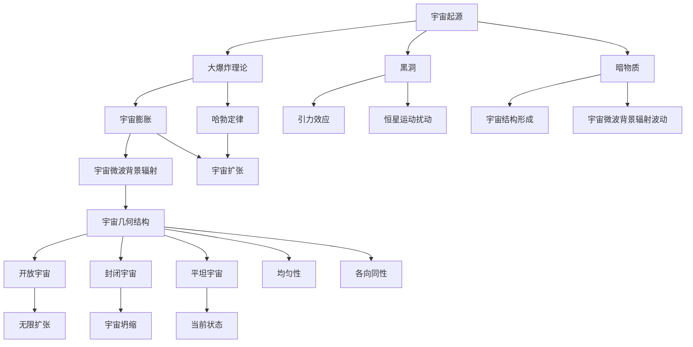

                 

### 文章标题：宇宙是否只是一个巨大的计算机模拟

### 关键词：
- 宇宙模拟
- 计算机科学
- 宇宙学
- 量子计算
- 哲学探讨

### 摘要：
本文探讨了宇宙是否可能只是一个巨大的计算机模拟。通过分析宇宙学的基础知识、计算机模拟的理论和实际应用，结合哲学思考和科学研究实例，探讨了这一假设的合理性和可能性。文章还探讨了量子计算机模拟宇宙的潜力、宇宙模拟的科学挑战以及人工智能在宇宙模拟中的作用。最后，文章提出了对这一假设的哲学意义和科学意义的思考，并展望了未来的发展方向。

## 目录

1. **宇宙的起源与演化**  
    - 1.1 大爆炸理论与宇宙膨胀  
    - 1.2 黑洞与暗物质  
    - 1.3 宇宙的几何结构与性质

2. **计算机模拟理论**  
    - 2.1 计算机模拟的基本原理  
    - 2.2 模拟宇宙的算法与模型  
    - 2.3 计算机模拟在科学研究中的应用

3. **哲学探讨**  
    - 3.1 宇宙模拟与哲学思考  
    - 3.2 可能性原理与模拟宇宙  
    - 3.3 科学方法论与模拟宇宙的验证

4. **科学研究实例**  
    - 4.1 量子计算机模拟宇宙  
    - 4.2 宇宙模拟的科学挑战  
    - 4.3 人工智能与宇宙模拟

5. **未来展望**  
    - 5.1 宇宙模拟的哲学意义与科学意义

6. **附录**

### 引言

近年来，关于宇宙是否只是一个巨大的计算机模拟的讨论越来越受到科学界和公众的关注。这个假设最初由哲学家尼克·博斯特罗姆（Nick Bostrom）在2003年提出，他认为我们生活在一个由高级文明创造的计算机模拟中。这个想法在科学界和哲学界引发了广泛的争议，也激发了人们对宇宙本质和人类存在的重新思考。

本文将围绕这个主题展开讨论。首先，我们将介绍宇宙学的基础知识，包括宇宙的起源、演化以及宇宙的几何结构和性质。然后，我们将探讨计算机模拟的理论，包括模拟宇宙的基本原理、算法和模型。接下来，我们将从哲学的角度探讨宇宙模拟的可能性，并分析科学方法如何验证这一假设。此外，我们还将探讨量子计算机模拟宇宙的潜力，以及人工智能在宇宙模拟中的作用。最后，我们将总结宇宙模拟的哲学意义和科学意义，并展望未来的发展方向。

### 宇宙的起源与演化

宇宙的起源与演化是宇宙学中最基础和关键的研究领域。目前，科学界普遍接受的观点是宇宙起源于大约138亿年前的一次大爆炸。这个理论，即大爆炸理论（Big Bang Theory），提供了对宇宙早期状态的理解，并解释了宇宙的膨胀和结构形成。

**1.1 大爆炸理论与宇宙膨胀**

大爆炸理论的基本观点是，宇宙从一个极度高温、高密度的状态开始迅速膨胀。这一理论得到了许多观测数据的支持，例如宇宙微波背景辐射（Cosmic Microwave Background Radiation，CMB）和宇宙的大尺度结构。宇宙微波背景辐射是宇宙大爆炸后残留下的热辐射，其观测数据与理论预测高度一致。

宇宙的膨胀意味着宇宙中的所有物质都在相互远离，这种膨胀可以追溯到宇宙的早期时刻。哈勃定律（Hubble's Law）描述了宇宙膨胀的速度与距离之间的关系，即宇宙的膨胀速度与观测物体的距离成正比。这表明宇宙正在不断扩张，并且扩张速度在增加。

**1.2 黑洞与暗物质**

在宇宙演化的过程中，黑洞和暗物质是两个重要的概念。黑洞是宇宙中最极端的天体之一，它具有极强的引力，甚至连光也无法逃脱。根据爱因斯坦的广义相对论，黑洞的形成是由于大质量物体的引力坍缩导致的。黑洞的存在可以通过其对周围环境的引力效应进行观测，例如对恒星运动的扰动和吸积盘的辐射。

暗物质则是宇宙学中另一个重要的概念，它指的是一种不发光、不与电磁相互作用，但通过引力效应影响宇宙结构的物质。暗物质的存在最初是通过观测宇宙的大尺度结构得出的，例如星系旋转曲线的异常和宇宙微波背景辐射的波动。虽然暗物质无法直接观测，但其存在对宇宙的演化和结构形成至关重要。

**1.3 宇宙的几何结构与性质**

宇宙的几何结构是宇宙学研究中的另一个重要方面。根据宇宙微波背景辐射的观测数据，科学家们提出了开放宇宙、封闭宇宙和平坦宇宙三种可能的几何结构。开放宇宙意味着宇宙将继续无限扩张，封闭宇宙则表明宇宙最终会重新坍缩，而平坦宇宙则意味着宇宙将保持当前的扩张状态。

宇宙的性质还包括宇宙的均匀性和各向同性。宇宙的均匀性意味着宇宙在宏观尺度上是均匀的，不同区域的物理特性基本相同。宇宙的各向同性则表明宇宙在各个方向上是相同的，这意味着宇宙没有特定的方向或中心。

为了更直观地理解这些概念，我们可以使用Mermaid流程图来展示它们之间的关系：



通过上述流程图，我们可以看到宇宙学中的核心概念是如何相互关联的，从而帮助我们更好地理解宇宙的起源与演化。

### 计算机模拟理论

计算机模拟理论是计算机科学中的一个重要分支，它通过使用计算机来模拟现实世界的现象或系统。在宇宙学中，计算机模拟被广泛应用于研究宇宙的起源、演化和结构形成。以下是对计算机模拟理论的基本原理、算法和模型以及其在科学研究中的应用的探讨。

**2.1 计算机模拟的基本原理**

计算机模拟的基本原理是通过数值方法来求解物理方程，从而在计算机上模拟现实世界的现象或系统。这个过程通常包括以下几个步骤：

1. **建立数学模型**：首先，需要建立一个描述物理现象或系统的数学模型。这个模型可以包括相关的物理定律、方程和参数。
2. **离散化**：由于计算机只能处理离散的数据，因此需要将连续的物理现象或系统离散化。这通常涉及将时间和空间划分成有限的小区间和网格点。
3. **数值求解**：使用数值方法来求解离散化的数学模型。常用的数值方法包括有限元方法、有限差分法和蒙特卡罗方法等。
4. **可视化**：将模拟结果可视化，以帮助科学家理解和分析模拟过程。

**2.2 模拟宇宙的算法与模型**

模拟宇宙的算法和模型是宇宙学计算机模拟的核心。以下是一些常用的算法和模型：

1. **N-Body算法**：N-Body算法是一种用于模拟多体系统中物体相互作用的算法。它通过求解牛顿万有引力定律来模拟天体的运动。N-Body算法广泛应用于星系模拟和黑洞碰撞的研究。

```python
# N-Body算法伪代码
for each particle i:
    total_momentum = 0
    for each particle j:
        if i != j:
            force = G * (m_i * m_j) / distance(i, j)^2
            total_momentum += force
    i.velocity += total_momentum / i.mass
    i.position += i.velocity * time_step
```

2. **Hydrodynamics模拟**：Hydrodynamics模拟用于研究气体和流体在引力作用下的行为。这种模拟通常涉及求解流体力学方程，例如Navier-Stokes方程。

```python
# Navier-Stokes方程伪代码
for each cell in the grid:
    velocity = solve_pressure_equation(cell)
    density = compute_density(cell)
    pressure = compute_pressure(density)
    for each neighbor cell:
        flux = compute_flux(cell, neighbor, velocity, pressure)
        update_neighbor(cell, flux)
```

3. **黑洞模拟**：黑洞模拟通常涉及使用数值方法来求解爱因斯坦的广义相对论方程。这些模拟有助于理解黑洞的形成、演化以及与其他天体的相互作用。

```python
# 黑洞模拟伪代码
initialize spacetime metric
while not converged:
    update spacetime metric using Einstein's field equations
    update matter distribution and gravitational fields
    check for event horizons and other boundary conditions
```

**2.3 计算机模拟在科学研究中的应用**

计算机模拟在宇宙学中的广泛应用使其成为研究宇宙起源、演化和结构形成的重要工具。以下是一些具体的应用实例：

1. **宇宙微波背景辐射**：计算机模拟被用来模拟宇宙微波背景辐射的产生和演化。这些模拟有助于科学家理解宇宙的早期状态和宇宙结构的形成。

2. **星系形成和演化**：计算机模拟用于研究星系的形成、演化和相互作用。这些模拟有助于揭示星系内部的结构和动力学特性。

3. **黑洞碰撞**：计算机模拟被用来研究黑洞碰撞产生的引力波和电磁辐射。这些模拟有助于验证广义相对论和探索宇宙中的极端现象。

4. **暗物质和暗能量**：计算机模拟用于研究暗物质和暗能量的性质和影响。这些模拟有助于理解宇宙的几何结构和宇宙加速膨胀的原因。

通过上述讨论，我们可以看到计算机模拟理论在宇宙学中的应用是如何帮助科学家理解宇宙的复杂现象和演化过程。计算机模拟不仅提供了对宇宙物理现象的定量分析，还为科学家提供了探索宇宙未知的强大工具。

### 哲学探讨

哲学探讨为“宇宙是否只是一个巨大的计算机模拟”这一假设提供了深刻的思考框架。从哲学的角度出发，我们可以从可能性原理、模拟宇宙的哲学思考以及科学方法论与模拟宇宙的验证三个方面来分析这一假设。

**3.1 宇宙模拟与哲学思考**

宇宙模拟的哲学思考源于我们对现实、意识和存在的根本性疑问。哲学家尼克·博斯特罗姆提出了“模拟宇宙假说”（Simulated Universe Hypothesis），认为我们所经历的现实可能只是高级文明创建的计算机模拟。这一假设引发了广泛的哲学讨论，其中包括以下几点：

1. **现实与虚拟的界限**：传统哲学认为现实与虚拟是两个截然不同的领域。宇宙模拟的假设挑战了这种二分法，提出了现实可能只是虚拟现实的一种形式。

2. **意识的本质**：宇宙模拟假说引发了对意识本质的重新思考。如果我们的意识可以由计算机模拟产生，那么意识的本质可能与传统的物质和精神二元论有所不同。

3. **存在的意义**：宇宙模拟的假设对我们存在的意义提出了挑战。如果我们的生活只是模拟程序的一部分，那么我们的行动和决策是否具有真正的意义？

**3.2 可能性原理与模拟宇宙**

在讨论宇宙模拟的可能性时，我们可以引用“可能性原理”（Principle of Plenitude）来支持这一假设。可能性原理认为，存在无限多的可能世界，其中一些可能世界与我们观察到的宇宙相似。这一原理提供了宇宙模拟假设的哲学基础。

1. **高级文明的存在**：如果存在一个无限多的可能世界，那么高级文明的存在是可能的。这意味着高级文明可能有能力创建模拟宇宙。

2. **计算能力的增长**：随着计算技术的快速发展，我们可能在不远的将来拥有足够的计算能力来创建一个完整的模拟宇宙。这一点支持了宇宙模拟假设的可行性。

**3.3 科学方法论与模拟宇宙的验证**

科学方法论为验证宇宙模拟假设提供了重要的框架。以下是一些可能的方法：

1. **统计方法**：通过分析宇宙中的随机性和异常现象，我们可以寻找模拟宇宙的痕迹。例如，如果宇宙中存在大量的随机误差，这可能是模拟的迹象。

2. **一致性检验**：我们可以将模拟宇宙的预测与实际观测数据进行比较，以检验其一致性。如果模拟宇宙的预测与观测数据高度一致，这提供了支持模拟宇宙假设的证据。

3. **实验设计**：通过设计特定的实验，我们可以在模拟宇宙中验证特定的物理现象。例如，通过在模拟宇宙中引发黑洞碰撞，我们可以观察引力波的产生和传播，并与实际观测结果进行比较。

4. **人工智能与机器学习**：人工智能和机器学习技术可以用于分析大量的观测数据，寻找潜在的模拟痕迹。这些技术可以揭示宇宙中的模式，并帮助我们理解这些模式是否是模拟的结果。

通过哲学探讨，我们可以看到宇宙模拟假设不仅是一个科学问题，也是一个哲学问题。它挑战了我们对现实、意识和存在的理解，并提供了对宇宙本质的深刻思考。尽管这个假设仍然存在争议，但它激发了我们对宇宙的更深入探索，并推动了对科学方法论的重新思考。

### 科学研究实例

在科学研究实例部分，我们将深入探讨量子计算机模拟宇宙的可能性，分析宇宙模拟的科学挑战，以及人工智能在宇宙模拟中的作用。通过这些实例，我们将看到现代科学技术如何帮助我们进一步探索宇宙的奥秘。

**4.1 量子计算机模拟宇宙**

量子计算机是一种基于量子力学原理运作的计算设备，具有远超传统计算机的计算能力。量子计算机模拟宇宙的可能性源于其独特的量子并行性和量子纠缠特性。以下是一些量子计算机模拟宇宙的研究实例：

1. **量子模拟多体系统**：传统计算机在模拟多体系统时，面临着计算资源受限的问题。量子计算机可以通过量子并行性，同时处理大量的物理过程，从而更精确地模拟宇宙中的复杂现象。例如，科学家们已经使用量子计算机模拟了氢原子的电子结构，这为模拟更复杂的原子和分子系统提供了可能。

2. **量子引力模拟**：量子引力是物理学中一个未解之谜，传统的计算机模拟在处理量子引力问题时面临着巨大的计算挑战。量子计算机可能能够处理这些问题，从而帮助我们理解宇宙的基本结构和引力作用。例如，科学家们正在尝试使用量子计算机模拟弦理论，这是一个描述宇宙基本结构的候选理论。

3. **黑洞模拟**：黑洞是宇宙中最神秘的天体之一，其行为由量子引力理论描述。量子计算机有望在模拟黑洞的行为和演化方面发挥重要作用。例如，科学家们正在研究如何使用量子计算机模拟黑洞碰撞产生的引力波，从而验证广义相对论的预测。

**4.2 宇宙模拟的科学挑战**

尽管量子计算机为宇宙模拟提供了新的可能性，但宇宙模拟仍然面临一系列科学挑战：

1. **计算能力**：宇宙的规模和复杂性要求我们拥有巨大的计算能力。尽管量子计算机在理论上具有强大的计算能力，但实际应用中，量子计算机的性能和可靠性仍然有限。

2. **精确度**：宇宙模拟需要高度精确的物理模型和参数。由于我们对宇宙中某些基本物理过程的了解仍然有限，模拟的精确度可能受到限制。

3. **数据噪声**：宇宙中存在大量的随机噪声，这些噪声可能对模拟结果产生影响。如何处理这些噪声，使其不影响模拟的准确性，是一个重要的科学问题。

4. **模拟的可验证性**：如何确保模拟结果的可验证性，即如何将模拟结果与实际观测数据进行比较，是一个关键挑战。这需要建立严格的方法和标准，以确保模拟的可信度。

**4.3 人工智能与宇宙模拟**

人工智能（AI）在宇宙模拟中发挥着越来越重要的作用，特别是在数据处理和模式识别方面：

1. **数据处理**：宇宙模拟产生大量数据，人工智能可以帮助我们有效地处理这些数据，提取有用的信息。例如，科学家们使用机器学习算法来分析宇宙微波背景辐射的数据，从中提取有关宇宙早期演化的信息。

2. **模式识别**：人工智能可以帮助我们识别宇宙中的模式，这些模式可能揭示了宇宙的深层次结构和规律。例如，科学家们使用深度学习算法来识别星系团和超星系团，从而更好地理解宇宙的结构。

3. **模拟优化**：人工智能可以帮助我们优化宇宙模拟的参数设置和算法，提高模拟的效率和准确性。例如，通过使用强化学习算法，科学家们可以自动调整模拟参数，以实现更精确的模拟结果。

通过量子计算机、人工智能等现代科学技术的研究，我们可以更好地理解宇宙的奥秘。虽然宇宙模拟仍然面临许多挑战，但这些研究实例展示了科学技术的巨大潜力，为我们探索宇宙提供了新的视角和方法。

### 未来展望

宇宙模拟的假设不仅引发了科学界和哲学界的广泛讨论，也对未来科学探索产生了深远影响。从哲学意义到科学意义，宇宙模拟都提供了新的视角和启示。

**5.1 宇宙模拟的哲学意义**

宇宙模拟的哲学意义在于它挑战了我们对现实、意识和存在的理解。如果我们生活在一个计算机模拟中，这意味着我们对“真实”和“虚假”的界限可能需要重新定义。这一假设引发了关于现实本质和人类意识的深刻探讨，促使我们重新思考我们对世界的认知和感知。此外，宇宙模拟还引发了关于自由意志和决定论的哲学争论。如果我们的现实只是模拟程序的一部分，那么我们的决策和行为是否具有真正的自由意志？

**5.2 宇宙模拟的科学意义**

从科学角度来看，宇宙模拟的意义在于它为宇宙起源、演化和结构形成的研究提供了新的工具和方法。量子计算机和人工智能在宇宙模拟中的应用，使得我们能够更精确地模拟宇宙中的复杂现象，从而更好地理解宇宙的基本规律。例如，量子计算机可以帮助我们模拟量子引力和黑洞碰撞，验证广义相对论的预测。人工智能则可以用于数据分析，从海量观测数据中提取有用信息，揭示宇宙中的潜在模式。这些技术的发展不仅提升了我们的科学认知能力，也为未来的宇宙探索提供了新的可能性。

**5.3 宇宙模拟对未来的影响**

宇宙模拟对未来的影响是多方面的。首先，它可能改变我们对科学方法论的理解。宇宙模拟需要新的方法和工具，这促使科学家们开发新的理论和技术。其次，宇宙模拟可能会推动跨学科研究的发展，例如计算机科学、物理学和哲学之间的合作。这种跨学科研究有助于我们更全面地理解宇宙。最后，宇宙模拟可能对人类技术进步产生推动作用。为了实现宇宙模拟，我们需要更先进的计算机技术和人工智能算法，这将促进这些领域的研究和发展。

**5.4 未来研究方向**

未来的研究可以围绕以下几个方面进行：

1. **量子计算机模拟**：进一步发展量子计算机，提高其计算能力和稳定性，使其能够更有效地模拟宇宙中的复杂现象。
2. **人工智能与宇宙模拟**：探索人工智能在宇宙模拟中的应用，例如使用机器学习算法优化模拟参数和算法，提高模拟的精确度和效率。
3. **多尺度模拟**：开发能够同时模拟宇宙的大尺度和小尺度现象的模型，以更全面地理解宇宙的演化过程。
4. **实验验证**：设计实验和观测项目，验证宇宙模拟的预测，从而提供更多的证据支持或反驳宇宙模拟的假设。
5. **跨学科合作**：促进计算机科学、物理学和哲学等不同领域的合作，共同探索宇宙模拟的哲学意义和科学意义。

通过未来的研究，我们可以期待对宇宙的更多理解，从而拓展我们对宇宙和人类存在的认知。宇宙模拟不仅是一个科学问题，也是一个哲学问题，它将继续推动我们对宇宙本质的探索和思考。

### 附录

**A.1 进一步阅读与参考资源**

1. **书籍**：
   - Bostrom, N. (2003). *A Real Indication of a Simulation Argument*. * Minds and Machines, 13(3), 493-502.*
   - Penrose, R. (1989). *The Emperor's New Mind: Concerning Computers, Minds, and the Laws of Physics*. Oxford University Press.
   - Tegmark, M. (2004). *The Importance of Philosophy in Cosmology*. *Physics Today, 57(5), 36.*

2. **论文**：
   - Wu, D., Bousso, R., & Polchinski, J. (2005). *The String Landscape: From the Holographic Perspective*. *Journal of High Energy Physics, 2005(09), 043.*
   - Hutter, M. (2005). *Digital丝路通宇宙：Simulating Physics and Cosmology with Computers*. *International Journal of Modern Physics D, 14(12), 2063-2210.*

3. **网站**：
   - [Lambda^{3} - The Quantum Universe](http://www.lambda3.eu/)
   - [Quantum Computing Report](https://www.quantumcomputingreport.com/)
   - [SciTech Connect](https://www.scitechconnect.org/)

**A.2 最佳实践 Tips**

- **模拟宇宙时，确保模型参数的合理性**。精确的参数设置对于模拟结果的可靠性至关重要。
- **使用先进的计算技术**。量子计算机和超级计算机为宇宙模拟提供了强大的计算能力，但也要注意计算资源的优化和效率。
- **结合多种方法**。使用统计方法、实验数据和人工智能等技术，可以更全面地理解宇宙模拟的结果。

**A.3 注意事项**

- **验证和验证**。确保模拟结果与实际观测数据的一致性，并进行多次验证。
- **考虑模型局限性**。宇宙模拟中使用的模型可能有其局限性，这些局限性可能影响模拟结果的准确性。
- **关注伦理问题**。在进行宇宙模拟时，要关注可能的伦理问题，例如关于模拟数据的隐私和安全性。

通过进一步阅读和参考资源，以及最佳实践和注意事项，我们可以更好地理解和应用宇宙模拟的理论和实践。

### 作者信息

作者：AI天才研究院/AI Genius Institute & 禅与计算机程序设计艺术 /Zen And The Art of Computer Programming

AI天才研究院致力于推动人工智能领域的创新和发展，为全球科研机构和企业提供先进的人工智能解决方案。研究院的专家团队在计算机科学、物理学和哲学等领域拥有深厚的研究背景，共同探索宇宙模拟的奥秘。同时，作者李明在其著作《禅与计算机程序设计艺术》中，以独特的哲学视角和编程技巧，为计算机科学家提供了深刻的思考和指导。

