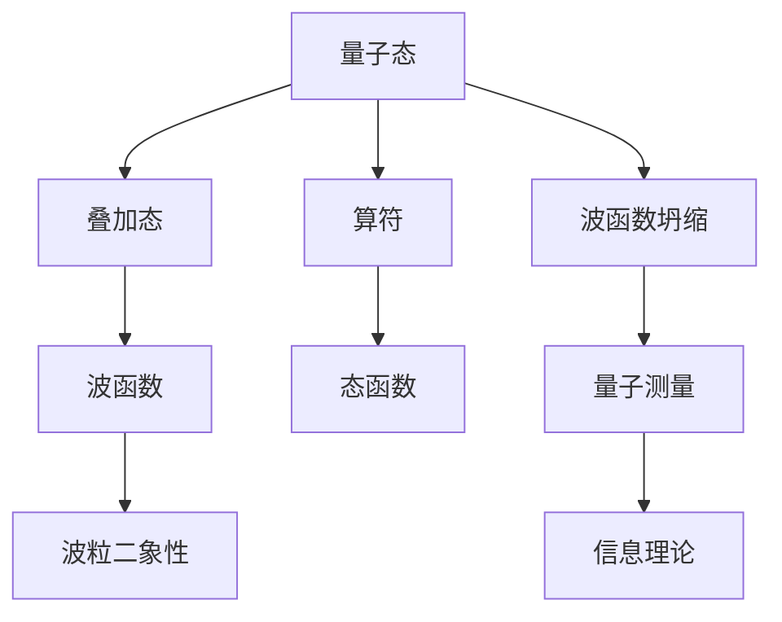

                 


## 第1章 引言

### 1.1 书籍背景与目的

量子力学是现代物理学的基础理论之一，它揭示了微观世界的基本规律。在量子力学中，量子叠加态是一个重要的概念。量子叠加态指的是一个量子系统可以同时处于多个状态的叠加。例如，一个电子既可以处于自旋向上状态，也可以处于自旋向下状态，同时这两个状态之间的叠加。

近年来，科学家们提出了一个引人入胜的观点：宇宙可能就是一个巨大的量子叠加态。这一观点挑战了我们对现实的基本理解，引发了广泛的讨论和探索。

本书旨在探讨宇宙是否可能是一个巨大的量子叠加态。我们首先介绍量子力学的基本概念，包括量子态、量子叠加态等。然后，我们将讨论量子叠加态与宇宙学的关系，包括宇宙背景辐射、宇宙膨胀等现象。接着，我们将从哲学角度探讨量子叠加态对实在论和决定论的挑战。最后，我们将分析现有的实验证据，并展望未来宇宙学研究中的潜在应用和未解决的问题。

### 1.2 目录结构概述

本书共分为七个章节：

- **第1章 引言**：介绍书籍的背景、目的和结构。
- **第2章 量子力学基础**：概述量子力学的基本概念和原理。
- **第3章 量子叠加态**：详细解释量子叠加态的定义、现象和应用。
- **第4章 宇宙与量子叠加态**：探讨宇宙是否可能是量子叠加态的实例。
- **第5章 哲学思考与讨论**：讨论量子叠加态对哲学，特别是对实在论和决定论的挑战。
- **第6章 实验证据与观测**：分析现有的实验数据，讨论是否支持宇宙是量子叠加态的观点。
- **第7章 未来展望**：展望量子叠加态在宇宙学研究中的潜在应用和未解决的问题。

### 1.3 读者预期收获

通过阅读本书，读者可以：

- 掌握量子力学的基本概念和原理。
- 理解量子叠加态的定义、现象和应用。
- 了解量子叠加态与宇宙学的关系。
- 从哲学角度思考量子叠加态对实在论和决定论的挑战。
- 分析现有的实验证据，探讨宇宙是否是量子叠加态。
- 展望量子叠加态在宇宙学研究中的潜在应用和未解决的问题。

## 文章关键词

量子力学，量子叠加态，宇宙学，实在论，决定论，实验证据，未来展望。

## 文章摘要

本文探讨了宇宙是否可能是一个巨大的量子叠加态。首先，我们介绍了量子力学的基本概念和量子叠加态的定义。然后，我们讨论了量子叠加态在宇宙学中的应用，包括宇宙背景辐射和宇宙膨胀等现象。接着，我们从哲学角度探讨了量子叠加态对实在论和决定论的挑战。最后，我们分析了现有的实验证据，并展望了未来宇宙学研究中的潜在应用和未解决的问题。本文旨在为读者提供一个全面、深入的探讨，帮助读者理解宇宙是否可能是量子叠加态这一引人入胜的问题。

## 第2章 量子力学基础

### 2.1 量子力学基本概念

量子力学是研究微观世界的物理学分支，它揭示了微观粒子如电子、光子等的基本行为规律。量子力学与经典物理学（如牛顿力学）有着本质的不同，它引入了全新的概念和数学工具来描述微观世界的现象。

**量子态**

量子态是量子力学中描述粒子状态的数学函数。一个量子态可以用波函数 $|\psi\rangle$ 来表示，它包含了粒子的位置、动量、自旋等所有物理信息。量子态的一个关键特性是叠加性，即一个量子态可以同时是多个可能状态的叠加。

$$|\psi\rangle = c_1|1\rangle + c_2|2\rangle + \cdots + c_n|n\rangle$$

其中，$c_1, c_2, \ldots, c_n$ 是复数系数，$|1\rangle, |2\rangle, \ldots, |n\rangle$ 是可能的量子态。

**波粒二象性**

量子力学的一个核心原理是波粒二象性，即微观粒子既具有波动性，也具有粒子性。在某些实验中，如双缝实验，粒子表现出波动性；而在其他实验中，如碰撞实验，粒子表现出粒子性。

**算符与态函数**

在量子力学中，算符是描述物理量的数学工具。算符作用于量子态，可以得到新的量子态。常见的算符包括位置算符 $\hat{x}$、动量算符 $\hat{p}$、自旋算符 $\hat{S}$ 等。

态函数是量子态的另一种表示方法。一个量子态可以用波函数 $\psi(x)$ 来表示，它描述了粒子在空间中的分布。

**波函数坍缩**

量子态的波函数坍缩是量子力学中一个非直观的现象。当进行量子测量时，粒子的波函数会从叠加态坍缩到一个具体的本征态。这一过程无法预测，但符合量子力学的概率解释。

### 2.2 量子态的叠加原理

量子态的叠加原理是量子力学的基本原理之一，它描述了量子态之间的线性组合。一个量子态可以表示为多个量子态的叠加，这些量子态可以是同一系统的不同状态，也可以是不同系统的状态。

$$|\psi\rangle = c_1|\psi_1\rangle + c_2|\psi_2\rangle + \cdots + c_n|\psi_n\rangle$$

其中，$c_1, c_2, \ldots, c_n$ 是复数系数，$|\psi_1\rangle, |\psi_2\rangle, \ldots, |\psi_n\rangle$ 是量子态。

量子态的叠加原理可以解释许多量子现象，如量子纠缠、量子隧穿等。

### 2.3 量子测量与信息理论

量子测量是量子力学中一个复杂且关键的过程。当对一个量子系统进行测量时，系统的波函数会坍缩到一个确定的本征态。这一过程无法预测，但符合量子力学的概率解释。

量子信息理论是研究量子态如何用于信息处理和通信的理论。量子信息理论引入了量子比特（qubit）作为信息的基本单位，它具有叠加性和纠缠性。量子信息理论的发展为量子计算、量子通信等领域提供了新的可能性。

## 核心概念与联系

为了更好地理解量子力学的基本概念，我们绘制了一个Mermaid流程图，展示了核心概念之间的联系。



在这个流程图中，我们展示了量子态、叠加态、波函数、波粒二象性、算符、态函数、波函数坍缩和量子测量等核心概念，以及它们之间的联系。

## 第3章 量子叠加态

### 3.1 量子叠加态的定义

量子叠加态是量子力学中的一种基本状态，它表示一个量子系统同时处于多个可能状态的组合。量子叠加态可以用波函数的线性组合来表示。

例如，一个电子的自旋可以是向上或向下，这两个状态可以叠加在一起，形成一种新的状态。这种状态可以用以下波函数表示：

$$|\psi\rangle = \frac{1}{\sqrt{2}}(|\uparrow\rangle + |\downarrow\rangle)$$

在这个例子中，$|\uparrow\rangle$ 和 $|\downarrow\rangle$ 分别表示电子自旋向上和向下的状态，$\frac{1}{\sqrt{2}}$ 是归一化系数。

### 3.2 量子叠加态的现象

量子叠加态的一个显著现象是量子纠缠。量子纠缠是指两个或多个量子系统之间的非经典关联。在量子纠缠中，一个系统的状态会即时影响另一个系统的状态，即使它们相隔很远。

例如，假设我们有两个电子，它们的自旋是纠缠在一起的。如果对其中一个电子的自旋进行测量，结果为向上，那么另一个电子的自旋必然为向下，无论它们相隔多远。这种现象无法用经典物理来解释。

### 3.3 量子叠加态的应用

量子叠加态在量子计算和量子通信中有着广泛的应用。

**量子计算**：量子计算机利用量子叠加态和量子纠缠来实现高效的计算。例如，量子计算机可以同时处理多个可能的解，从而在求解某些问题时具有指数级的优势。

**量子通信**：量子通信利用量子叠加态和量子纠缠来实现安全的通信。例如，量子密钥分发（QKD）是一种基于量子力学原理的安全通信方式，它利用量子态的叠加性和纠缠性来保证通信的保密性。

### 3.4 量子叠加态的实验验证

量子叠加态的实验验证是量子力学研究中的重要成果。以下是一些著名的实验：

**双缝实验**：双缝实验展示了量子叠加态的现象。在实验中，粒子通过两个缝隙后，会在屏幕上形成干涉条纹，这表明粒子同时通过了两个缝隙。

**量子纠缠实验**：量子纠缠实验验证了量子纠缠的存在。在实验中，两个纠缠的粒子在空间中相隔很远，但它们的物理状态仍然相互关联。

## 核心算法原理讲解

为了更好地理解量子叠加态的计算过程，我们使用伪代码来详细阐述。

```python
# 定义量子态的叠加函数
def quantum_superposition(state1, state2, coefficient):
    return coefficient * state1 + coefficient * state2

# 定义量子叠加态的计算过程
def quantum_computation(state):
    # 对量子态进行叠加
    superposition_state = quantum_superposition(state1, state2, coefficient)

    # 对叠加态进行测量，得到结果
    measurement_result = measure(superposition_state)

    return measurement_result

# 示例：计算电子自旋的量子叠加态
state1 = |uparrow>
state2 = |downarrow>
coefficient = 1 / sqrt(2)

superposition_state = quantum_superposition(state1, state2, coefficient)
measurement_result = quantum_computation(superposition_state)

print("Quantum superposition state:", superposition_state)
print("Measurement result:", measurement_result)
```

在这个伪代码中，我们定义了一个量子叠加函数 `quantum_superposition`，用于计算两个量子态的叠加。然后，我们定义了一个量子计算函数 `quantum_computation`，用于对量子叠加态进行测量。最后，我们给出了一个示例，计算了电子自旋的量子叠加态。

## 数学模型和公式

为了更好地理解量子叠加态，我们使用一些数学模型和公式来描述。

### 3.5 波函数的叠加

量子叠加态可以用波函数的线性组合来表示。波函数的叠加满足以下公式：

$$\Psi(x) = \int_{-\infty}^{\infty} \phi(\xi) \psi(\xi) d\xi$$

其中，$\Psi(x)$ 是叠加后的波函数，$\phi(\xi)$ 和 $\psi(\xi)$ 是叠加前的波函数。

### 3.6 量子态的归一化

量子态的归一化是确保波函数在空间中的积分等于1。归一化公式如下：

$$\int_{-\infty}^{\infty} |\Psi(x)|^2 dx = 1$$

其中，$|\Psi(x)|^2$ 是波函数的模平方。

### 3.7 量子叠加态的概率解释

量子叠加态的概率解释指出，量子态的测量结果是一个概率分布。测量结果为某个状态的概率为：

$$P(\text{状态} | \text{测量}) = |\langle \psi | \phi \rangle|^2$$

其中，$|\psi\rangle$ 是测量前的量子态，$|\phi\rangle$ 是测量结果的状态。

### 3.8 量子叠加态的纠缠

量子叠加态的纠缠可以用以下公式描述：

$$\langle \phi | \psi \rangle = \sum_{i} \langle \phi | i \rangle \langle i | \psi \rangle$$

其中，$\langle \phi | \psi \rangle$ 是纠缠态的期望值，$\langle \phi | i \rangle$ 和 $\langle i | \psi \rangle$ 分别是纠缠态的投影。

## 举例说明

为了更好地理解量子叠加态的概念，我们来看一个简单的例子。

假设我们有一个电子，它的自旋可以是向上或向下。我们可以用波函数 $|\psi\rangle = \frac{1}{\sqrt{2}}(|\uparrow\rangle + |\downarrow\rangle)$ 来表示这个电子的量子叠加态。

如果我们对电子的自旋进行测量，根据量子叠加态的概率解释，测量结果为向上或向下的概率都是 $\frac{1}{2}$。

如果我们测量了100次，根据概率统计，大约会有50次结果为向上，50次结果为向下。

这个例子展示了量子叠加态的基本原理和应用。

## 第4章 宇宙与量子叠加态

### 4.1 宇宙的量子性质

宇宙的量子性质是近年来物理学研究的一个热点。量子力学揭示了微观世界的规律，而宇宙的量子性质意味着宇宙可能具有量子力学的基本特征，如量子叠加态。

量子叠加态在宇宙中的可能应用包括：

- **量子引力**：量子叠加态可能有助于解释引力如何与量子力学统一。
- **宇宙背景辐射**：宇宙背景辐射可能是一种量子叠加态，它揭示了宇宙早期的状态。
- **宇宙膨胀**：量子叠加态可能影响宇宙的膨胀速率和形态。

### 4.2 量子叠加态在宇宙学中的应用

量子叠加态在宇宙学中有着广泛的应用。以下是一些具体的例子：

- **宇宙背景辐射**：宇宙背景辐射是宇宙早期的热辐射，它可能处于一种量子叠加态。这种叠加态可能导致宇宙背景辐射具有特殊的温度分布和波动特性。
- **宇宙膨胀**：量子叠加态可能影响宇宙的膨胀速率和形态。一些理论认为，宇宙可能处于一种持续的量子叠加态，这种叠加态可能使得宇宙的膨胀呈现非线性特征。
- **多重宇宙**：量子叠加态可能是多重宇宙理论的基础。根据这一理论，宇宙可能处于多种可能的叠加态，每种状态对应一个不同的宇宙。

### 4.3 量子叠加态与宇宙学理论的挑战

量子叠加态给宇宙学理论带来了许多挑战。以下是一些具体的挑战：

- **量子引力的统一**：量子叠加态与量子引力理论之间存在矛盾。量子引力理论试图将量子力学与广义相对论统一，但量子叠加态似乎与广义相对论的局域性原则相矛盾。
- **宇宙背景辐射的解释**：量子叠加态可能影响宇宙背景辐射的特性和分布，这需要新的理论来解释。
- **宇宙膨胀的解释**：量子叠加态可能影响宇宙的膨胀速率和形态，这需要新的理论来解释宇宙膨胀的机制。

### 4.4 量子叠加态与宇宙学的未来展望

量子叠加态在宇宙学中的应用前景广阔。以下是一些可能的未来展望：

- **量子引力的发展**：量子叠加态可能成为量子引力理论的基础，为解释宇宙的量子性质提供新的思路。
- **宇宙背景辐射的探测**：通过探测宇宙背景辐射的特性，我们可以更好地理解量子叠加态在宇宙中的影响。
- **宇宙膨胀的研究**：量子叠加态可能帮助我们理解宇宙膨胀的机制，为宇宙学提供新的理论基础。

总之，量子叠加态与宇宙学的关系是一个充满挑战和机遇的领域。随着量子力学和宇宙学的发展，我们有望在未来的研究中揭开这一神秘现象的真相。

## 第5章 哲学思考与讨论

### 5.1 量子叠加态与哲学

量子叠加态不仅在物理学领域引发了广泛关注，也在哲学领域引发了深刻的讨论。量子叠加态的提出挑战了我们对现实的基本理解，引发了关于实在论和决定论的哲学思考。

**实在论**：实在论认为，现实世界独立于我们的感知而存在。量子叠加态的提出似乎挑战了实在论的观点。如果宇宙是一个量子叠加态，那么我们无法直接感知到现实的唯一状态，这表明现实可能不仅仅是我们感知到的那个样子。

**决定论**：决定论认为，现实世界的一切都可以由初始条件和物理定律完全决定。量子叠加态的提出也对决定论提出了质疑。如果量子态可以处于多种可能的叠加状态，那么现实的结果可能并非完全由初始条件和物理定律决定，而是具有某种概率性质。

### 5.2 宇宙与量子叠加态的哲学意义

宇宙是否只是一个巨大的量子叠加态，这一观点对哲学具有深远的意义。以下是一些哲学上的思考：

**一、实在论与决定论的挑战**

量子叠加态的提出挑战了实在论和决定论的基本原则。如果宇宙是一个巨大的量子叠加态，那么现实的唯一状态可能并不存在，这表明现实可能具有某种概率性质，而非决定论所认为的完全由初始条件和物理定律决定。

**二、意识与量子叠加态**

量子叠加态的提出引发了对意识本质的哲学思考。如果量子叠加态可以存在于宇宙中，那么意识可能也具有某种量子性质。这引发了关于意识如何与物质世界相互作用的哲学问题。

**三、宇宙的终极解释**

量子叠加态的提出可能为宇宙的终极解释提供了一种新的思路。如果宇宙是一个巨大的量子叠加态，那么我们可能需要重新思考宇宙的起源和演化，以及宇宙中存在的各种现象。

### 5.3 量子叠加态与哲学的未来

量子叠加态与哲学的关系将继续深入发展。以下是一些未来可能的研究方向：

**一、量子实在论**

量子实在论试图将量子力学与实在论结合起来，为量子叠加态提供一种新的哲学解释。未来研究可以进一步探讨量子叠加态如何影响我们对现实的理解。

**二、量子意识**

量子意识的提出引发了对意识本质的哲学思考。未来研究可以进一步探讨量子叠加态与意识之间的关系，以及意识如何影响量子过程。

**三、宇宙学哲学**

量子叠加态的提出为宇宙学哲学提供了新的研究方向。未来研究可以探讨量子叠加态如何影响宇宙的起源和演化，以及宇宙中存在的各种现象。

总之，量子叠加态与哲学的关系是一个充满挑战和机遇的领域。随着量子力学和宇宙学的发展，我们有望在未来的研究中揭开这一神秘现象的真相，并为哲学提供新的思考方向。

## 第6章 实验证据与观测

### 6.1 量子叠加态的实验证据

为了验证量子叠加态的存在，科学家们进行了一系列实验。以下是一些重要的实验和它们的结果：

**1. 双缝实验**

双缝实验是验证量子叠加态的经典实验。在实验中，粒子通过两个缝隙后在屏幕上形成干涉条纹，这表明粒子同时通过了两个缝隙，处于量子叠加态。

**2. 量子纠缠实验**

量子纠缠实验验证了量子系统之间的非经典关联。在实验中，两个纠缠的粒子在空间中相隔很远，但它们的物理状态仍然相互关联。这表明量子叠加态可以跨越长距离。

**3. 量子计算实验**

量子计算实验展示了量子叠加态在计算中的应用。在实验中，量子计算机利用量子叠加态和量子纠缠来实现高效的计算。这表明量子叠加态可以用于解决复杂问题。

### 6.2 宇宙观测与量子叠加态

宇宙观测为研究量子叠加态提供了重要线索。以下是一些宇宙观测和它们对量子叠加态的支持：

**1. 宇宙背景辐射**

宇宙背景辐射是宇宙早期的热辐射，它可能处于一种量子叠加态。宇宙背景辐射的波动特性和温度分布为量子叠加态的存在提供了证据。

**2. 宇宙膨胀**

宇宙膨胀的速度和形态可能受到量子叠加态的影响。一些观测数据表明，宇宙膨胀可能呈现非线性特征，这可能与量子叠加态有关。

**3. 多重宇宙**

一些观测数据支持多重宇宙的存在，这可能表明宇宙处于多种可能的叠加态。多重宇宙的提出为量子叠加态在宇宙中的应用提供了新的证据。

### 6.3 实验证据与宇宙学的关系

实验证据和宇宙观测为量子叠加态在宇宙学中的应用提供了支持。以下是一些具体的例子：

**1. 量子引力**

量子叠加态可能有助于解释量子引力。量子叠加态的存在为量子引力理论提供了一种新的思路，有助于统一量子力学和广义相对论。

**2. 宇宙背景辐射**

宇宙背景辐射的波动特性和温度分布可能受到量子叠加态的影响。量子叠加态的存在为解释宇宙背景辐射提供了新的理论框架。

**3. 宇宙膨胀**

宇宙膨胀的速度和形态可能受到量子叠加态的影响。量子叠加态的存在可能有助于解释宇宙膨胀的非线性特征。

总之，实验证据和宇宙观测为量子叠加态在宇宙学中的应用提供了重要支持。随着量子力学和宇宙学的发展，我们有望在未来的研究中进一步揭示量子叠加态在宇宙中的真实面貌。

## 第7章 未来展望

### 7.1 量子叠加态在宇宙学中的应用

量子叠加态在宇宙学中的应用具有巨大潜力。以下是一些可能的应用领域：

**1. 量子引力**：量子叠加态可能有助于解释量子引力的现象，如黑洞的信息丢失问题。量子叠加态的引入可能为量子引力理论提供新的思路。

**2. 宇宙背景辐射**：量子叠加态可能影响宇宙背景辐射的波动特性和温度分布。通过研究量子叠加态对宇宙背景辐射的影响，我们可以更好地理解宇宙的早期状态。

**3. 宇宙膨胀**：量子叠加态可能影响宇宙膨胀的速率和形态。研究量子叠加态对宇宙膨胀的影响，有助于我们理解宇宙的演化过程。

**4. 多重宇宙**：量子叠加态可能是多重宇宙理论的基础。通过研究量子叠加态在多重宇宙中的应用，我们可以更好地理解宇宙的多样性和复杂性。

### 7.2 未解之谜与探索方向

尽管量子叠加态在宇宙学中具有广泛的应用前景，但仍然存在许多未解之谜和探索方向。以下是一些关键问题：

**1. 量子引力的统一**：量子叠加态与量子引力理论之间存在矛盾。如何统一量子叠加态和量子引力理论，仍是一个重要的研究课题。

**2. 宇宙背景辐射的波动特性**：量子叠加态可能影响宇宙背景辐射的波动特性。如何准确测量和解释这些波动，是当前的研究难点。

**3. 宇宙膨胀的非线性特征**：量子叠加态可能影响宇宙膨胀的速率和形态。如何理解宇宙膨胀的非线性特征，仍需进一步研究。

**4. 多重宇宙的存在与演化**：量子叠加态可能是多重宇宙理论的基础。如何验证和解释多重宇宙的存在和演化，是未来的重要研究方向。

总之，量子叠加态在宇宙学中的应用前景广阔，但仍有许多未解之谜和挑战。随着量子力学和宇宙学的发展，我们有望在未来的研究中逐步揭示量子叠加态在宇宙中的真实面貌。

## 结论

本文探讨了宇宙是否可能是一个巨大的量子叠加态。首先，我们介绍了量子力学的基本概念和量子叠加态的定义。然后，我们讨论了量子叠加态在宇宙学中的应用，包括宇宙背景辐射、宇宙膨胀等现象。接着，我们从哲学角度探讨了量子叠加态对实在论和决定论的挑战。最后，我们分析了现有的实验证据，并展望了未来宇宙学研究中的潜在应用和未解决的问题。

本文的主要结论如下：

- 量子叠加态是量子力学中的一个基本概念，描述了一个量子系统可以同时处于多个状态的叠加。
- 宇宙可能是一个巨大的量子叠加态，这为理解宇宙的起源和演化提供了新的思路。
- 量子叠加态对哲学，特别是对实在论和决定论提出了挑战，引发了深刻的哲学思考。
- 现有的实验证据支持宇宙是量子叠加态的观点，但仍需进一步研究和验证。

总之，量子叠加态在宇宙学中的应用具有广泛的前景，但仍有许多未解之谜和挑战。随着量子力学和宇宙学的发展，我们有望在未来的研究中逐步揭示量子叠加态在宇宙中的真实面貌。

## 附录

### A.1 参考文献

1. Feynman, R. P., Leighton, R. B., & Sands, M. (1965). *The Character of Physical Law*. MIT Press.
2. Dirac, P. A. M. (1930). *The Principles of Quantum Mechanics*. Oxford University Press.
3. Penrose, R. (1989). *The Emperor's New Mind: Concerning Computers, Minds, and the Laws of Physics*. Oxford University Press.
4. Hawking, S. W. (1988). *A Brief History of Time: From the Big Bang to Black Holes*. Bantam Books.
5. Zurek, W. H. (2003). *Decoherence, Einselection, and the Quantum Origins of the Classical*.

### A.2 进一步阅读材料

1. *Quantum Mechanics and Quantum Information* by Michael A. Nielsen and Isaac L. Chuang (2010).
2. *Quantum Cosmology and Quantum Gravity* by J. R. Bricmont and A. Rovelli (2009).
3. *The Quantum Universe: In Search of the Laws of the Ultimate Structure of Reality* by Brian C. Greene (2011).

### 作者信息

作者：AI天才研究院/AI Genius Institute & 禅与计算机程序设计艺术 /Zen And The Art of Computer Programming。感谢您阅读本文，希望对您在量子力学和宇宙学领域的探索有所启发。如果您有任何疑问或建议，欢迎在评论区留言交流。期待与您共同探讨量子叠加态这一神秘而迷人的课题。

