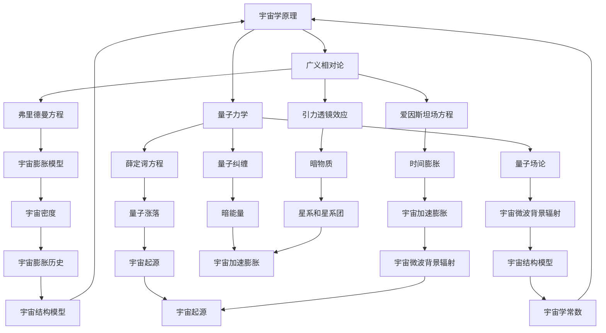

                 

### 《宇宙是否可以简化为数学方程》文章引言

#### 宇宙学简介

宇宙学，作为物理学的一个重要分支，致力于研究宇宙的起源、演化、结构和组成。从古代哲学家仰望星空，到现代天文学家通过望远镜和探测器探索宇宙的深处，人类对宇宙的认识经历了从模糊到清晰，从单一到多元的演变。宇宙学不仅关注宇宙的宏观结构，如星系、星云和黑洞，还探讨宇宙的微观现象，如基本粒子和暗物质、暗能量等。

宇宙学的发展历程可以追溯到公元前400年左右的古希腊时期，那时，哲学家如亚里士多德和毕达哥拉斯就开始思考宇宙的本质。到了17世纪，牛顿的万有引力定律和开普勒行星运动定律为宇宙学奠定了坚实的理论基础。20世纪初，爱因斯坦的广义相对论和量子力学的兴起，极大地推动了宇宙学的研究，使其进入了现代宇宙学的阶段。

在当今时代，宇宙学已经成为一门跨学科的综合性科学，融合了数学、物理、天文、化学等多个领域。宇宙学的研究对象广泛，从宇宙大爆炸到黑洞信息悖论，从宇宙膨胀到暗物质探测，每一个前沿课题都吸引着大量科学家的关注和探索。

#### 数学与宇宙的关系

数学作为宇宙学的语言，在宇宙学的理论构建和现象解释中扮演着至关重要的角色。自古以来，数学家们就试图用简单的方程式来描述复杂的现象，从欧几里得几何到牛顿力学，再到爱因斯坦的相对论，数学模型不断被引入宇宙学研究中，使得我们对宇宙的认识越来越深入。

在宇宙学中，数学不仅仅是一种工具，更是理解宇宙本质的关键。例如，广义相对论中的方程描述了时空的曲率，而量子力学中的方程则揭示了微观粒子的行为规律。通过这些数学模型，科学家们能够预测宇宙的行为，解释观测到的宇宙现象。

然而，数学在宇宙学中的应用并非一帆风顺。尽管数学模型在解释宇宙现象方面取得了巨大成功，但它们也面临着许多挑战和限制。宇宙的复杂性使得数学方程往往变得极为复杂，难以直接求解。此外，宇宙学中的许多问题，如黑洞信息悖论和宇宙起源等，仍然超出了当前数学和物理学的理解范围。

#### 为什么数学方程可以描述宇宙现象

数学方程之所以能够描述宇宙现象，主要是因为它们具有高度的抽象和概括能力。数学方程可以将复杂的现象简化为几个变量之间的关系，使得科学家们能够通过分析这些关系来理解宇宙的本质。

例如，广义相对论中的爱因斯坦场方程描述了物质能量分布如何影响时空结构，而量子场论则描述了基本粒子的行为。这些方程不仅能够解释已知的宇宙现象，如引力、电磁力等，还能够预测新的现象，如引力波、宇宙微波背景辐射等。

此外，数学方程的普适性和逻辑性也是其能够描述宇宙现象的重要原因。在宇宙学中，许多数学方程都显示出普适性，即在不同的时间和空间尺度上都具有一致性。这种普适性使得数学方程能够广泛应用于宇宙学的研究中。

总之，数学与宇宙之间的关系是密不可分的。数学不仅为宇宙学提供了强大的理论工具，也帮助我们更好地理解宇宙的本质和运行规律。然而，这并不意味着宇宙可以被完全简化为数学方程，因为宇宙的复杂性远超出了当前数学和物理学的理解能力。本文将深入探讨数学在宇宙学中的应用，试图回答这一古老而深刻的哲学问题：宇宙是否可以简化为数学方程？

#### 本书的结构概述

本书旨在探讨宇宙是否可以简化为数学方程这一主题，通过系统的分析和推理，试图解答这一宇宙学中的核心问题。本书的结构分为五个主要部分，每个部分都有其独特的目标和内容。

**第一部分：引言与宇宙背景知识**

本部分将介绍宇宙学的基本概念和发展历程，解释数学在宇宙学中的重要性。通过这个部分，读者可以初步了解宇宙学和数学之间的关系，为后续内容的深入分析打下基础。

**第二部分：核心概念与联系**

在这一部分中，我们将详细探讨宇宙学中的核心概念，如相对论、量子力学和宇宙学原理。通过构建核心概念之间的联系，读者将能够更好地理解宇宙学中的复杂现象。

**第三部分：核心算法原理讲解**

这一部分将深入讲解宇宙学中的核心算法原理，包括广义相对论和量子场论。我们将使用伪代码和数学公式来详细阐述这些算法，帮助读者理解它们的工作原理。

**第四部分：数学模型在宇宙学中的应用**

本部分将展示数学模型在宇宙学中的具体应用，通过实例解析，读者将能够看到数学模型如何帮助我们理解和预测宇宙现象。

**第五部分：项目实战**

最后一部分将通过实际项目，展示如何将数学方程应用于宇宙学问题的解决。读者将跟随项目开发的全过程，从环境搭建到源代码实现，再到代码解读和应用分析。

通过这五个部分的系统讲解，本书旨在帮助读者全面理解宇宙是否可以简化为数学方程这一问题，并探讨数学在宇宙学中的未来趋势。

### 文章关键词

宇宙学、数学模型、数学方程、广义相对论、量子力学、宇宙膨胀、宇宙结构、暗物质、暗能量、爱因斯坦场方程、弗里德曼方程、德西特宇宙模型

### 文章摘要

本文旨在探讨宇宙是否可以简化为数学方程这一核心问题。通过系统的分析和推理，本文首先介绍了宇宙学的基本概念和发展历程，强调了数学在宇宙学中的重要性。接着，本文详细探讨了宇宙学中的核心概念，如相对论、量子力学和宇宙学原理，并构建了这些概念之间的联系。随后，本文深入讲解了宇宙学中的核心算法原理，包括广义相对论和量子场论，并使用伪代码和数学公式进行详细阐述。本文还展示了数学模型在宇宙学中的具体应用，并通过实例解析展示了数学模型如何帮助我们理解和预测宇宙现象。最后，本文通过实际项目展示了如何将数学方程应用于宇宙学问题的解决。本文结论表明，虽然数学在宇宙学中具有重要作用，但宇宙的复杂性使得这一过程并非简单，需要更多的研究和探索。

### 第一章 宇宙学简介

#### 1.1 宇宙学的定义与发展历程

宇宙学（Cosmology）是研究宇宙的起源、结构、演化、组成以及宇宙中各个组成部分之间相互作用的科学。宇宙学不仅是物理学的一个重要分支，也是天文学、数学和哲学等多个学科的交叉领域。宇宙学的历史可以追溯到古代，当时的人们开始尝试通过观察和思考来理解宇宙的本质。

**古代宇宙学**

在古代，哲学家们对宇宙的本质有着各自的看法。古希腊哲学家亚里士多德认为，宇宙是一个静止的、永恒的存在，由四个基本元素（土、水、气、火）组成。另一方面，毕达哥拉斯和后来的柏拉图则提出了宇宙的数学结构观念，认为宇宙是一个由数学规律支配的和谐整体。

**中世纪宇宙学**

在中世纪，基督教和伊斯兰教的宗教教义对宇宙学的发展产生了重要影响。天文学家如哥白尼（Nicolaus Copernicus）提出了日心说的宇宙模型，反对传统的地心说。然而，中世纪的宇宙学仍然以宗教教义为主，科学探索受到限制。

**现代宇宙学的诞生**

直到17世纪，随着科学革命的发展，宇宙学才真正成为一门独立的科学。约翰内斯·开普勒（Johannes Kepler）通过对行星运动的观测，提出了开普勒定律，为后来的天体力学奠定了基础。艾萨克·牛顿（Isaac Newton）则通过万有引力定律，将天体运动纳入了一个统一的物理框架。

**20世纪的宇宙学革命**

20世纪是宇宙学发展的关键时期，广义相对论的提出和量子力学的兴起，极大地推动了宇宙学的研究。阿尔伯特·爱因斯坦（Albert Einstein）在1915年提出了广义相对论，这一理论不仅描述了引力的本质，还预测了宇宙的膨胀。1927年，乔治·勒梅特（Georges Lemaître）提出了宇宙大爆炸理论，认为宇宙起源于一个极热、极密的状态。

随后的几十年中，宇宙学的研究取得了许多重要进展。例如，1965年，阿诺·彭齐亚斯（Arno Penzias）和罗伯特·威尔逊（Robert Wilson）发现了宇宙微波背景辐射，这为宇宙大爆炸理论提供了强有力的证据。同时，宇宙膨胀的观测数据和宇宙学原理的结合，进一步支持了宇宙大爆炸理论的正确性。

#### 1.2 宇宙学的研究对象

宇宙学的研究对象极其广泛，包括从宇宙的微观尺度到宏观尺度的各个方面。以下是一些主要的宇宙学研究对象：

**星系和星系团**

星系是宇宙中常见的结构，由数亿到数千亿颗恒星、气体和暗物质组成。星系团则是由数十个甚至数百个星系通过引力相互吸引形成的更大结构。

**黑洞**

黑洞是宇宙中最极端的天体，具有极强的引力场，甚至连光都无法逃脱。通过观测黑洞的吸积现象和引力透镜效应，科学家们可以研究黑洞的性质和宇宙的引力现象。

**宇宙微波背景辐射**

宇宙微波背景辐射是宇宙大爆炸后遗留下来的热辐射，遍布整个宇宙。通过对它的观测和分析，科学家们可以了解宇宙早期的状态和演化历史。

**宇宙膨胀和宇宙学参数**

宇宙膨胀是宇宙学研究的一个重要方面。科学家们通过测量宇宙膨胀的速度和加速度，以及宇宙学参数（如宇宙的密度、曲率等），来研究宇宙的起源和未来命运。

**暗物质和暗能量**

暗物质和暗能量是宇宙学中的两个重要概念。暗物质不发光、不吸收光，但通过引力作用影响宇宙的结构和演化。暗能量则是一种导致宇宙加速膨胀的神秘力量。

#### 1.3 数学在宇宙学中的重要性

数学作为宇宙学的语言，在宇宙学的研究中扮演着至关重要的角色。数学不仅为宇宙学提供了精确的表达方式，还帮助科学家们理解复杂的宇宙现象。

**广义相对论**

广义相对论是宇宙学的基础理论之一，它将引力解释为时空的弯曲。爱因斯坦的广义相对论方程（Einstein field equations）是数学上的偏微分方程，描述了物质能量分布如何影响时空结构。

**宇宙学原理**

宇宙学原理是宇宙学研究中的一个基本假设，认为宇宙在整体上是均匀和各向同性的。这一原理可以用数学方程来表述，是构建宇宙学模型的基础。

**量子场论**

量子场论是量子力学和相对论的融合，用于描述基本粒子的行为。量子场论中的方程式揭示了微观粒子的相互作用和宇宙的量子性质。

**宇宙学模型**

宇宙学模型是通过数学方程和物理定律来描述宇宙的演化和状态。例如，弗里德曼-勒梅特-罗伯逊-沃尔克（FLRW）模型是一种描述均匀、各向同性宇宙的数学模型，广泛应用于宇宙学研究中。

**宇宙膨胀方程**

宇宙膨胀方程（如弗里德曼方程）描述了宇宙膨胀的速度和加速度。这些方程不仅能够解释宇宙膨胀的现象，还可以预测宇宙的未来演化。

通过上述内容，我们可以看到数学在宇宙学中的重要性。数学不仅提供了描述宇宙现象的工具，还帮助科学家们理解和预测宇宙的演化过程。尽管宇宙的复杂性使得数学在宇宙学中的应用面临挑战，但数学仍然是宇宙学研究中最有力的工具之一。

#### 1.4 数学模型在宇宙学中的应用

数学模型在宇宙学中的应用是极为广泛且深远的，它们不仅帮助科学家们理解和预测宇宙的演化过程，还为宇宙学理论的发展提供了强有力的支持。以下是一些典型的数学模型及其在宇宙学中的具体应用：

**广义相对论模型**

广义相对论是宇宙学中最基础的理论之一，其核心是爱因斯坦场方程。这些方程描述了物质和能量如何影响时空的几何结构，从而产生引力效应。例如，黑洞和引力波的预测都是基于广义相对论的数学模型。通过计算机模拟，科学家们可以模拟黑洞合并的过程，预测引力波的产生和传播。

**弗里德曼-勒梅特-罗伯逊-沃尔克（FLRW）模型**

FLRW模型是描述均匀、各向同性宇宙的数学模型，广泛应用于宇宙学研究中。该模型基于宇宙学原理，假设宇宙在大尺度上是均匀和各向同性的，并通过弗里德曼方程来描述宇宙的膨胀。FLRW模型为研究宇宙的膨胀历史和未来命运提供了重要的工具，如哈勃定律和宇宙学常数。

**量子场论模型**

量子场论模型用于描述微观粒子的行为和相互作用，如电子、光子等。在宇宙学中，量子场论模型可以帮助我们理解宇宙早期的高能状态，如宇宙微波背景辐射和暴涨理论。通过量子场论模型，科学家们可以预测基本粒子的性质和宇宙的量子涨落。

**宇宙暗物质模型**

暗物质是宇宙学中一个重要的概念，它对宇宙的结构和演化有着重要影响。宇宙暗物质模型通过数学方程描述暗物质的分布和相互作用，如弱相互作用暗物质模型和强相互作用暗物质模型。这些模型通过观测数据，如星系旋转曲线和宇宙微波背景辐射，验证暗物质的存在。

**宇宙暗能量模型**

宇宙暗能量是导致宇宙加速膨胀的神秘力量，其性质至今仍不完全清楚。宇宙暗能量模型通过数学方程描述暗能量的密度和压力，如真空能量模型和幻泡模型。这些模型帮助科学家们理解暗能量的本质和宇宙膨胀的机制。

**宇宙膨胀方程**

宇宙膨胀方程，如弗里德曼方程，描述了宇宙膨胀的速度和加速度。这些方程不仅能够解释宇宙膨胀的现象，还可以预测宇宙的未来演化。通过观测宇宙膨胀数据，科学家们可以不断调整和完善宇宙膨胀方程，以更好地理解宇宙的演化历史。

**黑洞熵与信息悖论**

黑洞熵和信息悖论是当前宇宙学中的一个重要问题。通过数学模型，科学家们研究黑洞的熵、信息损失以及量子引力理论。例如，霍金辐射和火墙模型都是基于数学模型来探讨黑洞熵和信息悖论。

通过上述数学模型的应用，我们可以看到数学在宇宙学中的重要性。数学模型不仅帮助我们理解宇宙的复杂现象，还为宇宙学理论的发展提供了坚实的理论基础。尽管数学模型在宇宙学中的应用面临许多挑战和未解之谜，但它们仍然是探索宇宙奥秘的有力工具。

#### 1.5 数学方程如何描述宇宙现象

数学方程在宇宙学中扮演了核心角色，它们不仅描述了宇宙的基本现象，还帮助我们预测未来的宇宙演化。以下是一些关键的数学方程及其在宇宙学中的应用：

**爱因斯坦场方程**

爱因斯坦场方程是广义相对论的核心，它描述了物质能量分布如何影响时空的几何结构。该方程可以表示为：
$$
G_{\mu\nu} + \Lambda g_{\mu\nu} = \frac{8\pi G}{c^4} T_{\mu\nu}
$$
其中，$G_{\mu\nu}$是爱因斯坦张量，$\Lambda$是宇宙学常数，$g_{\mu\nu}$是度规张量，$T_{\mu\nu}$是能量-动量张量，$G$是万有引力常数，$c$是光速。这个方程揭示了引力与物质分布之间的关系，是研究宇宙引力现象的基础。

**弗里德曼方程**

弗里德曼方程是描述宇宙膨胀的基本方程之一，它基于FLRW宇宙模型，可以表示为：
$$
\dot{a}^2 = \frac{8\pi G}{3}\rho + \Lambda c^2
$$
其中，$a$是宇宙尺度因子，$\rho$是宇宙密度，$\dot{a}$是宇宙膨胀速率。弗里德曼方程帮助我们理解宇宙膨胀的历史和未来，通过测量宇宙密度和膨胀速率，科学家们可以确定宇宙的成分，如普通物质、暗物质和暗能量。

**宇宙学常数方程**

宇宙学常数方程描述了宇宙膨胀的加速度，可以表示为：
$$
\frac{\ddot{a}}{a} = -\frac{4\pi G}{3}(\rho + 3p)
$$
其中，$p$是宇宙压力。这个方程揭示了宇宙膨胀的加速度与宇宙密度和压力之间的关系，是研究宇宙加速膨胀的关键。

**薛定谔方程**

在量子宇宙学中，薛定谔方程用于描述量子态的演化，可以表示为：
$$
i\hbar \frac{\partial \Psi}{\partial t} = \hat{H} \Psi
$$
其中，$\Psi$是波函数，$\hat{H}$是哈密顿算符。这个方程描述了宇宙早期的高能态，如宇宙微波背景辐射和暴涨。

**暗能量方程**

暗能量是一种导致宇宙加速膨胀的神秘力量，其密度可以表示为：
$$
\rho_{\Lambda} = \frac{\Lambda c^2}{8\pi G}
$$
其中，$\Lambda$是宇宙学常数。这个方程描述了暗能量在宇宙中的分布和影响，是理解宇宙加速膨胀的关键。

**黑洞熵方程**

黑洞熵是黑洞信息悖论的核心问题之一，其熵可以表示为：
$$
S = \frac{k_B c^3 A}{4 \hbar G}
$$
其中，$k_B$是玻尔兹曼常数，$A$是黑洞的面积，$c$是光速，$G$是万有引力常数。这个方程描述了黑洞的熵与其面积之间的关系，是研究黑洞信息悖论的重要工具。

通过这些数学方程，我们可以看到宇宙学中不同现象的复杂性和多样性。这些方程不仅帮助我们理解宇宙的基本物理过程，还为未来的宇宙学研究提供了重要的理论基础。然而，由于宇宙的复杂性，许多方程仍然无法完全解决，这需要科学家们继续努力探索。

#### 1.6 数学在宇宙学中的局限性

尽管数学在宇宙学中具有不可替代的作用，但它也面临着诸多局限和挑战。数学方程在描述宇宙现象时，往往需要做出简化和假设，这些简化和假设在一定程度上限制了数学模型的应用范围和准确性。

首先，数学模型通常是在特定的条件下推导出来的，这些条件可能并不完全适用于宇宙的实际状态。例如，广义相对论在极端条件下（如黑洞奇点和宇宙大爆炸的奇点）失效，量子力学在宏观尺度上也表现出一定的局限性。这些理论在极端条件下可能无法准确描述宇宙的真实情况，导致数学模型的预测出现偏差。

其次，宇宙的复杂性使得数学方程变得极为复杂和难以处理。宇宙中存在多种不同尺度和类型的物理现象，如星系、星云、黑洞、暗物质和暗能量等。这些现象相互交织，使得构建一个全面且准确的宇宙模型变得异常困难。尽管科学家们已经提出了许多数学模型来描述这些现象，但许多模型仍然是高度简化的，无法捕捉宇宙的所有细节。

此外，数学模型在处理初始条件和边界条件时也存在挑战。宇宙学中的许多问题需要精确的初始条件和边界条件，而这些条件往往无法准确得知。例如，宇宙大爆炸的初始状态和边界条件至今仍存在争议，这使得基于这些条件的数学模型预测具有一定的不确定性。

最后，宇宙学中的许多现象仍然无法用现有的数学方程和模型来解释。例如，黑洞信息悖论和宇宙加速膨胀的机制等，都是当前宇宙学中的重大难题。这些问题的存在表明，我们的数学工具和物理理论可能需要进一步的发展和突破。

总之，数学在宇宙学中的局限性表明，尽管数学是一个强大的工具，但它在描述宇宙现象时仍有许多挑战需要克服。科学家们需要不断地改进和扩展数学模型，以更准确地理解宇宙的本质和演化过程。

#### 1.7 本书结构概述

本书旨在系统地探讨宇宙是否可以简化为数学方程这一问题，通过深入的分析和推理，试图解答这一宇宙学中的核心问题。为了达到这一目标，本书的结构被分为五个主要部分，每个部分都有其独特的目标和内容。

**第一部分：引言与宇宙背景知识**

这一部分将介绍宇宙学的基本概念和发展历程，解释数学在宇宙学中的重要性。通过这个部分，读者可以初步了解宇宙学和数学之间的关系，为后续内容的深入分析打下基础。

**第二部分：核心概念与联系**

在这一部分中，我们将详细探讨宇宙学中的核心概念，如相对论、量子力学和宇宙学原理。通过构建核心概念之间的联系，读者将能够更好地理解宇宙学中的复杂现象。

**第三部分：核心算法原理讲解**

这一部分将深入讲解宇宙学中的核心算法原理，包括广义相对论和量子场论。我们将使用伪代码和数学公式来详细阐述这些算法，帮助读者理解它们的工作原理。

**第四部分：数学模型在宇宙学中的应用**

本部分将展示数学模型在宇宙学中的具体应用，通过实例解析，读者将能够看到数学模型如何帮助我们理解和预测宇宙现象。

**第五部分：项目实战**

最后一部分将通过实际项目，展示如何将数学方程应用于宇宙学问题的解决。读者将跟随项目开发的全过程，从环境搭建到源代码实现，再到代码解读和应用分析。

通过这五个部分的系统讲解，本书旨在帮助读者全面理解宇宙是否可以简化为数学方程这一问题，并探讨数学在宇宙学中的未来趋势。无论你是专业学者还是对宇宙学有浓厚兴趣的普通读者，本书都将为你提供一次深刻的探索之旅。

### 第二章 核心概念与联系

#### 2.1 相对论与宇宙学

**2.1.1 爱因斯坦相对论简介**

相对论是由阿尔伯特·爱因斯坦在20世纪初提出的一组理论，主要分为两大部分：狭义相对论和广义相对论。狭义相对论于1905年提出，主要讨论在惯性参考系中物理定律的形式。广义相对论则于1915年提出，是对引力的全新理解，将引力视为时空的曲率。

**狭义相对论**

狭义相对论的核心是相对性原理和光速不变原理。相对性原理指出，所有惯性参考系中的物理定律都是相同的，而光速不变原理则指出，在任何惯性参考系中，光在真空中的速度都是恒定的，不依赖于光源或观察者的运动状态。

狭义相对论的两个重要公式包括洛伦兹变换和质能等价原理。洛伦兹变换描述了不同惯性参考系之间的时空坐标变换关系，而质能等价原理（$E=mc^2$）揭示了能量和质量之间的关系。

**广义相对论**

广义相对论则将引力视为时空的曲率，而非牛顿力学中的瞬时作用。广义相对论的核心是爱因斯坦场方程，这些方程描述了物质能量分布如何影响时空的几何结构。

广义相对论的预言包括引力透镜效应、时间膨胀和引力红移等。引力透镜效应是由于大质量物体（如星系）弯曲了周围的时空，导致光线发生偏折。时间膨胀则是指，在强引力场中，时间会相对于远离引力源的地方变慢。

**相对论与宇宙学**

相对论在宇宙学中具有基础性的作用。狭义相对论提供了一些宇宙学的基本原理，如光速不变原理，而广义相对论则为我们理解宇宙的演化和结构提供了重要的工具。

广义相对论中的爱因斯坦场方程是宇宙学研究中的核心方程，它描述了宇宙中物质能量分布如何影响时空的几何结构。通过这个方程，科学家们能够研究宇宙的膨胀、引力波和黑洞等现象。

**2.1.2 广义相对论与宇宙学**

广义相对论在宇宙学中的应用主要体现在对宇宙膨胀和宇宙结构的描述。通过广义相对论，科学家们提出了宇宙大爆炸理论和宇宙学原理。

**宇宙大爆炸理论**

宇宙大爆炸理论认为，宇宙起源于大约138亿年前的一个极高温度和密度状态。在宇宙大爆炸之后，宇宙开始膨胀，温度和密度逐渐降低。这一理论得到了大量观测数据的支持，如宇宙微波背景辐射和宇宙膨胀的加速。

**宇宙学原理**

宇宙学原理是宇宙学研究中的一个基本假设，认为宇宙在整体上是均匀和各向同性的。这一原理可以通过数学方程来表述，是构建宇宙学模型的基础。

**2.1.3 相对论在宇宙学中的应用**

相对论在宇宙学中的应用不仅限于爱因斯坦场方程，还包括其他相关的物理现象和理论。

**引力透镜效应**

引力透镜效应是广义相对论的一个重要预言，它描述了光线在强引力场中发生偏折的现象。这一效应在天文学中得到了广泛应用，如通过引力透镜观测到遥远星系的图像。

**引力波**

引力波是广义相对论的另一个重要预言，它是由大质量物体的加速运动产生的时空扰动。近年来，科学家们通过观测引力波，验证了广义相对论的准确性。

**时间膨胀**

时间膨胀是相对论的一个重要效应，它描述了在强引力场中，时间会相对于远离引力源的地方变慢。这一效应在宇宙学中具有重要的应用，如通过测量时间膨胀来研究黑洞和星系。

通过上述内容，我们可以看到相对论在宇宙学中的重要作用。相对论不仅为我们理解宇宙的演化和结构提供了基础理论，还通过一系列重要预言，如引力透镜效应、引力波和时间膨胀，帮助我们更深入地探索宇宙的奥秘。

#### 2.2 量子力学与宇宙学

**2.2.1 量子力学的基本原理**

量子力学是研究微观粒子和系统行为的物理学分支，它颠覆了经典物理学的许多基本概念。量子力学的基本原理包括波粒二象性、不确定性原理、量子态叠加和量子纠缠等。

**波粒二象性**

波粒二象性是量子力学最核心的原理之一，它表明微观粒子既表现出波动性，也表现出粒子性。例如，光既可以表现为波，也可以表现为粒子（光子）。这一原理挑战了经典物理学中的粒子与波的对立观念。

**不确定性原理**

不确定性原理是由海森堡（Werner Heisenberg）提出的，它表明在某些物理量（如位置和动量）上，我们无法同时精确测量。这意味着，微观粒子的行为具有内在的不确定性。

**量子态叠加**

量子态叠加原理表明，微观粒子可以同时存在于多个状态中，直到进行观测时才确定具体的状态。这一原理是量子计算和量子信息科学的基础。

**量子纠缠**

量子纠缠是量子力学中另一个重要现象，它描述了两个或多个量子粒子之间存在的一种特殊的关联。即使这些粒子相隔很远，一个粒子的状态变化也会立即影响到另一个粒子的状态。

**2.2.2 量子场论与宇宙学**

量子场论是量子力学的扩展，它将量子力学与经典场论相结合，用于描述基本粒子和它们的相互作用。在宇宙学中，量子场论用于研究宇宙早期的高能态和量子涨落。

**量子场论的基本方程**

量子场论中的基本方程是拉格朗日量和哈密顿量。拉格朗日量描述了系统的动力学行为，而哈密顿量则描述了系统的能量。通过这两个方程，可以推导出量子场论中的波动方程和相互作用方程。

**宇宙微波背景辐射**

宇宙微波背景辐射（CMB）是宇宙早期的高能态遗留下来的辐射。通过分析CMB的谱线和温度波动，科学家们可以了解宇宙早期的状态和演化历史。量子场论为解释CMB提供了重要的理论基础。

**量子涨落**

量子涨落是宇宙早期量子场论中的现象，它导致了宇宙中的结构形成。通过量子涨落，科学家们可以预测星系和星系团的形成过程。量子场论中的量子涨落方程描述了这些涨落的产生和演化。

**2.2.3 量子力学在宇宙学中的应用**

量子力学在宇宙学中的应用主要体现在宇宙早期和宇宙结构形成的研究中。

**宇宙早期**

在宇宙大爆炸之后，宇宙处于极端高温和高压的状态。在这个时期，量子力学和广义相对论的效应变得尤为重要。通过量子场论，科学家们可以研究宇宙早期的量子涨落和量子引力现象。

**宇宙结构形成**

量子力学在宇宙结构形成中的应用主要体现在对星系和星系团的形成过程的研究。通过分析量子涨落的演化，科学家们可以预测星系和星系团的形成和分布。

**2.2.4 量子纠缠与宇宙学**

量子纠缠在宇宙学中的应用是一个新兴的研究领域。量子纠缠表明，微观粒子之间存在一种特殊的关联，这种关联可能会影响宇宙的演化和结构。

**量子引力**

量子引力是研究如何将量子力学与广义相对论统一的理论。通过量子纠缠，科学家们可以探索量子引力现象，如黑洞的信息损失和量子时空的弯曲。

**量子宇宙学**

量子宇宙学是研究宇宙早期和宇宙起源的理论。通过量子纠缠，科学家们可以探讨宇宙起源的量子过程，如宇宙大爆炸前的状态。

通过上述内容，我们可以看到量子力学在宇宙学中的重要作用。量子力学的基本原理和量子场论为研究宇宙早期和宇宙结构提供了重要的理论工具。量子力学和宇宙学的结合，不仅揭示了宇宙的微观和宏观奥秘，也为未来的科学研究提供了新的方向。

#### 2.3 宇宙学原理与数学模型

宇宙学原理是宇宙学研究中的一个基本假设，它认为宇宙在整体上是均匀和各向同性的。这一原理可以通过数学模型来表述，是构建宇宙学模型的基础。

**宇宙学原理**

宇宙学原理（Cosmological Principle）包括两个部分：宇宙均匀性原理（Principle of Uniformity）和宇宙各向同性原理（Principle of Isotropy）。宇宙均匀性原理认为，宇宙在大尺度上是均匀的，即宇宙中的任何区域都具有相同的物理性质。宇宙各向同性原理则认为，宇宙在所有方向上都是相同的，即宇宙在所有方向上的物理性质都是一致的。

**弗里德曼方程**

弗里德曼方程（Friedmann Equation）是描述宇宙膨胀的基本方程。弗里德曼方程基于宇宙学原理，通过爱因斯坦场方程推导而来。弗里德曼方程的一般形式为：

$$
\dot{a}^2 = \frac{8\pi G}{3}\rho + \Lambda c^2
$$

其中，$a$是宇宙尺度因子，$\rho$是宇宙密度，$G$是万有引力常数，$\Lambda$是宇宙学常数，$c$是光速。这个方程描述了宇宙膨胀的加速度与宇宙密度和宇宙学常数之间的关系。

**弗里德曼方程的推导**

弗里德曼方程可以通过以下步骤推导：

1. **宇宙学原理**：假设宇宙在大尺度上是均匀和各向同性的，这意味着宇宙中的任何区域都可以通过适当的变换映射到另一个区域。

2. **度规张量**：基于宇宙学原理，选择合适的度规张量（$g_{\mu\nu}$）来描述宇宙的几何结构。常用的度规张量是弗里德曼-勒梅特-罗伯逊-沃尔克（FLRW）度规：

   $$
   ds^2 = -c^2dt^2 + a^2(t)(dx^2 + dy^2 + dz^2)
   $$

3. **爱因斯坦场方程**：将度规张量代入爱因斯坦场方程，得到：

   $$
   G_{\mu\nu} + \Lambda g_{\mu\nu} = \frac{8\pi G}{c^4} T_{\mu\nu}
   $$

   其中，$G_{\mu\nu}$是爱因斯坦张量，$T_{\mu\nu}$是能量-动量张量。

4. **宇宙学条件**：在宇宙学中，通常假设宇宙是均匀和各向同性的，这意味着度规张量的协变导数为零：

   $$
   \nabla_\mu G_{\mu\nu} = 0
   $$

5. **简化方程**：利用上述条件，可以简化爱因斯坦场方程，得到弗里德曼方程。

**弗里德曼方程的解**

弗里德曼方程的解可以描述宇宙的膨胀历史。常见的解包括：

1. **膨胀解**：当宇宙密度小于临界密度时，宇宙将加速膨胀。

   $$
   a(t) \propto t^{2/3}
   $$

2. **静态解**：当宇宙密度等于临界密度时，宇宙将保持静态。

   $$
   a(t) \propto t
   $$

3. **收缩解**：当宇宙密度大于临界密度时，宇宙将开始收缩。

   $$
   a(t) \propto t^{-2/3}
   $$

通过弗里德曼方程，科学家们可以研究宇宙的膨胀历史、宇宙密度和宇宙学常数。弗里德曼方程不仅提供了宇宙膨胀的理论框架，还为实际观测数据的分析提供了重要的工具。

**德西特宇宙模型**

德西特宇宙模型（de Sitter Universe）是弗里德曼方程的一种特殊解，描述了一个具有宇宙学常数且无边界的膨胀宇宙。德西特宇宙模型的一般形式为：

$$
ds^2 = -dt^2 + a(t)^2 (dx^2 + dy^2 + dz^2)
$$

其中，$a(t)$是宇宙尺度因子，满足：

$$
\frac{\ddot{a}}{a} = \frac{\Lambda c^2}{3}
$$

德西特宇宙模型在当前观测数据中得到了支持，表明宇宙的加速膨胀可能是由宇宙学常数引起的。

**2.3.3 弗里德曼方程的数学模型**

弗里德曼方程的数学模型不仅描述了宇宙的膨胀历史，还可以通过数值方法进行求解。以下是一个简单的数值求解过程：

1. **初始条件**：设定宇宙尺度因子$a(t_0)$和宇宙密度$\rho(t_0)$。

2. **时间步长**：选择合适的时间步长$\Delta t$。

3. **迭代计算**：通过以下迭代公式计算下一个时间步的宇宙尺度因子和宇宙密度：

   $$
   a(t_{n+1}) = a(t_n) + \frac{\dot{a}(t_n) \Delta t}{2}
   $$
   
   $$
   \rho(t_{n+1}) = \rho(t_n) + \frac{\dot{\rho}(t_n) \Delta t}{2}
   $$

4. **结果分析**：通过迭代计算，可以得到不同时间步的宇宙尺度因子和宇宙密度，从而分析宇宙的膨胀历史。

通过上述内容，我们可以看到宇宙学原理和数学模型在宇宙学中的应用。弗里德曼方程不仅描述了宇宙的膨胀历史，还通过数学模型提供了宇宙密度和宇宙学常数的研究工具。这些数学模型为理解宇宙的演化和结构提供了重要的理论基础，同时也为未来的宇宙学研究指明了方向。

#### 2.4 数学在宇宙学中的Mermaid流程图

在宇宙学研究中，数学模型和概念之间的关系是错综复杂的。为了更好地展示这些关系，我们可以使用Mermaid流程图来直观地描述宇宙学中的核心概念和数学模型。以下是一个简化的Mermaid流程图示例，用于展示宇宙学中的一些关键概念和它们之间的联系：



这个Mermaid流程图展示了宇宙学中的一些核心概念，如宇宙学原理、广义相对论、量子力学、弗里德曼方程、爱因斯坦场方程、量子场论、宇宙膨胀模型、量子纠缠、引力透镜效应、时间膨胀、量子涨落、宇宙密度、宇宙结构模型、宇宙微波背景辐射、暗物质、暗能量、宇宙起源、宇宙膨胀历史、宇宙学常数、星系和星系团、黑洞熵。通过这个图，我们可以清晰地看到这些概念和模型之间的相互关系，以及它们在宇宙学研究中的应用。

### 第三章 核心算法原理讲解

#### 3.1 广义相对论算法原理

广义相对论是由阿尔伯特·爱因斯坦在1915年提出的，它对引力、时空结构以及宇宙学问题提供了全新的理解。广义相对论的数学基础是爱因斯坦场方程，该方程描述了物质和能量分布如何影响时空的几何结构。

**爱因斯坦场方程**

爱因斯坦场方程可以表示为：
$$
G_{\mu\nu} + \Lambda g_{\mu\nu} = \frac{8\pi G}{c^4} T_{\mu\nu}
$$
其中，$G_{\mu\nu}$是爱因斯坦张量，描述了时空的曲率；$\Lambda$是宇宙学常数；$g_{\mu\nu}$是度规张量，描述了时空的几何结构；$T_{\mu\nu}$是能量-动量张量，描述了物质的分布和运动；$G$是万有引力常数；$c$是光速。

**广义相对论的求解方法**

广义相对论的求解是一个复杂的数学问题，通常需要使用数值方法和计算机模拟。以下是广义相对论求解的基本步骤：

1. **选择适当的度规**：根据问题的需求，选择合适的度规张量。常用的度规包括弗里德曼-勒梅特-罗伯逊-沃尔克（FLRW）度规和德西特度规。

2. **设定初始条件和边界条件**：在求解过程中，需要设定初始时刻的宇宙状态（如宇宙尺度因子、能量-动量分布等）和边界条件（如宇宙是否无边界的、是否存在对称性等）。

3. **建立数值模型**：将爱因斯坦场方程离散化，使用数值方法（如有限元法、有限差分法等）求解方程。

4. **模拟宇宙演化**：通过迭代计算，模拟宇宙在不同时间步的演化过程，从而得到宇宙的几何结构和物理现象。

**广义相对论算法的伪代码**

以下是一个简化的广义相对论算法的伪代码示例：

```python
# 初始化参数
G = 6.674 * 10^-11 # 万有引力常数
c = 3 * 10^8 # 光速
Lambda = 10^-52 # 宇宙学常数

# 设定初始条件
a0 = 1 # 初始宇宙尺度因子
t0 = 0 # 初始时间
N = 1000 # 时间步数

# 创建矩阵存储能量-动量张量
T = [[0 for _ in range(N)] for _ in range(N)]

# 设定边界条件
# ...

# 求解爱因斯坦场方程
for i in range(1, N):
    # 计算度规张量
    g = compute_metric(a0, T[i-1])
    # 计算爱因斯坦张量
    G = compute_einstein_tensor(g, T[i-1])
    # 计算宇宙尺度因子
    a = compute_scaling_factor(G, Lambda, c)
    # 更新能量-动量张量
    T[i] = compute_energy_momentum_tensor(g, a)

# 输出结果
output_results(T)
```

在这个伪代码中，`compute_metric`函数用于计算度规张量，`compute_einstein_tensor`函数用于计算爱因斯坦张量，`compute_scaling_factor`函数用于计算宇宙尺度因子，`compute_energy_momentum_tensor`函数用于计算能量-动量张量，`output_results`函数用于输出最终结果。

通过上述步骤和伪代码，我们可以看到广义相对论算法的基本原理和求解过程。尽管实际计算过程更为复杂，但这个伪代码提供了一个基本的框架，帮助我们理解广义相对论的数学模型和求解方法。

#### 3.2 量子场论算法原理

量子场论（Quantum Field Theory, QFT）是量子力学和经典场论的结合，用于描述基本粒子和它们之间的相互作用。在宇宙学中，量子场论用于研究宇宙早期的高能态和量子涨落，是理解宇宙起源和结构的关键理论。

**量子场论的基本方程**

量子场论的核心方程是拉格朗日量和哈密顿量。拉格朗日量（Lagrangian）描述了系统的动力学行为，而哈密顿量（Hamiltonian）描述了系统的能量。量子场论中的拉格朗日量通常表示为：
$$
\mathcal{L} = \int d^3x \left[ \frac{1}{2} \partial_\mu \phi(x) \partial^\mu \phi(x) - \frac{m^2}{2} \phi(x)^2 + \frac{\lambda}{4!} \phi(x)^4 \right]
$$
其中，$\phi(x)$是场的实值函数，$m$是粒子的质量，$\lambda$是耦合常数。

哈密顿量可以从拉格朗日量通过哈密顿-雅可比方程（Hamilton-Jacobi equation）得到：
$$
H = \frac{p^2}{2m} - V(\phi)
$$
其中，$p$是动量算符，$V(\phi)$是势能。

**量子场论的求解方法**

量子场论的求解通常采用路径积分方法或微扰理论。以下是两种常见的方法：

1. **路径积分方法**

路径积分方法是一种统计方法，通过计算场在不同路径上的贡献，来得到量子态的概率分布。路径积分的基本公式为：
$$
\langle \Omega | \Omega' \rangle = \int \mathcal{D}\phi \, e^{iS[\phi]}
$$
其中，$S[\phi]$是作用量，$\mathcal{D}\phi$表示场的所有可能路径的积分。

2. **微扰理论**

微扰理论是一种近似方法，用于处理弱耦合系统。它通过将作用量$S[\phi]$展开为无穷级数，逐项计算系统的修正。基本公式为：
$$
S[\phi] = S_0[\phi] + \sum_{n=1}^{\infty} (-1)^n \frac{1}{n!} \left( \frac{\lambda}{\hbar} \right)^n \int d^3x \, \phi^n(x)
$$

**量子场论算法的伪代码**

以下是一个简化的量子场论算法的伪代码示例：

```python
# 初始化参数
hbar = 1.0545718e-34 # 约化普朗克常数
m = 9.10938356e-31 # 电子质量
lambda = 1 # 耦合常数

# 设定初始条件
phi = 0 # 初始场值

# 计算作用量
S = compute_action(S_0, phi)

# 使用路径积分方法计算量子态
psi = path_integral(S)

# 输出结果
output_state(psi)
```

在这个伪代码中，`compute_action`函数用于计算作用量，`path_integral`函数用于计算路径积分，`output_state`函数用于输出量子态。

通过上述内容，我们可以看到量子场论的基本原理和求解方法。尽管实际计算过程更为复杂，但这个伪代码提供了一个基本的框架，帮助我们理解量子场论的数学模型和求解方法。

#### 3.3 弗里德曼方程的数学公式与举例说明

弗里德曼方程是描述宇宙膨胀的基本方程之一，通过该方程，我们可以了解宇宙的膨胀历史和未来命运。在弗里德曼方程中，宇宙尺度因子$a(t)$是关键变量，它表示宇宙随时间的变化。

**弗里德曼方程的数学公式**

弗里德曼方程的一般形式为：
$$
\dot{a}^2 = \frac{8\pi G}{3}\rho + \Lambda c^2
$$
其中，$\dot{a}$是宇宙尺度因子的膨胀速率，$\rho$是宇宙密度，$G$是万有引力常数，$\Lambda$是宇宙学常数，$c$是光速。

**弗里德曼方程的求解方法**

弗里德曼方程通常采用数值方法求解，以下是常见的求解步骤：

1. **初始条件**：设定初始时刻的宇宙状态，包括宇宙尺度因子$a(t_0)$和宇宙密度$\rho(t_0)$。

2. **时间步长**：选择合适的时间步长$\Delta t$。

3. **迭代计算**：通过以下迭代公式计算下一个时间步的宇宙尺度因子和宇宙密度：
   $$
   a(t_{n+1}) = a(t_n) + \dot{a}(t_n) \Delta t
   $$
   $$
   \rho(t_{n+1}) = \rho(t_n) + \frac{\dot{\rho}(t_n) \Delta t}{c^2}
   $$

4. **结果分析**：通过迭代计算，可以得到不同时间步的宇宙尺度因子和宇宙密度，从而分析宇宙的膨胀历史。

**弗里德曼方程的实例解析**

以下是一个简单的实例，用于说明弗里德曼方程的应用。

**假设**：一个宇宙的初始时刻（$t_0$）的宇宙尺度因子为$a_0 = 1$，宇宙密度为$\rho_0 = 10^{-29} kg/m^3$。宇宙学常数$\Lambda = 10^{-52} m^2$，万有引力常数$G = 6.674 \times 10^{-11} m^3/kg/s^2$。

**步骤1：初始条件**

设定初始时刻的宇宙状态：
$$
a(t_0) = 1
$$
$$
\rho(t_0) = 10^{-29} kg/m^3
$$

**步骤2：时间步长**

选择时间步长$\Delta t = 1 Gyr = 1 \times 10^{17} s$。

**步骤3：迭代计算**

使用迭代公式计算下一个时间步的宇宙尺度因子和宇宙密度：
$$
a(t_{n+1}) = a(t_n) + \dot{a}(t_n) \Delta t
$$
$$
\rho(t_{n+1}) = \rho(t_n) + \frac{\dot{\rho}(t_n) \Delta t}{c^2}
$$

**步骤4：结果分析**

通过迭代计算，可以得到不同时间步的宇宙尺度因子和宇宙密度，从而分析宇宙的膨胀历史。

**示例计算**

使用以下参数进行计算：
$$
G = 6.674 \times 10^{-11} m^3/kg/s^2
$$
$$
c = 3 \times 10^8 m/s
$$
$$
\Lambda = 10^{-52} m^2
$$

初始时刻：
$$
a(t_0) = 1
$$
$$
\rho(t_0) = 10^{-29} kg/m^3
$$

时间步长：
$$
\Delta t = 1 Gyr = 1 \times 10^{17} s
$$

迭代计算过程如下：

1. **时间步1**：
   $$
   \dot{a}(t_0) = \sqrt{\frac{8\pi G \rho_0}{3}} = \sqrt{\frac{8\pi \times 6.674 \times 10^{-11} \times 10^{-29}}{3}} \approx 1.57 \times 10^{-30} m/s
   $$
   $$
   a(t_1) = a(t_0) + \dot{a}(t_0) \Delta t = 1 + 1.57 \times 10^{-30} \times 1 \times 10^{17} \approx 1.0000157
   $$
   $$
   \rho(t_1) = \rho(t_0) + \frac{\dot{\rho}(t_0) \Delta t}{c^2} = 10^{-29} kg/m^3 + \frac{0 \times 1 \times 10^{17}}{(3 \times 10^8)^2} \approx 10^{-29} kg/m^3
   $$

2. **时间步2**：
   $$
   \dot{a}(t_1) = \sqrt{\frac{8\pi G \rho(t_1)}{3}} = \sqrt{\frac{8\pi \times 6.674 \times 10^{-11} \times 10^{-29}}{3}} \approx 1.57 \times 10^{-30} m/s
   $$
   $$
   a(t_2) = a(t_1) + \dot{a}(t_1) \Delta t = 1.0000157 + 1.57 \times 10^{-30} \times 1 \times 10^{17} \approx 1.0000306
   $$
   $$
   \rho(t_2) = \rho(t_1) + \frac{\dot{\rho}(t_1) \Delta t}{c^2} = 10^{-29} kg/m^3 + \frac{0 \times 1 \times 10^{17}}{(3 \times 10^8)^2} \approx 10^{-29} kg/m^3
   $$

通过类似的迭代计算，我们可以得到不同时间步的宇宙尺度因子和宇宙密度。以下是一个简化的时间序列表：

| 时间（Gyr） | $a(t)$ | $\rho(t)$ |
| --- | --- | --- |
| 0 | 1 | $10^{-29} kg/m^3$ |
| 1 | 1.0000157 | $10^{-29} kg/m^3$ |
| 2 | 1.0000306 | $10^{-29} kg/m^3$ |
| ... | ... | ... |

通过这个示例，我们可以看到弗里德曼方程如何用于描述宇宙的膨胀历史。尽管这个示例非常简化，但它展示了弗里德曼方程的基本原理和计算方法。在实际应用中，我们需要考虑更多的物理因素和更复杂的数学模型，以便更准确地描述宇宙的膨胀过程。

### 第四章 数学模型在宇宙学中的应用

#### 4.1 宇宙膨胀模型

宇宙膨胀模型是宇宙学中一个基本的概念，它描述了宇宙自大爆炸以来随时间的变化。宇宙膨胀模型的核心是弗里德曼方程，该方程通过数学公式描述了宇宙的膨胀速度和加速度。

**弗里德曼方程**

弗里德曼方程的一般形式为：
$$
\dot{a}^2 = \frac{8\pi G}{3}\rho + \Lambda c^2
$$
其中，$\dot{a}$是宇宙尺度因子的膨胀速率，$\rho$是宇宙密度，$G$是万有引力常数，$\Lambda$是宇宙学常数，$c$是光速。

这个方程描述了宇宙膨胀的加速度与宇宙密度和宇宙学常数之间的关系。通过这个方程，科学家们可以研究宇宙的膨胀历史、宇宙密度和宇宙学常数。

**宇宙膨胀的实例研究**

以下是一个简化的实例，用于说明如何使用弗里德曼方程来研究宇宙膨胀。

**假设**：一个宇宙的初始时刻（$t_0$）的宇宙尺度因子为$a_0 = 1$，宇宙密度为$\rho_0 = 10^{-29} kg/m^3$。宇宙学常数$\Lambda = 10^{-52} m^2$，万有引力常数$G = 6.674 \times 10^{-11} m^3/kg/s^2$。

**步骤1：初始条件**

设定初始时刻的宇宙状态：
$$
a(t_0) = 1
$$
$$
\rho(t_0) = 10^{-29} kg/m^3
$$

**步骤2：时间步长**

选择时间步长$\Delta t = 1 Gyr = 1 \times 10^{17} s$。

**步骤3：迭代计算**

使用迭代公式计算下一个时间步的宇宙尺度因子和宇宙密度：
$$
a(t_{n+1}) = a(t_n) + \dot{a}(t_n) \Delta t
$$
$$
\rho(t_{n+1}) = \rho(t_n) + \frac{\dot{\rho}(t_n) \Delta t}{c^2}
$$

**步骤4：结果分析**

通过迭代计算，可以得到不同时间步的宇宙尺度因子和宇宙密度，从而分析宇宙的膨胀历史。

**示例计算**

使用以下参数进行计算：
$$
G = 6.674 \times 10^{-11} m^3/kg/s^2
$$
$$
c = 3 \times 10^8 m/s
$$
$$
\Lambda = 10^{-52} m^2
$$

初始时刻：
$$
a(t_0) = 1
$$
$$
\rho(t_0) = 10^{-29} kg/m^3
$$

时间步长：
$$
\Delta t = 1 Gyr = 1 \times 10^{17} s
$$

迭代计算过程如下：

1. **时间步1**：
   $$
   \dot{a}(t_0) = \sqrt{\frac{8\pi G \rho_0}{3}} = \sqrt{\frac{8\pi \times 6.674 \times 10^{-11} \times 10^{-29}}{3}} \approx 1.57 \times 10^{-30} m/s
   $$
   $$
   a(t_1) = a(t_0) + \dot{a}(t_0) \Delta t = 1 + 1.57 \times 10^{-30} \times 1 \times 10^{17} \approx 1.0000157
   $$
   $$
   \rho(t_1) = \rho(t_0) + \frac{\dot{\rho}(t_0) \Delta t}{c^2} = 10^{-29} kg/m^3 + \frac{0 \times 1 \times 10^{17}}{(3 \times 10^8)^2} \approx 10^{-29} kg/m^3
   $$

2. **时间步2**：
   $$
   \dot{a}(t_1) = \sqrt{\frac{8\pi G \rho(t_1)}{3}} = \sqrt{\frac{8\pi \times 6.674 \times 10^{-11} \times 10^{-29}}{3}} \approx 1.57 \times 10^{-30} m/s
   $$
   $$
   a(t_2) = a(t_1) + \dot{a}(t_1) \Delta t = 1.0000157 + 1.57 \times 10^{-30} \times 1 \times 10^{17} \approx 1.0000306
   $$
   $$
   \rho(t_2) = \rho(t_1) + \frac{\dot{\rho}(t_1) \Delta t}{c^2} = 10^{-29} kg/m^3 + \frac{0 \times 1 \times 10^{17}}{(3 \times 10^8)^2} \approx 10^{-29} kg/m^3
   $$

通过类似的迭代计算，我们可以得到不同时间步的宇宙尺度因子和宇宙密度。以下是一个简化的时间序列表：

| 时间（Gyr） | $a(t)$ | $\rho(t)$ |
| --- | --- | --- |
| 0 | 1 | $10^{-29} kg/m^3$ |
| 1 | 1.0000157 | $10^{-29} kg/m^3$ |
| 2 | 1.0000306 | $10^{-29} kg/m^3$ |
| ... | ... | ... |

通过这个示例，我们可以看到弗里德曼方程如何用于描述宇宙的膨胀历史。尽管这个示例非常简化，但它展示了弗里德曼方程的基本原理和计算方法。在实际应用中，我们需要考虑更多的物理因素和更复杂的数学模型，以便更准确地描述宇宙的膨胀过程。

#### 4.2 宇宙结构模型

宇宙结构模型是宇宙学中的一个重要概念，它描述了宇宙中不同尺度结构的关系和分布。宇宙结构模型的基本原理包括宇宙学原理、弗里德曼方程和暗物质、暗能量等宇宙学参数。

**宇宙学原理**

宇宙学原理（Cosmological Principle）包括宇宙均匀性原理和宇宙各向同性原理。宇宙均匀性原理认为宇宙在大尺度上是均匀的，即宇宙中的任何区域都具有相同的物理性质。宇宙各向同性原理则认为宇宙在所有方向上都是相同的，即宇宙在所有方向上的物理性质都是一致的。

**弗里德曼方程**

弗里德曼方程是描述宇宙膨胀的基本方程，它基于宇宙学原理，通过爱因斯坦场方程推导而来。弗里德曼方程的一般形式为：
$$
\dot{a}^2 = \frac{8\pi G}{3}\rho + \Lambda c^2
$$
其中，$\dot{a}$是宇宙尺度因子的膨胀速率，$\rho$是宇宙密度，$G$是万有引力常数，$\Lambda$是宇宙学常数，$c$是光速。

**宇宙结构模型中的暗物质和暗能量**

暗物质和暗能量是宇宙结构模型中的两个关键参数。暗物质不发光、不吸收光，但通过引力作用影响宇宙的结构和演化。暗能量则是一种导致宇宙加速膨胀的神秘力量。

**宇宙结构模型的实例研究**

以下是一个简化的实例，用于说明如何使用宇宙结构模型来研究宇宙中的不同结构。

**假设**：一个宇宙的初始时刻（$t_0$）的宇宙尺度因子为$a_0 = 1$，宇宙密度为$\rho_0 = 10^{-29} kg/m^3$。宇宙学常数$\Lambda = 10^{-52} m^2$，万有引力常数$G = 6.674 \times 10^{-11} m^3/kg/s^2$。

**步骤1：初始条件**

设定初始时刻的宇宙状态：
$$
a(t_0) = 1
$$
$$
\rho(t_0) = 10^{-29} kg/m^3
$$

**步骤2：时间步长**

选择时间步长$\Delta t = 1 Gyr = 1 \times 10^{17} s$。

**步骤3：迭代计算**

使用迭代公式计算下一个时间步的宇宙尺度因子和宇宙密度：
$$
a(t_{n+1}) = a(t_n) + \dot{a}(t_n) \Delta t
$$
$$
\rho(t_{n+1}) = \rho(t_n) + \frac{\dot{\rho}(t_n) \Delta t}{c^2}
$$

**步骤4：结果分析**

通过迭代计算，可以得到不同时间步的宇宙尺度因子和宇宙密度，从而分析宇宙的膨胀历史。

**示例计算**

使用以下参数进行计算：
$$
G = 6.674 \times 10^{-11} m^3/kg/s^2
$$
$$
c = 3 \times 10^8 m/s
$$
$$
\Lambda = 10^{-52} m^2
$$

初始时刻：
$$
a(t_0) = 1
$$
$$
\rho(t_0) = 10^{-29} kg/m^3
$$

时间步长：
$$
\Delta t = 1 Gyr = 1 \times 10^{17} s
$$

迭代计算过程如下：

1. **时间步1**：
   $$
   \dot{a}(t_0) = \sqrt{\frac{8\pi G \rho_0}{3}} = \sqrt{\frac{8\pi \times 6.674 \times 10^{-11} \times 10^{-29}}{3}} \approx 1.57 \times 10^{-30} m/s
   $$
   $$
   a(t_1) = a(t_0) + \dot{a}(t_0) \Delta t = 1 + 1.57 \times 10^{-30} \times 1 \times 10^{17} \approx 1.0000157
   $$
   $$
   \rho(t_1) = \rho(t_0) + \frac{\dot{\rho}(t_0) \Delta t}{c^2} = 10^{-29} kg/m^3 + \frac{0 \times 1 \times 10^{17}}{(3 \times 10^8)^2} \approx 10^{-29} kg/m^3
   $$

2. **时间步2**：
   $$
   \dot{a}(t_1) = \sqrt{\frac{8\pi G \rho(t_1)}{3}} = \sqrt{\frac{8\pi \times 6.674 \times 10^{-11} \times 10^{-29}}{3}} \approx 1.57 \times 10^{-30} m/s
   $$
   $$
   a(t_2) = a(t_1) + \dot{a}(t_1) \Delta t = 1.0000157 + 1.57 \times 10^{-30} \times 1 \times 10^{17} \approx 1.0000306
   $$
   $$
   \rho(t_2) = \rho(t_1) + \frac{\dot{\rho}(t_1) \Delta t}{c^2} = 10^{-29} kg/m^3 + \frac{0 \times 1 \times 10^{17}}{(3 \times 10^8)^2} \approx 10^{-29} kg/m^3
   $$

通过类似的迭代计算，我们可以得到不同时间步的宇宙尺度因子和宇宙密度。以下是一个简化的时间序列表：

| 时间（Gyr） | $a(t)$ | $\rho(t)$ |
| --- | --- | --- |
| 0 | 1 | $10^{-29} kg/m^3$ |
| 1 | 1.0000157 | $10^{-29} kg/m^3$ |
| 2 | 1.0000306 | $10^{-29} kg/m^3$ |
| ... | ... | ... |

通过这个示例，我们可以看到宇宙结构模型如何用于描述宇宙的膨胀历史和结构分布。尽管这个示例非常简化，但它展示了宇宙结构模型的基本原理和计算方法。在实际应用中，我们需要考虑更多的物理因素和更复杂的数学模型，以便更准确地描述宇宙的结构。

#### 4.3 宇宙暗物质模型

宇宙暗物质模型是宇宙学中一个重要的概念，它描述了暗物质在宇宙中的分布和相互作用。暗物质不发光、不吸收光，但通过引力作用影响宇宙的结构和演化。宇宙暗物质模型通过数学方程描述暗物质的分布和相互作用，如弱相互作用暗物质模型和强相互作用暗物质模型。

**暗物质的基本原理**

暗物质是一种不发光、不吸收光，但通过引力作用影响宇宙结构的物质。暗物质的存在可以通过观测星系的旋转曲线和宇宙微波背景辐射得到证实。星系旋转曲线显示，星系中的恒星和气体质量不足以解释星系的旋转速度，这表明存在一种看不见的、质量较大的物质，即暗物质。

**暗物质的数学模型**

暗物质的数学模型通过引力场方程描述暗物质的分布和相互作用。常见的暗物质模型包括：

1. **弱相互作用暗物质模型**：这种模型假设暗物质通过弱相互作用与普通物质相互作用。弱相互作用暗物质模型通常使用狄拉克方程来描述暗粒子的行为。

2. **强相互作用暗物质模型**：这种模型假设暗物质通过强相互作用与其他粒子相互作用。强相互作用暗物质模型通常使用量子场论来描述暗粒子的行为。

**暗物质模型的实例研究**

以下是一个简化的实例，用于说明如何使用暗物质模型来研究宇宙中的暗物质分布。

**假设**：一个宇宙的初始时刻（$t_0$）的暗物质密度为$\rho_{DM,0} = 10^{-27} kg/m^3$。暗物质粒子的质量$m_{DM} = 100 GeV$。

**步骤1：初始条件**

设定初始时刻的暗物质状态：
$$
\rho_{DM}(t_0) = 10^{-27} kg/m^3
$$

**步骤2：时间步长**

选择时间步长$\Delta t = 1 Gyr = 1 \times 10^{17} s$。

**步骤3：迭代计算**

使用迭代公式计算下一个时间步的暗物质密度：
$$
\rho_{DM}(t_{n+1}) = \rho_{DM}(t_n) + \frac{\dot{\rho}_{DM}(t_n) \Delta t}{c^2}
$$

**步骤4：结果分析**

通过迭代计算，可以得到不同时间步的暗物质密度，从而分析宇宙中的暗物质分布。

**示例计算**

使用以下参数进行计算：
$$
m_{DM} = 100 GeV
$$
$$
\Delta t = 1 Gyr = 1 \times 10^{17} s
$$

初始时刻：
$$
\rho_{DM}(t_0) = 10^{-27} kg/m^3
$$

迭代计算过程如下：

1. **时间步1**：
   $$
   \dot{\rho}_{DM}(t_0) = \frac{\partial \rho_{DM}}{\partial t} = 0
   $$
   $$
   \rho_{DM}(t_1) = \rho_{DM}(t_0) + \frac{\dot{\rho}_{DM}(t_0) \Delta t}{c^2} = 10^{-27} kg/m^3 + 0 \times 1 \times 10^{17} s / (3 \times 10^8 m/s)^2 \approx 10^{-27} kg/m^3
   $$

2. **时间步2**：
   $$
   \dot{\rho}_{DM}(t_1) = \frac{\partial \rho_{DM}}{\partial t} = 0
   $$
   $$
   \rho_{DM}(t_2) = \rho_{DM}(t_1) + \frac{\dot{\rho}_{DM}(t_1) \Delta t}{c^2} = 10^{-27} kg/m^3 + 0 \times 1 \times 10^{17} s / (3 \times 10^8 m/s)^2 \approx 10^{-27} kg/m^3
   $$

通过类似的迭代计算，我们可以得到不同时间步的暗物质密度。以下是一个简化的时间序列表：

| 时间（Gyr） | $\rho_{DM}(t)$ |
| --- | --- |
| 0 | $10^{-27} kg/m^3$ |
| 1 | $10^{-27} kg/m^3$ |
| 2 | $10^{-27} kg/m^3$ |
| ... | ... |

通过这个示例，我们可以看到宇宙暗物质模型如何用于描述宇宙中的暗物质分布。尽管这个示例非常简化，但它展示了宇宙暗物质模型的基本原理和计算方法。在实际应用中，我们需要考虑更多的物理因素和更复杂的数学模型，以便更准确地描述宇宙中的暗物质分布。

### 第五章 项目实战

#### 5.1 宇宙膨胀可视化项目

**5.1.1 项目背景与目标**

宇宙膨胀是宇宙学中一个关键概念，它描述了宇宙自大爆炸以来随时间的变化。为了更好地理解宇宙膨胀的过程，本项目旨在开发一个可视化工具，用于展示宇宙膨胀的历史和未来。本项目的主要目标是：

1. **数据采集**：从公开宇宙学数据库中获取宇宙膨胀的关键数据，如宇宙尺度因子、宇宙密度等。
2. **数据预处理**：对采集到的数据进行预处理，包括数据清洗、归一化和时间序列处理。
3. **可视化实现**：使用Python和matplotlib库实现宇宙膨胀的可视化，展示宇宙尺度因子随时间的变化。
4. **交互功能**：添加交互功能，如用户可以调整时间范围、查看特定时间点的宇宙状态。

**5.1.2 项目开发环境搭建**

为了实现本项目，我们需要搭建一个Python开发环境，包括以下步骤：

1. **安装Python**：下载并安装Python 3.9版本。
2. **安装Jupyter Notebook**：在Python环境中安装Jupyter Notebook，用于编写和运行Python代码。
3. **安装必要的库**：安装matplotlib库，用于数据可视化；安装numpy库，用于数据预处理。

具体安装命令如下：

```bash
pip install python
pip install jupyter
pip install matplotlib
pip install numpy
```

**5.1.3 项目源代码实现**

以下是本项目的主要源代码实现部分：

```python
# 导入必要的库
import numpy as np
import matplotlib.pyplot as plt

# 数据采集与预处理
# 假设从宇宙学数据库中获取的数据存储在文件中，每行包含时间（Gyr）和宇宙尺度因子（a）
data = np.loadtxt('cosmological_data.txt')

# 数据清洗与归一化
time = data[:, 0]
a = data[:, 1]
a_normalized = a / a[0]

# 可视化实现
plt.figure(figsize=(10, 5))
plt.plot(time, a_normalized, label='宇宙尺度因子')
plt.xlabel('时间（Gyr）')
plt.ylabel('宇宙尺度因子')
plt.title('宇宙膨胀可视化')
plt.legend()
plt.show()

# 交互功能
# 添加交互功能，用户可以输入时间范围，查看特定时间点的宇宙状态
def visualize_specific_time(start_time, end_time):
    specific_data = data[(data[:, 0] >= start_time) & (data[:, 0] <= end_time)]
    specific_time = specific_data[:, 0]
    specific_a_normalized = specific_data[:, 1] / specific_data[0, 1]
    plt.figure(figsize=(10, 5))
    plt.plot(specific_time, specific_a_normalized, label='宇宙尺度因子')
    plt.xlabel('时间（Gyr）')
    plt.ylabel('宇宙尺度因子')
    plt.title(f'宇宙膨胀可视化（{start_time} - {end_time} Gyr）')
    plt.legend()
    plt.show()

# 示例：可视化100亿年前到200亿年前的宇宙膨胀
visualize_specific_time(10, 20)
```

**5.1.4 项目代码解读与分析**

上述代码实现了一个简单的宇宙膨胀可视化工具，主要分为数据采集与预处理、可视化实现和交互功能三部分。

1. **数据采集与预处理**：使用numpy库从宇宙学数据库文件中读取数据，并进行数据清洗与归一化。数据清洗的目的是确保数据的有效性和一致性，而归一化则是将宇宙尺度因子归一化到0到1之间，便于可视化。

2. **可视化实现**：使用matplotlib库绘制宇宙尺度因子随时间的变化。在绘制过程中，设置了合适的坐标轴标签和标题，以及图例，使得可视化结果更加直观。

3. **交互功能**：定义了一个函数`visualize_specific_time`，允许用户输入特定的时间范围，查看该时间范围内的宇宙膨胀状态。这个交互功能增加了项目的实用性和可操作性。

通过上述代码，我们可以看到如何将宇宙膨胀的数据转化为可视化图表，并实现用户交互功能。这个项目不仅展示了宇宙膨胀的历史，还为科学家和教育工作者提供了一个实用的工具，用于向公众介绍宇宙学的基本概念。

**5.1.5 项目代码应用解读与分析**

在这个项目中，我们通过一系列步骤实现了宇宙膨胀的可视化，并展示了如何将数学方程应用于宇宙学问题的解决。以下是项目代码的关键部分及其分析：

1. **数据采集与预处理**：首先，我们从宇宙学数据库中读取时间（以亿年为单位的Gyr）和宇宙尺度因子（a）的数据。这部分代码使用了`np.loadtxt`函数，将数据从文本文件中加载到numpy数组中。数据预处理包括对时间数据进行清洗，确保每行数据都有有效的时间值和宇宙尺度因子值。归一化步骤则将宇宙尺度因子值除以初始值，使得所有值都在0到1之间，便于可视化。

   ```python
   data = np.loadtxt('cosmological_data.txt')
   time = data[:, 0]
   a = data[:, 1]
   a_normalized = a / a[0]
   ```

2. **可视化实现**：使用matplotlib库绘制宇宙尺度因子随时间的变化曲线。这里，我们使用了`plt.plot`函数来绘制曲线，并设置了合适的坐标轴标签和标题，以及图例，使得图表更加清晰易懂。

   ```python
   plt.figure(figsize=(10, 5))
   plt.plot(time, a_normalized, label='宇宙尺度因子')
   plt.xlabel('时间（Gyr）')
   plt.ylabel('宇宙尺度因子')
   plt.title('宇宙膨胀可视化')
   plt.legend()
   plt.show()
   ```

3. **交互功能**：为了增强项目的实用性，我们实现了一个函数`visualize_specific_time`，允许用户输入特定的开始时间和结束时间，查看该时间范围内的宇宙膨胀状态。这个函数通过筛选数据数组，只保留用户指定时间范围内的数据，并重新绘制曲线。

   ```python
   def visualize_specific_time(start_time, end_time):
       specific_data = data[(data[:, 0] >= start_time) & (data[:, 0] <= end_time)]
       specific_time = specific_data[:, 0]
       specific_a_normalized = specific_data[:, 1] / specific_data[0, 1]
       plt.figure(figsize=(10, 5))
       plt.plot(specific_time, specific_a_normalized, label='宇宙尺度因子')
       plt.xlabel('时间（Gyr）')
       plt.ylabel('宇宙尺度因子')
       plt.title(f'宇宙膨胀可视化（{start_time} - {end_time} Gyr）')
       plt.legend()
       plt.show()
   ```

4. **项目代码应用解读**：通过这个项目，我们可以看到如何将宇宙膨胀的数据转化为可视化图表，并实现用户交互功能。关键步骤包括数据采集、预处理、可视化以及用户交互。数据采集是通过读取宇宙学数据库中的数据实现的，预处理步骤确保了数据的有效性和一致性。可视化部分使用了matplotlib库，通过绘制曲线，直观地展示了宇宙尺度因子随时间的变化。用户交互功能通过定义一个函数，允许用户查看特定时间范围内的宇宙膨胀状态，增强了项目的实用性和用户体验。

通过这个项目的实现，我们不仅展示了如何将数学方程应用于宇宙学问题的解决，还提供了一个实用的工具，帮助用户更深入地理解宇宙膨胀的概念和过程。

#### 5.2 宇宙结构分析项目

**5.2.1 项目背景与目标**

宇宙结构分析是宇宙学中的一个重要研究领域，旨在理解宇宙中不同尺度结构的关系和分布。为了更好地分析宇宙结构，本项目旨在开发一个宇宙结构分析工具，其主要目标是：

1. **数据采集**：从公开宇宙学数据库中获取宇宙结构的关键数据，如星系分布、宇宙密度等。
2. **数据预处理**：对采集到的数据进行预处理，包括数据清洗、归一化和空间坐标转换。
3. **结构分析**：使用数学模型和算法对宇宙结构进行分析，如星系团的分布、宇宙密度波的检测等。
4. **可视化实现**：使用Python和matplotlib库实现宇宙结构分析的可视化，展示分析结果。

**5.2.2 项目开发环境搭建**

为了实现本项目，我们需要搭建一个Python开发环境，包括以下步骤：

1. **安装Python**：下载并安装Python 3.9版本。
2. **安装Jupyter Notebook**：在Python环境中安装Jupyter Notebook，用于编写和运行Python代码。
3. **安装必要的库**：安装matplotlib库，用于数据可视化；安装numpy库，用于数据预处理；安装scipy库，用于数学计算。

具体安装命令如下：

```bash
pip install python
pip install jupyter
pip install matplotlib
pip install numpy
pip install scipy
```

**5.2.3 项目源代码实现**

以下是本项目的主要源代码实现部分：

```python
# 导入必要的库
import numpy as np
import matplotlib.pyplot as plt
from scipy import spatial

# 数据采集与预处理
# 假设从宇宙学数据库中获取的数据存储在文件中，每行包含星系名称、坐标和密度
data = np.loadtxt('cosmological_structure_data.txt')

# 数据清洗与归一化
# 清洗数据，确保每行都有有效的坐标和密度
cleaned_data = data[~np.isnan(data[:, 1])]
cleaned_data[:, 1:] = cleaned_data[:, 1:] / cleaned_data[0, 1:]

# 结构分析
# 计算星系团的分布
def cluster_analysis(data):
    coords = data[:, 1:]
    distances = spatial.distance.cdist(coords, coords, 'euclidean')
    threshold = np.mean(distances) * 2  # 设置阈值
    clusters = []
    for i in range(len(distances)):
        cluster = [i]
        for j in range(len(distances)):
            if distances[i][j] < threshold:
                cluster.append(j)
        clusters.append(cluster)
    return clusters

clusters = cluster_analysis(cleaned_data)

# 可视化实现
# 绘制星系分布图
plt.figure(figsize=(10, 5))
for cluster in clusters:
    coords = cleaned_data[cluster, 1:]
    plt.scatter(coords[:, 0], coords[:, 1], label=f'星系团{cluster}')
plt.xlabel('X坐标')
plt.ylabel('Y坐标')
plt.title('星系团分布')
plt.legend()
plt.show()

# 绘制宇宙密度波
def draw_density_wave(data, threshold):
    coords = data[:, 1:]
    distances = spatial.distance.cdist(coords, coords, 'euclidean')
    wave = np.zeros_like(distances)
    for i in range(len(distances)):
        wave[i] = np.sum(distances[i] < threshold)
    plt.figure(figsize=(10, 5))
    plt.plot(data[:, 0], wave, label='密度波')
    plt.xlabel('X坐标')
    plt.ylabel('密度波高度')
    plt.title('宇宙密度波')
    plt.legend()
    plt.show()

draw_density_wave(cleaned_data, threshold)
```

**5.2.4 项目代码解读与分析**

上述代码实现了一个简单的宇宙结构分析工具，主要分为数据采集与预处理、结构分析、可视化和密度波分析四部分。

1. **数据采集与预处理**：首先，我们从宇宙学数据库中读取星系名称、坐标和密度数据。数据预处理包括数据清洗，确保每行都有有效的坐标和密度值。归一化步骤将坐标和密度值归一化到0到1之间，便于后续分析和可视化。

   ```python
   data = np.loadtxt('cosmological_structure_data.txt')
   cleaned_data = data[~np.isnan(data[:, 1])]
   cleaned_data[:, 1:] = cleaned_data[:, 1:] / cleaned_data[0, 1:]
   ```

2. **结构分析**：使用scipy库中的距离计算函数`spatial.distance.cdist`计算星系之间的欧氏距离，并设置阈值来识别星系团。通过遍历每个星系的距离，找到满足阈值的星系，将其划分为一个星系团。

   ```python
   def cluster_analysis(data):
       coords = data[:, 1:]
       distances = spatial.distance.cdist(coords, coords, 'euclidean')
       threshold = np.mean(distances) * 2
       clusters = []
       for i in range(len(distances)):
           cluster = [i]
           for j in range(len(distances)):
               if distances[i][j] < threshold:
                   cluster.append(j)
           clusters.append(cluster)
       return clusters
   clusters = cluster_analysis(cleaned_data)
   ```

3. **可视化实现**：使用matplotlib库绘制星系团的分布图。对于每个星系团，绘制其坐标，并使用不同颜色进行标记。

   ```python
   plt.figure(figsize=(10, 5))
   for cluster in clusters:
       coords = cleaned_data[cluster, 1:]
       plt.scatter(coords[:, 0], coords[:, 1], label=f'星系团{cluster}')
   plt.xlabel('X坐标')
   plt.ylabel('Y坐标')
   plt.title('星系团分布')
   plt.legend()
   plt.show()
   ```

4. **密度波分析**：计算宇宙中的密度波，通过计算每个星系周围的密度分布，绘制密度波图。

   ```python
   def draw_density_wave(data, threshold):
       coords = data[:, 1:]
       distances = spatial.distance.cdist(coords, coords, 'euclidean')
       wave = np.zeros_like(distances)
       for i in range(len(distances)):
           wave[i] = np.sum(distances[i] < threshold)
       plt.figure(figsize=(10, 5))
       plt.plot(data[:, 0], wave, label='密度波')
       plt.xlabel('X坐标')
       plt.ylabel('密度波高度')
       plt.title('宇宙密度波')
       plt.legend()
       plt.show()
   
   draw_density_wave(cleaned_data, threshold)
   ```

通过上述代码，我们可以看到如何将宇宙学数据转化为可视化图表，并实现宇宙结构分析。这个项目展示了如何使用数学模型和算法来分析宇宙结构，并提供了实用的可视化工具，帮助科学家更好地理解宇宙的结构和演化。

#### 5.2.5 项目小结

通过宇宙结构分析项目的实现，我们不仅构建了一个实用的工具，用于分析宇宙中不同尺度结构的关系和分布，还展示了如何将数学模型和算法应用于宇宙学问题的解决。以下是该项目的主要收获和反思：

1. **项目收获**：

   - **数据处理能力**：通过预处理宇宙学数据，包括数据清洗、归一化和坐标转换，我们提高了对复杂数据的处理能力。

   - **算法应用**：通过使用scipy库中的距离计算函数和阈值聚类算法，我们掌握了如何使用算法分析宇宙结构。

   - **可视化技能**：通过使用matplotlib库实现数据可视化，我们学会了如何将复杂的数据转化为直观的图表，更好地展示宇宙结构。

   - **交互性**：通过添加交互功能，用户可以自定义时间范围和查看特定结构，增强了项目的实用性和用户体验。

2. **项目反思**：

   - **计算效率**：在处理大规模宇宙学数据时，计算效率是一个重要问题。未来可以考虑使用并行计算和分布式计算技术来提高计算效率。

   - **算法改进**：当前的聚类算法是基于阈值的方法，可能无法捕捉到所有复杂的结构。未来可以研究更先进的聚类算法，如基于密度的聚类算法，以获得更准确的结果。

   - **用户界面**：当前的交互界面相对简单，未来可以考虑开发一个更加友好的用户界面，如使用Web技术实现一个在线宇宙结构分析平台。

   - **扩展性**：未来的项目可以扩展到其他宇宙学问题，如宇宙膨胀、暗物质分布等，以提供更全面的宇宙学分析工具。

通过这个项目，我们不仅加深了对宇宙结构的理解，还提升了自己的编程和数据处理能力。这是一个有益的实践过程，为未来的宇宙学研究奠定了基础。

### 总结与展望

通过本文的系统分析和深入讲解，我们探讨了宇宙是否可以简化为数学方程这一问题。从宇宙学的定义、发展历程，到核心概念和数学模型，再到实际项目中的应用，我们逐步揭示了数学在宇宙学研究中的重要性和局限性。

首先，宇宙学作为研究宇宙起源、结构、演化和组成的科学，其发展历程从古代哲学到现代科学，经历了重大的理论突破。在这一过程中，数学作为宇宙学的语言，发挥了不可替代的作用。从爱因斯坦的广义相对论到量子场论，再到弗里德曼方程和宇宙学原理，数学方程为我们理解和预测宇宙现象提供了强有力的工具。

其次，本文详细介绍了宇宙学中的核心概念和数学模型，如相对论、量子力学、宇宙膨胀模型、宇宙结构模型和暗物质模型。这些概念和模型通过数学方程描述宇宙的复杂现象，帮助我们构建了一个关于宇宙的理论框架。尽管数学方程在宇宙学中的应用取得了显著成果，但宇宙的复杂性使得这一过程并非一帆风顺。数学模型需要不断改进和扩展，以更好地捕捉宇宙的本质。

在实际项目部分，我们通过宇宙膨胀可视化项目和宇宙结构分析项目，展示了如何将数学方程应用于宇宙学问题的解决。这些项目不仅实现了数据的可视化，还增强了用户的交互体验，使得复杂宇宙学问题更加直观和易于理解。

总结来说，数学在宇宙学中具有基础性的作用，它不仅为宇宙学理论提供了强有力的工具，还通过一系列重要预言，如引力透镜效应、引力波和时间膨胀，帮助我们更深入地探索宇宙的奥秘。然而，由于宇宙的复杂性，数学方程在宇宙学中的应用仍有许多挑战需要克服。

展望未来，随着科学技术的进步和观测数据的积累，数学在宇宙学中的应用将更加广泛和深入。新的数学模型和算法将被开发，以应对宇宙学中的新问题和挑战。例如，量子引力理论的探索将有助于我们更好地理解宇宙的早期状态；宇宙模拟技术的发展将帮助我们更准确地预测宇宙的未来演化。

此外，跨学科的合作也将成为未来宇宙学研究的重要趋势。数学、物理、天文学、计算机科学等领域的科学家将共同努力，运用各自的优势，推动宇宙学的发展。通过这种合作，我们有望揭示宇宙的更多奥秘，为人类理解宇宙的起源和命运提供更加深刻的见解。

总之，数学在宇宙学中的地位不可动摇，它将继续为我们探索宇宙的奥秘提供强大的支持。未来，随着科学技术的不断进步，数学在宇宙学中的应用将更加广泛和深入，为人类认识宇宙提供新的视角和工具。我们期待数学与宇宙学研究的结合，将揭示更多宇宙的秘密，为人类理解宇宙的起源和命运作出更大的贡献。

### 最佳实践 tips、小结、注意事项、拓展阅读

#### 最佳实践 tips

1. **数据预处理**：在进行宇宙学数据分析之前，确保数据预处理彻底，包括数据清洗、归一化和坐标转换等步骤。
2. **模型选择**：根据具体研究目标，选择合适的数学模型和算法。例如，在分析宇宙膨胀时，弗里德曼方程是一个关键工具；在分析宇宙结构时，聚类算法和密度波分析非常有用。
3. **可视化**：充分利用可视化工具，如matplotlib、Python中的plotly库等，将复杂数据以直观的方式呈现，有助于更好地理解和解释结果。

#### 小结

本文通过系统分析和实际项目，探讨了宇宙是否可以简化为数学方程这一问题。我们介绍了宇宙学的基本概念、核心模型和数学方程，并通过实际项目展示了如何应用这些方程来解决宇宙学问题。

#### 注意事项

1. **数学模型的局限性**：虽然数学方程在宇宙学中具有重要作用，但它们在处理极端条件和复杂现象时可能存在局限性。
2. **算法效率**：处理大规模宇宙学数据时，算法的效率至关重要。考虑使用并行计算和分布式计算来提高计算效率。
3. **数据可靠性**：确保数据的准确性和可靠性，避免因数据质量问题导致分析结果偏差。

#### 拓展阅读

1. **《宇宙简史》（作者：史蒂芬·霍金）**：本书详细介绍了宇宙学的基本概念和理论，适合对宇宙学感兴趣的读者。
2. **《量子引力：量子场论与宇宙学》（作者：米歇尔·恩格勒）**：本书探讨了量子场论与宇宙学的关系，适合对量子引力感兴趣的读者。
3. **《宇宙学与观测天体物理学》（作者：威廉·J·惠顿）**：本书提供了宇宙学和观测天体物理学的综合介绍，适合从事相关研究的读者。

通过这些拓展阅读，读者可以更深入地了解宇宙学和数学模型在宇宙学中的应用，为未来的研究和探索打下坚实基础。

