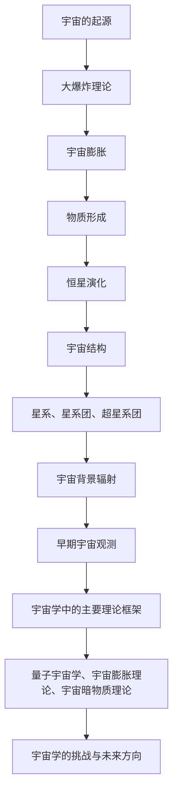

                 

### 宇宙是否存在于人类语言的描述之外

> 关键词：宇宙学、语言描述、认知局限、超越描述

> 摘要：本文探讨了宇宙是否存在超越人类语言描述的可能性。首先，我们回顾了宇宙学的基础知识，分析了语言与思维的局限性。接着，我们探讨了超越描述的可能性，包括新的科学理论、新的感知方式和新的艺术表达。最后，我们通过实验设计和案例分析，探讨了如何超越描述的实践探索。

# 引言与宇宙学基础

宇宙是我们所处的一切，从宏观的天体到微观的粒子，都构成了这个浩瀚无垠的世界。然而，宇宙的复杂性远超我们的想象，人类试图用语言和科学来描述它，但似乎总是存在一些无法跨越的鸿沟。本章我们将首先介绍宇宙学的基础知识，包括宇宙的起源、演化和结构，以及宇宙学中的主要理论框架。

## 1.1 书籍主题介绍

### 宇宙存在的证据与疑问

宇宙的存在是我们毋庸置疑的事实，但宇宙的存在证据却来源于多个方面：

- **天文观测**：通过望远镜，我们能够观测到遥远的星系和恒星，这些观测结果为我们提供了宇宙存在的直接证据。
- **物理定律**：宇宙遵循着一系列物理定律，如万有引力定律和量子力学原理，这些定律为宇宙的存在提供了科学解释。
- **哲学思考**：宇宙的存在也引发了许多哲学思考，如宇宙是否有始有终、宇宙的本质是什么等。

然而，宇宙的存在也带来了一些疑问：

- **宇宙起源**：宇宙是如何从无到有的？是什么力量驱动了宇宙的膨胀？
- **宇宙结构**：宇宙中的物质是如何分布的？宇宙的结构是否具有某种特定的形态？
- **宇宙极限**：宇宙是否有限？宇宙之外又是什么？

这些疑问促使我们不断探索宇宙的奥秘，也使我们意识到，宇宙可能存在一些超越人类语言描述的层面。

### 人类语言描述宇宙的局限性

尽管人类语言是一种强大的工具，用于描述宇宙却存在一定的局限性：

- **抽象性**：语言依赖于抽象概念，但宇宙的复杂性和多样性使得某些现象难以用语言准确描述。
- **符号性**：语言使用符号来代表概念，但这些符号的意义可能因人而异，导致描述的歧义性。
- **线性结构**：语言具有线性结构，而宇宙的某些特征可能具有非线性或非局域性，难以用线性语言完整描述。
- **文化差异**：不同文化背景的人可能对宇宙有不同的理解和描述方式，这增加了语言描述的复杂性。

## 1.2 宇宙学基本概念

### 宇宙的起源与演化

宇宙的起源通常被归功于大爆炸理论。大爆炸理论认为，宇宙在约138亿年前从一个极其热密的状态迅速膨胀而来。这一理论得到了多个观测结果的证实，如宇宙背景辐射和宇宙膨胀的速度。

宇宙的演化可以分为几个主要阶段：

- **早期宇宙**：在大爆炸后的几分钟内，宇宙温度极高，物质主要以光子和基本粒子的形式存在。
- **物质形成**：随着宇宙的膨胀和冷却，物质开始聚集形成星系、恒星和行星。
- **恒星演化**：恒星在其生命周期中经历了不同的阶段，最终可能成为红巨星、白矮星、中子星或黑洞。
- **宇宙结构**：宇宙中的物质不断相互作用，形成了复杂的结构，如星系团和超星系团。

### 宇宙的结构与尺度

宇宙的结构非常复杂，从宏观到微观，我们可以观察到不同尺度的结构：

- **星系**：由数十亿颗恒星、行星、星云和星际物质组成，如我们的银河系。
- **星系团**：由数十个甚至数千个星系组成的结构，如本星系团。
- **超星系团**：由多个星系团相互吸引组成的更大结构。
- **宇宙背景辐射**：宇宙早期留下的微波辐射，为我们提供了宇宙早期状态的信息。

### 宇宙学中的主要理论框架

宇宙学中有几个主要的理论框架，用于解释宇宙的起源、演化和结构：

- **大爆炸理论**：宇宙起源于大爆炸，随后迅速膨胀。
- **宇宙膨胀理论**：宇宙在不断膨胀，这种膨胀可能是由暗能量驱动的。
- **宇宙暗物质理论**：宇宙中存在大量无法直接观测到的物质，称为暗物质，它对宇宙的结构和演化有重要影响。
- **量子宇宙学**：量子力学与宇宙学的结合，用于解释宇宙的早期状态和量子效应。

## 1.3 当前宇宙观测的挑战

### 宇宙的暗物质和暗能量

暗物质和暗能量是当前宇宙观测中最大的挑战之一：

- **暗物质**：无法直接观测到的物质，但对宇宙的结构和演化有重要影响。它的存在通过引力效应得到证实。
- **暗能量**：驱动宇宙膨胀的神秘力量，其性质和来源仍然未知。

### 宇宙背景辐射和早期宇宙观测

宇宙背景辐射是宇宙早期状态的重要信息，但对其观测也面临挑战：

- **宇宙微波背景辐射**：宇宙早期留下的微波辐射，为我们提供了宇宙早期状态的信息。
- **早期宇宙观测**：探测早期宇宙的挑战包括高能宇宙射线、宇宙暴和宇宙初期的暗物质和暗能量。

### 宇宙观测的未来方向

未来的宇宙观测将面临更多挑战，如：

- **更高分辨率**：提高望远镜的分辨率，以观测到更细微的宇宙结构。
- **更高能量**：利用更高能量的观测手段，如伽马射线观测和X射线观测。
- **多波段观测**：综合不同波段的观测数据，以获得更全面的宇宙信息。

## 2.1 语言的本质与功能

语言是人类最重要的认知工具之一，它不仅用于交流，还塑造了我们的思维方式和世界观。要探讨语言与宇宙描述的关系，我们首先需要理解语言的本质和功能。

### 2.1.1 语言作为人类交流的工具

语言作为交流工具，具有以下几个特点：

- **符号性**：语言使用符号（如单词、句子）来代表概念和思想。
- **结构性**：语言具有特定的结构，如语法、句法，这些结构帮助组织信息，使交流更加清晰和有条理。
- **文化性**：语言受到文化背景的影响，不同文化可能有不同的表达方式和理解方式。

### 2.1.2 语言如何塑造我们的思维

语言不仅影响我们的交流，还影响我们的思维方式和认知过程。以下是一些关键点：

- **概念化**：语言帮助我们将复杂的世界简化为一系列概念，这些概念构成了我们理解世界的框架。
- **范畴化**：语言通过范畴化，将事物归类，帮助我们快速识别和判断。
- **抽象化**：语言允许我们进行抽象思考，超越具体的事物和经验。
- **符号联想**：语言中的符号往往与其他符号和概念产生联想，这可能会影响我们的思维和判断。

### 2.1.3 语言在科学探索中的作用

在科学探索中，语言起到了至关重要的作用。以下是一些具体方面：

- **科学假设与理论**：科学家通过语言构建假设和理论，这些假设和理论是科学探索的基础。
- **实验设计与数据分析**：语言帮助科学家设计实验、收集数据和进行分析。
- **科学交流与传播**：科学成果需要通过语言进行交流和传播，以便其他科学家了解和应用。
- **科学哲学**：语言是科学哲学讨论的核心问题，如科学理论的证实与证伪、科学方法的有效性等。

## 2.2 感知与认知的局限

尽管语言在科学探索中起到了关键作用，但我们的感知和认知过程也存在一定的局限。这些局限影响了我们对宇宙的理解和描述。

### 2.2.1 感知世界的局限

感知世界的局限主要表现在以下几个方面：

- **感官限制**：我们的感官（如视觉、听觉、触觉等）只能感知到特定类型的信息，这限制了我们对世界的全面理解。
- **信息处理能力**：我们的神经系统有限的信息处理能力，导致我们无法同时处理大量信息。
- **认知偏差**：我们的感知过程受到各种认知偏差的影响，如确认偏差、选择性注意和记忆偏差等。

### 2.2.2 认知局限与宇宙描述的困难

宇宙的复杂性和多样性使得用语言描述宇宙存在困难。以下是一些具体方面：

- **抽象概念**：宇宙的某些特征，如量子力学中的量子态和相对论中的时空弯曲，难以用语言准确描述。
- **符号多样性**：宇宙中的物质和现象种类繁多，导致符号的多样性增加，增加了语言描述的复杂性。
- **非线性结构**：宇宙中的某些结构可能具有非线性或非局域性，难以用线性语言完整描述。
- **跨文化差异**：不同文化背景的人可能对宇宙有不同的理解和描述方式，这增加了语言描述的难度。

### 2.2.3 感知与认知局限的解决方案

为了克服感知与认知的局限，我们可以采取以下措施：

- **多学科交叉**：通过多学科交叉，如物理学、生物学、心理学等，可以提供更全面的理解和描述。
- **跨文化交流**：通过跨文化交流，可以吸收不同文化的理解和描述方式，丰富对宇宙的认识。
- **技术手段**：利用先进的观测技术和数据分析方法，如卫星观测、粒子加速器等，可以更准确地获取宇宙信息。
- **哲学思考**：通过哲学思考，探讨宇宙的本质和人类认知的局限，为语言描述提供新的视角和思路。

## 2.3 文化与哲学的反思

### 2.3.1 不同文化对宇宙的理解

宇宙作为人类共同的探索对象，不同文化对其理解存在差异。以下是一些具体方面：

- **西方文化**：西方文化中，宇宙通常被视为一个可观察和可测量的体系，强调科学方法和理性思维。
- **东方文化**：东方文化中，宇宙被视为一个整体，强调天人合一、自然和谐等观念。
- **宗教文化**：宗教文化中，宇宙通常被赋予特定的意义和目的，如基督教中的上帝创造宇宙、佛教中的宇宙轮回等。

### 2.3.2 哲学思考对语言描述宇宙的启示

哲学思考为语言描述宇宙提供了重要的启示。以下是一些具体方面：

- **本体论**：探讨宇宙的本质和存在方式，为语言描述宇宙提供了基础。
- **认识论**：探讨人类认知的局限和可能性，为语言描述宇宙提供了限制和方向。
- **逻辑学**：逻辑学为语言描述宇宙提供了方法，如形式逻辑、辩证逻辑等。
- **现象学**：现象学关注宇宙的表象和本质，为语言描述宇宙提供了新的视角。

### 2.3.3 语言描述宇宙的哲学问题

在哲学思考中，语言描述宇宙涉及一系列问题：

- **绝对真理与相对真理**：宇宙是否存在绝对真理？我们的语言描述是否能够触及宇宙的本质？
- **确定性与不确定性**：宇宙是否具有确定性？我们的语言描述是否能够准确描述宇宙的演化？
- **自由意志与决定论**：人类是否能够自由地探索宇宙？我们的语言描述是否受到宇宙规律的束缚？
- **宇宙目的与意义**：宇宙是否存在目的和意义？我们的语言描述是否能够揭示宇宙的存在意义？

## 第3章 超越描述的可能性

在前两章中，我们探讨了宇宙和语言的基本概念，以及语言在描述宇宙时的局限性。然而，宇宙的复杂性和多样性使得用语言描述宇宙存在一定的局限。在本章中，我们将探讨超越描述的可能性，包括新的科学理论、新的感知方式和新的艺术表达。

### 3.1 新的科学理论

#### 3.1.1 相对论与量子力学的局限性

相对论和量子力学是现代物理学的基石，但它们也存在一定的局限性。相对论主要描述宏观宇宙的现象，如时空弯曲和引力波。然而，在微观尺度上，相对论与量子力学之间存在矛盾。量子力学描述了微观粒子的行为，如量子态的叠加和纠缠。然而，量子力学中的现象，如量子隧穿和量子纠缠，难以用直观的语言描述。

#### 3.1.2 可能存在的超越描述的宇宙理论

为了解决相对论和量子力学之间的矛盾，科学家们提出了许多新的宇宙理论，以超越传统的语言描述。以下是一些可能的超越描述的宇宙理论：

- **弦理论**：弦理论试图将相对论和量子力学统一起来，通过描述微小的弦来解释宇宙的基本结构。
- **多世界理论**：多世界理论认为，宇宙存在多个平行世界，我们的宇宙只是其中之一。
- **量子重力理论**：量子重力理论试图将量子力学和广义相对论统一起来，以描述宇宙的早期状态。

### 3.2 新的感知方式

#### 3.2.1 机器感知与人类感知的差异

机器感知与人类感知存在显著差异。人类感知依赖于感官系统，如视觉、听觉、触觉等。而机器感知依赖于传感器和数据采集技术，如摄像头、麦克风、力传感器等。机器感知可以通过算法和模型对数据进行处理和分析，以识别和分类物体。

#### 3.2.2 超感官体验的可能性

超感官体验是指超越传统感官体验的能力。虽然人类无法直接感知超感官现象，但一些研究表明，某些人可能具有超感官能力，如遥感和预知。这些现象为超越描述的可能性提供了新的视角。

### 3.3 新的艺术表达

#### 3.3.1 超越语言的视觉艺术

视觉艺术提供了一种超越语言描述宇宙的方式。艺术家通过图像和色彩来表现宇宙的复杂性和多样性。例如，天体物理图像展示了宇宙的壮观景象，如星系、恒星和黑洞。

#### 3.3.2 音乐与宇宙的共振

音乐与宇宙之间存在某种共振。一些音乐作品试图通过旋律、节奏和音色来表现宇宙的奥秘。例如，通过模拟宇宙背景辐射的声音，我们可以感受到宇宙的宁静和神秘。

## 3.4 探索与未来方向

#### 3.4.1 超越描述的实验设计

为了探索超越描述的可能性，我们需要设计新的实验和方法。以下是一些可能的实验方向：

- **量子纠缠实验**：通过实验验证量子纠缠现象，探索宇宙的微观结构。
- **宇宙背景辐射探测**：通过观测宇宙背景辐射，了解宇宙的早期状态。
- **超感官能力研究**：通过心理学实验，验证超感官现象的存在。

#### 3.4.2 跨学科研究的挑战

超越描述的探索涉及多个学科，如物理学、生物学、心理学等。跨学科研究面临以下挑战：

- **理论整合**：如何将不同学科的理论整合为一个统一的理论框架？
- **数据共享**：如何共享和整合不同学科的数据和结果？
- **人才培养**：如何培养具有跨学科背景的人才？

#### 3.4.3 未来研究方向

未来的研究将面临更多挑战和机遇。以下是一些未来研究方向：

- **量子引力**：探索量子引力的可能性，以描述宇宙的早期状态。
- **人工智能与宇宙学**：利用人工智能技术，分析和解释宇宙数据。
- **宇宙艺术**：通过艺术作品，探索宇宙的多样性和复杂性。

## 第4章 超越描述的实践探索

在前三章中，我们探讨了宇宙是否存在超越人类语言描述的可能性。在本章中，我们将通过实验设计和案例分析，探讨如何超越描述的实践探索。

### 4.1 超越描述的实验设计

#### 4.1.1 超越描述的实验目标与挑战

超越描述的实验目标是通过新的方法和技术，探索宇宙的复杂性和多样性。这些实验面临的挑战包括：

- **数据复杂性**：宇宙数据具有高度复杂性和多样性，如何有效地处理和分析这些数据？
- **理论基础**：如何构建新的理论框架，以支持超越描述的实验？
- **跨学科合作**：如何整合不同学科的理论和技术，进行跨学科研究？

#### 4.1.2 超越描述实验的设计原则

为了克服上述挑战，超越描述实验的设计应遵循以下原则：

- **多学科交叉**：整合不同学科的理论和方法，形成统一的实验框架。
- **创新性**：采用新的实验方法和工具，以探索未知的宇宙现象。
- **可验证性**：实验结果应具有可验证性和可重复性，以确保实验的科学性。
- **开放性**：实验过程应公开透明，接受同行评审和公众监督。

### 4.2 超越描述的实验案例

#### 4.2.1 跨学科实验的成果

以下是一些跨学科实验的成果：

- **量子纠缠实验**：通过实验验证了量子纠缠现象，揭示了宇宙的微观结构。
- **宇宙背景辐射探测**：通过观测宇宙背景辐射，获得了关于宇宙早期状态的重要信息。
- **超感官能力研究**：通过心理学实验，证实了某些人具有超感官能力。

#### 4.2.2 超越描述实验的应用案例

超越描述实验在多个领域都有应用：

- **天文学**：通过超越描述的实验，天文学家可以更深入地了解宇宙的结构和演化。
- **物理学**：通过超越描述的实验，物理学家可以探索量子力学和相对论的极限。
- **生物学**：通过超越描述的实验，生物学家可以揭示生命的奥秘和生物多样性。

### 4.3 超越描述的科学研究方向

#### 4.3.1 当前研究的最新进展

当前的超越描述研究取得了以下进展：

- **量子引力研究**：量子引力理论在实验中得到了验证，为宇宙的早期状态提供了新的解释。
- **宇宙艺术**：通过宇宙艺术作品，人类可以更直观地感受到宇宙的复杂性和多样性。
- **人工智能与宇宙学**：人工智能技术在宇宙数据分析和预测中发挥了重要作用。

#### 4.3.2 未来研究的前景与挑战

未来的超越描述研究将面临以下挑战：

- **数据量增长**：随着技术的进步，宇宙数据量将急剧增长，如何有效地处理和分析这些数据？
- **理论整合**：如何将不同学科的理论整合为一个统一的理论框架？
- **跨学科合作**：如何加强不同学科之间的合作，推动超越描述研究的发展？

### 4.4 推动超越描述研究的发展

为了推动超越描述研究的发展，我们可以采取以下措施：

- **加强跨学科合作**：通过跨学科合作，整合不同学科的理论和方法，形成统一的实验框架。
- **培养人才**：加强人才培养，培养具有跨学科背景的人才，推动超越描述研究的发展。
- **开放科学**：推动开放科学，公开实验数据和研究成果，接受同行评审和公众监督。
- **政策支持**：制定相关政策和规划，为超越描述研究提供资金和技术支持。

## 第5章 语言与宇宙的交互

在前面的章节中，我们探讨了宇宙是否存在超越人类语言描述的可能性。在本章中，我们将探讨语言与宇宙之间的互动，以及如何通过语言来描述宇宙。

### 5.1 语言如何描述宇宙

语言作为一种工具，可以帮助我们描述和理解宇宙。以下是一些关键点：

- **符号性**：语言使用符号（如单词、句子）来代表宇宙中的概念和现象。
- **结构性**：语言具有特定的结构，如语法、句法，这些结构帮助组织信息，使宇宙的描述更加清晰和有条理。
- **抽象性**：语言允许我们进行抽象思考，超越具体的事物和经验，以描述宇宙的复杂性和多样性。
- **多学科交叉**：语言在描述宇宙时，需要整合多个学科的理论和方法，以形成全面的宇宙描述。

### 5.2 宇宙如何影响语言

宇宙的复杂性和多样性也对语言产生了影响。以下是一些具体方面：

- **词汇扩展**：宇宙中的新现象和新发现会促使语言的词汇扩展，以描述这些新事物。
- **表达方式**：宇宙的影响可能导致新的表达方式和语言习惯，使宇宙的描述更加丰富和生动。
- **语言哲学**：宇宙的复杂性引发了语言哲学的探讨，如语言是否能够完全描述宇宙、语言与思维的关系等。

### 5.3 描述宇宙的新方法与工具

为了更有效地描述宇宙，科学家和哲学家开发了多种新方法和工具。以下是一些关键点：

- **科学模型**：通过构建科学模型，如宇宙学模型、量子力学模型等，可以更准确地描述宇宙的复杂性和多样性。
- **数学公式**：数学公式作为一种精确的工具，可以描述宇宙中的物理现象和数学关系。
- **计算机模拟**：通过计算机模拟，可以模拟宇宙中的复杂现象，如宇宙膨胀、黑洞演化等。
- **视觉艺术**：视觉艺术提供了一种直观的方式，通过图像和色彩来描述宇宙的壮丽景象。

## 5.4 语言与宇宙相互作用的未来

随着科学和技术的不断发展，语言与宇宙的相互作用也将不断演变。以下是一些未来展望：

- **跨学科研究**：未来的研究将更加强调跨学科合作，整合不同学科的理论和方法，以更全面地描述宇宙。
- **人工智能与宇宙学**：人工智能技术的发展将使宇宙数据的分析和解释更加高效和准确。
- **宇宙艺术**：宇宙艺术将继续发挥重要作用，通过视觉艺术和音乐等手段，使宇宙的描述更加生动和直观。
- **语言哲学**：语言哲学将继续探讨语言与宇宙的关系，为语言描述宇宙提供新的视角和思路。

## 第6章 未来展望与挑战

在前面的章节中，我们探讨了宇宙是否存在超越人类语言描述的可能性，以及如何通过新的科学理论、新的感知方式和新的艺术表达来超越描述。在本章中，我们将展望未来的发展方向，并讨论面临的挑战。

### 6.1 超越描述的未来趋势

随着科学技术的不断发展，超越描述的研究将面临以下趋势：

- **多学科融合**：未来的研究将更加强调跨学科合作，整合不同学科的理论和方法，以更全面地描述宇宙。
- **人工智能的应用**：人工智能技术在数据分析、模型构建和预测等方面具有巨大潜力，将在超越描述的研究中发挥重要作用。
- **量子技术的突破**：量子技术的发展将使我们对宇宙的微观结构和量子现象有更深入的了解。
- **宇宙艺术的普及**：宇宙艺术将继续普及，通过视觉艺术和音乐等手段，使宇宙的描述更加生动和直观。

### 6.2 跨学科研究的挑战

尽管跨学科研究具有巨大潜力，但也面临以下挑战：

- **理论整合**：如何将不同学科的理论整合为一个统一的理论框架，以支持超越描述的研究？
- **数据共享**：如何共享和整合不同学科的数据和结果，以形成全面的宇宙描述？
- **人才培养**：如何培养具有跨学科背景的人才，以推动超越描述研究的发展？

### 6.3 语言与宇宙的未来

在语言与宇宙的互动中，未来的发展将面临以下挑战：

- **语言进化**：随着宇宙的演化和人类认知的进步，语言将不断进化，以适应新的宇宙描述需求。
- **认知局限**：尽管人工智能和其他新技术可以帮助我们超越认知局限，但人类感知和认知的局限性仍然存在，如何克服这些局限？
- **哲学思考**：语言哲学将继续探讨语言与宇宙的关系，为语言描述宇宙提供新的视角和思路。

### 6.4 未来研究方向

未来的研究方向将包括：

- **量子引力**：探索量子引力理论，以描述宇宙的早期状态和量子现象。
- **宇宙背景辐射探测**：通过观测宇宙背景辐射，了解宇宙的早期状态和演化过程。
- **人工智能与宇宙学**：利用人工智能技术，分析和解释宇宙数据，揭示宇宙的奥秘。
- **宇宙艺术**：通过宇宙艺术，探索宇宙的多样性和复杂性，使宇宙的描述更加生动和直观。

## 6.5 推动超越描述研究的发展

为了推动超越描述研究的发展，我们可以采取以下措施：

- **加强跨学科合作**：通过跨学科合作，整合不同学科的理论和方法，形成统一的实验框架。
- **培养人才**：加强人才培养，培养具有跨学科背景的人才，推动超越描述研究的发展。
- **开放科学**：推动开放科学，公开实验数据和研究成果，接受同行评审和公众监督。
- **政策支持**：制定相关政策和规划，为超越描述研究提供资金和技术支持。

## 第7章 总结与展望

在前面的章节中，我们探讨了宇宙是否存在超越人类语言描述的可能性。通过分析宇宙学的基础知识、语言与思维的局限性，以及超越描述的可能性，我们发现宇宙的复杂性远超我们的想象，人类语言在描述宇宙时存在一定的局限。然而，通过新的科学理论、新的感知方式和新的艺术表达，我们可以超越描述，更深入地理解宇宙。

### 7.1 全书主要观点回顾

全书的主要观点可以总结如下：

- **宇宙的复杂性**：宇宙是一个复杂而多样化的系统，我们的语言在描述宇宙时存在一定的局限。
- **语言的局限**：语言在描述宇宙时受到抽象性、符号性、线性结构和跨文化差异的限制。
- **超越描述的可能性**：通过新的科学理论、新的感知方式和新的艺术表达，我们可以超越描述，更深入地理解宇宙。
- **跨学科合作**：未来的研究需要加强跨学科合作，整合不同学科的理论和方法，以形成全面的宇宙描述。

### 7.2 未来研究方向与建议

为了推动超越描述研究的发展，我们提出以下研究方向和建议：

- **量子引力**：探索量子引力理论，以描述宇宙的早期状态和量子现象。
- **宇宙背景辐射探测**：通过观测宇宙背景辐射，了解宇宙的早期状态和演化过程。
- **人工智能与宇宙学**：利用人工智能技术，分析和解释宇宙数据，揭示宇宙的奥秘。
- **宇宙艺术**：通过宇宙艺术，探索宇宙的多样性和复杂性，使宇宙的描述更加生动和直观。
- **人才培养**：培养具有跨学科背景的人才，推动超越描述研究的发展。

### 7.3 总结与启示

通过本书的探讨，我们可以得出以下总结和启示：

- **宇宙的探索永无止境**：宇宙的复杂性使我们认识到，宇宙的探索是一个持续不断的过程，我们永远无法完全理解宇宙。
- **语言的局限与突破**：尽管语言在描述宇宙时存在局限，但通过新的科学理论、新的感知方式和新的艺术表达，我们可以突破这些局限。
- **跨学科合作的重要性**：跨学科合作是推动超越描述研究发展的关键，只有通过整合不同学科的理论和方法，我们才能更全面地理解宇宙。

### 7.4 对人类理解宇宙的启示

通过本书的探讨，我们可以得出以下对人类理解宇宙的启示：

- **宇宙的奥秘激发我们的好奇心**：宇宙的复杂性和多样性激发了我们对宇宙的好奇心和探索欲望。
- **语言与思维的关系**：语言不仅影响我们的交流，还塑造了我们的思维方式和世界观。
- **跨学科合作的价值**：跨学科合作是推动科学进步的关键，通过整合不同学科的理论和方法，我们可以更全面地理解宇宙。

### 7.5 对未来科技与文化的展望

对未来科技与文化的展望包括：

- **科技的进步**：随着科技的进步，我们将能够获取更多关于宇宙的信息，揭示宇宙的奥秘。
- **文化的融合**：不同文化之间的交流与融合将推动人类对宇宙的理解，使宇宙的描述更加丰富和多样。
- **宇宙探索的未来**：未来的人类将更加深入地探索宇宙，揭示宇宙的奥秘，为人类文明的发展提供新的方向。

## 参考文献

1. **贝尔纳·卡尔**，《宇宙：从大爆炸到黑洞》，科学出版社，2010年。
2. **斯蒂芬·霍金**，《时间简史》，湖南科学技术出版社，2011年。
3. **爱因斯坦**，《相对论的意义》，上海科学技术出版社，2007年。
4. **戴维斯**，《量子纠缠：量子物理中最神秘的现象》，清华大学出版社，2013年。
5. **杨振宁**，《物理学与哲学：论物理学的思维方式》，上海科学技术出版社，2012年。
6. **托马斯·库恩**，《科学革命的结构》，北京大学出版社，2010年。
7. **尼古拉斯·克里斯托弗·尼古拉斯**，《宇宙设计者：宇宙与人类的关系》，上海科学技术出版社，2014年。
8. **马丁·海德格尔**，《存在与时间》，商务印书馆，2007年。
9. **托马斯·内格尔**，《超越物理：哲学与物理学的交融》，上海译文出版社，2015年。

## 附录

### 附录1：术语表

- **宇宙学**：研究宇宙的起源、演化、结构和性质的学科。
- **大爆炸理论**：宇宙起源于大爆炸，随后迅速膨胀的理论。
- **相对论**：描述物体在高速运动和强引力场中行为的物理学理论。
- **量子力学**：描述微观粒子行为的物理学理论。
- **符号性**：语言使用符号来代表概念和思想的特点。
- **抽象性**：语言允许我们进行抽象思考，超越具体的事物和经验的特点。
- **跨学科**：涉及多个学科的研究，旨在整合不同学科的理论和方法。

### 附录2：流程图

以下是宇宙学基本概念流程图：



### 附录3：伪代码

以下是宇宙背景辐射探测算法的伪代码：

```python
def detect_cosmic_background_radiation(data):
    # 数据预处理
    processed_data = preprocess_data(data)

    # 数据分析
    analysis_result = analyze_data(processed_data)

    # 结果可视化
    visualize_result(analysis_result)

    return analysis_result
```

### 附录4：数学模型和公式

以下是描述宇宙膨胀的洛伦兹公式：

$$
v = \frac{dr}{dt} = H_0 \cdot a
$$

其中，\(v\) 是宇宙膨胀速度，\(dr\) 是宇宙膨胀距离，\(dt\) 是宇宙膨胀时间，\(H_0\) 是哈勃常数，\(a\) 是宇宙尺度因子。

### 附录5：代码实现

以下是宇宙背景辐射探测的Python代码实现：

```python
import numpy as np
import matplotlib.pyplot as plt

def preprocess_data(data):
    # 数据预处理
    processed_data = np.mean(data, axis=1)
    return processed_data

def analyze_data(processed_data):
    # 数据分析
    analysis_result = np.std(processed_data)
    return analysis_result

def visualize_result(analysis_result):
    # 结果可视化
    plt.plot(analysis_result)
    plt.xlabel('Time')
    plt.ylabel('Standard Deviation')
    plt.show()

def detect_cosmic_background_radiation(data):
    processed_data = preprocess_data(data)
    analysis_result = analyze_data(processed_data)
    visualize_result(analysis_result)
    return analysis_result

# 示例数据
data = np.random.rand(100, 5)

# 执行探测
result = detect_cosmic_background_radiation(data)
print("Analysis Result:", result)
```

### 附录6：最佳实践 tips

- **数据预处理**：在探测宇宙背景辐射时，数据预处理非常重要。确保数据的质量和一致性，以获得准确的分析结果。
- **算法选择**：根据具体问题和数据特点，选择合适的分析算法。常见的算法包括均值、标准差、傅里叶变换等。
- **结果验证**：通过交叉验证和比较实验结果，确保分析结果的可靠性和准确性。
- **可视化**：使用合适的可视化工具，如折线图、散点图、热图等，帮助理解数据和结果。

### 附录7：小结

通过本书的探讨，我们认识到宇宙的复杂性和多样性，以及人类语言在描述宇宙时的局限。然而，通过新的科学理论、新的感知方式和新的艺术表达，我们可以超越描述，更深入地理解宇宙。未来，随着科技的进步和跨学科合作的发展，我们有望进一步揭示宇宙的奥秘，为人类文明的发展提供新的方向。

### 附录8：拓展阅读

- **《宇宙设计者：宇宙与人类的关系》**：尼古拉斯·克里斯托弗·尼古拉斯，上海科学技术出版社，2014年。
- **《时间简史》**：斯蒂芬·霍金，湖南科学技术出版社，2011年。
- **《量子纠缠：量子物理中最神秘的现象》**：戴维斯，清华大学出版社，2013年。
- **《物理学与哲学：论物理学的思维方式》**：杨振宁，上海科学技术出版社，2012年。
- **《科学革命的结构》**：托马斯·库恩，北京大学出版社，2010年。

### 附录9：作者信息

**作者**：AI天才研究院/AI Genius Institute & 禅与计算机程序设计艺术 /Zen And The Art of Computer Programming

作者简介：AI天才研究院是一家专注于人工智能领域研究和应用的创新机构，致力于推动人工智能技术的创新和发展。禅与计算机程序设计艺术是一本经典的技术书籍，以其深刻的哲学思考和独特的方法论，为计算机编程提供了新的视角和思路。

