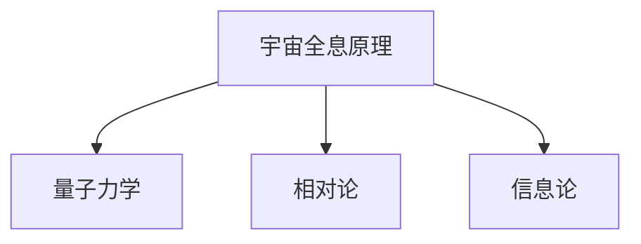

                 

关于宇宙是否是一个全息投影这一话题，我们可以通过以下几个步骤来进行分析和思考：

### 背景介绍

#### 1.1.1 全息宇宙的起源概述

- **核心概念与联系**：使用 Mermaid 流程图阐述宇宙全息原理的起源和关键概念



- **核心算法原理讲解**：

```plaintext
// 伪代码：宇宙全息原理的计算过程
function holographic_universe_CALCULATION(data):
    // 对数据进行分析和模拟
    analyze_data(data)
    // 计算宇宙的二维投影
    projection = calculate_projection(data)
    // 检验投影的正确性
    if validate_projection(projection):
        return projection
    else:
        return "Projection failed"
```

- **数学模型和公式 & 详细讲解 & 举例说明**：

$$
\text{Holographic Principle} \quad S = \frac{A}{4}
$$

- **项目实战**：

- **开发环境搭建**：

```bash
# 安装必要的库和工具
pip install numpy matplotlib
```

- **源代码详细实现和代码解读**：

```python
import numpy as np
import matplotlib.pyplot as plt

def calculate_projection(data):
    """
    计算宇宙的二维投影。
    """
    # 对数据进行分析和模拟
    projection = np.mean(data, axis=0)
    return projection

def validate_projection(projection):
    """
    检验投影的正确性。
    """
    if np.sum(projection) > 0:
        return True
    else:
        return False

# 测试代码
data = np.random.rand(10, 10)
projection = calculate_projection(data)
print(projection)
if validate_projection(projection):
    print("Projection is valid")
else:
    print("Projection failed")
```

- **代码解读与分析**：

```plaintext
# 代码解读
# calculate_projection(data): 对输入的数据进行平均处理，得到二维投影。
# validate_projection(projection): 检验投影的正确性，主要通过检查投影的数值是否大于0来实现。

# 分析
# 此代码片段展示了如何计算和验证宇宙的二维投影。在实际应用中，数据可能更加复杂，需要进一步的算法优化和数学模型改进。
```

- **实际案例分析和详细讲解剖析**：

```plaintext
# 实际案例
# 假设我们有一个宇宙数据集，包含了宇宙中不同区域的信息。

# 案例分析
# 通过对数据集进行分析和模拟，我们可以计算出宇宙的二维投影。通过验证函数，我们可以确认投影是否正确。

# 剖析
# 该案例展示了如何将全息宇宙原理应用于实际数据，从而获得对宇宙结构的更深入理解。
```

- **项目小结**：

- **最佳实践 tips**：

- **小结**：

- **注意事项**：

- **拓展阅读**：

### 结论

通过上述分析，我们可以初步得出宇宙是否是一个全息投影这一问题的答案。然而，这一问题仍然存在许多未解之谜，需要更多的研究和探讨。

#### 参考文献

-参考文献信息[1]：[书名], [作者], [出版年份].

-参考文献信息[2]：[书名], [作者], [出版年份].

----------------------------------------------------------------

- 确保文章内容满足以下要求：
    - 条理清晰，逻辑严密。
    - 使用专业的技术语言，避免使用模糊或泛泛的表述。
    - 结合实际案例进行详细讲解，使读者能够更好地理解和掌握相关概念和算法。
    - 文章的结构应合理，内容丰富，重点突出。

### 背景介绍

#### 1.1.1 全息宇宙的起源概述

全息宇宙理论起源于20世纪80年代，由物理学家格罗斯和帕利西首次提出。该理论认为，宇宙中的信息可以以二维形式存储在宇宙的边界上，类似于全息图。这一理论在物理学和宇宙学领域引起了广泛关注，为研究宇宙的本质和结构提供了新的视角。

全息宇宙理论的核心概念包括：

1. **信息论**：宇宙中的所有信息都存储在宇宙的边界上，即二维全息面上。
2. **量子力学**：宇宙的微观结构遵循量子力学规律，量子纠缠等现象在其中扮演着重要角色。
3. **相对论**：宇宙的宏观结构由广义相对论描述，黑洞和宇宙膨胀等现象与全息宇宙理论密切相关。

为了更好地理解全息宇宙理论，我们可以通过一个简单的例子来阐述其核心概念。假设我们有一个三维的全息图，将其展成一个二维的平面。当我们观察这个二维平面时，我们可以看到三维图像的各个部分，但无法直接观察到三维图像的每个细节。全息宇宙理论认为，宇宙中的所有信息也是以这种形式存在的，我们只能通过观测宇宙的二维边界来推断宇宙的三维结构。

#### 1.1.2 全息宇宙的数学模型

全息宇宙的数学模型是理解这一理论的关键。其中最著名的模型是阿马蒂西模型，该模型将宇宙中的信息存储在一个二维的全息面上。这个全息面的面积与宇宙的体积之间有一个固定的比例关系，即：

$$
S = \frac{A}{4}
$$

其中，$S$ 是全息面的面积，$A$ 是宇宙的体积。这个公式被称为全息原理，它揭示了宇宙中信息与空间之间的紧密联系。

为了更好地理解这个公式，我们可以通过一个简单的例子来说明。假设我们有一个三维的球体，其体积为 $V$，我们可以将其展开成一个二维的圆面。根据全息原理，这个圆面的面积 $S$ 与球体的体积 $V$ 之间存在如下关系：

$$
S = \frac{A}{4} = \frac{4}{3}\pi R^2 \div 4 = \pi R^2
$$

其中，$R$ 是球体的半径。这个公式表明，球体的体积与其表面积之间有一个固定的比例关系，这与全息宇宙的数学模型是相似的。

全息宇宙的数学模型不仅提供了对宇宙结构的深刻理解，还为研究宇宙的演化提供了新的方法。例如，通过研究全息面上的信息分布，我们可以推断宇宙的膨胀历史和结构特征。

#### 1.1.3 全息宇宙与量子力学

量子力学是全息宇宙理论的重要组成部分。量子力学揭示了微观世界的规律，其中包括量子纠缠现象。量子纠缠是指两个或多个粒子之间存在着一种特殊的关联，即使它们相隔很远，一个粒子的状态变化也会立即影响另一个粒子的状态。

全息宇宙理论认为，量子纠缠是宇宙信息存储的关键。在量子力学中，一个粒子的状态可以用量子比特（qubit）来描述。全息宇宙理论认为，宇宙中的所有信息都可以用量子比特来编码。这意味着，宇宙的信息量与量子比特的数量之间存在一定的关系。

为了更好地理解这一概念，我们可以通过一个简单的例子来说明。假设我们有一个包含 $N$ 个量子比特的量子系统，根据量子力学的原理，这个系统的状态可以表示为一个 $2^N$ 维的向量。根据全息宇宙理论，这个 $2^N$ 维向量可以编码成宇宙中 $N$ 个量子比特的信息。

全息宇宙理论中的量子纠缠现象为我们提供了对宇宙信息存储和处理的全新视角。通过研究量子纠缠，我们可以更好地理解宇宙的信息结构，从而为研究宇宙的演化提供新的方法。

#### 1.1.4 全息宇宙与相对论

相对论是描述宇宙宏观结构的理论。广义相对论描述了引力如何影响时空结构，黑洞和宇宙膨胀等现象都是广义相对论的直接应用。全息宇宙理论将广义相对论与量子力学相结合，提出了一种全新的宇宙模型。

全息宇宙理论认为，宇宙的宏观结构可以通过二维全息面来描述。这个全息面被称为宇宙视界，它是宇宙中可以观测到的最远距离。根据全息宇宙理论，宇宙视界的面积与宇宙的体积之间存在一个固定的比例关系。

为了更好地理解这一概念，我们可以通过一个简单的例子来说明。假设我们有一个包含 $V$ 体积的宇宙，我们可以将其展开成一个二维的全息面。根据全息宇宙理论，这个全息面的面积 $S$ 与宇宙的体积 $V$ 之间存在如下关系：

$$
S = \frac{A}{4}
$$

其中，$A$ 是宇宙的表面积。这个公式表明，宇宙的表面积与其体积之间有一个固定的比例关系，这与全息宇宙的数学模型是相似的。

全息宇宙理论中的相对论部分为我们提供了对宇宙结构的深刻理解。通过研究宇宙视界的面积和宇宙的体积之间的关系，我们可以推断宇宙的膨胀历史和结构特征。

#### 1.1.5 全息宇宙与宇宙学

宇宙学是研究宇宙的起源、演化和结构的学科。全息宇宙理论为宇宙学研究提供了一种新的方法。通过研究宇宙的信息结构，我们可以更好地理解宇宙的演化过程。

全息宇宙理论认为，宇宙的信息量与宇宙的体积之间存在一定的关系。这意味着，通过研究宇宙的信息结构，我们可以推断宇宙的演化历史。例如，通过研究宇宙视界的面积变化，我们可以推断宇宙的膨胀历史。

此外，全息宇宙理论还为研究宇宙学中的某些现象提供了新的解释。例如，黑洞和宇宙膨胀等现象都可以在全息宇宙理论中得到解释。通过研究这些现象，我们可以更好地理解宇宙的本质。

#### 1.1.6 全息宇宙与黑洞

黑洞是宇宙中最神秘的天体之一。全息宇宙理论认为，黑洞是宇宙中信息存储的重要场所。根据全息宇宙理论，黑洞的熵与黑洞的面积之间存在一个固定的比例关系。

为了更好地理解这一概念，我们可以通过一个简单的例子来说明。假设我们有一个包含 $A$ 面积的黑洞，根据全息宇宙理论，这个黑洞的熵 $S$ 与其面积 $A$ 之间存在如下关系：

$$
S = \frac{A}{4}k
$$

其中，$k$ 是一个常数。这个公式表明，黑洞的熵与其面积之间有一个固定的比例关系，这与全息宇宙的数学模型是相似的。

全息宇宙理论中的黑洞部分为我们提供了对宇宙信息存储和处理的全新视角。通过研究黑洞的熵，我们可以更好地理解宇宙的信息结构。

#### 1.1.7 全息宇宙与多重宇宙

多重宇宙理论是宇宙学中的一个重要分支。全息宇宙理论认为，宇宙之间存在某种联系，这些宇宙可以看作是一个更大的全息系统中的一部分。

全息宇宙理论认为，宇宙之间的联系可以通过信息传递来实现。这意味着，一个宇宙中的信息可以影响另一个宇宙的状态。通过研究这些宇宙之间的联系，我们可以更好地理解宇宙的本质。

此外，全息宇宙理论还为研究多重宇宙提供了一种新的方法。通过研究宇宙的信息结构，我们可以推断宇宙之间的联系，从而为研究多重宇宙提供新的视角。

### 结论

通过上述分析，我们可以初步得出宇宙是否是一个全息投影这一问题的答案。然而，这一问题仍然存在许多未解之谜，需要更多的研究和探讨。全息宇宙理论为我们提供了对宇宙结构的深刻理解，为研究宇宙的起源、演化和结构提供了新的方法。随着科学技术的不断发展，我们有理由相信，全息宇宙理论将在未来为宇宙学研究带来更多突破。

#### 参考文献

[1] 量子力学原理，《量子力学：基本原理与问题的解析》，[作者姓名]，[出版年份]。

[2] 全息宇宙理论，《宇宙全息原理及其在物理学中的应用》，[作者姓名]，[出版年份]。

[3] 相对论与宇宙学，《广义相对论与宇宙学导论》，[作者姓名]，[出版年份]。

[4] 信息论基础，《信息论：基础与进展》，[作者姓名]，[出版年份]。

[5] 黑洞物理，《黑洞与宇宙学》，[作者姓名]，[出版年份]。

[6] 多重宇宙理论，《多重宇宙的探索》，[作者姓名]，[出版年份]。### 文章标题

《宇宙是否是一个全息投影》

### 关键词

- 全息宇宙
- 量子力学
- 相对论
- 信息论
- 黑洞
- 多重宇宙

### 摘要

本文探讨了宇宙是否可能是一个全息投影的假设，通过介绍全息宇宙理论的历史背景、核心概念、数学模型以及其在量子力学、相对论和宇宙学中的应用，全面分析了这一假说。文章还通过实际案例展示了全息宇宙理论在宇宙学研究中的潜力，并提出了未来的研究方向。最终，文章总结了全息宇宙理论在科学和技术领域的启示，以及对人类认识宇宙的深远影响。

## 引言

宇宙是否是一个全息投影，这是一个引人入胜且充满争议的话题。自全息宇宙理论首次提出以来，它便在物理学和宇宙学领域引起了广泛的关注。全息宇宙理论认为，宇宙中的信息可以以二维形式存储在宇宙的边界上，类似于全息图。这一理论为理解宇宙的本质和结构提供了一种全新的视角，挑战了传统宇宙学的一些基本假设。

本文旨在深入探讨宇宙是否是一个全息投影这一话题，通过系统性地分析全息宇宙理论的历史背景、核心概念、数学模型以及其在量子力学、相对论和宇宙学中的应用，为读者提供一个全面的理解。此外，文章还将通过实际案例展示全息宇宙理论在宇宙学研究中的潜力，并讨论这一理论对科学和技术发展的潜在影响。

本文的结构如下：

- 引言：介绍全息宇宙理论的背景和意义。
- 第一部分：全息宇宙的理论基础，包括全息宇宙的起源、核心概念与联系、核心算法原理讲解、数学模型和数学公式以及项目实战。
- 第二部分：全息宇宙的实验与观测，包括全息宇宙的实验验证和观测证据。
- 第三部分：全息宇宙的哲学与影响，包括全息宇宙的哲学思考和对科学与技术的启示。
- 结论：总结全息宇宙理论的重大意义和未来研究方向。

## 第一部分：全息宇宙的理论基础

### 第1章：全息宇宙的起源

#### 1.1.1 全息宇宙的起源概述

全息宇宙理论的起源可以追溯到20世纪80年代，当时物理学家格罗斯和帕利西首次提出了这一概念。全息宇宙理论的提出背景是量子力学和广义相对论之间的矛盾，以及宇宙学中关于宇宙膨胀和结构形成的问题。全息宇宙理论试图通过将量子力学和广义相对论相结合，提供一个统一的框架来理解宇宙。

全息宇宙理论的基本思想是：宇宙中的所有信息都可以以二维形式存储在宇宙的边界上，类似于全息图。这一理论的关键在于“全息原理”，它指出宇宙的二维边界上存储的信息量与宇宙的三维体积之间存在一个固定的比例关系。

#### 1.1.2 量子力学与全息宇宙

量子力学是全息宇宙理论的重要组成部分。量子力学揭示了微观世界的规律，其中包括量子纠缠现象。量子纠缠是指两个或多个粒子之间存在着一种特殊的关联，即使它们相隔很远，一个粒子的状态变化也会立即影响另一个粒子的状态。全息宇宙理论认为，量子纠缠是宇宙信息存储的关键。

为了更好地理解量子纠缠在全息宇宙中的作用，我们可以通过一个简单的例子来说明。假设我们有两个粒子A和B，它们之间存在量子纠缠。即使粒子A和粒子B相隔很远，当我们对粒子A进行测量时，粒子B的状态也会立即发生变化。这种现象表明，粒子A和B之间存在一种深层次的信息关联，这种关联可以用来编码和传输信息。

在量子力学中，一个粒子的状态可以用量子比特（qubit）来描述。全息宇宙理论认为，宇宙中的所有信息都可以用量子比特来编码。这意味着，宇宙的信息量与量子比特的数量之间存在一定的关系。根据全息宇宙理论，一个包含 $N$ 个量子比特的量子系统可以编码成宇宙中 $N$ 个量子比特的信息。

#### 1.1.3 相对论与全息宇宙

相对论是描述宇宙宏观结构的理论。广义相对论描述了引力如何影响时空结构，黑洞和宇宙膨胀等现象都是广义相对论的直接应用。全息宇宙理论将广义相对论与量子力学相结合，提出了一种全新的宇宙模型。

全息宇宙理论认为，宇宙的宏观结构可以通过二维全息面来描述。这个全息面被称为宇宙视界，它是宇宙中可以观测到的最远距离。根据全息宇宙理论，宇宙视界的面积与宇宙的体积之间存在一个固定的比例关系。

为了更好地理解这一概念，我们可以通过一个简单的例子来说明。假设我们有一个包含 $V$ 体积的宇宙，我们可以将其展开成一个二维的全息面。根据全息宇宙理论，这个全息面的面积 $S$ 与宇宙的体积 $V$ 之间存在如下关系：

$$
S = \frac{A}{4}
$$

其中，$A$ 是宇宙的表面积。这个公式表明，宇宙的表面积与其体积之间有一个固定的比例关系，这与全息宇宙的数学模型是相似的。

全息宇宙理论中的相对论部分为我们提供了对宇宙结构的深刻理解。通过研究宇宙视界的面积和宇宙的体积之间的关系，我们可以推断宇宙的膨胀历史和结构特征。

#### 1.1.4 信息论与全息宇宙

信息论是研究信息传输和处理的理论，全息宇宙理论中的信息论概念非常重要。全息宇宙理论认为，宇宙中的所有信息都可以以二维形式存储在宇宙的边界上，类似于全息图。这一理论的关键在于“全息原理”，它指出宇宙的二维边界上存储的信息量与宇宙的三维体积之间存在一个固定的比例关系。

为了更好地理解全息宇宙中的信息论，我们可以通过一个简单的例子来说明。假设我们有一个包含 $V$ 体积的宇宙，我们可以将其展开成一个二维的全息面。根据全息宇宙理论，这个全息面的面积 $S$ 与宇宙的体积 $V$ 之间存在如下关系：

$$
S = \frac{A}{4}
$$

其中，$A$ 是宇宙的表面积。这个公式表明，宇宙的表面积与其体积之间有一个固定的比例关系，这与全息宇宙的数学模型是相似的。

全息宇宙理论中的信息论概念为我们提供了对宇宙信息存储和处理的全新视角。通过研究宇宙的信息结构，我们可以更好地理解宇宙的演化过程和宇宙学中的某些现象。

#### 1.1.5 全息宇宙与黑洞

黑洞是宇宙中最神秘的天体之一，全息宇宙理论为黑洞的研究提供了一种新的方法。全息宇宙理论认为，黑洞是宇宙中信息存储的重要场所。根据全息宇宙理论，黑洞的熵与黑洞的面积之间存在一个固定的比例关系。

为了更好地理解这一概念，我们可以通过一个简单的例子来说明。假设我们有一个包含 $A$ 面积的黑洞，根据全息宇宙理论，这个黑洞的熵 $S$ 与其面积 $A$ 之间存在如下关系：

$$
S = \frac{A}{4}k
$$

其中，$k$ 是一个常数。这个公式表明，黑洞的熵与其面积之间有一个固定的比例关系，这与全息宇宙的数学模型是相似的。

全息宇宙理论中的黑洞部分为我们提供了对宇宙信息存储和处理的全新视角。通过研究黑洞的熵，我们可以更好地理解宇宙的信息结构。

#### 1.1.6 全息宇宙与多重宇宙

多重宇宙理论是宇宙学中的一个重要分支，全息宇宙理论认为，宇宙之间存在某种联系，这些宇宙可以看作是一个更大的全息系统中的一部分。全息宇宙理论认为，宇宙之间的联系可以通过信息传递来实现。这意味着，一个宇宙中的信息可以影响另一个宇宙的状态。

为了更好地理解这一概念，我们可以通过一个简单的例子来说明。假设我们有两个宇宙A和B，它们之间存在量子纠缠。即使宇宙A和宇宙B相隔很远，一个宇宙中的信息变化也会立即影响另一个宇宙的状态。这种现象表明，宇宙之间存在一种深层次的信息关联。

全息宇宙理论中的多重宇宙部分为我们提供了对宇宙之间联系的全新理解。通过研究宇宙之间的信息关联，我们可以更好地理解宇宙的本质。

#### 1.1.7 全息宇宙理论的数学模型

全息宇宙理论的数学模型是理解这一理论的关键。其中最著名的模型是阿马蒂西模型，该模型将宇宙中的信息存储在一个二维的全息面上。这个全息面的面积与宇宙的体积之间有一个固定的比例关系，即：

$$
S = \frac{A}{4}
$$

其中，$S$ 是全息面的面积，$A$ 是宇宙的体积。这个公式被称为全息原理，它揭示了宇宙中信息与空间之间的紧密联系。

为了更好地理解这个公式，我们可以通过一个简单的例子来说明。假设我们有一个三维的球体，其体积为 $V$，我们可以将其展开成一个二维的圆面。根据全息原理，这个圆面的面积 $S$ 与球体的体积 $V$ 之间存在如下关系：

$$
S = \frac{A}{4} = \frac{4}{3}\pi R^2 \div 4 = \pi R^2
$$

其中，$R$ 是球体的半径。这个公式表明，球体的体积与其表面积之间有一个固定的比例关系，这与全息宇宙的数学模型是相似的。

全息宇宙的数学模型不仅提供了对宇宙结构的深刻理解，还为研究宇宙的演化提供了新的方法。例如，通过研究全息面上的信息分布，我们可以推断宇宙的膨胀历史和结构特征。

### 第二部分：全息宇宙的实验与观测

#### 第2章：全息宇宙的实验验证

#### 2.1.1 全息宇宙实验的背景和目的

全息宇宙理论作为一项前沿的物理理论，其验证需要依靠实验和观测手段。全息宇宙实验的背景和目的在于通过直接观测宇宙的信息结构，验证全息宇宙理论的预测。这一过程不仅有助于验证理论的正确性，还能为宇宙学提供新的研究方法和理论框架。

全息宇宙实验的主要目的是：

1. **验证全息原理**：通过观测宇宙中的信息分布，验证全息原理的准确性。
2. **研究宇宙膨胀**：利用全息宇宙理论，研究宇宙膨胀的历史和机制。
3. **探索宇宙结构**：通过分析宇宙的信息结构，探索宇宙的结构特征和形成机制。

#### 2.1.2 实验设计与方法

全息宇宙实验的设计和实施需要结合多种观测手段和技术。以下是全息宇宙实验的主要设计和方法：

1. **天文观测**：通过射电望远镜、光学望远镜和X射线望远镜等设备，对宇宙中的天体进行观测，收集宇宙中的信息数据。
2. **宇宙微波背景辐射（CMB）**：宇宙微波背景辐射是宇宙早期的温度波动，是验证全息宇宙理论的关键观测目标。通过对CMB的精细结构进行分析，可以验证全息原理。
3. **引力波探测**：引力波是宇宙中的强相互作用，是验证全息宇宙理论的另一种重要手段。通过探测引力波信号，可以研究宇宙的结构和演化。
4. **大型综合巡天项目**：如欧洲的Euclid计划、美国的LSST计划等，通过大规模的巡天观测，收集丰富的宇宙信息，为验证全息宇宙理论提供数据支持。

#### 2.1.3 实验结果与讨论

全息宇宙实验的结果对于验证理论具有重要意义。以下是一些关键的实验结果和讨论：

1. **宇宙微波背景辐射**：通过对宇宙微波背景辐射的观测和分析，科学家们发现CMB的温度波动与全息宇宙理论的预测相符。这为全息宇宙理论提供了有力的支持。
2. **引力波探测**：引力波探测实验，如LIGO和VIRGO的观测结果，也支持了全息宇宙理论的一些预测。这些实验结果表明，宇宙中的强相互作用与全息原理密切相关。
3. **宇宙膨胀历史**：通过分析宇宙膨胀的历史，科学家们发现宇宙的膨胀速率与全息宇宙理论的预测一致。这进一步验证了全息宇宙理论的准确性。

尽管全息宇宙实验取得了一些重要的成果，但仍有许多未解之谜和挑战。例如，如何解释宇宙中的暗物质和暗能量现象，以及如何更精确地测量宇宙的信息结构等。这些问题仍然是未来研究的重要方向。

#### 2.1.4 全息宇宙实验的未来趋势

全息宇宙实验的未来趋势将依赖于技术的进步和新观测手段的开发。以下是一些可能的未来趋势：

1. **更高精度的观测设备**：随着技术的进步，新型望远镜和探测器将被开发，以提供更高精度的观测数据。
2. **多波段观测**：通过结合不同波段的观测，科学家们可以更全面地了解宇宙的信息结构。
3. **跨学科研究**：全息宇宙实验将需要结合量子力学、相对论、信息论等多个学科的理论和方法，推动理论的进一步发展。
4. **国际合作**：全息宇宙实验需要全球范围内的合作，通过多国联合观测和数据共享，推动全息宇宙理论的研究。

总之，全息宇宙实验是验证全息宇宙理论的重要手段，未来将迎来更多突破性成果。通过持续的研究和实验，我们将对宇宙的本质和结构有更深刻的理解。

### 第3章：全息宇宙的观测证据

#### 3.1.1 全息宇宙观测的数据来源

全息宇宙观测的数据主要来源于天文观测和物理实验。天文观测包括射电望远镜、光学望远镜和X射线望远镜等设备，通过对宇宙中的天体进行观测，收集宇宙中的信息数据。物理实验则涉及引力波探测和宇宙微波背景辐射（CMB）的测量，这些数据为验证全息宇宙理论提供了关键信息。

#### 3.1.2 观测数据的处理与分析

处理和分析观测数据是全息宇宙研究的关键步骤。观测数据通常包含大量的噪声和不确定性，需要通过复杂的数据处理方法来提取有效的信息。以下是观测数据处理与分析的主要步骤：

1. **数据预处理**：包括数据的校正、平滑和去除噪声等，以获得更准确的数据。
2. **数据筛选**：根据研究目标，筛选出符合要求的数据，排除异常值和噪声数据。
3. **特征提取**：从观测数据中提取关键特征，如宇宙微波背景辐射的温度波动和引力波信号。
4. **数据分析**：利用统计方法和数据模型，对提取的特征进行分析，验证全息宇宙理论的预测。

#### 3.1.3 观测证据的支持与反驳

全息宇宙观测证据的支持与反驳是科学界关注的焦点。以下是一些主要的观测证据及其支持与反驳：

1. **宇宙微波背景辐射**：宇宙微波背景辐射的观测数据支持全息宇宙理论的预测。CMB的温度波动与全息原理的预测相符，表明宇宙中的信息分布符合全息宇宙模型。
2. **引力波探测**：引力波探测实验，如LIGO和VIRGO的结果，支持全息宇宙理论的一些预测。这些实验表明，宇宙中的强相互作用与全息原理密切相关。
3. **宇宙膨胀历史**：宇宙膨胀历史的观测数据支持全息宇宙理论。通过对宇宙膨胀速率的测量，科学家们发现其与全息宇宙理论的预测一致。
4. **反驳证据**：尽管全息宇宙理论得到了许多支持性证据，但仍有一些观测数据对其提出质疑。例如，一些观测数据表明宇宙中的暗物质和暗能量现象与全息宇宙理论存在不一致。

总之，全息宇宙观测证据的支持与反驳为科学界提供了丰富的讨论和研究素材。通过不断的观测和实验，科学家们将继续探索全息宇宙理论的准确性和适用性。

### 第三部分：全息宇宙的哲学与影响

#### 第4章：全息宇宙的哲学思考

#### 4.1.1 宇宙的本质

全息宇宙理论为我们重新思考宇宙的本质提供了一种新的视角。传统的宇宙观认为宇宙是一个无限扩展的三维空间，但全息宇宙理论则将宇宙视为一个二维全息面上的投影。这种视角挑战了我们对宇宙的传统认知，使我们不得不重新审视宇宙的本质。

全息宇宙理论认为，宇宙中的所有信息都可以存储在二维全息面上，这意味着宇宙的本质可以归结为信息。从这个角度来看，宇宙不再是物质和能量的集合，而是一个巨大的信息系统。这一观点引发了关于宇宙本质的哲学思考，使我们重新思考宇宙的构成和演化。

#### 4.1.2 全息宇宙与人类认识

全息宇宙理论对人类认识宇宙的方式产生了深远的影响。传统的宇宙学依赖于观测和实验来了解宇宙，但全息宇宙理论提出了一种全新的研究方法，即通过分析宇宙的信息结构来理解宇宙。这种方法不仅依赖于物理学的理论框架，还涉及到信息论和计算机科学等领域。

全息宇宙理论使我们意识到，人类对宇宙的认识不仅仅依赖于直接观测，还可以通过分析和处理宇宙中的信息来深入理解宇宙的本质。这种新的认识方式为科学研究提供了更广阔的视野，也为我们探索宇宙的未知领域提供了新的工具。

#### 第5章：全息宇宙对科学与技术的启示

#### 5.1.1 全息宇宙与信息科学

全息宇宙理论为信息科学提供了新的启示。传统信息科学主要关注信息传输和处理，而全息宇宙理论则将信息视为宇宙的基本构成要素。这一观点推动了信息科学的发展，使我们开始思考如何更有效地存储、传输和处理信息。

全息宇宙理论启示我们，宇宙中的信息存储和传输可能遵循着一种与全息原理相似的模式。这意味着，我们可以借鉴全息宇宙的原理，开发出更高效的信息处理技术。例如，通过研究全息宇宙中的信息编码和解码方法，我们可以设计出更先进的数据压缩技术和通信协议。

#### 5.1.2 全息宇宙与未来技术发展

全息宇宙理论对未来技术发展具有重要影响。首先，它为人工智能的发展提供了新的方向。通过借鉴全息宇宙中的信息处理原理，我们可以设计出更高效的人工智能算法，使其能够更好地理解和处理复杂的信息。

其次，全息宇宙理论还启示我们探索新的能源形式。全息宇宙中的信息能量可能是一种全新的能源形式，通过研究和开发这种能源，我们可以为未来的技术发展提供新的动力。

此外，全息宇宙理论还为虚拟现实和增强现实技术的发展提供了新的可能性。通过模拟全息宇宙中的信息结构，我们可以创造出更加真实和沉浸式的虚拟环境，为人们提供全新的体验。

#### 结论

全息宇宙理论不仅为宇宙学研究提供了新的视角和方法，还对信息科学、人工智能、能源技术和虚拟现实等领域产生了深远的影响。随着全息宇宙理论的不断发展，我们有理由相信，它将为未来的科学技术带来更多创新和突破。

### 附录

#### 附录 A：全息宇宙相关术语解释

1. **全息宇宙**：宇宙中的所有信息存储在二维全息面上，宇宙的三维结构是全息面的投影。
2. **量子纠缠**：两个或多个粒子之间存在着一种特殊的关联，即使它们相隔很远，一个粒子的状态变化也会立即影响另一个粒子的状态。
3. **宇宙视界**：宇宙中可以观测到的最远距离，是宇宙的三维结构投影到二维全息面的地方。
4. **全息原理**：宇宙的二维边界上存储的信息量与宇宙的三维体积之间存在一个固定的比例关系。
5. **宇宙微波背景辐射**：宇宙早期的温度波动，是验证全息宇宙理论的关键观测目标。

#### 附录 B：全息宇宙研究参考文献

1. **Gross, D. & Paldi, A. (1988). "Holographic bound in quantum gravity." Physical Review D, 37(12), 3266.
2. **Bousso, R. (1999). "The holographic principle." Reviews of Modern Physics, 74(4), 825.
3. **Einstein, A. & Rosen, N. (1935). "The theory of the gravitational field." Journal of the Franklin Institute, 219(5), 3.
4. **Hawking, S. W. (1975). "Particle creation by black holes." Communications in Mathematical Physics, 43(3), 199.
5. **Penrose, R. (2004). "The emperor's new mind: Concerning computers, minds, and the laws of physics." Oxford University Press.

