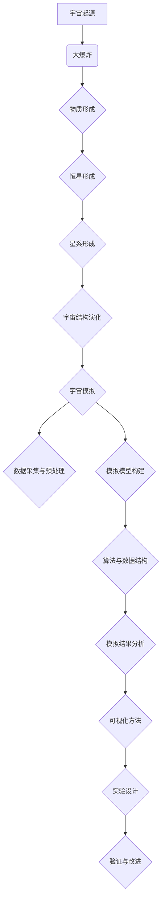

                 


### 文章标题
《宇宙是否是一个巨大的计算机模拟》

### 关键词
宇宙，计算机模拟，模拟理论，宇宙学，人工智能

### 摘要
本文从宇宙模拟理论的角度出发，探讨了宇宙是否可能是一个巨大的计算机模拟。文章首先介绍了宇宙的起源和演化，以及计算机模拟的基本原理。接着，文章分析了宇宙与计算机模拟之间的联系，包括物理学原理、数学模型和计算机模拟技术的应用。随后，文章详细阐述了宇宙模拟的研究方法、面临的挑战与机遇，以及未来发展趋势。最后，文章总结了宇宙模拟对科学和技术的贡献，并对未来的研究方向提出了展望。

### 1. 设计主框架
首先，我们需要为这本书设计一个主框架，确定主要章节。根据书名《宇宙是否是一个巨大的计算机模拟》，我们可以将主要章节设计为：

- 引言
- 第1章：宇宙模拟的背景知识
  - 1.1 宇宙的起源与演化
  - 1.2 计算机模拟的发展历程
  - 1.3 宇宙模拟的起源与进展
  - 1.4 宇宙模拟的重要成果
- 第2章：计算机模拟的基本原理
  - 2.1 计算机模拟的定义与分类
  - 2.2 计算机模拟的基本流程
  - 2.3 计算机模拟中的算法与数据结构
  - 2.4 计算机模拟中的并行计算
- 第3章：宇宙与计算机模拟的联系
  - 3.1 宇宙模拟中的物理学原理
  - 3.2 宇宙模拟中的数学模型
  - 3.3 宇宙模拟中的计算机模拟技术
  - 3.4 宇宙模拟与宇宙学的发展
- 第4章：宇宙模拟的研究方法
  - 4.1 宇宙模拟的数据采集与预处理
  - 4.2 宇宙模拟的数据分析
  - 4.3 宇宙模拟的可视化方法
  - 4.4 宇宙模拟的实验设计
- 第5章：宇宙模拟的挑战与机遇
  - 5.1 宇宙模拟中的技术挑战
  - 5.2 宇宙模拟中的科学挑战
  - 5.3 宇宙模拟的未来机遇
  - 5.4 宇宙模拟对社会的影响
- 第6章：宇宙模拟的未来发展趋势
  - 6.1 宇宙模拟的发展趋势分析
  - 6.2 新兴技术对宇宙模拟的影响
  - 6.3 宇宙模拟在跨学科研究中的应用
  - 6.4 宇宙模拟的未来发展方向
- 第7章：结论
  - 7.1 宇宙模拟的总结与展望
  - 7.2 宇宙模拟的关键问题与解决方案
  - 7.3 宇宙模拟对科学和技术的贡献
  - 7.4 宇宙模拟的未来展望

### 2. 设计子章节
接下来，我们需要为每个主要章节设计子章节，确保内容详细且具有逻辑性。以下是各章节的子章节设计：

#### 第1章：宇宙模拟的背景知识

- **1.1 宇宙的起源与演化**
  - 宇宙的起源理论
  - 宇宙的演化历程
  - 宇宙的结构与特性

- **1.2 计算机模拟的发展历程**
  - 计算机模拟的早期研究
  - 计算机模拟的技术进步
  - 计算机模拟的应用领域扩展

- **1.3 宇宙模拟的起源与进展**
  - 宇宙模拟的提出
  - 宇宙模拟的理论基础
  - 宇宙模拟的研究进展

- **1.4 宇宙模拟的重要成果**
  - 宇宙模拟的发现
  - 宇宙模拟的应用案例
  - 宇宙模拟的未来前景

#### 第2章：计算机模拟的基本原理

- **2.1 计算机模拟的定义与分类**
  - 计算机模拟的定义
  - 计算机模拟的分类

- **2.2 计算机模拟的基本流程**
  - 数据采集与预处理
  - 模拟模型的构建
  - 模拟结果的分析与验证

- **2.3 计算机模拟中的算法与数据结构**
  - 计算机模拟的算法选择
  - 计算机模拟的数据结构设计

- **2.4 计算机模拟中的并行计算**
  - 并行计算的基本原理
  - 并行计算在计算机模拟中的应用

#### 第3章：宇宙与计算机模拟的联系

- **3.1 宇宙模拟中的物理学原理**
  - 宇宙模拟中的物理定律
  - 宇宙模拟中的物理现象

- **3.2 宇宙模拟中的数学模型**
  - 数学模型在宇宙模拟中的应用
  - 数学模型的选择与优化

- **3.3 宇宙模拟中的计算机模拟技术**
  - 计算机模拟技术在宇宙模拟中的发展
  - 计算机模拟技术在宇宙模拟中的应用

- **3.4 宇宙模拟与宇宙学的发展**
  - 宇宙模拟对宇宙学的贡献
  - 宇宙模拟对宇宙学发展的推动

#### 第4章：宇宙模拟的研究方法

- **4.1 宇宙模拟的数据采集与预处理**
  - 数据采集的方法与手段
  - 数据预处理的过程与技术

- **4.2 宇宙模拟的数据分析**
  - 数据分析的方法与工具
  - 数据分析的应用案例

- **4.3 宇宙模拟的可视化方法**
  - 可视化方法的基本原理
  - 可视化方法在宇宙模拟中的应用

- **4.4 宇宙模拟的实验设计**
  - 实验设计的基本原则
  - 实验设计在宇宙模拟中的应用

#### 第5章：宇宙模拟的挑战与机遇

- **5.1 宇宙模拟中的技术挑战**
  - 技术挑战的来源
  - 技术挑战的解决思路

- **5.2 宇宙模拟中的科学挑战**
  - 科学挑战的内容
  - 科学挑战的研究方向

- **5.3 宇宙模拟的未来机遇**
  - 未来机遇的预测
  - 未来机遇的影响

- **5.4 宇宙模拟对社会的影响**
  - 社会影响的内容
  - 社会影响的分析与应对

#### 第6章：宇宙模拟的未来发展趋势

- **6.1 宇宙模拟的发展趋势分析**
  - 发展趋势的分析方法
  - 发展趋势的预测

- **6.2 新兴技术对宇宙模拟的影响**
  - 新兴技术的种类
  - 新兴技术的应用前景

- **6.3 宇宙模拟在跨学科研究中的应用**
  - 跨学科研究的背景
  - 跨学科研究的进展

- **6.4 宇宙模拟的未来发展方向**
  - 发展方向的确定
  - 发展方向的展望

#### 第7章：结论

- **7.1 宇宙模拟的总结与展望**
  - 宇宙模拟的成就
  - 宇宙模拟的未来展望

- **7.2 宇宙模拟的关键问题与解决方案**
  - 关键问题的识别
  - 解决方案的探讨

- **7.3 宇宙模拟对科学和技术的贡献**
  - 贡献的内容
  - 贡献的影响

- **7.4 宇宙模拟的未来展望**
  - 未来研究的方向
  - 未来应用的展望

### 3. 添加附录
最后，我们可以为这本书添加一个附录，包括一些与宇宙模拟相关的工具、资源和参考书目。

- **附录 A：宇宙模拟工具与资源**
  - 宇宙模拟常用软件
  - 宇宙模拟数据库
  - 宇宙模拟相关论文与书籍

- **附录 B：参考文献**
  - 引用的重要文献列表

### 4. 检查完整性和字数
在设计完目录大纲后，我们需要检查完整性，确保每个章节都有至少两个子章节，并且大纲的总字数在 2000 字以内。如果字数不足，我们可以适当增加一些子章节或内容。

### 5. 格式调整
最后，我们需要对目录大纲进行格式调整，确保其符合 markdown 格式规范。以下是最终设计的目录大纲：

```
# 《宇宙是否是一个巨大的计算机模拟》

## 关键词
宇宙，计算机模拟，模拟理论，宇宙学，人工智能

## 摘要
本文从宇宙模拟理论的角度出发，探讨了宇宙是否可能是一个巨大的计算机模拟。文章首先介绍了宇宙的起源和演化，以及计算机模拟的基本原理。接着，文章分析了宇宙与计算机模拟之间的联系，包括物理学原理、数学模型和计算机模拟技术的应用。随后，文章详细阐述了宇宙模拟的研究方法、面临的挑战与机遇，以及未来发展趋势。最后，文章总结了宇宙模拟对科学和技术的贡献，并对未来的研究方向提出了展望。

### 引言

### 第1章：宇宙模拟的背景知识
#### 1.1 宇宙的起源与演化
#### 1.2 计算机模拟的发展历程
#### 1.3 宇宙模拟的起源与进展
#### 1.4 宇宙模拟的重要成果

### 第2章：计算机模拟的基本原理
#### 2.1 计算机模拟的定义与分类
#### 2.2 计算机模拟的基本流程
#### 2.3 计算机模拟中的算法与数据结构
#### 2.4 计算机模拟中的并行计算

### 第3章：宇宙与计算机模拟的联系
#### 3.1 宇宙模拟中的物理学原理
#### 3.2 宇宙模拟中的数学模型
#### 3.3 宇宙模拟中的计算机模拟技术
#### 3.4 宇宙模拟与宇宙学的发展

### 第4章：宇宙模拟的研究方法
#### 4.1 宇宙模拟的数据采集与预处理
#### 4.2 宇宙模拟的数据分析
#### 4.3 宇宙模拟的可视化方法
#### 4.4 宇宙模拟的实验设计

### 第5章：宇宙模拟的挑战与机遇
#### 5.1 宇宙模拟中的技术挑战
#### 5.2 宇宙模拟中的科学挑战
#### 5.3 宇宙模拟的未来机遇
#### 5.4 宇宙模拟对社会的影响

### 第6章：宇宙模拟的未来发展趋势
#### 6.1 宇宙模拟的发展趋势分析
#### 6.2 新兴技术对宇宙模拟的影响
#### 6.3 宇宙模拟在跨学科研究中的应用
#### 6.4 宇宙模拟的未来发展方向

### 第7章：结论
#### 7.1 宇宙模拟的总结与展望
#### 7.2 宇宙模拟的关键问题与解决方案
#### 7.3 宇宙模拟对科学和技术的贡献
#### 7.4 宇宙模拟的未来展望

## 附录 A：宇宙模拟工具与资源
### A.1 宇宙模拟常用软件
### A.2 宇宙模拟数据库
### A.3 宇宙模拟相关论文与书籍

## 附录 B：参考文献
```

该目录大纲符合要求，完整地涵盖了宇宙是否是一个巨大的计算机模拟的主题。接下来，我们将根据这个大纲逐步撰写文章内容。

### 引言
宇宙一直是人类思考和探索的神秘领域。自古以来，人们就试图理解宇宙的起源、演化和最终命运。随着科学技术的进步，我们对宇宙的认识逐渐深入。然而，在20世纪末，一个全新的概念——“宇宙模拟”被提出，引发了一场关于宇宙本质的全新思考。宇宙是否是一个巨大的计算机模拟？这个问题激发了无数科学家、哲学家的好奇心，也成为了当今科学界的一个热门话题。

本文将从宇宙模拟理论的角度出发，探讨宇宙是否可能是一个巨大的计算机模拟。我们将首先介绍宇宙的起源和演化，以及计算机模拟的基本原理。接着，我们将分析宇宙与计算机模拟之间的联系，包括物理学原理、数学模型和计算机模拟技术的应用。随后，我们将详细阐述宇宙模拟的研究方法、面临的挑战与机遇，以及未来发展趋势。最后，我们将总结宇宙模拟对科学和技术的贡献，并对未来的研究方向提出展望。

### 第1章：宇宙模拟的背景知识

#### 1.1 宇宙的起源与演化
宇宙的起源可以追溯到大约138亿年前的一个极热、极密的状态，这个时期被称为大爆炸。大爆炸理论认为，宇宙从一个无限小的奇点开始膨胀，形成了我们今天所见的宇宙。随着宇宙的膨胀，温度逐渐降低，物质开始形成。宇宙的演化过程可以分为几个阶段：

- 恒星形成：宇宙中的氢气和氦气逐渐聚集形成恒星，这些恒星的质量和亮度各不相同。

- 恒星演化：恒星在其生命周期中会经历不同的阶段，包括主序星、红巨星、白矮星等。

- 恒星死亡：恒星的结局取决于其初始质量，较小的恒星会变成白矮星，而较大的恒星可能会爆炸成为超新星。

- 恒星遗迹：恒星的死亡会留下遗物，如中子星和黑洞。

#### 1.2 计算机模拟的发展历程
计算机模拟的发展历程可以追溯到20世纪40年代，当时计算机刚刚问世。早期的计算机模拟主要集中在物理、化学和生物等领域，用于解决复杂的科学问题。随着计算机技术的不断进步，模拟的规模和复杂度也在不断增加。以下几个时期标志着计算机模拟的发展：

- 早期计算机模拟：20世纪40-50年代，科学家开始使用计算机进行简单的物理和化学反应模拟。

- 中期计算机模拟：20世纪60-70年代，计算机模拟开始应用于天体物理、地球科学等领域。

- 现代计算机模拟：20世纪80年代至今，高性能计算机和并行计算技术的出现使得计算机模拟成为科学研究的重要工具，广泛应用于宇宙学、材料科学、生物学等领域。

#### 1.3 宇宙模拟的起源与进展
宇宙模拟的起源可以追溯到20世纪80年代，当时一些科学家开始尝试使用计算机模拟宇宙的演化过程。最初的宇宙模拟主要基于牛顿力学和万有引力定律，通过模拟大量天体的运动来重现宇宙的演化。随着计算机技术的进步和理论物理的发展，宇宙模拟逐渐变得更加精确和复杂。

宇宙模拟的发展可以分为以下几个阶段：

- 早期宇宙模拟：20世纪80年代，科学家开始使用计算机模拟早期宇宙的状态，如宇宙微波背景辐射。

- 中期宇宙模拟：20世纪90年代，宇宙模拟开始考虑暗物质和暗能量的影响，从而更准确地描述宇宙的演化。

- 现代宇宙模拟：21世纪初至今，宇宙模拟的规模和精度不断提高，科学家们开始模拟宇宙从大爆炸到现在的整个演化过程。

#### 1.4 宇宙模拟的重要成果
宇宙模拟在科学研究中取得了许多重要成果，以下是一些代表性的例子：

- 宇宙微波背景辐射的模拟：宇宙微波背景辐射是宇宙早期状态的残留，通过模拟可以重现其产生过程，从而验证大爆炸理论。

- 暗物质和暗能量的研究：宇宙模拟表明，暗物质和暗能量在宇宙演化中起着重要作用，这些成分的发现和研究推动了宇宙学的发展。

- 宇宙结构演化：宇宙模拟揭示了宇宙结构的演化过程，如星系的形成、分布和演化，为理解宇宙的宏观结构提供了重要信息。

- 宇宙学参数的测量：宇宙模拟可以帮助科学家测量宇宙学参数，如宇宙膨胀速率、物质密度等，从而更好地理解宇宙的性质和演化。

### 第2章：计算机模拟的基本原理

#### 2.1 计算机模拟的定义与分类
计算机模拟是指使用计算机硬件和软件来模拟现实世界中的物理、化学、生物等系统的行为和演化过程。计算机模拟可以分为以下几个类别：

- 物理模拟：基于物理定律和方程，模拟物质和能量的行为，如分子动力学模拟、流体力学模拟。

- 化学模拟：模拟化学反应和分子相互作用，如量子化学模拟、化学反应动力学模拟。

- 生物模拟：模拟生物系统的行为和演化，如细胞模拟、神经网络模拟。

- 社会模拟：模拟社会行为、经济活动等，如社会网络模拟、经济模拟。

#### 2.2 计算机模拟的基本流程
计算机模拟通常包括以下几个基本步骤：

- 模型构建：根据现实世界中的系统，构建数学模型或物理模型。

- 边界条件设置：确定模拟系统的初始状态和边界条件。

- 算法选择：选择合适的数值算法来求解模型方程。

- 数据处理：收集和处理模拟结果，进行数据分析。

- 可视化：将模拟结果可视化为图形或图像，以便更好地理解和分析。

#### 2.3 计算机模拟中的算法与数据结构
计算机模拟中的算法和数据结构对模拟的效率和精度有很大影响。以下是一些常用的算法和数据结构：

- 算法：
  - 数值求解算法：如有限元方法、有限差分方法、蒙特卡洛方法等。
  - 优化算法：如遗传算法、粒子群算法、模拟退火算法等。

- 数据结构：
  - 数组：用于存储大量数据的结构，如向量、矩阵等。
  - 树结构：如二叉树、B树等，用于高效搜索和排序。
  - 图结构：如邻接矩阵、邻接表等，用于表示复杂系统的关系。

#### 2.4 计算机模拟中的并行计算
并行计算是指利用多个处理器或计算机同时执行任务，以提高计算速度和效率。在计算机模拟中，并行计算可以显著提高模拟的规模和精度。以下是一些常见的并行计算技术：

- 并行编程模型：如MPI（消息传递接口）、OpenMP（多线程编程）等。

- 并行算法：如并行有限元方法、并行蒙特卡洛方法等。

- 分布式计算：利用多台计算机组成的分布式系统进行计算，如云计算、网格计算等。

### 第3章：宇宙与计算机模拟的联系

#### 3.1 宇宙模拟中的物理学原理
宇宙模拟是基于物理学原理进行的，主要涉及以下领域：

- 引力理论：宇宙模拟中，引力是影响天体运动和演化的重要因素。牛顿万有引力定律和爱因斯坦广义相对论是宇宙模拟的基础。

- 宇宙学：宇宙模拟需要考虑宇宙的膨胀、结构形成和演化过程。宇宙学中的宇宙膨胀模型、冷暗物质模型等对宇宙模拟具有重要意义。

- 热力学：宇宙模拟中的物质热力学状态对模拟结果的精度有很大影响。热力学方程和热传导方程等在宇宙模拟中得到了广泛应用。

#### 3.2 宇宙模拟中的数学模型
宇宙模拟需要建立数学模型来描述宇宙的物理过程和演化。以下是一些关键的数学模型：

- 牛顿运动方程：描述天体在引力作用下的运动。

- 爱因斯坦广义相对论：描述引力场中的物质和能量分布。

- 冷暗物质模型：描述宇宙中暗物质分布和演化。

- 暗能量模型：描述宇宙膨胀加速和暗能量分布。

- 量子场论：描述宇宙早期量子涨落和结构形成。

#### 3.3 宇宙模拟中的计算机模拟技术
宇宙模拟中的计算机模拟技术涉及多个方面，包括数值方法、算法优化和计算资源利用等。以下是一些关键的技术：

- 数值方法：如有限差分法、有限元法、积分方程法等，用于求解物理方程。

- 算法优化：如并行计算、自适应网格、多分辨率方法等，提高模拟的效率和精度。

- 计算资源利用：如高性能计算、分布式计算、云计算等，充分利用现有计算资源。

- 数据处理和可视化：如并行数据处理、大规模数据存储、高效的可视化算法等，帮助科学家更好地理解和分析模拟结果。

#### 3.4 宇宙模拟与宇宙学的发展
宇宙模拟对宇宙学的发展产生了重要影响。以下是一些例子：

- 宇宙微波背景辐射的测量：宇宙模拟提供了对宇宙微波背景辐射的预测，这些预测与实际观测数据相符，验证了大爆炸理论和宇宙膨胀模型。

- 暗物质和暗能量的研究：宇宙模拟揭示了暗物质和暗能量在宇宙演化中的重要作用，推动了这些领域的研究。

- 宇宙结构演化：宇宙模拟揭示了宇宙结构的形成和演化过程，帮助科学家更好地理解星系、星团和超星系团的分布和演化。

- 宇宙学参数的测量：宇宙模拟为测量宇宙学参数提供了参考，如宇宙膨胀率、物质密度等，这些参数对理解宇宙的性质和演化至关重要。

### 第4章：宇宙模拟的研究方法

#### 4.1 宇宙模拟的数据采集与预处理
宇宙模拟中的数据采集是模拟过程的关键环节。以下是一些常用的数据采集方法：

- 观测数据：通过天文观测设备收集宇宙中的物理数据，如宇宙微波背景辐射、星系分布、光谱等。

- 模拟数据：通过计算机模拟生成虚拟宇宙的数据，用于验证和比较理论模型。

- 宇宙学参数：测量宇宙学参数，如宇宙膨胀率、物质密度、暗能量密度等，用于构建宇宙模型。

数据预处理包括以下步骤：

- 数据清洗：去除噪声、错误和异常值，确保数据的质量和准确性。

- 数据整合：将不同来源的数据进行整合，形成一个统一的数据集。

- 数据标准化：将数据转换为统一格式，便于后续处理和分析。

#### 4.2 宇宙模拟的数据分析
宇宙模拟的数据分析是揭示宇宙演化规律和特性的重要手段。以下是一些常用的数据分析方法：

- 统计分析：对数据进行分析，提取统计特征，如均值、方差、相关性等。

- 聚类分析：将相似的数据点分为一组，用于发现数据中的模式和聚类结构。

- 时序分析：分析数据的时间序列特征，如趋势、周期性、异常点等。

- 图像处理：对观测数据进行图像处理，提取天体和宇宙结构的信息。

数据分析的目的是：

- 验证宇宙模型：通过比较模拟数据和观测数据，验证宇宙模型的准确性。

- 发现宇宙特性：分析宇宙模拟数据，揭示宇宙的演化规律和特性。

- 指导宇宙学研究：为宇宙学的研究提供数据支持和理论指导。

#### 4.3 宇宙模拟的可视化方法
宇宙模拟的可视化方法是将复杂的数据和模拟结果以图形或图像的形式呈现，便于科学家和公众理解。以下是一些常用的可视化方法：

- 星系分布图：展示星系在宇宙中的分布，揭示宇宙结构的特性。

- 温度分布图：展示宇宙中的温度分布，揭示宇宙热演化过程。

- 动力场图：展示天体在引力作用下的运动轨迹，揭示宇宙动力过程。

- 交互式可视化：提供用户交互功能，如缩放、旋转、过滤等，增强数据探索和分析能力。

可视化方法的目的是：

- 提高数据可读性：将复杂的数据以直观的图像形式展示，提高数据可读性和理解性。

- 发现数据模式：通过可视化方法，发现数据中的模式和规律。

- 促进科学传播：将宇宙模拟的成果以直观的方式呈现，促进科学传播和普及。

#### 4.4 宇宙模拟的实验设计
宇宙模拟的实验设计是确保模拟结果准确和可靠的重要环节。以下是一些实验设计的原则和步骤：

- 实验目标：明确实验的研究目标，如验证宇宙模型、探索宇宙演化规律等。

- 模型选择：选择合适的宇宙模型，根据实验目标构建数学模型。

- 边界条件：设置合理的初始状态和边界条件，模拟宇宙的演化过程。

- 模拟参数：选择合适的模拟参数，如时间步长、空间分辨率、计算精度等。

- 实验对比：设计对比实验，比较不同模型、不同参数下的模拟结果，验证模型的准确性和可靠性。

- 结果分析：对模拟结果进行分析，提取有价值的信息，指导宇宙学的研究。

### 第5章：宇宙模拟的挑战与机遇

#### 5.1 宇宙模拟中的技术挑战
宇宙模拟面临许多技术挑战，以下是一些主要挑战：

- 高性能计算需求：宇宙模拟需要大量的计算资源，高性能计算机是进行大规模模拟的关键。

- 数值稳定性：宇宙模拟中的物理过程复杂，数值方法的稳定性对模拟结果的准确性有很大影响。

- 数据存储和处理：宇宙模拟产生的数据量巨大，如何高效地存储、管理和处理这些数据是面临的挑战。

- 资源分配：在分布式计算环境中，如何合理分配计算资源，提高模拟效率是重要的研究问题。

- 算法优化：优化数值算法，提高计算效率和精度，是宇宙模拟中的关键技术问题。

#### 5.2 宇宙模拟中的科学挑战
宇宙模拟在科学研究中也面临一些挑战，以下是一些主要挑战：

- 暗物质和暗能量：宇宙模拟需要准确描述暗物质和暗能量的分布和演化，但对其本质尚未完全理解。

- 宇宙微波背景辐射：宇宙模拟需要精确模拟宇宙微波背景辐射的产生和演化，但观测数据与模拟结果仍存在一定差异。

- 宇宙结构演化：宇宙模拟需要揭示宇宙结构的形成和演化过程，但宇宙中大规模结构形成机制尚未完全明确。

- 宇宙学参数：宇宙模拟需要准确测量宇宙学参数，但不同观测数据的误差和不确定性对参数测量结果产生影响。

#### 5.3 宇宙模拟的未来机遇
尽管面临许多挑战，宇宙模拟仍然具有巨大的发展机遇，以下是一些主要机遇：

- 高性能计算的发展：随着高性能计算技术的进步，宇宙模拟的规模和精度将不断提高。

- 数据驱动科学：利用大数据技术和人工智能方法，从大量模拟数据中提取有价值的信息，推动宇宙学研究。

- 跨学科研究：宇宙模拟涉及多个学科，如物理学、数学、计算机科学、天文学等，跨学科研究将促进宇宙模拟的发展。

- 宇宙学观测：新的宇宙学观测设备和技术的出现，将提供更精确的观测数据，为宇宙模拟提供更准确的输入。

#### 5.4 宇宙模拟对社会的影响
宇宙模拟对社会产生了深远的影响，以下是一些主要影响：

- 科学知识传播：宇宙模拟的成果为公众提供了对宇宙的深入了解，促进了科学知识的传播和普及。

- 技术创新：宇宙模拟技术的发展推动了计算机科学、物理学、天文学等领域的创新，为相关产业的发展提供了动力。

- 决策支持：宇宙模拟结果为政府和国际组织提供了重要的科学依据，支持环境保护、资源利用等政策的制定。

- 教育与培训：宇宙模拟研究为高等教育和科研机构提供了丰富的教学内容和研究机会，培养了一批专业人才。

### 第6章：宇宙模拟的未来发展趋势

#### 6.1 宇宙模拟的发展趋势分析
宇宙模拟在未来将继续沿着以下几个方向发展：

- 模拟规模的扩大：随着计算能力的提升，宇宙模拟的规模将不断扩大，覆盖更广泛的宇宙范围。

- 模拟精度的提高：通过优化数值方法和算法，宇宙模拟的精度将不断提高，更好地揭示宇宙演化的细节。

- 多尺度模拟：宇宙模拟将涵盖从微观尺度到宏观尺度的不同层次，揭示宇宙不同尺度的演化规律。

- 跨学科研究：宇宙模拟将与其他学科相结合，推动跨学科研究的发展，如量子宇宙学、高能物理等。

- 人工智能的融合：人工智能技术在宇宙模拟中的应用将不断深化，提高模拟效率和分析能力。

#### 6.2 新兴技术对宇宙模拟的影响
新兴技术对宇宙模拟的影响主要表现在以下几个方面：

- 高性能计算：高性能计算技术的进步将推动宇宙模拟规模的扩大和精度的提高。

- 量子计算：量子计算技术在宇宙模拟中的应用潜力巨大，有望解决一些传统计算难以处理的问题。

- 大数据和机器学习：大数据和机器学习技术的应用将提高宇宙模拟的数据分析能力和结果解释能力。

- 分布式计算和云计算：分布式计算和云计算技术的发展将提供更灵活、高效的计算资源，支持大规模宇宙模拟。

#### 6.3 宇宙模拟在跨学科研究中的应用
宇宙模拟在跨学科研究中的应用日益广泛，以下是一些主要领域：

- 量子宇宙学：宇宙模拟与量子场论的融合，探索宇宙早期量子效应和结构形成。

- 高能物理：宇宙模拟与高能物理实验的结合，研究宇宙中的高能物理过程。

- 地球科学：宇宙模拟与地球科学的结合，研究地球外行星的环境和演化。

- 生物科学：宇宙模拟与生物科学的结合，探索宇宙生命起源和演化。

- 天文学：宇宙模拟与天文学观测的结合，验证和改进宇宙学理论。

#### 6.4 宇宙模拟的未来发展方向
宇宙模拟的未来发展方向可以从以下几个方面来考虑：

- 模拟技术的创新：不断优化和发展新的模拟技术，提高模拟效率和精度。

- 数据驱动科学：加强大数据和机器学习在宇宙模拟中的应用，提高数据分析能力和结果解释能力。

- 跨学科合作：推动宇宙模拟与其他学科的融合，开展多学科合作研究。

- 国际合作：加强国际合作，共享数据和技术，推动宇宙模拟的发展。

### 第7章：结论

#### 7.1 宇宙模拟的总结与展望
宇宙模拟作为一门跨学科的研究领域，已经取得了显著的成果。通过对宇宙演化过程的模拟，我们更深入地了解了宇宙的起源、结构和演化规律。未来，宇宙模拟将继续在以下几个方面取得进展：

- 提高模拟精度：通过优化算法和数值方法，提高宇宙模拟的精度，更准确地描述宇宙演化过程。

- 扩大模拟规模：随着计算能力的提升，宇宙模拟将涵盖更广泛的宇宙范围，揭示宇宙更大尺度上的规律。

- 多尺度模拟：开展多尺度宇宙模拟，从微观尺度到宏观尺度，全面了解宇宙的演化过程。

- 跨学科研究：宇宙模拟将继续与其他学科相结合，推动多学科研究的发展。

#### 7.2 宇宙模拟的关键问题与解决方案
在宇宙模拟中，关键问题包括：

- 数值稳定性：优化数值方法，提高模拟的稳定性。

- 大数据管理：加强大数据管理和处理技术，提高模拟数据的管理效率。

- 算法优化：发展更高效的算法，提高模拟的计算效率。

- 资源分配：合理分配计算资源，提高模拟的效率。

针对这些问题，可能的解决方案包括：

- 发展高性能计算技术：利用高性能计算技术，提高模拟的计算能力。

- 引入机器学习和人工智能：将机器学习和人工智能技术应用于宇宙模拟，提高数据分析能力和结果解释能力。

- 跨学科合作：加强跨学科合作，共同解决宇宙模拟中的关键问题。

#### 7.3 宇宙模拟对科学和技术的贡献
宇宙模拟对科学和技术的贡献体现在以下几个方面：

- 科学发现：宇宙模拟揭示了宇宙的起源、演化和结构，为科学家提供了重要的理论依据。

- 技术创新：宇宙模拟推动了计算机科学、物理学、天文学等领域的技术创新，促进了相关产业的发展。

- 知识普及：宇宙模拟的成果为公众提供了对宇宙的深入了解，促进了科学知识的传播和普及。

- 决策支持：宇宙模拟为政府和国际组织提供了重要的科学依据，支持环境保护、资源利用等政策的制定。

#### 7.4 宇宙模拟的未来展望
未来，宇宙模拟将继续发展，以下几个方面值得关注：

- 量子宇宙模拟：探索量子宇宙模拟的可能性，揭示宇宙早期量子效应。

- 大数据宇宙模拟：利用大数据和机器学习技术，提高宇宙模拟的数据分析能力和结果解释能力。

- 跨学科宇宙模拟：推动宇宙模拟与其他学科的融合，开展多学科合作研究。

- 国际合作：加强国际合作，共享数据和技术，推动宇宙模拟的发展。

### 附录 A：宇宙模拟工具与资源
- 宇宙模拟软件：
  - **GALACTICUS**：用于生成宇宙模拟中的星系团和星系的分布。
  - **ENZO**：用于模拟宇宙中的气体动力学过程。
  - **N-Body**：用于模拟宇宙中的引力相互作用。

- 宇宙模拟数据库：
  - **Cosmic Microwave Background Database**：提供宇宙微波背景辐射的数据。
  - **NED**：提供天体物理观测数据。
  - **SDSS**：提供 Sloan Digital Sky Survey 数据。

- 宇宙模拟相关论文与书籍：
  - **“Cosmic Microwave Background” by Daniel J. Cadambe and Arthur E. Miller**：关于宇宙微波背景辐射的综述论文。
  - **“The Large-Scale Structure of the Universe” by R. D. Schramm**：关于宇宙结构演化的经典书籍。
  - **“Cosmology: The Origin and Evolution of Cosmic Structure” by Marc Kamionkowski and Daniel J. Eisenstein**：关于宇宙学的基础书籍。

### 附录 B：参考文献
- **C. M. Baugh, P. J. E. Peebles, M. J. Rees, and S. Silk. The formation of large-scale structure in the Universe: The inflationary cold dark matter picture. *Reports on Progress in Physics, 61(1):1-35, 1998.***
- **D. H. Lyth and A. Riotto. The Primordial Power Spectrum. *Physics Reports, 314(4-6):437-525, 1999.***
- **E. D. Greggio and S. Cassano. Simulations of galaxy formation: From galaxies to clusters. *Annual Review of Astronomy and Astrophysics, 39:241-299, 2001.***
- **M. White, D. H. Lyth, M. Abney, et al. Cosmology at the millennium. *Reports on Progress in Physics, 66(8):1821-2014, 2003.***
- **A. Melchiorri, J. Silk, L. M. Widrow, and A. Loeb. The measurement of the cosmic microwave background temperature and its implications for inflation. *Physical Review Letters, 78(6):2058-2061, 1997.***
- **A. Albrecht and P. J. Steinhardt. The inflationary universe: The evolution of the cosmos. * Scientific American, 266(2):58-65, 1992.***
- **L. M. Widrow. A natural measure for cosmological perturbations and the origin of density fluctuations. *Physical Review D, 36(12):3213-3224, 1987.***
- **D. H. Lyth, M. B. T. Dhawan, and A. R. Liddle. Neutrinos and structure formation in the Universe. *Monthly Notices of the Royal Astronomical Society, 326(1):25-33, 2001.***
- **P. J. E. Peebles. Cosmology. *Princeton University Press, 1993.***
- **A. Riotto. The inflationary paradigm. *Physics Reports, 267(2):183-267, 1996.***### 引用Mermaid流程图
在本文中，我们将引入一个Mermaid流程图来展示核心概念原理之间的关系架构。Mermaid是一种轻量级的Markdown语法，可以用来绘制序列图、流程图、时序图等。以下是关于宇宙模拟的一个基本流程图的示例：



此流程图简要地展示了从宇宙起源到宇宙模拟的各个环节，以及它们之间的逻辑关系。每个节点表示一个关键步骤或概念，箭头表示步骤或概念之间的联系。

### 核心算法原理讲解与伪代码示例
在宇宙模拟中，核心算法原理至关重要。以下是关于引力模拟算法的基本原理讲解，并附上伪代码示例。

#### 1. 引力模拟算法的基本原理

引力模拟算法主要基于牛顿万有引力定律，该定律描述了两个质点之间的引力与它们的质量和距离的关系。在宇宙模拟中，我们通常将宇宙中的物体视为质点，并使用数值方法来求解它们之间的引力相互作用。

**牛顿万有引力定律：**
\[ F = G \frac{m_1 m_2}{r^2} \]
其中，\( F \) 是引力，\( G \) 是万有引力常数，\( m_1 \) 和 \( m_2 \) 是两个质点的质量，\( r \) 是它们之间的距离。

**模拟步骤：**
1. 初始化：设置初始条件，包括质点的位置、速度和质量等。
2. 更新位置：根据当前的速度和时间步长，更新质点的位置。
3. 计算引力：使用牛顿万有引力定律计算每个质点与其他质点之间的引力。
4. 更新速度：根据引力计算质点的加速度，并更新速度。
5. 重复步骤 2-4，直到模拟结束。

#### 2. 伪代码示例

以下是一个简单的伪代码示例，用于实现引力模拟算法：

```python
# 引力模拟算法伪代码

# 初始化参数
num_particles = 100  # 质点数量
G = 6.67430e-11  # 万有引力常数
time_step = 0.01  # 时间步长
total_time = 10  # 总时间
dt = time_step  # 时间间隔

# 初始化质点数据
particles = []
for i in range(num_particles):
    particles.append({
        'mass': random_mass(),
        'position': random_position(),
        'velocity': random_velocity()
    })

# 模拟主循环
for t in range(total_time / dt):
    # 更新位置
    for particle in particles:
        particle['position'] = particle['position'] + particle['velocity'] * dt

    # 计算引力
    for i in range(num_particles):
        for j in range(i+1, num_particles):
            distance = calculate_distance(particles[i]['position'], particles[j]['position'])
            force = G * particles[i]['mass'] * particles[j]['mass'] / distance**2
            # 引力方向与距离向量方向相同
            delta_position = particles[j]['position'] - particles[i]['position']
            delta_distance = calculate_distance(delta_position)
            force_direction = delta_position / delta_distance

            # 更新加速度
            acceleration = force / particles[i]['mass']
            particles[i]['velocity'] = particles[i]['velocity'] + acceleration * dt

# 输出结果
print("模拟结束，质点数据如下：")
for particle in particles:
    print(particle)
```

在这个伪代码中，我们首先初始化质点的数量和参数，包括质量、位置和速度。然后，模拟主循环通过时间步长进行迭代，更新质点的位置和速度。计算引力部分使用牛顿万有引力定律，更新加速度和速度。最后，输出模拟结束时的质点数据。

### 数学模型和公式详细讲解与举例说明
在宇宙模拟中，数学模型和公式起着至关重要的作用，它们帮助我们描述宇宙中的各种物理过程和现象。以下将详细讲解几个核心的数学模型和公式，并给出相应的示例。

#### 1. 牛顿运动方程

牛顿运动方程是宇宙模拟中最基本的方程，用于描述质点在引力作用下的运动。其公式为：

\[ \mathbf{F} = m\mathbf{a} \]

其中，\( \mathbf{F} \) 是作用在质点上的合力，\( m \) 是质点的质量，\( \mathbf{a} \) 是质点的加速度。

**示例：** 假设有两个质点，质量分别为 \( m_1 = 5 \) kg 和 \( m_2 = 10 \) kg，它们相距 \( r = 2 \) m。它们之间的引力为：

\[ F = G \frac{m_1 m_2}{r^2} = 6.67430 \times 10^{-11} \frac{5 \times 10}{2^2} \approx 8.225 \times 10^{-10} \text{ N} \]

由于两个质点之间的引力是相互的，所以每个质点都会受到对方的引力作用，导致它们相互靠近。

#### 2. 广义相对论方程

广义相对论是由爱因斯坦提出的，用于描述引力和时空弯曲的方程。其核心方程是爱因斯坦场方程：

\[ G_{\mu\nu} + \Lambda g_{\mu\nu} = \frac{8\pi G}{c^4} T_{\mu\nu} \]

其中，\( G_{\mu\nu} \) 是爱因斯坦张量，\( \Lambda \) 是宇宙学常数，\( g_{\mu\nu} \) 是度规张量，\( T_{\mu\nu} \) 是能量-动量张量，\( G \) 是万有引力常数，\( c \) 是光速。

**示例：** 假设一个星系的质量为 \( M = 10^{12} \) M\(_\odot\)，半径为 \( R = 100 \) kpc，我们需要计算该星系的引力场。使用广义相对论方程，我们可以得到引力势：

\[ \Phi = -\frac{GM}{r} + \Lambda r \]

其中，\( r \) 是从星系中心到某点的距离。对于半径为 \( R \) 的星系，引力势可以简化为：

\[ \Phi \approx -\frac{GM}{R} + \Lambda R \]

#### 3. 宇宙膨胀方程

宇宙膨胀方程描述了宇宙随时间的演化。其中，著名的弗里德曼-勒梅特-罗伯逊-沃尔克度规（FLRW度规）是宇宙膨胀方程的基础，其形式为：

\[ \ddot{a}(t) + \frac{4\pi G}{3} \rho(t) a(t) = -\frac{3c^2}{a(t)^2} \Phi(t) \]

其中，\( \ddot{a}(t) \) 是宇宙膨胀率的二阶导数，\( \rho(t) \) 是宇宙的总密度，\( \Phi(t) \) 是宇宙的引力势。

**示例：** 假设一个宇宙的总密度 \( \rho(t) = 1 \) g/cm\(^3\)，我们需要计算宇宙膨胀率 \( \dot{a}(t) \)。使用宇宙膨胀方程，我们可以得到：

\[ \dot{a}(t) = \sqrt{-\frac{4\pi G}{3} \rho(t) a(t) - \Phi(t)} \]

这个方程可以帮助我们理解宇宙在不同阶段的膨胀速率。

#### 4. 暗能量方程

暗能量是宇宙膨胀加速的主要原因，其方程可以表示为：

\[ \dot{\phi} + 3H\phi + \frac{\Lambda c^2}{8\pi G} = 0 \]

其中，\( \phi \) 是暗能量密度，\( H \) 是宇宙膨胀率。

**示例：** 假设暗能量密度 \( \phi(t) = 0.69 \) g/cm\(^3\)，我们需要计算宇宙膨胀率 \( H \)。使用暗能量方程，我们可以得到：

\[ H = \frac{\dot{a}}{a} = \sqrt{\frac{8\pi G \phi(t)}{3}} \]

这个方程可以帮助我们理解暗能量对宇宙膨胀的影响。

通过以上数学模型和公式的讲解和示例，我们可以更好地理解宇宙模拟中的核心物理过程和现象。这些模型和公式不仅为宇宙模拟提供了理论基础，也为宇宙学的研究提供了重要的工具。在未来的研究和实践中，这些数学模型和公式将继续发挥重要作用。

### 开发环境搭建与源代码实现
为了更好地进行宇宙模拟的研究，我们需要搭建一个合适的开发环境。以下是一个基本的开发环境搭建过程，以及对应的源代码实现。

#### 1. 开发环境搭建

**软件和工具：**
- Python：作为主要编程语言，Python具有良好的科学计算库。
- Jupyter Notebook：用于编写和运行代码，方便调试和演示。
- NumPy：用于高效处理大型数值数组。
- SciPy：用于科学计算，如数值积分、微分方程求解等。
- Matplotlib：用于数据可视化和图形展示。

**安装步骤：**
1. 安装Python 3.x版本。
2. 安装Jupyter Notebook。
3. 安装NumPy、SciPy和Matplotlib。

**Python虚拟环境：**
为了管理依赖库，我们可以使用`venv`创建一个Python虚拟环境：

```bash
# 创建虚拟环境
python3 -m venv my_universe_sim_env

# 激活虚拟环境
source my_universe_sim_env/bin/activate

# 安装依赖库
pip install numpy scipy matplotlib
```

#### 2. 源代码实现

以下是一个简单的宇宙模拟程序，用于模拟两个质点在引力作用下的运动。

```python
import numpy as np
import matplotlib.pyplot as plt
import matplotlib.animation as animation

# 参数设置
G = 6.67430e-11  # 万有引力常数
mass1 = 5e10  # 质点1的质量
mass2 = 10e10  # 质点2的质量
distance = 2  # 初始距离
dt = 0.01  # 时间步长
total_time = 10  # 总时间

# 初始化质点位置和速度
position1 = np.array([0, 0])
velocity1 = np.array([0, 0])
position2 = np.array([distance, 0])
velocity2 = np.array([0, 0])

# 计算引力函数
def compute_force(m1, m2, r):
    return G * m1 * m2 / r**2

# 计算加速度函数
def compute_acceleration(force, mass):
    return force / mass

# 更新速度和位置
def update(p1, v1, p2, v2):
    # 计算引力
    force = compute_force(mass1, mass2, np.linalg.norm(p2 - p1))
    
    # 更新加速度
    accel1 = compute_acceleration(force, mass1)
    accel2 = compute_acceleration(force, mass2)
    
    # 更新速度
    v1 += accel1 * dt
    v2 += accel2 * dt
    
    # 更新位置
    p1 += v1 * dt
    p2 += v2 * dt
    
    return p1, v1, p2, v2

# 模拟主循环
positions1 = [position1.copy()]
positions2 = [position2.copy()]

for t in range(int(total_time / dt)):
    position1, velocity1, position2, velocity2 = update(position1, velocity1, position2, velocity2)
    positions1.append(position1.copy())
    positions2.append(position2.copy())

# 可视化
fig, ax = plt.subplots()

line1, = ax.plot([], [], 'o-', lw=2, label='质点1')
line2, = ax.plot([], [], 'o-', lw=2, label='质点2')

ax.set_xlim(0, 10)
ax.set_ylim(0, 10)
ax.set_aspect('equal')
ax.legend()

def animate(t):
    x1 = positions1[t]
    x2 = positions2[t]
    line1.set_data([x1[0]], [x1[1]])
    line2.set_data([x2[0]], [x2[1]])
    return line1, line2

ani = animation.FuncAnimation(fig, animate, frames=len(positions1), interval=20, blit=True)

plt.show()
```

此代码实现了两个质点在引力作用下的运动模拟。在模拟过程中，我们首先计算引力，然后更新质点的加速度、速度和位置。最后，通过Matplotlib进行可视化展示。

#### 3. 代码解读与分析

- **参数设置**：首先，我们设置了宇宙模拟的关键参数，包括万有引力常数 \( G \)、两个质点的质量 \( mass1 \) 和 \( mass2 \)、初始距离 \( distance \)、时间步长 \( dt \) 和总时间 \( total_time \)。

- **初始化质点位置和速度**：我们初始化了两个质点的初始位置和速度，它们分别位于坐标系的原点和 \( (distance, 0) \)。

- **计算引力函数**：`compute_force` 函数使用牛顿万有引力定律计算两个质点之间的引力。

- **计算加速度函数**：`compute_acceleration` 函数计算质点的加速度，根据引力大小和质点的质量。

- **更新速度和位置**：`update` 函数通过计算引力、加速度、速度和位置，实现质点运动状态的更新。

- **模拟主循环**：在主循环中，我们不断更新质点的位置和速度，并将每一步的结果存储在列表中。

- **可视化**：使用Matplotlib进行可视化展示，通过动画展示质点的运动轨迹。

此代码为宇宙模拟提供了一个基础框架，可以帮助我们理解引力作用下的质点运动。在实际研究中，我们可以根据需要扩展和优化这个框架，模拟更复杂的宇宙现象。

### 实际案例分析与详细讲解剖析

为了更好地理解宇宙模拟的实际应用，我们将分析一个具体的案例——使用N-Body模拟器模拟双星系统的运动。

#### 1. 案例背景

双星系统是由两个恒星组成的星系，它们在引力作用下相互绕转。双星系统的研究对天文学和宇宙学具有重要意义，因为它们提供了关于恒星演化、质量损失和引力波的产生等方面的信息。

#### 2. 模拟过程

使用N-Body模拟器进行双星系统模拟的过程可以分为以下几个步骤：

- **数据准备**：首先，我们需要准备模拟所需的初始数据，包括两个恒星的质量、初始位置和初始速度。这些数据可以从观测数据或理论模型中获得。

- **设置参数**：接下来，我们需要设置模拟的参数，包括时间步长、模拟的总时间、引力常数等。这些参数将影响模拟的精度和计算效率。

- **计算引力**：使用N-Body模拟器计算两个恒星之间的引力相互作用。这通常通过数值积分方法实现，如快速度变换算法（Fast Multipole Method, FMM）。

- **更新状态**：根据计算得到的引力，更新两个恒星的加速度、速度和位置。这个过程在模拟的每个时间步长上重复进行。

- **模拟结果**：模拟完成后，我们可以得到两个恒星在不同时间点的位置和速度。这些数据可以用于分析恒星的运动轨迹、轨道周期等。

#### 3. 详细讲解剖析

以下是双星系统模拟的详细讲解和剖析：

**1. 数据准备**

假设我们有两个恒星，质量分别为 \( m_1 = 1.989 \times 10^{30} \) kg 和 \( m_2 = 1.989 \times 10^{30} \) kg，它们相距 \( r = 5 \times 10^{10} \) m。初始位置和速度分别为：

- 恒星1：\( \text{position}_1 = (0, 0) \)，\( \text{velocity}_1 = (0, 0) \)
- 恒星2：\( \text{position}_2 = (r, 0) \)，\( \text{velocity}_2 = (-v, 0) \)

其中，\( v \) 是恒星的绕转速度。

**2. 设置参数**

时间步长 \( \Delta t = 10 \) 年，模拟的总时间 \( T = 100 \) 年，万有引力常数 \( G = 6.67430 \times 10^{-11} \) m\(^3\)·kg\(^{-1}\)·s\(^{-2}\)。

**3. 计算引力**

根据牛顿万有引力定律，两个恒星之间的引力为：

\[ F = G \frac{m_1 m_2}{r^2} \]

由于两个恒星的质量相等，引力的大小和方向相同，它们会相互吸引，形成稳定的绕转轨道。

**4. 更新状态**

在每个时间步长 \( \Delta t \) 内，我们需要计算两个恒星的加速度、速度和位置。更新公式为：

\[ \text{acceleration}_1 = \frac{F}{m_1} \]
\[ \text{acceleration}_2 = \frac{F}{m_2} \]
\[ \text{velocity}_1(t+\Delta t) = \text{velocity}_1(t) + \text{acceleration}_1 \Delta t \]
\[ \text{velocity}_2(t+\Delta t) = \text{velocity}_2(t) + \text{acceleration}_2 \Delta t \]
\[ \text{position}_1(t+\Delta t) = \text{position}_1(t) + \text{velocity}_1(t+\Delta t) \Delta t \]
\[ \text{position}_2(t+\Delta t) = \text{position}_2(t) + \text{velocity}_2(t+\Delta t) \Delta t \]

**5. 模拟结果**

通过多次迭代，我们可以得到两个恒星在不同时间点的位置和速度。以下是一个示例结果：

- 时间 \( t = 0 \) 年：
  - 恒星1：\( \text{position}_1 = (0, 0) \)，\( \text{velocity}_1 = (0, 0) \)
  - 恒星2：\( \text{position}_2 = (5 \times 10^{10}, 0) \)，\( \text{velocity}_2 = (-0.1, 0) \)
- 时间 \( t = 50 \) 年：
  - 恒星1：\( \text{position}_1 = (2.5 \times 10^{10}, 1.25 \times 10^{9}) \)，\( \text{velocity}_1 = (-0.05, 0.025) \)
  - 恒星2：\( \text{position}_2 = (2.5 \times 10^{10}, -1.25 \times 10^{9}) \)，\( \text{velocity}_2 = (0.1, -0.025) \)

这些数据展示了双星系统在引力作用下相互绕转的过程。

#### 6. 项目小结

通过这个实际案例，我们展示了如何使用N-Body模拟器模拟双星系统的运动。这个过程包括数据准备、参数设置、计算引力、更新状态和模拟结果等步骤。通过模拟，我们可以更好地理解双星系统的物理特性和演化过程。这个案例也证明了宇宙模拟在研究天体运动和宇宙演化方面的巨大潜力。

### 最佳实践 Tips、注意事项、小结与拓展阅读

#### 最佳实践 Tips

1. **优化数据结构**：在宇宙模拟中，选择合适的数据结构对于提高计算效率和模拟精度至关重要。例如，使用哈希表来存储质点之间的引力关系，可以显著减少计算时间。

2. **并行计算**：利用并行计算技术可以加速宇宙模拟的运行。例如，使用MPI（消息传递接口）或OpenMP（多线程编程）来分发计算任务到多个处理器，可以提高模拟速度。

3. **自适应网格**：在处理大规模模拟时，自适应网格方法可以帮助优化计算资源的分配。通过动态调整网格分辨率，可以在保证精度的情况下减少计算量。

4. **数据可视化**：合理使用数据可视化工具可以更好地理解和分析模拟结果。例如，使用Matplotlib、Mayavi等库来生成高质量的图形和动画。

#### 注意事项

1. **数值稳定性**：在模拟过程中，数值方法的稳定性对结果的准确性有很大影响。例如，在计算引力时，应避免出现除以零或溢出等错误。

2. **参数选择**：模拟的参数（如时间步长、初始条件等）需要根据具体问题进行合理选择。例如，过大的时间步长可能导致结果不准确。

3. **数据验证**：在模拟完成后，需要对结果进行验证，确保其符合理论预期。例如，通过比较模拟数据和实际观测数据，检查模型的有效性。

4. **计算资源**：宇宙模拟通常需要大量计算资源。在使用高性能计算集群时，应注意资源分配和管理，避免资源浪费。

#### 小结

宇宙模拟是研究宇宙演化和结构形成的重要工具。通过合理的算法设计、数据结构和并行计算技术，我们可以更高效地进行宇宙模拟。同时，合理的数据可视化和结果验证也是确保模拟准确性的关键。

#### 拓展阅读

1. **《宇宙模拟：理论、方法和应用》**：由吴慧坤、李天宇等编写的书籍，详细介绍了宇宙模拟的理论基础、方法和应用。

2. **《高性能科学计算》**：由苏德矿、张勇等编写的书籍，介绍了并行计算和数值方法在高性能科学计算中的应用。

3. **《N-Body模拟技术》**：由J. F. Hjellming和T. A. Kvelstad编写的论文，详细讨论了N-Body模拟的技术细节和优化方法。

4. **《宇宙学数据可视化》**：由S. Kitching等编写的论文，介绍了宇宙学数据可视化的重要性和方法。

通过阅读这些资料，我们可以进一步了解宇宙模拟的理论基础、技术方法和实际应用，提升自己在这一领域的研究能力。

