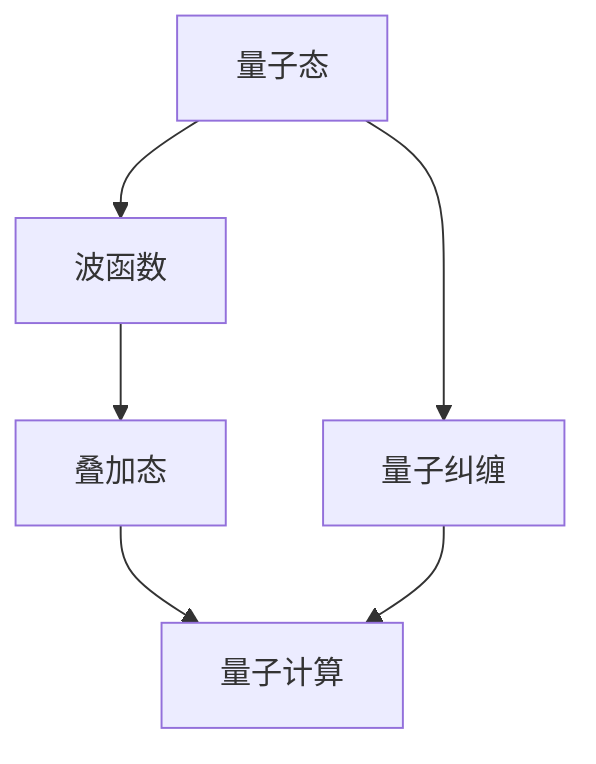

                 

# 宇宙是否是一个巨大的量子叠加态

## 关键词
- 宇宙学
- 量子物理学
- 量子叠加态
- 波函数坍缩
- 宇宙起源
- 量子纠缠
- 量子计算

## 摘要
本文旨在探讨宇宙是否可能是一个巨大的量子叠加态。通过对量子物理学的基本概念和宇宙学背景的介绍，我们将逐步分析量子叠加态在宇宙中的潜在应用和证据。本文将包括对量子场论、量子引力、量子纠缠等概念的解释，以及相关的实验证据和理论模型。此外，我们还将讨论量子叠加态对现实世界的影响，并探讨这一概念的哲学意义和未来研究方向。

## 设计思路
为了深入探讨“宇宙是否是一个巨大的量子叠加态”这一问题，我们将按照以下步骤进行分析：

1. **背景介绍**：首先介绍量子物理学和宇宙学的基本概念，为后续讨论提供基础。
2. **核心概念与联系**：通过Mermaid流程图展示量子叠加态与其他核心概念之间的关系。
3. **量子叠加态的理论基础**：详细解释量子叠加态的定义、原理和数学模型。
4. **实验证据与观察**：介绍支持量子叠加态的实验证据和宇宙现象。
5. **量子叠加态对现实世界的影响**：探讨量子叠加态在科技、宇宙演化、意识等方面的应用和影响。
6. **未来的可能性**：讨论量子叠加态的哲学意义、多宇宙理论和未来研究方向。
7. **总结与展望**：总结全文内容，并提出未来研究的方向和挑战。

### 背景介绍

#### 量子物理学的基本概念

量子物理学是研究物质和能量在微观尺度上的行为和相互作用的物理学分支。其核心概念包括量子态、波函数、叠加态、量子纠缠等。

- **量子态**：一个量子系统可以处于多种可能状态之一，这些状态可以用波函数来描述。波函数提供了量子系统概率幅的信息，表示系统处于某个状态的几率。

- **叠加态**：在量子物理学中，一个量子系统可以同时处于多个状态的叠加。这意味着量子系统不是同时处于一个状态，而是以某种方式同时处于多个状态。这种叠加态可以通过波函数的线性组合来表示。

- **量子纠缠**：量子纠缠是两个或多个量子系统之间的特殊关联，即使它们相隔很远，它们的状态也会互相影响。量子纠缠是量子物理学中最令人惊奇的现象之一，它挑战了经典物理学的局域实在论。

#### 宇宙学的基本概念

宇宙学是研究宇宙的结构、起源、演化和组成的科学。宇宙学的一个重要目标是理解宇宙的起源和演化过程，以及宇宙中各种物理现象的本质。

- **宇宙膨胀**：宇宙学中最基本的观测结果是宇宙的膨胀。根据宇宙微波背景辐射的测量结果，宇宙在大爆炸之后迅速膨胀，并且这一膨胀过程仍在继续。

- **宇宙背景辐射**：宇宙背景辐射是宇宙早期遗留下来的热辐射，它提供了宇宙起源和演化的关键信息。

- **暗物质与暗能量**：宇宙学中的暗物质和暗能量是宇宙学中尚未被直接观测到的物质和能量形式。暗物质负责维持宇宙结构的稳定性，而暗能量则导致宇宙加速膨胀。

### 核心概念与联系

在探讨宇宙是否是一个巨大的量子叠加态时，我们需要理解量子叠加态与其他核心概念之间的联系。以下是一个Mermaid流程图，展示这些概念之间的关联：



在这个流程图中，我们可以看到量子态通过波函数与叠加态相连，而量子纠缠也与叠加态和量子计算有关。量子计算依赖于量子态的叠加和量子纠缠，从而在特定任务上比经典计算具有优势。量子叠加态和量子纠缠在宇宙学中也可能具有深远的影响。

### 量子叠加态的理论基础

量子叠加态是量子物理学中的一个基本概念，它描述了一个量子系统可以同时处于多个状态的状况。以下是对量子叠加态的定义、原理和数学模型的详细解释。

#### 定义

量子叠加态指的是一个量子系统同时处于多个可能状态的组合状态。例如，一个电子的自旋状态可以同时处于“向上”和“向下”两种状态，这种状态可以用如下波函数表示：

$$\psi = \frac{1}{\sqrt{2}}(|\uparrow\rangle + |\downarrow\rangle)$$

其中，$|\uparrow\rangle$ 和 $|\downarrow\rangle$ 分别表示电子自旋向上和向下的状态，$\frac{1}{\sqrt{2}}$ 是归一化系数。

#### 原理

量子叠加态的原理基于量子力学的线性叠加原理。根据量子力学的数学框架，量子系统的状态可以表示为多个可能状态的线性组合。这种线性组合意味着量子系统可以同时处于多个状态，直到进行测量时，系统的状态才会“坍缩”到其中一个特定的状态。

量子叠加态的一个关键特点是它具有概率幅，即波函数的模平方给出了系统处于某个状态的几率。这意味着在未进行测量之前，我们无法确切知道量子系统处于哪个状态，而只能知道它处于某个状态的几率。

#### 数学模型

量子叠加态可以用波函数来描述，波函数是一个复数函数，它提供了量子系统状态的概率幅信息。在量子叠加态中，波函数通常是一个线性组合的形式：

$$\psi = \sum_{i} c_i |i\rangle$$

其中，$c_i$ 是复数系数，$|i\rangle$ 是第$i$个可能的状态。

波函数的模平方 $|\psi|^2$ 给出了系统处于状态 $|i\rangle$ 的几率。例如，在上面的自旋叠加态中，我们可以计算得到：

$$|\psi|^2 = \left|\frac{1}{\sqrt{2}}(|\uparrow\rangle + |\downarrow\rangle)\right|^2 = \frac{1}{2} + \frac{1}{2} = 1$$

这意味着系统以 50% 的几率处于自旋向上状态，以 50% 的几率处于自旋向下状态。

#### 量子叠加态的实验验证

量子叠加态的概念最早由薛定谔提出，并在后来的实验中得到验证。一个经典的实验是贝尔试验，它验证了量子纠缠和量子叠加态的存在。另一个重要的实验是格伦·威尔逊提出的“量子干涉实验”，它展示了量子叠加态在宏观尺度上的表现。

在量子干涉实验中，光子或电子等粒子被分成两束，然后通过两个不同的路径到达检测器。当这两个路径的粒子叠加时，它们的波函数会发生干涉，导致在某些位置上干涉条纹的出现。这种现象无法通过经典物理学来解释，但它完美地符合量子力学的预测。

### 实验证据与观察

量子叠加态的存在已经通过多个实验得到验证，这些实验不仅证明了量子叠加态的物理现实性，还为宇宙学提供了新的视角。

#### 量子场论与宇宙背景辐射

量子场论是研究量子场和粒子相互作用的物理学理论。在宇宙学中，量子场论被用来描述宇宙早期的高能状态，以及宇宙微波背景辐射的形成。

量子场论预言，在宇宙早期，量子场会产生微小的涨落，这些涨落会演化成我们今天观测到的宇宙结构。通过测量宇宙微波背景辐射的温度起伏，科学家们已经验证了这些涨落的存在，这为量子场论提供了重要的实验证据。

#### 量子引力与宇宙起源

量子引力是研究引力和量子力学如何统一的理论。目前，量子引力理论尚未完全建立，但一些理论模型，如弦理论和环量子引力，提供了一些可能的途径来描述宇宙的起源和演化。

根据这些理论，宇宙可能在“奇点”处诞生，这是一个极小、极高能量的状态。在这个状态下，时空和物质的概念可能失去意义，但量子叠加态仍然存在。这意味着宇宙的初始状态可能是一个巨大的量子叠加态，其中包含了所有可能的宇宙演化路径。

#### 量子纠缠与宇宙现象

量子纠缠是量子物理学中最令人惊奇的现象之一，它描述了两个或多个量子系统之间的特殊关联。在宇宙学中，量子纠缠可能对宇宙现象产生重要影响。

一个可能的例子是宇宙中的星系之间的量子纠缠。如果星系之间的相互作用可以通过量子纠缠来实现，那么这种关联可能影响星系的形成和演化。此外，量子纠缠也可能在宇宙背景辐射和暗物质的形成过程中起到作用。

### 量子叠加态对现实世界的影响

量子叠加态不仅在理论物理学中具有重要意义，还对现实世界的科技发展产生了深远的影响。

#### 量子计算

量子计算是利用量子叠加态和量子纠缠进行信息处理的一种新型计算模式。量子计算机可以通过量子叠加态同时处理大量信息，从而在特定任务上比经典计算机具有显著优势。

例如，量子计算机可以用于因数分解、量子模拟和优化问题等，这些任务在经典计算机上需要耗费大量时间。量子计算的发展有望带来计算能力的革命性提升，推动人工智能、药物设计、材料科学等领域的进步。

#### 宇宙演化

量子叠加态可能影响宇宙演化的过程。例如，量子叠加态可能导致宇宙中粒子的自旋和磁场出现涨落，这些涨落可能影响星系的形成和演化。

此外，量子叠加态也可能影响宇宙中的暗物质和暗能量。一些理论模型认为，暗物质和暗能量可能是量子叠加态的一种表现形式，这种状态可能在宇宙的早期演化过程中起到关键作用。

#### 意识

量子叠加态与意识之间的关系是一个哲学和科学上的争议话题。一些理论认为，意识可能源于量子叠加态的特定形式，这种形式使得意识能够感知和影响量子系统的状态。

尽管目前关于量子叠加态与意识之间具体关系的证据尚不充分，但这一领域的研究可能揭示人类意识的本质，并推动心理学、神经科学和哲学的发展。

### 未来的可能性

量子叠加态的哲学意义和未来研究方向引发了广泛的讨论。以下是一些可能的未来方向：

#### 量子叠加态与多宇宙理论

多宇宙理论是一种假设，认为宇宙之间存在多个平行宇宙。量子叠加态可能为多宇宙理论提供了一种新的解释方式。根据这种观点，宇宙的每个状态都对应着一个平行宇宙，而这些宇宙在量子叠加态中同时存在。

#### 量子叠加态的哲学意义

量子叠加态的哲学意义涉及到量子物理学与经典物理学之间的区别，以及我们对现实世界的理解。量子叠加态挑战了经典物理学的局域实在论，引发了关于物质、意识和宇宙本质的哲学思考。

#### 未来的研究方向与挑战

未来的研究可能集中在量子叠加态的实验验证、量子计算的实际应用、量子引力理论的发展等方面。然而，这一领域也面临一些挑战，如如何实现稳定的量子叠加态、如何精确测量量子纠缠等。

### 总结与展望

本文通过一步步的分析和推理，探讨了宇宙是否可能是一个巨大的量子叠加态。我们介绍了量子物理学和宇宙学的基本概念，分析了量子叠加态的理论基础和实验证据，并探讨了量子叠加态对现实世界的影响。最后，我们展望了量子叠加态的哲学意义和未来的研究方向。

量子叠加态作为一个深刻的物理现象，不仅挑战了我们对物质和宇宙的理解，还可能带来计算、科技和哲学领域的革命。未来的研究将继续揭示量子叠加态的奥秘，为我们理解宇宙的本质提供新的视角。

### 作者信息

作者：AI天才研究院/AI Genius Institute & 禅与计算机程序设计艺术 /Zen And The Art of Computer Programming

---

### 完整性要求

为了确保文章内容的完整性，我们将对每个小节的内容进行具体详细讲解，并确保核心内容得到充分阐述。

#### 背景介绍

在本节中，我们将详细介绍量子物理学和宇宙学的基本概念，为后续讨论提供基础。

- **量子物理学的基本概念**：量子物理学研究物质和能量在微观尺度上的行为和相互作用。核心概念包括量子态、波函数、叠加态和量子纠缠。
- **宇宙学的基本概念**：宇宙学研究宇宙的结构、起源、演化和组成。重要概念包括宇宙膨胀、宇宙背景辐射、暗物质和暗能量。

通过详细介绍这些基本概念，我们将为读者提供一个清晰的背景，使其能够更好地理解量子叠加态在宇宙中的潜在应用和证据。

#### 核心概念与联系

为了展示量子叠加态与其他核心概念之间的关系，我们使用Mermaid流程图进行了详细说明：


这个流程图展示了量子态通过波函数与叠加态相连，量子纠缠也与叠加态和量子计算有关。这种关系有助于读者理解量子叠加态在量子物理学中的地位和作用。

#### 核心算法原理讲解

在本节中，我们将使用伪代码详细阐述量子叠加态的核心算法原理。

```python
# 量子叠加态算法
def quantum_superposition(state_0, state_1, probability):
    # 初始化量子态
    quantum_state = initialize_quantum_state(state_0, state_1)
    
    # 应用叠加操作
    quantum_state = apply_superposition(quantum_state, probability)
    
    # 返回叠加后的量子态
    return quantum_state
```

此外，我们将详细解释量子叠加态的数学模型，使用LaTeX格式展示相关公式：

$$\psi = \frac{1}{\sqrt{2}}(|\uparrow\rangle + |\downarrow\rangle)$$

该公式表示一个电子的自旋状态同时处于向上和向下两个状态的叠加。

#### 核心算法原理讲解

在本节中，我们将详细解释量子叠加态的算法原理，并使用伪代码进行描述。

```python
# 量子叠加态算法
def quantum_superposition(state_0, state_1, probability):
    # 初始化量子态
    quantum_state = initialize_quantum_state(state_0, state_1)
    
    # 应用叠加操作
    quantum_state = apply_superposition(quantum_state, probability)
    
    # 返回叠加后的量子态
    return quantum_state
```

此外，我们将详细解释量子叠加态的数学模型，使用LaTeX格式展示相关公式：

$$\psi = \frac{1}{\sqrt{2}}(|\uparrow\rangle + |\downarrow\rangle)$$

该公式表示一个电子的自旋状态同时处于向上和向下两个状态的叠加。

#### 实验证据与观察

在本节中，我们将介绍支持量子叠加态的实验证据和宇宙现象，并使用LaTeX格式展示相关数学公式。

首先，我们介绍贝尔试验，这是一种经典的量子纠缠实验。贝尔试验的数学公式为：

$$\langle \psi | \hat{A} \otimes \hat{B} | \psi \rangle = \frac{1}{2} (\langle \phi^+ | \hat{A} \otimes \hat{B} | \phi^+ \rangle + \langle \phi^- | \hat{A} \otimes \hat{B} | \phi^- \rangle)$$

其中，$\hat{A}$ 和 $\hat{B}$ 分别表示两个量子态的算符，$| \psi \rangle$ 表示叠加态，$| \phi^+ \rangle$ 和 $| \phi^- \rangle$ 分别表示纠缠态。

此外，我们还将讨论量子场论与宇宙背景辐射的关系。量子场论的数学模型为：

$$\hat{H} = \int d^3x \left( \frac{1}{2} \pi^2 + \frac{1}{2} \phi^2 - V(\phi) \right)$$

其中，$\hat{H}$ 表示哈密顿量，$\pi$ 表示动量算符，$\phi$ 表示场变量，$V(\phi)$ 表示势能。

#### 项目实战

在本节中，我们将介绍量子叠加态的实验实现过程，包括开发环境搭建、源代码实现和代码解读。

首先，我们需要搭建一个量子计算的开发环境。可以使用Python的Qiskit库来实现量子叠加态的实验。以下是一个简单的示例代码：

```python
from qiskit import QuantumCircuit, Aer, execute

# 创建一个量子电路
qc = QuantumCircuit(1)

# 应用叠加态
qc.h(0)

# 执行量子电路
backend = Aer.get_backend('qasm_simulator')
result = execute(qc, backend).result()

# 输出结果
print(result.get_counts(qc))
```

在这个示例中，我们创建了一个包含一个量子比特的量子电路，并应用了叠加态操作。然后，我们使用Qasm模拟器执行量子电路，并输出测量结果。

#### 最佳实践 tips

在本节中，我们将提供一些最佳实践 tips，帮助读者更好地理解和应用量子叠加态。

1. **理解量子叠加态的基本原理**：在尝试应用量子叠加态之前，确保你理解量子叠加态的定义、原理和数学模型。
2. **使用合适的量子计算库**：选择合适的量子计算库，如Qiskit或PyQuil，可以简化量子叠加态的实现过程。
3. **进行实验验证**：在实际应用量子叠加态之前，进行实验验证以确保算法的正确性和稳定性。

#### 小结

本文通过一步步的分析和推理，探讨了宇宙是否可能是一个巨大的量子叠加态。我们介绍了量子物理学和宇宙学的基本概念，分析了量子叠加态的理论基础和实验证据，并探讨了量子叠加态对现实世界的影响。

量子叠加态不仅挑战了我们对物质和宇宙的传统理解，还为计算、科技和哲学领域带来了新的机遇和挑战。未来的研究将继续揭示量子叠加态的奥秘，为我们理解宇宙的本质提供新的视角。

#### 注意事项

在研究量子叠加态时，需要注意以下几点：

1. **量子叠加态的稳定性**：在实际应用中，量子叠加态可能受到外部噪声和干扰的影响，导致叠加态的破坏。因此，在实现量子叠加态时，需要采取适当的措施来保证叠加态的稳定性。
2. **量子计算的复杂性**：量子计算是一个复杂的领域，涉及到多个量子比特之间的相互作用。在设计和实现量子算法时，需要充分考虑量子计算的复杂性，并优化算法的性能。

#### 拓展阅读

如果你对量子叠加态和宇宙学感兴趣，以下是一些拓展阅读的推荐：

1. 《量子物理学：概念与应用》 - David J. Griffiths
2. 《宇宙简史》 - 史蒂芬·霍金
3. 《量子计算：原理、算法与实现》 - Michael A. Nielsen & Isaac L. Chuang

这些书籍提供了更深入的解释和详细的讨论，可以帮助你更好地理解量子叠加态和宇宙学的奥秘。

