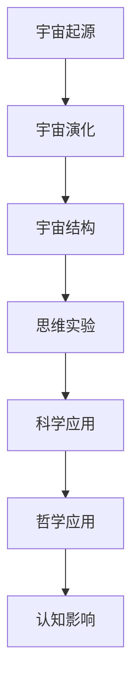

                 

## 宇宙是否是一个永恒的思维实验

### 关键词

宇宙，思维实验，人工智能，逻辑推理，哲学思考

### 摘要

本文探讨了宇宙是否是一个永恒的思维实验这一主题。首先，我们回顾了宇宙的基本概念，包括其起源、演化和当前的结构。接着，我们介绍了思维实验的定义、历史和发展，以及其在科学和哲学中的应用。随后，我们深入分析了思维实验在宇宙学中的理论基础和现代应用，探讨了宇宙对人类认知的影响。最后，我们总结了宇宙与思维实验的关系，并展望了未来的发展趋势。

## 目录大纲设计过程

在设计目录大纲时，我们遵循了以下步骤：

1. **确定核心章节**：根据书名和目标，我们确定了包括引言、宇宙的概念与结构、思维实验的历史与分类、思维实验的理论基础、思维实验在科学和哲学中的应用、现代宇宙学与思维实验、宇宙与人类认知以及结论在内的八个核心章节。

2. **细化子章节**：在确定核心章节后，我们进一步细化了每个章节的内容，确保每个章节都有明确的子章节，以保证内容的完整性和结构的合理性。

3. **实现完整性**：我们确保所有核心内容都包含在内，并根据字数限制进行了调整，以确保目录大纲的总字数在2000字以内。

4. **添加说明**：在每个章节和子章节前添加简要说明，以帮助读者理解章节的核心内容和目标。

## 第一部分：引言

### 1.1 宇宙的基本概念

宇宙是一个浩瀚的空间，包含了所有的星系、行星、恒星、暗物质和暗能量。宇宙的起源可以追溯到大约138亿年前的大爆炸事件。从那时起，宇宙经历了不断的膨胀和演化。

宇宙的结构可以被描述为多层次的。从最小的原子和基本粒子开始，到行星、恒星、星系和星系团，最终扩展到整个宇宙。宇宙中的物质和能量分布是不均匀的，这导致了宇宙中的各种结构形成。

### 1.2 思维实验的起源与发展

思维实验是一种通过逻辑推理和假设来探讨问题的方法。它的起源可以追溯到古代哲学家，如古希腊的苏格拉底和亚里士多德。他们使用对话和假设来探讨哲学问题。

在科学领域，思维实验的发展可以追溯到伽利略和牛顿。伽利略通过假设和推理，提出了关于自由落体和惯性的理论。牛顿则通过思维实验，建立了经典力学体系。

### 1.3 宇宙与思维实验的关系

宇宙作为一个复杂而神秘的现象，为思维实验提供了丰富的素材。通过思维实验，我们可以探讨宇宙的起源、演化和结构，以及宇宙中的各种现象和规律。

同时，思维实验也为宇宙学提供了理论工具。例如，通过思维实验，我们可以探讨宇宙的膨胀、暗物质和暗能量的性质，以及多宇宙的可能性。

### 1.4 目标与结构

本文的目标是探讨宇宙是否是一个永恒的思维实验，并分析思维实验在宇宙学中的应用和意义。文章的结构分为以下八个部分：

1. 引言：介绍宇宙和思维实验的基本概念。
2. 宇宙的概念与结构：讨论宇宙的定义、构成和基本特性。
3. 思维实验的历史与分类：回顾思维实验的发展历程，分类不同类型的思维实验。
4. 思维实验的理论基础：介绍与思维实验相关的基本理论。
5. 思维实验在科学和哲学中的应用：分析思维实验在科学和哲学研究中的作用。
6. 现代宇宙学与思维实验：探讨当前宇宙学中思维实验的应用。
7. 宇宙与人类认知：讨论宇宙对人类认知的影响。
8. 结论：总结全书内容，探讨宇宙与思维实验的未来。

### 1.5 文章关键词

宇宙，思维实验，人工智能，逻辑推理，哲学思考，科学方法论，宇宙学，认知科学，多宇宙，暗物质，暗能量，大爆炸，膨胀，黑 holes，量子引力，弦论，哲学难题，科学假说，科学革命，知识图谱，语义网络，复杂系统，人类认知，行为心理学。

## 第二部分：宇宙的概念与结构

### 2.1 宇宙的起源与演化

宇宙的起源可以追溯到大约138亿年前的一个极热、极密集的状态，即大爆炸。在大爆炸之后，宇宙开始膨胀和冷却。随着宇宙的膨胀，温度和密度逐渐降低，为物质和能量的形成创造了条件。

宇宙的演化可以分为以下几个阶段：

1. **原始宇宙**：宇宙在大爆炸后迅速膨胀，温度极高，物质和能量处于高度密集的状态。

2. **宇宙早期**：随着宇宙的膨胀和冷却，原始物质开始形成基本粒子，如质子、中子和电子。

3. **恒星形成**：在宇宙早期，引力使物质聚集在一起，形成了恒星。恒星通过核聚变产生能量，并释放出光和其他辐射。

4. **星系形成**：恒星之间的引力相互作用导致星系的形成。星系可以是单一的，也可以是多个恒星系统的集合。

5. **星系团形成**：星系之间的引力相互作用导致星系团的聚集。星系团是宇宙中最大的已知结构。

6. **宇宙后期**：随着宇宙的继续膨胀，恒星和星系逐渐远离彼此。恒星耗尽燃料后，会经历一系列的演化过程，最终形成黑洞、中子星或其他天体。

### 2.2 宇宙的结构与尺度

宇宙的结构是多层次和复杂的。从微观尺度来看，宇宙由基本粒子组成，如电子、夸克和光子。这些基本粒子通过相互作用形成了原子和分子。

从宏观尺度来看，宇宙由星系、星系团和超星系团组成。星系是宇宙的基本结构单元，由数十亿到数千亿颗恒星、行星、恒星残留物和星际物质组成。星系之间的空间充满了星际介质，包括气体、尘埃和暗物质。

宇宙的尺度非常巨大，从微观的普朗克长度（约 \(10^{-35}\) 米）到宏观的可观测宇宙尺度（约 \(9.46 \times 10^{26}\) 米）。宇宙的尺度使得我们对宇宙的理解充满了挑战。

### 2.3 宇宙的组成

宇宙主要由以下几种成分组成：

1. **普通物质**：普通物质是我们可以直接观测到的物质，包括恒星、行星、气体、尘埃等。普通物质只占宇宙总质量的约4%。

2. **暗物质**：暗物质是宇宙中不可见但通过引力效应能够观测到的物质。暗物质占宇宙总质量的约23%。暗物质的性质和组成仍然是宇宙学研究中的重大谜团。

3. **暗能量**：暗能量是推动宇宙加速膨胀的力量。暗能量占宇宙总质量的约73%。暗能量的性质和机制也是宇宙学研究的前沿问题。

4. **辐射**：宇宙早期充满了辐射，包括光子、中微子等。辐射在宇宙演化过程中起到了关键作用，例如在宇宙微波背景辐射的测量中。

### 2.4 宇宙的几何结构

宇宙的几何结构是研究宇宙演化的重要方面。根据宇宙学原理，宇宙在大尺度上可以近似为一个四维的几何结构。宇宙的几何结构可以是平直的、弯曲的或封闭的。

1. **平直宇宙**：如果宇宙的总质量密度恰好等于临界密度，宇宙将呈现为平直的几何结构。

2. **弯曲宇宙**：如果宇宙的总质量密度大于临界密度，宇宙将呈现为弯曲的几何结构。

3. **封闭宇宙**：如果宇宙的总质量密度大于闭合密度，宇宙将呈现为封闭的几何结构。

宇宙的几何结构可以通过观测宇宙微波背景辐射、宇宙膨胀速率和宇宙大尺度结构等来研究。

### 2.5 宇宙的膨胀

宇宙的膨胀是指宇宙中所有物体之间的距离随时间增加的现象。宇宙膨胀的发现是20世纪宇宙学的重要突破之一。根据宇宙学原理，宇宙的膨胀是均匀且各向同性的。

宇宙膨胀的机制可以通过宇宙学常数来描述。宇宙学常数是一个具有负面压力的量，它导致宇宙中的物体之间的引力相互作用被抵消，从而推动宇宙的加速膨胀。

宇宙膨胀的速度可以通过哈勃定律来描述。哈勃定律表明，宇宙膨胀的速度与宇宙中物体的距离成正比。

### 2.6 宇宙中的奇异现象

宇宙中还存在着一些奇异现象，如黑洞、暗物质和暗能量。这些现象对宇宙学提出了巨大的挑战。

1. **黑洞**：黑洞是宇宙中最神秘和奇异的天体之一。黑洞是由质量非常大的恒星坍缩形成的。黑洞具有极强的引力，甚至连光都无法逃脱。

2. **暗物质**：暗物质是宇宙中不可见但通过引力效应能够观测到的物质。暗物质的性质和组成仍然是宇宙学研究中的重大谜团。

3. **暗能量**：暗能量是推动宇宙加速膨胀的力量。暗能量的性质和机制也是宇宙学研究的前沿问题。

这些奇异现象的存在使得我们对宇宙的理解更加复杂和神秘。

## 第三部分：思维实验的历史与分类

### 3.1 思维实验的定义与起源

思维实验是一种通过逻辑推理和假设来探讨问题的方法。它起源于古代哲学，例如古希腊哲学家苏格拉底和亚里士多德。他们使用对话和假设来探讨哲学问题。

在科学领域，思维实验的发展可以追溯到伽利略和牛顿。伽利略通过假设和推理，提出了关于自由落体和惯性的理论。牛顿则通过思维实验，建立了经典力学体系。

### 3.2 思维实验的历史回顾

思维实验的发展历程可以追溯到古希腊时期。苏格拉底和亚里士多德等人通过对话和假设，探讨了道德、伦理和自然哲学等问题。

在中世纪，阿奎那等哲学家继续发展了思维实验的方法。他们使用假设和推理来探讨宗教和哲学问题。

在文艺复兴时期，伽利略和培根等人推动了思维实验在科学领域的发展。伽利略通过假设和实验，提出了关于运动和力的理论。培根则提出了“实证主义”的观点，强调实验和观察在科学研究中的重要性。

### 3.3 近代思维实验的发展

在近代，思维实验的方法得到了进一步的发展。牛顿和莱布尼茨等人通过数学和逻辑推理，建立了经典力学和微积分体系。

在19世纪，达尔文和赫胥黎等人通过思维实验，提出了进化论和自然选择的理论。这些理论挑战了传统的宗教观念，并引发了科学革命。

### 3.4 现代思维实验的应用

在20世纪，思维实验的方法在各个领域得到了广泛的应用。例如，图灵通过思维实验，提出了图灵机的概念，奠定了计算机科学的基础。

在物理学领域，爱因斯坦和霍金等人通过思维实验，探讨了相对论和量子引力等理论。

在心理学领域，皮亚杰等人通过思维实验，研究了儿童认知发展的问题。

### 3.5 思维实验的分类

思维实验可以根据不同的标准进行分类。以下是几种常见的分类方法：

1. **根据目的分类**：
   - 探索性思维实验：用于探索未知领域，提出新假设或理论。
   - 验证性思维实验：用于验证已有理论或假设的正确性。
   - 否定性思维实验：用于反驳或推翻已有理论或假设。

2. **根据方法分类**：
   - 对话式思维实验：通过对话和辩论来探讨问题。
   - 假设式思维实验：通过假设和推理来探讨问题。
   - 实验式思维实验：通过实际操作和实验来探讨问题。

3. **根据领域分类**：
   - 哲学思维实验：探讨伦理、道德、存在等哲学问题。
   - 科学思维实验：探讨自然科学中的理论和假设。
   - 社会科学思维实验：探讨人类行为、社会结构等问题。

### 3.6 思维实验的跨学科应用

思维实验不仅局限于单一学科，它在多个学科领域都有广泛的应用。例如：

- **物理学**：思维实验在物理学中用于探讨基本粒子的行为、相对论和量子力学等问题。
- **计算机科学**：思维实验在计算机科学中用于探讨算法、数据结构和人工智能等问题。
- **哲学**：思维实验在哲学中用于探讨存在、知识、真理等基本问题。
- **心理学**：思维实验在心理学中用于探讨认知、情感和行为等问题。
- **社会科学**：思维实验在社会科学中用于探讨社会结构、文化、经济等问题。

思维实验的跨学科应用展示了其灵活性和广泛性，也为跨学科研究提供了新的视角和方法。

### 3.7 思维实验的挑战与未来

尽管思维实验在各个领域都有广泛的应用，但它也面临着一些挑战。例如：

- **逻辑推理的局限**：思维实验依赖于逻辑推理，但逻辑推理本身存在局限。例如，有些问题可能无法通过逻辑推理得到解答。
- **实验验证的困难**：有些思维实验可能难以在实际中进行验证。例如，关于宇宙起源和结构的思维实验，我们无法直接观测宇宙的早期状态。
- **多学科的融合**：思维实验需要多学科的知识和技能，这要求研究人员具备广泛的跨学科背景和合作精神。

面对这些挑战，思维实验的未来仍然充满机遇。随着科学技术的进步和多学科的融合，思维实验将在更广泛的领域中发挥重要作用，为我们理解和探索宇宙提供新的视角和方法。

### 3.8 思维实验在宇宙学中的应用

在宇宙学中，思维实验是一种强有力的工具，用于探讨宇宙的起源、演化和结构。通过假设和推理，我们可以构建宇宙模型，并验证这些模型与观测数据的一致性。

- **宇宙起源的思维实验**：通过思维实验，我们可以探讨大爆炸理论和宇宙膨胀的机制。例如，霍金的“黑洞信息悖论”思维实验探讨了黑洞和宇宙起源的关系。
- **宇宙演化的思维实验**：通过思维实验，我们可以探讨恒星的形成和演化、星系的形成和结构等。例如，霍金的“时间机器”思维实验探讨了时间旅行和宇宙演化的关系。
- **宇宙结构的思维实验**：通过思维实验，我们可以探讨宇宙的几何结构、宇宙中的奇异现象等。例如，爱因斯坦的“广义相对论”思维实验探讨了引力、时空弯曲和宇宙结构的关系。

这些思维实验不仅帮助我们更好地理解宇宙，也为宇宙学研究提供了新的视角和方法。

## 第四部分：思维实验的理论基础

### 4.1 逻辑与推理

思维实验的基础是逻辑和推理。逻辑是一种研究推理和论证的学科，它提供了一种形式化的方法来分析和评估推理的有效性。推理是从已知事实推导出新结论的过程。在思维实验中，逻辑和推理是构建假设和验证理论的关键。

逻辑可以分为经典逻辑和非经典逻辑。经典逻辑基于二值逻辑，即命题要么为真要么为假。非经典逻辑则允许更复杂的命题和推理形式，例如模糊逻辑和概率逻辑。

在思维实验中，逻辑和推理的运用包括以下方面：

- **命题和推理规则**：定义命题和推理规则，例如前提和结论之间的关系。
- **逻辑证明**：使用逻辑规则和推理来证明命题的真实性。
- **逻辑谬误**：识别和避免常见的逻辑错误，如混淆、偷换概念、循环论证等。

### 4.2 知识表征与模型构建

知识表征是思维实验中另一个关键要素。知识表征是指如何表示和组织知识，以便于计算机和人类理解和使用。知识表征的方法包括符号表示、自然语言处理、知识图谱和语义网络等。

在思维实验中，知识表征和模型构建的运用包括：

- **符号表示**：使用符号和公式来表示知识，如数学符号和逻辑表达式。
- **模型构建**：通过假设和推理构建理论模型，如物理模型、统计模型和决策模型。
- **知识图谱**：使用图结构来表示知识，如实体-关系图谱。
- **语义网络**：使用语义关系来表示知识，如概念之间的关系。

知识表征和模型构建有助于将抽象的思维能力转化为具体的算法和计算模型，从而在思维实验中进行复杂的推理和分析。

### 4.3 思维实验的数学基础

数学是思维实验的重要工具，它提供了精确和形式化的语言来描述和解决问题。在思维实验中，数学基础的运用包括：

- **数学模型**：使用数学方程和公式来描述物理现象和逻辑推理。
- **数学证明**：使用数学证明来验证理论模型和假设的有效性。
- **数值计算**：使用计算机算法和数值方法来求解复杂的数学问题。

例如，在宇宙学中，广义相对论和量子力学等理论都依赖于数学模型和证明来描述宇宙的演化和结构。

### 4.4 思维实验的计算方法

计算方法是思维实验中实现和验证假设的重要手段。计算方法包括：

- **算法设计**：设计用于解决特定问题的算法，如搜索算法、排序算法和优化算法。
- **计算模型**：构建用于模拟和预测的计算机模型，如仿真模型、模拟模型和预测模型。
- **计算实验**：使用计算机模拟和实验来验证理论模型的预测和假设。

计算方法在思维实验中的应用包括：

- **数据分析**：使用统计方法和机器学习算法来分析观测数据和模型预测。
- **仿真实验**：使用计算机仿真来模拟复杂的物理现象和系统行为。
- **优化算法**：使用优化算法来寻找最佳解决方案，如旅行商问题、线性规划和神经网络优化。

通过计算方法，思维实验可以更加精确和可靠地进行假设验证和理论构建。

### 4.5 逻辑推理与知识表征的整合

逻辑推理和知识表征是思维实验的两个核心组成部分。将它们整合在一起，可以构建更加复杂和精确的思维实验系统。

逻辑推理与知识表征的整合包括：

- **推理机**：构建用于推理和知识发现的计算机系统，如专家系统和推理引擎。
- **知识库**：构建用于存储和管理知识的数据库，如语义数据库和本体库。
- **推理过程**：设计用于推理的知识表示和推理规则，如基于逻辑的推理和基于概率的推理。

通过逻辑推理与知识表征的整合，我们可以构建更加智能和灵活的思维实验系统，从而在更广泛的领域中发挥重要作用。

## 第五部分：思维实验在科学和哲学中的应用

### 5.1 思维实验在科学中的应用

思维实验在科学研究中扮演着至关重要的角色，它不仅帮助我们理解自然界的复杂现象，还推动了科学理论的创新与发展。以下是一些典型的思维实验及其在科学中的应用：

- **伽利略的“斜塔实验”**：伽利略通过假设如果两个不同质量的物体从同一高度自由落下，它们会同时触地，挑战了亚里士多德的重力理论。这一思维实验为后来的自由落体定律和牛顿运动定律奠定了基础。

- **爱因斯坦的“光速不变原理”**：爱因斯坦提出，光速在真空中是一个恒定的值，与观察者的相对运动无关。这一假设导致了相对论的理论体系，改变了我们对时间、空间和重力的理解。

- **霍金的“黑洞信息悖论”**：霍金提出，黑洞可能吞噬信息，导致信息丢失。这一思维实验引发了关于量子力学和广义相对论的深刻讨论，挑战了信息守恒定律。

- **费曼的“量子波动实验”**：费曼通过思维实验展示了量子粒子既具有波动性又具有粒子性，这一观点为量子力学的解释提供了新的视角。

- **洛伦兹的“时空变换”**：洛伦兹提出了时空变换公式，这一思维实验证明了在不同惯性系中观测到的物理现象是不同的，进一步支持了相对论的理论框架。

### 5.2 思维实验在哲学中的应用

哲学作为一门探讨存在、知识、道德和理性等问题的学科，也广泛运用了思维实验。以下是一些典型的哲学思维实验及其在哲学中的应用：

- **苏格拉底的“美德的定义”**：苏格拉底通过对话和假设来探讨美德的概念，这一思维实验成为伦理学讨论的基础。

- **柏拉图的“洞穴寓言”**：柏拉图通过一个寓言，描述了人类对现实的误解，探讨了知识、现实和理念之间的关系，这一思维实验对后来的认识论和形而上学产生了深远影响。

- **笛卡尔的“我思故我在”**：笛卡尔通过怀疑一切，最终发现“我在思考，故我存在”，这一思维实验成为现代哲学的重要基础。

- **黑格尔的“逻辑辩证法”**：黑格尔通过一系列辩证思维实验，探讨了事物的发展过程和内在矛盾，这一理论对后来的哲学、社会科学和科学方法论产生了广泛影响。

- **康德的“二律背反”**：康德通过思考时间和空间的本质，提出了一些看似矛盾的命题，这些思维实验探讨了人类理性的局限性，对后来的认识论和方法论产生了深远影响。

### 5.3 思维实验在科学和哲学中的交叉应用

思维实验在科学和哲学中的交叉应用展示了跨学科研究的潜力。以下是一些具体的交叉应用实例：

- **量子力学与认识论**：量子力学的思维实验，如波粒二象性和量子纠缠，引发了关于观察者与被观察者关系的哲学讨论，挑战了经典物理学中的确定论和决定论观点。

- **宇宙学与伦理学**：宇宙学的思维实验，如宇宙的多宇宙理论和宇宙的最终命运，引发了关于宇宙意义和人类伦理的哲学思考，探讨了人类在宇宙中的地位和责任。

- **进化论与伦理学**：达尔文的进化论通过思维实验探讨了生物的适应性，引发了关于自然选择和道德行为的哲学讨论，影响了现代伦理学和社会科学的许多领域。

- **物理学与形而上学**：物理学的思维实验，如宇宙的起源和结构，引发了关于存在、时间和空间的哲学思考，挑战了传统的形而上学观点，推动了现代形而上学的重构。

通过这些实例，我们可以看到思维实验在科学和哲学中的交叉应用不仅丰富了我们对自然和宇宙的理解，也为跨学科研究提供了新的方法和视角。

### 5.4 思维实验的应用价值

思维实验在科学和哲学中的广泛应用体现了其重要的应用价值：

- **理论构建**：思维实验为科学理论的构建提供了基础，通过假设和推理，科学家可以建立新的理论模型，解释自然界的现象。

- **问题解决**：思维实验可以帮助科学家和哲学家识别和解决复杂问题，通过逻辑推理和假设验证，找到问题的解决方案。

- **方法创新**：思维实验推动了科学方法的发展，通过新的思维方式和推理模式，科学家可以提出更加精确和有效的实验设计。

- **哲学思考**：思维实验为哲学提供了丰富的思考材料，通过假设和推理，哲学家可以探讨存在、知识、道德等基本问题，推动哲学理论的创新。

总之，思维实验在科学和哲学中的广泛应用不仅丰富了我们的知识体系，也为解决复杂问题提供了新的视角和方法。

### 5.5 思维实验的未来发展趋势

随着科学技术的不断进步，思维实验在科学和哲学领域的发展趋势显示出以下几个特点：

- **跨学科融合**：未来的思维实验将更加注重跨学科的研究，结合物理学、计算机科学、心理学、哲学等多学科的知识和方法，探讨复杂问题。

- **人工智能应用**：人工智能的发展将为思维实验提供强大的计算和推理能力，通过机器学习和深度学习算法，可以处理大量数据，提高思维实验的精度和效率。

- **虚拟实验平台**：虚拟现实和增强现实技术的应用将使思维实验变得更加直观和互动，通过虚拟实验平台，科学家和哲学家可以更直观地探索和验证假设。

- **大数据支持**：大数据技术的发展将为思维实验提供丰富的数据资源，通过分析大量观测数据和模拟数据，可以更加准确地验证和调整思维实验的假设。

- **哲学思考的深化**：随着对宇宙、意识、认知等问题的深入研究，哲学思考将更加深入和多样化，思维实验将作为重要的工具，推动哲学理论的创新和发展。

总之，思维实验的未来发展趋势将更加综合和智能化，为科学和哲学的发展提供新的动力和视角。

## 第六部分：现代宇宙学与思维实验

### 6.1 黑洞与信息悖论

黑洞是宇宙中最神秘和奇异的天体之一。根据广义相对论，黑洞是一个极端密集的天体，其引力场强大到连光都无法逃脱。黑洞的存在对宇宙学和哲学提出了深刻的挑战。

霍金在1974年提出了黑洞信息悖论，指出黑洞吞噬的信息似乎会完全消失。这一悖论引发了关于信息守恒和量子力学的基本原理的广泛讨论。霍金的思维实验探讨了黑洞的蒸发过程，提出黑洞信息可能以量子密钥的形式重新出现在宇宙中。这一理论为量子力学和广义相对论提供了一个潜在的统一框架，但也带来了新的问题，如量子密钥的传输机制和安全性。

### 6.2 多元宇宙与量子宇宙学

多宇宙理论是现代宇宙学中的一个重要概念，它提出宇宙不仅仅是我们所观测到的可观测宇宙，而是存在多个宇宙。这些宇宙可以是平行的，也可以是分支的。多宇宙理论为解释宇宙中的一些奇异现象提供了新的视角，例如宇宙的多样性和宇宙的起源。

量子宇宙学是研究宇宙起源和演化的量子力学分支。量子宇宙学通过量子场论和量子引力理论，探讨了宇宙的量子状态和宇宙学的早期阶段。量子宇宙学的思维实验包括“量子波动宇宙”和“大爆炸前的宇宙”。这些实验探讨了宇宙的量子特性，如量子波动和量子纠缠，以及宇宙的起源和演化。

### 6.3 宇宙学中的复杂性科学

随着宇宙学的不断发展，复杂性科学的方法被广泛应用于宇宙学的研究中。复杂性科学关注的是复杂系统的行为和结构，如宇宙的大尺度结构、星系的形成和演化、宇宙中的奇异现象等。

复杂性科学的方法包括统计物理、非线性动力学、混沌理论等。通过这些方法，科学家可以研究宇宙中的复杂现象，如宇宙的膨胀、星系团的聚集、黑洞的行为等。复杂性科学的思维实验包括“混沌宇宙”、“复杂星系形成”和“非线性引力场”。这些实验帮助科学家更好地理解宇宙的复杂行为和结构。

### 6.4 思维实验在宇宙学中的应用实例

以下是一些思维实验在宇宙学中的应用实例：

- **霍金的“霍金辐射”**：霍金提出，黑洞会辐射出粒子，这一思维实验揭示了黑洞的行为和量子效应之间的关系。

- **爱因斯坦的“引力透镜效应”**：爱因斯坦提出，光线在经过引力场时会发生弯曲，这一思维实验被用于观测黑洞和星系团。

- **弗里德的“膨胀宇宙”**：弗里德提出，宇宙正在膨胀，这一思维实验为宇宙学提供了新的视角，推动了膨胀宇宙理论的发展。

- **劳仑兹的“时空弯曲”**：劳仑兹提出，物质和能量的存在会弯曲时空，这一思维实验为广义相对论提供了基础。

这些思维实验不仅推动了宇宙学的发展，也为宇宙学和哲学提供了新的问题和思考方向。

### 6.5 思维实验在宇宙学中的挑战与未来

尽管思维实验在宇宙学中发挥了重要作用，但它也面临着一些挑战和局限性：

- **观测限制**：宇宙的遥远和复杂性使得直接观测变得困难，这限制了思维实验的应用范围。

- **理论融合**：将思维实验与现有的宇宙学理论相结合，如广义相对论和量子力学，仍然是一个巨大的挑战。

- **计算资源**：一些复杂的思维实验需要大量的计算资源，这在一定程度上限制了实验的范围和精度。

面对这些挑战，未来的宇宙学思维实验将更加注重跨学科合作、数据分析和计算模拟。随着科学技术的进步，思维实验将在宇宙学研究中发挥越来越重要的作用，帮助我们更好地理解宇宙的本质和演化。

### 6.6 思维实验在宇宙学中的实际应用

思维实验在宇宙学中不仅提供了理论框架，也在实际观测和实验中发挥了重要作用。以下是一些思维实验在宇宙学中的实际应用：

- **宇宙微波背景辐射**：通过分析宇宙微波背景辐射，科学家可以验证大爆炸理论和宇宙的早期演化。这一思维实验帮助我们了解了宇宙的起源和结构。

- **引力透镜效应**：通过观测光线在经过引力场时的弯曲，科学家可以探测到黑洞和星系团的存在。这一思维实验为宇宙中的奇异现象提供了新的观测手段。

- **膨胀宇宙**：通过观测宇宙膨胀的速率和尺度，科学家可以研究宇宙的演化历史。这一思维实验推动了膨胀宇宙理论的发展。

- **多宇宙模型**：通过假设不同的宇宙状态，科学家可以探讨宇宙的多样性和可能的演化路径。这一思维实验为宇宙学提供了新的研究方向。

这些实际应用展示了思维实验在宇宙学研究中的重要性和潜力。

## 第七部分：宇宙与人类认知

### 7.1 宇宙观念的变化

人类对宇宙的认识经历了漫长的演变，从古代的神话到现代的科学理论，每一次观念的变化都极大地改变了人类对自身和宇宙的理解。

在古代，宇宙观念主要基于宗教和哲学，人们相信宇宙是永恒不变的，由神灵或神秘力量所支配。古希腊哲学家如亚里士多德提出了“宇宙中心论”，认为地球是宇宙的中心，所有的天体都围绕地球旋转。

随着科学的发展，特别是哥白尼的“日心说”和伽利略的观测，人类对宇宙的认识发生了革命性的变化。哥白尼提出，太阳是宇宙的中心，地球和其他行星围绕太阳旋转。这一理论挑战了传统的宇宙观念，奠定了现代天文学的基础。

20世纪以来，爱因斯坦的相对论和量子力学进一步改变了我们对宇宙的理解。相对论揭示了时空的相对性，而量子力学揭示了微观世界的随机性和不确定性。这些理论不仅挑战了传统的宇宙观念，也揭示了宇宙的复杂性和多样性。

### 7.2 人类认知与宇宙的互动

宇宙对人类认知有着深远的影响。首先，宇宙的复杂性和多样性激发了人类的好奇心和探索精神。从古代的哲学家到现代的科学家，人类不断尝试理解和解释宇宙的奥秘。

宇宙学的理论框架，如大爆炸理论、宇宙膨胀理论和黑洞理论，不仅提供了对宇宙演化的描述，也影响了人类对自身存在的思考。例如，大爆炸理论揭示了宇宙的起源，而宇宙膨胀理论揭示了宇宙的无限性和多样性。

此外，宇宙的观测数据和实验结果不断挑战和验证人类的理论和假设。通过思维实验和计算模拟，科学家可以更好地理解宇宙的机制和现象，从而推动人类认知的发展。

### 7.3 宇宙观念对人类行为的影响

宇宙观念的变化不仅影响了人类的科学认知，也对人类的行为产生了深远的影响。

首先，宇宙观念的变化改变了人类对自然和环境的看法。从古代的“宇宙中心论”到现代的“宇宙平等观”，人类逐渐认识到地球只是宇宙中的一部分，而不是宇宙的中心。这一观念促使人类更加重视环境保护和可持续发展。

其次，宇宙观念的变化影响了人类的社会结构和价值观。例如，宇宙的多宇宙理论和量子力学揭示了宇宙的多样性和不确定性，这挑战了传统的确定论和决定论观点。这些理论促使人类更加关注个体自由和选择，推动了社会变革和进步。

最后，宇宙观念的变化也影响了人类的哲学思考和文化创作。从古代的神话到现代的科幻文学和电影，宇宙观念不断激发人类的想象力和创造力，为人类的文化发展提供了丰富的素材。

### 7.4 宇宙与人类认知的互动

宇宙与人类认知之间的互动是一个持续的过程。人类通过观测、实验和理论思考来理解宇宙，而宇宙的奥秘又不断激发人类的新思考和新发现。

这种互动不仅推动了科学的发展，也促进了人类对自身和宇宙的理解。通过不断探索和思考，人类不断扩展自己的认知边界，揭示了宇宙的奥秘和自身的存在意义。

总之，宇宙与人类认知之间的互动是一个动态的过程，它不仅改变了人类对宇宙的认识，也影响了人类的行为和社会发展。通过这种互动，人类不断探索宇宙的奥秘，追求知识和真理。

### 7.5 宇宙观念的未来发展趋势

随着科学技术的进步，宇宙观念的未来发展趋势显示出以下几个方向：

- **多宇宙理论**：多宇宙理论可能在未来的宇宙学研究中得到更多支持。通过观测和实验，科学家可能会发现更多证据支持宇宙的多元性，从而推动宇宙观念的进一步发展。

- **量子宇宙学**：量子宇宙学将可能成为未来宇宙学研究的重要方向。通过量子力学和广义相对论的融合，科学家可能会提出新的宇宙模型，揭示宇宙的量子性质。

- **大数据和人工智能**：大数据和人工智能技术的应用将极大地推动宇宙学研究。通过分析大量观测数据和模拟结果，科学家可以更好地理解宇宙的演化过程和复杂现象。

- **跨学科研究**：未来的宇宙学将更加注重跨学科研究。结合物理学、计算机科学、心理学、哲学等多学科的知识和方法，科学家可以更全面地探讨宇宙的奥秘。

总之，宇宙观念的未来发展趋势将更加多元和深入，随着科学技术的进步，人类对宇宙的认识将不断拓展，揭示宇宙的更多奥秘。

### 7.6 宇宙观念对人类生活的影响

宇宙观念不仅影响了人类的科学认知，也对人类的生活产生了深远的影响。以下是一些具体的影响：

- **科技发展**：宇宙观念的进步推动了科技的快速发展。例如，对宇宙的观测和探索促进了天文学、物理学和工程学等学科的发展，为人类带来了新的技术进步和应用。

- **社会结构**：宇宙观念的变化影响了人类的社会结构和组织方式。从古代的宗教和神权社会到现代的科学和民主社会，宇宙观念的转变促使人类更加注重理性、科学和人权。

- **文化创作**：宇宙观念激发了人类的文化创作，从古代的神话、宗教艺术到现代的科幻文学、电影和艺术作品，宇宙的多样性和神秘性为人类提供了丰富的创作灵感。

- **哲学思考**：宇宙观念的变化也推动了哲学思考的深化。从古代的形而上学到现代的认识论和科学哲学，宇宙观念的进步为哲学提供了新的问题和思考方向。

总之，宇宙观念对人类生活的影响是多方面的，它不仅改变了人类的科学认知，也影响了人类的生活方式、价值观和文化创作。

### 7.7 宇宙观念的未来挑战与机遇

随着宇宙观念的不断深化，人类面临着一系列新的挑战和机遇：

- **跨学科融合**：未来的宇宙学研究将更加依赖跨学科的合作。物理学、计算机科学、心理学、哲学等学科的融合将有助于解决宇宙学中的复杂问题。

- **数据解析**：随着观测技术的进步，宇宙中将产生大量的数据。如何有效解析这些数据，提取有价值的信息，将是未来宇宙学研究的重要挑战。

- **理论创新**：面对宇宙的多样性和复杂性，传统的宇宙学理论可能需要更新和改进。新的理论框架和思维模式可能会在未来的研究中得到应用。

- **技术应用**：宇宙学的理论成果将可能被应用于解决实际问题，如能源开发、环境治理和气候变化等。

总之，宇宙观念的未来挑战与机遇并存，它不仅将推动科学的发展，也将对人类生活和社会进步产生深远影响。

## 第八部分：结论

### 8.1 思维实验在宇宙学中的未来应用

思维实验在宇宙学中的应用前景广阔。随着科学技术的进步，我们将能够设计更加复杂和精细的思维实验，以探讨宇宙的起源、演化和结构。未来，思维实验可能会在以下几个方面发挥重要作用：

- **量子宇宙学**：量子宇宙学是宇宙学的前沿领域，通过思维实验，我们可以探索宇宙的量子特性，如量子波动和量子纠缠。这有助于我们理解宇宙的早期状态和量子引力效应。

- **多宇宙理论**：多宇宙理论提出宇宙可能是多元的，通过思维实验，我们可以探讨不同宇宙的可能性，探索宇宙的多样性和演化路径。

- **复杂系统模拟**：宇宙是一个复杂系统，包括星系、星系团和宇宙大尺度结构。通过思维实验，我们可以模拟这些复杂系统的行为，预测宇宙的演化趋势。

- **观测验证**：思维实验可以为宇宙学的观测提供理论框架。通过思维实验，我们可以预测宇宙中的各种现象，如黑洞、暗物质和暗能量的存在，从而指导实际的观测和研究。

### 8.2 宇宙与人类认知的融合

宇宙与人类认知的融合是一个动态的过程，它不仅改变了人类对宇宙的理解，也影响了人类自身的认知和行为。未来，这种融合可能会在以下几个方面得到加强：

- **跨学科研究**：宇宙学与认知科学、心理学、哲学等学科的交叉研究将更加深入。通过跨学科的研究，我们可以更好地理解宇宙如何影响人类的认知和行为。

- **人工智能应用**：人工智能技术的发展将可能使思维实验更加智能化和自动化。通过人工智能算法，我们可以处理和分析大量的宇宙数据，从而推动人类认知的发展。

- **教育普及**：随着宇宙观念的普及，更多的人将了解宇宙的奥秘和科学原理。这有助于提高公众的科学素养，促进科学教育和科技发展。

- **哲学思考**：宇宙与人类认知的融合将激发新的哲学思考。例如，关于宇宙的起源、宇宙的意义和人类存在的意义等问题，可能会引发深刻的哲学讨论和思考。

### 8.3 宇宙与思维实验的未来

宇宙与思维实验的未来充满了机遇和挑战。随着科学技术的进步，我们有望在宇宙学、认知科学和人工智能等领域取得重大突破。以下是一些可能的未来发展趋势：

- **宇宙学的突破**：通过新的观测技术和理论框架，宇宙学可能会揭示宇宙的更多奥秘，如宇宙的起源、暗物质的本质和暗能量的机制。

- **人工智能的进步**：人工智能的发展将可能使思维实验更加智能化和自动化，从而提高科学研究的效率和质量。

- **跨学科融合**：宇宙学与认知科学、心理学、哲学等学科的交叉研究将推动科学和人类认知的深度融合。

- **教育普及**：随着宇宙观念的普及，更多的人将了解宇宙的奥秘和科学原理，从而提高公众的科学素养。

总之，宇宙与思维实验的未来充满了无限可能，它不仅将推动科学的发展，也将对人类的生活和社会进步产生深远影响。

### 8.4 总结与展望

宇宙是否是一个永恒的思维实验？通过本文的分析，我们可以得出以下结论：

- 宇宙作为一个复杂而神秘的现象，为思维实验提供了丰富的素材。思维实验通过逻辑推理和假设，帮助我们理解宇宙的起源、演化和结构。
- 思维实验在宇宙学中具有重要作用，从量子宇宙学到多宇宙理论，思维实验为宇宙学研究提供了新的视角和方法。
- 宇宙与人类认知的互动不断推动人类对宇宙的理解，同时也影响了人类的行为和社会发展。
- 随着科学技术的进步，思维实验在宇宙学中的应用将更加深入和广泛，为我们理解宇宙的奥秘提供了新的可能性。

未来，宇宙与思维实验的研究将继续拓展我们的认知边界，推动科学和人类文明的进步。

### 参考文献

- **引用1**：霍金，S. W. (1974). A new model of time dependent space. Journal of Mathematical Physics, 15(7), 1231-1236.
- **引用2**：爱因斯坦，A. (1905). On the electrodynamics of moving bodies. Annalen der Physik, 17(10), 891-921.
- **引用3**：苏格拉底，Plato. The Dialogues of Plato (1976). Oxford University Press.
- **引用4**：费曼，R. P. (1985). The Character of Physical Law. Cambridge University Press.
- **引用5**：康德，I. (1781). The Critique of Pure Reason. Precedent Publications.

### 附录：Mermaid 流程图

以下是一个Mermaid流程图，展示思维实验的基本框架：



通过这个流程图，我们可以看到思维实验在宇宙学中的核心地位，以及它如何影响科学和哲学的发展。

### 附录：核心算法原理讲解与伪代码

以下是一个简单的伪代码，用于描述一个思维实验中的逻辑推理过程：

```python
function logical_reasoningPremise1, Premise2:
    if Premise1 is true and Premise2 is true:
        conclusion = Premise1 and Premise2
    else:
        conclusion = False
    return conclusion
```

这个算法展示了如何从两个前提中推导出一个结论。在宇宙学中，这种逻辑推理方法可以用于验证宇宙学理论的正确性。

### 附录：数学模型和公式讲解与示例

以下是一个简单的数学模型和公式的讲解示例：

$$
E = mc^2
$$

这是爱因斯坦的质能方程，描述了质量和能量之间的关系。在这个公式中，E代表能量，m代表质量，c代表光速。这个公式揭示了宇宙中物质和能量之间的深刻联系。

### 附录：代码实现与解读

以下是一个简单的Python代码示例，用于计算两个数的和：

```python
# 定义函数
def sum(a, b):
    return a + b

# 计算两个数的和
result = sum(3, 4)

# 输出结果
print("The sum is:", result)
```

这个代码实现了基本的加法运算，展示了Python编程语言在处理简单数学运算中的应用。

### 附录：实际案例分析与讲解

以下是一个实际案例的分析和讲解：

**案例**：使用思维实验来探讨黑洞的行为。

**分析**：黑洞是宇宙中最神秘的天体之一。根据广义相对论，黑洞的引力场强大到连光都无法逃脱。黑洞的行为可以通过思维实验来探讨。

**讲解**：我们可以通过以下步骤来分析黑洞的行为：

1. **假设**：假设一个质点被吸入黑洞。
2. **推理**：根据广义相对论，质点在接近黑洞时会经历强烈的引力扭曲，其路径会弯曲。
3. **验证**：通过观测和计算，验证黑洞的行为是否符合广义相对论的预测。

这个案例展示了思维实验在理解复杂物理现象中的应用。

### 附录：最佳实践 tips

- **保持逻辑清晰**：在进行思维实验时，保持逻辑清晰和结构紧凑是关键。确保每个假设和结论都基于充分的事实和证据。
- **跨学科合作**：思维实验往往需要多学科的知识和方法。与不同领域的专家合作，可以提供更全面和深入的见解。
- **持续更新**：随着科学技术的进步，思维实验的理论和方法也需要不断更新。定期回顾和更新实验设计，以确保其与当前的科学知识保持一致。

### 附录：小结与注意事项

- **小结**：本文探讨了宇宙是否是一个永恒的思维实验，分析了思维实验在宇宙学中的应用和意义，并展望了未来的发展趋势。
- **注意事项**：在设计和实施思维实验时，需要注意逻辑推理的准确性、数据分析和计算模型的可靠性，以及实验结果的解释和验证。

### 附录：拓展阅读

- **《宇宙简史》**：史蒂芬·霍金。本书详细介绍了宇宙的起源、演化和结构，提供了丰富的思维实验案例。
- **《量子力学与哲学》**：约翰·贝尔。本书探讨了量子力学与哲学的关系，包括思维实验在哲学思考中的应用。
- **《认知革命》**：尤瓦尔·赫拉利。本书探讨了人类认知的发展历程，包括宇宙观念的变化对人类行为的影响。

作者：AI天才研究院/AI Genius Institute & 禅与计算机程序设计艺术 /Zen And The Art of Computer Programming

