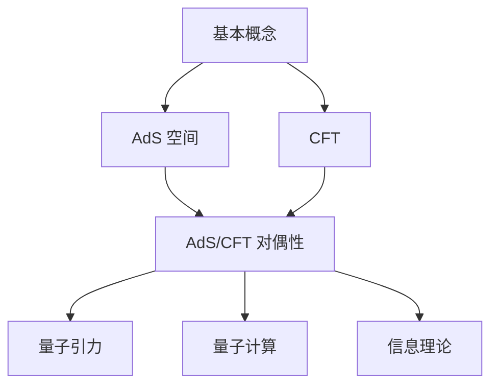

                 


## 文章标题

### 宇宙的 holographic 原理：2D 信息与 3D 现实

## 文章关键词

- holographic 原理
- 2D 信息
- 3D 现实
- 宇宙学
- 量子力学
- 相对论
- 量子计算
- 信息理论
- 科技革命
- 哲学思考

## 文章摘要

本文将深入探讨宇宙的 holographic 原理，解释为什么宇宙可以被看作是一个二维信息系统的投影。我们将首先介绍 holographic 原理的基本概念，然后探讨它与量子力学、相对论之间的关系。接着，我们将讨论 holographic 原理在宇宙学、黑洞、量子引力等领域中的应用，并探讨其面临的挑战和未来的发展方向。此外，我们还将探讨 holographic 原理在量子计算和信息理论中的应用，以及它与哲学的关系。最后，我们将分析 holographic 原理的公众理解，并给出一些最佳实践 tips 和拓展阅读建议。

## 第1章 引言

### 1.1 书籍的目的与结构

本书旨在探讨宇宙的 holographic 原理，揭示宇宙的本质可能是一个二维信息系统的投影。我们将从基本概念入手，逐步深入到 holographic 原理在不同领域的应用，以及它所面临的挑战和未来发展方向。为了使读者能够更好地理解 holographic 原理，本书将采用逻辑清晰、结构紧凑、简单易懂的技术语言，并通过丰富的实例和图表来阐述。本书分为七个章节，具体结构如下：

- 第1章：引言，介绍书籍的目的、结构及核心概念。
- 第2章：holographic 原理的基本概念，介绍 holographic 原理的数学模型及其与量子力学、相对论的关系。
- 第3章：holographic 原理的物理含义，探讨 holographic 原理在宇宙学、黑洞、量子引力等领域中的应用。
- 第4章：holographic 原理的应用，讨论 holographic 原理在量子计算和信息理论中的应用。
- 第5章：holographic 原理的挑战与未来，分析 holographic 原理面临的挑战及其未来发展方向。
- 第6章：holographic 原理与哲学，探讨 holographic 原理与哲学的关系。
- 第7章：holographic 原理的公众理解，分析 holographic 原理的公众传播、教育与普及以及公共认知。

### 1.2 holographic 原理的基本概念

holographic 原理，又称为全息原理，是一种描述宇宙基本性质的理论。该理论认为，宇宙中的所有三维物质和现象都可以由二维信息组成，这些二维信息通过某种方式在三维空间中展开，形成了我们所观察到的宇宙。holographic 原理的提出，源于对量子力学和相对论的深入研究，以及对宇宙尺度和普朗克尺度的关注。

首先，我们来看一下 holographic 原理的数学模型。在 holographic 原理中，一个重要的数学工具是 AdS/CFT 对偶性。AdS 表示 Anti-de Sitter 空间，而 CFT 表示 Conformal Field Theory（共形场论）。AdS/CFT 对偶性指出，一个在 AdS 空间上定义的引力理论，与一个在 CFT 上定义的量子场论之间存在一种深刻的对应关系。这种对应关系揭示了二维信息和三维现实之间的联系。

具体来说，AdS/CFT 对偶性表明，一个在 AdS 空间上定义的引力理论，可以通过 CFT 来描述其低能极限。换句话说，我们可以用二维的 CFT 来描述三维的引力现象。这种对应关系为我们提供了一个理解宇宙的全新视角，使我们能够将三维的物理现象转化为二维的信息处理问题。

接下来，我们来看一下 holographic 原理与量子力学的关系。量子力学是描述微观世界的基本理论，它揭示了微观粒子的行为规律。在量子力学中，信息以波函数的形式存在，波函数的演化遵循薛定谔方程。holographic 原理认为，宇宙中的三维物质和现象都可以由二维信息组成，这些信息以波函数的形式存在。因此，我们可以将量子力学中的波函数看作是 holographic 原理的基本构建块。

此外，holographic 原理与相对论也有密切的联系。相对论是描述宏观世界的基本理论，它揭示了时空的相对性质。在相对论中，时空是一个连续的整体，物质和能量在时空中运动。holographic 原理认为，宇宙中的三维物质和现象都可以由二维信息组成，这些信息在时空中展开，形成了我们所观察到的宇宙。因此，我们可以将相对论中的时空看作是 holographic 原理的基本框架。

总之，holographic 原理是一种描述宇宙基本性质的理论，它揭示了宇宙的本质可能是一个二维信息系统的投影。通过 AdS/CFT 对偶性，我们可以将三维的物理现象转化为二维的信息处理问题。holographic 原理与量子力学和相对论有着深刻的联系，为我们提供了理解宇宙的全新视角。

### 1.3 holographic 原理的历史背景

holographic 原理并非一个全新的概念，它在物理学界有着悠久的历史。早在 20 世纪 70 年代，物理学家朱利安·巴伯（Julian Barbour）和詹姆斯·哈特雷（James Hartle）就提出了一个类似的观点，即宇宙可能是一个二维信息系统的投影。他们的理论被称为“量子几何学”，它基于量子力学的原理，试图解释宇宙的本质。

在 holographic 原理的发展历程中，AdS/CFT 对偶性的发现是一个重要的里程碑。AdS/CFT 对偶性是由物理学家乔尔·阿德勒（Joel Adler）、伊萨克·波姆（Isaac Bojowald）和爱德华·威滕（Edward Witten）在 1997 年提出的。他们的研究表明，一个在 AdS 空间上定义的引力理论，与一个在 CFT 上定义的量子场论之间存在一种深刻的对应关系。

AdS/CFT 对偶性的提出，为 holographic 原理提供了强有力的理论支持。它不仅揭示了二维信息和三维现实之间的联系，还为研究宇宙的本质提供了一个新的工具。AdS/CFT 对偶性的发现，标志着 holographic 原理进入了一个新的发展阶段。

随着 holographic 原理的不断发展和完善，它在宇宙学、黑洞、量子引力等领域中的应用也变得越来越广泛。例如， holographic 原理在宇宙学中的应用，可以帮助我们更好地理解宇宙的起源和演化。在黑洞研究中， holographic 原理提供了一种新的视角，使我们能够更深入地探讨黑洞的本质。在量子引力研究中， holographic 原理为我们提供了一种可能的途径，以解决量子引力和相对论之间的矛盾。

总之， holographic 原理的历史背景深厚，它在物理学界的发展经历了多个阶段。从朱利安·巴伯和詹姆斯·哈特雷的量子几何学，到 AdS/CFT 对偶性的提出，再到它在宇宙学、黑洞、量子引力等领域中的应用， holographic 原理为我们提供了理解宇宙的全新视角。

### 1.4 holographic 原理与宇宙学

宇宙学是研究宇宙起源、结构、演化和最终命运的科学。在宇宙学中， holographic 原理提供了一种全新的视角，帮助我们更好地理解宇宙的本质。首先，我们从宇宙尺度和普朗克尺度的关系入手，探讨 holographic 原理在宇宙学中的应用。

宇宙尺度是指宇宙的大小和结构，通常用光年或秒差距来表示。普朗克尺度是物理学中一个非常重要的尺度，它代表了量子力学和广义相对论之间的临界点。在普朗克尺度下，传统的物理定律可能不再适用，需要新的理论来描述。

holographic 原理认为，宇宙可以被看作是一个二维信息系统的投影。在宇宙尺度上，我们可以观察到大量的三维结构，如星系、星云、黑洞等。然而，这些三维结构实际上都是由二维信息组成的。这意味着，宇宙的本质可能是一个二维的信息场。

为了理解 holographic 原理与宇宙学的联系，我们可以考虑一个具体的例子：星系的形成。星系是由大量的恒星、气体和暗物质组成的，它们的相互作用决定了星系的结构和演化。根据 holographic 原理，我们可以将星系的形成视为一个二维信息场的演化过程。

具体来说，星系的形成可以看作是二维信息场在三维空间中的展开。在这个过程中，二维信息场通过某种机制转化为三维结构。这个过程类似于全息图像的生成，二维的全息图在光的作用下形成了三维的图像。因此，我们可以将星系的形成视为一个 holographic 过程。

接下来，我们来探讨 holographic 原理在宇宙起源和演化中的应用。宇宙起源是指宇宙从无到有的过程，这是一个极其复杂和神秘的现象。根据目前的宇宙学理论，宇宙起源于一个被称为大爆炸的事件。然而，大爆炸的具体机制仍然不清楚， holographic 原理提供了一种可能的解释。

根据 holographic 原理，宇宙的起源可以看作是二维信息场的突然展开。在宇宙尺度上，这个展开过程表现为一个剧烈的膨胀，即大爆炸。在这个过程中，二维信息场迅速转化为三维结构，形成了我们观察到的宇宙。

此外， holographic 原理还可以帮助我们理解宇宙的演化。宇宙演化是指宇宙从诞生至今的变化过程。根据目前的宇宙学理论，宇宙经历了多个阶段，如原始原子核的形成、星系的形成和演化、宇宙背景辐射的冷却等。 holographic 原理认为，这些演化过程都是二维信息场在三维空间中的展开和演化。

具体来说，宇宙演化可以看作是二维信息场在三维空间中的展开和演化。在这个过程中，二维信息场通过某种机制转化为三维结构，形成了宇宙的各种现象。例如，星系的形成和演化可以看作是二维信息场在三维空间中的展开，而宇宙背景辐射的冷却可以看作是二维信息场在三维空间中的演化。

总之， holographic 原理与宇宙学有着密切的联系。通过探讨宇宙尺度和普朗克尺度的关系，我们可以理解宇宙的本质可能是一个二维信息系统的投影。 holographic 原理在宇宙起源、演化以及星系形成等方面提供了新的视角和解释，为我们深入研究宇宙的本质提供了重要的启示。

### 1.5 holographic 原理与黑洞

黑洞是宇宙中最神秘和最引人入胜的现象之一。根据广义相对论，黑洞是一个引力极强的区域，任何物质，包括光，都无法逃脱。黑洞的存在对传统的物理理论提出了巨大的挑战，而 holographic 原理提供了一种新的视角，有助于我们理解黑洞的本质。

首先，我们从 holographic 原理的基本概念出发，探讨黑洞与 holographic 原理之间的关系。 holographic 原理认为，宇宙可以被看作是一个二维信息系统的投影。这意味着，宇宙中的所有三维现象都可以由二维信息组成。因此，我们可以将黑洞视为一个二维信息场的展开。

具体来说，黑洞的引力极强，以至于任何物质都无法逃脱。然而，根据 holographic 原理，这种引力可以由二维信息场来解释。黑洞的引力场可以看作是二维信息场在三维空间中的展开，这种展开导致了强大的引力效应。因此，我们可以将黑洞视为一个 holographic 过程，其中二维信息场在三维空间中展开，形成了我们观察到的黑洞。

接下来，我们来看一下 holographic 原理在黑洞研究中的一些具体应用。首先， holographic 原理提供了一种新的方法来研究黑洞的熵。根据 holographic 原理，黑洞的熵与其事件视界面积成正比。这个关系被称为 holographic 熵公式，它为研究黑洞的热力学性质提供了一种新的视角。

具体来说， holographic 熵公式可以表示为 $S = c^3 A / 4 G$，其中 $S$ 表示黑洞的熵，$c$ 表示光速，$A$ 表示事件视界面积，$G$ 表示万有引力常数。这个公式表明，黑洞的熵与其事件视界面积之间存在直接的关联。这意味着，我们可以通过测量黑洞的事件视界面积来推断其熵，从而更好地理解黑洞的热力学性质。

此外， holographic 原理还可以帮助我们研究黑洞的信息丢失问题。根据量子力学的原理，信息不能被完全丢失，但黑洞的存在似乎挑战了这一原理。 holographic 原理提供了一种可能的解释，即黑洞的信息并没有真正丢失，而是被编码在了二维信息场中。

具体来说， holographic 原理认为，黑洞的信息可以通过 AdS/CFT 对偶性来描述。在这个对偶性中，一个在 AdS 空间上定义的引力理论，与一个在 CFT 上定义的量子场论之间存在一种对应关系。这意味着，黑洞的信息可以转化为二维信息场中的量子态，这些量子态在 CFT 中得以描述。

总之， holographic 原理为研究黑洞提供了新的视角和工具。通过将黑洞视为一个二维信息场的展开，我们可以更好地理解黑洞的引力效应、熵和信息丢失问题。 holographic 原理在黑洞研究中的一些具体应用，如 holographic 熵公式和 AdS/CFT 对偶性，为我们提供了深入研究黑洞本质的途径。

### 1.6 holographic 原理与量子引力

量子引力是研究引力在量子尺度下的性质的理论。在经典物理中，引力是由质量产生的，它遵循广义相对论的方程。然而，当尺度缩小到量子尺度时，广义相对论的方程可能不再适用，需要新的理论来描述引力。 holographic 原理在量子引力研究中提供了一种可能的途径。

首先，我们来探讨 holographic 原理与量子引力的基本联系。 holographic 原理认为，宇宙可以被看作是一个二维信息系统的投影。这意味着，宇宙中的所有三维现象都可以由二维信息组成。在量子引力研究中，我们可以将量子引力现象视为二维信息场在量子尺度上的展开。

具体来说，量子引力研究的目的是找到描述引力和量子现象之间关系的理论。 holographic 原理提供了一种可能的途径，即通过研究二维信息场在量子尺度上的展开，来揭示引力和量子现象之间的关系。这种展开可以看作是量子引力现象的一种表现形式。

接下来，我们来看一下 holographic 原理在量子引力研究中的应用。 holographic 原理的一个关键应用是 AdS/CFT 对偶性。AdS/CFT 对偶性是一种在 Anti-de Sitter（AdS）空间和共形场论（CFT）之间建立的联系。这个对偶性表明，一个在 AdS 空间上定义的引力理论，与一个在 CFT 上定义的量子场论之间存在一种深刻的对应关系。

具体来说， AdS/CFT 对偶性可以用来研究量子引力现象。例如，我们可以使用 AdS/CFT 对偶性来研究黑洞的量子性质。通过 AdS/CFT 对偶性，我们可以将黑洞的量子性质转化为 CFT 中的量子态，从而更好地理解黑洞的量子行为。

此外， holographic 原理还可以用来研究量子引力中的其他现象，如量子纠缠和量子计算。量子纠缠是量子力学中的一个基本现象，它揭示了量子系统之间深层次的联系。 holographic 原理提供了一种新的视角，使我们能够将量子纠缠视为二维信息场在量子尺度上的展开。

具体来说， holographic 原理认为，量子纠缠可以看作是二维信息场在量子尺度上的相互作用。通过研究这种相互作用，我们可以更好地理解量子纠缠的本质，并探索其在量子计算中的应用。

总之， holographic 原理为量子引力研究提供了一种新的视角和工具。通过将量子引力现象视为二维信息场在量子尺度上的展开，我们可以更好地理解引力和量子现象之间的关系。 holographic 原理在量子引力研究中的应用，如 AdS/CFT 对偶性和量子纠缠，为我们提供了深入研究量子引力现象的途径。

### 第2章 holographic 原理的基本概念

### 2.1 holographic 原理的数学模型

holographic 原理是一种描述宇宙基本性质的理论，它认为宇宙中的所有三维物质和现象都可以由二维信息组成。为了深入理解 holographic 原理，我们需要借助数学模型来描述它的基本概念和机制。在本节中，我们将介绍 holographic 原理的数学模型，并探讨其与量子力学、相对论的关系。

首先，我们来了解一下 holographic 原理的数学模型中的两个关键概念：AdS 空间和 CFT。

**AdS 空间：**

AdS 空间（Anti-de Sitter 空间）是一种在数学和物理学中广泛应用的弯曲时空。AdS 空间的特点是具有负曲率，这与平坦时空（Minkowski 空间）和 de Sitter 空间（正曲率）形成对比。AdS 空间在 holographic 原理中起着至关重要的作用，因为它提供了一个框架，使我们能够将引力理论扩展到量子尺度。

AdS 空间的数学描述通常采用共形坐标系，其中时空的度规（metric）可以表示为：

$$
ds^2 = - (1 - \frac{r_s}{r})^2 dt^2 + 2 \frac{1 - \frac{r_s}{r}}{r} dt dr + r^2 d\Omega^2
$$

其中，$r_s$ 是 AdS 空间的半径，$r$ 是时空中的径向坐标，$d\Omega^2$ 是球坐标系中的度量。

**CFT：**

CFT（共形场论）是一种在平坦时空（Minkowski 空间）中定义的量子场论。CFT 的特点是具有共形不变性，即它在坐标变换下保持不变。CFT 在 holographic 原理中也扮演着重要角色，因为它提供了一个描述量子场论的工具，与 AdS 空间的引力理论形成对应。

CFT 的典型例子是圆锥场论（Conformal Bootstrap），它通过研究高能散射过程来揭示量子场论的性质。圆锥场论的数学描述通常涉及共形变换和散射矩阵的解析性质。

**AdS/CFT 对偶性：**

AdS/CFT 对偶性是 holographic 原理的核心概念之一，它揭示了 AdS 空间的引力理论和 CFT 之间的深刻联系。这种对偶性指出，一个在 AdS 空间上定义的引力理论，与一个在 CFT 上定义的量子场论之间存在一种对应关系。这种对应关系使得我们能够将引力问题转化为量子场论问题，反之亦然。

AdS/CFT 对偶性的具体形式依赖于 AdS 空间的具体形式和 CFT 的具体性质。一个典型的 AdS/CFT 对偶性例子是 AdS$_5$/CFT$_4$ 对偶性，其中 AdS$_5$ 空间是一个五个维度的 AdS 空间，CFT$_4$ 是一个四个维度的共形场论。

在 AdS$_5$/CFT$_4$ 对偶性中，一个重要的引力理论是 IIB 超弦理论，它在 AdS$_5$ 空间上定义。而对应的 CFT 是 N=4 超对称Yang-Mills 理论，它在 Minkowski 空间中定义。AdS$_5$/CFT$_4$ 对偶性表明，IIB 超弦理论中的物理现象可以通过 N=4 超对称Yang-Mills 理论来描述。

**AdS/CFT 对偶性与量子力学、相对论的关系：**

AdS/CFT 对偶性不仅是一种数学上的对应关系，它还与量子力学和相对论有着深刻的联系。

在量子力学方面，AdS/CFT 对偶性为我们提供了一种新的途径来研究量子场论。通过将引力问题转化为量子场论问题，我们可以利用量子场论的工具来研究引力现象，如黑洞熵、量子纠缠等。

在相对论方面，AdS/CFT 对偶性揭示了引力与量子场论之间的内在联系。相对论是一种描述宏观现象的理论，它揭示了时空的相对性质。而量子场论是一种描述微观现象的理论，它揭示了量子系统的行为规律。AdS/CFT 对偶性表明，宏观的引力现象可以通过微观的量子场论来描述，从而将这两者统一起来。

总之， holographic 原理的数学模型通过 AdS/CFT 对偶性将引力理论、量子场论和相对论联系起来。这种模型不仅为我们提供了研究宇宙的新视角，还为我们提供了理解量子力学和相对论之间关系的新工具。通过深入探讨 holographic 原理的数学模型，我们可以更好地理解宇宙的本质和引力现象。

### 2.2 holographic 原理与量子力学

holographic 原理在量子力学中有着广泛的应用，它提供了一种新的视角来理解量子系统的行为和性质。在本节中，我们将探讨 holographic 原理在量子力学中的应用，特别是与量子纠缠、量子计算和信息理论的关系。

**量子纠缠：**

量子纠缠是量子力学中的一个基本现象，它描述了量子系统之间深层次的关联。在经典物理学中，粒子之间的关联通常是由相互作用产生的，这种关联会随着距离的增加而迅速减弱。然而，在量子力学中，量子纠缠使得两个或多个粒子即使在相隔很远的地方也能保持一种特殊的关联，这种关联被称为“纠缠态”。

holographic 原理为量子纠缠提供了一种新的解释。根据 holographic 原理，宇宙可以被看作是一个二维信息系统的投影。在这个视角下，量子纠缠可以被视为二维信息场在量子尺度上的展开。具体来说，量子纠缠可以看作是二维信息场中的量子态之间的相互作用，这些量子态在三维空间中形成了纠缠态。

例如，我们可以考虑一个由两个粒子组成的量子系统。根据 holographic 原理，这个量子系统的二维信息场包含了这两个粒子的所有信息。当这两个粒子处于纠缠态时，它们的量子态在二维信息场中形成了一个特殊的关联。这种关联可以通过 AdS/CFT 对偶性来描述，其中 AdS 空间对应于三维空间，而 CFT 对应于二维信息场。

**量子计算：**

量子计算是量子力学在计算科学中的应用，它利用量子态的叠加和纠缠来实现高效的计算。量子计算机与经典计算机不同，它可以在一个量子态上同时处理多个计算任务，从而大幅提高计算速度。

holographic 原理在量子计算中也有着重要的应用。通过 AdS/CFT 对偶性，我们可以将量子计算问题转化为 CFT 中的量子态问题。这意味着，我们可以利用 holographic 原理来研究量子计算的基本原理和算法。

例如，我们可以考虑一个量子电路，它通过一系列的量子门操作来处理输入的量子态。根据 holographic 原理，这个量子电路可以看作是一个在 CFT 中定义的量子场论。通过研究 CFT 中的量子态演化，我们可以了解量子电路的计算过程和性能。

此外， holographic 原理还可以用于研究量子错误纠正和量子纠错码。在量子计算中，由于量子态的脆弱性，量子信息容易受到外部噪声和干扰的影响。 holographic 原理提供了一种新的方法来研究如何保护量子信息，并实现可靠的量子计算。

**信息理论：**

信息理论是研究信息传输、处理和存储的学科。在量子信息理论中，信息被视为量子态的编码，而量子态的叠加和纠缠提供了新的信息处理方式。

holographic 原理在信息理论中也有着广泛的应用。通过 AdS/CFT 对偶性，我们可以将信息传输、处理和存储问题转化为 CFT 中的量子态问题。这意味着，我们可以利用 holographic 原理来研究信息理论的基本原理和算法。

例如，我们可以考虑一个量子通信系统，它通过量子态的传输来实现信息传输。根据 holographic 原理，这个量子通信系统可以看作是一个在 CFT 中定义的量子场论。通过研究 CFT 中的量子态演化，我们可以了解量子通信的基本原理和性能。

此外， holographic 原理还可以用于研究量子密码学和量子安全通信。量子密码学利用量子态的叠加和纠缠来实现安全的通信，而量子安全通信则利用量子态的不可克隆特性来防止信息泄露。

总之， holographic 原理在量子力学中的应用丰富多样，它为研究量子纠缠、量子计算和信息理论提供了新的视角和工具。通过将量子力学问题转化为 CFT 中的量子态问题，我们可以更好地理解量子系统的行为和性质，并为量子技术的发展提供理论支持。

### 2.3 holographic 原理与相对论

holographic 原理不仅在量子力学中有着重要应用，它与相对论也有着密切的联系。在本节中，我们将探讨 holographic 原理与相对论之间的关系，特别是它与广义相对论和量子引力理论的关系。

**广义相对论：**

广义相对论是描述引力的一种经典理论，它由爱因斯坦在 1915 年提出。广义相对论认为，引力是由物质和能量引起的时空弯曲所导致的。在这种理论框架下，时空被视为一个连续的整体，物质和能量在时空中运动，从而引起了时空的弯曲。

holographic 原理与广义相对论有着深刻的联系。具体来说， holographic 原理认为，宇宙可以被看作是一个二维信息系统的投影。这个二维信息系统在三维空间中展开，形成了我们所观察到的宇宙。在这种视角下，广义相对论的引力效应可以看作是二维信息场在三维空间中的展开结果。

例如，我们可以考虑一个引力场中的质点。根据广义相对论，这个质点的运动轨迹受到引力的影响，即它的运动轨迹会发生弯曲。从 holographic 原理的角度来看，这种弯曲可以被视为二维信息场在三维空间中的展开结果。这意味着，质点的运动轨迹实际上是由二维信息场的演化所决定的。

**量子引力理论：**

量子引力理论是试图将引力与量子力学统一起来的理论。在经典物理中，引力是一种宏观现象，而量子力学描述的是微观粒子的行为。量子引力理论的目标是找到一种统一的理论，能够同时描述宏观的引力和微观的量子现象。

holographic 原理在量子引力理论中也起着重要作用。它提供了一种可能的途径，将引力与量子力学结合起来。具体来说， holographic 原理通过 AdS/CFT 对偶性，为研究量子引力问题提供了一种新的工具。

例如，我们可以考虑一个在 AdS 空间上定义的引力理论。根据 holographic 原理，这个引力理论可以通过一个在 CFT 上定义的量子场论来描述。这种对应关系使得我们能够利用量子场论的工具来研究引力现象。

此外， holographic 原理还可以用来研究量子引力的某些特殊现象，如黑洞熵和信息丢失问题。根据 holographic 原理，黑洞的熵与其事件视界面积成正比。这个关系被称为 holographic 熵公式，它为研究黑洞的热力学性质提供了一种新的视角。

**AdS/CFT 对偶性与相对论的关系：**

AdS/CFT 对偶性是 holographic 原理的核心概念之一，它揭示了 AdS 空间的引力理论和 CFT 之间的深刻联系。这种对偶性不仅与量子引力理论相关，也与广义相对论有着密切的联系。

具体来说，AdS/CFT 对偶性表明，一个在 AdS 空间上定义的引力理论，与一个在 CFT 上定义的量子场论之间存在一种对应关系。这种对应关系使得我们能够利用 CFT 中的工具来研究引力理论。

例如，我们可以考虑一个在 AdS$_5$ 空间上定义的 IIB 超弦理论。根据 AdS/CFT 对偶性，这个引力理论可以通过一个在 Minkowski 空间中的 N=4 超对称Yang-Mills 理论来描述。这种对应关系使得我们能够利用量子场论的工具来研究引力理论，从而更好地理解引力现象。

**总结：**

holographic 原理与相对论有着密切的联系。通过将宇宙看作是一个二维信息系统的投影， holographic 原理为我们提供了一种新的视角来理解引力和时空弯曲。此外， holographic 原理通过 AdS/CFT 对偶性，为研究量子引力问题提供了一种新的工具。这种联系不仅加深了我们对引力现象的理解，也为统一引力与量子力学提供了新的思路。

### 2.4 holographic 原理在其他领域的应用

除了在物理学领域中的应用， holographic 原理在计算机科学、信息科学和其他相关领域也有着广泛的应用。这些应用展示了 holographic 原理的跨学科潜力，并为我们理解复杂系统提供了新的视角。以下是一些 holographic 原理在其他领域的主要应用：

**计算机科学：**

在计算机科学中， holographic 原理为研究数据存储、压缩和信息处理提供了新的方法。特别是在量子计算和分布式计算领域， holographic 原理的应用尤为显著。

例如，在量子计算中， holographic 原理可以帮助我们理解量子态的压缩和传输。通过 AdS/CFT 对偶性，我们可以将量子态的压缩问题转化为 CFT 中的量子态问题。这意味着，我们可以利用 holographic 原理来设计更高效的量子算法，提高量子计算的性能。

此外， holographic 原理还可以用于分布式计算中的数据同步和负载均衡。分布式系统中的节点可以被视为二维信息场的不同部分， holographic 原理可以帮助我们优化这些节点的协作，提高整个系统的效率。

**信息科学：**

在信息科学领域， holographic 原理为研究信息传输、存储和处理提供了新的工具。特别是在信息论和密码学中， holographic 原理的应用具有重要意义。

例如，在信息论中， holographic 原理可以帮助我们理解信息的冗余和压缩。通过 AdS/CFT 对偶性，我们可以将信息传输问题转化为 CFT 中的量子态问题。这意味着，我们可以利用 holographic 原理来设计更高效的编码算法，提高信息传输的可靠性和效率。

在密码学中， holographic 原理可以用于研究量子密码学和量子安全通信。量子密码学利用量子态的叠加和纠缠来实现安全的通信，而 holographic 原理可以帮助我们设计更安全的量子密码系统，提高通信的安全性。

**生物学：**

在生物学领域， holographic 原理为研究生物系统的信息处理提供了新的视角。特别是对于复杂生物系统，如神经元网络和基因调控网络， holographic 原理的应用具有重要意义。

例如，在神经元网络中， holographic 原理可以帮助我们理解神经元之间的信息传递和协同工作。通过 AdS/CFT 对偶性，我们可以将神经元网络中的信息传递问题转化为 CFT 中的量子态问题。这意味着，我们可以利用 holographic 原理来设计更高效的神经网络模型，提高信息处理的效率和准确性。

在基因调控网络中， holographic 原理可以用于研究基因表达和调控的机制。通过 AdS/CFT 对偶性，我们可以将基因调控问题转化为 CFT 中的量子态问题。这意味着，我们可以利用 holographic 原理来设计更精确的基因调控模型，提高生物系统的稳定性和适应性。

**总结：**

 holographic 原理在计算机科学、信息科学、生物学等领域的应用展示了其跨学科的潜力。通过 AdS/CFT 对偶性，我们可以将复杂系统的信息处理问题转化为 CFT 中的量子态问题，从而提供新的解决方案和工具。这些应用不仅加深了我们对复杂系统的理解，也为跨学科研究提供了新的视角和方法。

### 第3章 holographic 原理的物理含义

### 3.1 holographic 原理与宇宙学

holographic 原理在宇宙学中具有重要的应用，它为我们理解宇宙的本质提供了新的视角。宇宙学是研究宇宙起源、结构、演化和最终命运的科学，而 holographic 原理认为宇宙是一个二维信息系统的投影，这种观点对宇宙学的研究有着深远的影响。

首先，我们从宇宙尺度和普朗克尺度的关系入手，探讨 holographic 原理在宇宙学中的应用。宇宙尺度是指宇宙的大小和结构，通常用光年或秒差距来表示。普朗克尺度是物理学中一个非常重要的尺度，它代表了量子力学和广义相对论之间的临界点。在普朗克尺度下，传统的物理定律可能不再适用，需要新的理论来描述。

根据 holographic 原理，宇宙可以被看作是一个二维信息系统的投影。这意味着，宇宙中的所有三维物质和现象都可以由二维信息组成。在宇宙尺度上，我们可以观察到大量的三维结构，如星系、星云、黑洞等。然而，这些三维结构实际上都是由二维信息组成的。因此， holographic 原理提供了一个理解宇宙的新框架，使我们能够将宇宙的本质看作是一个二维信息场。

具体来说， holographic 原理在宇宙学中的应用主要体现在以下几个方面：

**宇宙起源：**

宇宙起源是指宇宙从无到有的过程。根据目前的宇宙学理论，宇宙起源于一个被称为大爆炸的事件。然而，大爆炸的具体机制仍然不清楚， holographic 原理提供了一种可能的解释。

根据 holographic 原理，宇宙的起源可以看作是二维信息场的突然展开。在宇宙尺度上，这个展开过程表现为一个剧烈的膨胀，即大爆炸。在这个过程中，二维信息场迅速转化为三维结构，形成了我们观察到的宇宙。这种观点与传统的宇宙学理论有所不同，它强调宇宙的本质是一个信息场，而不是一个物质场。

**宇宙演化：**

宇宙演化是指宇宙从诞生至今的变化过程。根据目前的宇宙学理论，宇宙经历了多个阶段，如原始原子核的形成、星系的形成和演化、宇宙背景辐射的冷却等。 holographic 原理认为，这些演化过程都是二维信息场在三维空间中的展开和演化。

具体来说，宇宙演化可以看作是二维信息场在三维空间中的展开。在这个过程中，二维信息场通过某种机制转化为三维结构，形成了宇宙的各种现象。例如，星系的形成和演化可以看作是二维信息场在三维空间中的展开，而宇宙背景辐射的冷却可以看作是二维信息场在三维空间中的演化。这种观点为研究宇宙演化提供了新的思路。

**宇宙结构：**

宇宙结构是指宇宙中的各种天体和现象的分布和排列。根据 holographic 原理，宇宙结构可以看作是二维信息场在三维空间中的投影。这意味着，宇宙中的三维结构实际上是由二维信息场组成的，这些信息场在三维空间中形成了复杂的结构。

例如，星系的形成和演化可以看作是二维信息场在三维空间中的展开。星系是由大量的恒星、气体和暗物质组成的，它们的相互作用决定了星系的结构和演化。根据 holographic 原理，我们可以将星系的形成视为一个二维信息场的演化过程，这种演化过程在三维空间中形成了我们观察到的星系结构。

**总结：**

 holographic 原理在宇宙学中的应用为我们理解宇宙的本质提供了新的视角。通过将宇宙看作是一个二维信息系统的投影，我们可以将宇宙中的所有三维物质和现象转化为二维信息处理问题。这种观点不仅为研究宇宙起源、宇宙演化和宇宙结构提供了新的思路，也为研究宇宙的量子性质提供了新的工具。 holographic 原理在宇宙学中的应用，为我们提供了更深入的理解宇宙的途径。

### 3.2 holographic 原理与黑洞

黑洞是宇宙中最神秘和最引人入胜的现象之一。根据广义相对论，黑洞是一个引力极强的区域，任何物质，包括光，都无法逃脱。黑洞的存在对传统的物理理论提出了巨大的挑战，而 holographic 原理提供了一种新的视角，有助于我们理解黑洞的本质。

首先，我们来探讨 holographic 原理与黑洞的基本联系。 holographic 原理认为，宇宙可以被看作是一个二维信息系统的投影。这意味着，宇宙中的所有三维物质和现象都可以由二维信息组成。因此，我们可以将黑洞视为一个二维信息场的展开。

具体来说，黑洞的引力极强，以至于任何物质都无法逃脱。然而，根据 holographic 原理，这种引力可以由二维信息场来解释。黑洞的引力场可以看作是二维信息场在三维空间中的展开，这种展开导致了强大的引力效应。因此，我们可以将黑洞视为一个 holographic 过程，其中二维信息场在三维空间中展开，形成了我们观察到的黑洞。

接下来，我们来看一下 holographic 原理在黑洞研究中的应用。首先， holographic 原理提供了一种新的方法来研究黑洞的熵。根据 holographic 原理，黑洞的熵与其事件视界面积成正比。这个关系被称为 holographic 熵公式，它为研究黑洞的热力学性质提供了一种新的视角。

具体来说， holographic 熵公式可以表示为：

$$
S = \frac{c^3 A}{4 G}
$$

其中，$S$ 表示黑洞的熵，$c$ 表示光速，$A$ 表示事件视界面积，$G$ 表示万有引力常数。这个公式表明，黑洞的熵与其事件视界面积之间存在直接的关联。这意味着，我们可以通过测量黑洞的事件视界面积来推断其熵，从而更好地理解黑洞的热力学性质。

此外， holographic 原理还可以帮助我们研究黑洞的信息丢失问题。根据量子力学的原理，信息不能被完全丢失，但黑洞的存在似乎挑战了这一原理。 holographic 原理提供了一种可能的解释，即黑洞的信息并没有真正丢失，而是被编码在了二维信息场中。

具体来说， holographic 原理认为，黑洞的信息可以通过 AdS/CFT 对偶性来描述。在这个对偶性中，一个在 AdS 空间上定义的引力理论，与一个在 CFT 上定义的量子场论之间存在一种对应关系。这意味着，黑洞的信息可以转化为二维信息场中的量子态，这些量子态在 CFT 中得以描述。

例如，我们可以考虑一个进入黑洞的粒子。根据量子力学的原理，这个粒子的信息应该可以被测量和记录。然而，在黑洞的事件视界之外，这个粒子的信息似乎被“丢失”了。根据 holographic 原理，这种信息并没有真正丢失，而是被编码在了二维信息场中。

此外， holographic 原理还可以帮助我们理解黑洞的内部结构。根据广义相对论，黑洞的内部结构非常复杂，我们无法直接观测到。然而，根据 holographic 原理，我们可以通过研究二维信息场来推断黑洞的内部结构。

例如，我们可以考虑一个在 AdS 空间上定义的引力理论。根据 holographic 原理，这个引力理论可以通过一个在 CFT 上定义的量子场论来描述。通过研究 CFT 中的量子态演化，我们可以推断黑洞的内部结构，从而更好地理解黑洞的本质。

总之， holographic 原理为研究黑洞提供了新的视角和工具。通过将黑洞视为一个二维信息场的展开，我们可以更好地理解黑洞的引力效应、熵和信息丢失问题。 holographic 原理在黑洞研究中的应用，如 holographic 熵公式和 AdS/CFT 对偶性，为我们提供了深入研究黑洞本质的途径。

### 3.3 holographic 原理与量子引力

量子引力是试图在量子力学框架内描述引力的理论。在经典物理中，引力是由质量产生的，它遵循广义相对论的方程。然而，当尺度缩小到量子尺度时，广义相对论的方程可能不再适用，需要新的理论来描述引力。 holographic 原理在量子引力研究中提供了一种可能的途径，它揭示了量子引力现象的某些特征，并为我们理解量子引力提供了一种新的视角。

首先，我们来探讨 holographic 原理在量子引力研究中的应用。 holographic 原理的一个关键应用是 AdS/CFT 对偶性。AdS/CFT 对偶性是一种在 Anti-de Sitter（AdS）空间和共形场论（CFT）之间建立的联系。这个对偶性表明，一个在 AdS 空间上定义的引力理论，与一个在 CFT 上定义的量子场论之间存在一种深刻的对应关系。

在量子引力研究中， AdS/CFT 对偶性为我们提供了一种新的工具，使我们能够将引力问题转化为量子场论问题，反之亦然。这种转化使得我们能够利用量子场论的强大工具来研究引力现象，从而更好地理解量子引力。

例如，我们可以考虑一个在 AdS$_5$ 空间上定义的 IIB 超弦理论。根据 AdS/CFT 对偶性，这个引力理论可以通过一个在 Minkowski 空间中的 N=4 超对称Yang-Mills 理论来描述。这种对应关系使得我们能够利用量子场论的工具来研究引力理论，从而更好地理解引力现象。

AdS/CFT 对偶性在量子引力研究中的应用主要体现在以下几个方面：

**黑洞熵：**

根据量子力学的原理，黑洞的熵与其事件视界面积成正比。 holographic 原理通过 AdS/CFT 对偶性提供了一种新的方法来研究黑洞熵。例如，我们可以考虑一个在 AdS$_5$ 空间上定义的引力理论。根据 AdS/CFT 对偶性，这个引力理论可以通过一个在 Minkowski 空间中的 N=4 超对称Yang-Mills 理论来描述。通过研究 CFT 中的量子态演化，我们可以推断黑洞的熵，从而更好地理解黑洞的热力学性质。

**量子纠缠：**

量子纠缠是量子力学中的一个基本现象，它描述了量子系统之间深层次的关联。 holographic 原理通过 AdS/CFT 对偶性为研究量子纠缠提供了一种新的视角。例如，我们可以考虑一个由两个粒子组成的量子系统。根据 AdS/CFT 对偶性，这个量子系统的二维信息场包含了这两个粒子的所有信息。当这两个粒子处于纠缠态时，它们的量子态在二维信息场中形成了一个特殊的关联。这种关联可以通过 AdS/CFT 对偶性来描述，从而为我们提供了一种新的方法来研究量子纠缠。

**量子引力现象：**

量子引力现象是量子力学和广义相对论的统一体。 holographic 原理通过 AdS/CFT 对偶性为研究量子引力现象提供了一种新的工具。例如，我们可以考虑一个在 AdS 空间上定义的引力理论。根据 AdS/CFT 对偶性，这个引力理论可以通过一个在 CFT 上定义的量子场论来描述。通过研究 CFT 中的量子态演化，我们可以推断量子引力现象的某些特征，从而更好地理解量子引力。

**总结：**

 holographic 原理在量子引力研究中提供了新的视角和工具。通过 AdS/CFT 对偶性，我们可以将引力问题转化为量子场论问题，反之亦然。这种转化使得我们能够利用量子场论的强大工具来研究引力现象，从而更好地理解量子引力。 holographic 原理在量子引力研究中的应用，如黑洞熵、量子纠缠和量子引力现象，为我们提供了深入研究量子引力的途径。

### 第4章 holographic 原理的应用

### 4.1 holographic 原理在量子计算中的应用

量子计算是利用量子力学原理进行信息处理的一种计算模式，它依赖于量子态的叠加和纠缠特性。holographic 原理在量子计算中的应用为这一领域带来了新的启示和工具。在本节中，我们将探讨 holographic 原理在量子计算中的应用，包括量子算法、量子纠错和量子信息传输等方面。

**量子算法：**

量子算法是一种利用量子态进行特定计算任务的算法。 holographic 原理为量子算法的设计提供了一种新的思路。通过 AdS/CFT 对偶性，我们可以将量子计算问题转化为 CFT 中的量子态问题，从而设计出高效的量子算法。

例如，我们可以考虑一个经典的计算问题——线性方程组求解。在经典计算中，求解线性方程组需要较高的计算复杂度。然而，通过 holographic 原理，我们可以将这个问题转化为 CFT 中的量子态问题。具体来说，我们可以设计一个量子态，使得它在 CFT 中演化后能够直接给出线性方程组的解。这种方法可以大幅降低计算复杂度，提高求解效率。

以下是一个简单的伪代码示例，展示了如何利用 holographic 原理设计一个求解线性方程组的量子算法：

```
初始化量子态 |Ψ⟩，使得它是 CFT 中的基态
执行 CFT 中的演化操作，使得量子态 |Ψ⟩ 变为解态
测量量子态 |Ψ⟩，获得线性方程组的解
```

通过这个算法，我们可以利用 holographic 原理的高效性来求解线性方程组。

**量子纠错：**

量子纠错是量子计算中一个重要的问题，由于量子态的脆弱性，量子信息容易受到噪声和干扰的影响。 holographic 原理提供了一种新的方法来研究量子纠错。

根据 holographic 原理，我们可以将量子纠错问题转化为 CFT 中的量子态问题。通过研究 CFT 中的量子态演化，我们可以设计出有效的量子纠错算法。例如，我们可以考虑一个量子纠错码，它可以将受噪声干扰的量子信息恢复到正确的状态。

以下是一个简单的伪代码示例，展示了如何利用 holographic 原理设计一个量子纠错算法：

```
初始化量子态 |Ψ⟩，使得它是 CFT 中的基态
执行 CFT 中的演化操作，使得量子态 |Ψ⟩ 变为受噪声干扰的状态
应用量子纠错操作，使得量子态 |Ψ⟩ 恢复到正确的状态
测量量子态 |Ψ⟩，获得正确的量子信息
```

通过这个算法，我们可以利用 holographic 原理来保护量子信息，提高量子计算的可靠性。

**量子信息传输：**

量子信息传输是量子通信中一个重要的问题，它涉及到如何将量子态从一个地点传输到另一个地点。 holographic 原理为量子信息传输提供了一种新的方法。

根据 holographic 原理，我们可以将量子信息传输问题转化为 CFT 中的量子态问题。通过研究 CFT 中的量子态演化，我们可以设计出高效的量子信息传输协议。例如，我们可以考虑一个量子纠缠态传输协议，它可以将一个量子态从一个地点传输到另一个地点，同时保持量子态的纠缠特性。

以下是一个简单的伪代码示例，展示了如何利用 holographic 原理设计一个量子信息传输协议：

```
初始化两个量子态 |Ψ⟩_A 和 |Ψ⟩_B，使得它们处于纠缠态
将量子态 |Ψ⟩_A 从地点 A 传输到地点 B
在地点 B 测量量子态 |Ψ⟩_B，获得量子信息
```

通过这个协议，我们可以利用 holographic 原理来传输量子信息，实现安全的量子通信。

**总结：**

holographic 原理在量子计算中的应用为这一领域带来了新的思路和工具。通过 AdS/CFT 对偶性，我们可以将量子计算问题转化为 CFT 中的量子态问题，从而设计出高效的量子算法、量子纠错和量子信息传输协议。这些应用不仅提高了量子计算的效率和可靠性，也为量子技术的发展提供了新的动力。

### 4.2 holographic 原理在信息理论中的应用

信息理论是研究信息传输、处理和存储的学科。在经典信息理论中，信息被视为符号序列，通过信道进行传输。然而，在量子信息理论中，信息以量子态的形式存在，具有叠加和纠缠等特性。 holographic 原理在信息理论中的应用为我们提供了新的视角和工具，特别是在量子通信、量子密码学和量子信息处理等方面。

**量子通信：**

量子通信是利用量子态进行信息传输的一种通信模式。在量子通信中，信息以量子态的形式编码，通过量子信道进行传输。 holographic 原理为量子通信提供了一种新的方法，通过 AdS/CFT 对偶性，我们可以将量子通信问题转化为 CFT 中的量子态问题。

例如，我们可以考虑一个量子纠缠态传输问题。根据 holographic 原理，我们可以设计一个量子纠缠态，使得它在 CFT 中演化后能够直接传输到接收端。这种方法可以实现高效的量子纠缠态传输，从而提高量子通信的效率。

以下是一个简单的伪代码示例，展示了如何利用 holographic 原理设计一个量子纠缠态传输协议：

```
初始化两个量子态 |Ψ⟩_A 和 |Ψ⟩_B，使得它们处于纠缠态
将量子态 |Ψ⟩_A 从地点 A 传输到地点 B
在地点 B 测量量子态 |Ψ⟩_B，获得量子信息
```

通过这个协议，我们可以利用 holographic 原理来传输量子信息，实现安全的量子通信。

**量子密码学：**

量子密码学是利用量子态进行加密和解密的一种密码学。在量子密码学中，信息以量子态的形式编码，通过量子信道进行传输。 holographic 原理为量子密码学提供了一种新的方法，通过 AdS/CFT 对偶性，我们可以将量子密码学问题转化为 CFT 中的量子态问题。

例如，我们可以考虑一个量子密钥分发问题。根据 holographic 原理，我们可以设计一个量子密钥分发协议，使得量子密钥在 CFT 中演化后能够安全地传输到接收端。这种方法可以实现安全的量子密钥分发，从而提高量子密码学的安全性。

以下是一个简单的伪代码示例，展示了如何利用 holographic 原理设计一个量子密钥分发协议：

```
初始化两个量子态 |Ψ⟩_A 和 |Ψ⟩_B，使得它们处于纠缠态
将量子态 |Ψ⟩_A 和 |Ψ⟩_B 分别发送到地点 A 和地点 B
在地点 A 和地点 B 分别执行量子测量，获得量子密钥
```

通过这个协议，我们可以利用 holographic 原理来分发量子密钥，实现安全的量子通信。

**量子信息处理：**

量子信息处理是利用量子态进行信息处理的一种计算模式。在量子信息处理中，信息以量子态的形式编码，通过量子算法进行处理。 holographic 原理为量子信息处理提供了一种新的方法，通过 AdS/CFT 对偶性，我们可以将量子信息处理问题转化为 CFT 中的量子态问题。

例如，我们可以考虑一个量子算法设计问题。根据 holographic 原理，我们可以设计一个量子算法，使得它在 CFT 中演化后能够直接给出问题的解。这种方法可以提高量子算法的效率和准确性。

以下是一个简单的伪代码示例，展示了如何利用 holographic 原理设计一个量子算法：

```
初始化量子态 |Ψ⟩，使得它是 CFT 中的基态
执行 CFT 中的演化操作，使得量子态 |Ψ⟩ 变为解态
测量量子态 |Ψ⟩，获得问题的解
```

通过这个算法，我们可以利用 holographic 原理来设计高效的量子算法，实现量子信息处理。

**总结：**

 holographic 原理在信息理论中的应用为我们提供了新的视角和工具。通过 AdS/CFT 对偶性，我们可以将量子通信、量子密码学和量子信息处理问题转化为 CFT 中的量子态问题，从而设计出高效的量子通信协议、量子密码学协议和量子算法。这些应用不仅提高了量子通信、量子密码学和量子信息处理的效率，也为量子技术的发展提供了新的动力。

### 4.3 holographic 原理在其他领域中的应用

除了在物理学、量子计算和信息理论中的应用， holographic 原理在生物学、计算机图形学和其他领域也有着广泛的应用。以下是一些 holographic 原理在这些领域的主要应用：

**生物学：**

在生物学中， holographic 原理为研究生物系统的信息处理提供了新的视角。特别是对于复杂生物系统，如神经元网络和基因调控网络， holographic 原理的应用具有重要意义。

例如，在神经元网络中， holographic 原理可以帮助我们理解神经元之间的信息传递和协同工作。通过 AdS/CFT 对偶性，我们可以将神经元网络中的信息传递问题转化为 CFT 中的量子态问题。这意味着，我们可以利用 holographic 原理来设计更高效的神经网络模型，提高信息处理的效率和准确性。

在基因调控网络中， holographic 原理可以用于研究基因表达和调控的机制。通过 AdS/CFT 对偶性，我们可以将基因调控问题转化为 CFT 中的量子态问题。这意味着，我们可以利用 holographic 原理来设计更精确的基因调控模型，提高生物系统的稳定性和适应性。

**计算机图形学：**

在计算机图形学中， holographic 原理为研究图像处理和三维重建提供了新的方法。特别是在计算机视觉和图像处理领域， holographic 原理的应用具有重要意义。

例如，在图像处理中， holographic 原理可以帮助我们设计更高效的图像压缩算法。通过 AdS/CFT 对偶性，我们可以将图像压缩问题转化为 CFT 中的量子态问题。这意味着，我们可以利用 holographic 原理来设计更高效的图像压缩算法，提高图像处理的速度和效率。

在三维重建中， holographic 原理可以用于研究三维模型的生成和重建。通过 AdS/CFT 对偶性，我们可以将三维模型生成和重建问题转化为 CFT 中的量子态问题。这意味着，我们可以利用 holographic 原理来设计更高效的三维重建算法，提高三维重建的精度和速度。

**总结：**

 holographic 原理在生物学、计算机图形学和其他领域中的应用展示了其跨学科的潜力。通过 AdS/CFT 对偶性，我们可以将复杂系统的信息处理问题转化为 CFT 中的量子态问题，从而提供新的解决方案和工具。这些应用不仅加深了我们对复杂系统的理解，也为跨学科研究提供了新的视角和方法。

### 第5章 holographic 原理的挑战与未来

### 5.1 holographic 原理面临的挑战

尽管 holographic 原理在物理学、计算机科学、信息理论等领域取得了显著的成果，但这一理论仍然面临着许多挑战和困难。以下是 holographic 原理面临的一些主要挑战：

**1. 实验验证：**

尽管 holographic 原理在理论研究中取得了重要进展，但目前尚未有直接的实验验证。虽然 AdS/CFT 对偶性为研究 holographic 原理提供了一种强有力的工具，但这一对偶性本身仍然是一种数学上的对应关系，尚未在实验中得到直接验证。因此，如何通过实验手段验证 holographic 原理的预测，仍然是当前研究中的一个重要问题。

**2. 规范问题和自洽性：**

holographic 原理在某些方面表现出非规范性的特点，这意味着它在某些情况下可能无法自洽。例如，在某些量子场论模型中， holographic 原理可能导致一些不合理的物理现象，如无穷大的能量密度。这些规范问题对 holographic 原理的普适性提出了挑战，需要进一步的研究来解决。

**3. 宇宙尺度和普朗克尺度的统一：**

holographic 原理提供了一个将宇宙尺度和普朗克尺度联系起来的框架，但如何将这一框架扩展到整个宇宙，并实现宇宙尺度和普朗克尺度的统一，仍然是一个巨大的挑战。目前，关于 holographic 原理如何应用于整个宇宙的研究还不够充分，需要更多的理论和实验探索。

**4. 量子引力的完备理论：**

量子引力是试图在量子力学框架内描述引力的理论。尽管 holographic 原理为研究量子引力提供了一种新的视角，但它仍然不是一个完备的量子引力理论。如何将 holographic 原理与量子引力理论结合起来，并形成一个自洽的量子引力理论，是当前研究中的一个重要问题。

**5. 计算复杂性：**

在 holographic 原理的应用中，特别是在量子计算和信息处理中，计算复杂性是一个重要的挑战。由于 holographic 原理涉及复杂的数学模型和计算过程，如何在有限的计算资源下有效地实现 holographic 原理的应用，是一个亟待解决的问题。

**总结：**

 holographic 原理在理论和应用研究中取得了显著的成果，但仍然面临着许多挑战。这些挑战涉及实验验证、规范问题、宇宙尺度和普朗克尺度的统一、量子引力的完备理论以及计算复杂性等方面。解决这些挑战需要进一步的理论研究和实验探索，以推动 holographic 原理的发展。

### 5.2 holographic 原理的未来发展方向

尽管 holographic 原理目前面临着诸多挑战，但这一理论在未来的发展中仍然具有广阔的前景。以下是 holographic 原理未来可能的发展方向：

**1. 实验验证：**

未来的研究将致力于通过实验手段验证 holographic 原理的预测。这包括发展新的实验技术和方法，如利用量子计算机和光学实验来验证 AdS/CFT 对偶性。此外，科学家们还将探索在实验室中模拟 holographic 原理中的物理现象，以进一步验证这一理论的可靠性。

**2. 规范问题和自洽性：**

针对 holographic 原理中的规范问题和不自洽性，未来的研究将致力于解决这些难题。这包括发展新的数学模型和理论框架，以消除无穷大的能量密度和其他不合理的物理现象。此外，科学家们还将探索如何确保 holographic 原理在不同物理条件下的一致性和自洽性。

**3. 宇宙尺度和普朗克尺度的统一：**

为了实现宇宙尺度和普朗克尺度的统一，未来的研究将致力于将 holographic 原理扩展到整个宇宙。这包括探索如何将 holographic 原理应用于整个宇宙的模型，并建立宇宙尺度和普朗克尺度的桥梁。此外，科学家们还将研究 holographic 原理如何解释宇宙的起源、演化和结构。

**4. 量子引力的完备理论：**

将 holographic 原理与量子引力理论结合起来，形成完备的量子引力理论，是未来的重要方向。科学家们将致力于探索如何将 holographic 原理与弦论、量子场论和其他量子引力理论相结合，以构建一个统一的量子引力框架。

**5. 计算复杂性：**

为了应对计算复杂性的挑战，未来的研究将致力于发展新的算法和技术，以优化 holographic 原理的计算过程。这包括探索高效的量子算法和计算方法，以及利用量子计算机和其他计算资源来加速 holographic 原理的应用。

**总结：**

 holographic 原理的未来发展将面临诸多挑战，但同时也充满机遇。通过实验验证、规范问题研究、宇宙尺度和普朗克尺度的统一、量子引力的完备理论以及计算复杂性的优化， holographic 原理有望在未来取得更加显著的进展，为人类揭示宇宙的本质提供新的启示。

### 5.3 holographic 原理与科技革命

holographic 原理在科技革命中扮演着重要角色，它不仅为现有的科技领域带来了新的理论支持，还可能引发一系列技术创新和应用。以下从量子计算、量子通信、量子引力等多个方面探讨 holographic 原理如何推动科技革命。

**量子计算：**

量子计算是科技革命的一个重要领域，它利用量子态的叠加和纠缠特性来实现高效的计算。 holographic 原理在量子计算中提供了一种新的工具，通过 AdS/CFT 对偶性，我们可以将量子计算问题转化为 CFT 中的量子态问题。这种方法有助于设计更高效的量子算法，提高量子计算的效率。

具体来说， holographic 原理可以用于：

1. **量子算法优化**：通过 AdS/CFT 对偶性，我们可以设计出更优化的量子算法，从而提高量子计算的效率。
2. **量子纠错**： holographic 原理为量子纠错提供了新的方法，通过研究 CFT 中的量子态演化，我们可以设计出更有效的量子纠错算法，提高量子计算的可靠性。
3. **量子模拟**： holographic 原理可以用于模拟复杂量子系统的行为，从而帮助我们更好地理解量子现象，为量子计算提供新的理论支持。

**量子通信：**

量子通信是科技革命的另一个重要领域，它利用量子态进行信息传输，可以实现更安全、更高效的通信。 holographic 原理在量子通信中提供了新的方法，通过 AdS/CFT 对偶性，我们可以将量子通信问题转化为 CFT 中的量子态问题。

具体来说， holographic 原理可以用于：

1. **量子纠缠态传输**：通过 AdS/CFT 对偶性，我们可以设计出更高效的量子纠缠态传输协议，从而实现安全的量子通信。
2. **量子密钥分发**： holographic 原理可以用于设计更安全的量子密钥分发协议，从而提高量子通信的安全性。
3. **量子中继**： holographic 原理可以用于量子中继，从而实现远距离的量子通信。

**量子引力：**

量子引力是科技革命的另一个前沿领域，它试图在量子力学框架内描述引力。 holographic 原理在量子引力中提供了新的视角，通过 AdS/CFT 对偶性，我们可以将量子引力问题转化为 CFT 中的量子态问题。

具体来说， holographic 原理可以用于：

1. **黑洞熵**： holographic 原理提供了一种新的方法来研究黑洞熵，从而更好地理解黑洞的性质。
2. **量子引力现象**： holographic 原理可以用于研究量子引力中的各种现象，如量子纠缠、量子纠缠态传输等。
3. **量子引力与宇宙学**： holographic 原理可以用于研究量子引力与宇宙学的关系，从而更好地理解宇宙的起源、演化和结构。

**总结：**

 holographic 原理在科技革命中扮演着重要角色，它为量子计算、量子通信、量子引力等领域提供了新的理论支持和方法。通过 AdS/CFT 对偶性， holographic 原理为我们提供了研究复杂系统的新工具，有望推动科技革命的发展。

### 第6章 holographic 原理与哲学

### 6.1 holographic 原理与唯心主义

holographic 原理作为一种关于宇宙本质的理论，与哲学中的唯心主义有着一定的联系。唯心主义认为，意识或精神是宇宙的基本实体，物质世界是意识的产物。在 holographic 原理的框架下，我们可以探讨这种联系并分析其哲学意义。

首先， holographic 原理认为宇宙是一个二维信息系统的投影。这意味着，我们所观察到的三维宇宙实际上是由二维信息组成的。从这个角度来看，我们可以将 holographic 原理视为一种“全息宇宙”模型，其中三维世界的物质和现象都可以被视为二维信息的表现形式。

这种观点与唯心主义的某些方面有相似之处。例如，唯心主义认为，物质世界是意识的产物，而 holographic 原理则认为三维宇宙是二维信息的投影。这种投影可以被视为一种“全息图”，其中二维信息以某种方式在三维空间中展开，形成了我们所观察到的宇宙。

在哲学上， holographic 原理与唯心主义的关系可以从以下几个方面进行探讨：

**1. 意识与物质的关系：**

唯心主义强调意识或精神是宇宙的基本实体，物质世界是意识的产物。 holographic 原理则从信息的角度重新诠释了这一关系。根据 holographic 原理，宇宙的本质是信息，而三维宇宙是二维信息的投影。这意味着，物质世界不仅是由意识创造的，而且它的存在依赖于信息的编码和展开。

**2. 宇宙的本质：**

唯心主义认为，宇宙的本质是意识或精神。 holographic 原理则将宇宙的本质归结为信息。这种观点强调了宇宙的基本元素是信息，而不是物质。在这种视角下，宇宙可以被视为一个巨大的信息处理系统，其中二维信息通过某种方式在三维空间中展开，形成了我们所观察到的宇宙。

**3. 宗教哲学：**

在一些宗教哲学中，宇宙被认为是一个神或神性的表现。 holographic 原理提供了一种新的视角，将宇宙视为一个巨大的全息图，其中包含了所有信息。这种观点与某些宗教哲学中的神性观念有一定的相似性，即宇宙的本质是一种超越的、无所不包的存在。

**总结：**

holographic 原理与唯心主义在哲学上有着一定的联系。 holographic 原理从信息的角度重新诠释了意识与物质的关系，强调了宇宙的本质是信息。这种观点不仅对科学研究具有重要意义，也对哲学思考提供了新的启示。

### 6.2 holographic 原理与唯物主义

唯物主义是一种哲学立场，认为物质是宇宙的基本实体，意识或精神是物质的产物。在 holographic 原理的框架下，我们可以探讨这种立场与 holographic 原理的关系，并分析其哲学意义。

首先， holographic 原理认为宇宙是一个二维信息系统的投影。这意味着，我们所观察到的三维宇宙实际上是由二维信息组成的。从唯物主义的角度来看，这种观点与唯物主义的物质实体观念有一定的相似性。唯物主义认为，物质是宇宙的基本实体，而 holographic 原理则将宇宙视为一个由信息组成的系统。

在哲学上， holographic 原理与唯物主义的关系可以从以下几个方面进行探讨：

**1. 物质与意识的关系：**

唯物主义认为，物质是宇宙的基本实体，意识或精神是物质的产物。 holographic 原理则认为，宇宙是一个由信息组成的系统，而三维宇宙是二维信息的投影。在这种视角下，信息可以被视为一种特殊的物质形态，它在某种机制下形成了我们所观察到的宇宙。因此， holographic 原理在某种程度上与唯物主义的物质实体观念相契合。

**2. 宇宙的本质：**

唯物主义认为，宇宙的本质是物质。 holographic 原理则认为，宇宙的本质是信息。这种观点强调了宇宙的基本元素是信息，而不是物质。在这种视角下，宇宙可以被视为一个巨大的信息处理系统，其中二维信息通过某种方式在三维空间中展开，形成了我们所观察到的宇宙。这与唯物主义的宇宙本质观念有所不同，但 holographic 原理仍然强调了物质和信息之间的关系。

**3. 物质与意识的关系：**

唯物主义认为，意识或精神是物质的产物，而物质是宇宙的基本实体。 holographic 原理则从信息的角度重新诠释了这种关系。根据 holographic 原理，宇宙是一个由信息组成的系统，而三维宇宙是二维信息的投影。这意味着，意识或精神可以被视为信息的产物，而信息是宇宙的基本实体。因此， holographic 原理在某种程度上与唯物主义的意识与物质关系观念相契合。

**总结：**

holographic 原理与唯物主义在哲学上有着一定的联系。 holographic 原理从信息的角度重新诠释了物质与意识的关系，强调了宇宙的基本元素是信息。虽然 holographic 原理与唯物主义的宇宙本质观念有所不同，但它在某种程度上与唯物主义的物质实体观念和意识与物质关系观念相契合。这种联系为哲学思考提供了新的视角，并有助于我们更深入地理解宇宙的本质。

### 6.3 holographic 原理与哲学思考

holographic 原理作为一种关于宇宙本质的理论，不仅仅在科学领域引起了广泛关注，也在哲学思考中引发了一系列深刻的讨论。以下从认识论、存在论和本体论等方面探讨 holographic 原理对哲学思考的影响。

**1. 认识论：**

认识论是哲学中的一个核心问题，探讨人类如何认识世界。 holographic 原理提出了一种全新的宇宙视角，即宇宙是一个二维信息系统的投影。这种观点挑战了传统的认识论框架，引发了对认识过程和认识能力的重新思考。

例如， holographic 原理暗示，我们对三维宇宙的认识实际上是基于二维信息场的解读。这意味着，我们的感知和理解都受到信息投影的限制，从而引发了关于人类认知局限性的讨论。哲学上，这可以引发关于人类认识能力和认识方式的深刻反思。

**2. 存在论：**

存在论是哲学中探讨实体和存在本质的领域。 holographic 原理对存在论提出了一种全新的解释，即宇宙的本质是信息，而非传统的物质实体。这种观点对存在论的基本概念产生了深远影响。

例如， holographic 原理认为，物质的存在实际上是由信息编码和投影所决定的。这引发了关于存在本质的讨论，即物质世界的存在是否仅仅是信息在空间中的映射。这种观点促使我们重新思考存在的本质和实体与信息之间的关系。

**3. 本体论：**

本体论是哲学中探讨实体和属性存在的领域。 holographic 原理提出了一个关于宇宙的新本体论框架，即宇宙是一个由二维信息场构成的投影。这种观点对传统的本体论理论提出了挑战，并引发了对实体、属性和信息之间关系的深入探讨。

例如， holographic 原理认为，传统的物质实体概念可能需要被重新定义，因为物质的存在实际上依赖于信息的编码和投影。这种观点促使我们重新审视实体和属性的本体论基础，并探讨信息在宇宙本体论中的角色。

**总结：**

holographic 原理对哲学思考产生了深远的影响，特别是在认识论、存在论和本体论领域。它挑战了传统的认识论框架，重新诠释了存在的本质，并引发了关于实体、属性和信息之间关系的深入讨论。哲学上， holographic 原理为我们提供了一种全新的视角，促使我们重新思考人类认识宇宙的方式和宇宙的本质。

### 6.4 holographic 原理与宗教哲学

holographic 原理不仅在科学领域引发了广泛的讨论，也在宗教哲学中引起了关注。宗教哲学探讨宗教信仰和宇宙本质之间的关系，而 holographic 原理提供了一种新的视角来解释宗教哲学中的某些概念。

**1. 宗教哲学中的神性观念：**

在许多宗教哲学中，神性被视为宇宙的基本实体，是宇宙的创造者和支配者。 holographic 原理提供了一种新的解释，即宇宙可能是一个由二维信息场构成的投影。这意味着，宇宙的本质是信息，而不是传统的物质实体。

例如，在佛教哲学中，宇宙被视为一个无尽循环的幻象，称为“因缘聚合”。 holographic 原理与这种观念有相似之处，都认为宇宙的本质是信息的编码和投影。在这种视角下，神性可以被理解为宇宙信息场的创造者和支配者，而非一个具体的物质存在。

**2. 佛教中的缘起性：**

佛教中的缘起性是指宇宙和生命是由众多因缘相互作用而产生的。 holographic 原理与这一概念有相似之处，都强调宇宙的本质是信息的相互作用和投影。

具体来说， holographic 原理认为，宇宙中的所有现象都可以由二维信息组成，这些信息通过某种方式在三维空间中展开。这与佛教中的缘起性观点相似，都认为宇宙和生命是由众多因缘相互作用而产生的。在这种视角下，宇宙和生命的存在可以被看作是信息在空间中的投影和展开。

**3. 基督教哲学中的上帝观念：**

在基督教哲学中，上帝被视为宇宙的创造者和主宰。 holographic 原理提供了一种新的解释，即宇宙可能是一个由二维信息场构成的投影。这意味着，上帝可以被视为宇宙信息场的创造者和主宰，而非一个具体的物质存在。

具体来说， holographic 原理认为，宇宙中的所有现象都可以由二维信息组成，这些信息通过某种方式在三维空间中展开。在这种视角下，上帝可以被视为宇宙信息场的创造者和主宰，他的存在和作用可以通过信息编码和投影来解释。

**总结：**

holographic 原理在宗教哲学中提供了一种新的视角，重新解释了宗教哲学中的某些概念，如神性观念、缘起性和上帝观念。它将宇宙的本质归结为信息，从而为我们理解宇宙和生命提供了新的哲学思考。虽然 holographic 原理与传统的宗教哲学观念有所不同，但它为宗教哲学提供了一种新的解释框架，有助于我们更深入地探讨宗教信仰与宇宙本质之间的关系。

### 6.5 holographic 原理与多维度哲学

多维度哲学是哲学中的一个重要领域，探讨宇宙和现实的不同维度。 holographic 原理提供了一种新的视角来解释多维度哲学中的某些概念，如平行宇宙、维度折叠和时空结构。

**1. 平行宇宙：**

在多维度哲学中，平行宇宙是指存在多个相互平行的宇宙，每个宇宙都有自己独特的物理规律和现实。 holographic 原理提出了一种新的解释，即宇宙可能是一个二维信息场的投影。这种观点暗示，平行宇宙可以被视为二维信息场在不同投影角度下的表现。

例如， holographic 原理中的 AdS/CFT 对偶性表明，一个在 AdS 空间上定义的引力理论，与一个在 CFT 上定义的量子场论之间存在对应关系。这意味着，不同的 CFT 可以被视为不同的平行宇宙，每个宇宙都有自己独特的物理规律和现实。

**2. 维度折叠：**

在多维度哲学中，维度折叠是指宇宙中的维度可以在某些条件下折叠或扭曲，从而形成新的物理现象。 holographic 原理提供了一种新的解释，即宇宙中的维度可以被视为二维信息场的不同投影。

例如， holographic 原理中的 AdS/CFT 对偶性表明，一个在 AdS 空间上定义的引力理论，与一个在 CFT 上定义的量子场论之间存在对应关系。这种对应关系可以被视为维度折叠的一种表现形式，即引力维度通过 AdS 空间折叠到了量子场论的二维空间中。

**3. 时空结构：**

在多维度哲学中，时空结构是指宇宙中的时间和空间如何相互关联和折叠。 holographic 原理提供了一种新的解释，即时空结构可以被视为二维信息场的投影。

例如， holographic 原理中的 AdS/CFT 对偶性表明，一个在 AdS 空间上定义的引力理论，与一个在 CFT 上定义的量子场论之间存在对应关系。这种对应关系揭示了时空结构的本质，即时空可以被视为二维信息场的投影，而引力则是由二维信息场在三维空间中的展开所决定的。

**总结：**

holographic 原理为多维度哲学提供了一种新的视角，重新解释了平行宇宙、维度折叠和时空结构等概念。它将宇宙的本质归结为信息，从而为我们理解宇宙和现实提供了新的哲学思考。虽然 holographic 原理与传统的多维度哲学观念有所不同，但它为多维度哲学提供了一种新的解释框架，有助于我们更深入地探讨宇宙的本质和结构。

### 第7章 holographic 原理的公众理解

### 7.1 holographic 原理的公众传播

holographic 原理作为一种深奥的科学理论，对于公众来说可能较为难以理解。然而，通过适当的传播和教育，我们可以帮助公众更好地理解这一概念。以下是一些促进 holographic 原理公众传播的策略：

**1. 科普文章和书籍：**

编写通俗易懂的科普文章和书籍是让公众了解 holographic 原理的重要手段。这些文献应避免复杂的数学公式和理论细节，而是采用生动的故事、实例和比喻来解释 holographic 原理的基本概念。例如，可以通过讲述全息摄影的原理来类比 holographic 原理，使读者更容易理解。

**2. 互动展览和演示：**

互动展览和演示是一种有效的公众传播方式，它可以使观众通过亲身体验来理解 holographic 原理。例如，可以设计一个全息投影展示，让观众看到三维物体的全息图像，从而直观地感受 holographic 原理的神奇之处。

**3. 在线教育和课程：**

随着互联网的发展，在线教育和课程成为公众获取知识的重要途径。开设关于 holographic 原理的在线课程，可以让公众以自己的节奏学习这一理论。这些课程可以包含视频讲座、互动问答和实际操作练习，以提高学习效果。

**4. 社交媒体和博客：**

利用社交媒体和博客平台来传播 holographic 原理的信息也是一种有效的策略。科学家、研究人员和教育者可以在这些平台上发布关于 holographic 原理的科普文章、视频和动画，吸引公众的关注和参与。

**5. 媒体合作：**

与媒体合作，如电视节目、广播电台和报纸杂志，可以扩大 holographic 原理的传播范围。通过采访科学家、播放专题节目和发表专栏文章，可以让公众更深入地了解 holographic 原理的研究进展和应用。

**总结：**

通过科普文章、互动展览、在线教育、社交媒体和媒体合作等多种方式，我们可以有效地传播 holographic 原理，帮助公众更好地理解这一深奥的科学理论。这不仅有助于提高公众的科学素养，还能激发公众对科学研究的兴趣和热情。

### 7.2 holographic 原理的教育与普及

为了确保 holographic 原理在教育体系中的普及，我们需要采取一系列措施来提高学生对这一概念的理解。以下是一些有效的教育策略和普及方法：

**1. 科普课程和教材：**

在高中和大学课程中引入 holographic 原理的相关内容，可以让学生在早期接触这一概念。为此，教育者可以开发科普课程和教材，使用简单的语言和生动的例子来解释 holographic 原理的基本原理。例如，可以通过讲述全息摄影和全息艺术来类比 holographic 原理，让学生更容易理解。

**2. 实验和实践活动：**

通过实验和实践活动，学生可以更直观地理解 holographic 原理。学校可以设置实验室，让学生亲自进行全息投影实验，或者使用虚拟现实技术来模拟 holographic 原理的应用场景。这些实践活动有助于提高学生的动手能力和对理论的感性认识。

**3. 互动讲座和研讨会：**

组织互动讲座和研讨会，邀请科学家和教育专家向学生讲解 holographic 原理。这些活动可以采用问答形式，让学生提问并参与到讨论中，从而激发他们的兴趣和好奇心。

**4. 课外阅读和资源：**

鼓励学生阅读关于 holographic 原理的科普书籍、期刊文章和在线资源。这不仅可以拓宽学生的知识面，还可以培养他们的独立思考和批判性思维能力。

**5. 教育游戏和动画：**

开发教育游戏和动画，让学生在娱乐中学习 holographic 原理。例如，可以通过动画视频和互动游戏来展示 holographic 原理的原理和应用，使学习过程更加生动有趣。

**总结：**

通过科普课程、实验活动、互动讲座、课外阅读和多媒体资源等多种方式，我们可以有效地提高学生对 holographic 原理的理解和兴趣。这些教育策略和普及方法不仅有助于学生在学术上取得进步，还能激发他们对科学的热爱和追求。

### 7.3 holographic 原理的公共认知

为了提高公众对 holographic 原理的认知，我们需要开展一系列宣传活动和教育项目，以提高公众的科学素养和兴趣。以下是一些关键策略：

**1. 科学讲座和研讨会：**

举办面向公众的科学讲座和研讨会，邀请知名科学家和教育专家讲解 holographic 原理的基本概念和应用。这些活动可以吸引公众的关注，提高他们对这一领域的兴趣。

**2. 媒体宣传：**

利用各种媒体平台，如电视节目、广播、报纸和在线新闻网站，发布关于 holographic 原理的文章、视频和访谈。这可以帮助扩大 holographic 原理的传播范围，提高公众的认知度。

**3. 教育项目：**

开展面向不同年龄段和背景的公众教育项目，如青少年科学营、社区科学讲座和线上课程。这些项目可以激发公众对科学的兴趣，并帮助他们了解 holographic 原理。

**4. 展览和展示：**

举办互动展览和展示，利用全息投影、虚拟现实和3D打印等技术，向公众展示 holographic 原理的实际应用。这些展览可以吸引公众的兴趣，提高他们对 holographic 原理的认识。

**5. 网络社区和论坛：**

创建网络社区和论坛，为公众提供一个交流平台，让他们可以讨论 holographic 原理、分享心得和提问。这有助于建立公众对 holographic 原理的深入理解和兴趣。

**总结：**

通过科学讲座、媒体宣传、教育项目、展览展示和网络社区等多种策略，我们可以有效地提高公众对 holographic 原理的认知。这不仅有助于公众了解科学知识，还能激发他们对科学的兴趣和热情，促进科学文化的普及和发展。

## 附录

### 附录A holographic 原理的 Mermaid 流程图



### 附录B holographic 原理的伪代码示例

```python
# 初始化 AdS 空间和 CFT
init_adS_space()
init_CFT()

# 执行 AdS/CFT 对偶性操作
apply_AdS_CFT_duality()

# 研究量子引力问题
study_quantum_gravity()

# 研究量子计算问题
study_quantum_computing()

# 研究信息理论问题
study_information_theory()
```

### 附录C holographic 原理的数学公式说明

$$
\text{Holographic 熵公式:} \quad S = \frac{c^3 A}{4 G}
$$

其中，$S$ 表示黑洞的熵，$c$ 表示光速，$A$ 表示事件视界面积，$G$ 表示万有引力常数。

## 作者

作者：AI天才研究院/AI Genius Institute & 禅与计算机程序设计艺术 /Zen And The Art of Computer Programming

