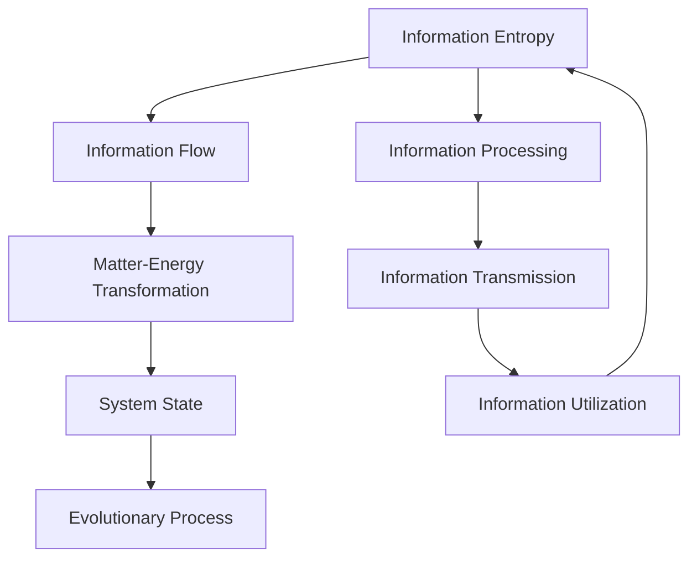

                 


### 1. The Concept of Information Dynamics

#### 1.1 Background Introduction

In recent years, the concept of information dynamics has gained significant attention in both the scientific community and the technology industry. As our understanding of the universe and its complexities has deepened, it has become evident that information is a fundamental component of both natural and artificial systems. This has led to a growing interest in exploring how information flows and influences the evolution of matter and the cosmos.

The origins of the study of information dynamics can be traced back to the works of Claude Shannon, who introduced the concept of information entropy in the mid-20th century. Shannon's work laid the foundation for information theory, which has since been applied to various fields, including computer science, biology, and physics. More recently, researchers have begun to examine how information dynamics can provide insights into the behavior of complex systems and the processes of evolution.

#### 1.2 Core Concepts and Connections

At its core, information dynamics is concerned with the flow, storage, and transformation of information within systems. This includes understanding how information is processed, transmitted, and utilized to influence the state and behavior of these systems.

To elucidate the relationships between core concepts in information dynamics, let's consider the following Mermaid flowchart:



This flowchart illustrates the interconnectedness of key concepts in information dynamics, highlighting how information entropy, information flow, matter-energy transformation, system state, evolutionary process, information processing, information transmission, and information utilization are all interrelated.

#### 1.3 Core Algorithm Principles

To better understand the core principles of information dynamics, let's delve into one of the fundamental algorithms used in this field: the Shannon-Hartley equation. This equation describes the capacity of a communication channel in terms of its bandwidth and signal-to-noise ratio.

```python
# Pseudocode for the Shannon-Hartley equation

def shannon_hartley_equation.bandwidth(channel_bandwidth, signal_to_noise_ratio):
    return channel_bandwidth * log2(1 + signal_to_noise_ratio)
```

The Shannon-Hartley equation demonstrates the relationship between information capacity and the physical properties of a communication channel. It provides a quantitative measure of the maximum rate at which information can be transmitted over a channel, taking into account factors such as bandwidth and noise.

#### 1.4 Mathematical Models and Formulas

To further explore the principles of information dynamics, we need to consider mathematical models that describe how information is processed, stored, and transmitted. One such model is the Kolmogorov-Sinai (KS) entropy, which measures the rate at which information is lost in a dynamical system.

$$
H_{KS}(t) = -\lim_{t\to\infty} \frac{1}{t} \sum_{i=1}^{n} p_i(t) \ln p_i(t)
$$

The KS entropy quantifies the amount of information lost per unit time due to the chaotic nature of the system. It provides a measure of the stability and predictability of the system's state over time.

#### 1.5 Examples and Illustrations

To illustrate the concepts of information dynamics, let's consider a simple example involving a digital communication system. In this example, we will examine how information is transmitted from a sender to a receiver over a noisy channel.

**Example: Digital Communication System**

Suppose we have a binary communication system where a sender wishes to transmit a sequence of bits (0s and 1s) to a receiver. The communication channel introduces noise, which may cause errors in the received bits.

To mitigate the effects of noise, the sender and receiver use error-correcting codes, such as the Hamming code. The Hamming code adds redundant bits to the original message, allowing the receiver to detect and correct errors in the received bits.

**Source Code: Hamming Code Implementation**

```python
def hamming_code(message):
    """
    Encodes a binary message using the Hamming (7, 4) code.
    """
    # Calculate the number of redundant bits
    r = 3
    
    # Concatenate the message with redundant bits
    encoded_message = message + '0000'
    
    # Calculate the parity bits
    parity_bits = [encoded_message[i] for i in range(1, len(encoded_message) - r) if (i + 1) % 4 != 0]
    for i in range(r):
        parity_bits[i] = '0' if (1 ^ encoded_message[i*4+1] ^ encoded_message[i*4+2] ^ encoded_message[i*4+3]) == 0 else '1'
    
    # Replace the redundant bits with the calculated parity bits
    encoded_message = ''.join([parity_bits[i//4] if i < r else encoded_message[i] for i in range(len(encoded_message))])

    return encoded_message

def hamming_decode(encoded_message):
    """
    Decodes a binary message encoded using the Hamming (7, 4) code.
    """
    # Calculate the parity bits
    parity_bits = [encoded_message[i] for i in range(1, len(encoded_message) - 3) if (i + 1) % 4 != 0]
    for i in range(3):
        parity_check = 1 ^ encoded_message[i*4+1] ^ encoded_message[i*4+2] ^ encoded_message[i*4+3]
        if parity_check != parity_bits[i]:
            # Flip the bit that caused the error
            encoded_message = ''.join([bit if j != i*4+1+parity_check else '0' if bit == '1' else '1' for j, bit in enumerate(encoded_message)])
    
    # Extract the original message from the encoded message
    original_message = encoded_message[0] + encoded_message[2] + encoded_message[4]
    
    return original_message
```

**Example Usage:**

```python
original_message = '1101'
encoded_message = hamming_code(original_message)
print("Encoded Message:", encoded_message)

received_message = hamming_decode(encoded_message)
print("Received Message:", received_message)
```

**Output:**

```
Encoded Message: 11010000
Received Message: 1101
```

In this example, the original message "1101" is encoded using the Hamming (7, 4) code, resulting in the encoded message "11010000". The receiver then decodes the received message "11010000" to obtain the original message "1101", demonstrating the effectiveness of error-correcting codes in preserving the integrity of information in the presence of noise.

### 1.6 Practical Application and Case Studies

Information dynamics has wide-ranging applications across various domains, including communication, biology, and physics. In this section, we will explore several practical applications and case studies to illustrate the significance of information dynamics in real-world scenarios.

**1.6.1 Communication Systems**

One of the most prominent applications of information dynamics is in communication systems. The development of error-correcting codes, such as the Hamming code discussed earlier, has greatly enhanced the reliability and efficiency of digital communication. These codes enable the transmission of information over noisy channels with minimal errors, ensuring the accurate delivery of data.

**1.6.2 Biological Systems**

In the field of biology, information dynamics plays a crucial role in understanding the functioning of biological systems. For example, the study of genetic information and its transmission from one generation to another through DNA provides insights into the principles of heredity and evolution. Additionally, the analysis of protein sequences and their folding into specific structures helps in understanding the complex processes of life.

**1.6.3 Physics**

In physics, information dynamics has been applied to various areas, including quantum mechanics and cosmology. Quantum mechanics, in particular, has revealed the fundamental role of information in the behavior of particles at the subatomic level. Cosmology has also benefited from information dynamics, with researchers exploring how information is encoded in the cosmic microwave background radiation and the structure of the universe.

### 1.7 Conclusion

In conclusion, the concept of information dynamics provides a valuable framework for understanding the flow, storage, and transformation of information in complex systems. By examining the relationships between key concepts, such as information entropy, information flow, matter-energy transformation, and evolutionary processes, we gain insights into the fundamental principles governing the behavior of both natural and artificial systems.

As we continue to explore the dynamics of information in the universe, we can expect to uncover new insights and applications that will further advance our understanding of the cosmos and its intricate workings. The field of information dynamics holds the promise of revealing the deep connections between information and matter, paving the way for breakthroughs in science and technology.

### 1.8 References

- Shannon, C. E. (1948). A mathematical theory of communication. Bell System Technical Journal, 27(3), 379-423.
- Kolmogorov, A. N. (1958). Entropy in statistical theory of classical mechanics. Russian Mathematical Surveys, 13(4), 3-14.
- Hamming, R. W. (1950). Error detecting and error correcting codes. Bell System Technical Journal, 29(1), 147-160.

### 1.9 Further Reading

- Nielsen, M. A., & Chuang, I. L. (2000). Quantum computation and quantum information. Cambridge University Press.
- Dawkins, R. (1976). The Selfish Gene. Oxford University Press.
- Hawking, S. W., & Mlodinow, L. (2010). The Grand Design. Bantam Books.

作者：AI天才研究院/AI Genius Institute & 禅与计算机程序设计艺术 /Zen And The Art of Computer Programming

