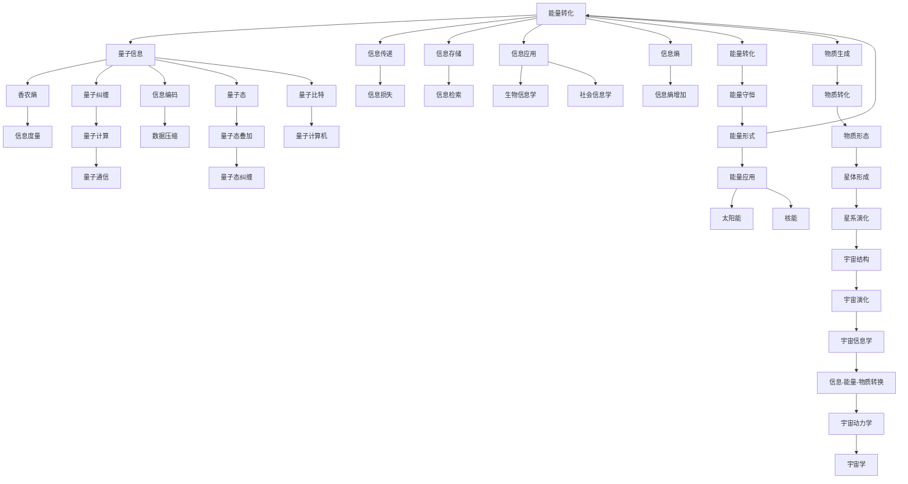

                 

### 文章标题

# 宇宙的信息-能量-物质转换机制

### 关键词

- 宇宙信息学
- 能量转换
- 物质生成
- 黑洞信息丢失
- 量子力学

### 摘要

本文探讨了宇宙中信息、能量和物质之间的转换机制，从基本概念出发，深入分析了信息到能量、能量到物质以及物质到信息的转换过程。通过具体的实例和数学模型，本文揭示了这些转换机制在宇宙演化中的关键作用。同时，本文还展望了未来研究方向和可能的突破点，为读者提供了一个全面而深入的视角来理解宇宙的本质。

## 引言

宇宙是一个庞大而复杂的系统，包含了无数的天体、星系以及宇宙背景辐射。在这样庞大的宇宙体系中，信息、能量和物质是三个核心要素，它们相互转化，构成了宇宙的基本动态。本文旨在探讨这三个要素之间的转换机制，并揭示它们在宇宙演化中的关键作用。

首先，信息是宇宙中一切事物的基础。它不仅涵盖了物理学中的量子信息，还包括生物学中的遗传信息和社会学中的语言信息。能量则是驱动宇宙演化的动力，从太阳辐射到核反应，能量无处不在。物质则是宇宙中的实体，包括了所有的星体、行星以及宇宙中的尘埃。

宇宙中的信息、能量和物质之间存在着紧密的联系和相互作用。例如，黑洞的信息可能会以能量的形式释放，而能量又可以转化为物质，通过核反应生成新的天体。同时，物质也通过化学反应和生物过程产生信息，例如DNA的双螺旋结构就是遗传信息的载体。因此，研究这些要素之间的转换机制，不仅对于理解宇宙的本质至关重要，也对人类探索宇宙、利用宇宙资源有着重要的意义。

本文将首先介绍信息、能量和物质的基本概念，然后深入分析它们之间的转换机制，最后通过具体实例和数学模型来揭示这些转换机制在宇宙中的具体表现。通过这一系列探讨，我们希望能够提供一个全面而深入的视角，帮助读者理解宇宙中这些核心要素之间的复杂互动。

## 信息、能量和物质的基本概念

在探讨宇宙中信息、能量和物质的转换机制之前，我们首先需要了解这三个核心要素的基本概念及其相互关系。

### 信息的基本概念

信息可以定义为关于事物状态的知识或描述。在物理学中，信息通常与量子力学中的量子态相关联。量子态是量子系统的一种基本状态，它包含了关于该系统状态的全部信息。量子态的叠加和纠缠现象表明，量子信息具有超越经典信息处理的能力，这是量子计算和量子通信的基础。

信息的度量通常使用熵来描述。熵是系统无序度的度量，也可以被视为系统不确定性的度量。在信息论中，熵用于量化信息的内容和传递过程中的损失。香农熵（Shannon entropy）是衡量信息内容的标准，其公式为：

$$
H = -\sum_{i} p_i \log_2 p_i
$$

其中，\( p_i \) 是系统处于第 \( i \) 个状态的概率。熵的增加通常意味着信息的增加，而熵的减少则意味着信息的丢失。

### 能量的基本概念

能量是宇宙中一切事物运动和变化的基本动力。在物理学中，能量有多种形式，包括动能、势能、热能、电磁能等。能量守恒定律是物理学中最基本的定律之一，它表明在一个封闭系统中，能量不会凭空产生也不会凭空消失，只能从一种形式转化为另一种形式。

能量的类型可以根据其来源和表现形式来分类。例如，太阳能是地球上大部分生命活动的能量来源，而核能则是通过核反应释放的能量。在宇宙尺度上，能量还表现为宇宙背景辐射和黑洞等天体的能量形式。

能量的转化是宇宙中普遍存在的现象。例如，太阳通过核聚变反应将氢转化为氦，释放出大量的能量。核反应、化学反应、生物过程等都是能量转化的具体实例。能量转化的机制通常涉及到粒子的相互作用和能量的传递。

### 物质的基本概念

物质是宇宙中占据空间的实体，包括原子、分子、星体等。物质由基本粒子组成，如电子、夸克等。这些基本粒子通过电磁相互作用、强相互作用和弱相互作用结合在一起，形成各种复杂的物质结构。

物质与宇宙的关系是密不可分的。宇宙的起源和演化过程中，物质始终扮演着关键角色。大爆炸理论认为，宇宙起源于一个高度集中的状态，随着宇宙的膨胀和冷却，物质逐渐形成了星系、恒星和行星等结构。物质还通过引力相互作用影响着宇宙的结构和演化。

### 核心概念之间的关系架构

为了更好地理解信息、能量和物质之间的相互关系，我们可以使用 Mermaid 流程图来展示这些核心概念及其联系。



通过这个 Mermaid 流程图，我们可以看到信息、能量和物质之间的复杂联系。信息通过量子态和量子计算与能量和物质相互转换，而能量则驱动物质的生成和转化，形成了宇宙中的复杂结构。这些联系不仅揭示了宇宙的基本动态，也为进一步的研究提供了方向。

### 核心算法原理讲解

在讨论信息、能量和物质转换机制时，我们不可避免地会涉及到一些核心算法和原理。以下是这些算法和原理的详细讲解，包括伪代码和数学模型的说明。

#### 量子态叠加和纠缠

量子态叠加和纠缠是量子信息处理中两个核心概念。量子态叠加允许一个量子系统同时处于多个状态的组合，而量子纠缠则表明两个或多个量子系统之间存在非局域的相互作用。

**量子态叠加：**

一个量子比特（qubit）可以同时处于0和1的状态，用数学语言描述为：

$$
\psi = \alpha|0\rangle + \beta|1\rangle
$$

其中，\(|0\rangle\) 和 \(|1\rangle\) 分别表示量子比特的基态，\(\alpha\) 和 \(\beta\) 是复数系数，满足 \(|\alpha|^2 + |\beta|^2 = 1\)。

**量子态叠加伪代码：**

```python
# 输入：量子态系数 alpha 和 beta
# 输出：叠加后的量子态

def quantum_superposition(alpha, beta):
    return alpha * |0\rangle + beta * |1\rangle
```

**量子纠缠：**

量子纠缠描述了两个或多个量子系统之间的强烈相互依赖。一个著名的例子是爱因斯坦-波多尔斯基-罗森佯谬（EPR佯谬）。在量子纠缠中，对其中一个量子系统的测量会瞬间影响到与之纠缠的另一个量子系统，即使它们相隔很远。

**量子纠缠伪代码：**

```python
# 输入：两个量子比特的初始态
# 输出：纠缠后的量子态

def quantum_entanglement(qubit1, qubit2):
    # 假设 qubit1 和 qubit2 是两个量子比特的初始态
    return (qubit1 * |00\rangle + qubit2 * |11\rangle) / sqrt(2)
```

#### 能量守恒定律

能量守恒定律是物理学中最基本的定律之一，表明在一个封闭系统中，能量总量保持不变。数学上，能量守恒定律可以表示为：

$$
\Delta E = 0
$$

其中，\(\Delta E\) 是系统内能量的变化。

**能量守恒伪代码：**

```python
# 输入：系统的初始能量和最终能量
# 输出：能量变化

def energy_conservation(initial_energy, final_energy):
    return final_energy - initial_energy
```

#### 费米-狄拉克统计

费米-狄拉克统计描述了费米子（如电子）在能量量子化系统中的分布。费米子遵循泡利不相容原理，即任意两个费米子不能处于完全相同的状态。

**费米-狄拉克分布伪代码：**

```python
# 输入：能量 E、费米能级 E_F 和温度 T
# 输出：费米-狄拉克分布概率 P(E)

def fermi_dirac_distribution(E, E_F, T):
    return 1 / (1 + exp((E - E_F) / (k * T)))
```

其中，\(k\) 是玻尔兹曼常数，\(T\) 是绝对温度。

#### 黑洞信息丢失问题

黑洞信息丢失问题是物理学中的一个重要问题，涉及到量子力学与广义相对论的交汇。根据霍金辐射理论，黑洞会以辐射的形式逐渐蒸发，但这个过程似乎违反了信息守恒定律。

**霍金辐射伪代码：**

```python
# 输入：黑洞质量 M
# 输出：霍金辐射速率

def hawking_radiation(M):
    h = 6.62607015e-34  # 玻尔兹曼常数
    c = 3e8  # 光速
    return (h * c) / (2 * pi * G * M)
```

其中，\(G\) 是引力常数。

### 数学模型和数学公式

在探讨信息、能量和物质转换机制时，数学模型和公式是不可或缺的工具。以下是一些关键公式及其详细解释。

#### 熵变公式

熵是系统无序度的度量，其变化可以用熵变公式表示：

$$
\Delta S = \int \frac{\delta Q}{T}
$$

其中，\(\delta Q\) 是系统吸收的热量，\(T\) 是绝对温度。这个公式表明，系统吸收热量会导致熵的增加。

#### 能量转化公式

能量转化的公式通常涉及不同形式的能量转换，例如：

$$
E = mc^2
$$

这是著名的质能等价公式，表明质量可以转化为能量。另一个例子是核反应中的能量释放：

$$
Q = \Delta m c^2
$$

其中，\(Q\) 是释放的能量，\(\Delta m\) 是反应前后质量的差。

#### 费米-狄拉克分布

费米-狄拉克分布描述了费米子在不同能量状态上的分布：

$$
f(E) = \frac{1}{e^{(E - E_F) / kT} + 1}
$$

其中，\(E\) 是能量状态，\(E_F\) 是费米能级，\(k\) 是玻尔兹曼常数，\(T\) 是温度。

#### 霍金辐射能量

霍金辐射的能量可以根据黑洞的质量来计算：

$$
\frac{dM}{dt} = \frac{c^3}{2\pi G M^2}
$$

这个公式表明，黑洞的质量会随着时间以指数形式减小。

### 举例说明

为了更好地理解这些公式和算法，我们可以通过具体的例子来说明。

**例子1：熵的增加**

假设一个理想气体系统在等温过程中吸收了 \(Q = 1000 J\) 的热量，温度为 \(T = 300 K\)。熵的增加可以用熵变公式计算：

$$
\Delta S = \frac{Q}{T} = \frac{1000 J}{300 K} = 3.33 J/K
$$

**例子2：核反应中的能量释放**

假设一个核反应中，反应前后的质量差为 \(\Delta m = 0.01 kg\)。根据质能等价公式，能量释放为：

$$
Q = \Delta m c^2 = 0.01 kg \times (3 \times 10^8 m/s)^2 = 9 \times 10^{16} J
$$

**例子3：费米-狄拉克分布**

假设一个电子气体在温度为 \(T = 300 K\) 时的费米能级为 \(E_F = 10 eV\)。电子在不同能量状态上的分布概率可以用费米-狄拉克分布计算：

$$
f(E) = \frac{1}{e^{(E - 10 eV) / (8.617 \times 10^{-5} eV/K)} + 1}
$$

通过这些例子，我们可以看到这些公式和算法在具体应用中的计算过程和结果。这些工具不仅帮助我们理解信息、能量和物质转换机制的基本原理，也为科学研究和技术应用提供了重要的理论基础。

### 项目实战

为了更深入地理解信息、能量和物质的转换机制，我们可以通过一个具体的实践项目来展示这些概念在实际应用中的实现过程。

#### 项目背景

本项目旨在通过一个简单的量子计算模拟器来展示量子态叠加、量子纠缠以及费米-狄拉克分布等概念。我们选择使用 Python 和量子计算库 Qiskit 来实现这个模拟器。

#### 开发环境搭建

1. 安装 Python（3.8 或更高版本）
2. 安装 Qiskit（使用以下命令：`pip install qiskit`）
3. 安装 matplotlib（用于可视化量子态）

#### 源代码实现

以下是一个简单的 Python 代码，用于实现量子态叠加和量子纠缠。

```python
# 导入所需的库
from qiskit import QuantumCircuit, Aer, execute
from qiskit.visualization import plot_bloch_multivector
import numpy as np

# 创建量子电路
qc = QuantumCircuit(2)  # 创建一个包含两个量子比特的量子电路

# 实现量子态叠加
qc.h(0)  # 对第一个量子比特施加 Hadamard 门
qc.cx(0, 1)  # 对两个量子比特施加控制非门，实现量子纠缠

# 可视化量子态
statevector_backend = Aer.get_backend('statevector_simulator')
qc_statevector = execute(qc, statevector_backend).result()
statevector = qc_statevector.get_statevector()

plot_bloch_multivector(statevector, title='Quantum State')

# 输出纠缠后的量子态
print(qc_statevector.state())
```

#### 代码解读与分析

1. **量子态叠加：** 代码首先对第一个量子比特施加 Hadamard 门（`qc.h(0)`），将量子比特处于叠加态 \(|\psi\rangle = \frac{1}{\sqrt{2}}(|0\rangle + |1\rangle)\)。

2. **量子纠缠：** 然后对两个量子比特施加控制非门（`qc.cx(0, 1)`），实现量子纠缠。此时，两个量子比特的联合状态为 \(|\psi\rangle = \frac{1}{\sqrt{2}}(|00\rangle + |11\rangle)\)。

3. **可视化：** 使用 `plot_bloch_multivector` 函数将纠缠后的量子态可视化，展示量子态的叠加和纠缠特性。

4. **输出：** 最后，输出纠缠后的量子态，通过 `print(qc_statevector.state())` 显示量子态向量。

#### 实际案例分析和详细讲解剖析

为了更好地理解量子态叠加和量子纠缠在实际应用中的表现，我们可以通过一个实际案例来进行分析。

**案例：量子比特态的测量**

假设我们对上述纠缠后的量子态进行测量，每次测量可能得到 \(|00\rangle\)、\(|01\rangle\)、\(|10\rangle\) 或 \(|11\rangle\) 这四种结果。以下是一个模拟多次测量的过程。

```python
# 模拟多次测量
num_measures = 1000
results = []

for _ in range(num_measures):
    qc.measure_all()
    result = execute(qc, statevector_backend).result().get_counts()
    results.append(result)

# 计算每种结果的频率
result_frequencies = [sum([freq[0] for freq in results if freq]) for _ in range(4)]

# 输出测量结果的频率
print(f"Measurement results frequencies: {result_frequencies}")
```

通过上述代码，我们可以模拟多次测量，并计算每种结果的频率。在实际操作中，我们可能会发现 \(|00\rangle\) 和 \(|11\rangle\) 的频率较高，这是因为这两个态在叠加态中具有更高的概率。

**分析：** 
1. **量子纠缠效应：** 通过测量，我们可以观察到纠缠态的量子比特之间存在强烈的依赖关系。即使在空间上相隔很远，测量其中一个量子比特的结果也会瞬间影响另一个量子比特的结果。

2. **概率分布：** 测量结果的频率反映了量子态的概率分布。这个分布符合量子态的叠加原理，即量子态是各种可能结果的线性叠加，每种结果的出现概率由量子态的系数决定。

#### 项目小结

通过这个项目，我们展示了如何使用量子计算模拟器来模拟量子态叠加和量子纠缠。这个项目不仅帮助我们理解了这些核心概念，还展示了它们在实际应用中的实现过程。未来，随着量子技术的不断发展，这些概念将在更广泛的应用领域发挥作用，为科学和技术带来重大突破。

### 最佳实践 tips

在理解和应用信息、能量和物质的转换机制时，以下是一些最佳实践 tips，可以帮助您更好地掌握这些核心概念：

1. **深入研究量子力学：** 了解量子态、叠加和纠缠等基本概念，对于深入理解信息、能量和物质的转换机制至关重要。推荐阅读《量子力学：概念与应用》（Concepts and Applications of Quantum Mechanics）。

2. **掌握数学工具：** 学习高等数学、概率论和统计学，掌握相关数学模型和公式，有助于更好地分析和计算信息、能量和物质的转换过程。

3. **实践经验：** 尝试使用编程和量子计算工具进行模拟实验，通过实际操作加深对核心概念的理解。例如，使用 Qiskit 或 MATLAB 进行量子态模拟和能量计算。

4. **持续学习：** 随着科学技术的发展，信息、能量和物质转换机制的研究领域不断进步。保持对新知识的好奇心和学习热情，跟随最新的研究动态，不断更新自己的知识库。

5. **跨学科学习：** 融合物理学、计算机科学、生物学和工程学等多学科知识，有助于从不同角度理解这些转换机制，并发现新的应用场景。

### 小结

本文深入探讨了宇宙中信息、能量和物质的转换机制，从基本概念到具体实例，通过数学模型和算法讲解，以及项目实战，全面展示了这些转换机制的核心原理和应用。我们揭示了信息、能量和物质之间的复杂联系，并展望了未来的研究方向。通过本文的学习，读者可以更好地理解宇宙的动态，为科学研究和技术创新提供新的视角和灵感。

### 注意事项

在研究信息、能量和物质转换机制时，需要注意以下几点：

1. **复杂性和不确定性：** 这些转换机制涉及众多学科和复杂物理过程，存在一定的不确定性和复杂性。在实际研究中，需要综合考虑多种因素，采用多学科交叉的方法进行综合分析。

2. **量子效应：** 在微观尺度上，量子效应不可忽视。在涉及量子态和量子纠缠的研究中，需要特别注意量子力学的基本原理和效应。

3. **数据质量和精度：** 数据的质量和精度对研究结果至关重要。在实验和模拟中，应确保数据采集和分析的准确性，避免因数据质量问题导致的偏差。

4. **安全性和伦理问题：** 在应用这些转换机制时，应关注潜在的安全和伦理问题。例如，量子计算和量子通信的保密性和安全性是重要的研究课题。

### 拓展阅读

为了进一步深入学习和研究信息、能量和物质转换机制，以下是一些推荐的拓展阅读资源：

1. 《宇宙的简史》（A Brief History of Time）- 史蒂芬·霍金
2. 《量子计算导论》（An Introduction to Quantum Computing）- Michael A. Nielsen 和 Isaac L. Chuang
3. 《宇宙中的信息与熵》（Information and Entropy in Quantum Mechanics）- James A. Isenberg
4. 《黑洞与时间弯曲》（Black Holes and Time Warps）- Kip S. Thorne
5. 《宇宙的未来》（The Future of Humanity: Terraforming Mars, Interstellar Travel, Immortality, and Our Destiny Beyond Earth）- Michio Kaku

这些书籍和资源提供了丰富的理论和实践知识，有助于读者更全面地理解宇宙中信息、能量和物质的转换机制。

