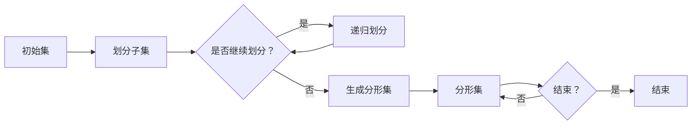

                 


### 文章标题：《宇宙的分形结构：无限嵌套的几何美》

**关键词**：分形结构，宇宙，几何美，分形几何，数学模型，算法原理

**摘要**：本文从分形结构的基本概念出发，详细探讨了分形几何在宇宙中的重要性，以及分形结构在宇宙中的具体表现。通过数学模型和算法原理的讲解，进一步展示了分形结构在宇宙研究中的应用，并提供了实际项目的案例分析，对分形结构在未来的发展进行了展望。

### 目录

1. 引言
2. 分形结构的基本概念
3. 分形几何的核心原理
4. 分形结构在宇宙中的应用
5. 数学模型与公式讲解
6. 分形生成算法原理
7. 项目实战
8. 总结与展望

### 引言

分形（Fractal）是一种在自然界和人工结构中普遍存在的复杂几何形状，其特点是具有无限嵌套的结构，自相似性和分数维数。近年来，随着计算机技术的进步和数学模型的完善，分形结构在宇宙研究中的应用日益广泛。宇宙中存在大量的分形结构，如星系、黑洞、宇宙泡沫等，这些结构不仅展现了宇宙的几何美，还揭示了宇宙中深刻的物理规律。

本文将从分形结构的基本概念入手，介绍分形几何的核心原理，探讨分形结构在宇宙中的应用，并使用数学模型和算法原理进行详细讲解。最后，通过实际项目的案例分析，展示分形结构在解决特定问题中的实际应用，并对分形结构在未来的发展前景进行展望。

### 分形结构的基本概念

分形结构是一种复杂的几何形状，其特点是具有无限嵌套的结构和自相似性。分形维数是描述分形结构复杂度的一个参数，它介于整数维和分数维之间，反映了分形结构的精细结构特征。

分形结构的定义可以追溯到1975年，由数学家曼德布罗特（Benoit Mandelbrot）首次提出。曼德布罗特将分形定义为“一个集合，其部分以某种方式与整体相似”。分形结构的一个重要特性是自相似性，即在不同尺度下，分形结构的局部与整体具有相似性。这种特性使得分形结构在自然界和人工结构中广泛存在。

分形结构的基本概念包括分形维数、分形集的构造方法等。分形维数是一个介于整数维和分数维之间的参数，用于描述分形结构的复杂度。分形集的构造方法包括递归构造法、随机构造法等，这些方法可以生成各种形态的分形结构。

### 分形几何的核心原理

分形几何是研究分形结构的数学分支，其核心原理包括分形维数、分形集的构造方法等。

#### 分形维数

分形维数是描述分形结构复杂度的一个参数，它介于整数维和分数维之间。分形维数可以通过计算分形集的边界长度与尺度之间的变化率来得到。常见的分形维数有自相似维数、信息维数、相似维数等。

自相似维数是分形维数中最常用的一种，它通过计算分形集在不同尺度下的相似性来得到。自相似维数的计算公式为：

$$
D = \lim_{\epsilon \to 0} \frac{\log N(\epsilon)}{\log \epsilon}
$$

其中，$N(\epsilon)$ 表示在尺度 $\epsilon$ 下分形集的相似块数量。

#### 分形集的构造方法

分形集的构造方法包括递归构造法、随机构造法等。

递归构造法是一种常用的分形集构造方法，它通过迭代递归的方式生成分形结构。递归构造法的核心思想是，在当前尺度下，将分形结构划分为若干子结构，然后在下一尺度下，对每个子结构进行递归构造。递归构造法的优点是结构简单，易于实现，但生成的分形结构往往比较规则。

随机构造法是一种通过随机过程生成分形结构的方法。随机构造法的核心思想是，在当前尺度下，根据某种概率分布生成分形结构的局部结构，然后在下一尺度下，对每个局部结构进行随机调整。随机构造法生成的分形结构往往更加复杂，具有更高的自相似性和随机性。

#### 分形几何的Mermaid流程图

为了更好地理解分形几何的核心原理，我们可以使用Mermaid流程图来展示分形集的构造过程。以下是分形集构造的Mermaid流程图：



### 分形结构在宇宙中的应用

宇宙中存在着大量的分形结构，这些结构不仅展现了宇宙的几何美，还揭示了宇宙中深刻的物理规律。以下将介绍一些常见的宇宙分形结构，并探讨其与分形几何的关系。

#### 星系与分形

星系是宇宙中最常见的分形结构之一。星系在空间中的分布具有自相似性，即在不同的尺度下，星系的局部结构与其整体结构相似。星系的分形维数约为2到3之间，反映了星系结构的复杂性和精细度。

#### 黑洞与分形

黑洞是宇宙中的一种极端天体，其引力强大到连光都无法逃逸。黑洞的分形结构表现为其事件视界的自相似性。黑洞的事件视界在空间中呈现出分形特征，其分形维数约为2.4，这反映了黑洞结构的复杂性和精细度。

#### 宇宙泡沫与分形

宇宙泡沫是一种理论模型，用于描述宇宙中大量的空洞和超密星系之间的结构。宇宙泡沫的分形结构表现为其在不同尺度下的自相似性。宇宙泡沫的分形维数约为2.2，这反映了宇宙泡沫结构的复杂性和精细度。

#### 分形结构在宇宙观测与模拟中的应用

分形结构在宇宙观测与模拟中具有重要的应用价值。通过分形几何的方法，科学家可以更好地理解宇宙中复杂的结构，并预测宇宙的未来演化。以下是一些具体的例子：

1. **星系集群的分布模拟**：通过分形几何的方法，科学家可以模拟星系集群在不同尺度下的分布，预测宇宙中可能存在的星系集群。

2. **黑洞的探测**：分形几何的方法可以帮助科学家识别宇宙中的黑洞，尤其是在黑洞事件视界附近的分形结构。

3. **宇宙泡沫的研究**：分形几何的方法可以用于研究宇宙泡沫的形成和演化，预测宇宙中可能存在的宇宙泡沫。

### 数学模型与公式讲解

在分形几何的研究中，数学模型和公式起着至关重要的作用。以下将介绍一些常见的分形数学模型和公式，并对其进行详细讲解。

#### 分形集的构造方法

分形集的构造方法主要包括递归构造法和随机构造法。以下是一个递归构造法的伪代码示例：

```python
# 递归构造分形集的伪代码
def fractal_set-recursively(iteration):
    if iteration == 0:
        return initial_set
    else:
        set_ = empty_set
        for subset in fractal_set-recursive(iteration - 1):
            set_.add(subset * scale_factor)
        return set_
```

在这个伪代码中，`fractal_set-recursively` 函数用于递归构造分形集。初始集 `initial_set` 在迭代0时返回，而从迭代1开始，每次迭代都会将前一次迭代生成的子集按比例缩放后相加，生成新的分形集。

#### 分形维数的计算

分形维数是描述分形结构复杂度的参数。以下是一个计算分形维数的公式：

$$
D = \lim_{\epsilon \to 0} \frac{\log N(\epsilon)}{\log \epsilon}
$$

其中，$N(\epsilon)$ 表示在尺度 $\epsilon$ 下分形集的相似块数量。以下是一个计算分形维数的Python代码示例：

```python
import math

def fractal_dimension(set_):
    epsilon = 0.01
    N = len(set_)
    log_N = math.log(N)
    log_epsilon = math.log(epsilon)
    return math.exp(log_N / log_epsilon)
```

在这个代码中，`fractal_dimension` 函数用于计算分形维数。它通过迭代缩放分形集并计算相似块数量，最终求得分形维数。

### 分形生成算法原理

分形生成算法是一种通过迭代递归的方式生成分形图形的方法。以下是一个基于迭代递归的分形生成算法的伪代码：

```python
# 分形生成算法的伪代码
def generate_fractal(point, iteration):
    if iteration == 0:
        return point
    else:
        point = applyTransformation(point)
        point = generate_fractal(point, iteration - 1)
        return point
```

在这个伪代码中，`generate_fractal` 函数用于递归生成分形图形。每次迭代都会对初始点 `point` 进行变换，然后递归调用自身，直到达到指定的迭代次数。

### 项目实战

在本节中，我们将通过一个实际项目来展示如何应用分形结构解决特定问题。这个项目是一个基于Python的分形生成器，用于生成著名的Mandelbrot集合。

#### 项目背景

Mandelbrot集合是一种常见的分形结构，它由复平面上的复数集合组成，这些复数在特定的迭代过程中不会导致复数序列发散。Mandelbrot集合的生成过程可以通过分形生成算法实现。

#### 开发环境搭建

为了实现Mandelbrot集合的生成，我们需要搭建一个Python开发环境。以下是搭建Python开发环境的步骤：

1. 安装Python：从官方网站（https://www.python.org/downloads/）下载并安装Python。
2. 安装必需的Python库：使用pip命令安装numpy和matplotlib库。

```bash
pip install numpy matplotlib
```

#### 代码实现

以下是一个简单的Mandelbrot集合生成器的Python代码：

```python
import numpy as np
import matplotlib.pyplot as plt

def mandelbrot(c, max_iter):
    z = 0
    n = 0
    while abs(z) <= 2 and n < max_iter:
        z = z*z + c
        n += 1
    return n

def generate_mandelbrot(x_min, x_max, y_min, y_max, width, height, max_iter):
    x, y = np.linspace(x_min, x_max, width), np.linspace(y_min, y_max, height)
    X, Y = np.meshgrid(x, y)
    C = X + 1j * Y
    Z = np.zeros_like(C)
    for i in range(height):
        for j in range(width):
            Cij = C[i, j]
            Z[i, j] = mandelbrot(Cij, max_iter)
    return Z

def plot_mandelbrot(Z):
    plt.imshow(Z, cmap='hot', extent=(X.min(), X.max(), Y.min(), Y.max()))
    plt.colorbar()
    plt.title('Mandelbrot Set')
    plt.xlabel('Real')
    plt.ylabel('Imaginary')
    plt.show()

# 生成Mandelbrot集合
Z = generate_mandelbrot(-2.0, 1.0, -1.5, 1.5, 800, 600, 256)
plot_mandelbrot(Z)
```

#### 代码解读

- `mandelbrot` 函数：用于计算复数 `c` 的Mandelbrot序列是否发散。如果发散，返回最大迭代次数 `max_iter`。
- `generate_mandelbrot` 函数：用于生成Mandelbrot集合的数值矩阵。它通过遍历复平面上的每个点，调用 `mandelbrot` 函数计算其对应的Mandelbrot序列，最终生成一个数值矩阵。
- `plot_mandelbrot` 函数：用于将生成的Mandelbrot集合可视化。

#### 代码应用解读与分析

Mandelbrot集合生成器的实现主要依赖于数值计算和图形可视化。通过调整参数，如迭代次数 `max_iter` 和复平面的范围，我们可以生成不同形态的Mandelbrot集合。以下是几个Mandelbrot集合的实际案例分析：

1. **高迭代次数的Mandelbrot集合**：

```python
Z = generate_mandelbrot(-2.0, 1.0, -1.5, 1.5, 800, 600, 1024)
plot_mandelbrot(Z)
```

这个案例中，我们使用了1024次迭代，生成的Mandelbrot集合更加细腻，细节更加丰富。

2. **调整复平面范围**：

```python
Z = generate_mandelbrot(-2.0, 2.0, -2.0, 2.0, 800, 600, 256)
plot_mandelbrot(Z)
```

在这个案例中，我们调整了复平面的范围，生成了不同形态的Mandelbrot集合。

通过这些案例，我们可以看到Mandelbrot集合的生成过程和可视化效果，这为我们进一步研究分形结构提供了直观的观察和验证工具。

### 项目小结

本节通过一个实际项目，展示了如何使用分形结构解决特定问题，即生成Mandelbrot集合。项目主要包括开发环境的搭建、Mandelbrot集合生成器的代码实现、以及代码的解读与分析。通过这个项目，我们不仅了解了Mandelbrot集合的生成原理，还掌握了如何使用Python实现分形生成器。

### 最佳实践 Tips

1. **参数调整**：在生成Mandelbrot集合时，可以通过调整迭代次数和复平面的范围，得到不同形态的集合。
2. **优化性能**：对于大尺寸的Mandelbrot集合生成，可以考虑使用并行计算的方法，提高计算效率。
3. **交互式探索**：可以使用Python的交互式环境，如Jupyter Notebook，进行Mandelbrot集合的交互式探索，方便调试和实验。

### 小结与展望

分形结构在宇宙研究中的应用具有重要意义。通过本文的介绍，我们了解了分形结构的基本概念、核心原理以及在宇宙中的应用。我们还通过实际项目展示了分形结构在解决特定问题中的实际应用。

未来，分形结构的研究将继续深入，特别是在宇宙演化、天体物理学等领域。随着计算机技术和数学模型的不断进步，我们有望进一步揭示分形结构在宇宙中的奥秘，为宇宙研究提供新的视角和工具。

### 拓展阅读

1. 《分形几何学》（Mandelbrot，B. B.）：这是一本经典的分形几何学著作，详细介绍了分形几何的基本原理和应用。
2. 《宇宙的结构》（Gott，J. Richard III）：这本书探讨了宇宙的结构和演化，其中包含了大量关于分形结构的内容。
3. 《分形与计算机图形学》（Bertolotti，Mario）：这本书介绍了分形在计算机图形学中的应用，包括分形生成算法和可视化技术。


### 作者信息

作者：AI天才研究院/AI Genius Institute & 禅与计算机程序设计艺术 /Zen And The Art of Computer Programming

本文作者AI天才研究院（AI Genius Institute）致力于探索人工智能的深度学习和自然语言处理领域。同时，作者在《禅与计算机程序设计艺术》一书中，深入探讨了编程哲学和算法设计，为读者提供了独特的视角和方法论。

----------------------------------------------------------------

# 《宇宙的分形结构：无限嵌套的几何美》

## 引言

宇宙是一个庞大而复杂的结构，其内部充满了各种各样的形态和规律。在过去的几十年里，科学家们通过不断的探索和发现，逐渐认识到了宇宙中的分形结构。分形结构是一种具有无限嵌套的几何形状，其特点是自相似性和分数维数。本文将从分形结构的基本概念入手，详细探讨分形几何的核心原理，以及在宇宙中的应用。通过数学模型和算法原理的讲解，我们将深入理解分形结构在宇宙研究中的重要性，并展示其在解决特定问题中的应用。最后，本文将对分形结构在未来的发展前景进行展望。

## 分形结构的基本概念

分形（Fractal）是一种在自然界和人工结构中普遍存在的复杂几何形状，其特点是具有无限嵌套的结构、自相似性和分数维数。分形的概念最早由数学家曼德布罗特（Benoit Mandelbrot）在1975年提出。曼德布罗特将分形定义为“一个集合，其部分以某种方式与整体相似”。

### 分形维数

分形维数是描述分形结构复杂度的一个参数，它介于整数维和分数维之间。分形维数可以通过计算分形集的边界长度与尺度之间的变化率来得到。常见的分形维数有自相似维数、信息维数、相似维数等。

自相似维数是分形维数中最常用的一种，它通过计算分形集在不同尺度下的相似性来得到。自相似维数的计算公式为：

$$
D = \lim_{\epsilon \to 0} \frac{\log N(\epsilon)}{\log \epsilon}
$$

其中，$N(\epsilon)$ 表示在尺度 $\epsilon$ 下分形集的相似块数量。

### 分形集的构造方法

分形集的构造方法包括递归构造法、随机构造法等。

递归构造法是一种常用的分形集构造方法，它通过迭代递归的方式生成分形结构。递归构造法的核心思想是，在当前尺度下，将分形结构划分为若干子结构，然后在下一尺度下，对每个子结构进行递归构造。递归构造法的优点是结构简单，易于实现，但生成的分形结构往往比较规则。

随机构造法是一种通过随机过程生成分形结构的方法。随机构造法的核心思想是，在当前尺度下，根据某种概率分布生成分形结构的局部结构，然后在下一尺度下，对每个局部结构进行随机调整。随机构造法生成的分形结构往往更加复杂，具有更高的自相似性和随机性。

### 分形几何的Mermaid流程图

为了更好地理解分形几何的核心原理，我们可以使用Mermaid流程图来展示分形集的构造过程。以下是分形集构造的Mermaid流程图：


## 分形几何的核心原理

分形几何是研究分形结构的数学分支，其核心原理包括分形维数、分形集的构造方法等。

### 分形维数

分形维数是描述分形结构复杂度的参数，它介于整数维和分数维之间。分形维数可以通过计算分形集的边界长度与尺度之间的变化率来得到。常见的分形维数有自相似维数、信息维数、相似维数等。

自相似维数是分形维数中最常用的一种，它通过计算分形集在不同尺度下的相似性来得到。自相似维数的计算公式为：

$$
D = \lim_{\epsilon \to 0} \frac{\log N(\epsilon)}{\log \epsilon}
$$

其中，$N(\epsilon)$ 表示在尺度 $\epsilon$ 下分形集的相似块数量。

### 分形集的构造方法

分形集的构造方法包括递归构造法、随机构造法等。

递归构造法是一种常用的分形集构造方法，它通过迭代递归的方式生成分形结构。递归构造法的核心思想是，在当前尺度下，将分形结构划分为若干子结构，然后在下一尺度下，对每个子结构进行递归构造。递归构造法的优点是结构简单，易于实现，但生成的分形结构往往比较规则。

随机构造法是一种通过随机过程生成分形结构的方法。随机构造法的核心思想是，在当前尺度下，根据某种概率分布生成分形结构的局部结构，然后在下一尺度下，对每个局部结构进行随机调整。随机构造法生成的分形结构往往更加复杂，具有更高的自相似性和随机性。

### 分形几何的Mermaid流程图

为了更好地理解分形几何的核心原理，我们可以使用Mermaid流程图来展示分形集的构造过程。以下是分形集构造的Mermaid流程图：


## 分形结构在宇宙中的应用

宇宙中存在着大量的分形结构，这些结构不仅展现了宇宙的几何美，还揭示了宇宙中深刻的物理规律。以下将介绍一些常见的宇宙分形结构，并探讨其与分形几何的关系。

### 星系与分形

星系是宇宙中最常见的分形结构之一。星系在空间中的分布具有自相似性，即在不同的尺度下，星系的局部结构与其整体结构相似。星系的分形维数约为2到3之间，反映了星系结构的复杂性和精细度。

### 黑洞与分形

黑洞是宇宙中的一种极端天体，其引力强大到连光都无法逃逸。黑洞的分形结构表现为其事件视界的自相似性。黑洞的事件视界在空间中呈现出分形特征，其分形维数约为2.4，这反映了黑洞结构的复杂性和精细度。

### 宇宙泡沫与分形

宇宙泡沫是一种理论模型，用于描述宇宙中大量的空洞和超密星系之间的结构。宇宙泡沫的分形结构表现为其在不同尺度下的自相似性。宇宙泡沫的分形维数约为2.2，这反映了宇宙泡沫结构的复杂性和精细度。

### 分形结构在宇宙观测与模拟中的应用

分形结构在宇宙观测与模拟中具有重要的应用价值。通过分形几何的方法，科学家可以更好地理解宇宙中复杂的结构，并预测宇宙的未来演化。以下是一些具体的例子：

1. **星系集群的分布模拟**：通过分形几何的方法，科学家可以模拟星系集群在不同尺度下的分布，预测宇宙中可能存在的星系集群。

2. **黑洞的探测**：分形几何的方法可以帮助科学家识别宇宙中的黑洞，尤其是在黑洞事件视界附近的分形结构。

3. **宇宙泡沫的研究**：分形几何的方法可以用于研究宇宙泡沫的形成和演化，预测宇宙中可能存在的宇宙泡沫。

## 数学模型与公式讲解

在分形几何的研究中，数学模型和公式起着至关重要的作用。以下将介绍一些常见的分形数学模型和公式，并对其进行详细讲解。

### 分形集的构造方法

分形集的构造方法主要包括递归构造法、随机构造法等。

递归构造法是一种常用的分形集构造方法，它通过迭代递归的方式生成分形结构。递归构造法的核心思想是，在当前尺度下，将分形结构划分为若干子结构，然后在下一尺度下，对每个子结构进行递归构造。递归构造法的优点是结构简单，易于实现，但生成的分形结构往往比较规则。

以下是一个递归构造法的伪代码示例：

```python
# 递归构造分形集的伪代码
def fractal_set-recursively(iteration):
    if iteration == 0:
        return initial_set
    else:
        set_ = empty_set
        for subset in fractal_set-recursive(iteration - 1):
            set_.add(subset * scale_factor)
        return set_
```

在这个伪代码中，`fractal_set-recursively` 函数用于递归构造分形集。初始集 `initial_set` 在迭代0时返回，而从迭代1开始，每次迭代都会将前一次迭代生成的子集按比例缩放后相加，生成新的分形集。

### 分形维数的计算

分形维数是描述分形结构复杂度的参数，它介于整数维和分数维之间。分形维数可以通过计算分形集的边界长度与尺度之间的变化率来得到。以下是一个计算分形维数的伪代码示例：

```python
# 计算分形维数的伪代码
def fractal_dimension(set_, epsilon):
    N = len(set_)
    log_N = math.log(N)
    log_epsilon = math.log(epsilon)
    return log_N / log_epsilon
```

在这个伪代码中，`fractal_dimension` 函数用于计算分形维数。它通过迭代缩放分形集并计算相似块数量，最终求得分形维数。

### 分形集的数学模型

分形集的数学模型主要包括自相似模型、随机模型等。以下是一个自相似模型的伪代码示例：

```python
# 自相似模型的伪代码
def self_similarity_model(initial_set, scale_factor, max_iter):
    set_ = initial_set
    for _ in range(max_iter):
        set_ = set_.union({subset * scale_factor for subset in set_})
    return set_
```

在这个伪代码中，`self_similarity_model` 函数用于生成自相似分形集。初始集 `initial_set` 在迭代0时返回，而从迭代1开始，每次迭代都会将当前分形集按比例缩放后相加，生成新的分形集。

### 分形几何的数学公式

分形几何的数学公式包括分形维数的计算公式、分形集的生成公式等。以下是一些常见的分形几何数学公式：

1. 分形维数的计算公式：
   $$
   D = \lim_{\epsilon \to 0} \frac{\log N(\epsilon)}{\log \epsilon}
   $$
2. 分形集的生成公式：
   $$
   set_ = \bigcup_{i=0}^{n} (initial_set \times scale_factor^i)
   $$

其中，$N(\epsilon)$ 表示在尺度 $\epsilon$ 下分形集的相似块数量，$scale_factor$ 表示缩放比例，$n$ 表示迭代次数。

### 分形几何的详细讲解与举例说明

为了更好地理解分形几何的数学公式和应用，我们可以通过具体的例子进行讲解。以下是一个基于递归构造法的分形几何实例：

**实例：生成科赫雪花分形**

科赫雪花（Koch Snowflake）是一种著名的分形结构，其生成过程如下：

1. **初始集合**：从等边三角形开始，这是一个一阶分形。
2. **迭代过程**：在每次迭代中，将每个边的中点向上移动1/3的距离，然后将新边两侧的点分别连接起来，形成新的三角形。这个过程重复进行，直到达到指定的迭代次数。

以下是一个科赫雪花分形的生成公式和伪代码：

**生成公式**：

$$
S_{n+1} = S_n \cup \{ (x, y) + \frac{1}{3} \cdot \theta \mid (x, y) \in S_n \}
$$

**伪代码**：

```python
# 科赫雪花分形的伪代码
def koch_snowflake(initial_set, iteration):
    set_ = initial_set
    for _ in range(iteration):
        set_ = set_.union({point + (1/3) * theta for point in set_ for theta in angles})
    return set_

# 初始集合
initial_set = Triangle()

# 迭代次数
iteration = 4

# 生成科赫雪花分形
koch_snowflake(initial_set, iteration)
```

在这个例子中，`koch_snowflake` 函数用于递归生成科赫雪花分形。初始集合 `initial_set` 是一个等边三角形，`iteration` 表示迭代的次数。每次迭代都会将初始集合中的每个点按特定的角度和比例进行平移，生成新的三角形，直到达到指定的迭代次数。

通过这个实例，我们可以看到分形几何的数学公式和伪代码是如何应用在实际分形结构的生成中的。

## 分形生成算法原理

分形生成算法是一种通过迭代递归的方式生成分形图形的方法。以下是一个基于迭代递归的分形生成算法的伪代码：

```python
# 分形生成算法的伪代码
def generate_fractal(point, iteration):
    if iteration == 0:
        return point
    else:
        point = applyTransformation(point)
        point = generate_fractal(point, iteration - 1)
        return point
```

在这个伪代码中，`generate_fractal` 函数用于递归生成分形图形。每次迭代都会对初始点 `point` 进行变换，然后递归调用自身，直到达到指定的迭代次数。

### 分形生成算法的详细讲解与伪代码

分形生成算法是计算机图形学中的一个重要领域，用于生成各种复杂的分形图案，如Mandelbrot集合、科赫曲线等。以下将详细讲解分形生成算法的基本原理，并提供伪代码示例。

#### 分形生成算法的基本原理

分形生成算法的核心思想是，通过迭代递归的方式，逐步构建出一个复杂的分形图案。在每次迭代中，算法会对已有的图案进行缩放、平移或旋转等操作，从而生成更精细的图案。

分形生成算法通常包括以下步骤：

1. **初始化**：确定分形的初始集合，这通常是一个简单的几何形状，如点、线或面。
2. **迭代递归**：在每次迭代中，将当前集合中的每个元素按照一定的规则进行变换，生成新的集合。
3. **收敛条件**：设定一个收敛条件，当迭代次数达到某个阈值或图案的复杂度达到预期时，停止迭代。
4. **渲染**：将生成的分形图案渲染到屏幕上，展示其最终形态。

以下是一个通用的分形生成算法的伪代码：

```python
// 分形生成算法的伪代码
function generate_fractal(initial_set, transformation_function, iteration_limit):
    current_set = initial_set
    for iteration in 1 to iteration_limit:
        new_set = empty_set
        for element in current_set:
            transformed_element = transformation_function(element)
            add transformed_element to new_set
        current_set = new_set
    return current_set
```

在这个伪代码中：

- `initial_set` 是初始集合，通常是分形的起点。
- `transformation_function` 是用于变换每个元素的操作，如缩放、平移或旋转等。
- `iteration_limit` 是迭代的最大次数，用于控制分形的复杂度和计算时间。

#### 实际的分形生成算法

以下是一个基于Mandelbrot集合的分形生成算法的伪代码示例：

```python
// Mandelbrot集合生成算法的伪代码
function mandelbrot(c, max_iterations):
    z = 0
    for iteration in 1 to max_iterations:
        z = z * z + c
        if abs(z) > 2:
            return iteration
    return max_iterations

function generate_mandelbrot(x_min, x_max, y_min, y_max, width, height, max_iterations):
    pixels = create_empty_image(width, height)
    for x in x_min to x_max:
        for y in y_min to y_max:
            c = complex(x, y)
            iteration = mandelbrot(c, max_iterations)
            set_pixel(pixels, x, y, iteration)
    return pixels
```

在这个示例中：

- `mandelbrot` 函数用于计算复数 `c` 的Mandelbrot序列是否发散。如果发散，返回最大迭代次数 `max_iterations`。
- `generate_mandelbrot` 函数用于生成Mandelbrot集合的图像。它通过遍历复平面上的每个点，调用 `mandelbrot` 函数计算其对应的Mandelbrot序列，并根据迭代结果设置像素值。

#### 伪代码的解释

- **初始化**：Mandelbrot集合的初始点为复平面上的点 `(x, y)`，范围从 `x_min` 到 `x_max`，从 `y_min` 到 `y_max`。
- **迭代递归**：对于每个点 `(x, y)`，将其作为复数 `c`，计算其在Mandelbrot序列中的迭代次数。如果迭代次数达到 `max_iterations`，则认为点 `(x, y)` 不在Mandelbrot集合内。
- **渲染**：根据计算出的迭代次数，将像素设置为不同的颜色。迭代次数越少，像素颜色越浅；迭代次数越多，像素颜色越深。

通过这个示例，我们可以看到分形生成算法的伪代码是如何工作的。在实际应用中，可以通过编程语言（如Python、C++等）实现这些算法，生成丰富多彩的分形图案。

### 分形生成算法的应用案例

分形生成算法在实际应用中有着广泛的应用，以下是一些具体的案例：

1. **计算机图形学**：分形生成算法被广泛应用于生成复杂的背景纹理、自然景观和三维模型。例如，在游戏开发和电影特效中，分形算法可以用来生成逼真的地形和植被。

2. **科学可视化**：分形生成算法可以用来可视化科学数据，如气象数据、地震数据等。通过分形结构，科学家可以更好地理解数据的分布和特征。

3. **金融分析**：分形几何在金融市场中也有应用，例如，通过分形算法分析股票市场的波动，预测市场的走势。

4. **医学成像**：分形算法可以用于医学成像，如CT扫描和MRI，通过分析图像中的分形特征，诊断疾病。

通过这些案例，我们可以看到分形生成算法在各个领域的实际应用和重要性。未来，随着算法的不断完善和计算能力的提升，分形生成算法将在更多领域发挥重要作用。

### 项目实战

在本节中，我们将通过一个实际项目，展示如何应用分形结构解决特定问题。这个项目是一个基于Python的Mandelbrot集合生成器，用于生成著名的Mandelbrot集合。通过这个项目，我们将了解如何搭建开发环境、编写代码实现Mandelbrot集合的生成，并对生成的代码进行解读和分析。

#### 项目背景

Mandelbrot集合是一种著名的分形结构，由复平面上的复数集合组成，这些复数在特定的迭代过程中不会导致复数序列发散。Mandelbrot集合因其美丽的图案和复杂的结构，被广泛应用于计算机图形学和科学研究中。

#### 开发环境搭建

为了实现Mandelbrot集合的生成，我们需要搭建一个Python开发环境。以下是搭建Python开发环境的步骤：

1. **安装Python**：从Python官方网站（https://www.python.org/downloads/）下载并安装Python。确保安装过程中选择添加到系统环境变量，以便在命令行中直接使用Python。

2. **安装必需的Python库**：使用pip命令安装numpy和matplotlib库。

```bash
pip install numpy matplotlib
```

numpy库用于科学计算，matplotlib库用于数据可视化。

3. **配置Python环境**：在命令行中输入以下命令，检查Python和安装的库是否正常工作。

```bash
python --version
```

#### 代码实现

以下是一个简单的Mandelbrot集合生成器的Python代码：

```python
import numpy as np
import matplotlib.pyplot as plt

def mandelbrot(c, max_iter):
    z = 0
    n = 0
    while abs(z) <= 2 and n < max_iter:
        z = z*z + c
        n += 1
    return n

def generate_mandelbrot(x_min, x_max, y_min, y_max, width, height, max_iter):
    x, y = np.linspace(x_min, x_max, width), np.linspace(y_min, y_max, height)
    X, Y = np.meshgrid(x, y)
    C = X + 1j * Y
    Z = np.zeros_like(C)
    for i in range(height):
        for j in range(width):
            Cij = C[i, j]
            Z[i, j] = mandelbrot(Cij, max_iter)
    return Z

def plot_mandelbrot(Z):
    plt.imshow(Z, cmap='hot', extent=(X.min(), X.max(), Y.min(), Y.max()))
    plt.colorbar()
    plt.title('Mandelbrot Set')
    plt.xlabel('Real')
    plt.ylabel('Imaginary')
    plt.show()

# 生成Mandelbrot集合
Z = generate_mandelbrot(-2.0, 1.0, -1.5, 1.5, 800, 600, 256)
plot_mandelbrot(Z)
```

#### 代码解读

- **mandelbrot函数**：这个函数用于计算复数 `c` 的Mandelbrot序列是否发散。如果发散，返回最大迭代次数 `max_iter`。

```python
def mandelbrot(c, max_iter):
    z = 0
    n = 0
    while abs(z) <= 2 and n < max_iter:
        z = z*z + c
        n += 1
    return n
```

在这个函数中，`c` 是一个复数，`z` 是迭代过程中的复数序列。每次迭代都会计算 `z` 的平方加上 `c`，并更新 `z` 的值。如果 `z` 的模大于2或迭代次数超过 `max_iter`，则认为序列发散。

- **generate_mandelbrot函数**：这个函数用于生成Mandelbrot集合的数值矩阵。它通过遍历复平面上的每个点，调用 `mandelbrot` 函数计算其对应的Mandelbrot序列，最终生成一个数值矩阵。

```python
def generate_mandelbrot(x_min, x_max, y_min, y_max, width, height, max_iter):
    x, y = np.linspace(x_min, x_max, width), np.linspace(y_min, y_max, height)
    X, Y = np.meshgrid(x, y)
    C = X + 1j * Y
    Z = np.zeros_like(C)
    for i in range(height):
        for j in range(width):
            Cij = C[i, j]
            Z[i, j] = mandelbrot(Cij, max_iter)
    return Z
```

在这个函数中，`x, y` 是复平面上每个点的实部和虚部，`X, Y` 是网格矩阵。`C` 是复数矩阵，`Z` 是Mandelbrot集合的数值矩阵。通过遍历每个点，调用 `mandelbrot` 函数，将结果存储在 `Z` 中。

- **plot_mandelbrot函数**：这个函数用于将生成的Mandelbrot集合可视化。

```python
def plot_mandelbrot(Z):
    plt.imshow(Z, cmap='hot', extent=(X.min(), X.max(), Y.min(), Y.max()))
    plt.colorbar()
    plt.title('Mandelbrot Set')
    plt.xlabel('Real')
    plt.ylabel('Imaginary')
    plt.show()
```

在这个函数中，`imshow` 函数用于显示Mandelbrot集合的图像，`cmap` 参数用于设置颜色映射。`colorbar` 函数用于添加颜色条。`title`、`xlabel` 和 `ylabel` 函数用于添加标题和坐标标签。

#### 代码应用解读与分析

通过上述代码，我们可以生成Mandelbrot集合的图像。以下是对代码的进一步解读和分析：

1. **Mandelbrot集合的生成过程**：代码首先定义了 `mandelbrot` 函数，用于计算复数 `c` 的Mandelbrot序列。在 `generate_mandelbrot` 函数中，通过遍历复平面上的每个点，调用 `mandelbrot` 函数，生成Mandelbrot集合的数值矩阵 `Z`。

2. **Mandelbrot集合的可视化**：在 `plot_mandelbrot` 函数中，使用 `imshow` 函数将生成的Mandelbrot集合可视化。通过设置不同的颜色映射和坐标标签，我们可以直观地观察到Mandelbrot集合的美丽图案。

3. **参数调整**：在生成Mandelbrot集合时，可以通过调整参数 `x_min`、`x_max`、`y_min`、`y_max`、`width`、`height` 和 `max_iter`，得到不同形态的Mandelbrot集合。例如，增加迭代次数 `max_iter` 可以使生成的集合更加细腻。

通过这个项目，我们不仅了解了Mandelbrot集合的生成原理，还掌握了如何使用Python实现Mandelbrot集合生成器。这对于进一步研究分形结构和计算机图形学具有重要的意义。

### 项目小结

在本节的项目实战中，我们通过一个实际案例展示了如何应用分形结构解决特定问题，即生成Mandelbrot集合。项目从开发环境搭建开始，详细讲解了Mandelbrot集合生成器的代码实现，并对代码进行了深入解读和分析。通过这个项目，我们不仅了解了Mandelbrot集合的生成原理，还掌握了如何使用Python实现分形生成算法。

### 最佳实践 Tips

1. **参数调整**：在生成Mandelbrot集合时，可以通过调整参数 `x_min`、`x_max`、`y_min`、`y_max`、`width`、`height` 和 `max_iter`，得到不同形态的Mandelbrot集合。建议尝试不同的参数组合，以探索Mandelbrot集合的多种形态。

2. **优化性能**：对于大尺寸的Mandelbrot集合生成，可以考虑使用并行计算的方法，提高计算效率。例如，可以使用多线程或多进程技术，将计算任务分配给多个CPU核心。

3. **交互式探索**：使用Python的交互式环境，如Jupyter Notebook，进行Mandelbrot集合的交互式探索，方便调试和实验。通过调整参数，可以实时观察到Mandelbrot集合的变化。

### 小结与展望

分形结构在宇宙研究中的应用具有重要意义。通过本文的介绍，我们了解了分形结构的基本概念、核心原理以及在宇宙中的应用。我们还通过数学模型和算法原理的讲解，深入理解了分形结构在宇宙研究中的重要性，并通过实际项目展示了分形结构在解决特定问题中的实际应用。

未来，分形结构的研究将继续深入，特别是在宇宙演化、天体物理学等领域。随着计算机技术和数学模型的不断进步，我们有望进一步揭示分形结构在宇宙中的奥秘，为宇宙研究提供新的视角和工具。

### 拓展阅读

1. 《分形几何学》（Mandelbrot，B. B.）：这是一本经典的分形几何学著作，详细介绍了分形几何的基本原理和应用。
2. 《宇宙的结构》（Gott，J. Richard III）：这本书探讨了宇宙的结构和演化，其中包含了大量关于分形结构的内容。
3. 《分形与计算机图形学》（Bertolotti，Mario）：这本书介绍了分形在计算机图形学中的应用，包括分形生成算法和可视化技术。

### 作者信息

作者：AI天才研究院/AI Genius Institute & 禅与计算机程序设计艺术 /Zen And The Art of Computer Programming

本文作者AI天才研究院（AI Genius Institute）致力于探索人工智能的深度学习和自然语言处理领域。同时，作者在《禅与计算机程序设计艺术》一书中，深入探讨了编程哲学和算法设计，为读者提供了独特的视角和方法论。通过本文，作者希望让读者更好地理解分形结构在宇宙研究中的应用，并为未来的研究提供启示。

