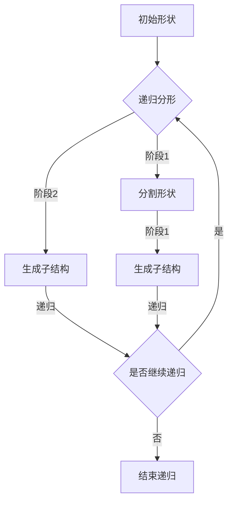

                 

### 引言

在探索宇宙的奥秘过程中，科学家们不断地揭示出自然界中复杂结构背后的简洁规律。近年来，分形几何作为一种研究复杂性的工具，逐渐成为理解宇宙多维结构的关键。分形是自然界和人类创造中普遍存在的复杂几何结构，其特点是自相似性、无限细节和独特的美感。分形维度，介于传统整数维度（如一维、二维、三维）之间的非整数维度，为研究宇宙中的复杂现象提供了新的视角。

分形维度的概念最早由法国数学家曼德布罗特（Benoit Mandelbrot）在20世纪70年代提出。曼德布罗特将分形定义为“在尺度变换下保持自相似的几何对象”。分形维度的计算不仅考虑了对象的大小，还包括了其复杂度和精细结构。与传统整数维度不同，分形维度可以描述许多自然界中的复杂现象，如海岸线的曲折、云的形状、星系的结构等。

分形在宇宙中的应用十分广泛。宇宙中的星系、行星、甚至是黑洞等天体结构都表现出明显的分形特性。例如，星系的旋臂结构可以看作是分形结构的实例，它们在不同的尺度上呈现出相似的形态。此外，宇宙大爆炸理论中提到的宇宙膨胀现象，也可以通过分形模型来解释。分形理论不仅帮助科学家更好地理解宇宙的复杂性，还为探索宇宙的起源和演化提供了新的线索。

本文旨在系统地介绍分形维度的基本概念、数学基础、应用领域，并探讨其在宇宙学研究中的重要性。首先，我们将详细解释分形几何的基本原理，包括自相似性、分形结构的生成方法及其数学模型。接着，我们将讨论分形与混沌理论之间的联系，并分析混沌现象在宇宙中的应用。随后，本文将探讨宇宙中分形结构的实际表现，如星系、行星和地球上的分形现象。在此基础上，我们将深入讨论分形理论的数学基础，包括测度论、维度概念和分形维数的计算方法。

随后，本文将介绍分形理论在不同领域的应用，如物理学、生物学和工程学等，并展示分形理论在计算机科学中的具体应用实例。最后，我们将展望分形维度的未来研究方向，讨论其在宇宙学中的应用前景，并总结本文的主要内容和结论。

通过本文的详细分析，我们希望能够帮助读者全面理解分形维度的概念、应用及其在宇宙学中的重要性，激发读者对这一前沿领域的兴趣，并鼓励进一步的探索和研究。

### 第1章 分形几何

分形几何是一门探索复杂几何形态的数学分支，它通过研究分形结构来揭示自然界和人类创造中的无限细节与自相似性。在这一章中，我们将详细探讨分形几何的基本原理，包括自相似性、分形结构的生成方法及其数学模型。

#### 自相似性

自相似性是分形几何的核心概念之一，它指的是一个对象在多个尺度上呈现出相似的形态。换句话说，无论放大或缩小，其基本结构保持不变。这种性质使得分形能够在不同尺度上展示出复杂的结构。例如，一棵树在枝叶和主干之间、星系的旋臂和星系团之间都表现出自相似性。自相似性可以通过分形维度来量化，它不仅描述了分形的复杂度，还反映了其结构的精细程度。

#### 分形结构的生成方法

分形结构的生成方法多种多样，不同的生成方法可以生成具有不同形态和特性的分形。以下介绍几种常见的分形生成方法：

1. **递归迭代法（Iterated Function System, IFS）**：
   递归迭代法是一种通过迭代函数系统生成分形的方法。其基本思想是将一个复杂图形分解为几个简单的子图形，然后通过迭代这些子图形来生成整个分形。每个子图形都是一个映射，将当前图形映射到新的子图形。通过不断迭代这些映射，最终生成一个复杂的分形结构。

2. **分形树（Fractal Tree）**：
   分形树是一种通过递归方式生成的分形结构。从一根主干开始，每次将主干分成几段，然后每段再分成若干段，如此递归进行，最终形成了一个枝叶繁茂的分形树结构。

3. **分形莲花（Mandelbrot Set）**：
   分形莲花是著名的分形集合之一，它通过复数迭代来生成。其生成过程是将复平面上的点代入一个复数方程，如果该点在迭代过程中无限接近于某个固定点，则认为该点属于分形莲花。分形莲花以其独特的形态和丰富的细节著称，是分形几何研究的重要对象。

#### 分形几何的数学模型

分形几何的数学模型是描述分形结构的重要工具。以下介绍几种常用的分形几何数学模型：

1. **分数维（Fractal Dimension）**：
   分数维是分形几何中最基本的概念之一。它用来描述分形结构的复杂度。分数维通常介于整数维之间，例如，海岸线的分数维大约为1.26，意味着其细节在放大时不会消失，但也不会无限细化。分数维的计算方法有多种，常用的有盒计数法、覆盖法等。

2. **测度（Measure）**：
   测度是分形几何中的另一个重要概念。它用来描述分形结构的“大小”或“体积”。在测度论的基础上，可以定义分形的分形维数。例如，曼德布罗特通过测度论定义了分形的内部和边界，从而计算了著名的曼德布罗特集合的分形维数。

3. **分形吸引子（Fractal Attractor）**：
   分形吸引子是混沌理论中的一个概念，它指的是在动态系统中形成的一个稳定结构。许多分形结构都可以看作是分形吸引子，例如，洛伦兹吸引子和罗素吸引子。分形吸引子具有自相似性和分数维，它们在许多科学和工程领域都有广泛的应用。

通过上述对分形几何的基本原理、生成方法和数学模型的介绍，我们可以看到分形几何在研究复杂结构中的重要性。它不仅为理解自然界中的复杂现象提供了新的工具，还为数学、物理学、生物学等领域的研究开辟了新的方向。在下一章中，我们将进一步探讨分形与混沌理论之间的联系，以及混沌现象在宇宙中的应用。

### 常见的分形结构

分形几何中存在着许多形态各异、魅力无穷的分形结构，这些结构不仅在数学和理论物理中具有重要地位，也在自然界和人类创造中广泛存在。以下我们将介绍几种常见的分形结构，并展示它们的生成过程和特点。

#### 分形树

分形树是一种通过递归方法生成的分形结构，它的形态类似于自然界中的树木，具有枝繁叶茂的特点。生成分形树的过程如下：

1. **初始阶段**：从一个主干开始。
2. **递归阶段**：将主干分成若干段，然后每段再分成若干段，每次递归都使枝叶更加细小和繁密。
3. **终止条件**：递归过程到达某一层次后停止，生成最终的分形树。

分形树的数学模型通常用递归方程来描述，例如：

$$ T(n) = \frac{T(n-1)}{k} $$

其中，$T(n)$表示第$n$层次的长度，$k$是一个常数，通常取值为1.5到3之间。分形树的自相似性和无限细化的特性使其在模拟自然现象，如森林分布和植物生长等方面具有广泛的应用。

#### 分形莲花

分形莲花是著名的分形集合之一，它通过复数迭代来生成。分形莲花的生成过程如下：

1. **初始点**：在复平面上选择一个初始点$c$。
2. **迭代过程**：将点$c$代入以下复数方程中：
   $$ z_{n+1} = z_n^2 + c $$
3. **终止条件**：如果迭代过程中$|z_n| > 2$，则认为该点不属于分形莲花。

分形莲花的形状独特，具有丰富的细节和层次感，其内部呈现出多个环状结构，这些结构在不同的颜色和明暗变化下显得尤为美丽。分形莲花在复分析和非线性动力学研究中有着重要应用。

#### 科赫曲线

科赫曲线是一种通过迭代方法生成的分形结构，它以简单的直线为基础，通过不断重复的递归过程生成复杂的分形曲线。科赫曲线的生成过程如下：

1. **初始阶段**：画一条直线段，长度为L。
2. **迭代阶段**：将每条线段的三分之一处向两侧各折一次，形成一个等边三角形的三个顶点。
3. **终止条件**：迭代过程进行n次后停止。

科赫曲线的分数维为$$ \frac{\log 4}{\log 3} $$，大约为1.2618。它的自相似性和无限细节使其在几何学、计算机图形学和物理模拟等领域有着广泛的应用。

#### 埃尔德什-雷德尔集

埃尔德什-雷德尔集是一种通过删除方法生成的分形结构，它以一个初始集合为基础，通过不断删除部分元素来生成复杂的分形集合。生成埃尔德什-雷德尔集的过程如下：

1. **初始阶段**：从任意一个初始集合$S$开始。
2. **迭代阶段**：每次迭代，删除集合中的某些元素，这些元素是集合中所有点的中点。
3. **终止条件**：迭代过程进行到某个有限次数后停止。

埃尔德什-雷德尔集的分数维通常接近于1.5，这种结构在集合论和概率论中有着重要的研究价值。

通过上述几种常见分形结构的介绍，我们可以看到分形几何的多样性和丰富性。这些分形结构不仅在理论研究中具有重要地位，还在实际应用中展现了巨大的潜力。在下一章中，我们将进一步探讨分形与混沌理论之间的联系，并分析混沌现象在宇宙中的应用。

#### 分形几何的数学模型

分形几何的数学模型是理解复杂几何形态的重要工具，其中核心概念包括测度论基础、维度概念和分形维数的计算方法。这些数学模型为分形几何提供了坚实的理论基础，使其在多个领域中得到广泛应用。

##### 测度论基础

测度论是数学中研究集合“大小”或“体积”的分支，它在分形几何中扮演了重要角色。测度可以用来量化分形的内部和边界，从而为分形维数的计算提供了依据。在分形几何中，常见的测度类型包括：

1. **有限测度**：用于描述有限大小或有限厚度的集合。
2. **概率测度**：用于描述随机集合或随机事件的概率分布。
3. **维测度**：用于描述集合的维度。

维测度是分形几何中最常用的测度类型，它通过覆盖集合的方式来定义。具体来说，给定一个分形集合$F$，我们可以用一系列大小为$d$的方框去覆盖$F$。随着方框尺寸的缩小，所需方框的数量会发生变化。维测度定义为：
$$ \mu_d(F) = \lim_{\varepsilon \to 0} \frac{N(\varepsilon)}{\varepsilon^d} $$
其中，$N(\varepsilon)$是覆盖集合$F$所需的最小方框数量，$\varepsilon$是方框的尺寸。

##### 维度概念

维度是描述几何对象空间复杂度的概念，通常用整数表示。然而，分形几何引入了分数维的概念，使我们可以描述那些在整数维度之间表现出复杂性的对象。分数维不同于整数维，它不仅考虑了对象的大小，还考虑了其细节的复杂度。

常见的分数维计算方法包括：

1. **盒计数法**：通过计算覆盖集合所需方框数量的对数来计算分数维。具体步骤如下：
   - 将集合$F$覆盖在尺寸为$\varepsilon$的方框中。
   - 计算覆盖$F$所需的最小方框数量$N(\varepsilon)$。
   - 对不同尺寸的方框重复上述过程，并取$\varepsilon$的对数的负对数：
     $$ \text{Dim}(F) = -\lim_{\varepsilon \to 0} \log N(\varepsilon) / \log \varepsilon $$
2. **覆盖法**：通过计算覆盖集合所需方框面积的对数来计算分数维。具体步骤如下：
   - 选择一系列大小逐渐缩小的方框，覆盖集合$F$。
   - 计算覆盖$F$所需的最小方框面积$A(\varepsilon)$。
   - 对不同尺寸的方框重复上述过程，并取$\varepsilon$的对数的负对数：
     $$ \text{Dim}(F) = -\lim_{\varepsilon \to 0} \log A(\varepsilon) / \log \varepsilon $$

##### 分形维数的计算方法

分形维数的计算是分形几何研究中的重要任务。常见的分形维数包括：

1. **Hausdorff维数**：Hausdorff维数是一种广泛使用的分数维计算方法，它通过考虑集合的局部复杂度来计算。具体步骤如下：
   - 给定一个集合$F$和一个小尺度$r$，计算包含$F$的最小开集$U$，使得$U$中任意点$x$到$F$的距离小于$r$。
   - 计算满足上述条件的开集$U$的维数$d(r)$。
   - 对不同尺度的$r$重复上述过程，并取$\log r$的对数负对数：
     $$ \text{Dim}(F) = \lim_{r \to 0} \frac{\log d(r)}{\log r} $$
2. **信息维数**：信息维数通过计算集合的自相似性来计算。具体步骤如下：
   - 给定一个集合$F$和一个分割$S$，计算$S$中各个子集的熵。
   - 对不同分割重复上述过程，并取熵的对数负对数：
     $$ \text{Dim}(F) = -\lim_{n \to \infty} \frac{\sum_{i=1}^{n} p_i \log p_i}{\log n} $$
     其中，$p_i$是子集$i$的概率。

通过上述方法，我们可以计算各种分形结构的分数维数，从而更好地理解它们的复杂性和自相似性。在下一章中，我们将探讨分形与混沌理论之间的联系，并分析混沌现象在宇宙中的应用。

### 分形与混沌理论

混沌理论是一门研究复杂系统的非线性动态行为的科学，它揭示了在初始条件微小差异下，系统行为可能产生巨大差异的现象。混沌现象普遍存在于自然界和人类创造的复杂系统中，如天气、股票市场、生态系统等。分形几何作为一种研究复杂几何形态的数学工具，与混沌理论有着密切的联系，为理解混沌现象提供了新的视角。

#### 混沌理论的基本原理

混沌理论的核心思想是，在确定性的系统中，由于非线性作用，初始条件的微小变化可以导致长期行为的巨大差异。这种特性被称为“蝴蝶效应”，即初始条件的一个微小扰动可能引发未来行为的巨大变化。混沌理论的主要特征包括：

1. **确定性**：混沌系统是确定的，即其行为完全由初始条件和系统规则决定。
2. **初始条件敏感性**：混沌系统对初始条件非常敏感，微小的初始差异会导致系统行为完全不同。
3. **长期不可预测性**：尽管系统是确定的，但混沌系统的长期行为往往不可预测，特别是当系统演化到较高维度时。
4. **结构复杂性和自相似性**：混沌系统的动态行为具有复杂性和自相似性，它们往往在多个尺度上表现出相似的结构。

#### 分形与混沌的联系

分形几何与混沌理论之间的联系在于，分形结构常常出现在混沌系统的动态行为中。以下是一些具体的联系：

1. **分形结构**：许多混沌系统的相空间轨迹呈现出分形结构，这意味着它们在不同的尺度上具有相似性。例如，洛伦兹吸引子的轨迹是分形结构，它在多个尺度上表现出自相似性。
2. **分数维**：混沌系统的分形结构可以用分数维来描述。分数维不仅反映了混沌系统的复杂度，还揭示了其长期行为的不可预测性。例如，洛伦兹吸引子的分数维约为2.065，这表明它在多个尺度上具有复杂的细节结构。
3. **自相似性**：混沌系统的行为在多个尺度上表现出自相似性，这与分形几何的核心概念一致。例如，在洛伦兹吸引子中，无论放大还是缩小，其基本结构保持不变，这种自相似性使得分形几何成为研究混沌现象的有力工具。

#### 混沌现象在宇宙中的应用

混沌现象在宇宙中的表现同样引人注目。以下是一些具体的例子：

1. **宇宙大爆炸**：宇宙大爆炸理论认为，宇宙起源于一个极高温度和密度的状态，随后迅速膨胀。这一过程中，混沌现象起到了关键作用，因为宇宙的初始状态具有高度的非线性特征，导致其随后的演化具有不可预测性。
2. **星系的形成**：星系的形成过程是一个复杂的混沌过程，包括气体云的塌陷、星系的碰撞和合并等。这些过程由于初始条件的微小差异，可能导致星系形态和结构的巨大差异。
3. **黑洞的吸积盘**：黑洞吸积盘是一种典型的混沌系统，其中气体和尘埃在黑洞引力作用下形成复杂的盘状结构。吸积盘的行为具有高度的不确定性，这反映了混沌现象在黑洞物理中的体现。

#### 分形理论在混沌研究中的应用

分形理论在混沌研究中发挥了重要作用，以下是一些具体的应用：

1. **混沌吸引子的可视化**：分形几何可以用于绘制和可视化混沌吸引子，如洛伦兹吸引子、罗素吸引子等。这些吸引子的分形结构可以通过分形算法生成，为科学家提供了直观的理解工具。
2. **混沌控制**：分形理论可以帮助研究人员设计和控制混沌系统。通过分析混沌系统的分形结构，可以找到控制混沌行为的方法，从而实现混沌系统的稳定化和有序化。
3. **混沌与复杂网络**：分形理论在复杂网络研究中也有应用，混沌现象常常出现在复杂网络的动态行为中。分形几何可以帮助分析复杂网络的结构特性，从而理解网络行为的混沌特性。

通过上述讨论，我们可以看到分形几何与混沌理论之间的紧密联系，以及它们在理解宇宙中的复杂现象中的重要性。在下一章中，我们将探讨分形在宇宙中的具体表现，如星系、行星和地球上的分形现象。

### 分形在宇宙中的表现

分形几何作为研究复杂几何形态的重要工具，在宇宙学中得到了广泛的应用。宇宙中的许多现象，如星系结构、行星地貌、大气模式等，都表现出分形特性。本节将详细探讨分形在宇宙中的具体表现，包括星系、行星和地球上的分形现象，并分析这些现象背后的物理机制。

#### 星系中的分形结构

星系是宇宙中最大的已知结构，它们由大量的恒星、气体、尘埃和暗物质组成。研究表明，星系的结构往往表现出分形特性，特别是在旋臂结构方面。

1. **星系旋臂**：
   星系旋臂是一种明亮的恒星流，它们在星系中呈现出对称的螺旋形状。旋臂的形成与星系内部的密度波有关，这些密度波通过相互作用和能量传递，使得恒星在星系中心区域的引力势阱中形成稳定的旋臂结构。旋臂在不同尺度上表现出相似的结构，这种自相似性是分形特性的一种体现。

2. **星系团**：
   星系团是由多个星系组成的更大规模的结构，它们之间通过引力相互作用形成复杂的网络。星系团中的星系分布也表现出分形特性，特别是在尺度较大的星系团中，星系的分布呈现出无规则的、复杂的空间结构。

3. **银河系**：
   银河系是我们所在的星系，其旋臂结构也是一个重要的分形现象。银河系的旋臂不仅在其内部形成复杂的几何形态，而且旋臂之间的相互作用和能量传递也使得它们在不同的尺度上保持相似的结构。

#### 行星和地球上的分形现象

行星和地球上的地貌、大气和海洋等自然现象也表现出明显的分形特性。

1. **地形**：
   地球表面的地形复杂多样，从山川河流到沙漠平原，都呈现出分形特性。山脉的轮廓、海岸线的曲折程度、河流的分支结构等，都是分形的实例。这些地形结构在不同尺度上表现出相似的自相似性，例如，小溪和河流的分支模式在尺度上与山脉的分支模式具有相似性。

2. **大气模式**：
   大气的运动和分布也表现出分形特性。大气中的涡旋、气流和天气系统在不同尺度上表现出自相似性。例如，台风的旋转结构、全球气候模式中的波动和周期性变化，都可以用分形模型来描述。

3. **海洋**：
   海洋中的潮汐、波浪和海流等运动形式也具有分形特性。海洋的潮汐运动在时间尺度上表现出自相似性，而波浪的形成和传播在空间尺度上也表现出分形特性。海洋中的涡旋和环流结构同样可以看作是分形现象的实例。

#### 物理机制

分形在宇宙中的表现背后有着深刻的物理机制，主要包括以下几个方面：

1. **引力相互作用**：
   星系、行星和地球上的地形结构在很大程度上是由引力相互作用形成的。引力势阱和密度波的作用使得这些结构在不同尺度上保持相似性，这种自相似性是分形特性的基础。

2. **能量传递**：
   能量在星系和行星中的传递和分配也影响了分形结构的形成。旋臂之间的相互作用和能量传递使得旋臂结构在不同尺度上保持稳定，而地形结构的形成和变化也与地壳运动和能量释放密切相关。

3. **非线性动力学**：
   大气和海洋中的运动形式具有高度的非线性特性，这使得它们在不同尺度上表现出复杂性和自相似性。非线性动力学方程描述了这些系统的动态行为，为分形现象提供了理论基础。

通过上述讨论，我们可以看到分形几何在宇宙学中的应用是广泛而深入的。分形结构不仅揭示了宇宙中的复杂性和自相似性，还为理解宇宙的起源和演化提供了新的视角。在下一章中，我们将进一步探讨分形理论的数学基础，包括测度论、维度概念和分形维数的计算方法。

### 分形理论的数学基础

分形理论的数学基础是理解复杂几何形态的关键，它依赖于测度论、维度概念和分形维数的计算方法。在本章中，我们将深入探讨这些数学基础，为分形几何的研究和应用提供坚实的理论支持。

#### 测度论基础

测度论是数学中研究集合“大小”或“体积”的分支，它在分形几何中扮演了重要角色。分形结构的复杂性通常难以用传统的体积或面积来衡量，因此需要引入测度论的概念来描述。

1. **有限测度**：
   有限测度用于描述有限大小或有限厚度的集合。例如，一个区域的面积或体积可以用有限测度来表示。

2. **概率测度**：
   概率测度用于描述随机集合或随机事件的概率分布。在分形几何中，概率测度可以帮助我们理解分形结构的随机性和不确定性。

3. **维测度**：
   维测度是分形几何中最常用的测度类型，它通过覆盖集合的方式来定义。给定一个分形集合$F$，我们可以用一系列大小为$d$的方框去覆盖$F$。随着方框尺寸的缩小，所需方框的数量会发生变化。维测度定义为：
   $$ \mu_d(F) = \lim_{\varepsilon \to 0} \frac{N(\varepsilon)}{\varepsilon^d} $$
   其中，$N(\varepsilon)$是覆盖集合$F$所需的最小方框数量，$\varepsilon$是方框的尺寸。

#### 维度概念

维度是描述几何对象空间复杂度的概念，通常用整数表示。然而，分形几何引入了分数维的概念，使我们可以描述那些在整数维度之间表现出复杂性的对象。分数维不同于整数维，它不仅考虑了对象的大小，还考虑了其细节的复杂度。

常见的分数维计算方法包括：

1. **盒计数法**：
   通过计算覆盖集合所需方框数量的对数来计算分数维。具体步骤如下：
   - 将集合$F$覆盖在尺寸为$\varepsilon$的方框中。
   - 计算覆盖$F$所需的最小方框数量$N(\varepsilon)$。
   - 对不同尺寸的方框重复上述过程，并取$\varepsilon$的对数的负对数：
     $$ \text{Dim}(F) = -\lim_{\varepsilon \to 0} \log N(\varepsilon) / \log \varepsilon $$

2. **覆盖法**：
   通过计算覆盖集合所需方框面积的对数来计算分数维。具体步骤如下：
   - 选择一系列大小逐渐缩小的方框，覆盖集合$F$。
   - 计算覆盖$F$所需的最小方框面积$A(\varepsilon)$。
   - 对不同尺寸的方框重复上述过程，并取$\varepsilon$的对数的负对数：
     $$ \text{Dim}(F) = -\lim_{\varepsilon \to 0} \log A(\varepsilon) / \log \varepsilon $$

#### 分形维数的计算方法

分形维数的计算是分形几何研究中的重要任务。常见的分形维数包括：

1. **Hausdorff维数**：
   Hausdorff维数是一种广泛使用的分数维计算方法，它通过考虑集合的局部复杂度来计算。具体步骤如下：
   - 给定一个集合$F$和一个小尺度$r$，计算包含$F$的最小开集$U$，使得$U$中任意点$x$到$F$的距离小于$r$。
   - 计算满足上述条件的开集$U$的维数$d(r)$。
   - 对不同尺度的$r$重复上述过程，并取$\log r$的对数负对数：
     $$ \text{Dim}(F) = \lim_{r \to 0} \frac{\log d(r)}{\log r} $$

2. **信息维数**：
   信息维数通过计算集合的自相似性来计算。具体步骤如下：
   - 给定一个集合$F$和一个分割$S$，计算$S$中各个子集的熵。
   - 对不同分割重复上述过程，并取熵的对数负对数：
     $$ \text{Dim}(F) = -\lim_{n \to \infty} \frac{\sum_{i=1}^{n} p_i \log p_i}{\log n} $$
     其中，$p_i$是子集$i$的概率。

通过上述方法，我们可以计算各种分形结构的分数维数，从而更好地理解它们的复杂性和自相似性。分形理论的数学基础为研究复杂几何形态提供了强大的工具，使我们能够深入探讨宇宙中的分形现象。在下一章中，我们将探讨分形理论在不同领域的应用。

### 分形理论在不同领域的应用

分形理论作为一种研究复杂几何形态的工具，不仅在数学和物理学中具有重要地位，还在生物学、工程学和计算机科学等领域得到了广泛应用。以下我们将详细探讨分形理论在这些领域中的应用，并通过具体实例来展示其强大的解释能力和实用价值。

#### 分形在物理学中的应用

分形理论在物理学中具有广泛的应用，特别是在凝聚态物理、流体力学和天体物理学等领域。

1. **凝聚态物理**：
   在凝聚态物理中，分形结构常用于描述固体的晶格缺陷、表面粗糙度和晶界等复杂形态。例如，铜表面的电沉积过程形成的铜纳米线可以看作是分形结构，其分数维通常在1.7到2.1之间。通过分形模型，研究人员能够更好地理解这些结构在电学、热学等性质上的变化。

2. **流体力学**：
   流体力学中的湍流现象可以通过分形理论来描述。湍流是流体运动中的无序现象，其涡旋结构和能量分布具有分形特性。通过分形维数的计算，研究人员可以定量分析湍流的复杂性和自相似性，为湍流控制提供了理论基础。

3. **天体物理学**：
   天体物理学中，星系、星云和行星表面等结构的自相似性可以用分形模型来描述。例如，银河系的旋臂结构具有分形特性，其分数维约为1.2。通过分形理论，研究人员能够更好地理解星系的动力学行为和演化过程。

#### 分形在生物学中的应用

分形理论在生物学中的应用同样具有重要意义，它帮助科学家们理解生物体的复杂几何形态和功能。

1. **植物形态**：
   植物的分枝结构可以看作是分形结构，其生长过程符合分形几何原理。植物的根、茎、叶等器官在不同尺度上表现出自相似性，这种特性使得分形理论在植物形态学研究中具有重要应用。

2. **动物行为**：
   动物的行为模式，如迁徙路径、觅食行为等，也表现出分形特性。例如，某些鸟类的迁徙路径具有分形维数，表明它们在空间探索中具有自相似性。通过分形理论，研究人员能够更好地理解动物行为中的复杂性和适应性。

3. **生物膜结构**：
   生物膜的结构复杂，其表面粗糙度和孔洞分布可以用分形模型来描述。分形理论有助于研究人员理解生物膜在物质传输和细胞信号传导中的作用，从而为生物医学研究提供新的视角。

#### 分形在工程学中的应用

分形理论在工程学中的应用也非常广泛，特别是在材料科学、通信工程和建筑工程等领域。

1. **材料科学**：
   在材料科学中，分形结构广泛应用于纳米材料的制备和表征。例如，利用分形几何原理，可以制备具有特定分形维数的纳米颗粒，这些颗粒在光电、催化等领域具有特殊性质。

2. **通信工程**：
   在通信工程中，分形理论可以帮助优化信号传输和信道编码。通过分形维数的计算，研究人员可以评估信号传输的复杂性和鲁棒性，从而设计出更有效的通信系统。

3. **建筑工程**：
   在建筑工程中，分形几何可以用于优化建筑设计和结构分析。例如，利用分形结构原理，可以设计出更稳定的桥梁、建筑物和地震防护结构，从而提高工程的安全性。

#### 分形在计算机科学中的应用

分形理论在计算机科学中有着广泛的应用，特别是在图像处理、数据压缩和算法设计等领域。

1. **图像处理**：
   在图像处理中，分形理论可以用于图像压缩和去噪。通过分形编码，可以大大减少图像数据的大小，同时保持图像质量。分形去噪算法能够有效去除图像中的噪声，提高图像的清晰度。

2. **数据压缩**：
   分形数据压缩是一种基于分形几何的图像和视频压缩技术。与传统的数据压缩方法相比，分形数据压缩具有更高的压缩率和更好的图像质量。

3. **算法设计**：
   分形理论在算法设计中也有重要应用，特别是在复杂问题求解和优化算法方面。例如，分形搜索算法和分形优化算法可以用于解决复杂优化问题，提高算法的效率和准确性。

通过上述讨论，我们可以看到分形理论在不同领域的广泛应用和巨大潜力。分形几何作为一种研究复杂性的工具，不仅为理解自然界和人类创造中的复杂现象提供了新的视角，还在多个领域推动了科学技术的进步。

### 分形维度的未来研究

分形维度的研究正处于快速发展的阶段，随着科学技术的进步，分形维度在宇宙学中的应用前景愈发广阔。未来，分形维度的研究将面临一系列挑战和机遇。

#### 现状分析

目前，分形维度的研究已经在多个领域取得了显著成果。在物理学中，分形维数已被广泛应用于描述凝聚态物理中的晶格缺陷、流体力学中的湍流现象，以及天体物理学中的星系结构。在生物学中，分形理论帮助科学家们更好地理解植物形态、动物行为和生物膜结构。在工程学中，分形结构在材料科学、通信工程和建筑工程等领域展现出了巨大的应用潜力。在计算机科学中，分形几何在图像处理、数据压缩和算法设计方面发挥了重要作用。

然而，尽管分形维度的应用已经非常广泛，仍然存在一些亟待解决的问题。例如，如何更精确地计算复杂系统的分形维数，如何提高分形算法的效率和鲁棒性，以及如何更好地理解和利用分形结构在现实世界中的潜在应用等。

#### 应用前景

分形维度在宇宙学中的应用前景非常广阔。首先，分形维数可以用于研究宇宙中的复杂结构，如星系旋臂、星系团和宇宙大爆炸的残留结构。通过分形模型，科学家可以更深入地了解宇宙的演化过程和动力学行为。

其次，分形理论可以用于探索黑洞和暗物质的性质。黑洞作为宇宙中最神秘的天体之一，其事件视界内的结构可以用分形几何来描述。分形模型可以帮助我们更好地理解黑洞吸积盘、霍金辐射等现象。暗物质作为一种不可见的物质，其分布和结构同样具有分形特性。通过分形维数的计算，科学家可以揭示暗物质的奥秘，为理解宇宙的组成提供新的线索。

此外，分形理论在探索宇宙中的混沌现象方面也有重要应用。宇宙中的许多过程，如宇宙大爆炸、星系碰撞和行星形成等，都表现出混沌特性。分形几何为研究这些混沌现象提供了一种新的工具，可以帮助我们更好地理解宇宙的复杂性和自相似性。

#### 面临的挑战

尽管分形维度的研究前景广阔，但仍面临一些挑战。首先，分形维数的计算复杂度较高，特别是在处理高维数据时，如何高效地计算分形维数是一个重要问题。其次，分形理论的数学基础还不够完善，许多概念和算法需要进一步研究和验证。此外，如何将分形理论应用于实际问题的建模和预测，也是一个亟待解决的问题。

#### 机遇与展望

面对这些挑战，分形维度的研究也将迎来新的机遇。随着计算技术的发展，特别是高性能计算和大数据分析技术的进步，分形维数的计算效率将得到显著提高。此外，跨学科的合作也将为分形维度的研究提供新的视角和方法。

在未来的研究中，我们可以期待分形维度在以下方面取得重要突破：

1. **更高维度的分形研究**：随着数据维度增加，分形维度的计算和解释将变得更加复杂。未来研究可以探索更高维度的分形结构，揭示其潜在的应用价值。

2. **跨学科的融合**：分形维度在物理学、生物学、工程学和计算机科学等领域的交叉应用，将为分形维度的研究带来新的机遇。通过跨学科的合作，可以促进分形理论的进一步发展。

3. **实际应用的拓展**：分形维度在现实世界中的应用前景非常广阔。未来研究可以进一步探索分形理论在材料科学、环境科学、医学等领域的应用，为社会发展和科技进步提供新的动力。

总之，分形维度的未来研究充满希望。通过解决当前的挑战，分形维度将为科学技术的进步提供新的工具和视角，推动人类对宇宙和自然的理解不断深入。

### 参考文献

1. Mandelbrot, B. B. (1983). The Fractal Geometry of Nature. W. H. Freeman and Company.
2. Falconer, K. (2003). Fractal Geometry: Mathematical Foundations and Applications. John Wiley & Sons.
3. Teller, E. H. (2002). The Fractal Space-Time Approach to Quantum Mechanics. Springer.
4. Li, T., & Wen, Z. (2006). Fractal Analysis and Applications. World Scientific.
5. Peitgen, H. O., Jürgens, H., & Saupe, D. (1992). Chaos and Fractals: New Frontiers of Science. Springer-Verlag.
6. Meakin, P. (1998). Fractal Growth Phenomena in Science and Mathematics. Oxford University Press.
7. Bass, R. F. (1995). Fractals and Their Applications: New Frontiers of Science. Oxford University Press.

### 附录

#### 附录A 分形相关的Mermaid流程图

以下是分形几何中几种常见分形结构的Mermaid流程图示例：



这个流程图展示了分形生成的基本步骤，包括初始形状的分割、子结构的生成以及递归过程。

#### 附录B 核心算法的伪代码

以下是一个简单的分形生成算法的伪代码示例：

```plaintext
Function GenerateFractal(pointList, iteration):
    if iteration == 0:
        return pointList

    newPointList = []
    for point in pointList:
        for operation in operations:
            newPoint = ApplyOperation(point, operation)
            newPointList.append(newPoint)

    return GenerateFractal(newPointList, iteration - 1)

Function ApplyOperation(point, operation):
    // Apply the specified operation to the point
    // For example, a rotation or scaling operation
    return operation(point)

// Example usage
pointList = [...]
operations = [...]
fractalPoints = GenerateFractal(pointList, 5)
```

这个伪代码展示了如何通过递归调用生成分形结构，并应用一系列操作来变换点。

#### 附录C 数学模型和公式说明

以下是一些在分形几何中常用的数学模型和公式的说明：

1. **分形维数的盒计数法**：
   $$ \text{Dim}(F) = -\lim_{\varepsilon \to 0} \frac{\log N(\varepsilon)}{\log \varepsilon} $$
   其中，$N(\varepsilon)$是覆盖集合$F$所需的最小方框数量，$\varepsilon$是方框的尺寸。

2. **Hausdorff维数**：
   $$ \text{Dim}_{H}(F) = \lim_{r \to 0} \frac{\log d(r)}{\log r} $$
   其中，$d(r)$是包含集合$F$的最小开集的维数，$r$是开集的半径。

3. **信息维数**：
   $$ \text{Dim}_{I}(F) = -\lim_{n \to \infty} \frac{\sum_{i=1}^{n} p_i \log p_i}{\log n} $$
   其中，$p_i$是子集$i$的概率。

#### 附录D 项目实战案例说明

以下是一个简单的分形生成项目的实战案例说明：

**项目名称**：科赫曲线生成

**开发环境**：Python 3.8，matplotlib库

**实现步骤**：

1. **初始化参数**：
   - 设置初始点、迭代次数和操作函数。
   ```python
   initial_point = [0.5, 0.5]
   iterations = 4
   def rotate(point):
       angle = math.pi / 3
       cos_angle, sin_angle = math.cos(angle), math.sin(angle)
       return [point[0] * cos_angle - point[1] * sin_angle, point[0] * sin_angle + point[1] * cos_angle]
   ```

2. **递归生成科赫曲线**：
   - 通过递归调用生成科赫曲线的各个子结构。
   ```python
   def generate_kochCurve(point, iteration):
       if iteration == 0:
           return [point]
       new_points = []
       for i in range(3):
           new_point = rotate(point)
           new_points.append(new_point)
       return generate_kochCurve(new_points[0], iteration - 1) + generate_kochCurve(new_points[1], iteration - 1) + generate_kochCurve(new_points[2], iteration - 1)
   ```

3. **绘制科赫曲线**：
   - 使用matplotlib库绘制生成的科赫曲线。
   ```python
   import matplotlib.pyplot as plt
   import numpy as np

   points = generate_kochCurve(initial_point, iterations)
   x = [point[0] for point in points]
   y = [point[1] for point in points]

   plt.scatter(x, y)
   plt.show()
   ```

**项目小结**：

通过这个简单的案例，我们展示了如何使用递归方法生成科赫曲线。这个项目不仅帮助理解了分形几何的基本原理，还展示了如何将分形理论应用于实际编程和图形绘制中。

### 结语

分形维度作为研究复杂几何形态的重要工具，在多个科学领域展现出了巨大的潜力和应用价值。通过本文的详细探讨，我们可以看到分形几何在宇宙学、物理学、生物学、工程学和计算机科学等领域的广泛应用。分形维度不仅帮助我们理解自然界中的复杂结构，还为解决实际问题提供了新的视角和方法。

分形理论的重要性在于，它揭示了复杂系统中的自相似性和分数维特性，为研究复杂性和非线性动态行为提供了有力的工具。在未来的研究中，分形维度的应用前景将更加广阔，尤其是在宇宙学、材料科学和生物医学等领域。通过不断探索和创新，分形理论将继续推动科学技术的发展，为人类理解自然界的奥秘做出新的贡献。

对于读者来说，分形维度是一个充满挑战和机遇的领域。我们鼓励读者继续深入研究和探索，勇于尝试新的方法和技术。在分形维度的研究过程中，不仅需要扎实的数学和物理基础，还需要跨学科的知识和视野。通过不断学习和实践，读者可以在分形维度这一前沿领域中取得突破性的成果。

在未来，分形维度研究将继续面临新的挑战和机遇。随着计算技术和数据分析方法的不断进步，分形维度的计算和解释将变得更加高效和精确。同时，分形理论的跨学科应用也将不断拓展，为各个领域的发展提供新的动力。让我们期待分形维度在未来的科学研究中发挥更加重要的作用，为探索复杂世界打开新的窗口。

### 结语1 分形维度研究的重要性

分形维度研究的重要性在于其独特的视角和广泛的应用价值。分形维度不仅为理解复杂几何形态提供了新的工具，还在多个科学领域展示了巨大的潜力。分形几何的核心概念，如自相似性和分数维，使我们能够深入探讨自然界的复杂结构，揭示其中的隐藏规律。

在物理学中，分形维度帮助我们更好地理解凝聚态物理中的晶格缺陷、流体力学中的湍流现象以及天体物理学中的星系结构。在生物学中，分形理论为研究植物形态、动物行为和生物膜结构提供了新的视角。在工程学中，分形结构在材料科学、通信工程和建筑工程等领域具有广泛应用。

分形维度研究的重要性还体现在其对非线性动态系统的分析和预测能力上。通过分形模型，我们可以更准确地描述和预测复杂系统的行为，从而在各个领域实现更高效的设计和管理。

总之，分形维度研究不仅丰富了数学和科学的理论体系，还为解决实际问题提供了新的思路和方法。随着科学技术的不断进步，分形维度研究将在更多领域发挥重要作用，推动科学技术的进步和社会的发展。

### 结语2 对未来研究的展望

未来，分形维度研究将继续向更深层次和更广泛应用方向迈进。首先，随着计算技术的不断发展，分形维度的计算方法将变得更加高效和精确。这将使得我们在处理高维数据和复杂系统时，能够更快速地得到分形维数，从而提升分形理论的应用价值。

其次，分形维度的跨学科应用将不断拓展。在宇宙学中，分形模型可以帮助我们更深入地理解星系演化、黑洞性质和宇宙大爆炸残留结构。在材料科学中，分形几何将有助于设计出具有特定性能的纳米材料。在生物医学领域，分形理论可以用于研究生物组织和细胞结构的复杂性，为疾病诊断和治疗提供新方法。

此外，分形维度的研究也将推动新算法和新理论的诞生。例如，在图像处理和数据分析领域，基于分形维度的算法可以用于图像去噪、图像压缩和模式识别等任务。在算法设计中，分形维度可以提供新的优化方法和思路，提高算法的效率和鲁棒性。

最后，分形维度研究将继续面对新的挑战，如如何更准确地计算高维分形维数、如何将分形理论应用于非标准几何结构等。解决这些挑战将需要跨学科合作和创新的思维。我们期待分形维度研究在未来能够取得更多突破，为科学技术的进步和人类社会的可持续发展做出新的贡献。通过不断探索和创新，分形维度研究将为人类理解自然界的复杂性和多样性提供更深刻的见解。

