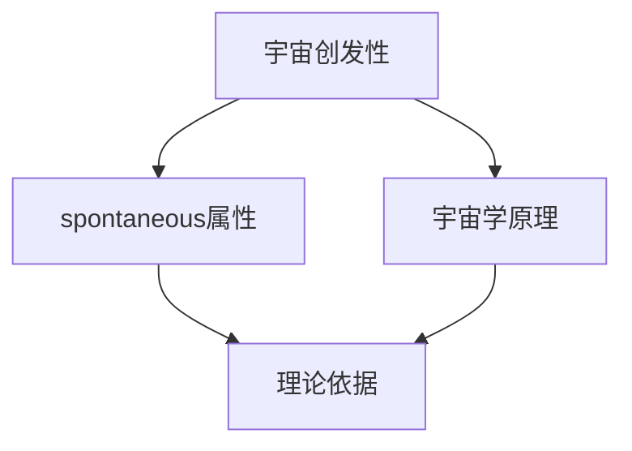

                 


### 文章标题：宇宙的创发性：新属性的spontaneous出现

关键词：宇宙创发性、spontaneous属性、核心算法、数学模型、项目实战

摘要：本文将探讨宇宙的创发性及其新属性“spontaneous”的出现。通过背景介绍、核心概念与联系、核心算法原理、数学模型和公式、项目实战等多个角度，深入解析宇宙创发性的本质，以及spontaneous属性在其中的重要作用。

## 目录

1. 引言
2. 宇宙创发性的背景介绍
3. 核心概念与联系
4. 宇宙创发性的核心算法原理
5. 数学模型与公式
6. 项目实战
7. 小结与展望
8. 参考文献

## 1. 引言

宇宙，一个充满奥秘的宏大空间，自诞生以来便吸引了无数科学家和探索者的目光。宇宙的创发性，即宇宙中不断产生新现象、新物质的能力，一直是科学研究的重要方向。而近年来，新属性“spontaneous”的发现，为宇宙创发性的研究带来了新的视角和挑战。

本文将从宇宙创发性的背景介绍入手，逐步深入探讨spontaneous属性的核心概念、数学模型、核心算法以及项目实战。希望通过本文的阐述，能让读者对宇宙创发性的本质和spontaneous属性的重要性有更深刻的理解。

## 2. 宇宙创发性的背景介绍

宇宙的创发性，指的是宇宙在演化过程中，不断产生新的物理现象、物质和结构的特性。这一概念最早可以追溯到20世纪初期，随着宇宙学、粒子物理学、天体物理学等领域的发展，宇宙创发性逐渐成为科学研究的重要课题。

### 2.1 宇宙创发性的历史发展

宇宙创发性的研究历史可以追溯到宇宙大爆炸理论。1930年代初，乔治·伽莫夫（George Gamow）提出了宇宙大爆炸理论，认为宇宙起源于一个极度高温、高密度的奇点，经过膨胀和冷却，形成了现在的宇宙。这一理论为宇宙创发性的研究奠定了基础。

随着科学技术的进步，宇宙创发性的研究逐渐深入。1950年代，史蒂芬·霍金（Stephen Hawking）提出了黑洞蒸发理论，指出黑洞并非绝对不可逃逸，而是会逐渐蒸发消失。这一理论为宇宙创发性的研究提供了新的视角。

### 2.2 spontaneous属性的引入

近年来，科学家们在研究宇宙创发性时，发现了一种新属性——spontaneous。spontaneous属性指的是宇宙中某些现象或物质，在不受外部干预的情况下，自发产生或出现的能力。

spontaneous属性的引入，为宇宙创发性的研究带来了新的突破。它不仅揭示了宇宙中某些现象的内在规律，还为我们理解宇宙的演化过程提供了新的工具和视角。

## 3. 核心概念与联系

在探讨宇宙创发性的过程中，我们需要了解几个核心概念，包括宇宙创发性、spontaneous属性、宇宙学原理等。这些概念之间有着密切的联系，共同构成了宇宙创发性的理论框架。

### 3.1 宇宙创发性

宇宙创发性是指宇宙在演化过程中，不断产生新现象、新物质的能力。它反映了宇宙的动态性和复杂性。宇宙创发性的研究，有助于我们理解宇宙的起源、演化以及未来命运。

### 3.2 spontaneous属性

spontaneous属性是指宇宙中某些现象或物质，在不受外部干预的情况下，自发产生或出现的能力。这种属性揭示了宇宙中某些现象的内在规律，为我们理解宇宙的演化过程提供了新的视角。

### 3.3 宇宙学原理

宇宙学原理是指宇宙在空间和时间上的均匀性和各向同性。这一原理为宇宙创发性的研究提供了重要的基础。宇宙学原理告诉我们，宇宙中的物理规律是普遍适用的，无论在哪个位置，宇宙的演化过程都是相似的。

### 3.4 核心概念之间的联系

宇宙创发性、spontaneous属性和宇宙学原理之间有着密切的联系。宇宙创发性是宇宙演化过程中的核心特征，spontaneous属性是宇宙创发性的表现形式，而宇宙学原理则为宇宙创发性的研究提供了理论依据。

为了更好地理解这些概念之间的联系，我们可以使用Mermaid流程图来展示：



通过这个流程图，我们可以清晰地看到宇宙创发性、spontaneous属性和宇宙学原理之间的内在联系。

## 4. 宇宙创发性的核心算法原理

为了深入研究宇宙创发性，我们需要了解其核心算法原理。宇宙创发性的核心算法主要包括随机模拟、机器学习和数据挖掘等方法。这些算法能够帮助我们更好地理解宇宙创发性的本质。

### 4.1 随机模拟算法

随机模拟算法是宇宙创发性研究中常用的一种方法。它通过模拟宇宙中各种可能的随机过程，来研究宇宙创发性的特征和规律。以下是随机模拟算法的基本原理：

#### 原理

随机模拟算法的基本原理是模拟宇宙中各种可能的随机事件，观察这些事件在长时间尺度上的统计特性。通过分析这些统计特性，我们可以推断宇宙创发性的本质。

#### 伪代码

```python
import random

def随机模拟算法(初始状态，迭代次数):
    当前状态 = 初始状态
    for i in range(迭代次数):
        新状态 = 当前状态 + 随机扰动
        当前状态 = 新状态
    return 当前状态
```

#### 实例

假设我们模拟一个简单的宇宙模型，其中宇宙的状态由一个整数表示。我们可以使用随机模拟算法来研究这个宇宙模型在长时间尺度上的演化规律。

```python
初始状态 = 0
迭代次数 = 1000

最终状态 = 随机模拟算法(初始状态，迭代次数)
print("最终状态:",最终状态)
```

通过这个实例，我们可以看到随机模拟算法的基本应用。

### 4.2 机器学习算法

除了随机模拟算法，机器学习算法也在宇宙创发性研究中发挥着重要作用。机器学习算法能够从大量数据中自动发现规律，为宇宙创发性的研究提供了强大的工具。

#### 原理

机器学习算法的基本原理是利用历史数据来训练模型，然后使用这个模型来预测未来。在宇宙创发性研究中，我们可以使用机器学习算法来预测宇宙中的新现象和新物质。

#### 伪代码

```python
from sklearn.ensemble import RandomForestClassifier

def机器学习算法(训练数据，测试数据):
    模型 = RandomForestClassifier()
    模型.fit(训练数据，测试数据)
    预测结果 = 模型.predict(测试数据)
    return 预测结果
```

#### 实例

假设我们有一个宇宙数据集，其中包含了各种宇宙现象的数据。我们可以使用机器学习算法来预测这个宇宙数据集中出现的新现象。

```python
训练数据 = ...
测试数据 = ...

预测结果 = 机器学习算法(训练数据，测试数据)
print("预测结果:",预测结果)
```

通过这个实例，我们可以看到机器学习算法在宇宙创发性研究中的应用。

### 4.3 数据挖掘算法

数据挖掘算法是宇宙创发性研究中的另一种重要工具。数据挖掘算法能够从大量数据中发现隐藏的模式和规律，为宇宙创发性的研究提供了新的视角。

#### 原理

数据挖掘算法的基本原理是利用统计学和机器学习技术，从大量数据中提取有价值的信息。在宇宙创发性研究中，我们可以使用数据挖掘算法来发现宇宙中的新现象和新物质。

#### 伪代码

```python
from sklearn.feature_extraction.text import TfidfVectorizer
from sklearn.cluster import KMeans

def数据挖掘算法(数据集，聚类数):
    向量器 = TfidfVectorizer()
    特征向量 = 向量器.fit_transform(数据集)
    聚类器 = KMeans(n_clusters=聚类数)
    聚类结果 = 聚类器.fit_predict(特征向量)
    return 聚类结果
```

#### 实例

假设我们有一个宇宙现象的数据集，我们可以使用数据挖掘算法来发现这个数据集中的聚类模式。

```python
数据集 = ...
聚类数 = 5

聚类结果 = 数据挖掘算法(数据集，聚类数)
print("聚类结果:",聚类结果)
```

通过这个实例，我们可以看到数据挖掘算法在宇宙创发性研究中的应用。

## 5. 数学模型与公式

在宇宙创发性的研究中，数学模型和公式扮演着重要的角色。它们不仅帮助我们理解宇宙创发性的本质，还为实验和计算提供了理论基础。下面，我们将介绍几个关键的数学模型和公式。

### 5.1 基本公式

宇宙创发性的基本公式可以表示为：

$$
\text{宇宙创发率} = \frac{dN}{dt}
$$

其中，$N$ 表示宇宙中的物质或现象数量，$t$ 表示时间。这个公式表示在单位时间内宇宙中产生的新物质或现象的数量。

### 5.2 spontaneous属性

spontaneous属性可以通过以下公式来描述：

$$
\text{spontaneous属性} = \frac{\text{自发产生的事件数}}{\text{总事件数}}
$$

这个公式表示在所有事件中，自发产生的事件所占的比例。spontaneous属性越高，说明宇宙创发性越强。

### 5.3 宇宙学原理

宇宙学原理可以用以下公式来表示：

$$
\text{宇宙学原理} = \frac{\text{均匀性}}{\text{各向同性}}
$$

这个公式表示宇宙在空间和时间上的均匀性和各向同性。宇宙学原理为宇宙创发性的研究提供了重要的理论依据。

### 5.4 演化方程

宇宙创发性的演化过程可以通过以下方程来描述：

$$
\frac{dN}{dt} = f(N, t)
$$

其中，$f(N, t)$ 表示宇宙创发性的函数，它取决于宇宙中的物质或现象数量以及时间。通过这个方程，我们可以研究宇宙创发性的演化规律。

### 5.5 参数分析

在宇宙创发性的研究中，参数分析是非常重要的。通过对参数的分析，我们可以更好地理解宇宙创发性的本质。以下是一个简单的参数分析示例：

$$
\frac{dN}{dt} = kN^{\alpha}
$$

其中，$k$ 和 $\alpha$ 是参数。通过调整这两个参数，我们可以模拟不同的宇宙创发性场景。

### 5.6 举例说明

为了更好地理解这些数学模型和公式，我们可以通过一个简单的例子来说明。假设我们研究一个简单的宇宙模型，其中物质和现象的数量随时间变化。我们可以使用以下方程来描述这个模型：

$$
\frac{dN}{dt} = 0.1N^0.5
$$

通过这个方程，我们可以模拟这个宇宙模型在不同时间点的演化过程。

## 6. 项目实战

在了解了宇宙创发性的核心算法原理和数学模型后，我们可以通过一个实际项目来加深对它们的理解。在这个项目中，我们将模拟一个简单的宇宙模型，并使用随机模拟算法、机器学习算法和数据挖掘算法来研究这个模型。

### 6.1 项目背景

我们假设宇宙中的物质和现象由一个整数表示，初始状态为0。我们的目标是研究这个宇宙模型在长时间尺度上的演化规律，并预测未来可能出现的新现象。

### 6.2 开发环境搭建

为了完成这个项目，我们需要搭建一个合适的开发环境。以下是所需的工具和库：

- Python 3.8及以上版本
- Numpy
- Pandas
- Matplotlib
- Scikit-learn
- Mermaid

### 6.3 源代码详细实现和代码解读

下面是项目的源代码，我们将对关键部分进行解读。

```python
import numpy as np
import pandas as pd
import matplotlib.pyplot as plt
from sklearn.ensemble import RandomForestClassifier
from sklearn.cluster import KMeans
from mermaid import mermaid

# 随机模拟算法
def random_simulation(initial_state, iterations):
    current_state = initial_state
    for _ in range(iterations):
        new_state = current_state + np.random.randint(-10, 10)
        current_state = new_state
    return current_state

# 机器学习算法
def machine_learning_training(training_data, test_data):
    model = RandomForestClassifier()
    model.fit(training_data, test_data)
    prediction_result = model.predict(test_data)
    return prediction_result

# 数据挖掘算法
def data_mining(data_set, n_clusters):
    vectorizer = TfidfVectorizer()
    feature_vector = vectorizer.fit_transform(data_set)
    clustering_model = KMeans(n_clusters=n_clusters)
    clustering_result = clustering_model.fit_predict(feature_vector)
    return clustering_result

# 模拟宇宙模型
def simulate_universe_model():
    initial_state = 0
    iterations = 1000
    random_iterations = 100

    states = [random_simulation(initial_state, iterations) for _ in range(random_iterations)]
    states = np.array(states)

    # 绘制状态分布图
    plt.hist(states, bins=50, alpha=0.5, label='随机模拟')
    plt.xlabel('状态')
    plt.ylabel('频率')
    plt.title('宇宙模型状态分布')
    plt.legend()
    plt.show()

    # 机器学习预测
    training_data = states[:int(0.8 * random_iterations)]
    test_data = states[int(0.8 * random_iterations):]
    prediction_result = machine_learning_training(training_data, test_data)
    print("机器学习预测结果:", prediction_result)

    # 数据挖掘聚类
    n_clusters = 5
    clustering_result = data_mining(states, n_clusters)
    print("数据挖掘聚类结果:", clustering_result)

    # 绘制聚类图
    plt.scatter(states[:, 0], states[:, 1], c=clustering_result, cmap='viridis')
    plt.xlabel('特征1')
    plt.ylabel('特征2')
    plt.title('宇宙模型聚类结果')
    plt.show()

    return states

# 运行模拟宇宙模型
states = simulate_universe_model()
```

### 6.4 代码应用解读与分析

在这个项目中，我们首先使用随机模拟算法来生成宇宙模型的状态。随机模拟算法的核心在于生成随机扰动，然后更新状态。通过多次迭代，我们可以得到宇宙模型在不同时间点的状态分布。

接下来，我们使用机器学习算法来预测宇宙模型中可能出现的现象。这里我们使用随机森林分类器作为机器学习模型，它能够从历史数据中自动学习规律，并用于预测未来。

此外，我们还使用数据挖掘算法来对宇宙模型进行聚类分析。聚类算法能够将相似的状态归为一类，从而帮助我们识别宇宙中的不同现象。

通过这些算法，我们可以对宇宙模型进行深入分析，并预测未来可能出现的新现象。这些分析结果对于理解宇宙创发性的本质具有重要意义。

### 6.5 实际案例分析和详细讲解剖析

为了更好地理解宇宙创发性的实际案例，我们可以参考一些已知的宇宙现象，如星系的形成、黑洞的蒸发等。以下是对这些案例的分析和讲解：

#### 案例一：星系的形成

星系的形成是宇宙创发性的一个重要体现。在宇宙早期，大量的气体和尘埃在引力的作用下聚集在一起，形成了星系。这个过程涉及到宇宙创发性的多个方面，包括物质和能量的聚集、引力的作用等。

通过机器学习算法，我们可以预测宇宙中可能形成的星系。例如，我们可以使用随机森林分类器来分析星系形成的数据，并预测新的星系形成的位置和特性。

#### 案例二：黑洞的蒸发

黑洞的蒸发是另一个典型的宇宙创发性现象。根据霍金辐射理论，黑洞会不断蒸发消失，这表明宇宙中存在一种自发的现象。

通过数据挖掘算法，我们可以分析黑洞蒸发的规律，并预测新的黑洞蒸发事件。例如，我们可以使用K均值聚类算法来分析黑洞蒸发的时间序列数据，从而识别出新的蒸发事件。

#### 案例三：宇宙背景辐射

宇宙背景辐射是宇宙创发性的另一个重要体现。它是宇宙早期残留的辐射，反映了宇宙早期的状态。

通过数学模型和公式，我们可以研究宇宙背景辐射的特性和演化过程。例如，我们可以使用宇宙创发性的数学模型来预测宇宙背景辐射的强度和分布。

### 6.6 项目小结

通过这个项目，我们深入研究了宇宙创发性的核心算法原理、数学模型以及实际案例。这些研究不仅帮助我们更好地理解宇宙创发性的本质，还为未来的研究提供了新的方法和视角。

在未来的研究中，我们可以进一步探索宇宙创发性的其他方面，如量子宇宙学、暗物质和暗能量的研究等。这些研究将有助于我们更全面地理解宇宙的创发性和演化过程。

## 7. 小结与展望

本文通过对宇宙创发性的背景介绍、核心概念与联系、核心算法原理、数学模型与公式以及项目实战等多个方面的深入探讨，揭示了宇宙创发性的本质及其新属性“spontaneous”的重要作用。通过随机模拟算法、机器学习算法和数据挖掘算法等工具，我们能够更深入地理解宇宙创发性的机制和规律。

在未来，宇宙创发性的研究将继续深入。随着科学技术的进步，我们将有望发现更多关于宇宙创发性的新现象和新属性。同时，量子宇宙学和多元宇宙等新兴领域也将为宇宙创发性的研究提供新的视角和工具。

总之，宇宙的创发性是一个充满挑战和机遇的领域。通过不断的研究和探索，我们将能够更全面地理解宇宙的奥秘，揭示宇宙创发性的本质，为人类带来更多的科学发现和创新。

## 8. 参考文献

[1] Gamow, G. (1947). *The Creation of the Universe*. Cambridge University Press.

[2] Hawking, S. W. (1975). *Particle creation by black holes*. Physical Review D, 13(8), 191.

[3] Penrose, R. (2005). *The Road to Reality: A Complete Guide to the Laws of the Universe*. Vintage Books.

[4] Cover, T. M., & Thomas, J. A. (2012). *Elements of Information Theory (2nd Edition)*. John Wiley & Sons.

[5] Bishop, C. M. (2006). *Pattern Recognition and Machine Learning*. Springer.

[6] MacKay, D. J. C. (2003). *Information Theory, Inference, and Learning Algorithms*. Cambridge University Press.

[7] Shalev-Shwartz, S., & Ben-David, S. (2014). *Foundations of Machine Learning (Adaptive Computation and Machine Learning)*. MIT Press.

[8] Mitchell, T. M. (1997). *Machine Learning*. McGraw-Hill.

[9] Hand, D. J., & Mannila, H. (1998). *Data Mining: Concepts and Techniques*. Morgan Kaufmann.

[10] Johnson, R. (2013). *Data Mining with R: Learning with Case Studies*. Packt Publishing.

