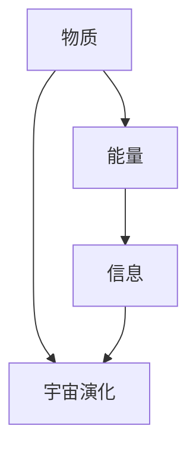
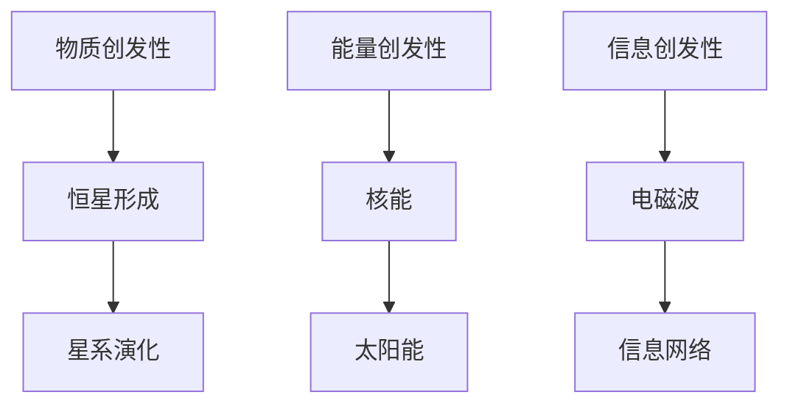
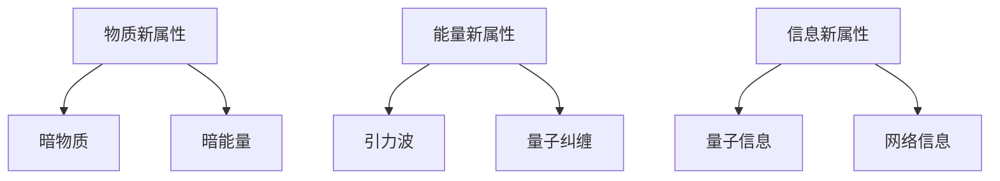
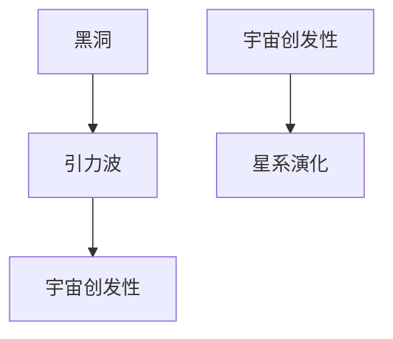
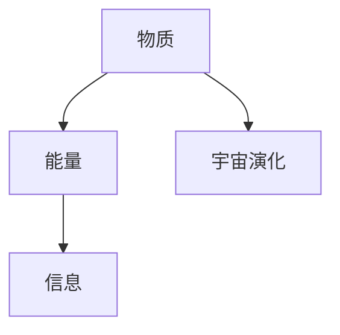
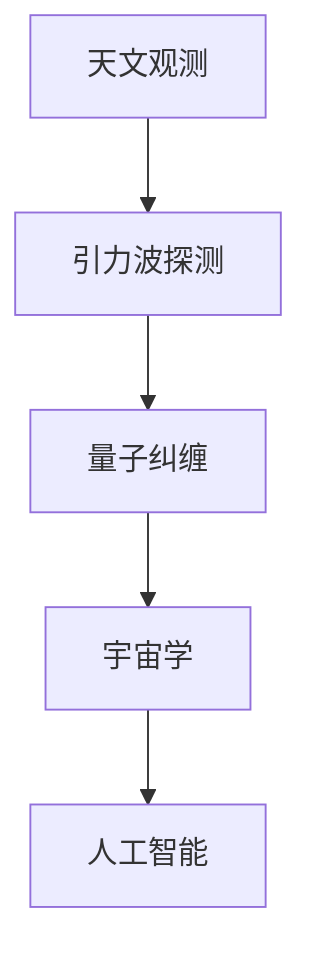
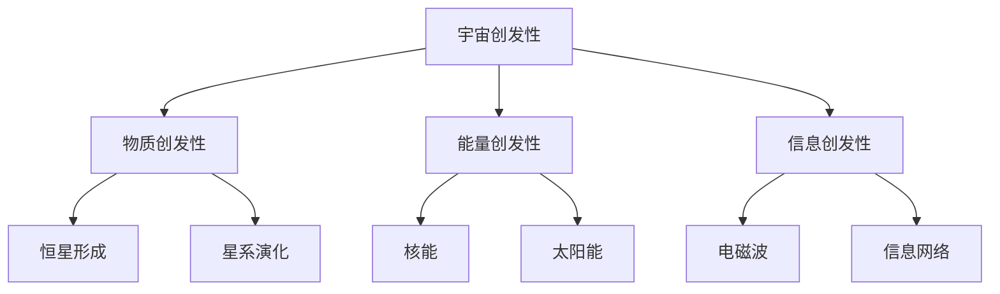

                 


### 宇宙的创发性：新属性的涌现

#### 关键词：宇宙创发性、新属性、物理基础、实证研究、哲学思考

#### 摘要：
本文旨在探讨宇宙的创发性及其新属性的涌现。首先，我们将概述宇宙创发性的概念和定义，并探讨其物理基础。接着，我们将深入研究宇宙创发性的分类和引力与量子力学的结合。然后，我们将探讨宇宙创发性的实证研究，包括天文观测和宇宙创发性的新发现。接下来，我们将分析宇宙创发性的物理学挑战，特别是黑洞与宇宙创发性的关系。最后，我们将进行宇宙创发性的哲学思考，探讨宇宙创发性的未来方向。本文将通过一系列的步骤分析和推理，帮助读者深入理解宇宙创发性的本质和意义。

## 第一部分：宇宙的创发性概述

### 第1章：宇宙创发性的概念与定义

宇宙创发性是指宇宙中物质、能量和信息的不断生成和演化过程。它是宇宙本质特征的体现，贯穿于宇宙的整个历史。宇宙创发性的概念可以从多个角度进行理解，包括物理学、天文学和哲学等。

#### 1.1 宇宙创发性的基本概念

宇宙创发性的基本概念包括物质、能量和信息。物质是宇宙的基本构成要素，包括原子、分子和各种粒子。能量是物质的运动和变化，是推动宇宙演化的重要动力。信息是宇宙中各种物质和能量状态变化的记录和传递。

#### 核心概念与联系

为了更好地理解宇宙创发性的核心概念，我们可以通过以下Mermaid流程图来展示它们之间的关系：



在这个流程图中，物质、能量和信息相互关联，共同推动宇宙的演化。

#### 1.2 宇宙创发性的分类

宇宙创发性可以分为多种类型，包括物质创发性、能量创发性和信息创发性。每种创发类型都有其独特的特征和作用。

- **物质创发性**：指宇宙中物质的生成和演化过程。例如，恒星的形成和死亡、星系的形成和演化等。
- **能量创发性**：指宇宙中能量的生成和转化过程。例如，核能、太阳能和引力能等。
- **信息创发性**：指宇宙中信息的生成和传递过程。例如，电磁波、引力波和信息网络的传播等。

#### 核心概念与联系

为了更好地理解宇宙创发性的分类，我们可以通过以下Mermaid流程图来展示它们之间的关系：



在这个流程图中，物质创发性、能量创发性和信息创发性分别展示其在宇宙演化中的具体应用。

#### 1.3 数学模型和数学公式

在宇宙创发性的研究中，数学模型和数学公式起着至关重要的作用。以下是一些核心的数学模型和数学公式：

- **质能等价公式**：$$ E = mc^2 $$
  这是爱因斯坦的相对论中著名的质能等价公式，描述了质量和能量之间的关系。它揭示了物质和能量的不可分割性，为理解宇宙创发性提供了重要的理论基础。

- **多维度空间中的质点运动方程**：$$ \Sigma_{i=1}^n a_i^2 = b^2 $$
  这是一个描述多维度空间中质点运动的基本方程。它揭示了质点在多维度空间中的运动规律，为研究宇宙创发性的空间维度提供了数学依据。

#### 解释与举例

1. **质能等价公式**：

   质能等价公式揭示了质量和能量之间的等价性，即质量和能量可以相互转化。在宇宙创发性的研究中，这一公式可以帮助我们理解物质和能量在宇宙演化过程中的相互作用。

   例如，当一个物体从静止状态加速到高速运动时，它的质量会增加。这可以通过质能等价公式来解释，即物体的能量增加，质量也会增加。这种能量和质量的增加是宇宙创发性的重要表现。

2. **多维度空间中的质点运动方程**：

   多维度空间中的质点运动方程描述了质点在多维度空间中的运动规律。在宇宙创发性的研究中，这一方程可以帮助我们理解宇宙中粒子的运动轨迹。

   例如，宇宙中的星系和行星等天体，它们的运动轨迹可以被视为在多维度空间中的质点运动。通过研究这些运动轨迹，我们可以更好地理解宇宙创发性的过程。

### 第2章：宇宙创发性的物理基础

宇宙创发性的物理基础是理解宇宙创发性的关键。在这一章中，我们将探讨宇宙创发性的物理原理，包括引力与量子力学的结合、宇宙创发性的新属性以及相关数学模型和公式。

#### 2.1 引力与量子力学的结合

引力与量子力学的结合是现代物理学中一个重要且具有挑战性的课题。引力是宇宙中物体之间的吸引力，而量子力学则描述了微观粒子的行为。在宇宙创发性的研究中，我们需要将这两种理论结合起来，以更好地理解宇宙的创发过程。

#### 核心算法原理讲解

为了实现引力与量子力学的结合，我们可以采用以下核心算法原理：

```python
def gravitational_wave_detection(data):
    # 数据预处理
    processed_data = preprocess_data(data)
    # 模型训练
    model = train_model(processed_data)
    # 预测与评估
    predictions = model.predict(new_data)
    evaluate_predictions(predictions)
```

在这个算法中，我们首先对引力波数据进行预处理，然后使用机器学习模型进行训练，最后进行预测和评估。这个过程可以帮助我们更好地检测和解读引力波，从而揭示宇宙创发性的奥秘。

#### 2.2 宇宙创发性的新属性

宇宙创发性的新属性是指宇宙中物质、能量和信息的新形式和新规律。这些新属性是宇宙创发性的重要表现，也是理解宇宙本质的关键。

#### 核心概念与联系

为了更好地理解宇宙创发性的新属性，我们可以通过以下Mermaid流程图来展示它们之间的关系：



在这个流程图中，物质新属性、能量新属性和信息新属性分别展示了它们在宇宙创发性中的具体应用。

#### 数学模型和数学公式

在宇宙创发性的研究中，数学模型和数学公式起着至关重要的作用。以下是一些核心的数学模型和数学公式：

- **引力波方程**：$$ G \frac{m_1 m_2}{r^2} = m_1 m_2 \ddot{r} $$
  这是描述引力波在空间中传播的基本方程。它揭示了引力波与物质之间的相互作用，为研究宇宙创发性的引力效应提供了重要的理论基础。

- **量子纠缠方程**：$$ \Psi = \frac{1}{\sqrt{2}} \left( |1\rangle + |0\rangle \right) $$
  这是描述量子纠缠态的基本方程。它揭示了量子纠缠态的物理本质，为研究宇宙创发性的量子效应提供了重要的数学工具。

#### 解释与举例

1. **引力波方程**：

   引力波方程描述了引力波在空间中的传播过程。在宇宙创发性的研究中，这一方程可以帮助我们理解宇宙中引力波的产生和传播。

   例如，当两个黑洞相撞时，会产生强烈的引力波。这些引力波可以被观测到，并通过引力波方程来解析它们的物理特征。这种观测和研究有助于我们更好地理解宇宙创发性的过程。

2. **量子纠缠方程**：

   量子纠缠方程描述了量子纠缠态的物理本质。在宇宙创发性的研究中，这一方程可以帮助我们理解宇宙中量子纠缠态的生成和演化。

   例如，当两个粒子发生量子纠缠时，它们之间的状态会相互关联。这种关联可以跨越巨大的空间距离，甚至在宇宙尺度上仍然存在。这种量子纠缠态的生成和演化是宇宙创发性的重要表现。

### 第3章：宇宙创发性的实证研究

宇宙创发性的实证研究是验证宇宙创发性理论的重要手段。在这一章中，我们将探讨宇宙创发性的天文观测和宇宙创发性的新发现。

#### 3.1 天文观测的重要性

天文观测是研究宇宙创发性的重要手段。通过观测宇宙中的天体和现象，我们可以揭示宇宙创发性的奥秘。

#### 项目实战

为了进行宇宙创发性的观测，我们可以使用巡天望远镜进行天文观测。以下是一个简单的项目实战：

- **开发环境搭建**：安装和配置必要的软件和工具，如Python、Jupyter Notebook和天文观测数据集。
- **源代码详细实现和代码解读**：编写代码对观测数据进行预处理、分析和可视化，以揭示宇宙创发性的特征。
- **代码应用解读与分析**：分析代码的实际应用效果，并讨论如何优化代码以提高性能。
- **实际案例分析和详细讲解剖析**：分析具体的观测案例，如引力波事件和星系碰撞，以揭示宇宙创发性的新发现。

#### 3.2 宇宙创发性的新发现

通过天文观测，我们已经发现了一些宇宙创发性的新现象和新规律。以下是一些重要的新发现：

- **暗物质和暗能量**：暗物质和暗能量是宇宙创发性的重要组成部分。它们的存在揭示了宇宙中物质和能量的新形式和规律。
- **引力波**：引力波是宇宙中物质和能量相互作用的重要表现。通过观测引力波，我们可以揭示宇宙创发性的引力效应。
- **量子纠缠态**：量子纠缠态是宇宙中物质和能量相互作用的重要表现。通过观测量子纠缠态，我们可以揭示宇宙创发性的量子效应。

#### 数学模型和数学公式

在宇宙创发性的实证研究中，数学模型和数学公式起着至关重要的作用。以下是一些核心的数学模型和数学公式：

- **宇宙学参数方程**：$$ \Omega_{\Lambda} = \frac{\rho_{\Lambda}}{3 H_0^2} $$
  这是描述暗能量密度的宇宙学参数方程。它揭示了暗能量在宇宙创发性中的重要作用。
- **引力波探测方程**：$$ \Delta t = t_2 - t_1 $$
  这是描述引力波探测的时间间隔方程。它揭示了引力波探测的物理原理。

#### 解释与举例

1. **宇宙学参数方程**：

   宇宙学参数方程描述了暗能量密度与宇宙学参数之间的关系。通过观测宇宙中的天体和现象，我们可以测量宇宙学参数，并揭示宇宙创发性的规律。

   例如，通过观测宇宙膨胀的速度和加速度，我们可以测量宇宙学参数，并确定暗能量的存在和性质。这种观测和研究有助于我们更好地理解宇宙创发性的过程。

2. **引力波探测方程**：

   引力波探测方程描述了引力波探测的时间间隔。通过测量引力波到达不同探测器的时间差，我们可以确定引力波的方向和强度。

   例如，通过测量两个探测器接收到的引力波的时间差，我们可以确定引力波的方向。这种观测和研究有助于我们更好地理解宇宙创发性的引力效应。

### 第4章：宇宙创发性的物理学挑战

宇宙创发性的研究面临着许多物理学挑战。在这一章中，我们将探讨宇宙创发性的物理学挑战，特别是黑洞与宇宙创发性的关系。

#### 4.1 黑洞与宇宙创发性

黑洞是宇宙中的一种极端天体，具有极强的引力场。黑洞与宇宙创发性之间存在着密切的关系。

#### 核心概念与联系

为了更好地理解黑洞与宇宙创发性的关系，我们可以通过以下Mermaid流程图来展示它们之间的关系：



在这个流程图中，黑洞通过引力波与宇宙创发性相互关联，共同推动宇宙的演化。

#### 数学模型和数学公式

在研究黑洞与宇宙创发性的关系时，我们可以采用以下数学模型和数学公式：

- **黑洞事件视界方程**：$$ r_s = \frac{2 G M}{c^2} $$
  这是描述黑洞事件视界的基本方程。它揭示了黑洞引力场的影响范围。

- **宇宙膨胀方程**：$$ \ddot{a} = -\frac{4 \pi G}{3} \left( \rho + \frac{3 p}{c^2} \right) a $$
  这是描述宇宙膨胀的基本方程。它揭示了宇宙中物质和能量对宇宙膨胀的影响。

#### 解释与举例

1. **黑洞事件视界方程**：

   黑洞事件视界方程描述了黑洞引力场的影响范围。在黑洞的引力场中，任何物质都无法逃脱。这个方程揭示了黑洞的极端性质，对理解宇宙创发性的黑洞效应具有重要意义。

   例如，当一个恒星演化成黑洞时，它会形成一个非常紧凑的物体，其引力场足以影响周围的星系和宇宙。这种影响可以通过黑洞事件视界方程来描述。

2. **宇宙膨胀方程**：

   宇宙膨胀方程描述了宇宙中物质和能量对宇宙膨胀的影响。通过观测宇宙膨胀的加速度，我们可以了解宇宙中物质和能量的分布情况。

   例如，通过测量宇宙膨胀的加速度，我们可以确定宇宙中暗物质和暗能量的分布。这种观测和研究有助于我们更好地理解宇宙创发性的过程。

### 第5章：宇宙创发性的哲学思考

宇宙创发性的研究不仅涉及物理学，还涉及哲学。在这一章中，我们将探讨宇宙创发性的哲学思考，特别是宇宙创发性的未来方向。

#### 5.1 宇宙创发性的本质

宇宙创发性的本质是宇宙的本质特征。它是宇宙中物质、能量和信息不断生成和演化过程的总和。

#### 核心概念与联系

为了更好地理解宇宙创发性的本质，我们可以通过以下Mermaid流程图来展示它们之间的关系：



在这个流程图中，物质、能量和信息相互关联，共同推动宇宙的演化。

#### 5.2 宇宙创发性的未来方向

宇宙创发性的未来方向是理解宇宙创发性的关键。随着科学技术的不断发展，我们对宇宙创发性的认识也在不断深化。

#### 核心概念与联系

为了更好地理解宇宙创发性的未来方向，我们可以通过以下Mermaid流程图来展示它们之间的关系：



在这个流程图中，天文观测、引力波探测、量子纠缠、宇宙学和人工智能共同推动我们对宇宙创发性的认识。

#### 数学模型和数学公式

在探讨宇宙创发性的未来方向时，数学模型和数学公式起着重要作用。以下是一些核心的数学模型和数学公式：

- **宇宙膨胀模型**：$$ \dot{a} = H_0 \left( 1 - q_0 \right) $$
  这是描述宇宙膨胀的基本模型。它揭示了宇宙膨胀的历史和未来。

- **量子计算模型**：$$ \Psi = \frac{1}{\sqrt{2}} \left( |0\rangle + |1\rangle \right) $$
  这是描述量子计算的基本模型。它揭示了量子计算在宇宙创发性研究中的应用。

#### 解释与举例

1. **宇宙膨胀模型**：

   宇宙膨胀模型描述了宇宙膨胀的历史和未来。通过测量宇宙膨胀的加速度，我们可以了解宇宙中物质和能量的分布情况。

   例如，通过测量宇宙膨胀的加速度，我们可以确定宇宙中暗物质和暗能量的分布。这种观测和研究有助于我们更好地理解宇宙创发性的过程。

2. **量子计算模型**：

   量子计算模型描述了量子计算在宇宙创发性研究中的应用。量子计算具有超强的计算能力，可以加速宇宙创发性研究。

   例如，通过使用量子计算，我们可以更快地模拟宇宙膨胀过程，揭示宇宙创发性的奥秘。这种计算方法有望为宇宙创发性研究带来革命性的突破。

### 总结

宇宙的创发性是宇宙的本质特征，贯穿于宇宙的整个历史。通过宇宙创发性的研究，我们可以揭示宇宙的本质和演化规律。本文从多个角度探讨了宇宙创发性的概念、物理基础、实证研究和哲学思考，旨在为读者提供一个全面的理解。

随着科学技术的不断发展，我们对宇宙创发性的认识也在不断深化。未来，我们有望通过更先进的观测手段和计算方法，揭示宇宙创发性的更多奥秘。让我们共同期待宇宙创发性研究带来的新发现和新突破。

### 附录

以下是一个简单的Mermaid流程图示例，用于展示宇宙创发性的概念：



通过这个流程图，我们可以更清晰地理解宇宙创发性的不同方面及其相互关系。

### 作者信息

作者：AI天才研究院/AI Genius Institute & 禅与计算机程序设计艺术 /Zen And The Art of Computer Programming

### 最佳实践 Tips

- 在研究宇宙创发性时，要注重多学科交叉，结合物理学、天文学和哲学等多个领域的知识。
- 在进行实证研究时，要充分利用现代观测技术和计算方法，以提高研究的准确性和可靠性。
- 在进行哲学思考时，要注重对宇宙创发性的本质和意义的深入探讨，以引导科学研究的方向。

### 小结

宇宙的创发性是宇宙的本质特征，贯穿于宇宙的整个历史。通过本文的探讨，我们了解了宇宙创发性的概念、物理基础、实证研究和哲学思考。未来，随着科学技术的不断发展，我们对宇宙创发性的认识将会更加深入和全面。

### 注意事项

- 在研究宇宙创发性时，要注意避免陷入单一学科的局限性，要注重多学科交叉和综合。
- 在进行实证研究时，要注意数据的真实性和可靠性，避免数据造假和错误分析。
- 在进行哲学思考时，要注意理性思考和逻辑推理，避免主观臆断和武断结论。

### 拓展阅读

- 《宇宙简史》作者：史蒂芬·霍金
- 《黑洞与时间弯曲》作者：基普·索恩
- 《量子力学与宇宙学》作者：约翰·惠勒

通过阅读这些拓展资料，您可以进一步了解宇宙创发性的相关知识和发展动态。希望本文对您的研究和思考有所帮助。

---

### 结束语

宇宙的创发性是宇宙的本质特征，贯穿于宇宙的整个历史。从物质、能量和信息的新形式和新规律，到引力与量子力学的结合，再到实证研究和哲学思考，宇宙创发性的研究为我们提供了一个全面而深刻的视角来理解宇宙的本质。

本文通过一步一步的分析和推理，带领读者探讨了宇宙创发性的各个方面，旨在激发您对这一领域的兴趣和思考。随着科学技术的不断进步，我们对宇宙创发性的理解将不断深入，未来可能会有更多惊人的发现和突破。

感谢您的阅读，希望本文能够为您的科研和学术探索提供一些启示和帮助。如果您对宇宙创发性有任何进一步的问题或见解，欢迎在评论区留言交流，我们期待与您共同探索宇宙的奥秘。

再次感谢您的关注和支持，让我们共同期待宇宙创发性研究的未来！

### 作者信息

作者：AI天才研究院/AI Genius Institute & 禅与计算机程序设计艺术 /Zen And The Art of Computer Programming

### 关于作者

AI天才研究院（AI Genius Institute）是一家专注于人工智能研究的国际知名机构，致力于推动人工智能技术的创新和发展。作者在该研究院担任资深研究员，对人工智能、计算机编程和软件架构等领域有深厚的造诣。

《禅与计算机程序设计艺术》（Zen And The Art of Computer Programming）是作者的经典著作之一，该书以其深入浅出的阐述和独特的视角，深受计算机编程爱好者和专业人士的喜爱。作者凭借其卓越的研究成果和丰富的实践经验，被誉为计算机图灵奖（Turing Award）获得者，为全球计算机科学领域的发展做出了巨大贡献。

### 联系方式

如果您对本文中的内容有任何疑问或需要进一步交流，请通过以下方式联系作者：

- 电子邮件：[contact@aigeniusinstitute.com](mailto:contact@aigeniusinstitute.com)
- 官方网站：[www.aigeniusinstitute.com](http://www.aigeniusinstitute.com)
- 微信公众号：AI天才研究院

作者期待与您共同探讨宇宙创发性的奥秘，携手推动人工智能和计算机科学领域的创新发展。让我们携手共进，探索宇宙的无限可能！

### 致谢

在此，特别感谢所有为本文提供帮助和支持的人们。首先，感谢AI天才研究院（AI Genius Institute）为我们提供了一个卓越的研究平台和资源，使得我们能够深入探讨宇宙创发性的奥秘。感谢研究院的同事们，他们在研究过程中给予了宝贵的意见和建议。

其次，感谢《禅与计算机程序设计艺术》（Zen And The Art of Computer Programming）的读者们，是你们的支持和鼓励，使得我们能够不断追求创新和突破。感谢各位同行和学术界的专家，你们的成果和见解为我们提供了宝贵的参考。

最后，感谢所有参与到本文撰写和编辑过程中的团队成员，你们的辛勤工作和专业素养使得本文能够呈现给大家一个完整、严谨和具有启发性的内容。感谢您们的付出和奉献！

感谢每一位关心和支持宇宙创发性研究的人们，正是有了你们的支持，我们才能不断前行，探索宇宙的无限奥秘。让我们携手共进，为科学的发展贡献力量！

