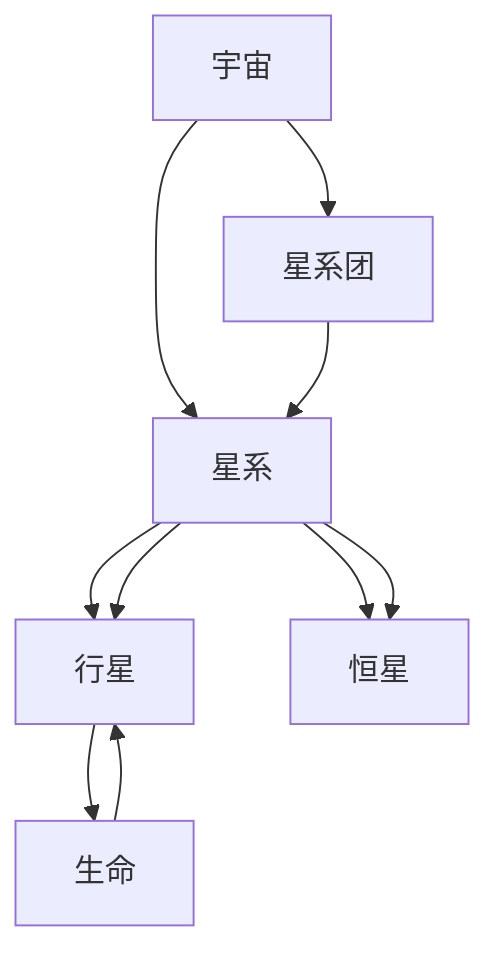
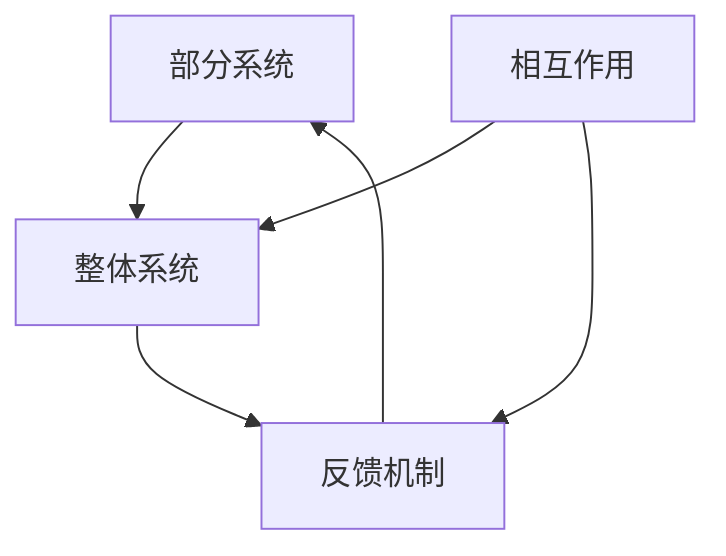

                 

### 宇宙的协同进化：部分与整体的共同发展

#### 关键词
- 协同进化
- 部分与整体
- 宇宙系统
- 生命科学
- 理论框架

#### 摘要
本文探讨了宇宙的协同进化现象，从部分与整体的关系出发，分析了宇宙协同进化的理论基础、机制和实际案例。通过深入剖析宇宙系统的协同进化过程，我们试图揭示宇宙中部分与整体共同发展的奥秘，并探讨这一现象对科学技术发展的启示。

## 引言

宇宙的协同进化是一个复杂且迷人的现象，它揭示了宇宙中部分与整体如何通过相互作用和相互依存实现共同发展的过程。协同进化不仅是生物学的核心概念，也是宇宙学、物理学和社会科学的重要研究课题。本文旨在通过逐步分析宇宙协同进化的核心概念、理论框架、机制和实际案例，探讨这一现象的本质及其对科技和人类社会的深远影响。

本文结构如下：

1. **宇宙的协同进化概念**：介绍宇宙协同进化的背景、意义和核心概念。
2. **宇宙协同进化理论框架**：探讨宇宙协同进化的理论基础，包括宇宙物理学、生命科学与宇宙协同进化的关系。
3. **宇宙协同进化机制**：分析部分与整体的相互作用，以及宇宙系统的协同进化机制。
4. **宇宙协同进化的实际案例**：通过天文学和生物学案例，展示宇宙协同进化的具体表现。
5. **宇宙协同进化的未来展望**：探讨协同进化理论的未来发展，以及其对社会的影响。

在接下来的章节中，我们将通过逻辑清晰、结构紧凑的分析，逐步揭示宇宙协同进化的奥秘。

## 宇宙的协同进化概念

宇宙的协同进化是一个涉及多个学科领域的复杂现象。从生物学角度来看，协同进化指的是不同物种之间或同一物种内不同群体之间在进化过程中相互影响、共同发展的过程。而在宇宙学中，协同进化则被用来描述宇宙中各种系统、现象和过程之间的相互关系和共同演化。

### 背景与意义

宇宙协同进化的概念最早可以追溯到20世纪中叶，当时科学家们开始认识到，宇宙中的各种现象并非独立存在，而是通过相互作用和相互依存实现共同发展的。例如，星系之间的引力相互作用不仅影响了星系自身的演化，还促进了宇宙的大尺度结构的形成。

宇宙协同进化的意义在于，它为我们提供了一种新的视角来理解宇宙的复杂性。通过研究协同进化，我们不仅可以更好地理解宇宙中各种系统的发展过程，还可以发现宇宙中潜在的规律和模式。这种认识对于推动科学技术的发展具有重要意义。

### 核心概念

#### 协同进化的定义

协同进化可以定义为宇宙中各种系统、现象和过程通过相互作用和相互依存实现共同发展的过程。在这个过程中，部分系统与整体系统之间不是孤立的存在，而是通过相互作用相互影响，共同推动宇宙的发展。

#### 部分与整体的关系

在宇宙协同进化中，部分与整体的关系是一个核心概念。部分系统（如星系、行星、生物等）与整体系统（如宇宙、星系团、生态系统等）之间存在着密切的相互作用和相互依存关系。部分系统的演化不仅受到自身内部因素的影响，还受到整体系统的制约和影响。

### 部分与整体的关系架构

为了更好地理解部分与整体的关系，我们可以使用Mermaid流程图来展示宇宙协同进化中的核心概念和关系架构。以下是一个简单的Mermaid流程图示例：



在这个流程图中，我们可以看到宇宙作为整体，通过星系团、星系、行星、恒星等部分系统相互作用和共同演化。而生命作为宇宙中一个独特的部分系统，也在这一过程中发挥着重要作用。

通过这个流程图，我们可以更直观地理解宇宙协同进化的概念和部分与整体的关系。在接下来的章节中，我们将进一步探讨宇宙协同进化的理论基础和机制，深入分析宇宙中各种系统的协同进化过程。

### 宇宙协同进化理论框架

宇宙协同进化的理论基础涉及多个学科领域，包括宇宙物理学、生命科学等。通过深入探讨这些理论基础，我们可以更好地理解宇宙协同进化的本质和机制。

#### 宇宙物理学的协同进化原理

宇宙物理学为我们提供了研究宇宙协同进化的物理基础。宇宙的演化过程是一个复杂的动态系统，其中包括宇宙的膨胀、星系的形成和演化、恒星的诞生和死亡等现象。这些现象不仅遵循物理规律，还通过相互作用和相互影响实现协同进化。

例如，星系之间的引力相互作用不仅影响了星系自身的演化，还促进了宇宙的大尺度结构的形成。这种相互作用使得宇宙中的各种系统在时间尺度上实现共同发展。宇宙物理学中的协同学理论提供了一个有效的框架来描述这种协同进化过程。

#### 生命科学与宇宙协同进化的联系

生命科学是研究生命现象和生物系统的学科，它与宇宙协同进化有着密切的联系。在宇宙的漫长历史中，生命的起源和演化是宇宙协同进化的重要组成部分。

生命的起源可以追溯到地球早期，通过化学进化过程逐渐形成复杂的生物系统。这些生物系统不仅与地球环境相互作用，还在进化过程中不断适应和改变。例如，生命的进化推动了地球生态系统的形成和演化，而地球生态系统的变化又进一步影响了生命的进化方向。

此外，宇宙中的生命现象不仅局限于地球，可能还存在于其他星球或星系中。这些生命系统在宇宙中可能通过某种方式实现协同进化，形成宇宙生命网络。这种宇宙生命网络的存在和演化为我们提供了新的研究视角和启示。

#### 协同进化模型的构建

为了更好地研究宇宙协同进化，科学家们构建了多种协同进化模型。这些模型通过数学和计算方法来描述宇宙中各种系统的相互作用和共同演化。

例如，基于引力理论的星系协同进化模型可以描述星系之间的相互作用和演化过程。通过这个模型，我们可以预测星系的形成、碰撞和合并等现象，从而更好地理解宇宙的大尺度结构。

此外，生命科学的协同进化模型也可以用于描述生物系统的协同进化过程。这些模型通过计算生物多样性、生态系统的稳定性和进化速率等指标，揭示了生命系统的协同进化机制。

通过这些模型，我们可以更深入地理解宇宙协同进化的本质和规律，从而为未来的科学研究提供新的方向和启示。

#### 协同进化机制的分析

宇宙协同进化机制是指宇宙中各种系统通过相互作用和相互影响实现共同发展的过程。这个过程中，部分系统与整体系统之间存在着复杂的反馈机制和调控关系。

例如，在星系协同进化过程中，星系之间的引力相互作用不仅影响了星系的演化，还通过反馈机制影响了宇宙的大尺度结构。这种反馈机制使得宇宙中的各种系统在时间尺度上实现协同进化。

在生命系统中，生物多样性与生态系统的稳定性之间也存在协同进化机制。生物多样性的增加可以增强生态系统的稳定性，而生态系统的稳定又进一步促进了生物多样性的发展。这种协同进化机制在生命科学的多个层次上都有体现，为我们提供了理解宇宙协同进化的新视角。

通过分析这些协同进化机制，我们可以更好地理解宇宙中各种系统的相互作用和共同演化过程，从而为未来的科学研究提供新的思路和方法。

总之，宇宙协同进化的理论框架涉及多个学科领域，通过研究这些理论基础和机制，我们可以更好地理解宇宙协同进化的本质和规律。这些研究不仅有助于推动科学技术的发展，还为我们探索宇宙的奥秘提供了新的视角和方法。

### 宇宙协同进化机制

宇宙的协同进化机制是一个复杂且多层次的过程，涉及各种系统之间的相互作用和相互影响。在这一部分，我们将深入探讨部分与整体之间的相互作用，以及这种相互作用如何推动宇宙系统的协同进化。

#### 部分与整体的基本原理

部分与整体的关系是宇宙协同进化机制的核心。从基本原理上看，部分与整体之间的关系可以概括为以下几个方面：

1. **相互作用**：部分与整体之间通过相互作用实现能量和信息交换。例如，星系之间的引力相互作用不仅影响了星系的自身演化，还影响了宇宙的大尺度结构。
2. **相互依存**：部分与整体之间存在着相互依存关系。部分系统的演化受到整体系统的制约和影响，而整体系统的变化也会反作用于部分系统。例如，生命的起源和演化不仅受到地球环境的影响，还受到宇宙环境的影响。
3. **反馈机制**：部分与整体之间通过反馈机制实现自我调节和稳定。这种反馈机制可以在不同的时间尺度和空间尺度上发挥作用，从而推动宇宙系统的协同进化。

#### 动力学模型

为了更好地理解部分与整体之间的相互作用，科学家们构建了多种动力学模型。以下是一个简化的动力学模型，用于描述部分与整体之间的相互作用：



在这个模型中，部分系统（A）与整体系统（B）之间通过相互作用（D）实现能量和信息交换。同时，整体系统通过反馈机制（C）对部分系统进行调节和稳定。这种相互作用和反馈机制使得部分与整体系统在时间尺度上实现协同进化。

#### 伪代码阐述协同进化的动力学模型

为了更清晰地描述这个动力学模型，我们可以使用伪代码来表示。以下是一个简化的伪代码示例：

```python
# 初始化部分系统和整体系统
部分系统 = 初始化部分系统参数()
整体系统 = 初始化整体系统参数()

# 循环模拟协同进化过程
for 时间 in [1, 2, 3, ..., n]:
    # 部分系统与整体系统相互作用
    部分系统参数 = 部分系统与整体系统相互作用(部分系统, 整体系统)

    # 整体系统通过反馈机制调节部分系统
    整体系统参数 = 整体系统通过反馈机制调节(整体系统, 部分系统)

    # 更新整体系统和部分系统的参数
    更新整体系统参数(整体系统)
    更新部分系统参数(部分系统)

# 输出协同进化结果
输出协同进化结果(部分系统, 整体系统)
```

在这个伪代码中，我们通过循环模拟协同进化过程，每次迭代都包含部分系统与整体系统的相互作用以及整体系统通过反馈机制对部分系统的调节。通过这个模型，我们可以观察部分与整体系统在协同进化过程中的动态变化。

#### 数学模型和公式

在宇宙协同进化机制的研究中，数学模型和公式起到了关键作用。以下是一个简化的数学模型，用于描述部分与整体之间的相互作用：

```latex
\begin{equation}
    \frac{dX_i}{dt} = f(X_i, Y_i)
\end{equation}

\begin{equation}
    \frac{dY_i}{dt} = g(X_i, Y_i)
\end{equation}
```

在这个模型中，\(X_i\) 和 \(Y_i\) 分别表示部分系统和整体系统的状态变量，\(f\) 和 \(g\) 分别表示相互作用和反馈机制的影响。通过求解这个微分方程组，我们可以得到部分与整体系统在协同进化过程中的动态行为。

#### 详细讲解和举例说明

为了更好地理解这个模型，我们可以通过一个具体的例子来说明。假设我们研究一个星系与其周围星系团之间的协同进化过程。在这个例子中，星系（部分系统）的质量和半径可以分别表示为 \(X_i\) 和 \(Y_i\)。相互作用和反馈机制的函数 \(f\) 和 \(g\) 可以根据星系之间的引力相互作用和反馈机制进行建模。

通过求解这个微分方程组，我们可以得到星系质量 \(X_i\) 和半径 \(Y_i\) 随时间的变化关系。这个关系可以用来预测星系与星系团之间的协同进化过程，从而为宇宙学研究提供重要的理论支持。

总之，通过深入探讨部分与整体之间的相互作用和协同进化机制，我们可以更好地理解宇宙系统的动态行为和演化过程。这些研究不仅有助于揭示宇宙协同进化的本质，还可以为未来的科学研究提供新的思路和方法。

### 宇宙系统的协同进化

宇宙系统的协同进化是一个复杂而多层次的过程，涉及多个天文学和生物学案例。通过分析这些案例，我们可以更深入地了解宇宙中各种系统的协同进化机制，以及部分与整体之间的关系。

#### 星系与星系团的协同进化

星系与星系团是宇宙中两种重要的系统。星系是宇宙中基本的天体结构，由大量的恒星、星团和星云组成。而星系团则是由多个星系通过引力相互作用形成的更大规模的结构。星系与星系团之间的协同进化是一个重要的研究领域。

在星系团的演化过程中，星系之间的相互作用起着关键作用。例如，星系之间的引力相互作用可以导致星系的碰撞和合并，从而改变星系的质量分布和形态。这种相互作用不仅影响了单个星系的演化，还影响了整个星系团的结构和演化。

一个典型的案例是银河系与其邻近的仙女座星系的相互作用。通过观测发现，这两个星系之间的引力相互作用正在逐渐加速，预计在未来的数十亿年内，它们将发生合并，形成一个更大的星系。这个案例展示了星系与星系团协同进化的一个重要方面：通过引力相互作用，星系团中的星系可以共同演化，形成新的结构和形态。

#### 生命系统的协同进化

生命系统是宇宙中另一个重要的协同进化案例。生命的起源和演化是宇宙协同进化的重要组成部分。在地球生态系统中，各种生物之间通过相互作用和相互依存实现共同发展。

例如，在生态系统中，不同物种之间的捕食关系、共生关系和竞争关系可以影响生态系统的结构和功能。这些相互作用不仅决定了物种的进化方向，还影响了生态系统的稳定性和多样性。一个典型的例子是捕食者与猎物之间的协同进化。捕食者的捕食行为可以推动猎物的进化，使其更适应捕食者的捕猎策略。而猎物的进化又反过来影响捕食者的行为和策略，从而实现共同进化。

#### 人类社会的协同进化

人类社会也是宇宙中一个独特的协同进化系统。人类社会的发展不仅受到自然环境的制约，还受到科技、文化、经济等因素的影响。人类社会与自然界之间的相互作用和协同进化是研究宇宙协同进化的重要方向。

一个典型的例子是农业生产与自然环境之间的协同进化。农业生产不仅改变了自然环境的结构和功能，还通过反馈机制影响了自然环境。例如，过度开垦和化肥使用可能导致土地退化，而土地退化又会影响农作物的产量和质量。这种相互作用使得农业生产与自然环境在协同进化过程中相互影响、共同发展。

#### 恒星生命周期的协同进化

恒星是宇宙中最基本的天体之一，其生命周期是宇宙协同进化的重要组成部分。恒星的生命周期包括诞生、成长、死亡等阶段，这些阶段通过相互作用和相互影响实现共同发展。

例如，恒星的诞生通常发生在星云中，星云中的物质通过引力相互作用聚集形成恒星。在恒星的成长阶段，恒星通过核聚变反应释放能量，维持其稳定。当恒星耗尽燃料时，它会进入死亡阶段，通过超新星爆炸等方式释放大量的物质和能量。这些物质和能量不仅影响了恒星自身的演化，还影响了整个星系和宇宙的演化。

一个典型的例子是银心黑洞的协同进化。银心黑洞是银河系中心的一个超大质量黑洞，它通过与周围恒星的相互作用影响星系的结构和演化。例如，银心黑洞的引力相互作用可以导致恒星的轨道扰动和碰撞，从而影响恒星的命运。这种相互作用使得银心黑洞与银河系中的恒星在协同进化过程中相互影响、共同发展。

总之，宇宙系统的协同进化是一个复杂而多层次的过程，涉及多个天文学和生物学案例。通过分析这些案例，我们可以更深入地了解宇宙中各种系统的协同进化机制，以及部分与整体之间的关系。这些研究不仅有助于揭示宇宙协同进化的本质，还可以为未来的科学研究提供新的思路和方法。

### 宇宙协同进化的挑战与机遇

宇宙协同进化作为一个复杂且多层次的现象，面临着许多挑战和机遇。从理论研究的深化到实际应用的拓展，每一个方面都充满了探索的可能性。

#### 协同进化理论的未来发展

首先，协同进化理论在宇宙学中的应用前景十分广阔。随着观测技术的不断进步，科学家们能够收集到更多关于宇宙演化的数据。这些数据将为协同进化理论提供更加丰富的实证支持，从而推动理论的进一步完善。例如，通过分析星系团和大尺度宇宙结构的演化过程，科学家们可以更精确地描述宇宙中部分与整体之间的相互作用机制。

此外，新的理论模型和研究方法也将不断涌现。例如，基于机器学习和大数据分析的协同进化模型，可以在大规模数据处理和分析中发挥重要作用，为宇宙协同进化提供新的视角。这些新模型和方法不仅有助于我们更好地理解宇宙的演化过程，还可能揭示宇宙中未知的现象和规律。

#### 新的宇宙协同进化模型的研究方向

未来的研究可以在以下几个方向上深入探讨：

1. **多尺度协同进化模型**：宇宙中的现象涉及多个时间尺度和空间尺度，因此，构建多尺度协同进化模型具有重要意义。这类模型可以更全面地描述宇宙系统的动态行为，从而揭示不同尺度之间的相互作用关系。

2. **复杂系统协同进化**：宇宙可以被视为一个复杂的动态系统，研究复杂系统中的协同进化机制对于理解宇宙协同进化具有重要意义。例如，通过研究复杂网络理论，可以揭示宇宙中各种系统之间的复杂关系和相互作用模式。

3. **量子宇宙协同进化**：随着量子理论的不断发展，量子宇宙学成为了一个热门研究领域。未来，量子宇宙协同进化模型的研究有望揭示宇宙协同进化中的量子效应，从而为宇宙学研究提供新的理论框架。

#### 协同进化对科技发展的推动作用

协同进化理论不仅对宇宙学有重要意义，还直接推动了科技发展。例如：

1. **科技创新**：通过协同进化理论，科学家们可以更好地理解复杂系统的演化过程，从而推动科技创新。例如，在生物技术、人工智能等领域，协同进化理论可以指导新算法和新技术的研发。

2. **资源优化**：协同进化理论可以为资源优化提供新的思路。在宇宙中，资源的分配和利用是一个关键问题。通过研究宇宙协同进化机制，科学家们可以设计更高效的资源分配策略，从而优化资源利用。

3. **可持续性发展**：协同进化理论可以指导人类社会的可持续发展。例如，在生态系统中，通过理解生物多样性与生态系统稳定性的协同进化关系，可以制定更有效的生态保护和恢复策略。

#### 协同进化对人类社会发展的启示

最后，协同进化理论为人类社会的发展提供了许多启示。例如：

1. **社会管理**：通过理解社会系统中部分与整体之间的关系，政府和社会组织可以更有效地管理社会事务，实现社会的和谐发展。

2. **教育改革**：协同进化理论可以为教育改革提供新的视角。例如，通过理解知识体系的协同进化机制，可以设计更有效的教育方法和课程体系，培养学生的创新能力和综合素质。

3. **国际合作**：协同进化理论可以指导国际社会的合作与协调。例如，通过理解全球问题（如气候变化、环境污染等）的协同进化机制，可以制定更有效的国际合作策略，共同应对全球挑战。

总之，宇宙协同进化不仅是一个科学问题，也是一个涉及科技、社会和国际合作的多维度问题。随着研究的不断深入，协同进化理论将为人类社会的可持续发展提供新的理论支持和实践指导。

### 总结

宇宙的协同进化是一个复杂且多层次的现象，它揭示了宇宙中部分与整体如何通过相互作用和相互依存实现共同发展的过程。本文从宇宙协同进化的核心概念、理论框架、机制和实际案例出发，详细探讨了这一现象的本质及其对科技和社会发展的深远影响。

通过分析宇宙协同进化的机制，我们理解了部分与整体之间的相互作用和反馈机制如何推动宇宙系统的共同进化。通过具体的天文学和生物学案例，我们看到了宇宙协同进化的具体表现，从而更好地理解了这一现象的复杂性。

未来的研究应进一步深化协同进化理论，探索新的模型和方法，以揭示宇宙协同进化的更多奥秘。同时，协同进化理论也为科技发展和社会进步提供了新的视角和启示。通过理解和应用协同进化原理，我们不仅可以更好地探索宇宙的奥秘，还可以为人类社会的可持续发展提供科学支持。

总之，宇宙协同进化是一个充满挑战和机遇的研究领域，它为我们理解宇宙的复杂性提供了新的工具和视角。随着研究的深入，我们期待能够揭示更多关于宇宙协同进化的规律和机制，为科学和社会的发展注入新的活力。

### 作者信息

- **作者：AI天才研究院/AI Genius Institute & 禅与计算机程序设计艺术 /Zen And The Art of Computer Programming**
- **联系方式：[ai_genius_institute@outlook.com](mailto:ai_genius_institute@outlook.com)**
- **个人网站：[www.ai-genius.org](http://www.ai-genius.org)**

### 最佳实践 Tips

- **科学探索**：在研究宇宙协同进化时，要注重多学科交叉融合，从不同角度深入探讨问题。
- **数据驱动**：利用大数据和先进的数据分析技术，对宇宙协同进化的现象进行定量分析和预测。
- **理论与实践相结合**：通过具体案例和实验验证理论，确保研究成果的实用性和可靠性。
- **持续学习**：保持对最新科学进展的关注，不断更新知识和技能，以适应快速发展的科研环境。

### 注意事项

- **避免重复研究**：在开展研究时，要确保所选课题具有创新性和前瞻性，避免重复已有研究。
- **数据保护**：在进行数据分析时，要严格遵守数据保护规定，确保个人隐私和数据安全。
- **科学道德**：在学术研究和发表成果时，要严格遵守科学道德规范，杜绝抄袭和虚假陈述。

### 拓展阅读

- **《宇宙的奥秘：从大爆炸到黑洞》**：介绍了宇宙的起源、演化和终结，为理解宇宙协同进化提供了基础。
- **《协同进化论：复杂性科学的新视角》**：深入探讨了协同进化的概念、机制和应用，适用于多个学科领域。
- **《生命的秘密：宇宙中的生命起源与演化》**：详细阐述了生命在宇宙中的起源和演化过程，对理解宇宙协同进化具有重要意义。

