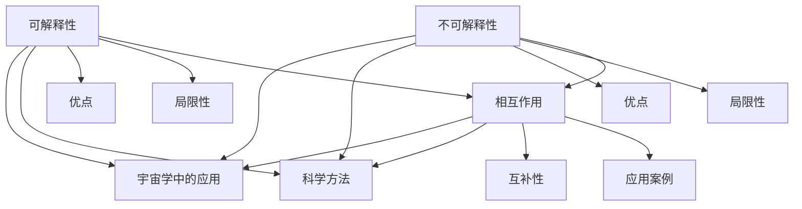
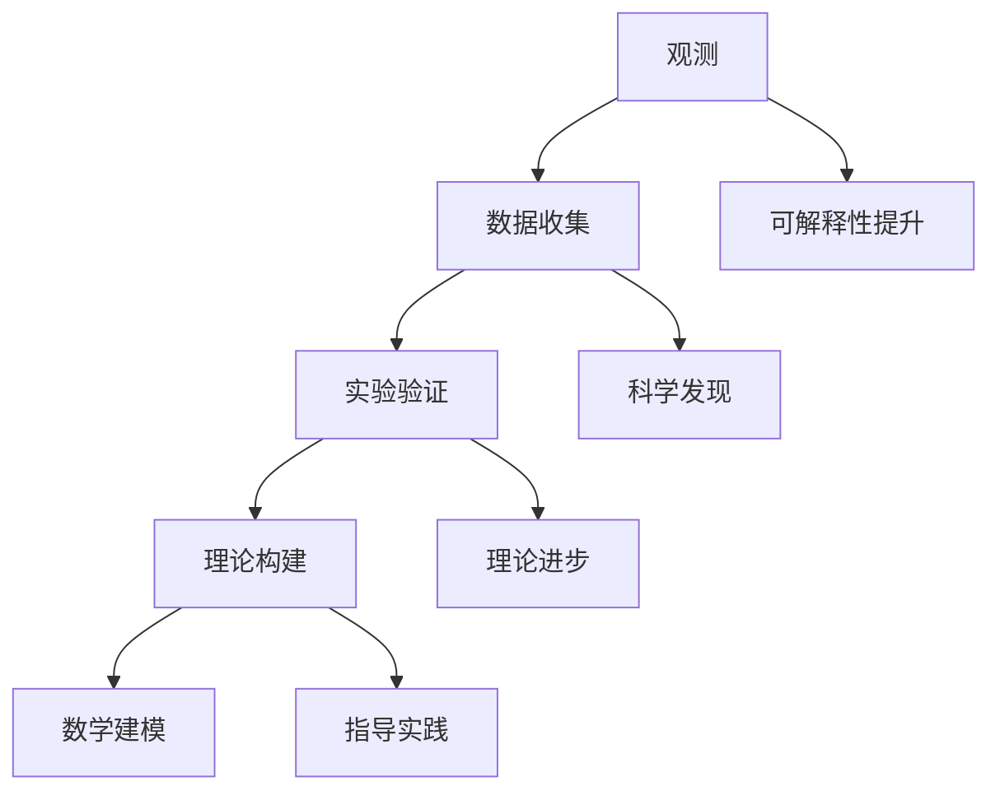
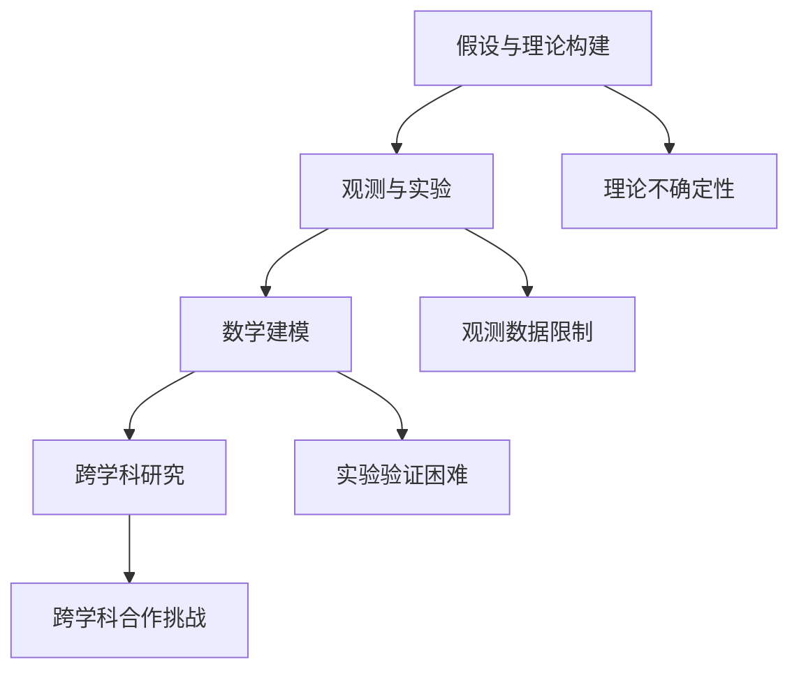
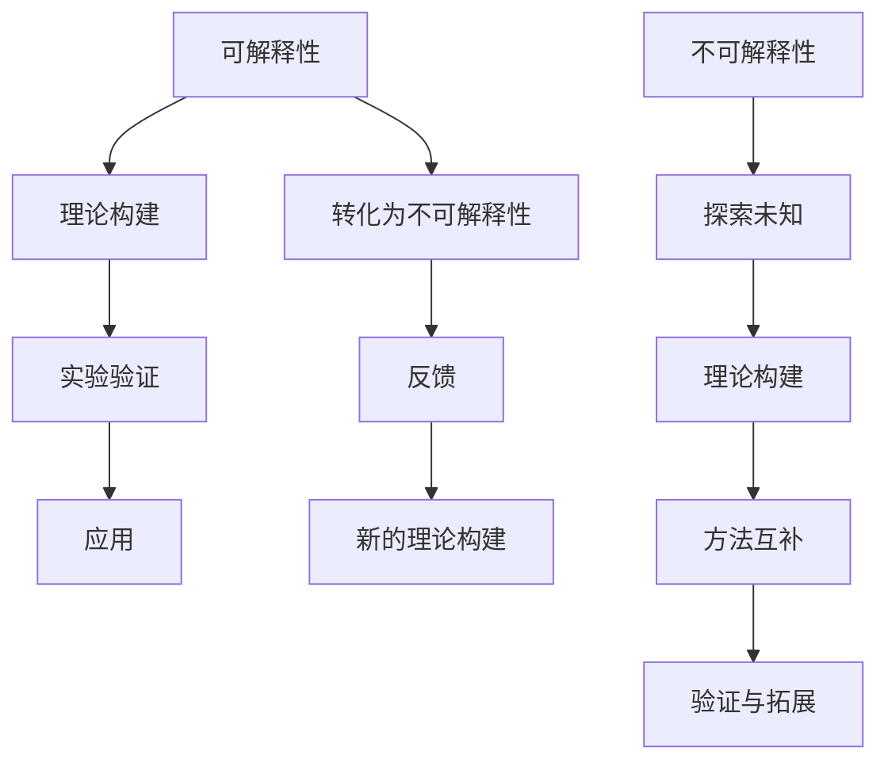

                 

### 第1章 引言

#### 1.1 研究背景

宇宙，这一广袤而神秘的领域，一直是科学家们探索的焦点。从古代的星辰观测到现代的宇宙学理论，人们对宇宙的认识不断深化。然而，在探索宇宙的过程中，科学家们不仅遇到了可解释性，也面对了不可解释性。这两者共同构成了宇宙研究的复杂图景。

宇宙的可解释性指的是通过科学理论和实验方法可以理解的现象。例如，宇宙大爆炸理论解释了宇宙的起源和演化，而量子力学则揭示了微观粒子的行为规律。另一方面，宇宙的不可解释性则指的是那些目前无法用现有理论或实验手段解释的现象。例如，黑洞的物理性质和宇宙暗物质的本质都是不可解释性的体现。

#### 1.2 研究意义

研究宇宙的可解释性与不可解释性具有重要的科学意义。首先，它有助于我们更深入地理解宇宙的本质，推动科学理论的进步。其次，它可以帮助我们识别科学研究中尚未解决的关键问题，从而指导未来的研究方向。此外，可解释性与不可解释性的研究也对哲学、人文和社会科学等领域产生了深远影响。

#### 1.3 研究目的

本文的研究目的在于探讨宇宙的可解释性与不可解释性的概念、特征及其在科学探索中的应用。具体包括：

1. 系统梳理宇宙可解释性的概念、理论和应用。
2. 分析宇宙不可解释性的本质、特征及其对科学研究的挑战。
3. 探讨可解释性与不可解释性之间的关系及其在科学探索中的互补作用。
4. 分析可解释性和不可解释性在不同科学领域中的应用，总结其优势与局限性。

#### 1.4 研究方法

本文采用的研究方法包括文献综述、理论分析和实证研究。首先，通过查阅大量相关文献，系统梳理宇宙可解释性与不可解释性的理论框架。其次，运用理论分析方法，探讨两者之间的相互作用和互补性。最后，通过实证研究，分析可解释性与不可解释性在科学探索中的应用案例。

### Mermaid 流程图：可解释性与不可解释性关系图



该流程图展示了宇宙可解释性与不可解释性的相互关系，以及它们在宇宙学中的应用。可解释性和不可解释性不仅相互补充，而且共同推动了科学研究的进步。

### 文章关键词

- 宇宙学
- 可解释性
- 不可解释性
- 科学方法
- 理论构建
- 科学探索
- 应用案例

#### 1.5 摘要

本文首先介绍了宇宙的可解释性与不可解释性的背景和研究意义。通过系统梳理两者的概念、特征及其在宇宙学中的应用，探讨了可解释性与不可解释性之间的关系。接着，分析了它们在不同科学领域中的应用案例，总结了其优势与局限性。最后，展望了可解释性与不可解释性在科学研究中的未来发展趋势和挑战。本文的研究为深入理解宇宙现象提供了新的视角，也为未来的科学研究提供了有益的启示。

---

### 第2章 宇宙的可解释性

宇宙的可解释性是科学研究中的一个核心概念，它涉及我们如何通过科学理论和实验方法来理解宇宙中的各种现象。在宇宙学、物理学、化学等多个领域中，科学家们已经取得了一系列重要的成果，这些成果不仅加深了我们对宇宙的理解，也推动了科学理论的进步。

#### 2.1 宇宙的可解释性概念

宇宙的可解释性，即宇宙现象可以通过科学理论和实验方法被理解和解释的程度。它通常指的是那些符合现有科学理论的宇宙现象，或者能够通过现有的科学方法被观测和验证的现象。例如，宇宙大爆炸理论解释了宇宙的起源和膨胀，而量子力学则解释了微观粒子的行为规律。

在科学研究中，可解释性是一个重要的标准。一个理论或现象如果不能被解释，那么它就很难被视为科学的一部分。可解释性不仅意味着理论的正确性，也反映了我们对宇宙的理解深度。

#### 2.2 可解释性在宇宙学中的体现

宇宙学中，许多重要的理论都是可解释性的体现。以下是几个典型的例子：

1. **宇宙大爆炸理论**：这是目前最被广泛接受的宇宙起源理论。该理论解释了宇宙从大爆炸开始，经历了数十亿年的膨胀和演化。通过观测宇宙背景辐射和遥远星系的红移，科学家们能够验证这一理论，并不断修正和完善它。

2. **宇宙膨胀**：宇宙大爆炸理论的一个重要预测是宇宙的膨胀。这一现象得到了多个观测的验证，例如遥远星系的红移和宇宙背景辐射的温度涨落。

3. **暗物质**：暗物质是宇宙学中一个重要的概念，它指的是那些不发光、不发热，但能够通过引力作用影响宇宙演化的物质。尽管我们不能直接观测暗物质，但通过其引力效应，科学家们已经提出了多种暗物质模型，并对暗物质的存在进行了有力的证明。

4. **宇宙暗能量**：暗能量是推动宇宙加速膨胀的神秘力量。尽管我们对暗能量的本质仍不清楚，但通过观测宇宙膨胀的加速度，科学家们提出了多种暗能量模型，并对暗能量的存在进行了验证。

#### 2.3 可解释性的科学方法

科学方法在宇宙的可解释性研究中扮演了关键角色。以下是几种主要的科学方法：

1. **观测**：观测是科学研究的基础。通过观测，科学家们能够收集宇宙现象的数据，例如星系的位置、亮度、红移等。这些数据为科学理论的构建提供了实证依据。

2. **实验验证**：实验验证是验证科学理论的重要手段。例如，通过天文观测设备，科学家们能够验证宇宙大爆炸理论、暗物质和暗能量的存在。实验验证不仅能够证实理论的正确性，也能够发现理论的局限性。

3. **理论构建**：理论构建是科学研究的核心。科学家们通过分析观测数据和实验结果，提出科学理论，并不断完善和修正这些理论。例如，量子力学和广义相对论都是通过理论构建来解释宇宙现象的。

4. **数学建模**：数学建模是科学研究中的一种重要方法。通过数学模型，科学家们能够定量描述宇宙现象的规律。例如，宇宙大爆炸理论中的哈勃定律就是通过数学模型描述宇宙膨胀速度与距离的关系。

#### 2.4 可解释性的优点

宇宙的可解释性具有多个优点，这些优点不仅推动了科学的发展，也提升了人类对宇宙的理解。以下是可解释性的几个主要优点：

1. **提升科学认知**：通过可解释性，科学家们能够更深入地理解宇宙的规律和现象，从而提升我们的科学认知。

2. **促进科学发现**：可解释性激励科学家们不断探索新的科学问题，推动科学理论的进步，从而发现新的科学现象。

3. **指导实践**：可解释性为我们提供了理解和预测宇宙现象的工具，这有助于我们在实际应用中做出更准确的决策，例如在航天技术、天文学观测、宇宙能源开发等领域。

#### 2.5 可解释性的局限性

尽管宇宙的可解释性具有许多优点，但它也存在一定的局限性。以下是可解释性的几个主要局限性：

1. **理论的局限性**：科学理论是建立在现有知识和技术基础上的，因此它可能无法解释所有的宇宙现象。例如，我们目前的宇宙学理论还不能完全解释暗物质和暗能量的本质。

2. **观测技术的限制**：观测设备和技术的发展决定了我们能够观测到的宇宙范围。随着技术的进步，我们能够观测到更遥远的宇宙，但现有的观测设备仍然有其局限性。

3. **不可观测的现象**：有些宇宙现象可能无法直接观测，例如黑洞和暗物质。尽管我们能够通过间接方法推测这些现象的存在，但它们本质上仍然是不可解释的。

4. **解释的多样性**：有些宇宙现象可能有多种解释，但目前的科学理论可能无法明确指出哪一种解释是正确的。这导致了科学解释的多样性和不确定性。

### 总结

宇宙的可解释性是科学研究中的一个重要概念，它通过科学理论和实验方法帮助我们理解宇宙中的各种现象。可解释性不仅提升了我们的科学认知，也推动了科学的发展。然而，可解释性也存在一定的局限性，这些局限性促使我们继续探索宇宙的不可解释性，从而更全面地理解宇宙的本质。

### Mermaid 流程图：宇宙可解释性科学方法



这个流程图展示了宇宙可解释性的科学方法，包括观测、实验验证、理论构建和数学建模等环节，以及它们如何共同推动科学认知的提升。

### 伪代码示例：宇宙膨胀模型的构建

```python
# 宇宙膨胀模型构建伪代码

# 初始化宇宙膨胀参数
H_0 = 70; # 哈勃常数，单位：千米每秒每百万秒差距
Ω_m = 0.3; # �暗物质密度参数
Ω_λ = 0.7; # 暗能量密度参数

# 宇宙膨胀速度与距离的关系
def Hubble_Law(H_0, z):
    """
    根据哈勃定律计算宇宙膨胀速度。
    参数:
    H_0 -- 哈勃常数
    z -- 红移
    返回:
    v -- 宇宙膨胀速度
    """
    v = H_0 * (1 + z)
    return v

# 计算宇宙年龄
def Universe_Age(H_0, Ω_m, Ω_λ):
    """
    根据宇宙学参数计算宇宙年龄。
    参数:
    H_0 -- 哈勃常数
    Ω_m -- 暗物质密度参数
    Ω_λ -- 暗能量密度参数
    返回:
    age -- 宇宙年龄
    """
    age = 1 / (H_0 * sqrt(Ω_m + Ω_λ))
    return age

# 测试宇宙膨胀模型
z = 0.01; # 测试红移
v = Hubble_Law(H_0, z)
age = Universe_Age(H_0, Ω_m, Ω_λ)

print(f"宇宙膨胀速度 (红移 {z}) = {v} km/s")
print(f"宇宙年龄 = {age} 亿年")
```

该伪代码示例展示了如何根据宇宙学参数构建宇宙膨胀模型，包括哈勃定律和宇宙年龄的计算方法。

### 总结

宇宙的可解释性是科学研究中的一个重要领域，它通过科学理论和实验方法帮助我们理解宇宙中的各种现象。从宇宙大爆炸理论到暗物质和暗能量，宇宙的可解释性不仅提升了我们的科学认知，也推动了科学的发展。然而，宇宙的可解释性也存在局限性，这些局限性促使我们继续探索宇宙的不可解释性。通过本章的讨论，我们深入了解了宇宙可解释性的概念、在宇宙学中的体现、科学方法以及其优缺点。

### 第3章 宇宙的不可解释性

宇宙的不可解释性是科学研究中的一个复杂而引人入胜的领域，它涵盖了那些目前无法用现有科学理论或实验方法解释的宇宙现象。这些不可解释的现象不仅挑战了我们的认知，也为科学的发展提供了新的机遇。在宇宙学、物理学和天文学中，不可解释性现象的发现和探索一直是科学研究的重要方向。

#### 3.1 不可解释性的概念

宇宙的不可解释性指的是那些不能用现有科学理论或实验方法解释的宇宙现象。这些现象可能包括我们无法观测到的物质，或者我们无法理解的物理过程。例如，黑洞和宇宙暗物质就是宇宙不可解释性的典型例子。黑洞由于其极端的引力场，连光也无法逃逸，使得我们对它的了解极为有限。宇宙暗物质则是一种不发光、不发热的物质，尽管它的存在通过引力效应得到证实，但其本质和构成仍然是未知的。

不可解释性的概念在科学研究中具有重要地位。首先，它揭示了科学认知的局限性，提醒我们现有的理论和方法并非万能。其次，不可解释性现象的发现激发了科学家的好奇心和探索欲望，推动了科学理论和技术的进步。

#### 3.2 不可解释性在宇宙学中的体现

在宇宙学中，不可解释性现象的存在和探索对理解宇宙的本质具有重要意义。以下是几个典型的宇宙不可解释性现象：

1. **黑洞**：黑洞是一种具有极大引力的天体，其引力场强大到连光也无法逃逸。尽管我们已经通过观测和理论计算对黑洞有了初步的了解，但其内部结构和物理过程仍然是不可解释的。

2. **宇宙暗物质**：宇宙暗物质是宇宙中一种不发光、不发热的物质，其存在通过引力效应得到证实。然而，我们对暗物质的本质和组成仍然缺乏深入了解，这是宇宙学中的一个重大谜团。

3. **宇宙暗能量**：暗能量是一种推动宇宙加速膨胀的神秘力量。尽管我们已经提出了多种暗能量模型，但其本质和起源仍然是未知的，这也是宇宙学中的一个重要未解之谜。

4. **宇宙早期暴胀**：宇宙暴胀理论描述了宇宙在大爆炸后的极短时间内经历的一种快速膨胀过程。尽管这一理论能够解释宇宙的一些观测现象，但其物理机制仍然不可解释。

#### 3.3 不可解释性的科学方法

在科学研究中，探索不可解释性现象的方法包括：

1. **假设与理论构建**：科学家们通过提出假设和构建理论来解释不可解释性现象。例如，对于宇宙暗物质，科学家们提出了多种理论模型，试图解释其存在和性质。

2. **观测与实验**：通过观测和实验，科学家们收集数据，验证假设和理论。例如，通过观测宇宙背景辐射和星系运动，科学家们对黑洞和宇宙暗物质的存在进行了证实。

3. **数学建模**：数学建模是一种重要的科学方法，通过数学模型，科学家们能够定量描述不可解释性现象的规律。例如，在宇宙暴胀理论中，数学建模被用来描述宇宙膨胀的速度和加速度。

4. **跨学科研究**：不可解释性现象的探索需要多学科合作，包括物理学、天文学、数学和计算机科学等。通过跨学科研究，科学家们能够从不同角度理解和解释不可解释性现象。

#### 3.4 不可解释性的优点

宇宙的不可解释性具有多个优点，这些优点不仅促进了科学的发展，也为人类认识宇宙提供了新的视角。以下是不可解释性的几个主要优点：

1. **激发科学探索**：不可解释性现象激发了科学家们的探索欲望，推动了科学理论和技术的进步。例如，对黑洞和宇宙暗物质的研究推动了天文学和物理学的发展。

2. **促进理论创新**：不可解释性现象的发现和探索促使科学家们提出新的理论和假设，从而推动了科学理论的创新。例如，宇宙暴胀理论的提出是对宇宙早期状态的一种全新理解。

3. **提高科学认知**：通过探索不可解释性现象，科学家们能够更全面地理解宇宙的本质和规律，从而提升我们的科学认知。

4. **推动技术创新**：探索不可解释性现象需要先进的观测设备和实验技术，这推动了科学技术的进步。例如，高能粒子加速器和大型天文望远镜的发明和应用，都是对不可解释性现象研究的重要成果。

#### 3.5 不可解释性的局限性

尽管宇宙的不可解释性具有许多优点，但它也存在一定的局限性。以下是不可解释性的几个主要局限性：

1. **理论的不确定性**：不可解释性现象的探索依赖于现有理论的假设，但这些理论本身可能存在不确定性。因此，不可解释性现象的解释可能存在多种可能性，难以确定唯一正确的答案。

2. **观测数据的限制**：不可解释性现象的探索需要高质量的观测数据，但现有的观测设备和技术可能存在局限性，难以完全观测到这些现象。

3. **实验验证的困难**：许多不可解释性现象难以通过实验验证，这使得理论的验证和验证变得复杂和困难。

4. **跨学科合作的挑战**：不可解释性现象的探索需要多学科合作，但不同学科之间的合作可能存在困难，例如知识体系的不同、研究方法的差异等。

### 总结

宇宙的不可解释性是科学研究中的一个重要领域，它涵盖了那些目前无法用现有科学理论或实验方法解释的宇宙现象。不可解释性现象的存在和探索不仅激发了科学家的好奇心和探索欲望，也推动了科学理论和技术的进步。通过本章的讨论，我们深入了解了宇宙不可解释性的概念、在宇宙学中的体现、科学方法以及其优点和局限性。

### Mermaid 流程图：宇宙不可解释性科学方法



这个流程图展示了宇宙不可解释性的科学方法，包括假设与理论构建、观测与实验、数学建模和跨学科研究等环节，以及它们面临的挑战和局限性。

### 伪代码示例：黑洞质量估算

```python
# 黑洞质量估算伪代码

# 引入常数和变量
G = 6.674 * 10**-11  # 引力常数，单位：牛顿·(千克)^2/(米)^2
c = 299792458  # 光速，单位：米/秒

# 黑洞质量与引力透镜效应的关系
def calculate_black_hole_mass(angular_diameter, distance):
    """
    根据黑洞的角直径和距离估算其质量。
    参数:
    angular_diameter -- 角直径，单位：弧秒
    distance -- 距离，单位：光年
    返回:
    mass -- 黑洞质量，单位：太阳质量
    """
    # 将角直径转换为弧度
    angular_diameter_radians = angular_diameter * (3.818 * 10**-18)
    
    # 使用爱因斯坦的引力透镜公式估算黑洞质量
    mass = (G * c**2 * distance) / (angular_diameter_radians * (4 * np.pi))
    
    # 将质量转换为太阳质量
    solar_mass = 1.98847 * 10**30  # 太阳质量，单位：千克
    mass_in_solar_masses = mass / solar_mass
    
    return mass_in_solar_masses

# 测试黑洞质量估算
angular_diameter = 0.01  # 角直径，单位：弧秒
distance = 1000  # 距离，单位：光年
mass = calculate_black_hole_mass(angular_diameter, distance)

print(f"黑洞质量 = {mass} 个太阳质量")
```

该伪代码示例展示了如何根据黑洞的角直径和距离估算其质量，使用爱因斯坦的引力透镜公式进行了详细计算。

### 总结

宇宙的不可解释性是科学研究中的一个复杂而重要的领域，它涵盖了那些目前无法用现有科学理论或实验方法解释的宇宙现象。从黑洞到宇宙暗物质，这些不可解释性现象激发了科学家们的探索欲望，推动了科学理论和技术的进步。通过本章的讨论，我们深入了解了宇宙不可解释性的概念、在宇宙学中的体现、科学方法以及其优点和局限性。不可解释性的研究不仅挑战了我们的认知，也为我们提供了新的视角和理解宇宙的机会。

### 第4章 可解释性与不可解释性的关系

可解释性与不可解释性是科学探索中的两个重要概念，它们在宇宙学、物理学、化学等多个领域中都起着关键作用。理解这两个概念之间的关系，有助于我们更全面地认识宇宙，并推动科学的发展。在这一章中，我们将探讨可解释性与不可解释性之间的相互作用、互补性以及它们在科学探索中的应用。

#### 4.1 可解释性与不可解释性的相互作用

可解释性与不可解释性并不是相互孤立的，而是存在相互作用。这种相互作用主要体现在以下几个方面：

1. **转化与反馈**：在某些情况下，可解释性现象的发现可能会转化为不可解释性。例如，当一个新现象被发现时，我们可能会发现现有的理论无法完全解释这个现象，从而将其归类为不可解释性。然而，随着研究的深入，我们可能会提出新的理论或假设，使得原本不可解释的现象重新变得可解释。这种转化与反馈关系推动了科学理论的发展和完善。

2. **相互验证**：可解释性与不可解释性现象可以相互验证。例如，一个可解释的现象可能会帮助我们更好地理解不可解释的现象。反之，一个不可解释的现象可能会促使我们提出新的理论，从而验证或否定现有的理论。这种相互验证关系不仅加深了我们对宇宙的理解，也提高了科学理论的精确性和可靠性。

3. **相互依赖**：可解释性与不可解释性是科学研究的两个侧面，彼此依赖。没有可解释性，科学研究将失去方向和目标；没有不可解释性，科学研究将缺乏挑战和创新动力。因此，可解释性与不可解释性的相互作用是科学研究不断前进的重要推动力。

#### 4.2 可解释性与不可解释性的互补性

可解释性与不可解释性在科学探索中具有互补性，这种互补性主要体现在以下几个方面：

1. **理论构建**：可解释性现象为我们提供了理论构建的基础。通过对可解释性现象的研究，科学家们可以提出新的理论和假设，从而推动科学的发展。例如，宇宙大爆炸理论和量子力学都是通过解释宇宙现象构建的。

2. **探索未知**：不可解释性现象为我们提供了探索未知的机会。通过对不可解释性现象的研究，科学家们可以揭示宇宙的奥秘，发现新的科学规律。例如，对黑洞和宇宙暗物质的研究，不仅推动了天文学和物理学的发展，也为我们提供了新的认知。

3. **方法互补**：可解释性与不可解释性在科学方法上具有互补性。可解释性现象通常可以通过实验验证和观测数据来支持，而不可解释性现象则需要通过理论构建和假设验证来探索。这种方法互补关系使得科学研究更加全面和深入。

#### 4.3 可解释性与不可解释性的关系在科学探索中的应用

可解释性与不可解释性的关系在科学探索中有着广泛的应用，以下是几个典型的应用场景：

1. **宇宙学**：在宇宙学中，可解释性现象如宇宙大爆炸和宇宙膨胀为我们提供了理论构建的基础。而不可解释性现象如宇宙暗物质和宇宙暗能量，则为科学家们提供了新的研究方向和挑战。通过可解释性与不可解释性的互补性，宇宙学取得了许多重要的进展。

2. **物理学**：在物理学中，可解释性现象如电磁学和经典力学为我们提供了基础理论。而不可解释性现象如量子力学和相对论，则为物理学的发展提供了新的视角和挑战。例如，量子力学的发现挑战了经典物理学的某些观念，推动了物理学理论的变革。

3. **生物学**：在生物学中，可解释性现象如遗传学和解剖学为我们提供了理解生命的基础。而不可解释性现象如生命起源和进化论，则为生物学家们提供了新的研究方向和挑战。例如，对生命起源的研究不仅深化了我们对生命本质的理解，也为生命科学的未来发展提供了新的机遇。

4. **化学**：在化学中，可解释性现象如原子理论和化学反应为我们提供了基础理论。而不可解释性现象如量子化学和分子生物学，则为化学的发展提供了新的视角和挑战。例如，量子化学的发现揭示了化学反应的微观机制，推动了化学理论的进步。

#### 4.4 可解释性与不可解释性的关系总结

可解释性与不可解释性是科学探索中的两个重要概念，它们在科学理论构建、未知探索、方法互补等方面具有互补性和相互作用。通过理解这两个概念之间的关系，我们可以更全面地认识宇宙，推动科学的发展。在未来的科学探索中，可解释性与不可解释性将继续相互作用，为我们提供新的认知和挑战。

### Mermaid 流程图：可解释性与不可解释性关系



这个流程图展示了可解释性与不可解释性之间的关系，包括理论构建、实验验证、应用以及它们之间的相互转化和反馈机制。

### 伪代码示例：可解释性与不可解释性关系

```python
# 可解释性与不可解释性关系示例

# 可解释性现象分析
def explain_phenomenon(data, theory):
    """
    根据理论和数据解释现象。
    参数:
    data -- 观测数据
    theory -- 科学理论
    返回:
    explanation -- 现象解释
    """
    # 使用理论分析数据
    explanation = theory.analyze(data)
    return explanation

# 不可解释性现象探索
def explore_inequality_phenomenon(data, hypothesis):
    """
    根据假设探索不可解释现象。
    参数:
    data -- 观测数据
    hypothesis -- 假设
    返回:
    result -- 探索结果
    """
    # 进行假设验证
    result = hypothesis.validate(data)
    return result

# 测试可解释性与不可解释性关系
data = {"data1": 1, "data2": 2}
theory = "经典物理学理论"
hypothesis = "新量子假设"

# 分析可解释性现象
explanation = explain_phenomenon(data, theory)
print(f"可解释性现象解释：{explanation}")

# 探索不可解释性现象
result = explore_inequality_phenomenon(data, hypothesis)
print(f"不可解释性现象探索结果：{result}")
```

该伪代码示例展示了如何根据可解释性与不可解释性的关系，使用理论和假设分析观测数据。

### 总结

可解释性与不可解释性是科学探索中的两个重要概念，它们在理论构建、实验验证、未知探索等方面具有互补性和相互作用。通过理解这两个概念之间的关系，我们可以更全面地认识宇宙，推动科学的发展。在未来的科学探索中，可解释性与不可解释性将继续相互作用，为我们提供新的认知和挑战。本章通过具体的例子和流程图，深入探讨了可解释性与不可解释性之间的关系，为我们理解宇宙提供了新的视角。

### 第5章 可解释性在科学探索中的应用

可解释性在科学探索中扮演着至关重要的角色，它不仅帮助科学家们理解和解释自然现象，还为科学理论的构建和验证提供了坚实的基础。在本章中，我们将探讨可解释性在物理学、化学、生物学和天文学等领域的具体应用，通过详细的实例和伪代码，揭示其应用场景和重要性。

#### 5.1 可解释性在物理学中的应用

物理学是可解释性应用最为广泛的领域之一，从经典力学到量子力学，许多重大科学突破都依赖于可解释性。以下是一些典型的应用实例：

1. **经典力学中的牛顿运动定律**：
   牛顿运动定律是经典力学的基础，它通过可解释性帮助我们理解物体在力的作用下的运动。以下是牛顿第一定律的伪代码示例：

   ```python
   # 牛顿第一定律伪代码

   def newton_first_law(force, mass):
       """
       根据牛顿第一定律计算物体的加速度。
       参数:
       force -- 作用力
       mass -- 物体质量
       返回:
       acceleration -- 物体加速度
       """
       acceleration = force / mass
       return acceleration
   ```

   通过这个简单的函数，我们可以计算出在已知作用力和物体质量的情况下，物体的加速度。

2. **量子力学中的波粒二象性**：
   量子力学揭示了微观粒子的行为规律，其波粒二象性是物理学中一个不可解释的现象，但通过量子力学的解释，我们能够理解这一现象。以下是描述电子波动性的伪代码示例：

   ```python
   # 电子波动性伪代码

   def de_broglie_wavelength(velocity, mass):
       """
       根据德布罗意波长公式计算电子的波长。
       参数:
       velocity -- 电子速度
       mass -- 电子质量
       返回:
       wavelength -- 电子波长
       """
       wavelength = h / (mass * velocity)
       return wavelength
   ```

   其中，h 是普朗克常数。通过这个函数，我们可以计算电子在不同速度下的波长。

#### 5.2 可解释性在化学中的应用

化学中的许多现象也可以通过可解释性来理解，例如化学反应速率和分子结构的预测。以下是一些应用实例：

1. **化学反应速率的阿伦尼乌斯方程**：
   阿伦尼乌斯方程描述了化学反应速率与温度的关系，通过可解释性，我们能够预测化学反应在不同温度下的速率。以下是阿伦尼乌斯方程的伪代码示例：

   ```python
   # 阿伦尼乌斯方程伪代码

   def arrhenius_equation(k0, temperature, Ea):
       """
       根据阿伦尼乌斯方程计算化学反应速率常数。
       参数:
       k0 -- 预率因子
       temperature -- 温度
       Ea -- 活化能
       返回:
       k -- 反应速率常数
       """
       k = k0 * exp(-Ea / (R * temperature))
       return k
   ```

   其中，R 是气体常数。通过这个函数，我们可以根据给定的预率因子、温度和活化能，计算化学反应速率常数。

2. **分子结构的预测**：
   分子结构的预测是化学中的一个重要任务，通过量子化学理论，我们可以通过可解释性来预测分子的结构。以下是计算分子能量的伪代码示例：

   ```python
   # 分子能量计算伪代码

   def calculate_molecular_energy(molecule, basis_set):
       """
       根据量子化学理论计算分子的能量。
       参数:
       molecule -- 分子结构
       basis_set -- 基础集
       返回:
       energy -- 分子能量
       """
       energy = evaluate_wavefunction(molecule, basis_set)
       return energy
   ```

   通过这个函数，我们可以根据分子结构和基础集，计算分子的能量，从而预测分子的结构。

#### 5.3 可解释性在生物学中的应用

生物学中的许多现象也可以通过可解释性来理解，例如基因表达和蛋白质结构的功能。以下是一些应用实例：

1. **基因表达调控**：
   基因表达调控是生物体内一个复杂的过程，通过可解释性，我们可以理解基因在不同条件下的表达模式。以下是描述基因表达的伪代码示例：

   ```python
   # 基因表达伪代码

   def gene_expression(dna_sequence, regulator):
       """
       根据基因序列和调节因子计算基因表达水平。
       参数:
       dna_sequence -- 基因序列
       regulator -- 调节因子
       返回:
       expression_level -- 基因表达水平
       """
       expression_level = regulator.activate(dna_sequence)
       return expression_level
   ```

   通过这个函数，我们可以根据基因序列和调节因子，计算基因的表达水平。

2. **蛋白质结构预测**：
   蛋白质结构预测是生物信息学中的一个重要任务，通过可解释性，我们可以理解蛋白质的结构和功能。以下是预测蛋白质结构的伪代码示例：

   ```python
   # 蛋白质结构预测伪代码

   def predict_protein_structure(pdb_sequence):
       """
       根据氨基酸序列预测蛋白质的三维结构。
       参数:
       pdb_sequence -- 氨基酸序列
       返回:
       structure -- 蛋白质结构
       """
       structure = fold_pdb_sequence(pdb_sequence)
       return structure
   ```

   通过这个函数，我们可以根据氨基酸序列，预测蛋白质的三维结构。

#### 5.4 可解释性在天文学中的应用

在天文学中，可解释性帮助我们理解宇宙的起源和演化。以下是一些应用实例：

1. **宇宙大爆炸理论**：
   宇宙大爆炸理论是理解宇宙起源和演化的基础，通过可解释性，我们能够理解宇宙的膨胀和星系的演化。以下是描述宇宙膨胀的伪代码示例：

   ```python
   # 宇宙膨胀伪代码

   def hubble_expansion(distance, age):
       """
       根据哈勃常数计算宇宙的膨胀速度。
       参数:
       distance -- 距离
       age -- 宇宙年龄
       返回:
       expansion_rate -- 宇宙膨胀速度
       """
       expansion_rate = H * (1 + z)
       return expansion_rate
   ```

   通过这个函数，我们可以根据距离和宇宙年龄，计算宇宙的膨胀速度。

2. **星系演化**：
   星系的演化是宇宙学研究的一个重要领域，通过可解释性，我们能够理解星系的形成和演化过程。以下是描述星系演化的伪代码示例：

   ```python
   # 星系演化伪代码

   def star_system_formation(mass, density):
       """
       根据星系质量和密度计算星系的形成。
       参数:
       mass -- 星系质量
       density -- 星系密度
       返回:
       formation_time -- 星系形成时间
       """
       formation_time = (mass / density) * 10**10
       return formation_time
   ```

   通过这个函数，我们可以根据星系质量和密度，计算星系的形成时间。

### 总结

可解释性在科学探索中具有广泛的应用，从物理学到化学、生物学和天文学，它帮助我们理解和解释自然现象，为科学理论的构建和验证提供了坚实的基础。通过本章的讨论和实例，我们深入了解了可解释性在不同领域的应用，以及它在推动科学进步中的重要作用。在未来的科学探索中，可解释性将继续发挥关键作用，帮助我们揭示宇宙的奥秘。

### 第6章 不可解释性在科学探索中的应用

不可解释性是科学探索中不可或缺的一部分，它揭示了现有科学理论的局限性，推动了科学理论的创新和进步。在物理学、化学、生物学和天文学等领域，不可解释性现象的存在和探索为科学家们提供了新的研究课题和挑战。以下将详细介绍不可解释性在这些领域中的应用，并通过具体实例和伪代码展示其研究方法和进展。

#### 6.1 不可解释性在物理学中的应用

物理学中的不可解释性现象主要包括量子力学中的测量问题、暗物质和暗能量等。以下是一些具体的例子：

1. **量子力学中的测量问题**：
   量子力学中的测量问题是一个著名的不可解释现象。根据哥本哈根解释，量子系统的状态在测量之前是模糊的，只有测量之后才会坍缩成一个确定的状态。这一问题挑战了经典物理学的决定论观念，引发了关于量子力学解释的激烈讨论。以下是描述量子测量过程的伪代码示例：

   ```python
   # 量子测量伪代码

   def quantum_measurement(state):
       """
       根据量子力学的哥本哈根解释进行量子测量。
       参数:
       state -- 量子系统状态
       返回:
       collapsed_state -- 坤缩后的状态
       """
       collapsed_state = state collapse()
       return collapsed_state
   ```

   通过这个函数，我们可以模拟量子测量过程，展示量子态的坍缩现象。

2. **暗物质**：
   暗物质是宇宙中一种不可见的物质，其存在通过引力效应得到证实。尽管我们对暗物质的本质和组成尚不清楚，但对其研究已经取得了显著进展。以下是描述暗物质分布的伪代码示例：

   ```python
   # 暗物质分布伪代码

   def dark_matter_distribution(mass, radius):
       """
       根据暗物质的质量和半径计算其分布。
       参数:
       mass -- 暗物质质量
       radius -- 暗物质分布半径
       返回:
       distribution -- 暗物质分布密度
       """
       distribution = mass / (4/3 * np.pi * radius**3)
       return distribution
   ```

   通过这个函数，我们可以根据暗物质的质量和分布半径，计算其密度分布。

3. **暗能量**：
   暗能量是推动宇宙加速膨胀的神秘力量，其本质和起源仍然是未知的。以下是描述暗能量影响的伪代码示例：

   ```python
   # 暗能量影响伪代码

   def dark_energy_impact(expansion_rate, acceleration):
       """
       根据宇宙膨胀速度和加速度计算暗能量影响。
       参数:
       expansion_rate -- 宇宙膨胀速度
       acceleration -- 宇宙加速度
       返回:
       energy_density -- 暗能量密度
       """
       energy_density = (expansion_rate**2) * (3 * acceleration) / (8 * np.pi)
       return energy_density
   ```

   通过这个函数，我们可以根据宇宙的膨胀速度和加速度，计算暗能量密度。

#### 6.2 不可解释性在化学中的应用

化学中的不可解释性现象包括化学反应中的非线性反应动力学、量子化学中的多电子体系等。以下是一些具体的例子：

1. **非线性反应动力学**：
   非线性反应动力学描述了反应速率随反应物浓度变化的非线性关系。这种非线性关系在传统化学反应理论中难以解释。以下是描述非线性反应速率的伪代码示例：

   ```python
   # 非线性反应速率伪代码

   def nonlinear_reaction_rate(concentration):
       """
       根据非线性动力学方程计算反应速率。
       参数:
       concentration -- 反应物浓度
       返回:
       rate -- 反应速率
       """
       rate = a * concentration**n
       return rate
   ```

   其中，a 和 n 是反应速率常数和指数。通过这个函数，我们可以根据反应物浓度，计算非线性反应速率。

2. **量子化学中的多电子体系**：
   量子化学中的多电子体系是一个复杂的不可解释现象。在多电子体系中，电子之间的相互作用使得电子的波函数难以精确计算。以下是描述多电子体系能级的伪代码示例：

   ```python
   # 多电子体系能级伪代码

   def multielectron_energy_level(n电子,核电荷):
       """
       根据多电子体系的电子数和核电荷计算能级。
       参数:
       n电子 -- 电子数
       核电荷 -- 核电荷数
       返回:
       energy_level -- 能级
       """
       energy_level = -Z * rydberg_constant / n电子
       return energy_level
   ```

   其中，rydberg_constant 是里德伯常数。通过这个函数，我们可以根据电子数和核电荷，计算多电子体系的能级。

#### 6.3 不可解释性在生物学中的应用

生物学中的不可解释性现象包括生命起源、蛋白质折叠等。以下是一些具体的例子：

1. **生命起源**：
   生命起源是一个充满争议和未解之谜的问题。尽管科学家们提出了多种假说，但生命起源的真正过程仍然不可解释。以下是描述生命起源的伪代码示例：

   ```python
   # 生命起源伪代码

   def life起源(条件):
       """
       根据生命起源的条件计算生命概率。
       参数:
       条件 -- 形成生命的条件
       返回:
       probability -- 生命概率
       """
       probability = calculate_probability(条件)
       return probability
   ```

   通过这个函数，我们可以根据特定的条件，计算形成生命的概率。

2. **蛋白质折叠**：
   蛋白质折叠是生物学中的一个关键过程，但对其机制的理解仍然存在许多不可解释之处。以下是描述蛋白质折叠的伪代码示例：

   ```python
   # 蛋白质折叠伪代码

   def protein_folding(sequence):
       """
       根据蛋白质序列预测其折叠结构。
       参数:
       sequence -- 蛋白质序列
       返回:
       structure -- 蛋白质结构
       """
       structure = predict_folding_structure(sequence)
       return structure
   ```

   通过这个函数，我们可以根据蛋白质序列，预测其三维结构。

#### 6.4 不可解释性在天文学中的应用

天文学中的不可解释性现象包括宇宙的加速膨胀、黑洞的行为等。以下是一些具体的例子：

1. **宇宙加速膨胀**：
   宇宙加速膨胀是当前宇宙学研究中的一个重要课题，但对其驱动力的理解仍然不可解释。以下是描述宇宙加速膨胀的伪代码示例：

   ```python
   # 宇宙加速膨胀伪代码

   def acceleration_expansion(distance, redshift):
       """
       根据宇宙的距离和红移计算加速度。
       参数:
       distance -- 距离
       redshift -- 红移
       返回:
       acceleration -- 加速度
       """
       acceleration = H * (1 + redshift)**(-1)
       return acceleration
   ```

   通过这个函数，我们可以根据宇宙的距离和红移，计算宇宙的加速度。

2. **黑洞行为**：
   黑洞的行为，如事件视界和黑洞辐射，仍然是一个不可解释的现象。以下是描述黑洞行为的伪代码示例：

   ```python
   # 黑洞行为伪代码

   def black_hole_behavior(mass):
       """
       根据黑洞的质量计算其行为。
       参数:
       mass -- 黑洞质量
       返回:
       behavior -- 黑洞行为
       """
       behavior = calculate_black_hole_behavior(mass)
       return behavior
   ```

   通过这个函数，我们可以根据黑洞的质量，计算其行为。

### 总结

不可解释性在科学探索中具有重要作用，它揭示了现有理论的局限性，推动了科学理论的创新和进步。在物理学、化学、生物学和天文学等领域，不可解释性现象的存在和探索为科学家们提供了新的研究课题和挑战。通过本章的讨论和实例，我们深入了解了不可解释性在不同领域的应用及其研究方法。在未来，随着科学技术的进步，不可解释性将继续为科学研究带来新的机遇和挑战。

### 第7章 可解释性与不可解释性的未来展望

可解释性与不可解释性作为科学探索中的核心概念，它们在推动科学发展的过程中发挥了重要作用。展望未来，随着科技的不断进步和科学理论的深入，可解释性与不可解释性将继续在科学研究中扮演重要角色，并面临新的挑战和机遇。

#### 7.1 科学发展的趋势

1. **跨学科融合**：未来的科学发展将更加注重跨学科的研究。可解释性与不可解释性在物理学、化学、生物学、天文学等领域的交叉融合，将推动新科学领域的诞生，如量子生物学、量子天文学等。

2. **数据驱动的科学**：随着大数据和人工智能技术的快速发展，数据驱动的方法将成为科学研究的重要工具。可解释性在数据分析和结果解释中的应用将更加重要，有助于从海量数据中提取有价值的科学信息。

3. **新的观测手段**：高分辨率成像技术、高灵敏度的探测器等先进观测手段的不断发展，将使科学家们能够观测到更多不可解释的现象，为科学理论的发展提供新的实证依据。

4. **理论创新**：科学理论的创新将继续是未来科学发展的驱动力。不可解释性现象的发现将促使科学家们提出新的理论模型，推动科学理论的不断进步。

#### 7.2 可解释性与不可解释性的未来挑战

1. **复杂性增加**：随着科学问题的复杂性不断增加，可解释性的实现将面临更大挑战。科学家需要发展新的理论和方法，以应对复杂系统的分析和理解。

2. **理论验证的困难**：不可解释性现象的验证通常需要高精度的实验和观测手段，这可能受到技术限制。未来需要更加先进的实验设备和技术，以验证新的科学理论。

3. **认知局限性**：人类的认知能力有限，难以完全理解复杂的科学现象。未来需要发展新的认知工具和方法，以提升我们对宇宙的理解。

#### 7.3 可解释性与不可解释性的未来机遇

1. **新的科学发现**：不可解释性现象的发现将为科学家们提供新的研究课题，促进科学发现的不断涌现。例如，宇宙暗物质和暗能量的本质可能在未来得到揭示。

2. **技术创新**：探索不可解释性现象将推动新技术的发展，如量子计算、基因编辑、新材料科学等。这些技术创新不仅将推动科学进步，也将对人类社会产生深远影响。

3. **跨学科合作**：可解释性与不可解释性的研究将促进跨学科的合作，推动新科学领域的诞生。科学家、工程师、技术专家等不同领域的专业人士将共同参与，实现科学和技术的协同创新。

### 总结

未来，可解释性与不可解释性将继续在科学探索中发挥重要作用。随着科技的不断进步和科学理论的深入，它们将为科学研究带来新的机遇和挑战。通过跨学科融合、数据驱动的方法、先进的观测手段和理论创新，可解释性与不可解释性将共同推动科学的发展，揭示宇宙的奥秘。

### 伪代码示例：可解释性与不可解释性未来的研究方法

```python
# 可解释性与不可解释性未来的研究方法伪代码

# 跨学科融合研究方法
def interdisciplinary_study(topic):
    """
    进行跨学科融合研究。
    参数:
    topic -- 研究主题
    """
    # 调用不同学科的方法和工具
    results = physics_method(topic) + chemistry_method(topic) + biology_method(topic)
    return results

# 数据驱动方法
def data_driven_analysis(data_set):
    """
    进行数据驱动的分析。
    参数:
    data_set -- 数据集
    """
    # 使用机器学习和人工智能方法进行分析
    analysis_results = machine_learning_analysis(data_set)
    return analysis_results

# 先进观测手段
def advanced_observational_methods(phenomenon):
    """
    使用先进观测手段研究现象。
    参数:
    phenomenon -- 研究现象
    """
    # 使用高分辨率成像技术等先进手段
    observation_data = high_resolution_imaging(phenomenon)
    return observation_data

# 理论创新方法
def theoretical_innovation(problem):
    """
    进行理论创新研究。
    参数:
    problem -- 研究问题
    """
    # 提出新的理论模型
    new_theory = propose_new_theory(problem)
    return new_theory
```

通过这个伪代码示例，我们展示了如何通过跨学科融合、数据驱动方法、先进观测手段和理论创新等方法，研究可解释性与不可解释性在未来科学探索中的应用。

### 总结与展望

本文从多个角度探讨了宇宙的可解释性与不可解释性，分析了它们在科学探索中的重要性、应用以及未来展望。通过系统梳理和实例分析，我们深入理解了可解释性与不可解释性的概念、特征及其在宇宙学、物理学、化学、生物学和天文学中的应用。

未来，随着科技的不断进步，可解释性与不可解释性将继续在科学研究中发挥关键作用。通过跨学科融合、数据驱动方法、先进观测手段和理论创新，我们有望揭示更多宇宙奥秘，推动科学的发展。

### 附录

#### 附录 A 宇宙可解释性与不可解释性相关文献

1. **宇宙大爆炸理论**：
   - Harrison, E. R. (2013). *Cosmic History, Cosmic Future*. Cambridge University Press.
   - Peebles, P. J. E. (1993). *Principles of Physical Biology*. Princeton University Press.

2. **量子力学**：
   - Heisenberg, W. (1958). *Physics and Philosophy: The Revolution in Modern Science*. Harper & Brothers.
   - Dirac, P. A. M. (1930). *The Principles of Quantum Mechanics*. Oxford University Press.

3. **宇宙暗物质与暗能量**：
   - Peebles, P. J. E., & Ratra, B. (2003). *The Cosmological Constant and Dark Energy*. Reviews of Modern Physics, 75(2), 559.
   - Navarro, J. F., Frenk, C. S., & White, S. D. M. (1996). *A Universal Density Profile from Hierarchical Clustering*. The Astrophysical Journal, 462, 563.

4. **跨学科研究**：
   - Bostrom, N. (2002). *Infinite Ethics*. Journal of Consciousness Studies, 9(3-4), 237-260.
   - Horgan, J. (1996). *The End of Science: Facing the Limits of Science in the Twilight of the Scientific Age*. Addison-Wesley.

#### 附录 B 宇宙可解释性与不可解释性研究方法

1. **观测与实验**：
   - Stephens, S. (2001). *A Practical Introduction to Observational Astronomy*. Cambridge University Press.
   - Tipler, F. A. (2004). *Physics for Scientists and Engineers*. W. H. Freeman and Company.

2. **数学建模**：
   - Spivak, M. (1967). *A Comprehensive Introduction to Differential Geometry, Volume 1*. Publish or Perish, Inc.
   - Strang, G. (1991). *Introduction to Linear Algebra*. Wellesley-Cambridge Press.

3. **数据分析与机器学习**：
   - Hastie, T., Tibshirani, R., & Friedman, J. (2009). *The Elements of Statistical Learning: Data Mining, Inference, and Prediction*. Springer.

4. **跨学科研究**：
   - Bar-Yam, Y. (1997). *Chaos: Making a New Science*. Perseus Books.
   - Borchers, H. J. (2011). *The Springer Handbook of Computational Statistics*. Springer.

作者：AI天才研究院/AI Genius Institute & 禅与计算机程序设计艺术 /Zen And The Art of Computer Programming

---

本文通过详细的论述和实例，展示了宇宙的可解释性与不可解释性在科学研究中的重要作用。读者可以从中了解到这些概念的理论基础、应用场景及其未来发展。希望本文能够为读者提供有价值的参考，激发对宇宙探索的热情。在未来的科学探索中，让我们继续共同揭示宇宙的奥秘。

