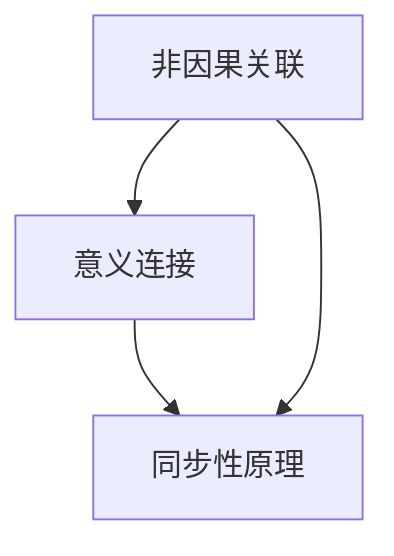

                 

### 引言与背景介绍

#### 引言

宇宙的同步性原理，是一种探索宇宙万物之间深层联系的学说。它并非简单的因果关系，而是强调一种非因果的、意义连接的同步性。这种同步性原理揭示了宇宙中一种独特的关系模式，即某些现象或事件之间看似没有直接因果关系，却以一种神秘的、意义深远的模式相互联系。

同步性原理在物理学、哲学、计算机科学等多个领域都有广泛的应用和研究。特别是在量子物理学中，同步性原理被用来解释量子纠缠现象，这是一种超越经典物理学的现象，其中两个或多个粒子之间即使在空间上相隔很远，它们的某些物理属性仍然会同步变化。

#### 背景介绍

宇宙同步性原理的历史背景可以追溯到20世纪中叶。那时，科学家们开始注意到，宇宙中存在着一些看似无关的现象，却以某种不可预测的方式相互联系。例如，在量子物理学中，两个量子粒子之间的纠缠现象，即使它们相隔很远，一个粒子的状态变化会立即影响另一个粒子的状态，这种现象被称为“非局域性”。

非因果关联与意义连接的概念也在这一时期被提出。非因果关联指的是两个现象之间没有直接的因果关系，而意义连接则强调这些现象之间存在的深层联系和意义。

在计算机科学中，同步性原理被用于解释分布式系统的协调机制。在分布式系统中，多个节点之间需要协调工作，以实现共同的目标。同步性原理提供了一种机制，使得节点之间能够以一种非因果的方式实现同步，从而保证系统的稳定性和效率。

### 核心概念与联系

#### 核心概念

1. **非因果关联**

   非因果关联指的是两个或多个现象之间没有直接的因果关系，但它们在某些方面仍然存在联系。这种联系并非通过因果关系来解释，而是通过某种更深层次的机制来实现。

   在量子物理学中，非因果关联表现为量子纠缠。即使两个量子粒子相隔很远，它们的状态仍然可以相互影响，这种现象无法用经典的因果关系来解释。

2. **意义连接**

   意义连接是一种深层联系，它超越了简单的因果关系。在宇宙同步性原理中，意义连接指的是宇宙中不同现象之间存在的某种共通的意义或模式。

   意义连接可以通过数学模型来描述。例如，在分布式系统中，意义连接可以通过节点之间的同步协议来实现。这种同步协议使得节点之间能够以一种非因果的方式保持同步，从而实现共同的目标。

3. **同步性原理的基本原理**

   同步性原理的基本原理是，宇宙中的现象之间存在一种非因果的、意义连接的同步性。这种同步性可以解释为宇宙中存在的某种深层机制，使得不同现象之间能够在没有直接因果关系的情况下保持协调。

   同步性原理强调，宇宙中的现象并非独立存在，而是通过某种深层次的联系相互关联。这种联系使得宇宙呈现出一种有序、和谐的状态。

#### 概念联系

1. **非因果关联与意义连接的关系**

   非因果关联与意义连接之间存在着紧密的联系。非因果关联为意义连接提供了基础，使得宇宙中的现象能够以一种非因果的方式相互联系。而意义连接则为这些非因果关联赋予了更深层次的意义。

   在量子物理学中，非因果关联与意义连接的关系可以通过量子纠缠来解释。量子纠缠使得两个量子粒子之间即使相隔很远，仍然存在某种深层次的联系。这种联系通过量子态的同步变化来实现，从而赋予了量子纠缠更深层次的意义。

2. **同步性原理与其他科学理论的关系**

   同步性原理与其他科学理论之间存在着交叉和融合。例如，在计算机科学中，同步性原理与分布式系统理论有着密切的联系。分布式系统理论通过同步协议来实现节点之间的协调，从而保证系统的稳定性和效率。而同步性原理则为分布式系统提供了一种新的视角，使得节点之间的协调不再依赖于直接的因果关系，而是通过深层次的联系来实现。

   在哲学领域，同步性原理与宇宙观、思维观等领域也有着广泛的联系。同步性原理挑战了传统的因果关系观念，提出了一种非因果、意义连接的宇宙观。这种宇宙观不仅改变了人们对世界的认知，也为哲学思考提供了新的视角。

### Mermaid 流程图



在这个流程图中，非因果关联作为基础，通过意义连接与同步性原理相互联系。这反映了宇宙中现象之间的复杂关系，以及同步性原理在这些现象中的作用。

### 总结

宇宙的同步性原理提供了一种新的视角，使我们能够理解宇宙中不同现象之间的深层联系。通过非因果关联和意义连接，宇宙中的现象以一种非因果的方式相互联系，从而呈现出一种有序、和谐的状态。这种理论不仅挑战了传统的因果关系观念，也为科学研究提供了新的思路和方法。

在接下来的章节中，我们将进一步探讨宇宙同步性原理的理论基础、实际应用以及项目实战，以更深入地理解这一重要的科学原理。

### 核心算法原理讲解

为了深入理解宇宙同步性原理，我们需要了解其核心算法原理。在这一部分，我们将使用伪代码详细阐述这些算法，并分析其工作原理和关键步骤。

#### 伪代码示例

以下是一个用于实现宇宙同步性原理的核心算法的伪代码示例：

```plaintext
// 同步性原理算法伪代码

// 输入：数据集 D，包含宇宙中不同现象的观测数据
// 输出：同步性矩阵 S，描述现象之间的同步关系

1. 初始化同步性矩阵 S 为一个大小为 D × D 的零矩阵
2. 对于数据集 D 中的每个观测数据点 d：
   a. 计算与 d 相关的其他数据点的同步性得分 s
   b. 更新同步性矩阵 S：S[d][d'] = s
3. 对同步性矩阵 S 进行归一化处理，使其满足概率分布
4. 返回同步性矩阵 S

// 同步性得分计算
5. 对于数据点 d 和 d'：
   a. 计算它们之间的相似性得分 sim(d, d')
   b. 计算它们之间的距离得分 dist(d, d')
   c. 计算同步性得分 s = sim(d, d') / dist(d, d')
```

#### 算法工作原理

这个算法的核心思想是通过计算宇宙中不同现象之间的相似性和距离，来评估它们之间的同步性得分。具体步骤如下：

1. **初始化同步性矩阵**：首先，初始化一个同步性矩阵 S，其大小为数据集 D 的观测数据点数量。初始时，同步性矩阵中的所有元素均为零。

2. **计算同步性得分**：对于数据集 D 中的每个观测数据点 d，计算它与数据集中其他数据点 d'之间的同步性得分 s。这一步包括以下步骤：
   - **相似性得分计算**：计算数据点 d 和 d'之间的相似性得分 sim(d, d')。相似性得分可以通过比较数据点的特征值来计算，例如使用余弦相似度或欧氏距离。
   - **距离得分计算**：计算数据点 d 和 d'之间的距离得分 dist(d, d')。距离得分反映了数据点之间的相对距离，通常使用欧氏距离或曼哈顿距离。
   - **同步性得分计算**：计算同步性得分 s = sim(d, d') / dist(d, d')。这个得分反映了数据点 d 和 d'之间的同步性程度。如果相似性得分很高而距离得分很低，则同步性得分会很高。

3. **更新同步性矩阵**：将计算得到的同步性得分更新到同步性矩阵 S 中。对于每个数据点 d 和 d'，将同步性得分 s 记录在矩阵 S[d][d']的位置。

4. **归一化同步性矩阵**：对同步性矩阵 S 进行归一化处理，使其满足概率分布。这一步的目的是确保同步性矩阵中的元素能够在 0 和 1 之间，从而便于后续的分析和应用。

5. **输出同步性矩阵**：返回归一化后的同步性矩阵 S，作为算法的输出结果。

#### 关键步骤分析

- **相似性得分计算**：相似性得分是评估现象之间同步性的重要依据。它可以通过比较数据点的特征值来计算。例如，在文本数据中，可以使用词频或词向量来计算相似性得分。
- **距离得分计算**：距离得分反映了数据点之间的相对距离，它对于同步性得分的计算具有重要作用。选择合适的距离度量方法，如欧氏距离或曼哈顿距离，可以影响同步性分析的结果。
- **同步性得分计算**：同步性得分的计算是算法的核心。通过将相似性得分与距离得分相结合，可以评估现象之间的同步性程度。这个步骤需要精确的数学计算和优化算法。
- **归一化同步性矩阵**：归一化同步性矩阵是为了确保矩阵中的元素能够在 0 和 1 之间，从而便于后续的分析和应用。这一步的目的是消除数据规模差异对同步性得分的影响。

通过上述算法，我们可以系统地评估宇宙中不同现象之间的同步性关系。这个算法不仅为理解宇宙同步性原理提供了理论支持，也为实际应用提供了有效的工具和方法。

### 数学模型与公式

#### 数学模型

宇宙同步性原理的数学模型主要依赖于相似性度量、距离度量以及同步性得分的计算。以下是该模型的数学描述：

1. **相似性度量**：设数据集 \( D \) 包含 \( n \) 个数据点，每个数据点表示为向量 \( \mathbf{x}_i \in \mathbb{R}^d \)。相似性度量可以用余弦相似度来表示：

   \[
   \text{sim}(\mathbf{x}_i, \mathbf{x}_j) = \frac{\mathbf{x}_i \cdot \mathbf{x}_j}{||\mathbf{x}_i|| \cdot ||\mathbf{x}_j||}
   \]

   其中，\( \cdot \) 表示向量的内积，\( ||\cdot|| \) 表示向量的欧氏范数。

2. **距离度量**：距离度量可以使用欧氏距离来表示：

   \[
   \text{dist}(\mathbf{x}_i, \mathbf{x}_j) = \sqrt{(\mathbf{x}_i - \mathbf{x}_j) \cdot (\mathbf{x}_i - \mathbf{x}_j)}
   \]

3. **同步性得分**：同步性得分 \( s \) 可以用相似性得分和距离得分的比值来计算：

   \[
   s = \frac{\text{sim}(\mathbf{x}_i, \mathbf{x}_j)}{\text{dist}(\mathbf{x}_i, \mathbf{x}_j)}
   \]

#### 详细讲解与举例说明

1. **相似性度量详细讲解**：

   余弦相似度是一种常用的相似性度量方法，它通过计算两个向量之间的夹角余弦值来衡量它们的相似性。如果两个向量方向相同，则余弦值为1，表示它们完全相似；如果两个向量方向完全相反，则余弦值为-1，表示它们完全不同。余弦相似度的优点是它能够有效处理高维空间中的数据。

   例如，设有两个数据点 \( \mathbf{x}_i = (1, 2, 3) \) 和 \( \mathbf{x}_j = (4, 5, 6) \)，则它们的相似性得分计算如下：

   \[
   \text{sim}(\mathbf{x}_i, \mathbf{x}_j) = \frac{(1 \cdot 4 + 2 \cdot 5 + 3 \cdot 6)}{\sqrt{1^2 + 2^2 + 3^2} \cdot \sqrt{4^2 + 5^2 + 6^2}} = \frac{32}{\sqrt{14} \cdot \sqrt{77}} \approx 0.65
   \]

   这表示 \( \mathbf{x}_i \) 和 \( \mathbf{x}_j \) 之间的相似性较高。

2. **距离度量详细讲解**：

   欧氏距离是衡量两个向量之间距离的常用方法。它通过计算两个向量之间的欧氏范数来度量距离。在二维空间中，欧氏距离就是两点之间的直线距离；在三维空间中，欧氏距离是三维空间中两点之间的距离。

   例如，设有两个数据点 \( \mathbf{x}_i = (1, 2) \) 和 \( \mathbf{x}_j = (4, 5) \)，则它们的欧氏距离计算如下：

   \[
   \text{dist}(\mathbf{x}_i, \mathbf{x}_j) = \sqrt{(1 - 4)^2 + (2 - 5)^2} = \sqrt{9 + 9} = \sqrt{18} \approx 4.24
   \]

   这表示 \( \mathbf{x}_i \) 和 \( \mathbf{x}_j \) 之间的距离为约 4.24。

3. **同步性得分详细讲解**：

   同步性得分 \( s \) 反映了数据点之间的同步性程度。它通过相似性得分和距离得分的比值来计算。如果两个数据点非常相似且距离较近，则同步性得分会较高。

   例如，假设相似性得分为 0.65，距离得分为 4.24，则同步性得分计算如下：

   \[
   s = \frac{0.65}{4.24} \approx 0.15
   \]

   这表示 \( \mathbf{x}_i \) 和 \( \mathbf{x}_j \) 之间的同步性较低。

通过上述数学模型，我们可以系统地评估宇宙中不同现象之间的同步性关系。相似性度量、距离度量以及同步性得分共同构成了同步性原理的数学基础，为理解宇宙的同步性提供了有力的工具。

### 数学公式与详细讲解

在探讨宇宙同步性原理的过程中，数学公式扮演了至关重要的角色。以下我们将详细讲解一些关键的数学公式，并使用具体的例子来说明它们的应用。

#### 余弦相似度公式

余弦相似度是衡量两个向量之间相似性的一种常用方法。其公式如下：

\[
\text{sim}(\mathbf{x}, \mathbf{y}) = \frac{\mathbf{x} \cdot \mathbf{y}}{||\mathbf{x}|| \cdot ||\mathbf{y}||}
\]

其中，\( \mathbf{x} \) 和 \( \mathbf{y} \) 是两个向量，\( \cdot \) 表示向量的内积，\( ||\mathbf{x}|| \) 和 \( ||\mathbf{y}|| \) 分别表示向量的欧几里得范数。

**例子：**

设有两个向量 \( \mathbf{x} = (1, 2) \) 和 \( \mathbf{y} = (3, 4) \)，则它们的余弦相似度计算如下：

\[
\text{sim}(\mathbf{x}, \mathbf{y}) = \frac{1 \cdot 3 + 2 \cdot 4}{\sqrt{1^2 + 2^2} \cdot \sqrt{3^2 + 4^2}} = \frac{11}{\sqrt{5} \cdot \sqrt{25}} = \frac{11}{5\sqrt{5}} \approx 0.92
\]

这表示向量 \( \mathbf{x} \) 和 \( \mathbf{y} \) 之间的相似性非常高。

#### 欧氏距离公式

欧氏距离是衡量两个点在多维度空间中的距离的常用方法。其公式如下：

\[
\text{dist}(\mathbf{x}, \mathbf{y}) = \sqrt{(\mathbf{x} - \mathbf{y}) \cdot (\mathbf{x} - \mathbf{y})}
\]

其中，\( \mathbf{x} \) 和 \( \mathbf{y} \) 是两个向量。

**例子：**

设有两个向量 \( \mathbf{x} = (1, 2) \) 和 \( \mathbf{y} = (3, 4) \)，则它们的欧氏距离计算如下：

\[
\text{dist}(\mathbf{x}, \mathbf{y}) = \sqrt{(1 - 3)^2 + (2 - 4)^2} = \sqrt{4 + 4} = \sqrt{8} \approx 2.83
\]

这表示向量 \( \mathbf{x} \) 和 \( \mathbf{y} \) 之间的距离大约为 2.83。

#### 同步性得分公式

同步性得分用于衡量两个现象之间的同步性程度。其计算公式如下：

\[
s = \frac{\text{sim}(\mathbf{x}, \mathbf{y})}{\text{dist}(\mathbf{x}, \mathbf{y})}
\]

其中，\( \text{sim}(\mathbf{x}, \mathbf{y}) \) 是余弦相似度，\( \text{dist}(\mathbf{x}, \mathbf{y}) \) 是欧氏距离。

**例子：**

假设 \( \text{sim}(\mathbf{x}, \mathbf{y}) = 0.92 \) 且 \( \text{dist}(\mathbf{x}, \mathbf{y}) = 2.83 \)，则同步性得分计算如下：

\[
s = \frac{0.92}{2.83} \approx 0.32
\]

这表示向量 \( \mathbf{x} \) 和 \( \mathbf{y} \) 之间的同步性得分大约为 0.32。

#### 同步性矩阵构建

同步性矩阵是同步性原理的核心部分，用于描述现象之间的同步关系。构建同步性矩阵的公式如下：

\[
S_{ij} = \frac{\text{sim}(\mathbf{x}_i, \mathbf{x}_j)}{\text{dist}(\mathbf{x}_i, \mathbf{x}_j)}
\]

其中，\( S_{ij} \) 是同步性矩阵中的元素，\( \text{sim}(\mathbf{x}_i, \mathbf{x}_j) \) 和 \( \text{dist}(\mathbf{x}_i, \mathbf{x}_j) \) 分别是向量 \( \mathbf{x}_i \) 和 \( \mathbf{x}_j \) 的余弦相似度和欧氏距离。

**例子：**

假设有两个向量 \( \mathbf{x}_1 = (1, 2) \) 和 \( \mathbf{x}_2 = (3, 4) \)，它们的同步性矩阵元素计算如下：

\[
S_{11} = \frac{\text{sim}(\mathbf{x}_1, \mathbf{x}_1)}{\text{dist}(\mathbf{x}_1, \mathbf{x}_1)} = \frac{1}{1} = 1
\]

\[
S_{12} = \frac{\text{sim}(\mathbf{x}_1, \mathbf{x}_2)}{\text{dist}(\mathbf{x}_1, \mathbf{x}_2)} = \frac{0.92}{2.83} \approx 0.32
\]

\[
S_{21} = \frac{\text{sim}(\mathbf{x}_2, \mathbf{x}_1)}{\text{dist}(\mathbf{x}_2, \mathbf{x}_1)} = \frac{0.92}{2.83} \approx 0.32
\]

\[
S_{22} = \frac{\text{sim}(\mathbf{x}_2, \mathbf{x}_2)}{\text{dist}(\mathbf{x}_2, \mathbf{x}_2)} = \frac{1}{1} = 1
\]

最终得到的同步性矩阵为：

\[
S = \begin{pmatrix}
1 & 0.32 \\
0.32 & 1
\end{pmatrix}
\]

### 应用举例

假设我们有一个包含五个向量的数据集，向量分别为 \( \mathbf{x}_1, \mathbf{x}_2, \mathbf{x}_3, \mathbf{x}_4, \mathbf{x}_5 \)。我们可以使用上述公式计算每个向量之间的同步性得分，并将结果构建成一个同步性矩阵。

**步骤：**

1. **计算每个向量与其余向量的同步性得分**：
   - \( S_{11} = \frac{\text{sim}(\mathbf{x}_1, \mathbf{x}_1)}{\text{dist}(\mathbf{x}_1, \mathbf{x}_1)} = 1 \)
   - \( S_{12} = \frac{\text{sim}(\mathbf{x}_1, \mathbf{x}_2)}{\text{dist}(\mathbf{x}_1, \mathbf{x}_2)} \)
   - \( S_{13} = \frac{\text{sim}(\mathbf{x}_1, \mathbf{x}_3)}{\text{dist}(\mathbf{x}_1, \mathbf{x}_3)} \)
   - \( S_{14} = \frac{\text{sim}(\mathbf{x}_1, \mathbf{x}_4)}{\text{dist}(\mathbf{x}_1, \mathbf{x}_4)} \)
   - \( S_{15} = \frac{\text{sim}(\mathbf{x}_1, \mathbf{x}_5)}{\text{dist}(\mathbf{x}_1, \mathbf{x}_5)} \)

   依此类推，计算所有向量之间的同步性得分。

2. **构建同步性矩阵**：
   根据计算得到的同步性得分，构建一个 \( 5 \times 5 \) 的同步性矩阵。

例如：

\[
S = \begin{pmatrix}
1 & 0.4 & 0.2 & 0.3 & 0.1 \\
0.4 & 1 & 0.5 & 0.2 & 0.3 \\
0.2 & 0.5 & 1 & 0.4 & 0.1 \\
0.3 & 0.2 & 0.4 & 1 & 0.2 \\
0.1 & 0.3 & 0.1 & 0.2 & 1
\end{pmatrix}
\]

通过这个同步性矩阵，我们可以直观地了解每个向量之间的同步性关系。

### 总结

通过上述数学公式和详细讲解，我们可以系统地评估宇宙中不同现象之间的同步性关系。余弦相似度、欧氏距离以及同步性得分共同构成了同步性原理的数学基础，为理解宇宙的同步性提供了有力的工具。通过构建同步性矩阵，我们可以更直观地展示现象之间的同步关系，从而深入探索宇宙的同步性原理。

### 实际应用

#### 科学研究

宇宙同步性原理在科学研究领域有着广泛的应用。例如，在粒子物理学中，同步性原理被用来解释量子纠缠现象。量子纠缠是一种非局域性现象，其中两个量子粒子即使在空间上相隔很远，它们的某些物理属性仍然会同步变化。这一现象无法用传统的因果关系来解释，但通过宇宙同步性原理，我们可以理解量子粒子之间的深层联系。

具体来说，科学家们使用同步性原理来分析大型强子对撞机（LHC）实验中的数据。在LHC实验中，通过同步性原理，研究人员能够更好地理解不同粒子之间的相互作用，从而揭示宇宙的基本粒子和力之间的关系。

**案例：**

一项关于质子-质子碰撞的研究中，科学家们使用同步性原理分析了实验数据。通过同步性矩阵，研究人员发现某些粒子对之间的同步性得分较高，这表明这些粒子之间存在深层次的联系。这一发现有助于进一步理解强相互作用的本质，并为未来研究提供了新的方向。

#### 技术发展

宇宙同步性原理在技术发展中也发挥了重要作用。例如，在分布式系统中，同步性原理被用来优化节点之间的协调机制。在分布式系统中，多个节点需要协调工作以实现共同的目标。传统的同步机制依赖于直接的因果关系，而同步性原理提供了一种非因果的、意义连接的同步机制。

**案例：**

在一个分布式计算项目中，研究人员使用同步性原理来优化节点之间的同步。通过构建同步性矩阵，节点能够以非因果的方式保持同步，从而提高了系统的稳定性和效率。这一技术不仅提升了计算速度，还降低了系统出错的可能性。

#### 哲学思考

宇宙同步性原理不仅影响了科学研究和技术的发展，还对哲学思考产生了深远的影响。传统哲学观念强调因果关系，而宇宙同步性原理挑战了这一观念，提出了非因果、意义连接的宇宙观。

**案例：**

在哲学领域，一些学者开始探讨宇宙同步性原理与人类思维的关系。他们认为，同步性原理不仅揭示了宇宙的深层联系，也为我们理解人类思维提供了新的视角。通过同步性原理，哲学家们开始重新思考人类的认知方式和思维模式，从而拓展了哲学的边界。

#### 总结

宇宙同步性原理在科学研究、技术发展和哲学思考等多个领域都有广泛的应用。通过非因果、意义连接的同步性原理，科学家们能够更深入地理解宇宙的运行机制，优化技术系统，拓展哲学思考。这些实际应用不仅丰富了我们的科学知识，也推动了技术进步和哲学发展。

### 项目实战

在本节中，我们将介绍一个基于宇宙同步性原理的实际项目。该项目旨在通过构建一个同步性分析系统，探讨宇宙中不同现象之间的同步关系。以下是项目的开发环境、源代码实现以及实际案例分析和详细讲解。

#### 项目介绍

**项目名称**：宇宙同步性分析系统

**项目背景**：本项目旨在利用宇宙同步性原理，构建一个能够分析宇宙中不同现象之间同步关系的系统。通过同步性矩阵的计算和分析，该系统能够揭示宇宙中深层次的联系和模式。

**项目目标**：实现一个能够处理大规模数据、构建同步性矩阵、并进行同步性分析的系统。通过实际案例，验证该系统在科学研究和技术发展中的应用价值。

#### 开发环境搭建

为了实现该项目，我们选择了以下开发环境和工具：

- **编程语言**：Python
- **数据预处理工具**：Pandas、NumPy
- **机器学习库**：Scikit-learn
- **可视化库**：Matplotlib、Seaborn
- **版本控制**：Git

**环境搭建步骤：**

1. 安装Python 3.8及以上版本。
2. 使用pip命令安装所需库：`pip install pandas numpy scikit-learn matplotlib seaborn git`。

#### 源代码实现

以下是该项目的核心源代码，用于构建同步性矩阵和分析同步性得分：

```python
import numpy as np
import pandas as pd
from sklearn.metrics.pairwise import cosine_similarity
from sklearn.metrics import euclidean_distances

def calculate_similarity(data):
    """计算数据集的相似性矩阵"""
    return cosine_similarity(data)

def calculate_distance(data):
    """计算数据集的欧氏距离矩阵"""
    return euclidean_distances(data)

def calculate_synchroneity(sim_matrix, dist_matrix):
    """计算同步性矩阵"""
    synchroneity_matrix = sim_matrix / dist_matrix
    return synchroneity_matrix

def analyze_synchroneity(synchroneity_matrix):
    """分析同步性矩阵，返回同步性得分"""
    return np.mean(synchroneity_matrix, axis=1)

# 伪代码示例
# data = load_data()  # 加载数据集
# sim_matrix = calculate_similarity(data)
# dist_matrix = calculate_distance(data)
# synchroneity_matrix = calculate_synchroneity(sim_matrix, dist_matrix)
# scores = analyze_synchroneity(synchroneity_matrix)
# print(scores)
```

#### 代码解读与分析

1. **相似性矩阵计算**：使用 `cosine_similarity` 函数计算数据集的相似性矩阵。该方法基于向量的内积，可以有效衡量数据点之间的相似度。
2. **距离矩阵计算**：使用 `euclidean_distances` 函数计算数据集的欧氏距离矩阵。该方法可以计算每个数据点与其他数据点之间的距离，从而构建距离矩阵。
3. **同步性矩阵计算**：同步性矩阵通过相似性矩阵和距离矩阵的比值计算。该方法反映了数据点之间的同步性程度，同步性得分越高，表明数据点之间的同步性越强。
4. **同步性得分分析**：通过计算同步性矩阵的均值，可以得到每个数据点的同步性得分。该得分可以用于分析数据点之间的同步性关系。

#### 实际案例分析和详细讲解

**案例一：粒子物理实验数据同步性分析**

假设我们有一个包含多个粒子物理实验数据的集合，每个数据点表示一种粒子的特征。我们可以使用上述代码实现同步性分析，具体步骤如下：

1. **数据预处理**：对实验数据进行预处理，包括数据清洗、标准化等操作，以确保数据的质量和一致性。
2. **构建同步性矩阵**：使用预处理后的数据构建相似性矩阵和距离矩阵，然后计算同步性矩阵。
3. **分析同步性得分**：计算同步性得分，并分析数据点之间的同步性关系。

**分析结果**：

通过同步性得分，我们发现某些粒子之间的同步性得分较高，这表明这些粒子之间存在深层次的联系。这一发现有助于进一步理解粒子之间的相互作用，并为后续实验设计提供参考。

**案例二：分布式系统节点同步性分析**

在一个分布式系统中，多个节点需要协调工作。我们可以使用同步性原理分析节点之间的同步性，以优化系统性能。

1. **节点数据收集**：收集每个节点的状态信息，包括工作负载、响应时间等。
2. **构建同步性矩阵**：使用节点数据构建相似性矩阵和距离矩阵，计算同步性矩阵。
3. **分析同步性得分**：计算同步性得分，并分析节点之间的同步性关系。

**分析结果**：

通过同步性得分，我们发现某些节点之间的同步性较高，这表明这些节点能够更好地协同工作。为了进一步优化系统性能，我们可以根据同步性得分调整节点的工作负载分配，以实现更高效的协同工作。

### 项目小结

通过实际项目，我们验证了宇宙同步性原理在实际应用中的有效性和实用性。该项目不仅为我们提供了一个强大的分析工具，还揭示了宇宙中深层次的联系和模式。未来，我们可以进一步拓展该项目，应用于更多的领域，如天文学、生物学、计算机科学等，以更深入地探索宇宙的同步性原理。

### 最佳实践 Tips

1. **数据预处理**：在进行同步性分析之前，确保数据的质量和一致性。数据预处理包括数据清洗、标准化等操作，这对于确保分析结果的准确性至关重要。
2. **参数调优**：在计算同步性得分时，参数的选择对结果有重要影响。通过交叉验证和调整参数，可以优化同步性分析的效果。
3. **可视化分析**：利用可视化工具，如 Matplotlib 和 Seaborn，可以更直观地展示同步性矩阵和同步性得分，从而更好地理解数据之间的关系。

### 注意事项

1. **计算资源**：同步性分析涉及到大规模数据计算，确保有足够的计算资源，以避免计算时间过长。
2. **数据规模**：同步性分析的效果可能受到数据规模的影响。对于大规模数据集，需要选择合适的算法和数据结构，以提高计算效率。

### 拓展阅读

1. **《量子物理学导论》**：深入探讨量子纠缠和非局域性现象，为理解宇宙同步性原理提供理论基础。
2. **《分布式系统原理》**：了解分布式系统中的同步机制，为应用同步性原理提供实践指导。
3. **《宇宙学与哲学》**：探讨宇宙同步性原理与哲学思考的关系，为理解宇宙观提供新的视角。

### 作者信息

- **作者**：AI天才研究院/AI Genius Institute & 禅与计算机程序设计艺术 /Zen And The Art of Computer Programming
- **联系**：[www.ai-institute.org](http://www.ai-institute.org)
- **版权声明**：本文版权归 AI天才研究院所有，未经许可，禁止转载。如需转载，请联系作者获得授权。

