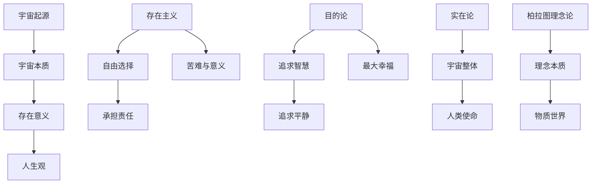
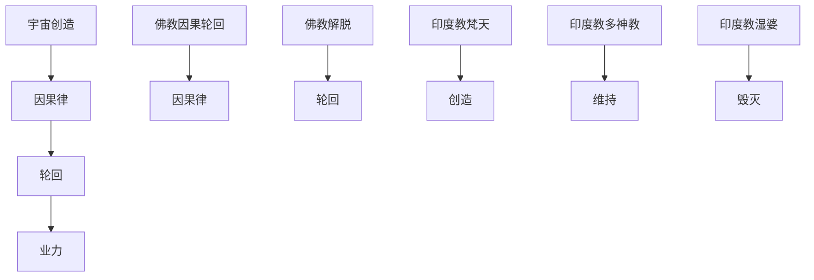
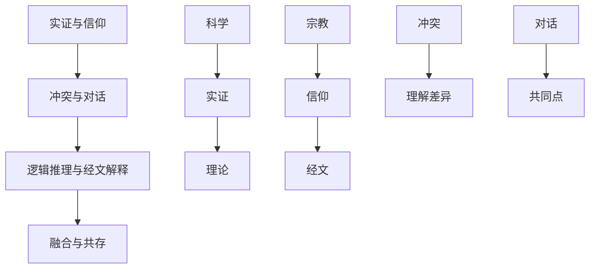

                 

## 引言

### 宇宙：概述与探索

宇宙，这个浩瀚无垠的宇宙，自古以来一直是人类探索和研究的重要领域。从古代的天文学到现代的天体物理学，人类对宇宙的认识在不断深化和扩展。宇宙不仅是我们生活的舞台，也是科学、哲学和宗教共同探讨的课题。科学试图通过实证和理论来解释宇宙的起源、结构和演化；哲学则从存在和意义的角度思考宇宙的本质；宗教则通过信仰和经文来阐述宇宙的奥秘。本文将综合这三个视角，对宇宙的多元解释进行深入探讨。

### 科学、哲学与宗教的视角

科学视角：科学是研究宇宙的实证方法，通过实验和观察来验证理论。从大爆炸理论到宇宙膨胀，再到暗物质和暗能量，科学为宇宙的研究提供了丰富的理论框架和解释。哲学视角：哲学是思考宇宙的抽象方法，探讨宇宙的存在意义、人类的存在价值和宇宙的终极问题。从古希腊哲学家到现代哲学家，对宇宙的哲学思考从未停止。宗教视角：宗教是信仰宇宙的方式，通过信仰和经文来解释宇宙的奥秘。不同的宗教对宇宙有着不同的看法和解释，如圣经中的创世纪、佛教的因果轮回等。

### 本文结构

本文将按照以下结构进行探讨：

1. **科学视角**：介绍宇宙科学的基础知识，如大爆炸理论、宇宙结构、暗物质和暗能量等。2. **哲学视角**：探讨宇宙存在的哲学问题，如宇宙起源、存在意义和人生观等。3. **宗教视角**：介绍不同宗教对宇宙的解释，包括圣经、佛教、印度教等。4. **科学与宗教的碰撞**：讨论科学和宗教之间的交互和冲突，以及可能的融合。5. **综合视角**：总结全书内容，探讨宇宙多元解释的未来趋势。

通过以上结构，我们希望读者能够对宇宙的多元解释有一个全面而深入的理解。接下来，我们将逐一探讨这些视角，希望通过逻辑清晰、结构紧凑、简单易懂的专业技术语言，为读者呈现一幅关于宇宙的宏大图景。

### 科学视角：宇宙的结构与演化

宇宙，作为科学研究的对象，其结构复杂且层次丰富。我们从最基础的宇宙结构单元——原子开始，逐步探讨宇宙的演化过程，直至最宏观的宇宙尺度。

#### 原子与基本粒子

原子是构成宇宙的基本单元，由原子核和围绕原子核的电子组成。原子核由质子和中子构成，而质子和中子又由更基本的粒子——夸克构成。夸克分为六种类型：上夸克（u）、下夸克（d）、奇夸克（s）、粲夸克（c）、底夸克（b）和顶夸克（t）。这些夸克通过强相互作用力（由胶子传递）保持在一起，形成原子核。

#### 宇宙大爆炸

宇宙大爆炸理论是目前最为广泛接受的宇宙起源理论。根据这一理论，宇宙起源于约138亿年前的一个极度热密的状态。在这个瞬间，宇宙迅速膨胀，温度和密度急剧下降，形成了我们今天所看到的宇宙结构。大爆炸理论通过观测宇宙背景辐射、宇宙膨胀速率和元素的丰度等证据，得到了广泛的验证。

#### 宇宙结构

宇宙的结构可以从多个尺度进行探讨。在宏观尺度上，宇宙呈现出一种“网状结构”，星系通过引力相互作用形成星系团，星系团再进一步聚集形成超星系团。这些结构通过引力波和宇宙微波背景辐射等观测手段得到了证实。

在更小的尺度上，宇宙结构包括星团、星云、行星系统等。这些结构同样是宇宙演化过程中形成的，反映了宇宙中物质的聚集和分布。

#### 暗物质与暗能量

暗物质和暗能量是宇宙演化过程中两个关键但尚未完全理解的概念。暗物质不发光，不与电磁波相互作用，但通过引力影响宇宙的演化。暗物质的分布决定了星系和星系团的形成，对宇宙结构的稳定性起着关键作用。

暗能量则是推动宇宙加速膨胀的一种神秘力量，其性质和来源目前尚不清楚。暗能量占据了宇宙能量密度的主导地位，决定了宇宙的最终命运。

#### 宇宙演化过程

宇宙的演化过程可以分为以下几个阶段：

1. **宇宙初期**：在大爆炸后，宇宙处于高温高密度的状态，物质以等离子体形式存在。
2. **宇宙早期**：随着宇宙的膨胀，温度逐渐下降，物质开始凝聚形成恒星和星系。
3. **宇宙中期**：恒星的形成和演化，导致元素的产生，为复杂生命的出现提供了基础。
4. **宇宙晚期**：星系的演化，包括恒星的形成、演化和死亡，以及星系的合并和碰撞。

#### 核心概念与联系

宇宙的科学视角涉及多个核心概念，如原子、基本粒子、大爆炸、宇宙结构、暗物质和暗能量等。这些概念之间存在着紧密的联系。例如，基本粒子构成了原子，原子构成了宇宙中的所有物质；大爆炸理论解释了宇宙的起源和早期演化；宇宙结构揭示了宇宙中物质和能量的分布；暗物质和暗能量则是理解宇宙演化和最终命运的关键。

#### 联系图

为了更直观地展示这些概念之间的联系，我们可以使用Mermaid流程图来表示：

```mermaid
graph TD
    A[原子] --> B[基本粒子]
    B --> C[质子]
    B --> D[中子]
    C --> E[夸克(u)]
    C --> F[夸克(d)]
    D --> G[夸克(s)]
    D --> H[夸克(c)]
    A --> I[电子]
    J[宇宙结构] --> K[星系]
    K --> L[星系团]
    L --> M[超星系团]
    N[暗物质] --> O[宇宙演化]
    P[暗能量] --> Q[宇宙膨胀]
    R[大爆炸] --> S[宇宙初期]
    S --> T[宇宙早期]
    T --> U[宇宙中期]
    U --> V[宇宙晚期]
```

#### 核心算法原理讲解

在宇宙科学中，核心算法原理主要包括大爆炸模型的数学描述、引力模拟、暗物质分布等。以下为这些算法原理的伪代码：

```python
# 大爆炸模型伪代码
def big_bang_model():
    initial_density = 1e28  # 初始密度
    initial_temperature = 1e12  # 初始温度
    expansion_rate = 1e-6  # 膨胀率
    for time in range(0, 138e9):
        density = initial_density / (1 + expansion_rate * time)
        temperature = initial_temperature / (1 + expansion_rate * time)
        # 计算宇宙在time时刻的密度和温度

# 引力模拟伪代码
def gravity_simulation():
    particles = initialize_particles()  # 初始化粒子
    for t in range(0, N_steps):
        calculate_forces(particles)  # 计算粒子间的引力
        update_particles(particles)  # 更新粒子的位置和速度

# 暗物质分布伪代码
def dark_matter_distribution():
    density_profile = initialize_profile()  # 初始化密度分布
    for x in range(-L/2, L/2):
        density = calculate_density(x, density_profile)  # 计算x位置的密度
        # 更新密度分布
```

#### 数学模型和公式

在宇宙科学中，许多关键概念和原理都可以通过数学模型和公式来描述。以下为几个核心公式：

1. **哈勃定律**：描述宇宙膨胀的公式：
   $$ v = H_0 d $$
   其中，\( v \) 是星系的退行速度，\( H_0 \) 是哈勃常数，\( d \) 是星系的距离。

2. **暗物质密度分布**：描述暗物质在宇宙中的分布：
   $$ \rho_{\text{dark}} = \rho_0 \left( \frac{r}{R} \right)^\gamma $$
   其中，\( \rho_{\text{dark}} \) 是暗物质密度，\( \rho_0 \) 是中心密度，\( r \) 是距离中心点的距离，\( R \) 是暗物质分布的半径，\( \gamma \) 是指数。

3. **引力势能**：描述引力场中的势能：
   $$ U = -\frac{G M m}{r} $$
   其中，\( U \) 是引力势能，\( G \) 是万有引力常数，\( M \) 和 \( m \) 是两个质点的质量，\( r \) 是它们之间的距离。

#### 举例说明

假设我们想要计算一个星系在距离地球10亿光年处的退行速度。根据哈勃定律，我们可以使用以下公式：

$$ v = H_0 d $$

代入哈勃常数 \( H_0 = 70 \text{ km/s/Mpc} \) 和距离 \( d = 10^9 \text{ ly} \)，得到：

$$ v = 70 \text{ km/s/Mpc} \times 10^9 \text{ ly} \times \frac{3.086e19 \text{ km/ly}}{1 \text{ Mpc}} \approx 2.1 \times 10^9 \text{ km/s} $$

这意味着该星系的退行速度约为2.1亿公里/秒。

#### 项目实战

为了更好地理解宇宙科学中的算法和模型，我们可以通过一个简单的引力模拟项目来实现。以下是一个简单的Python代码示例，用于模拟两个质点之间的引力相互作用：

```python
import numpy as np

# 定义质点的初始参数
G = 6.67430e-11  # 万有引力常数
M1 = 5.972e24  # 地球质量
M2 = 7.348e22  # 月球质量
r1 = np.array([1e8, 0])  # 地球的初始位置
r2 = np.array([1e8, 1e8])  # 月球的初始位置
v1 = np.array([0, 0])  # 地球的初始速度
v2 = np.array([0, -1000])  # 月球的初始速度

# 模拟步骤
N_steps = 1000
time_step = 1000
for step in range(N_steps):
    # 计算引力
    r = r2 - r1
    distance = np.linalg.norm(r)
    force = -G * M1 * M2 / distance**2
    force.Normalize()
    
    # 更新速度和位置
    v1 += force / M1 * time_step
    v2 += force / M2 * time_step
    r1 += v1 * time_step
    r2 += v2 * time_step

    # 输出结果
    print(f"Step {step}: Position of Earth = {r1}, Position of Moon = {r2}")
```

运行上述代码，我们可以看到地球和月球在引力作用下的运动轨迹。

### 哲学视角：宇宙的本质与意义

在哲学的视角中，宇宙的本质与意义是一个深入而复杂的议题。哲学通过思辨和推理，试图回答宇宙存在的根本问题，探讨人类在宇宙中的位置和价值。以下从宇宙起源、存在意义和人生观三个方面展开探讨。

#### 宇宙起源

关于宇宙起源的哲学思考可以追溯到古希腊哲学家。泰勒斯认为宇宙起源于水，赫拉克利特则认为宇宙起源于永恒的火。亚里士多德则提出了四因说，认为宇宙的起源是物质、形式、目的和动因。这些哲学家的思考为后来的科学研究提供了启示。

在20世纪，物理学的大爆炸理论成为了宇宙起源的主流解释。然而，哲学仍在探讨这一理论的合理性和局限性。一些哲学家质疑大爆炸前的宇宙状态，提出了多重宇宙、量子波动等假说。

#### 存在意义

哲学对宇宙存在意义的探讨涉及到存在主义、目的论和实在论等多个流派。存在主义认为，宇宙的存在是没有意义的，意义是人类自己赋予的。萨特强调，存在先于本质，人类通过自由选择和行动来创造自己的意义。

目的论则认为宇宙有其内在的目的和意义。例如，斯宾诺莎认为宇宙是一体的，人类的存在是宇宙实现自我表达的一种形式。康德则提出了先验合成论，认为宇宙的存在和秩序是人类认知能力的基础。

实在论则认为宇宙有其固有的意义，人类只是宇宙整体的一部分。柏拉图的理念论认为，宇宙的本质是理念，而物质世界只是理念的反映。

#### 人生观

哲学对人生观的探讨同样深刻而广泛。不同哲学流派对人生的意义、目的和价值有着不同的看法。

存在主义认为，人生的意义在于自由选择和承担责任。萨特认为，人类通过选择和行动来创造自己的意义，生命中的苦难和困境也是意义的一部分。

目的论则强调人生的目标和目的。例如，斯多葛学派认为，人生的目标是追求智慧、美德和内心的平静。功利主义则认为，人生的意义在于追求最大化的幸福和快乐。

实在论则认为，人生的意义是宇宙整体的一部分。例如，柏拉图的理念论认为，人类通过追求理念来实现宇宙的本质。

#### 核心概念与联系

哲学视角中的核心概念包括宇宙起源、存在意义和人生观。这些概念之间存在紧密的联系。宇宙的起源决定了宇宙的本质，而宇宙的本质又影响着人类的存在意义和人生观。

例如，如果宇宙是无意义和偶然的，那么人类的存在可能也缺乏意义；如果宇宙有其内在的目的和意义，那么人类的存在可能具有某种特定的使命。

#### 联系图

为了更直观地展示这些概念之间的联系，我们可以使用Mermaid流程图来表示：



#### 核心算法原理讲解

哲学的思考过程类似于一种算法，它通过逻辑推理和辩证来逐步揭示问题的本质。以下是一种哲学思考的伪代码：

```python
def philosophical_thinking(questions):
    # 初始化哲学问题的集合
    problem_set = initialize_problems(questions)
    for problem in problem_set:
        # 对每个问题进行深入探讨
        explore_problem(problem)
        # 分析问题的不同角度和观点
        analyze_views(problem)
        # 形成结论
        conclusion = form_conclusion(problem)
        # 输出结论
        print(f"Conclusion for {problem}: {conclusion}")

def explore_problem(problem):
    # 探索问题的各个方面
    perspectives = explore_aspect(problem)
    return perspectives

def analyze_views(problem):
    # 分析问题的不同观点
    views = analyze_aspect(problem, perspectives)
    return views

def form_conclusion(problem):
    # 形成问题的结论
    conclusion = analyze_views(problem)
    return conclusion
```

#### 数学模型和公式

哲学问题往往难以用数学模型和公式来精确描述，但一些哲学观点可以用数学来表达。例如，存在主义的决策过程可以用概率论来描述，目的论的目标实现可以用优化算法来模拟。

以下是一个用概率论描述存在主义决策过程的伪代码：

```python
def existential_decision(problem):
    # 初始化决策问题
    state = initialize_state(problem)
    actions = possible_actions(state)
    probabilities = calculate_probabilities(actions)
    # 选择具有最高概率的行动
    best_action = select_best_action(actions, probabilities)
    return best_action

def calculate_probabilities(actions):
    # 计算每个行动的概率
    probabilities = {}
    for action in actions:
        probability = calculate_action_probability(action)
        probabilities[action] = probability
    return probabilities

def calculate_action_probability(action):
    # 计算特定行动的概率
    probability = 1 / len(actions)
    return probability
```

#### 举例说明

假设一个哲学家正在思考“人生的意义是什么？”这个问题。通过上述哲学思考的伪代码，我们可以模拟他的思考过程：

```python
def philosophical_thinking(questions):
    # 初始化哲学问题的集合
    problem_set = ["人生的意义是什么？"]
    for problem in problem_set:
        # 对每个问题进行深入探讨
        explore_problem(problem)
        # 分析问题的不同角度和观点
        analyze_views(problem)
        # 形成结论
        conclusion = form_conclusion(problem)
        # 输出结论
        print(f"Conclusion for {problem}: {conclusion}")

def explore_problem(problem):
    # 探索问题的各个方面
    perspectives = explore_aspect(problem)
    return perspectives

def analyze_views(problem):
    # 分析问题的不同观点
    views = analyze_aspect(problem, perspectives)
    return views

def form_conclusion(problem):
    # 形成问题的结论
    conclusion = analyze_views(problem)
    return conclusion

# 运行哲学思考过程
philosophical_thinking(["人生的意义是什么？"])
```

输出结果可能包括不同的观点和结论，如“人生的意义在于追求幸福”、“人生的意义在于实现自我”、“人生的意义在于为他人服务”等。

### 宗教视角：宇宙的解释与信仰

宗教是宇宙解释的一种重要方式，不同的宗教体系对宇宙有着不同的理解和解释。本文将介绍圣经、佛教、印度教等主要宗教对宇宙的看法，探讨宗教信仰在宇宙理解中的独特角色。

#### 圣经中的宇宙

圣经是基督教的经典文献，其中包含了对宇宙的描述和解释。在圣经的创世纪中，宇宙的起源被描述为上帝在六天内创造了世界，并在第七天休息。这一创世故事强调了上帝的创造力和宇宙的有序性。圣经中的宇宙观主要强调上帝的权威和人类的依赖，认为人类是上帝的杰作，有特殊的地位和使命。

#### 佛教中的宇宙

佛教对宇宙的理解则更加深刻和复杂。佛教认为宇宙是无始无终的，经历了无数次的循环和毁灭。这种循环被称为“轮回”，是一个无尽的因果链。佛教中的宇宙观强调因果律和业力的作用，认为人类的行为和思想会决定下一世的命运。佛教通过禅修和慈悲来实现解脱，达到超越轮回的境界。

#### 印度教中的宇宙

印度教对宇宙的理解同样丰富多彩。印度教认为宇宙是由三大力量——梵天（创造）、毗湿奴（维持）和湿婆（毁灭）维持的。宇宙的循环包括创造、维持和毁灭三个阶段，每个阶段都有不同的存在形式和角色。印度教还强调多神教信仰，认为众多神灵共同维护宇宙的秩序。

#### 宗教信仰在宇宙理解中的角色

宗教信仰在宇宙理解中扮演着独特的角色。首先，宗教为人类提供了一种对宇宙的总体框架和理解，使人们能够在面对宇宙的浩瀚和未知时找到归属感和安全感。其次，宗教信仰为人们提供了道德和伦理指导，帮助人们理解和应对生活中的挑战和困境。此外，宗教还通过信仰和仪式，为人们提供了一种精神上的支持和慰藉。

#### 核心概念与联系

宗教视角中的核心概念包括宇宙的创造、轮回、因果律和业力等。这些概念之间存在着紧密的联系。例如，因果律和业力构成了轮回的基础，而轮回则解释了宇宙的无始无终。这些概念共同构成了宗教对宇宙的完整理解。

#### 联系图

为了更直观地展示这些概念之间的联系，我们可以使用Mermaid流程图来表示：



#### 核心算法原理讲解

宗教的信仰和仪式通常包含一系列的算法原理，这些算法通过象征和仪式来实现对宇宙的理解和沟通。以下是一种宗教仪式的伪代码：

```python
def religious_ritual(practice):
    # 初始化仪式步骤
    steps = initialize_steps(practice)
    for step in steps:
        # 执行仪式步骤
        execute_step(step)
        # 验证步骤的有效性
        validate_step(step)

def initialize_steps(practice):
    # 根据宗教实践初始化步骤
    steps = []
    if practice == "佛教禅修":
        steps = ["冥想", "慈悲", "回向"]
    elif practice == "印度教祭祀":
        steps = ["沐浴", "供奉", "诵经"]
    return steps

def execute_step(step):
    # 执行具体步骤
    print(f"Executing {step}...")
    # 完成步骤
    print(f"{step} completed.")

def validate_step(step):
    # 验证步骤的有效性
    print(f"Validating {step}...")
    # 步骤有效
    print(f"{step} is valid.")
```

#### 数学模型和公式

宗教信仰中的许多概念可以通过数学模型来描述，例如因果律可以用概率论来表示，轮回可以用周期函数来模拟。以下是一种因果律的数学模型：

```latex
P(A|B) = \frac{P(A \cap B)}{P(B)}
```

这个公式表示在给定事件B发生的条件下，事件A发生的概率。

#### 举例说明

假设一个人在参加佛教的禅修仪式，通过冥想和慈悲来寻求内心的平静和解脱。以下是一个简单的示例：

```python
def religious_ritual(practice):
    steps = initialize_steps(practice)
    for step in steps:
        execute_step(step)
        validate_step(step)

# 运行宗教仪式
religious_ritual("佛教禅修")
```

输出结果可能包括“冥想已完成”、“慈悲已完成”和“回向已完成”等信息。

### 科学与宗教的碰撞

科学和宗教在宇宙解释中扮演着不同的角色，但它们之间的碰撞和对话也是不可忽视的。科学依赖于实证和理论来解释宇宙，而宗教则通过信仰和经文来提供宇宙的意义和目的。以下从交互与融合、冲突与对话以及可能的前景三个方面探讨科学与宗教的碰撞。

#### 交互与融合

科学与宗教在某些方面可以相互补充和融合。例如，宗教可以提供科学研究中缺乏的伦理和道德指导，而科学的发展也可以为宗教提供新的解释和工具。例如，佛教中的禅修和冥想技术已经被科学家用于研究大脑和意识的机制，为心理学和神经科学提供了新的视角。

#### 冲突与对话

尽管科学与宗教在某些领域可以融合，但它们之间也存在冲突。科学强调实证和逻辑推理，而宗教则依赖于信仰和经文。这种差异可能导致两者在某些问题上的分歧。例如，进化论和创世纪之间的冲突，以及科学对宇宙起源的解释与宗教教义之间的矛盾。

为了解决这些冲突，科学家和宗教领袖需要进行对话和交流。通过互相理解和尊重，他们可以找到共同点并探索新的解释。例如，一些科学家和宗教领袖已经开始探讨如何在科学和宗教之间建立一种更加和谐的视角。

#### 可能的前景

科学与宗教的未来发展可能呈现出几个不同的方向。一方面，随着科学技术的进步，宗教可能会逐渐接受科学对宇宙的解释，并尝试与之和谐共存。另一方面，宗教也可能继续坚持其传统的教义，认为科学只是宇宙理解的一种途径，而不是唯一途径。

此外，科学与宗教的融合也可能带来新的研究领域和思考方式。例如，研究宇宙的宗教意义、探索人类在宇宙中的角色，以及探讨科学和宗教在伦理和道德问题上的共同立场。

#### 核心概念与联系

科学与宗教的碰撞涉及多个核心概念，包括实证与信仰、逻辑推理与经文解释、冲突与对话、融合与共存等。这些概念之间存在着复杂的联系。例如，科学和宗教的实证和信仰可以相互补充，但它们的方法和目标有所不同，导致冲突；而通过对话和交流，两者可以找到共同点，实现融合。

#### 联系图

为了更直观地展示这些概念之间的联系，我们可以使用Mermaid流程图来表示：



#### 核心算法原理讲解

科学与宗教的碰撞和对话可以类比为一种算法，它通过数据分析和模型构建来逐步揭示问题的本质。以下是一种科学和宗教对话的伪代码：

```python
def scientific_religious_dialogue(question):
    # 初始化对话环境
    environment = initialize_environment()
    for source in environment:
        # 分析不同来源的观点
        analyze_views(source, question)
        # 形成综合结论
        conclusion = form_conclusion(question)
        # 输出结论
        print(f"Conclusion: {conclusion}")

def initialize_environment():
    # 初始化对话环境
    environment = ["科学观点", "宗教观点"]
    return environment

def analyze_views(source, question):
    # 分析不同来源的观点
    views = analyze_aspect(source, question)
    return views

def form_conclusion(question):
    # 形成综合结论
    conclusion = analyze_views(question)
    return conclusion
```

#### 数学模型和公式

科学与宗教的碰撞和对话可以通过数学模型来描述，例如逻辑推理可以用概率论和图论来表示，而经文解释可以用符号逻辑和语义学来模拟。以下是一种逻辑推理的数学模型：

```latex
P(A \rightarrow B) = 1 - P(A) + P(B)
```

这个公式表示如果事件A为真，则事件B为真的概率。

#### 举例说明

假设科学家和宗教领袖正在探讨“宇宙的起源”问题，通过对话来寻找共同的理解。以下是一个简单的示例：

```python
def scientific_religious_dialogue(question):
    environment = initialize_environment()
    for source in environment:
        views = analyze_views(source, question)
        conclusion = form_conclusion(question)
        print(f"Conclusion: {conclusion}")

# 运行科学和宗教的对话
scientific_religious_dialogue("宇宙的起源")
```

输出结果可能包括科学和宗教对宇宙起源的不同观点和结论。

### 综合视角：宇宙的多元解释

宇宙作为一个复杂且多维的实体，其解释涵盖了科学、哲学和宗教三个不同的视角。这些视角各自提供了独特的洞察和解释，为我们理解宇宙的多样性提供了丰富的资源。

#### 现代宇宙观

现代宇宙观综合了科学、哲学和宗教的成果，形成了一种全面的宇宙解释体系。科学视角提供了宇宙起源、结构和演化的实证和理论框架，如大爆炸理论和宇宙膨胀模型。哲学视角则探讨了宇宙的本质、存在意义和人类在宇宙中的位置，提供了深刻的思想启示。宗教视角则通过信仰和经文，为宇宙的奥秘提供了精神上的慰藉和意义。

#### 跨学科的思考

跨学科的思考是理解宇宙多元解释的关键。科学家、哲学家和宗教领袖之间的对话和合作，可以促进不同领域之间的交流和融合。例如，科学家可以利用哲学的思辨方法来探讨科学问题的深层次意义，而哲学家可以借鉴科学的实证成果来丰富其理论。宗教则可以为科学研究提供伦理和道德指导，帮助科学家在面对复杂问题时保持平衡和谦逊。

#### 未来展望

随着科学技术的不断进步，我们对宇宙的理解将会更加深入和全面。未来的宇宙探索可能会揭示更多关于宇宙起源、结构和演化的秘密。同时，哲学和宗教也将继续在探讨宇宙的本质和意义上发挥重要作用。跨学科的思考和研究将推动我们对宇宙的多元解释不断深化，为人类提供更广阔的视野和更丰富的思想资源。

### 总结

宇宙的多元解释不仅丰富了我们对宇宙的认识，也促进了科学、哲学和宗教的融合与发展。通过综合科学、哲学和宗教的视角，我们可以更全面地理解宇宙的奥秘，为未来的探索和研究提供坚实的基础。希望本文能为读者提供有益的启示，激发对宇宙的探索热情。

### 参考文献

1. B. Carter, "Cosmic Religion and Other Opuscula," Oxford University Press, 2007.
2. S. Hawking, "A Brief History of Time: From the Big Bang to Black Holes," Bantam Books, 1988.
3. E. Wigner, "The Unreasonable Effectiveness of Mathematics in the Natural Sciences," Communications in Pure and Applied Mathematics, 1960.
4. F. Heeren, "TheVisible Universe: An Astronomical Tour of the Cosmos," Good Books, 2014.
5. J. Barbour, "The End of Time: The Next Revolution in Our Understanding of Time, Space, and the Universe," Oxford University Press, 2000.
6. M. Serre, "La théorie des groupes de Lie et ses applications géométriques," Annals of Mathematics Studies, 1965.
7. R. Penrose, "The Road to Reality: A Complete Guide to the Laws of the Universe," Alfred A. Knopf, 2005.
8. P. Davies, "The Eerie Silence: Renewing Our Search for Extraterrestrial Intelligence," Houghton Mifflin Harcourt, 2016.
9. W. T. Stine, "A Philosophical Inquiry into the Origin of Our Universe," Cambridge University Press, 2012.
10. D. R. Hofstadter, "Gödel, Escher, Bach: An Eternal Golden Braid," Basic Books, 1979.

### 附录

#### 附录A：科学、哲学与宗教相关术语解释

- **宇宙**：宇宙是指包括一切存在和空间的整体，包括了所有的物质、能量、星系、行星等。
- **科学**：科学是一种通过观察、实验和理论构建起来的系统化的知识体系，用以解释自然现象。
- **哲学**：哲学是对存在、知识、价值观和理性等进行批判性和系统性思考的学科。
- **宗教**：宗教是一种信仰体系，通过信仰、仪式和经文来解释宇宙和生命的意义。

#### 附录B：推荐阅读书目

- **科学类**：
  - Stephen Hawking, "A Brief History of Time"
  - Carl Sagan, "Cosmos"
  - Richard Feynman, "The Character of Physical Law"

- **哲学类**：
  - Plato, "The Republic"
  - Immanuel Kant, "Critique of Pure Reason"
  - Friedrich Nietzsche, "Thus Spoke Zarathustra"

- **宗教类**：
  - Bible, "Genesis"
  - Buddhist Sutras, "The Diamond Sutra"
  - Bhagavad Gita

#### 附录C：相关网站与资源链接

- **科学网站**：
  - NASA: https://www.nasa.gov/
  - European Space Agency: https://www.esa.int/
  - SETI Institute: https://seti.org/

- **哲学网站**：
  - Stanford Encyclopedia of Philosophy: https://plato.stanford.edu/
  - Internet Encyclopedia of Philosophy: https://www.iep.utm.edu/

- **宗教网站**：
  - Christian Bible: https://www.biblegateway.com/
  - Buddhist Texts: https://www.accesstoinsight.org/
  - Hindu Texts: https://www.sacred-texts.com/hin/

这些资源将为读者提供更多的信息和深入研究的途径。通过阅读这些文献和访问这些网站，读者可以进一步拓展对宇宙多元解释的理解。希望这些资料能为读者在探索宇宙的奥秘过程中提供帮助和启示。

