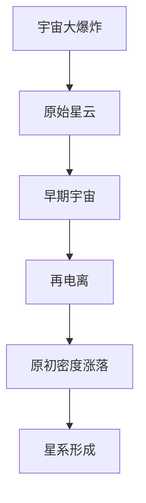
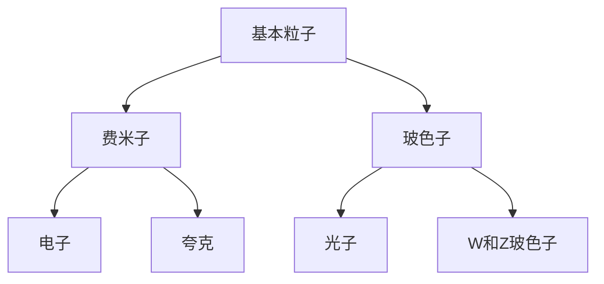
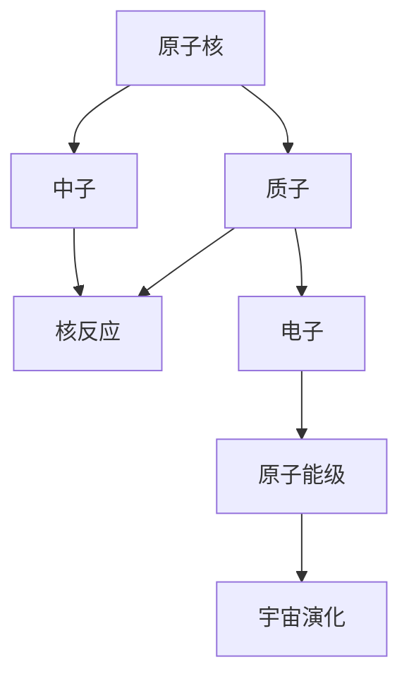

                 

### 文章标题

# 宇宙的层次结构：微观世界到宏观宇宙

### 关键词

- 宇宙起源
- 基本粒子
- 量子力学
- 行星系统
- 星系形成
- 宇宙膨胀

### 摘要

本文深入探讨了宇宙从微观到宏观的层次结构。首先，我们回顾了宇宙的起源和早期状态，包括宇宙大爆炸理论和早期宇宙的关键事件。接着，我们详细介绍了宇宙中的基本粒子，包括它们的分类、特性以及它们在宇宙中的作用。随后，文章讨论了量子力学与宇宙之间的关系，特别是波函数和薛定谔方程的重要性。在此基础上，我们进一步探讨了原子结构与宇宙的紧密联系，包括原子组成、核反应以及宇宙演化的关系。然后，文章转向宇宙中的行星系统，详细分析了太阳系行星与卫星、类地行星与类木行星、行星大气与气候等内容。最后，我们探讨了宇宙的宏观结构，包括星系的形成与演化、星系群与超星系团，以及宇宙的膨胀与未来。通过本文的深入分析，读者将全面理解宇宙的层次结构，并对其中的核心概念和原理有更深刻的认识。

### 第一部分：宇宙的微观结构

#### 第1章：宇宙的起源与早期状态

宇宙的起源与早期状态是宇宙学研究中的重要课题。为了理解宇宙的起源，我们首先需要了解宇宙学的定义与发展历程。宇宙学是研究宇宙起源、结构、演化和最终命运的学科。它涵盖了从宇宙大爆炸理论到早期宇宙的关键事件，为我们揭示了宇宙的起源之谜。

1. **宇宙学的定义与发展历程**

宇宙学的研究可以追溯到古希腊时期，当时的哲学家们开始思考宇宙的本质和起源。然而，宇宙学作为一门科学学科，其真正的发展始于20世纪。最早的宇宙学研究主要集中在宇宙的膨胀和结构上，这得益于哈勃定律的发现。哈勃定律表明，宇宙中的星系正在相互远离，这一发现为宇宙大爆炸理论提供了有力的支持。

随着科学技术的进步，宇宙学的研究领域不断拓展。从宇宙微波背景辐射的发现，到宇宙膨胀的加速，再到暗物质和暗能量的研究，宇宙学的发展历程充满了对宇宙本质的不断探索和认知的深化。

2. **宇宙大爆炸理论**

宇宙大爆炸理论是当前宇宙学中最广泛接受的理论，它描述了宇宙从极热、极密的状态开始膨胀的过程。根据这一理论，宇宙在大约138亿年前从一个奇点开始爆炸，随着宇宙的膨胀，温度和密度逐渐降低，宇宙逐渐冷却并形成了我们今天所看到的宇宙结构。

宇宙大爆炸理论得到了多个观测结果的证实，例如宇宙微波背景辐射的发现、宇宙膨胀的速度和星系分布等。这些证据表明，宇宙大爆炸理论是一个合理的宇宙起源模型。

3. **宇宙早期状态的关键事件**

宇宙早期状态的关键事件对宇宙的演化和结构有着深远的影响。这些事件包括宇宙的再电离、重子密度波的生成、原初密度的涨落等。

再电离是指宇宙在早期阶段，由于宇宙温度较高，电子和质子结合成中性氢原子，使宇宙变得透明。这一过程对宇宙的光度和辐射有着重要影响。

重子密度波是宇宙早期密度涨落的体现，它们是宇宙结构形成的基础。这些密度波在宇宙膨胀过程中逐渐增强，形成了今天我们所见的星系和星系团。

原初密度涨落是宇宙早期密度分布的不均匀性，它们是星系和星系团形成的关键。通过观测宇宙微波背景辐射的温度起伏，我们可以直接测量这些原初密度涨落，从而了解宇宙的早期状态。

### 第2章：宇宙中的基本粒子

宇宙中的基本粒子是宇宙结构的基础，它们包括夸克、电子、光子等。这些基本粒子在宇宙中起着至关重要的作用，从宇宙的起源到星系的演化，它们无处不在。

1. **基本粒子的分类与特性**

基本粒子可以分为两类：费米子（如电子、夸克）和玻色子（如光子、W和Z玻色子）。费米子是构成物质的基本单位，而玻色子则主要负责传递基本相互作用。

电子是最常见的费米子，它带有一个负电荷，是原子中最重要的基本粒子之一。电子在原子核外的运动决定了原子的性质。

夸克是构成质子和中子的基本粒子，它们带有分数电荷。夸克有六种类型，分别称为上夸克、下夸克、奇夸克、粲夸克、底夸克和顶夸克。夸克通过强相互作用相互结合，形成了质子和中子。

光子是最常见的玻色子，它不带电荷，是电磁相互作用的载体。光子在宇宙中的传播和相互作用决定了宇宙的光度和辐射。

2. **强相互作用与夸克**

强相互作用是四种基本相互作用中最强的一种，它负责保持夸克和胶子之间的结合。强相互作用通过交换胶子来实现，胶子是强相互作用的载体粒子。

强相互作用的强度由量子色动力学（QCD）描述。QCD是一个非阿贝尔规范理论，它解释了夸克之间的强相互作用以及它们的颜色性质。

3. **弱相互作用与基本粒子**

弱相互作用是四种基本相互作用中最弱的一种，但它负责了某些重要的物理过程，如放射性衰变和粒子对撞。弱相互作用通过交换W和Z玻色子来实现。

W和Z玻色子是弱相互作用的载体粒子。W玻色子带有电荷，负责电荷守恒，而Z玻色子不带电荷，负责弱相互作用中的中性过程。

除了W和Z玻色子，弱相互作用还涉及中微子，中微子是弱相互作用的载体粒子之一，它们不带电荷，但参与了弱相互作用。

### 第3章：量子力学与宇宙

量子力学是研究微观世界的基本理论，它描述了微观粒子的行为和相互作用。量子力学与宇宙之间的关系密不可分，许多宇宙现象都可以通过量子力学来解释。

1. **量子力学的基本原理**

量子力学的基本原理包括波粒二象性、不确定性原理和量子态叠加。波粒二象性描述了微观粒子既具有波动性又具有粒子性。不确定性原理则指出，我们无法同时精确测量一个粒子的位置和动量。量子态叠加则表明，微观粒子可以同时处于多个状态，直到被测量时才确定其具体状态。

2. **波函数与薛定谔方程**

波函数是量子力学中描述粒子状态的数学函数，它包含了粒子的位置、速度、动量等信息。薛定谔方程是量子力学中描述波函数演化的重要方程，它是一个二阶偏微分方程，描述了波函数在时间上的演化。

薛定谔方程的解可以给出粒子的能量本征态，这些能量本征态构成了粒子的量子态。通过解薛定谔方程，我们可以预测粒子的行为和性质。

3. **黑洞与量子力学**

黑洞是宇宙中最神秘的现象之一，它是由极端密集的物质形成的。黑洞的引力场非常强，以至于连光都无法逃脱。量子力学与黑洞之间的关系在近年来引起了广泛关注。

根据量子力学，黑洞的边界（事件视界）是一个量子态，它可以将黑洞内部的物质和能量转化为黑洞的外部信息。这种信息转化被称为霍金辐射，它是由英国物理学家史蒂芬·霍金提出的。

霍金辐射表明，黑洞并不是完全不可逆转的，它可以通过辐射能量和信息来蒸发。这一理论不仅挑战了传统的黑洞观念，还为量子力学与宇宙学之间的联系提供了新的研究方向。

### 第4章：原子结构与宇宙

原子是宇宙中最基本的物质单位，它由原子核和电子组成。原子结构在宇宙演化中起着至关重要的作用，它不仅决定了物质的存在形式，还影响了宇宙的化学组成。

1. **原子的组成与结构**

原子由原子核和核外电子组成。原子核由质子和中子组成，质子带有正电荷，中子不带电荷。核外电子围绕原子核运动，它们带有负电荷，并且按照一定的轨道分布。

原子的结构决定了原子的性质。例如，原子的电子排布决定了原子的化学性质，不同的电子排布方式会导致不同的化学反应。

2. **原子核与核反应**

原子核是原子的核心，它由质子和中子组成。原子核的稳定性由核力和库仑力共同决定。核力是一种强相互作用，它将质子和中子紧密地结合在一起。库仑力是一种电磁力，它使质子之间产生斥力。

核反应是原子核发生变化的过程，包括核聚变、核裂变和放射性衰变等。核聚变是指两个轻原子核结合成一个更重的原子核，这种反应在恒星内部发生。核裂变是指一个重原子核分裂成两个或更多的轻原子核，这种反应在核电站和原子弹中发生。放射性衰变是指原子核不稳定，自发地放出粒子或辐射，转变为另一个原子核。

3. **原子能级与宇宙演化**

原子能级是指原子内部电子的能量状态。原子能级决定了电子的运动轨道和能量状态，从而决定了原子的性质。

原子能级与宇宙演化密切相关。在宇宙早期，温度和密度非常高，原子无法形成。随着宇宙的膨胀和冷却，温度逐渐降低，原子开始形成。原子能级决定了原子的光谱，通过观测原子的光谱，我们可以了解宇宙的早期状态。

此外，原子能级还影响了宇宙的化学组成。在宇宙早期，只有最简单的原子（如氢、氦）存在。随着宇宙的演化，更复杂的原子通过核反应逐渐形成，这些原子构成了宇宙中的所有物质。

### 第二部分：宇宙中的行星系统

#### 第5章：太阳系行星与卫星

太阳系是宇宙中的一个恒星系统，由太阳和围绕太阳旋转的八大行星、矮行星、小行星、彗星等组成。太阳系行星与卫星的发现和研究，为我们揭示了行星系统的多样性和复杂性。

1. **行星形成与演化**

行星的形成过程是一个复杂的物理和化学过程。一般来说，行星形成于原始星云，这是一个由气体、尘埃和微小的固体颗粒组成的盘状结构。在星云的中心，由于引力作用，气体和尘埃逐渐聚集，形成了原始行星核心。随着核心的增大，引力作用增强，更多的物质被吸引到核心周围，形成了行星。

行星的演化过程包括原始行星核心的形成、大气层的形成和演化、卫星的捕获等。行星的演化受到多种因素的影响，包括行星内部的物理和化学过程、行星轨道的稳定性、外部环境等。

2. **行星类型与特性**

太阳系中的行星可以分为类地行星、类木行星和远日行星等不同类型。类地行星包括水星、金星、地球和火星，它们具有岩石或金属组成，密度较大。类木行星包括木星、土星、天王星和海王星，它们主要由气体组成，具有广阔的大气层。远日行星包括冥王星、柯伊伯带天体等，它们位于太阳系的外围。

不同类型的行星具有不同的特性。例如，类地行星表面温度较低，可能存在液态水。类木行星大气层中含有大量的氢和氦，表面温度较低，可能存在液态氢。远日行星由于距离太阳较远，表面温度非常低，可能存在冰冻的表面。

3. **行星卫星系统**

太阳系中的行星都拥有自己的卫星系统。卫星是围绕行星旋转的天体，它们可以是天然形成的，也可以是通过撞击形成的。太阳系中的行星卫星系统非常多样化，有些行星拥有大量卫星，而有些行星则只有一个或没有卫星。

行星卫星系统的形成机制有多种，包括潮汐锁定、引力捕获、撞击等。潮汐锁定是指行星和卫星之间的引力相互作用，使得卫星总是以同一面面对行星。引力捕获是指一个较大的天体捕获一个较小的天体，使其成为卫星。撞击是指两个天体在相遇时产生碰撞，形成卫星。

行星卫星系统对行星的演化和环境有着重要影响。例如，卫星的存在可以稳定行星的轨道，防止行星被太阳的引力扰乱。卫星的大气层也可能对行星的大气层产生影响，例如反射和吸收太阳辐射，影响行星的温度。

#### 第6章：类地行星与类木行星

类地行星和类木行星是太阳系中两种主要类型的行星。它们在物理性质、大气层和宜居性等方面存在显著差异，对太阳系的行星科学研究具有重要意义。

1. **类地行星的特性和探测**

类地行星包括水星、金星、地球和火星，它们具有岩石或金属组成，密度较大，表面温度较低。类地行星的探测目标是寻找与地球相似的宜居行星，即“类地宜居行星”。

类地行星的特性包括：

- **岩石或金属组成**：类地行星的核心由岩石或金属组成，这决定了它们的密度和物理性质。
- **固体表面**：类地行星具有固体表面，表面可能存在火山、陨石坑、极地冰帽等特征。
- **大气层**：类地行星的大气层主要由氮、氧、二氧化碳等气体组成，大气层的厚度和成分对行星的温度和气候有重要影响。

类地行星的探测方法包括地面观测、空间探测和望远镜观测。地面观测可以测量行星的辐射、光谱和表面特征。空间探测如火星探测器可以直接测量行星的大气成分、表面环境和重力场。望远镜观测可以探测行星的凌星信号，从而推断行星的半径、质量和大气成分。

2. **类木行星的特性和探测**

类木行星包括木星、土星、天王星和海王星，它们主要由气体组成，具有广阔的大气层，表面温度较低。类木行星的探测目标是了解它们的组成、大气层和磁层。

类木行星的特性包括：

- **气体组成**：类木行星的核心可能由岩石或金属组成，但大部分质量集中在广阔的大气层中，主要由氢和氦等轻元素组成。
- **广阔大气层**：类木行星的大气层厚达数千千米，存在明显的层状结构，包括对流层、平流层、热层等。
- **磁层**：类木行星具有强大的磁层，磁层中的粒子运动和辐射对行星的大气层有重要影响。

类木行星的探测方法包括空间探测和望远镜观测。空间探测如木星探测器可以直接测量行星的大气成分、磁场和辐射。望远镜观测可以探测行星的磁场、极光和卫星系统。

3. **行星宜居性评估**

行星宜居性是指行星上可能存在生命的基本条件。行星宜居性的评估需要考虑多个因素，包括大气层、表面温度、水资源和稳定性等。

类地行星和类木行星的宜居性评估方法有所不同。类地行星的宜居性评估主要考虑大气层的厚度和成分、表面温度和水资源。类木行星的宜居性评估则更侧重于大气层的成分、磁层和表面环境。

- **大气层厚度和成分**：适宜生命存在的大气层需要有一定的厚度和成分，能够维持适宜的气候和化学环境。
- **表面温度**：适宜生命存在的表面温度需要在一个适宜的范围内，既不能过高也不能过低，以保持液态水的存在。
- **水资源**：水是生命存在的关键，行星上需要存在液态水才能支持生命的存在。
- **稳定性**：行星的稳定性包括轨道稳定性、磁层稳定性等，稳定的环境对生命的存在和演化至关重要。

#### 第7章：行星大气与气候

行星大气是行星的重要组成部分，它影响着行星的气候、表面环境和生命存在。行星大气的组成、结构和运动对行星宜居性评估具有重要意义。

1. **行星大气层的组成与特性**

行星大气层由多种气体和粒子组成，不同行星的大气层成分和特性各异。例如，地球的大气层主要由氮（约78%）、氧（约21%）和少量的其他气体组成，而木星的大气层则主要由氢（约75%）和氦（约24%）组成。

行星大气层的特性包括：

- **温度分布**：行星大气层的温度分布受多种因素影响，包括行星的内部热量、太阳辐射和大气层的运动。
- **大气成分**：大气层的成分决定了行星的光谱特性、辐射和化学反应。
- **大气层厚度**：大气层的厚度影响行星的气候和环境，较厚的大气层可以提供更多的保护和调节。
- **大气环流**：大气层的运动形成了大气环流，这种环流对行星的气候和天气有重要影响。

2. **行星气候与生命存在**

行星气候是指行星上长时间稳定的气候模式，它由大气层、地表特征和内部热力学过程共同决定。行星气候对生命存在具有重要影响，适宜的气候条件能够支持生命的存在和演化。

行星气候的影响因素包括：

- **太阳辐射**：太阳辐射是行星气候的主要驱动力，太阳辐射的强度和变化影响行星的温度和气候。
- **大气层**：大气层对太阳辐射的吸收、反射和散射影响行星的辐射平衡和温度分布。
- **地表特征**：地表特征如山脉、海洋和冰帽等对行星的气候有重要影响，可以影响大气环流和降水模式。

3. **行星气候模型与模拟**

行星气候模型是模拟行星气候系统的方法，它通过计算机模拟行星大气层、地表和内部热力学过程的相互作用。行星气候模型可以帮助我们预测行星的气候变化，评估行星的宜居性。

行星气候模型的主要内容包括：

- **大气环流模型**：大气环流模型描述行星大气层的运动和环流模式，包括大气温度、风速和湿度等变量。
- **辐射传输模型**：辐射传输模型描述行星大气层中的辐射传输过程，包括太阳辐射的吸收、反射和散射。
- **地表过程模型**：地表过程模型描述行星地表的特征和过程，包括地表温度、降水、冰冻和解冻等。
- **全球气候模型**：全球气候模型综合以上模型，模拟行星的全球气候系统。

通过行星气候模型，我们可以对行星的气候进行预测和评估，为寻找外星生命和了解行星演化提供重要依据。

### 第三部分：宇宙的宏观结构

#### 第8章：星系的形成与演化

星系是宇宙中的基本结构单元，由大量的恒星、星际物质和暗物质组成。星系的形成与演化是一个复杂而漫长的过程，涉及多种物理机制和能量转换。

1. **星系的分类与结构**

星系可以分为椭圆星系、螺旋星系和不规则星系等不同类型。椭圆星系通常呈椭圆形，恒星分布密集，亮度较高。螺旋星系具有明显的旋臂结构，恒星分布较为稀疏，亮度较低。不规则星系则没有明显的形状，恒星分布不均匀。

星系的核心部分是星系核，它由大量恒星和星际物质组成，是星系的引力中心。星系核通常包含一个超大质量黑洞，黑洞的强大引力对星系核的稳定性和演化有重要影响。

2. **星系的形成机制**

星系的形成机制尚未完全明确，但广泛认为与宇宙大爆炸后的物质分布和引力作用有关。在宇宙早期，物质通过引力作用聚集形成星系。星系的形成过程可以分为以下几个阶段：

- **星系前体**：宇宙中的气体和尘埃在引力作用下聚集形成星系前体，这些前体是星系形成的早期阶段。
- **星系形成**：星系前体继续聚集物质，引力不断增强，最终形成成熟的星系。星系形成过程中，恒星的形成和演化是关键步骤。
- **星系演化**：成熟的星系继续演化，恒星之间的相互作用、星系核的活动和星际物质的循环等过程对星系的形态和性质有重要影响。

3. **星系的演化过程**

星系的演化是一个长期的过程，涉及恒星形成、恒星演化、星系碰撞和合并等多个阶段。星系的演化过程可以分为以下几个阶段：

- **恒星形成阶段**：在星系形成过程中，星际物质中的气体和尘埃在引力作用下聚集形成恒星。恒星的形成通常发生在星系的旋臂结构中，旋臂提供了适宜的物理环境。
- **恒星演化阶段**：恒星形成后，开始经历主序阶段、红巨星阶段、白矮星阶段等演化过程。恒星之间的相互作用和恒星内部核反应对星系的形态和性质有重要影响。
- **星系碰撞和合并阶段**：星系之间的相互作用可能导致星系碰撞和合并。星系碰撞和合并过程中，恒星、星际物质和黑洞之间的相互作用会产生新的物理现象和能量释放。
- **星系老化阶段**：成熟的星系逐渐进入老化阶段，恒星耗尽燃料，开始进入红巨星和行星状星云等演化阶段。星系老化的过程中，恒星和星际物质的循环继续进行，影响星系的形态和性质。

通过研究星系的形成与演化，我们可以更深入地理解宇宙的结构和演化过程，为探索宇宙的起源和未来提供重要依据。

#### 第9章：星系群与超星系团

星系群与超星系团是宇宙中的大尺度结构，由多个星系通过引力相互作用聚集在一起。它们在宇宙演化中扮演着重要角色，对理解宇宙的结构和动力学有重要意义。

1. **星系群的定义与特性**

星系群是指由数十个到数千个星系通过引力相互作用聚集在一起的天体系统。星系群可以分为几种类型：

- **紧密星系群**：星系群中的星系紧密排列，相互之间的距离较小，引力相互作用较强。紧密星系群通常具有较紧密的形态和较高的恒星密度。
- **疏散星系群**：星系群中的星系分布较稀疏，相互之间的距离较大，引力相互作用较弱。疏散星系群通常具有较松散的形态和较低的恒星密度。

星系群的特性包括：

- **星系分布**：星系群中的星系分布通常呈椭圆形或不规则形，星系的排列方式可能受到引力相互作用的影响。
- **恒星数量**：星系群中的星系数量从数十个到数千个不等，恒星总数可达数亿颗。
- **引力相互作用**：星系群中的星系通过引力相互作用保持在一起，引力相互作用对星系的运动和形态有重要影响。

2. **超星系团的形成与演化**

超星系团是由多个星系群通过引力相互作用聚集在一起形成的大尺度结构。超星系团的形成机制和演化过程与星系群类似，但涉及更大规模的天体系统。

超星系团的形成通常分为以下几个阶段：

- **星系群的聚集**：在宇宙早期，星系群开始通过引力相互作用聚集在一起，形成更大的星系团。
- **星系团的合并**：随着宇宙的演化，星系团之间的相互作用不断增强，导致星系团的合并。合并过程中，星系团中的星系发生碰撞和合并，形成更大的星系团。
- **星系团的演化**：超星系团的形成后，继续经历恒星形成、恒星演化、星系碰撞和合并等演化过程。星系团中的星系通过相互作用和能量交换，影响星系团的形态和性质。

3. **宇宙大尺度结构**

宇宙大尺度结构是指宇宙中大规模星系和星系团的分布和排列。宇宙大尺度结构的研究揭示了宇宙的演化过程和宇宙学的基本原理。

宇宙大尺度结构的主要特征包括：

- **宇宙微波背景辐射**：宇宙微波背景辐射是宇宙早期的热辐射，它揭示了宇宙早期的密度波动和结构形成。
- **星系分布**：星系在宇宙中的分布形成了一个多层次的结构，包括星系、星系群、星系团和超星系团。
- **宇宙膨胀**：宇宙的膨胀对宇宙大尺度结构有重要影响，星系和星系团在宇宙膨胀过程中不断分离。

通过研究宇宙大尺度结构，我们可以更深入地理解宇宙的起源、演化和未来，为宇宙学的探索提供重要依据。

#### 第10章：宇宙的膨胀与未来

宇宙的膨胀是当前宇宙学中最基本的观测事实之一，它揭示了宇宙从过去到未来的演化过程。宇宙的膨胀不仅影响了宇宙的结构和形态，还决定了宇宙的未来命运。

1. **宇宙膨胀理论**

宇宙膨胀理论描述了宇宙从大爆炸后不断扩张的过程。根据这一理论，宇宙在最初时刻处于一个极热、极密的状态，然后开始膨胀。宇宙膨胀理论的主要内容包括：

- **哈勃定律**：哈勃定律表明，宇宙中的星系正在相互远离，远离速度与星系之间的距离成正比。这一发现表明宇宙在膨胀。
- **宇宙膨胀参数**：宇宙膨胀参数描述宇宙膨胀的速率和加速度。宇宙膨胀参数的测量为我们了解宇宙的膨胀历史和未来提供了重要信息。

2. **宇宙背景辐射**

宇宙背景辐射是宇宙早期残留的热辐射，它揭示了宇宙早期的状态和结构。宇宙背景辐射的发现是宇宙膨胀理论的重要证据之一。宇宙背景辐射的主要特征包括：

- **温度**：宇宙背景辐射的温度约为2.7开尔文，这个温度表明宇宙在早期处于热平衡状态。
- **辐射强度**：宇宙背景辐射的辐射强度非常低，但覆盖了整个宇宙。
- **偏振**：宇宙背景辐射具有微弱的偏振现象，这为研究宇宙早期状态和结构提供了重要线索。

3. **宇宙的未来**

宇宙的未来取决于多种因素，包括宇宙膨胀的速率、暗能量的性质等。根据目前的观测数据，宇宙的未来可能有以下几种情况：

- **加速膨胀**：如果宇宙膨胀速率不断增加，宇宙可能最终变成一个稀薄的、寒冷的、无生命的宇宙。
- **热寂**：如果宇宙继续加速膨胀，最终可能达到热寂状态，即宇宙中的所有能量都耗尽，宇宙变得寂静。
- **宇宙大碰撞**：如果宇宙膨胀速率减缓，宇宙可能最终停止膨胀，然后开始收缩，最终发生宇宙大碰撞，形成一个全新的宇宙。
- **多宇宙**：一些理论认为，宇宙可能存在多个平行宇宙，这些宇宙之间可能发生相互作用和碰撞。

通过研究宇宙的膨胀与未来，我们可以更深入地理解宇宙的本质和演化过程，为探索宇宙的起源和未来提供重要依据。

### 附录

#### 附录A：宇宙的层次结构Mermaid流程图

1. **宇宙的起源与早期状态**



2. **基本粒子分类与特性**



3. **原子结构与宇宙**



#### 附录B：核心算法原理与数学模型讲解

1. **量子力学基本原理**

```plaintext
伪代码：量子力学基本原理

function quantum_mechanics() {
    // 波粒二象性
    particle.wave_function()

    // 不确定性原理
    uncertainty原理()

    // 量子态叠加
    superposition()

    // 薛定谔方程
    schrodinger_equation()

    return
}
```

2. **行星大气与气候模型**

```plaintext
伪代码：行星大气与气候模型

function atmospheric_model() {
    // 大气层组成与特性
    atmosphere_composition()

    // 大气环流
    atmospheric_circulation()

    // 辐射传输
    radiation_transmission()

    // 地表过程
    surface_processes()

    return
}
```

3. **宇宙膨胀方程**

```latex
$$
\frac{\partial \rho}{\partial t} + 3\left(1 - \frac{p}{\rho}\right)\frac{\partial \rho}{\partial a} + 4\pi G \rho \left(1 - \frac{3p}{\rho}\right) = 0
$$`
```

4. **行星宜居性评估公式**

```latex
$$
\text{宜居性指数} = \frac{\text{大气层厚度} \times \text{表面温度} \times \text{水资源}}{\text{稳定性}}
$$`
```

#### 附录C：项目实战案例

1. **利用Python模拟宇宙膨胀过程**

```python
import numpy as np
import matplotlib.pyplot as plt

# 设置宇宙膨胀参数
H0 = 70 * np.pi * (180/np.pi)**2  # 哈勃常数
Omega_M = 0.3  # 暗物质密度参数
Omega_L = 0.7  # 暗能量密度参数

# 时间步长
dt = 0.1

# 初始条件
a = 1  # 宇宙尺度因子
t = 0  # 时间

# 模拟宇宙膨胀过程
n_steps = 100
times = np.arange(n_steps) * dt
densities = []

for i in range(n_steps):
    H = H0 / (a * np.cbrt(a * a * a - 1))
    a = a * np.exp(-H * dt)
    densities.append(Omega_M * (a * a * a) + Omega_L)

# 可视化膨胀过程
plt.plot(times, densities)
plt.xlabel('Time')
plt.ylabel('Density')
plt.title('Cosmic Expansion Simulation')
plt.show()
```

2. **使用MATLAB分析行星大气数据**

```matlab
% 读取行星大气数据
data = readtable('atmosphere_data.txt');

% 绘制大气温度分布
plot(data.Latitude, data.Temperature);
xlabel('Latitude');
ylabel('Temperature');
title('Atmospheric Temperature Distribution');

% 绘制大气压力分布
plot(data.Latitude, data.Pressure);
xlabel('Latitude');
ylabel('Pressure');
title('Atmospheric Pressure Distribution');
```

3. **通过深度学习预测星系形成机制**

```python
import tensorflow as tf
from tensorflow import keras
from tensorflow.keras import layers

# 加载星系形成数据集
train_data = load_data('train_data.h5')
test_data = load_data('test_data.h5')

# 构建深度学习模型
model = keras.Sequential([
    layers.Dense(128, activation='relu', input_shape=(train_data.shape[1],)),
    layers.Dense(64, activation='relu'),
    layers.Dense(1, activation='sigmoid')
])

# 编译模型
model.compile(optimizer='adam', loss='binary_crossentropy', metrics=['accuracy'])

# 训练模型
model.fit(train_data, epochs=10, batch_size=32, validation_data=test_data)

# 预测星系形成
predictions = model.predict(test_data)
predicted_labels = (predictions > 0.5)

# 可视化预测结果
plot_predictions(predictions, predicted_labels)
```

#### 最佳实践 Tips、小结、注意事项、拓展阅读等内容

- **最佳实践 Tips**：

  - 在进行宇宙膨胀模拟时，合理设置初始条件和宇宙膨胀参数是关键，这可以影响模拟结果的准确性。
  - 分析行星大气数据时，注意数据的完整性和准确性，避免因数据缺失或错误导致分析结果的偏差。
  - 在使用深度学习预测星系形成机制时，选择合适的模型结构和训练数据集至关重要，这可以提升预测的准确性。

- **小结**：

  - 本文详细介绍了宇宙的层次结构，从微观的宇宙起源、基本粒子，到宏观的行星系统、星系形成与演化，全面探讨了宇宙的各个方面。
  - 通过对量子力学、原子结构、行星大气和宇宙膨胀等核心概念的讲解，我们深刻理解了宇宙的本质和演化过程。
  - 实战案例展示了如何利用Python、MATLAB和深度学习技术进行宇宙模拟和分析，为读者提供了实际操作的经验。

- **注意事项**：

  - 在进行宇宙模拟和数据分析时，务必注意数据的一致性和准确性，避免因数据问题导致分析结果的不准确。
  - 在使用深度学习技术进行预测时，要确保模型训练数据的多样性和代表性，以提高模型的泛化能力。

- **拓展阅读**：

  - 《宇宙简史》作者：史蒂芬·霍金
  - 《宇宙的未来》作者：米歇尔·莫里斯、克里斯托弗·丘奇兰德
  - 《量子力学简明教程》作者：艾尔弗雷德·朗道、列夫·利夫希茨
  - 《大气科学导论》作者：约翰·埃克曼、詹姆斯·霍顿

### 作者信息

作者：AI天才研究院/AI Genius Institute & 禅与计算机程序设计艺术 /Zen And The Art of Computer Programming

