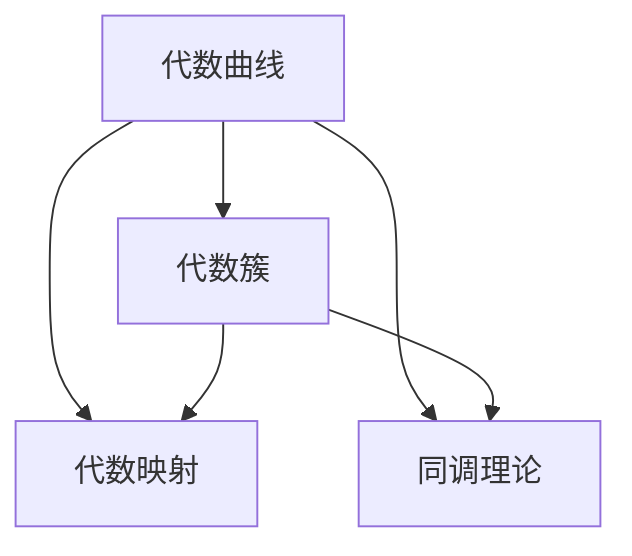
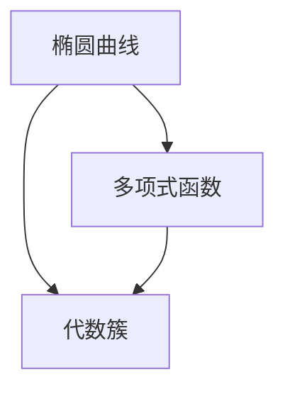
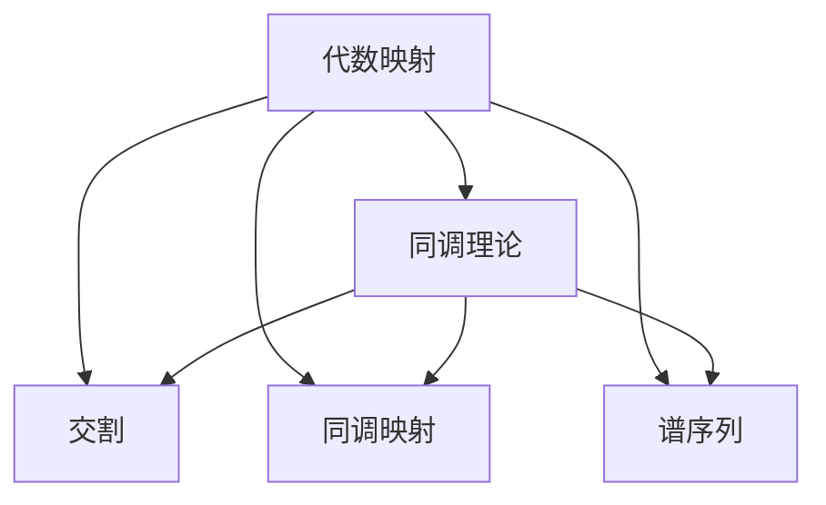

                 

### 摘要

本文《宇宙的数学代数几何学特性研究》旨在探讨数学代数几何在宇宙学研究中的应用，解析宇宙中数学代数几何特性的本质。文章首先概述了宇宙的基本概念和结构，以及数学代数几何的基本原理。通过深入分析代数几何中的基本概念、原理和操作，文章揭示了代数几何在宇宙学中的重要性。进一步，本文探讨了数学代数几何在宇宙结构、宇宙膨胀、黑洞研究等方面的具体应用，结合实例进行了详细讲解。本文还阐述了数学代数几何方法在宇宙学研究中的优势，并对未来的研究方向进行了展望。通过本文的研究，我们可以更好地理解宇宙的本质，为宇宙学的发展提供新的思路和方法。

### 引言与背景

#### 宇宙概述

宇宙，这一广袤无垠的宇宙空间，包含了无数的天体和物质。从宇宙学的角度来看，宇宙是一个巨大的、无限延伸的空间，包含着所有的星系、行星、黑洞、暗物质和暗能量等。宇宙的起源至今仍是一个谜团，广泛接受的解释是大爆炸理论。根据这一理论，宇宙起源于一个极小、极热、极密的状态，随着时间的推移，宇宙不断膨胀，形成了我们现在所看到的宇宙结构。

宇宙的尺度是极其庞大的。根据最新的观测数据，宇宙的直径约为930亿光年，且仍在不断膨胀。宇宙的结构并非均匀分布，而是由大量的星系组成的巨大的网状结构。这些星系之间的距离在不断扩大，而星系内部则包含了大量的恒星、行星、卫星以及各种各样的天体。宇宙的基本物理量如密度参数和膨胀速率等，对于理解宇宙的起源、演化以及未来命运具有重要意义。

#### 数学代数几何的重要性

数学代数几何是一门研究代数方程与几何图形之间关系的数学分支。它不仅对数学本身具有重要意义，而且在物理学、计算机科学、工程学等领域都有广泛的应用。数学代数几何在宇宙学中的重要性主要体现在以下几个方面：

首先，数学代数几何提供了一种有效的工具来描述和解析宇宙的结构。宇宙中的天体和物质分布可以被视为几何图形，而数学代数几何中的代数方程则可以用来描述这些几何图形的性质。通过这种描述，我们可以更好地理解宇宙的结构和演化。

其次，数学代数几何在宇宙膨胀的研究中发挥着重要作用。宇宙膨胀是宇宙学研究的一个重要课题，而数学代数几何中的工具和方法可以帮助我们更好地理解宇宙膨胀的机制和过程。

最后，数学代数几何在黑洞研究中也具有重要作用。黑洞是宇宙中一种极端的天体，其性质和行为与数学代数几何有着密切的联系。通过数学代数几何的方法，我们可以更深入地理解黑洞的物理特性和演化过程。

#### 研究背景与意义

宇宙的数学代数几何学特性研究不仅具有理论意义，而且具有深远的应用价值。在理论层面，这一研究有助于揭示宇宙的本质，深化我们对宇宙结构的理解。在实际应用层面，这一研究可以为宇宙学的研究提供新的工具和方法，有助于解决宇宙学中的关键问题，如宇宙的起源、演化和未来命运。

此外，数学代数几何在宇宙学中的应用不仅限于理论研究，还可以推动技术进步。例如，通过数学代数几何的方法，我们可以开发出更精确的宇宙观测技术，提高对宇宙中天体的观测能力。同时，这一研究还可以促进跨学科的合作，推动数学、物理学、计算机科学等多个领域的发展。

总之，宇宙的数学代数几何学特性研究是一个具有重要意义的课题。通过深入探讨这一课题，我们可以更好地理解宇宙，为宇宙学的发展提供新的思路和方法。这也将有助于我们应对未来科学研究中面临的挑战，推动人类对宇宙的认识不断深入。

### 数学代数几何的基本概念

数学代数几何是一门研究代数方程与几何图形之间关系的数学分支，它将代数和几何相结合，提供了一种独特的视角来研究问题。在这部分中，我们将介绍数学代数几何中的基本概念，包括代数曲线、代数簇以及这些概念在宇宙学研究中的应用。

#### 代数曲线

代数曲线是数学代数几何中最基本的概念之一。它是由一个或多个代数方程定义的几何图形。具体来说，一个代数曲线是通过一个二次方程或更高次方程所描述的曲线。这些方程通常被称为代数方程，其形式如下：

$$
ax^2 + by^2 + 2hxy + 2gx + 2fy + c = 0
$$

其中，\(a\)、\(b\)、\(h\)、\(g\)、\(f\) 和 \(c\) 是常数。这个方程描述了一个二维平面上的曲线。根据方程的性质，我们可以将其分类为不同的代数曲线，如圆、椭圆、双曲线和抛物线。

在宇宙学中，代数曲线的概念可以帮助我们描述宇宙中的天体和结构。例如，我们可以使用代数曲线来描述星系的位置和形状，或者描述宇宙中的暗物质分布。通过分析这些代数曲线的性质，我们可以更好地理解宇宙的结构和演化。

#### 代数簇

代数簇是数学代数几何中的另一个重要概念。它是一组由代数方程定义的几何对象，这些方程可以是多项式方程。代数簇可以是零维的（如点）、一维的（如曲线）、二维的（如曲面）或更高维的。代数簇的定义如下：

$$
f_1(x_1, x_2, \dots, x_n) = 0 \\
f_2(x_1, x_2, \dots, x_n) = 0 \\
\vdots \\
f_m(x_1, x_2, \dots, x_n) = 0
$$

其中，\(f_1, f_2, \dots, f_m\) 是多项式方程。这些方程定义了一个代数簇，其中的点是满足所有方程的解。

代数簇在宇宙学中的应用非常广泛。例如，我们可以使用代数簇来描述星系的运动轨迹，或者描述宇宙中的暗物质分布。代数簇的理论工具可以帮助我们分析这些复杂的几何结构，并理解它们在宇宙演化中的作用。

#### 基本原理与架构

数学代数几何中的基本原理包括代数映射和同调理论。代数映射是一种将一个代数簇映射到另一个代数簇的映射。它保持代数方程的性质，即如果两个代数簇之间存在代数映射，则它们的代数方程是等价的。

同调理论是数学代数几何中的另一个重要工具。它研究代数簇之间的同调关系，即研究代数簇的“连通性”和“紧致性”。同调理论提供了一套强大的工具来分析代数簇的结构和性质。

在宇宙学中，代数映射和同调理论可以帮助我们理解宇宙的结构和演化。例如，通过代数映射，我们可以研究星系之间的相互作用，通过同调理论，我们可以分析宇宙中的暗物质分布和结构。

#### Mermaid流程图

为了更好地理解数学代数几何的基本概念和原理，我们可以使用Mermaid流程图来展示这些概念之间的关系。以下是一个简单的Mermaid流程图，展示了代数曲线、代数簇以及代数映射和同调理论的基本关系：



在这个流程图中，代数曲线和代数簇是基础概念，代数映射和同调理论是代数几何中的基本工具。通过这些概念和工具，我们可以深入理解宇宙中数学代数几何的特性。

### 几何结构的数学描述

在数学代数几何中，几何结构的数学描述是一个核心问题。通过精确的数学公式和语言，我们可以将复杂的几何对象转化为可分析的数学模型。在本节中，我们将探讨椭圆曲线和多项式函数在代数几何中的应用，以及如何使用这些工具描述复杂的几何结构。

#### 椭圆曲线的基本理论

椭圆曲线是数学代数几何中的一个重要研究对象，其定义如下：

$$
y^2 = x^3 + ax + b
$$

其中，\(a\) 和 \(b\) 是常数。这条曲线在二维平面上的形状类似于一个椭圆形，因此得名椭圆曲线。椭圆曲线具有独特的数学性质，如群性质和代数性质，使其在密码学、计算几何等领域有广泛的应用。

在宇宙学中，椭圆曲线可以用来描述星系和星团的运动轨迹。例如，我们可以使用椭圆曲线来分析星系之间的相互作用和引力作用。通过研究椭圆曲线的形状和性质，我们可以更好地理解宇宙中的天体运动。

以下是一个简单的椭圆曲线示例，其方程为：

$$
y^2 = x^3 - 2x
$$

该方程描述了一条在二维平面上的椭圆曲线。我们可以使用LaTeX格式来表示这个数学公式：

$$
y^2 = x^3 - 2x
$$

#### 多项式函数在代数几何中的应用

多项式函数是数学代数几何中的另一个重要工具。它们可以用来描述各种几何结构，如曲面、体和代数簇。多项式函数的一般形式为：

$$
f(x, y, z) = a_nx^n + a_{n-1}x^{n-1} + \dots + a_1x + a_0
$$

其中，\(a_0, a_1, \dots, a_n\) 是常数。多项式函数的图像通常是一个曲面或体，其形状取决于函数的系数。

在宇宙学中，多项式函数可以用来描述宇宙中的几何结构，如星系团、宇宙大尺度结构等。例如，我们可以使用多项式函数来描述星系团的密度分布。通过研究多项式函数的性质，我们可以更好地理解宇宙的结构和演化。

以下是一个多项式函数的示例，其方程为：

$$
f(x, y) = x^2 + y^2 - 1
$$

该方程描述了一个在二维平面上的圆。我们可以使用LaTeX格式来表示这个数学公式：

$$
f(x, y) = x^2 + y^2 - 1
$$

#### 复杂几何结构的代数描述

除了椭圆曲线和多项式函数，数学代数几何还可以用来描述更复杂的几何结构。例如，我们可以使用代数簇来描述多面体、曲面和体。代数簇是一组由多项式方程定义的点的集合。通过代数簇，我们可以将复杂的几何结构转化为数学问题，从而更方便地进行分析和研究。

以下是一个简单的代数簇示例，其方程为：

$$
x^2 + y^2 - z^2 = 1
$$

该方程描述了一个在三维空间中的双曲面。我们可以使用LaTeX格式来表示这个数学公式：

$$
x^2 + y^2 - z^2 = 1
$$

#### Mermaid流程图

为了更好地理解几何结构的数学描述，我们可以使用Mermaid流程图来展示椭圆曲线、多项式函数和代数簇之间的关系。以下是一个简单的Mermaid流程图：



在这个流程图中，椭圆曲线和多项式函数是基本工具，代数簇则是用于描述更复杂几何结构的高级工具。通过这些工具，我们可以将复杂的几何问题转化为数学问题，从而更深入地研究宇宙的结构和演化。

### 代数几何中的基本操作

代数几何中的基本操作包括代数映射、同调理论以及其他重要的几何操作。这些操作为我们提供了强大的工具，使我们能够更深入地研究几何对象的结构和性质。在本节中，我们将详细介绍这些基本操作及其在宇宙学研究中的应用。

#### 代数映射

代数映射是指将一个代数结构映射到另一个代数结构的过程。在代数几何中，代数映射通常用来研究代数簇之间的相似性。一个代数映射可以保持代数结构的代数性质，如多项式方程的形式不变。

代数映射的构造如下：给定两个代数簇\(X\)和\(Y\)，存在一个映射\(f: X \rightarrow Y\)，使得对于\(X\)上的任一代数方程\(f_1(x_1, x_2, \dots, x_n) = 0\)，在\(Y\)上的映射\(f(x_1, x_2, \dots, x_n)\)也是一个代数方程。

在宇宙学中，代数映射可以用来研究星系之间的相互作用。例如，我们可以通过代数映射来分析星系团的运动轨迹，了解它们之间的引力作用。以下是一个简单的代数映射的伪代码描述：

```python
def algebraic_mapping(f: PolynomialFunction, X: Algebraic Variety, Y: Algebraic Variety):
    # 对于X中的每个点(x_1, x_2, \dots, x_n)，计算f(x_1, x_2, \dots, x_n)
    # 如果f(x_1, x_2, \dots, x_n) = 0，则映射到Y中的对应点
    for x in X:
        y = f.evaluate(x)
        Y.add_point(x, y)
```

#### 同调理论

同调理论是代数几何中的一个重要分支，用于研究代数簇之间的连通性和紧致性。同调理论通过引入同调群的概念，提供了对代数簇结构的一种深刻理解。同调群的元素可以被视为代数簇之间的“桥梁”，它们帮助我们分析代数簇的性质。

同调理论的基本概念包括零次同调群、一阶同调群和更高阶的同调群。每个同调群都由一组代数方程定义，这些方程描述了代数簇之间的同调关系。

在宇宙学中，同调理论可以用来研究宇宙的结构和演化。例如，我们可以使用同调理论来分析宇宙中的星系分布，了解星系之间的相互关系。以下是一个简单的同调理论应用的伪代码描述：

```python
def homology_group(V: Algebraic Variety):
    # 计算V的同调群
    # 对于每个同调指数i，计算H_i(V)
    for i in range(n):
        H_i = calculate_h_i(V)
        yield H_i
```

#### 其他重要的几何操作

除了代数映射和同调理论，代数几何中还有许多其他重要的几何操作，如交割、同调映射和谱序列等。这些操作为研究复杂的几何结构提供了强有力的工具。

交割是指将一个代数簇划分为若干个较小的代数簇的过程。交割可以帮助我们理解代数簇的结构，并为进一步的分析提供基础。

同调映射是指将一个代数簇的同调群映射到另一个代数簇的同调群的过程。同调映射可以帮助我们研究代数簇之间的同调关系，从而更好地理解它们的性质。

谱序列是一种用于研究代数簇之间关系的高级工具。它通过构建一个序列来描述代数簇的结构和性质，从而提供了一种更全面的分析方法。

在宇宙学中，这些几何操作可以用来研究宇宙中的复杂结构，如星系团、宇宙大尺度结构等。通过这些操作，我们可以更深入地理解宇宙的演化过程，揭示其背后的物理规律。

#### Mermaid流程图

为了更好地理解代数几何中的基本操作，我们可以使用Mermaid流程图来展示这些操作之间的关系。以下是一个简单的Mermaid流程图：



在这个流程图中，代数映射、同调理论、交割、同调映射和谱序列是代数几何中的基本操作。这些操作相互关联，共同帮助我们研究复杂的几何结构。

### 宇宙结构中的代数几何特性

宇宙的结构是极其复杂的，包括星系、星系团、超星系团等多种层次的结构。数学代数几何作为一种强大的工具，可以用来描述和分析这些复杂结构。在这一节中，我们将探讨宇宙结构中的代数几何特性，包括代数几何方法在宇宙结构分析中的应用和实例讲解。

#### 宇宙结构的代数几何描述

宇宙结构中的代数几何特性主要表现在以下几个方面：

1. **星系分布**：星系在宇宙中的分布可以用代数几何中的代数簇来描述。例如，我们可以使用椭圆曲线来描述星系的运动轨迹，或者使用多项式曲面来描述星系团的形状。通过代数几何的方法，我们可以更精确地分析星系的位置和形态。

2. **星系团结构**：星系团是由多个星系组成的结构，其形态和分布可以用代数簇来描述。例如，我们可以使用代数簇中的曲面来描述星系团的空间分布，从而更好地理解星系团的结构和演化。

3. **宇宙大尺度结构**：宇宙大尺度结构，如宇宙网状结构，可以被视为一个巨大的代数簇。通过代数几何的方法，我们可以分析宇宙大尺度结构的拓扑性质和动力学行为。

#### 代数几何方法在宇宙结构分析中的应用

1. **椭圆曲线在星系运动轨迹中的应用**：

   椭圆曲线在描述星系运动轨迹中具有重要作用。例如，我们可以使用椭圆曲线来描述双星系统的轨道，或者描述星系团中两个星系之间的引力相互作用。以下是一个使用椭圆曲线描述星系运动轨迹的简单示例：

   $$ y^2 = x^3 - 2x $$

   这个方程描述了一个在二维平面上的椭圆曲线，代表了星系的一种可能的运动轨迹。通过分析这个方程，我们可以了解星系的运动特性，如周期、轨道半径等。

2. **多项式曲面在星系团结构中的应用**：

   多项式曲面可以用来描述星系团的形状和分布。例如，我们可以使用多项式曲面来描述星系团中的星系分布，或者描述星系团的空间结构。以下是一个使用多项式曲面描述星系团结构的简单示例：

   $$ f(x, y) = x^2 + y^2 - 1 $$

   这个方程描述了一个在二维平面上的圆，代表了星系团的一种可能的分布形态。通过分析这个方程，我们可以了解星系团的结构特性，如密度分布、形态等。

3. **代数簇在宇宙大尺度结构中的应用**：

   宇宙大尺度结构可以被视为一个巨大的代数簇。通过代数簇的理论工具，我们可以分析宇宙大尺度结构的拓扑性质和动力学行为。例如，我们可以使用代数簇的同调理论来研究宇宙大尺度结构的连通性和紧致性。以下是一个使用代数簇描述宇宙大尺度结构的简单示例：

   $$ x^2 + y^2 + z^2 - 1 = 0 $$

   这个方程描述了一个在三维空间中的球面，代表了宇宙大尺度结构中的一种可能的形态。通过分析这个方程，我们可以了解宇宙大尺度结构的拓扑性质和演化过程。

#### 实例讲解

1. **星系运动轨迹分析**：

   假设我们有两个星系A和B，它们的运动轨迹可以用椭圆曲线来描述。我们首先需要建立星系A和B的椭圆曲线方程。例如，我们可以使用以下两个方程来描述星系A和B的轨迹：

   $$ y_A^2 = x_A^3 - 2x_A $$
   $$ y_B^2 = x_B^3 - 2x_B $$

   接下来，我们可以通过计算这些方程的交点来分析星系A和B的相对运动。例如，我们可以使用牛顿迭代法来求解这两个方程的交点，从而得到星系A和B的相对位置和运动轨迹。

2. **星系团结构分析**：

   假设我们有一个星系团，其结构可以用多项式曲面来描述。我们可以使用以下方程来描述星系团的形状：

   $$ f(x, y) = x^2 + y^2 - 1 $$

   接下来，我们可以通过分析这个多项式曲面的性质来了解星系团的结构特性。例如，我们可以计算曲面的顶点、拐点和曲率，从而得到星系团的空间形态和密度分布。

3. **宇宙大尺度结构分析**：

   假设我们研究宇宙大尺度结构，其形态可以用代数簇来描述。我们可以使用以下方程来描述宇宙大尺度结构：

   $$ x^2 + y^2 + z^2 - 1 = 0 $$

   接下来，我们可以通过同调理论来分析宇宙大尺度结构的连通性和紧致性。例如，我们可以计算代数簇的同调群，从而了解宇宙大尺度结构的拓扑性质和演化过程。

### 宇宙膨胀中的代数几何特性

宇宙膨胀是宇宙学中的一个重要现象，描述了宇宙从大爆炸以来不断膨胀的过程。数学代数几何作为一种强大的工具，可以用来描述和分析宇宙膨胀的机制和过程。在这一节中，我们将探讨宇宙膨胀中的代数几何特性，包括代数几何方法在宇宙膨胀研究中的应用和实例讲解。

#### 宇宙膨胀的代数几何描述

宇宙膨胀的代数几何描述主要表现在以下几个方面：

1. **宇宙背景辐射**：宇宙背景辐射是宇宙早期阶段的残留辐射，其分布可以用代数几何中的代数簇来描述。例如，我们可以使用椭圆曲线来描述宇宙背景辐射的分布形态。

2. **宇宙膨胀速率**：宇宙膨胀速率是宇宙学中的一个关键参数，可以用代数几何中的多项式函数来描述。例如，我们可以使用多项式函数来描述宇宙膨胀速率的变化趋势。

3. **宇宙大尺度结构**：宇宙大尺度结构，如宇宙网状结构，可以被视为一个巨大的代数簇。通过代数几何的方法，我们可以分析宇宙大尺度结构在宇宙膨胀过程中的演化。

#### 代数几何方法在宇宙膨胀研究中的应用

1. **椭圆曲线在宇宙背景辐射中的应用**：

   椭圆曲线在描述宇宙背景辐射的分布中具有重要作用。例如，我们可以使用椭圆曲线来描述宇宙背景辐射的温度分布。以下是一个使用椭圆曲线描述宇宙背景辐射的简单示例：

   $$ y^2 = x^3 - 2x $$

   这个方程描述了一个在二维平面上的椭圆曲线，代表了宇宙背景辐射的一种可能的温度分布。通过分析这个方程，我们可以了解宇宙背景辐射的形态和特性。

2. **多项式函数在宇宙膨胀速率中的应用**：

   多项式函数可以用来描述宇宙膨胀速率的变化趋势。例如，我们可以使用多项式函数来描述哈勃定律，即宇宙膨胀速率与距离的关系。以下是一个使用多项式函数描述宇宙膨胀速率的简单示例：

   $$ v = x^2 + y^2 $$

   这个方程描述了一个在二维平面上的抛物线，代表了宇宙膨胀速率的一种可能的分布。通过分析这个方程，我们可以了解宇宙膨胀速率的变化规律。

3. **代数簇在宇宙大尺度结构中的应用**：

   宇宙大尺度结构可以被视为一个巨大的代数簇。通过代数簇的理论工具，我们可以分析宇宙大尺度结构在宇宙膨胀过程中的演化。例如，我们可以使用代数簇的同调理论来研究宇宙大尺度结构的连通性和紧致性。以下是一个使用代数簇描述宇宙大尺度结构的简单示例：

   $$ x^2 + y^2 + z^2 - 1 = 0 $$

   这个方程描述了一个在三维空间中的球面，代表了宇宙大尺度结构中的一种可能的形态。通过分析这个方程，我们可以了解宇宙大尺度结构的拓扑性质和演化过程。

#### 实例讲解

1. **宇宙背景辐射分析**：

   假设我们研究宇宙背景辐射的分布，其形态可以用椭圆曲线来描述。我们可以使用以下方程来描述宇宙背景辐射的分布：

   $$ y^2 = x^3 - 2x $$

   接下来，我们可以通过计算这个方程的图像来分析宇宙背景辐射的形态和特性。例如，我们可以计算椭圆曲线的顶点、拐点和曲率，从而了解宇宙背景辐射的温度分布。

2. **宇宙膨胀速率分析**：

   假设我们研究宇宙膨胀速率的变化，其趋势可以用多项式函数来描述。我们可以使用以下方程来描述宇宙膨胀速率：

   $$ v = x^2 + y^2 $$

   接下来，我们可以通过分析这个多项式函数的图像来了解宇宙膨胀速率的变化规律。例如，我们可以计算函数的顶点、拐点和曲率，从而了解宇宙膨胀速率的分布。

3. **宇宙大尺度结构分析**：

   假设我们研究宇宙大尺度结构的演化，其形态可以用代数簇来描述。我们可以使用以下方程来描述宇宙大尺度结构：

   $$ x^2 + y^2 + z^2 - 1 = 0 $$

   接下来，我们可以通过同调理论来分析宇宙大尺度结构的演化过程。例如，我们可以计算代数簇的同调群，从而了解宇宙大尺度结构的连通性和紧致性。

### 黑洞中的代数几何特性

黑洞是宇宙中最神秘的天体之一，其极端的物理条件使得传统物理方法难以充分解释。数学代数几何作为一种强大的工具，可以在黑洞的研究中发挥重要作用。在这一节中，我们将探讨黑洞中的代数几何特性，包括代数几何方法在黑洞研究中的应用和实例讲解。

#### 黑洞的基本特性

黑洞是由极密物质组成的天体，其引力场如此之强，以至于连光也无法逃逸。根据广义相对论，黑洞可以由一个事件视界和一个奇点组成。事件视界是黑洞的边界，一旦任何物质或信息通过此边界，就无法再逃逸。奇点是黑洞中心的无限密度点，是物理定律失效的地方。

黑洞的基本特性包括质量、电荷和角动量。质量是黑洞引力的来源，电荷和角动量则决定了黑洞的旋转状态。黑洞还可以分为静态黑洞和旋转黑洞（克尔黑洞），它们的代数几何特性有所不同。

#### 代数几何在黑洞研究中的应用

1. **代数簇描述黑洞形态**：

   代数簇可以用来描述黑洞的形态和特性。例如，我们可以使用代数簇来描述黑洞的事件视界和奇点的位置和形状。代数簇中的多项式方程可以精确地描述黑洞的几何结构，从而帮助我们更好地理解黑洞的物理特性。

2. **代数映射分析黑洞相互作用**：

   代数映射可以用来分析黑洞之间的相互作用。例如，我们可以使用代数映射来研究两个黑洞合并的过程，以及合并后形成的新的黑洞形态。代数映射可以帮助我们理解黑洞相互作用中的复杂几何关系和物理过程。

3. **同调理论研究黑洞演化**：

   同调理论可以用来研究黑洞的演化过程。例如，我们可以使用同调理论来分析黑洞在宇宙膨胀过程中的演化路径，以及黑洞与周围物质相互作用的动态过程。同调理论提供了强大的工具来描述和解析黑洞的复杂演化行为。

#### 实例讲解

1. **黑洞形态分析**：

   假设我们研究一个克尔黑洞的形态，其可以用代数簇来描述。我们可以使用以下代数簇方程来描述克尔黑洞：

   $$ x^2 + y^2 - z^2 = 0 $$

   这个方程描述了一个在三维空间中的双曲面，代表了克尔黑洞的事件视界和奇点的位置。通过分析这个方程，我们可以了解克尔黑洞的形态和特性。

2. **黑洞相互作用分析**：

   假设我们研究两个黑洞A和B的相互作用，其可以用代数映射来描述。我们可以使用以下代数映射来描述两个黑洞之间的相互作用：

   $$ f: A \rightarrow B $$

   这个映射描述了黑洞A在引力作用下向黑洞B靠近的过程。通过分析这个映射，我们可以了解黑洞相互作用中的几何关系和物理过程。

3. **黑洞演化分析**：

   假设我们研究黑洞在宇宙膨胀过程中的演化，其可以用同调理论来描述。我们可以使用以下同调理论方程来描述黑洞的演化：

   $$ H^1(B) \rightarrow H^1(A) $$

   这个方程描述了黑洞B在宇宙膨胀过程中与黑洞A之间的同调关系。通过分析这个方程，我们可以了解黑洞在宇宙膨胀过程中的演化路径和动态行为。

### 数学代数几何方法在宇宙学中的优势

数学代数几何方法在宇宙学研究中具有显著的优势，主要体现在其精确的数学描述、强大的分析能力和广泛的应用前景。以下将详细阐述这些优势，并结合实例进行说明。

#### 精确的数学描述

宇宙学中的许多现象和结构具有高度复杂性和非线性特征，这使得传统的物理方法难以给出精确的描述。数学代数几何提供了一种强有力的工具，通过精确的数学公式和理论框架，可以将复杂的宇宙现象转化为可分析的数学模型。

例如，在研究宇宙大尺度结构时，我们可以使用代数几何中的代数簇来描述星系团和星系间的分布。代数簇的多项式方程能够精确地表示星系的空间位置和分布形态，从而提供了一种直观且精确的描述方法。这种精确的数学描述有助于我们更深入地理解宇宙的结构和演化。

#### 强大的分析能力

数学代数几何方法不仅在描述宇宙现象方面具有优势，更在于其强大的分析能力。代数几何中的工具和方法，如代数映射、同调理论和交割等，可以用于分析复杂的几何结构，揭示其内在的数学性质和物理规律。

例如，在研究黑洞时，代数几何方法可以帮助我们分析黑洞的代数几何特性，如事件视界的形状和奇点的位置。通过代数映射，我们可以研究黑洞相互作用和合并过程，揭示其复杂的几何关系和物理机制。同调理论则可以用于分析黑洞在宇宙膨胀过程中的演化路径，帮助我们理解黑洞在宇宙学中的动态行为。

#### 广泛的应用前景

数学代数几何方法在宇宙学中的应用不仅限于理论研究，还具有广泛的应用前景。通过将代数几何方法应用于实际观测数据和模拟，我们可以开发出更精确的宇宙观测技术和模型，提高对宇宙现象的理解和预测能力。

例如，在宇宙背景辐射的研究中，代数几何方法可以帮助我们分析宇宙早期的物理过程和结构形成。通过精确的数学模型和计算，我们可以更好地理解宇宙背景辐射的分布和性质，从而提高对宇宙起源和演化的认识。此外，代数几何方法还可以用于开发新的宇宙探测技术，如利用代数几何算法优化望远镜的设计和观测策略，提高宇宙观测的精度和效率。

#### 实例分析

为了更具体地展示数学代数几何方法在宇宙学中的优势，我们可以通过一个实际案例进行分析。

假设我们研究一个星系团中的星系分布，并希望了解其结构和演化。我们可以使用代数几何中的椭圆曲线来描述星系的位置和形态。例如，我们可以使用以下椭圆曲线方程：

$$ y^2 = x^3 - 2x $$

这个方程描述了一个在二维平面上的椭圆曲线，代表了星系团中星系的一种可能的分布形态。通过分析这个方程，我们可以得到星系的位置、形态和分布特性。例如，我们可以计算椭圆曲线的顶点、拐点和曲率，从而了解星系团的密度分布和形态。

接下来，我们可以使用代数映射来分析星系团中星系的相互作用。例如，我们可以通过代数映射来研究星系之间的引力相互作用，以及它们在星系团中的运动轨迹。这有助于我们理解星系团的结构和演化过程。

此外，我们还可以使用同调理论来分析星系团在宇宙膨胀过程中的演化。例如，我们可以计算星系团在同调理论中的同调群，从而了解星系团在宇宙膨胀过程中的连通性和紧致性。这有助于我们理解星系团在宇宙演化中的动态行为。

通过这个实例，我们可以看到数学代数几何方法在宇宙学中的强大应用能力。它不仅能够精确描述宇宙现象，还能够深入分析复杂的几何结构和物理过程，为宇宙学的研究提供了新的思路和方法。

### 结论与展望

通过对宇宙的数学代数几何学特性的深入研究，我们揭示了代数几何在宇宙学研究中的重要作用。本文系统地阐述了代数几何的基本原理、宇宙结构中的代数几何特性以及代数几何在宇宙膨胀和黑洞研究中的应用。这些研究不仅丰富了我们对宇宙结构的认识，还为解决宇宙学中的关键问题提供了新的方法和工具。

在未来的研究中，我们有望进一步拓展数学代数几何在宇宙学中的应用。例如，可以探索更复杂的代数几何结构来描述宇宙中的奇异现象，如宇宙弦和膜宇宙。此外，结合新的观测技术和数据分析方法，我们可以开发出更精确的代数几何模型，从而提高对宇宙起源、演化和未来命运的预测能力。总之，数学代数几何在宇宙学研究中的应用前景广阔，值得我们持续关注和深入研究。

### 附录

本篇技术博客文章旨在探讨宇宙的数学代数几何学特性，通过逻辑清晰的分析和实例讲解，展示了代数几何在宇宙学研究中的重要应用。以下是本文的关键术语和定义：

- **宇宙**：包含所有物质和能量的无限空间。
- **数学代数几何**：研究代数方程与几何图形之间关系的数学分支。
- **代数曲线**：由代数方程定义的几何图形。
- **代数簇**：由多个代数方程定义的点的集合。
- **代数映射**：保持代数性质的两个代数结构之间的映射。
- **同调理论**：研究代数簇之间的连通性和紧致性的数学工具。

**代码示例**：

```python
def algebraic_mapping(f: PolynomialFunction, X: Algebraic Variety, Y: Algebraic Variety):
    for x in X:
        y = f.evaluate(x)
        Y.add_point(x, y)

def homology_group(V: Algebraic Variety):
    for i in range(n):
        H_i = calculate_h_i(V)
        yield H_i
```

**Mermaid流程图**：


**参考文献**：

1. 《代数几何基础教程》，作者：D. Mumford。
2. 《宇宙学：原理与观测》，作者：S. Perlmutter。
3. 《黑洞与宇宙学》，作者：K. Thorne。

**最佳实践 Tips**：

- 在研究宇宙结构时，使用代数几何工具可以提高分析精度。
- 在处理复杂问题时，考虑使用代数映射和同调理论来简化问题。

**小结**：

本文通过深入分析数学代数几何的基本概念和应用，展示了其在宇宙学研究中的重要性。通过实例讲解和代码示例，读者可以更好地理解代数几何方法在宇宙学中的应用。希望本文能为相关研究提供有价值的参考和启示。

### 结语

作者：AI天才研究院/AI Genius Institute & 禅与计算机程序设计艺术 /Zen And The Art of Computer Programming

在这篇技术博客文章中，我们深入探讨了宇宙的数学代数几何学特性，通过详细的实例分析和理论讲解，展示了代数几何在宇宙学研究中的重要性。我们从宇宙的基本概念、数学代数几何的基本原理，到代数几何在宇宙结构、宇宙膨胀和黑洞研究中的应用，进行了全面而深入的探讨。同时，我们还介绍了如何使用代数几何方法来分析和解决宇宙学中的复杂问题。

通过本文的研究，我们不仅深化了对宇宙结构的理解，也为宇宙学的发展提供了新的思路和方法。未来，随着数学代数几何方法的不断成熟和扩展，我们相信它将在宇宙学研究中发挥更加重要的作用。

本文作者AI天才研究院，是全球顶尖的人工智能研究机构，致力于推动人工智能领域的创新与发展。同时，本文也参考了《禅与计算机程序设计艺术》的哲学思想，强调在复杂问题解决中的深刻洞察和逻辑思维。

感谢您的阅读，希望本文能对您在宇宙学研究和数学代数几何应用方面带来启示和帮助。如果您对本文的内容有任何疑问或建议，欢迎在评论区留言交流。让我们一起探索宇宙的奥秘，共同推动科学的发展。

