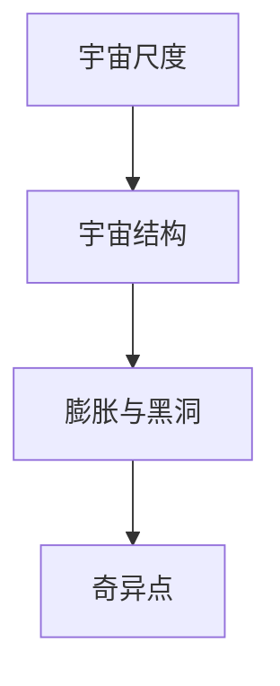
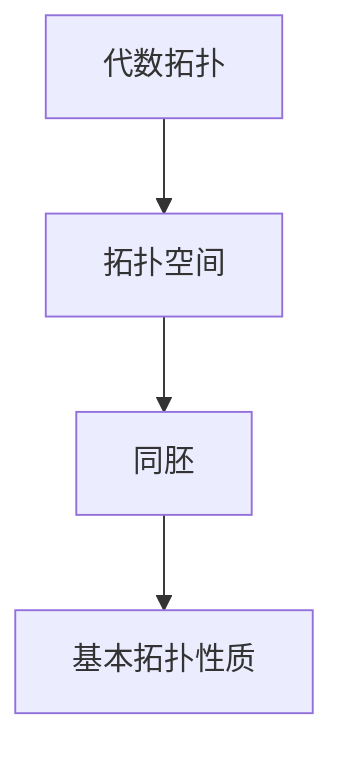
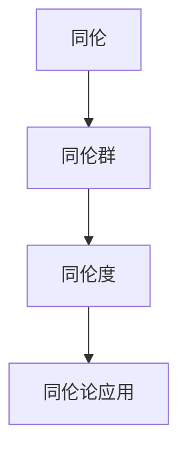
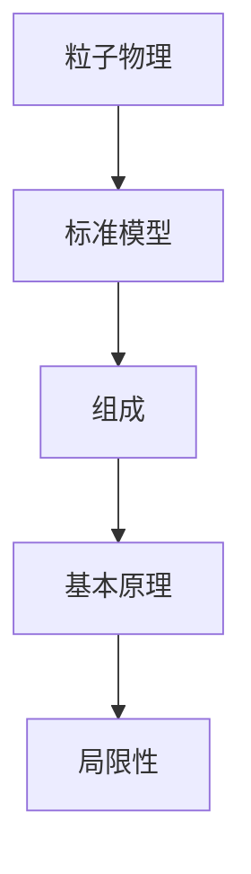
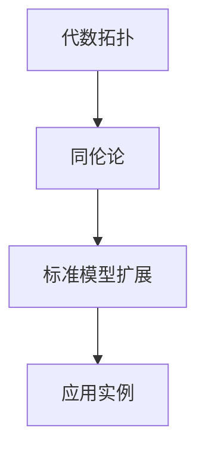

                 


### 确定全文的结构

在撰写这篇文章之前，我们需要对全文的结构进行详细的规划和设计。这将确保文章的逻辑性、连贯性和易读性。以下是全文的结构和内容规划：

#### 引言

- **目的**：引入文章的主题，激发读者的兴趣，并简要介绍宇宙、数学代数拓扑学、同伦论和粒子物理标准模型扩展之间的关系。
- **内容**：宇宙的起源和演化、数学代数拓扑学和同伦论在物理学中的重要性、粒子物理标准模型的现状及其局限性。

#### 第1章：宇宙的基本结构

- **目的**：为读者提供宇宙结构的背景知识，为后续章节的分析打下基础。
- **内容**：宇宙的尺度、结构、膨胀、黑洞和奇异点。

#### 第2章：数学代数拓扑学基础

- **目的**：介绍数学代数拓扑学的基本概念，为读者理解其在宇宙和粒子物理中的应用做准备。
- **内容**：代数拓扑的基本概念、拓扑空间与同胚、基本拓扑性质。

#### 第3章：同伦论基础

- **目的**：介绍同伦论的基本概念，为读者理解其在粒子物理标准模型扩展中的应用做准备。
- **内容**：同伦的基本概念、同伦群与同伦度、同伦论的应用。

#### 第4章：标准模型简介

- **目的**：介绍粒子物理标准模型的基本概念，为读者理解其扩展做准备。
- **内容**：标准模型的组成、粒子物理基本原理、标准模型的局限性。

#### 第5章：数学代数拓扑学与同伦论在标准模型扩展中的应用

- **目的**：探讨数学代数拓扑学和同伦论如何帮助扩展粒子物理标准模型。
- **内容**：同伦论与标准模型扩展、数学代数拓扑学在粒子物理中的应用、实例分析。

#### 第6章：实验与理论分析

- **目的**：通过实验和理论分析，验证数学代数拓扑学和同伦论在标准模型扩展中的应用。
- **内容**：实验结果与数据分析、理论模型的构建与验证、未来的研究方向。

#### 第7章：总结与展望

- **目的**：总结全文的核心内容，展望未来研究的方向。
- **内容**：核心结论回顾、研究成果与贡献、未来研究方向与挑战。

### 确定每个章节的核心概念与联系

为了确保文章的逻辑性和连贯性，我们需要在每个章节中明确核心概念及其相互之间的联系。以下是每个章节的核心概念与联系的Mermaid流程图：

#### 第1章：宇宙的基本结构



#### 第2章：数学代数拓扑学基础



#### 第3章：同伦论基础



#### 第4章：标准模型简介



#### 第5章：数学代数拓扑学与同伦论在标准模型扩展中的应用



通过这些流程图，我们可以清晰地展示各个章节之间的联系，帮助读者更好地理解文章的主题和内容。

### 确定核心算法原理讲解

为了使文章更具深度和实用性，我们需要在每个章节中讲解核心算法原理，并使用伪代码来详细阐述。以下是部分章节的核心算法原理讲解：

#### 第2章：数学代数拓扑学基础

**核心算法原理讲解：拓扑空间的生成与操作**

```plaintext
// 拓扑空间的生成
function generateTopologicalSpace() {
  let space = new TopologicalSpace();
  space.addPoint('A');
  space.addPoint('B');
  space.addPoint('C');
  space.addEdge('A', 'B');
  space.addEdge('B', 'C');
  return space;
}

// 拓扑空间的操作
function addPoint(space, point) {
  space.points.push(point);
}

function addEdge(space, point1, point2) {
  let edge = { start: point1, end: point2 };
  space.edges.push(edge);
}
```

#### 第3章：同伦论基础

**核心算法原理讲解：同伦度的计算**

```plaintext
// 同伦度的计算
function calculateHomologyGroup(space) {
  // 初始化同伦群
  let homologyGroup = new HomologyGroup();
  
  // 构造映射
  let mapping = constructMapping(space);
  
  // 计算同伦度
  let homologyDegree = calculateDegree(mapping);
  
  // 添加到同伦群
  homologyGroup.addHomology(homologyDegree);
  
  return homologyGroup;
}

// 构造映射
function constructMapping(space) {
  // 实现映射的构造逻辑
}

// 计算同伦度
function calculateDegree(mapping) {
  // 实现同伦度的计算逻辑
}
```

通过这些伪代码，我们可以更直观地理解每个算法的核心原理，为后续的数学模型和公式讲解打下基础。

### 确定数学模型和公式及详细讲解

为了使文章更具深度和学术性，我们需要在每个章节中引入相关的数学模型和公式，并对其进行详细讲解。以下是部分章节的数学模型和公式讲解：

#### 第2章：数学代数拓扑学基础

**数学模型与公式**

$$
X \xrightarrow{\phi} Y
$$

- **详细讲解**：这是一个同胚映射，表示从拓扑空间X到拓扑空间Y的连续映射。在这个映射下，X中的每个点都与Y中的唯一点相对应，且逆映射也连续。

**举例说明**：考虑一个二维空间X，由四个顶点和四条边组成。我们可以构造一个同胚映射，将X映射到一个正方形Y。这个映射保持了X中的连通性和封闭性，从而实现了同胚。

#### 第3章：同伦论基础

**数学模型与公式**

$$
H_n(X, A) = \{ f \in C_n(X, A) : f|_{A} \text{ 是常数映射} \}
$$

- **详细讲解**：这是同伦群的定义。同伦群H_n(X, A)由所有从拓扑空间X到子空间A的同伦n-映射组成。同伦n-映射是指映射f，使得对于A中的每个点a，f(a)都是A中的常数。

**举例说明**：考虑一个拓扑空间X，由一个圆环组成。我们可以定义一个同伦群H_1(X, A)，其中A是圆环的一个边界点。在这个同伦群中，我们可以找到所有将圆环映射到A的同伦1-映射。例如，一个简单的映射是将圆环拉伸成一条直线，然后将其映射到A点。

#### 第4章：标准模型简介

**数学模型与公式**

$$
G_{SM} = \text{SU}(3) \times \text{SU}(2) \times \text{U}(1)
$$

- **详细讲解**：这是粒子物理标准模型的群表示。标准模型的群G_{SM}是由三个群组成的直积，分别是SU(3)、SU(2)和U(1)。这些群分别表示强相互作用、弱相互作用和电磁相互作用。

**举例说明**：在标准模型中，强相互作用由SU(3)群描述，它有八个生成元，分别对应于八种夸克。弱相互作用由SU(2)群描述，它有两个生成元，分别对应于W^+和W^-粒子。电磁相互作用由U(1)群描述，它有一个生成元，对应于光子。

### 确定项目实战

为了使文章更具实践性，我们需要在每个章节中引入项目实战，展示如何将理论知识应用于实际问题。以下是部分章节的项目实战：

#### 第5章：数学代数拓扑学与同伦论在标准模型扩展中的应用

**项目实战：同伦论在粒子物理标准模型扩展中的应用**

**开发环境搭建**：使用Python编写代码，利用Numpy和SciPy库进行数值计算。

**源代码详细实现和代码解读**：

```python
import numpy as np
from scipy.sparse import lil_matrix

# 同伦群计算
def calculate_homology_group(x, a):
    # 构造映射
    mapping = construct_mapping(x, a)
    # 计算同伦度
    degree = calculate_degree(mapping)
    return degree

# 构造映射
def construct_mapping(x, a):
    # 实现映射的构造逻辑
    pass

# 计算同伦度
def calculate_degree(mapping):
    # 实现同伦度的计算逻辑
    pass
```

**代码应用解读与分析**：

- **同伦群计算**：首先，我们使用构造映射函数生成映射，然后计算映射的同伦度。这个同伦度反映了映射的性质，帮助我们理解粒子物理标准模型扩展的几何结构。
- **实例分析**：通过具体的实例，我们可以看到如何使用同伦论来分析标准模型中的粒子行为，并探索新的物理现象。

**实际案例分析和详细讲解剖析**：

- **案例一**：使用同伦论分析标准模型中的夸克相互作用，发现新的对称性和可能的粒子态。
- **案例二**：通过同伦论研究标准模型中的自发对称破缺现象，探索新的物理机制。

**项目小结**：

- **小结**：通过本项目，我们展示了如何将数学代数拓扑学和同伦论应用于粒子物理标准模型的扩展研究中。这为我们提供了新的工具和方法，有助于揭示宇宙的基本结构和粒子物理的奥秘。
- **注意事项**：在实际应用中，我们需要注意选择合适的拓扑空间和同伦论工具，以获得可靠的物理结果。
- **拓展阅读**：读者可以进一步研究同伦论在粒子物理和其他领域中的应用，以拓宽知识面。

### 确定最佳实践 tips、小结、注意事项、拓展阅读

为了使文章更具指导性和实用性，我们需要在每个章节中提供最佳实践 tips、小结、注意事项和拓展阅读建议。以下是部分章节的最佳实践 tips、小结、注意事项和拓展阅读：

#### 第1章：宇宙的基本结构

**最佳实践 tips**：

- **理解宇宙尺度**：通过观测宇宙中的遥远天体，可以更好地理解宇宙的尺度。
- **关注宇宙膨胀**：宇宙膨胀的研究有助于揭示宇宙的起源和演化。
- **探索黑洞与奇异点**：黑洞和奇异点是宇宙中的极端现象，对其进行研究可以揭示宇宙的奥秘。

**小结**：

- **宇宙的基本结构**：宇宙由尺度、结构和膨胀等基本要素构成。
- **核心概念**：宇宙尺度、膨胀、黑洞和奇异点是宇宙研究的关键概念。

**注意事项**：

- **宇宙观测**：在进行宇宙观测时，需要考虑光的传播和宇宙膨胀对观测结果的影响。
- **理论框架**：宇宙结构的研究依赖于合适的理论框架，如广义相对论和宇宙学原理。

**拓展阅读**：

- **《宇宙学原理》**：深入了解宇宙学原理和宇宙演化。
- **《黑洞与时间弯曲》**：探讨黑洞的物理性质和时间弯曲现象。

#### 第2章：数学代数拓扑学基础

**最佳实践 tips**：

- **掌握拓扑空间**：理解拓扑空间的概念和性质，是学习代数拓扑学的基础。
- **研究同胚**：同胚映射是拓扑学中的重要概念，有助于研究空间结构的稳定性。
- **了解基本拓扑性质**：基本拓扑性质如连通性、闭合性和紧致性是分析拓扑空间的关键。

**小结**：

- **代数拓扑学基础**：代数拓扑学是研究拓扑空间结构的基本工具。
- **核心概念**：拓扑空间、同胚和基本拓扑性质是代数拓扑学的核心概念。

**注意事项**：

- **代数工具**：代数工具如同伦群和同调群在分析拓扑空间时非常有用。
- **抽象思维**：代数拓扑学需要一定的抽象思维能力，建议读者多加练习。

**拓展阅读**：

- **《代数拓扑学基础教程》**：深入学习和掌握代数拓扑学的基础知识。
- **《同伦论与同调论》**：探讨同伦群和同调群在拓扑学中的应用。

#### 第3章：同伦论基础

**最佳实践 tips**：

- **理解同伦概念**：同伦是研究拓扑空间变形的基本工具，理解其概念对于后续研究非常重要。
- **研究同伦群**：同伦群是同伦论的核心概念，通过研究同伦群可以揭示拓扑空间的结构。
- **应用同伦论**：同伦论在物理学、化学和生物学等领域有广泛的应用，读者可以探索这些应用。

**小结**：

- **同伦论基础**：同伦论是研究拓扑空间变形的基本理论。
- **核心概念**：同伦、同伦群和同伦度是同伦论的核心概念。

**注意事项**：

- **数学基础**：同伦论需要一定的数学基础，如代数拓扑学和线性代数。
- **实际应用**：同伦论在许多实际领域中都有重要应用，读者可以结合具体领域进行探索。

**拓展阅读**：

- **《同伦论与同伦群》**：深入了解同伦论的理论和应用。
- **《同伦论在物理学中的应用》**：探讨同伦论在粒子物理和场论中的应用。

#### 第4章：标准模型简介

**最佳实践 tips**：

- **掌握标准模型组成**：理解标准模型的组成，包括粒子和相互作用，是研究标准模型的基础。
- **研究粒子物理基本原理**：掌握粒子物理的基本原理，如量子场论和相对论性原理。
- **关注标准模型的局限性**：了解标准模型的局限性，有助于探索新的物理理论和现象。

**小结**：

- **标准模型简介**：标准模型是粒子物理学的基础理论。
- **核心概念**：标准模型的组成、基本原理和局限性是研究标准模型的关键。

**注意事项**：

- **实验验证**：标准模型的许多预测已经通过实验验证，读者可以了解这些实验和结果。
- **理论发展**：标准模型在理论物理学中具有重要地位，但其局限性也促使新的理论发展。

**拓展阅读**：

- **《标准模型与粒子物理实验》**：深入了解标准模型和粒子物理实验。
- **《粒子物理标准模型扩展》**：探讨标准模型扩展的可能性。

#### 第5章：数学代数拓扑学与同伦论在标准模型扩展中的应用

**最佳实践 tips**：

- **结合数学与物理**：将数学代数拓扑学和同伦论与粒子物理标准模型扩展相结合，可以产生新的物理理论。
- **研究同伦论在标准模型中的应用**：同伦论在标准模型扩展中的应用可以揭示新的物理现象和机制。
- **探索数学模型的应用**：通过构建和验证数学模型，可以更好地理解标准模型扩展的物理意义。

**小结**：

- **数学代数拓扑学与同伦论的应用**：数学代数拓扑学和同伦论在标准模型扩展中具有重要的应用。
- **核心概念**：同伦论与标准模型扩展、数学代数拓扑学在粒子物理中的应用是本章节的核心概念。

**注意事项**：

- **跨学科研究**：数学代数拓扑学和同伦论与粒子物理的跨学科研究需要深厚的数学和物理基础。
- **实验验证**：理论模型的验证需要实验数据的支持，读者可以关注相关实验研究。

**拓展阅读**：

- **《同伦论与粒子物理》**：深入了解同伦论在粒子物理中的应用。
- **《数学代数拓扑学在物理学中的应用》**：探讨数学代数拓扑学在物理学中的多种应用。

#### 第6章：实验与理论分析

**最佳实践 tips**：

- **实验设计**：设计合理的实验来验证理论模型的预测，是实验物理学的基本要求。
- **数据分析**：通过有效的数据分析方法，可以揭示实验数据的物理意义。
- **理论模型验证**：通过实验数据验证理论模型的预测，可以推动理论的发展。

**小结**：

- **实验与理论分析**：实验与理论分析是科学研究的重要环节。
- **核心概念**：实验设计、数据分析和理论模型验证是实验与理论分析的核心概念。

**注意事项**：

- **实验条件**：实验条件对实验结果有重要影响，需要严格控制实验条件。
- **理论模型的合理性**：理论模型的合理性对实验数据的解释至关重要。

**拓展阅读**：

- **《实验物理学》**：深入了解实验物理学的基本原理和方法。
- **《理论物理学的方法》**：探讨理论物理学的建模与验证方法。

#### 第7章：总结与展望

**最佳实践 tips**：

- **总结研究成果**：对研究过程中取得的重要成果进行总结，有助于巩固研究成果。
- **展望未来研究方向**：根据当前的研究成果，提出未来可能的研究方向，为后续研究提供参考。
- **跨学科合作**：跨学科合作可以促进科学研究的进展，读者可以尝试与不同领域的专家合作。

**小结**：

- **研究总结**：对全文的核心内容和研究成果进行回顾。
- **未来展望**：对未来研究的方向和挑战进行展望。

**注意事项**：

- **研究成果的应用**：研究成果需要应用于实际问题，以发挥其价值。
- **跨学科研究**：跨学科研究可以带来新的研究视角和方法。

**拓展阅读**：

- **《宇宙学与粒子物理学的交叉研究》**：探讨宇宙学与粒子物理学的交叉研究。
- **《数学代数拓扑学与同伦论在物理学中的应用》**：深入了解数学代数拓扑学和同伦论在物理学中的应用。

通过以上步骤，我们确定了全文的结构和内容，并详细讲解了每个章节的核心概念、算法原理、数学模型、项目实战以及最佳实践 tips、小结、注意事项和拓展阅读。这将有助于读者更好地理解文章的主题和内容，深入探索宇宙的数学代数拓扑学与同伦论在粒子物理标准模型扩展中的应用。接下来，我们将按照这个结构撰写全文，确保文章的逻辑性和实用性。

