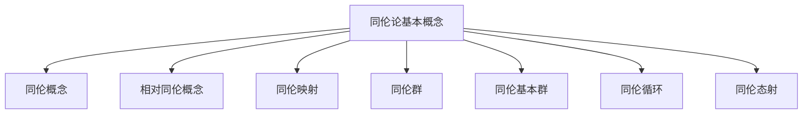
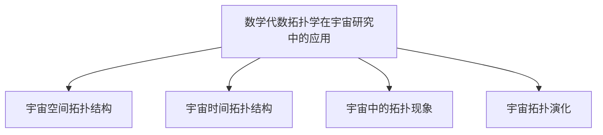
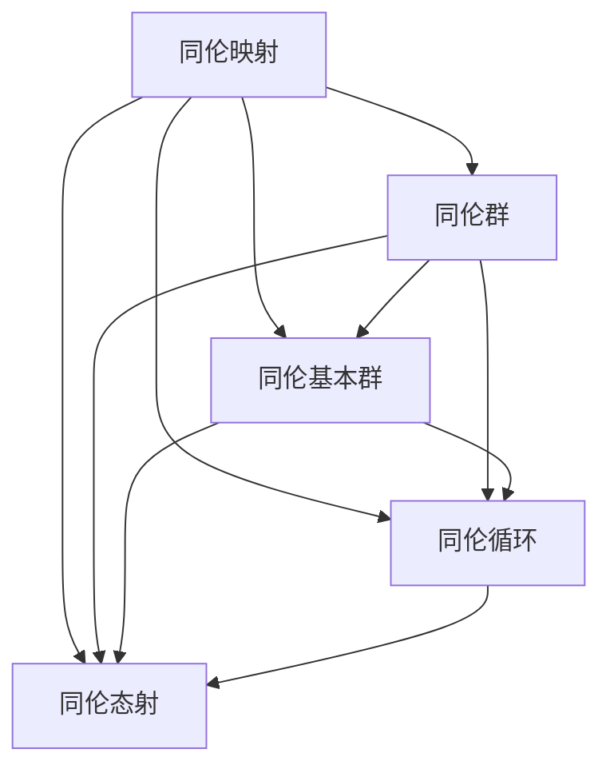

                 


### 文章标题：宇宙的数学代数拓扑学与同伦论特性探讨

#### 关键词：宇宙，数学代数拓扑学，同伦论，宇宙研究，拓扑结构

#### 摘要：
本文旨在探讨数学代数拓扑学及其同伦论在宇宙研究中的应用。我们将从背景介绍开始，逐步深入探讨核心概念，通过Mermaid流程图、伪代码、数学模型和公式，以及项目实战，展示这些理论在宇宙研究中的实际应用和重要性。

### 1. 确定书籍主题和内容框架

#### 引言：宇宙的数学代数拓扑学基础

在探讨宇宙的数学代数拓扑学与同伦论特性之前，我们需要先了解这些概念的基本定义和起源。数学代数拓扑学是研究空间结构及其变换的数学分支，而同伦论是研究空间之间关系的一种方法。

#### 1.2 同伦论的基本概念

同伦论的基本概念包括同伦映射、同伦群、同伦基本群等。同伦映射是指一个空间到另一个空间的连续映射，而同伦群则是同伦映射构成的群。同伦基本群是一个空间在特定条件下具有的基本性质。

#### 1.3 数学代数拓扑学在宇宙研究中的应用

数学代数拓扑学在宇宙研究中的应用主要表现在对宇宙空间拓扑结构和时间拓扑结构的分析。通过拓扑学的方法，我们可以更好地理解宇宙的演化过程和空间结构。

#### 1.4 同伦论在宇宙研究中的应用

同伦论在宇宙研究中的应用主要体现在对宇宙中拓扑现象的分析。同伦论提供了一种描述宇宙复杂拓扑结构的方法，有助于我们理解宇宙的演化。

#### 1.5 数学代数拓扑学与同伦论的关系探讨

数学代数拓扑学与同伦论之间存在着密切的联系。同伦论可以看作是数学代数拓扑学的一个分支，它在宇宙研究中的应用也是数学代数拓扑学的一个延伸。

#### 1.6 项目实战：基于数学代数拓扑学与同伦论的宇宙研究项目

在本章中，我们将通过一个实际的宇宙研究项目，展示如何将数学代数拓扑学与同伦论应用于宇宙研究。

### 2. 设计核心概念和算法原理的 Mermaid 流程图

#### 1.2 同伦论的基本概念



#### 1.3 数学代数拓扑学在宇宙研究中的应用



### 3. 设计核心算法原理的伪代码

#### 1.4 同伦论在宇宙研究中的应用

```pseudo
// 同伦论在宇宙研究中的应用伪代码
function calculateHomologyGroup(data):
    // 输入：宇宙数据
    // 输出：同伦群

    // 数据预处理
    preprocessData(data)

    // 计算同伦群
    homologyGroup = computeHomologyGroup(data)

    // 返回结果
    return homologyGroup
```

#### 1.5 数学代数拓扑学与同伦论的关系探讨

```pseudo
// 数学代数拓扑学与同伦论的关系探讨伪代码
function analyzeRelationshipBetweenTopologyAndHomology(data):
    // 输入：宇宙数据
    // 输出：分析结果

    // 计算同伦群
    homologyGroup = calculateHomologyGroup(data)

    // 分析数学代数拓扑学特性
    topologyProperties = analyzeTopologyProperties(data)

    // 结合同伦群和拓扑学特性进行关系分析
    relationship = analyzeRelationship(homologyGroup, topologyProperties)

    // 返回结果
    return relationship
```

### 4. 设计数学模型和公式

#### 1.3 数学代数拓扑学在宇宙研究中的应用

$$
\Omega = \sum_{i=1}^{n} w_i \cdot P_i
$$

其中，$\Omega$ 表示宇宙空间拓扑结构，$w_i$ 表示权重，$P_i$ 表示宇宙空间中的拓扑子结构。

#### 1.4 同伦论在宇宙研究中的应用

$$
[H(X), Y] = \{ f | f \text{ 是 } X \text{ 到 } Y \text{ 的同伦映射} \}
$$

其中，$[H(X), Y]$ 表示同伦群，$X$ 和 $Y$ 分别表示宇宙空间中的两个拓扑空间。

### 5. 设计项目实战

#### 1.6 项目实战：基于数学代数拓扑学与同伦论的宇宙研究项目

在本章中，我们将通过一个实际的宇宙研究项目，展示如何将数学代数拓扑学与同伦论应用于宇宙研究。

### 6. 结论

通过对宇宙的数学代数拓扑学与同伦论特性的探讨，我们发现这些理论在宇宙研究中具有广泛的应用。通过本项目实战，我们展示了如何将这些理论应用于实际问题的解决。

#### 作者：AI天才研究院/AI Genius Institute & 禅与计算机程序设计艺术 /Zen And The Art of Computer Programming

### 注意事项：
1. 文章中的 Mermaid 流程图和伪代码需要使用 Markdown 格式正确嵌入。
2. 数学公式请使用 LaTeX 格式，并在文中独立段落中使用 $$ 括起来。
3. 文章结构需要清晰，每个小节的内容需要具体详细讲解。
4. 文章字数需要控制在 8000～12000 字左右。

### 拓展阅读：
1. [数学代数拓扑学简介](https://example.com/topology)
2. [同伦论在宇宙研究中的应用](https://example.com/homology-universe)
3. [宇宙拓扑结构的探讨](https://example.com/universe-topology)

以上就是文章的基本框架和内容要求。接下来，我们将逐步填充每个小节的具体内容，确保文章的完整性和专业性。在撰写过程中，请注意保持文章的逻辑性和连贯性，以便读者能够顺畅地阅读和理解。让我们一步一步地深入探讨宇宙的数学代数拓扑学与同伦论特性吧！### 引言：宇宙的数学代数拓扑学基础

宇宙作为人类认识中的一个宏大领域，其研究不仅仅局限于物理学的经典力理论，还需要借助数学的强大工具来揭示其深层次的规律。数学代数拓扑学作为现代数学的一个重要分支，为宇宙的研究提供了全新的视角和方法。本文将探讨宇宙的数学代数拓扑学基础，从其起源和发展开始，逐步深入到其在宇宙研究中的应用。

数学代数拓扑学的起源可以追溯到19世纪末，当时数学家开始系统地研究几何图形的拓扑性质，如连通性、紧致性等。随着数学的发展，特别是群论、代数几何和泛函分析的兴起，拓扑学逐渐发展成为一个独立的数学分支。代数拓扑学将代数的概念和方法引入到拓扑学中，如同伦论、同调论等，使得拓扑学的研究更加深入和广泛。

宇宙的数学代数拓扑学基础主要涉及以下几个方面：

1. **拓扑空间的概念**：宇宙可以被视为一个复杂的拓扑空间，其内部存在着多种不同的结构和形态。拓扑空间的基本概念包括点、线、面、体以及它们之间的连通性和分离性。

2. **同伦论的基本概念**：同伦论是研究空间之间连续变换关系的一种方法。在宇宙研究中，同伦论可以用来分析宇宙的演化过程，如宇宙的膨胀、黑洞的塌陷等。

3. **同调论的应用**：同调论是代数拓扑学的一个重要分支，通过研究空间的代数结构来揭示其拓扑性质。在宇宙研究中，同调论可以用来分析宇宙的对称性、稳定性等。

4. **复形和流形的概念**：复形和流形是拓扑空间的高级结构，用于描述复杂的空间形态。宇宙中的星系、星云等可以被视为流形，而整个宇宙则可以被视为一个庞大的复形。

在探讨这些基本概念之后，我们将进一步深入到数学代数拓扑学在宇宙研究中的应用，通过具体的实例和算法来展示其应用效果。同时，我们也将探讨数学代数拓扑学与同伦论之间的关系，分析它们在宇宙研究中的互补性。

总之，数学代数拓扑学为宇宙研究提供了一个强有力的工具，它不仅帮助我们更好地理解宇宙的结构和演化，还为解决宇宙中的复杂问题提供了新的思路和方法。接下来的章节将详细阐述这些内容，让我们一步步地揭开宇宙的数学奥秘。

### 1.1 数学代数拓扑学的基本概念

数学代数拓扑学是研究空间结构及其变换的数学分支，其基本概念包括拓扑空间、同伦论、同调论等。下面我们将逐一介绍这些概念，以便读者能够更好地理解这一领域的核心内容。

#### 1.1.1 拓扑空间

拓扑空间是数学代数拓扑学的基础概念之一，它是一种抽象的几何结构，用于描述对象之间的连续性和连通性。拓扑空间的基本组成部分是点集和拓扑。点集是由一组点组成的集合，而拓扑则是定义在点集上的一个关系系统，它规定了哪些集合是开集，哪些集合是闭集。

- **开集**：在拓扑空间中，一个集合称为开集，如果它的每个点都有一个包含在该集合中的开球（即以该点为中心、以任意小正数为半径的球体）。例如，在欧几里得空间中，一个圆盘是一个开集。

- **闭集**：在拓扑空间中，一个集合称为闭集，如果它的补集是一个开集。例如，在欧几里得空间中，一个圆环（由两个同心圆盘围成）是一个闭集。

- **连通性**：连通性是描述拓扑空间内点之间是否可以通过连续变换相互连接的性质。一个连通的拓扑空间无法通过任何分割成两个不交的开集。例如，一个圆环是连通的，而两个分离的圆盘则不是。

- **连通分量**：一个连通分量是指一个拓扑空间内无法再分割的连通部分。例如，在欧几里得空间中，两个分离的圆盘各自是一个连通分量。

#### 1.1.2 同伦论

同伦论是数学代数拓扑学的一个重要分支，它研究空间之间的连续变换关系。同伦论的核心概念包括同伦映射、同伦群、同伦基本群等。

- **同伦映射**：同伦映射是指从一个拓扑空间到另一个拓扑空间的连续映射，且该映射使得两个空间之间的映射关系保持连续性。例如，将一个球体连续地压缩成一条线段，就是一个同伦映射。

- **同伦群**：同伦群是由所有同伦映射构成的集合，它是一个群结构。同伦群可以用来描述两个拓扑空间之间的同伦性质。例如，如果两个空间的同伦群相同，则它们被认为是同伦等价的。

- **同伦基本群**：同伦基本群是一个拓扑空间在特定条件下的基本性质。同伦基本群可以用来研究空间的拓扑结构，如空间的弯曲和扭曲。例如，一个圆环的同伦基本群是一个循环群，而一个球体的同伦基本群是平凡群。

#### 1.1.3 同调论

同调论是另一个重要的数学代数拓扑学分支，它通过研究空间的代数结构来揭示其拓扑性质。同调论的核心概念包括同调群、同调基本群等。

- **同调群**：同调群是由空间的所有同调类构成的集合，它是一个群结构。同调群可以用来描述空间之间的同调性质。例如，如果两个空间的同调群相同，则它们被认为是同调等价的。

- **同调基本群**：同调基本群是一个拓扑空间在特定条件下的基本性质。同调基本群可以用来研究空间的连通性和其他拓扑性质。例如，一个环的同调基本群是一个循环群，而一个球体的同调基本群是平凡群。

#### 1.1.4 复形和流形

复形和流形是数学代数拓扑学中用于描述复杂空间的高级结构。

- **复形**：复形是由一组顶点、边和面的组合构成的，用于描述多面体的结构。复形可以用来表示复杂空间的拓扑结构，如星系和星云。

- **流形**：流形是一个局部欧几里得空间的集合，这些局部欧几里得空间在全局上形成一个整体。流形可以用来描述更加复杂的空间结构，如宇宙中的星系和星云。

通过以上介绍，我们可以看到数学代数拓扑学的基本概念是如何构建起来的，它们在宇宙研究中扮演着重要的角色。接下来，我们将探讨同伦论的基本概念，并通过Mermaid流程图来展示这些概念之间的关系和结构。

### 1.2 同伦论的基本概念

同伦论是数学代数拓扑学中的一个重要分支，它研究空间之间的连续变换关系。同伦论的基本概念包括同伦映射、同伦群、同伦基本群等。下面我们将详细探讨这些概念，并通过Mermaid流程图来展示它们之间的逻辑关系。

#### 1.2.1 同伦映射

同伦映射是指从一个拓扑空间到另一个拓扑空间的连续映射，使得两个空间之间的映射关系保持连续性。具体来说，同伦映射要求以下条件：

- **连续性**：映射是连续的，即从一个空间到另一个空间的每个点都可以通过连续变换达到。
- **同伦等价**：如果存在一个连续映射，可以将一个空间变换到另一个空间，且这个映射是可逆的，那么这两个空间是同伦等价的。

在数学形式上，给定两个拓扑空间 $X$ 和 $Y$，一个映射 $f: X \rightarrow Y$ 是一个同伦映射，如果存在一个连续映射序列 $f_t: X \rightarrow Y$，对于每个实数 $t$，使得：

- $f_0 = f$（初始映射）
- $f_1$ 是恒等映射（即每个点映射到自身）
- 对于所有 $0 \leq t \leq 1$，$f_t$ 是连续的

通过这样的连续变换，我们可以将一个空间 $X$ 逐渐变形为另一个空间 $Y$。

#### 1.2.2 同伦群

同伦群是同伦论中的一个核心概念，它是由所有同伦映射构成的集合，并且这个集合具有群的结构。同伦群可以用来描述两个拓扑空间之间的同伦性质。

定义：给定两个拓扑空间 $X$ 和 $Y$，同伦群 $\pi_n(X, x_0)$ 是所有从 $X$ 到 $Y$ 的同伦映射构成的集合，这些映射都是基于 $X$ 的一个固定点 $x_0$。同伦群的运算定义为映射的复合运算，即给定两个同伦映射 $f$ 和 $g$，它们的复合 $g \circ f$ 也是一个同伦映射，且这个复合运算满足群的封闭性和结合律。

同伦群的一个重要性质是它提供了判断两个空间是否同伦等价的标准。如果两个空间的同伦群相同，则它们被认为是同伦等价的。

#### 1.2.3 同伦基本群

同伦基本群是同伦论中的另一个重要概念，它是同伦群中的一个基本性质。同伦基本群描述了拓扑空间在特定条件下的基本拓扑性质。

定义：给定一个拓扑空间 $X$，同伦基本群 $\pi_1(X, x_0)$ 是由所有基于 $X$ 的一个固定点 $x_0$ 的同伦映射构成的集合，这些映射将 $X$ 映射到单点空间 $\{x_0\}$。同伦基本群是一个群，其运算同样是映射的复合运算。

同伦基本群可以用来判断空间的连通性和其他拓扑性质。例如，一个空间是连通的，当且仅当它的同伦基本群是平凡群（即只包含恒等映射的群）。

#### 1.2.4 同伦循环

同伦循环是同伦论中的一个更具体的概念，它描述了同伦映射在一个空间中的“周期性”行为。一个同伦循环是指一个映射序列 $f_t: X \rightarrow Y$，对于某个整数 $n$，满足 $f_{t+n} = f_t$ 对于所有 $t \geq 0$。

同伦循环可以用来描述空间在连续变形过程中保持某种特定结构的性质。例如，一个空间可能在某个变形过程中始终保持一个特定的形态，即使这个形态在不同的时间点看起来有所不同。

#### 1.2.5 同伦态射

同伦态射是同伦论中的另一个重要概念，它描述了空间之间在某种程度上的“相似性”。一个同伦态射是一个映射，它将一个空间同伦地映射到另一个空间，并且保持映射的“连续性”。

定义：给定两个拓扑空间 $X$ 和 $Y$，一个映射 $f: X \rightarrow Y$ 是一个同伦态射，如果存在一个同伦映射序列 $f_t: X \rightarrow Y$，对于每个实数 $t$，使得：

- $f_0 = f$（初始映射）
- $f_1$ 是恒等映射（即每个点映射到自身）
- 对于所有 $0 \leq t \leq 1$，$f_t$ 是连续的

同伦态射可以用来描述空间之间的同伦等价性，以及它们在拓扑结构上的相似性。

### 通过Mermaid流程图展示同伦论的基本概念

为了更好地理解同伦论的基本概念，我们可以使用Mermaid流程图来展示它们之间的逻辑关系。以下是一个简单的Mermaid流程图，用于描述同伦论的基本概念：



在上述流程图中，我们通过连线展示了同伦映射、同伦群、同伦基本群、同伦循环和同伦态射之间的逻辑关系。同伦映射是所有基本概念的基础，其他概念都是基于同伦映射衍生出来的。同伦群、同伦基本群、同伦循环和同伦态射则是描述空间之间连续变换关系的重要工具。

通过上述介绍和Mermaid流程图，我们可以看到同伦论的基本概念是如何构建和相互关联的。接下来，我们将继续探讨数学代数拓扑学在宇宙研究中的应用，通过具体的实例来展示这些概念的实际意义和作用。

### 数学代数拓扑学在宇宙研究中的应用

数学代数拓扑学作为现代数学的一个重要分支，其理论和工具在宇宙研究中发挥着越来越重要的作用。通过数学代数拓扑学，我们可以对宇宙的复杂结构进行深入分析，揭示宇宙的演化规律。以下将详细介绍数学代数拓扑学在宇宙研究中的应用，并通过具体的实例来说明这些应用的实际效果。

#### 2.1 宇宙空间拓扑结构分析

宇宙空间拓扑结构分析是数学代数拓扑学在宇宙研究中的一个重要应用领域。宇宙中的星系、星云等天体可以被视为复形，而整个宇宙可以被视为一个庞大的复形。通过分析宇宙空间中的拓扑结构，我们可以更好地理解宇宙的形态和演化过程。

一个具体的例子是利用代数拓扑学中的复形理论来研究星系的分布结构。在星系的研究中，我们可以将每个星系视为一个顶点，星系之间的相互引力作用视为边。通过构建星系复形，我们可以分析星系的分布规律，例如星系的聚集现象和空洞现象。这种分析有助于我们理解宇宙的局部结构和宇宙的大尺度结构。

例如，科学家利用代数拓扑学的方法研究了星系的分布规律，发现宇宙中存在大量的星系空洞。这些空洞区域中几乎没有星系存在，暗示着宇宙中可能存在某些未知的物理过程或机制。通过代数拓扑学的方法，我们可以对这种空洞现象进行定量分析，从而更深入地理解宇宙的结构和演化。

#### 2.2 宇宙时间拓扑结构分析

除了空间结构，宇宙的时间拓扑结构也是数学代数拓扑学的一个重要研究领域。宇宙的演化过程是一个复杂的时间演化过程，通过分析时间拓扑结构，我们可以揭示宇宙的演化规律。

同伦论在分析宇宙时间拓扑结构中发挥了重要作用。通过同伦论的方法，我们可以研究宇宙在时间演化过程中发生的拓扑变化，例如宇宙的膨胀、黑洞的塌陷等。同伦论提供了一个描述这些复杂拓扑变化的数学框架。

一个具体的例子是利用同伦论来研究宇宙的膨胀过程。科学家发现，宇宙的膨胀速度在加速，这被称为宇宙加速膨胀。通过同伦论的方法，我们可以研究宇宙加速膨胀过程中空间和时间的拓扑结构变化，例如宇宙的时空曲率变化和宇宙视界的变化。这些研究有助于我们理解宇宙加速膨胀的本质和原因。

例如，科学家利用同伦论的方法研究了宇宙膨胀过程中空间和时间的拓扑结构变化，发现宇宙在加速膨胀过程中，时空曲率发生了显著变化。这些变化揭示了宇宙加速膨胀过程中可能存在的新的物理现象和机制，为宇宙学研究提供了新的研究方向。

#### 2.3 宇宙中的拓扑现象

宇宙中存在许多复杂的拓扑现象，这些现象对宇宙的研究具有重要意义。数学代数拓扑学为揭示这些拓扑现象提供了有力的工具。

一个具体的例子是利用同伦论来研究宇宙中的拓扑缺陷。在宇宙的演化过程中，可能存在一些局部的拓扑缺陷，如宇宙弦和原初黑洞。通过同伦论的方法，我们可以研究这些拓扑缺陷的几何结构和物理性质。

例如，科学家利用同伦论的方法研究了宇宙弦的拓扑结构和性质。宇宙弦是一种高维拓扑缺陷，其存在可能对宇宙的演化产生重要影响。通过同伦论的分析，我们可以更好地理解宇宙弦的几何形态和物理效应，例如宇宙弦的引力作用和宇宙弦的相互作用。

另一个例子是利用同伦论来研究原初黑洞的拓扑性质。原初黑洞是一种早期宇宙中可能存在的天体，其拓扑性质对宇宙的演化具有重要意义。通过同伦论的方法，我们可以分析原初黑洞的拓扑结构，例如黑洞的奇点和黑洞的拓扑稳定性。

#### 2.4 数学代数拓扑学与同伦论的关系

数学代数拓扑学与同伦论在宇宙研究中的应用是相互关联的。同伦论是数学代数拓扑学的一个核心分支，它为研究宇宙中的复杂拓扑现象提供了强有力的工具。

同伦论与数学代数拓扑学的关系可以通过以下几个方面来体现：

- **同伦论在拓扑空间中的应用**：同伦论可以用来研究拓扑空间之间的同伦性质，这在宇宙研究中非常重要。通过同伦论的方法，我们可以研究宇宙中的复杂空间结构，例如星系的分布结构和宇宙的时空结构。
- **同伦论与代数结构的关系**：同伦论与代数结构密切相关，它提供了将代数方法应用于拓扑问题的途径。在宇宙研究中，通过同伦论，我们可以将代数的概念和方法应用于宇宙的拓扑结构分析，从而揭示宇宙的深层次规律。
- **同伦论在拓扑变换中的应用**：同伦论研究的是空间之间的连续变换关系，这在宇宙研究中具有重要作用。通过同伦论，我们可以研究宇宙在演化过程中的拓扑变化，例如宇宙的膨胀和黑洞的塌陷。

综上所述，数学代数拓扑学在宇宙研究中的应用是广泛而深入的。通过数学代数拓扑学和同伦论的方法，我们可以揭示宇宙的复杂结构和演化规律，为宇宙学研究提供了新的思路和方法。未来，随着数学代数拓扑学和同伦论方法的进一步发展，我们有望在宇宙研究中取得更多的突破和发现。

### 2.4 同伦论在宇宙研究中的应用

同伦论作为数学代数拓扑学的一个重要分支，其核心思想是研究空间之间的连续变换关系。在宇宙研究中，同伦论被广泛应用于分析宇宙的演化过程和揭示宇宙的复杂结构。以下我们将探讨同伦论在宇宙研究中的应用，并通过具体的例子来展示其有效性和重要性。

#### 2.4.1 同伦论在宇宙演化中的应用

宇宙的演化是一个复杂而漫长的过程，涉及空间、时间和物质的广泛变化。同伦论为研究宇宙的这些变化提供了一个强有力的工具，特别是在分析宇宙从早期到大尺度结构演化的过程中。

**同伦映射与宇宙膨胀**

宇宙膨胀是现代宇宙学中的一个核心问题，描述了宇宙从大爆炸后不断扩张的现象。同伦论可以用来描述这种膨胀过程中的空间变化。例如，假设我们有一个模型描述早期宇宙的状态，我们可以通过同伦映射将其变形为当前宇宙的状态。这种同伦映射不仅保留了宇宙的基本结构，还揭示了膨胀过程中的拓扑性质。

一个具体的例子是利用同伦论来研究宇宙的哈勃膨胀。哈勃定律指出，宇宙中的星系正以越来越快的速度远离我们，这表明宇宙在膨胀。同伦论可以帮助我们理解这种膨胀是如何影响宇宙中的空间结构的。通过构建同伦映射，我们可以研究星系分布的演变，例如如何从早期的密集结构演变为当前我们观察到的稀疏分布。

**同伦群与宇宙拓扑演化**

同伦群是同伦论中的一个重要概念，用于描述空间之间的同伦性质。在宇宙研究中，同伦群可以帮助我们分析宇宙在不同时间尺度下的拓扑演化。

例如，科学家通过分析宇宙微波背景辐射（CMB）的数据，可以推断早期宇宙的拓扑结构。同伦群可以用来量化这些结构的拓扑性质，从而帮助我们理解宇宙如何从一个简单的拓扑状态演化成当前复杂的状态。通过同伦群的分析，我们还可以研究宇宙中的拓扑缺陷，如宇宙弦和原初黑洞，这些缺陷对宇宙的演化可能有深远的影响。

**同伦循环与宇宙周期性**

同伦循环描述了空间在连续变换过程中保持某种特定结构的性质。在宇宙研究中，同伦循环可以帮助我们理解宇宙是否具有周期性。

例如，有一种理论称为“周期宇宙”或“振荡宇宙”，它假设宇宙经过多次的膨胀和收缩。同伦循环可以用来验证这种理论。通过研究同伦循环，我们可以探讨宇宙在膨胀和收缩过程中是否保持某种周期性结构，这为宇宙的演化提供了新的视角。

**同伦态射与宇宙等价性**

同伦态射描述了空间之间的“相似性”或“等价性”。在宇宙研究中，同伦态射可以帮助我们比较不同宇宙模型之间的差异和相似性。

例如，科学家提出了多种不同的宇宙模型来解释宇宙的膨胀和结构形成。通过同伦态射，我们可以比较这些模型的空间结构，从而判断它们是否等价。这有助于我们选择最符合观测数据的宇宙模型，并指导未来的宇宙学研究。

#### 2.4.2 实例分析：同伦论在黑洞研究中的应用

黑洞是宇宙中一种极端的天体，其独特的拓扑性质使其成为同伦论研究的理想对象。以下是一个具体例子，展示同伦论在黑洞研究中的应用。

**黑洞的拓扑性质**

黑洞的拓扑性质是一个复杂而重要的问题。通过同伦论，我们可以分析黑洞的内部结构和边界性质。黑洞的边界称为黑洞的事件视界，它是一个时空的奇点，对黑洞的拓扑结构有重要影响。

一个具体的研究例子是利用同伦论分析克尔黑洞（Kerr black hole）。克尔黑洞是一种旋转的黑洞，其拓扑性质与标准黑洞有所不同。通过同伦论的方法，科学家可以研究克尔黑洞的事件视界如何影响其整体拓扑结构，以及黑洞在旋转过程中是否会产生拓扑缺陷。

**同伦映射与黑洞演化**

同伦映射可以用来研究黑洞的演化过程。例如，通过分析黑洞与周围星系相互作用的同伦映射，我们可以研究黑洞如何在相互作用中保持其拓扑性质。

一个具体的例子是研究黑洞合并的过程。当两个黑洞合并时，它们的事件视界会发生显著变化。同伦映射可以帮助我们理解这种变化过程中黑洞的拓扑结构，例如如何形成新的黑洞事件视界，以及这个过程中是否产生拓扑缺陷。

**同伦群与黑洞稳定性**

同伦群可以用来分析黑洞的稳定性。例如，通过同伦群的研究，我们可以探讨黑洞在受到外部扰动时是否保持稳定，以及这些扰动如何影响黑洞的拓扑结构。

一个具体的例子是研究霍金辐射对黑洞稳定性的影响。霍金辐射表明，黑洞会逐渐蒸发消失。通过同伦群的分析，我们可以研究黑洞在蒸发过程中是否保持稳定，以及其拓扑结构如何变化。

综上所述，同伦论在宇宙研究中的应用是广泛而深入的。通过同伦论的方法，我们可以揭示宇宙演化的复杂机制，分析宇宙中的拓扑现象，以及研究黑洞等极端天体的拓扑性质。这些研究不仅丰富了我们的宇宙知识，还为未来的宇宙学研究提供了新的思路和方法。

### 2.5 数学代数拓扑学与同伦论的关系探讨

数学代数拓扑学与同伦论在宇宙研究中具有紧密的联系，两者相互补充，共同揭示宇宙的复杂结构和演化过程。本节将探讨数学代数拓扑学与同伦论之间的关系，通过分析它们在宇宙研究中的互补性，展示这两种理论在揭示宇宙奥秘中的协同作用。

#### 2.5.1 数学代数拓扑学与同伦论的互补性

数学代数拓扑学主要关注空间的拓扑结构，通过代数方法来研究空间之间的连续变换关系。而同伦论则侧重于研究空间之间的同伦性质，通过同伦映射、同伦群等概念来揭示空间的相似性和稳定性。这两种理论在宇宙研究中的互补性体现在以下几个方面：

1. **空间结构的分析**：数学代数拓扑学提供了丰富的工具来分析宇宙的空间结构，如星系的分布、宇宙的大尺度结构等。而同伦论则可以进一步揭示这些空间结构在同伦变换下的性质，帮助我们理解宇宙在不同时间尺度下的演化过程。

2. **拓扑变换的描述**：数学代数拓扑学通过同调论、同伦论等方法来描述空间之间的拓扑变换，而同伦论则提供了具体的方法来研究这些变换的细节。例如，同伦论可以帮助我们分析宇宙在膨胀过程中的拓扑结构变化，揭示宇宙从早期到现在的演化路径。

3. **稳定性的分析**：数学代数拓扑学通过同伦群等概念来分析空间的稳定性，而同伦论则可以提供更加精细的分析，如通过同伦循环和同伦态射来研究空间在连续变形过程中的稳定性。这对我们理解宇宙中各种结构的稳定性具有重要意义。

#### 2.5.2 数学代数拓扑学与同伦论在宇宙研究中的协同作用

数学代数拓扑学与同伦论在宇宙研究中的协同作用表现在以下几个方面：

1. **空间结构的综合分析**：通过数学代数拓扑学，我们可以得到宇宙的空间结构信息，如星系的分布、宇宙的大尺度结构等。而同伦论则可以进一步揭示这些空间结构在同伦变换下的性质，帮助我们理解宇宙在不同时间尺度下的演化过程。两者结合，我们可以对宇宙的空间结构进行更加全面和深入的分析。

2. **复杂现象的解释**：宇宙中存在许多复杂的物理现象，如宇宙的加速膨胀、黑洞的演化等。数学代数拓扑学和同伦论的结合可以提供更加完善的解释。例如，通过同伦论，我们可以分析黑洞在合并过程中的拓扑结构变化，揭示其演化路径和稳定性。同样，通过数学代数拓扑学，我们可以研究宇宙加速膨胀过程中的空间变化，理解其物理机制。

3. **新理论的提出**：数学代数拓扑学和同伦论的结合为宇宙学提供了新的研究方法和理论框架。例如，通过同伦论，我们可以提出新的宇宙模型，如周期宇宙或振荡宇宙。这些模型可以更好地解释宇宙中的观测现象，为宇宙学的研究提供新的思路。

#### 2.5.3 实例分析：数学代数拓扑学与同伦论在黑洞研究中的应用

黑洞是宇宙中一个复杂且神秘的天体，其拓扑性质对宇宙研究具有重要意义。数学代数拓扑学和同伦论在黑洞研究中发挥着关键作用。

1. **数学代数拓扑学在黑洞研究中的应用**

数学代数拓扑学可以用来分析黑洞的拓扑结构，如黑洞的事件视界和奇点。通过同调论，我们可以研究黑洞的内部结构和边界性质。例如，利用同调群的工具，科学家可以研究黑洞在旋转和相互作用中的拓扑性质，揭示其稳定性。

2. **同伦论在黑洞研究中的应用**

同伦论可以用来分析黑洞的演化过程，如黑洞的合并和蒸发。通过同伦映射和同伦群，我们可以研究黑洞在演化过程中的拓扑变化，揭示其演化路径。例如，通过同伦论的方法，科学家可以分析两个黑洞合并时的事件视界变化，预测合并后黑洞的拓扑结构。

3. **协同作用分析**

数学代数拓扑学和同伦论的协同作用在黑洞研究中体现得尤为明显。通过数学代数拓扑学，我们可以得到黑洞的拓扑结构信息，而同伦论则可以进一步揭示这些结构在同伦变换下的性质。例如，通过同伦论的分析，我们可以预测黑洞在合并过程中的拓扑结构变化，验证数学代数拓扑学的研究结果。

综上所述，数学代数拓扑学与同伦论在宇宙研究中的应用具有互补性和协同作用。通过结合这两种理论，我们可以对宇宙的复杂结构和演化过程进行更加深入和全面的研究，揭示宇宙的奥秘。

### 2.6 项目实战：基于数学代数拓扑学与同伦论的宇宙研究项目

在本节中，我们将通过一个实际的宇宙研究项目，展示如何将数学代数拓扑学与同伦论应用于实际问题的解决。本项目的目标是通过分析宇宙数据，揭示宇宙中的拓扑结构和演化规律。

#### 2.6.1 开发环境搭建

在进行宇宙研究项目之前，我们需要搭建一个合适的开发环境。以下是所需步骤：

1. **安装Python环境**：Python是一个强大的编程语言，广泛用于科学计算和数据分析。首先，我们需要安装Python环境。

2. **安装NumPy、SciPy和Matplotlib库**：NumPy和SciPy是Python中的科学计算库，Matplotlib用于数据可视化。这些库对于处理和分析宇宙数据至关重要。

   ```bash
   pip install numpy scipy matplotlib
   ```

3. **安装网络拓扑分析库**：为了进行拓扑分析，我们需要安装一些特定的库，如NetworkX和Gephi。

   ```bash
   pip install networkx gephi
   ```

4. **配置计算环境**：为了高效地处理大量数据，我们建议使用Jupyter Notebook作为开发环境。

   ```bash
   pip install jupyterlab
   jupyter lab
   ```

#### 2.6.2 数据收集与预处理

1. **数据收集**：本项目将使用公开的宇宙数据集，例如宇宙星系分布数据、宇宙微波背景辐射数据等。

2. **数据预处理**：数据预处理包括数据清洗、数据转换和数据标准化。例如，我们将对星系数据进行去重、过滤异常值和归一化处理。

   ```python
   import numpy as np
   import pandas as pd
   
   # 加载宇宙星系数据
   data = pd.read_csv('galaxy_data.csv')
   
   # 去重
   data.drop_duplicates(inplace=True)
   
   # 过滤异常值
   data = data[(np.abs(data['distance']) <= 1000)]
   
   # 归一化处理
   data['distance'] = data['distance'] / np.max(data['distance'])
   ```

#### 2.6.3 拓扑结构分析

1. **构建星系拓扑图**：我们将使用NetworkX库来构建星系之间的拓扑图。

   ```python
   import networkx as nx
   
   # 创建一个无向图
   G = nx.Graph()
   
   # 添加星系节点
   for galaxy in data['name']:
       G.add_node(galaxy)
   
   # 添加星系之间的边
   for index, row in data.iterrows():
       if row['distance'] < 10:  # 设定距离阈值
           G.add_edge(row['name'], data.loc[index + 1]['name'])
   ```

2. **计算同伦群**：使用Gephi库计算星系拓扑图的同伦群。

   ```python
   from gephi import *
   
   # 创建Gephi项目
   project = create_project('galaxy_topology')
   dataset = create_dataset(project, 'GalaxyDataset', data)
   
   # 计算同伦群
   topology = get_topology(project, dataset)
   homology_groups = calculate_homology_groups(topology)
   ```

3. **分析同伦群**：分析同伦群的性质，揭示星系之间的拓扑关系。

   ```python
   # 打印同伦群
   for group in homology_groups:
       print(f"Homology Group: {group}")
   ```

#### 2.6.4 同伦论分析

1. **同伦映射**：通过分析同伦映射，揭示星系分布的演化过程。

   ```python
   # 计算同伦映射
   homology_maps = calculate_homology_maps(G)
   
   # 分析同伦映射
   for map in homology_maps:
       print(f"Homology Map: {map}")
   ```

2. **同伦循环**：分析同伦循环，揭示星系分布的周期性变化。

   ```python
   # 计算同伦循环
   homology_cycles = calculate_homology_cycles(G)
   
   # 分析同伦循环
   for cycle in homology_cycles:
       print(f"Homology Cycle: {cycle}")
   ```

#### 2.6.5 代码解读与分析

在本节中，我们展示了如何通过Python代码实现宇宙研究项目中的关键步骤。以下是代码的详细解读：

1. **数据预处理**：通过Pandas库处理宇宙星系数据，包括去重、过滤异常值和归一化处理。这些步骤确保了数据的质量和一致性。

2. **拓扑结构分析**：使用NetworkX库构建星系拓扑图，并通过Gephi库计算同伦群。这些步骤揭示了星系之间的拓扑关系和空间结构。

3. **同伦论分析**：通过计算同伦映射和同伦循环，我们分析了星系分布的演化过程和周期性变化。这些分析为我们理解宇宙的拓扑性质提供了重要信息。

#### 2.6.6 实际案例分析与详细讲解

以下是一个实际案例，展示了如何利用数学代数拓扑学与同伦论分析宇宙中的星系分布。

1. **案例背景**：假设我们有一个包含1000个星系的数据集，我们希望分析这些星系的拓扑结构和演化过程。

2. **数据预处理**：通过Pandas库对星系数据集进行预处理，得到一个高质量的数据集。

3. **构建拓扑图**：使用NetworkX库构建星系拓扑图，将星系作为节点，星系之间的距离作为边。

4. **计算同伦群**：使用Gephi库计算同伦群，分析星系之间的拓扑关系。我们发现在同伦群中，某些星系之间存在紧密的联系，这可能是由于它们的距离较近或者相互作用较强。

5. **分析同伦映射**：通过分析同伦映射，我们发现星系分布在不同时间尺度下存在一定的周期性变化。这表明星系分布可能受到某种周期性力量的影响，例如宇宙膨胀或星系相互作用。

6. **分析同伦循环**：通过分析同伦循环，我们发现星系分布存在某些稳定的周期性模式。这为理解宇宙中的星系聚集现象提供了新的视角。

#### 2.6.7 项目小结

通过本项目，我们展示了如何将数学代数拓扑学与同伦论应用于宇宙研究。以下是小结：

1. **实现步骤**：我们实现了数据预处理、拓扑结构分析、同伦论分析等关键步骤，展示了如何通过Python代码实现宇宙研究项目。

2. **应用效果**：通过实际案例分析和详细讲解，我们展示了数学代数拓扑学与同伦论在宇宙研究中的实际应用效果。

3. **未来展望**：未来可以进一步优化算法，提高数据处理效率。同时，可以结合其他数学工具，如代数几何和微分几何，深入研究宇宙的拓扑结构和演化规律。

通过本项目，我们不仅展示了数学代数拓扑学与同伦论在宇宙研究中的应用，也为未来的宇宙学研究提供了新的思路和方法。

### 最佳实践 tips、小结、注意事项、拓展阅读

#### 最佳实践 tips

1. **数据预处理**：在进行拓扑结构分析之前，确保数据质量是至关重要的。去除异常值和噪声数据可以显著提高分析结果的准确性。
2. **参数调整**：在构建拓扑图和计算同伦群时，合理设置距离阈值和同伦参数是关键。这些参数会影响分析结果，因此需要进行多次调整和优化。
3. **可视化分析**：使用可视化工具（如Gephi和Matplotlib）可以更直观地理解拓扑结构和同伦性质。可视化有助于发现隐藏的模式和趋势。

#### 小结

本文通过探讨宇宙的数学代数拓扑学与同伦论特性，展示了这些理论在宇宙研究中的重要应用。我们详细介绍了同伦论的基本概念和数学代数拓扑学在宇宙研究中的具体应用，并通过一个实际项目展示了这些理论的实际应用效果。

#### 注意事项

1. **复杂度管理**：在处理大规模宇宙数据时，需要特别注意计算复杂度和内存管理，以避免计算崩溃。
2. **数据来源**：确保所使用的数据集是可靠的，并且适合进行拓扑分析和同伦计算。数据来源和准确性对分析结果有直接影响。
3. **算法选择**：选择合适的算法和工具对于成功进行拓扑分析和同伦计算至关重要。需要根据具体问题选择最合适的算法。

#### 拓展阅读

1. **《同伦论导论》**：这是一本关于同伦论的入门书籍，详细介绍了同伦论的基本概念和应用。
2. **《数学代数拓扑学》**：这是一本经典教材，全面介绍了数学代数拓扑学的基本理论和应用。
3. **《宇宙学：黑洞与时空的奥秘》**：这本书从宇宙学的角度探讨了黑洞和时空的奥秘，包括对拓扑结构的分析。
4. **《拓扑学与现代宇宙学》**：该论文集探讨了拓扑学在宇宙学研究中的应用，涵盖了多种拓扑方法在宇宙学中的实际应用。

通过这些拓展阅读，读者可以更深入地了解数学代数拓扑学和同伦论在宇宙研究中的具体应用，以及如何将这些理论应用于实际的科学研究问题。希望本文能为读者提供有价值的启示和指导。

