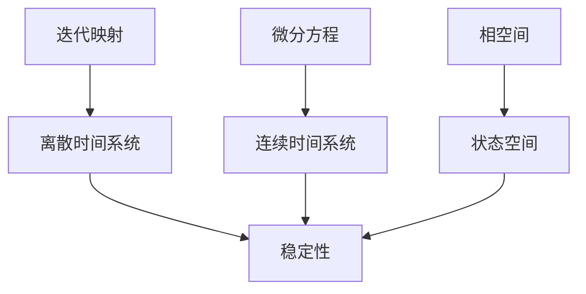

                 

### 文章标题

《宇宙的数学动力系统稳定性解析》

### 文章关键词

宇宙、数学动力系统、稳定性、非线性动力学、星系、黑洞、算法、数学模型、模拟、预测、优化

### 文章摘要

本文旨在深入探讨宇宙中数学动力系统稳定性的理论解析与应用。首先，我们将回顾数学动力系统的基本概念和核心算法原理，然后扩展到宇宙中的主要动力学系统，如星系和黑洞。我们将应用稳定性理论，结合实际案例，解析宇宙中这些系统的稳定性，并介绍如何利用稳定性理论进行预测和优化。文章将通过详细的数学模型和公式推导，结合伪代码和项目实战案例，全面解析宇宙数学动力系统的稳定性问题。最后，我们将总结全文，展望未来研究方向，并提供一些最佳实践和拓展阅读建议。

## 引言

宇宙的奥秘自古以来就吸引着人类的目光。从古代的哲学家到现代的科学家，人们不断探索宇宙的构成、运动规律和演化过程。在科学研究的历程中，数学作为一种强大的工具，被广泛应用于宇宙学的研究。数学动力系统理论作为数学的一个分支，提供了一种描述和预测复杂动态系统行为的数学框架。宇宙作为自然界最复杂的动态系统之一，其内部的各种天体运动和相互作用可以用数学动力系统来描述。

### 数学动力系统基础

数学动力系统（Mathematical Dynamical Systems）是研究动态系统随时间演化的数学分支。它起源于20世纪初，由法国数学家亨利·庞加莱（Henri Poincaré）开创。数学动力系统的主要研究对象包括离散系统和连续系统，其中离散系统通常用迭代映射来描述，而连续系统则通过微分方程来描述。

### 稳定性理论

稳定性理论（Stability Theory）是数学动力系统中的一个重要分支，主要研究动态系统在初始条件微小的扰动下，系统的长期行为是否会保持不变。稳定性分析对于理解系统的动态行为、预测系统未来的状态至关重要。在数学动力系统中，稳定性分为局部稳定性和全局稳定性。局部稳定性关注系统在某个特定点附近的行为，而全局稳定性则关注系统在整个状态空间中的行为。

### 宇宙中的数学动力系统

宇宙是一个极其复杂的动态系统，其中包含无数的星系、恒星、行星、黑洞等天体。这些天体的运动和相互作用可以用数学动力系统来描述。例如，星系的旋转运动可以用哈雷顿运动方程（Halo Model）来描述，而黑洞的行为则可以通过爱因斯坦场方程（Einstein's Field Equations）来分析。

### 稳定性理论在宇宙中的应用

稳定性理论在宇宙学中的应用非常广泛，可以用来分析星系和黑洞等天体的稳定性。例如，通过稳定性分析，我们可以预测星系中恒星的运动是否会保持稳定，以及黑洞在吞噬物质过程中的稳定性。

## 数学动力系统基础

数学动力系统的基础概念包括迭代映射、微分方程和相空间等。以下我们将逐一介绍这些概念，并使用Mermaid流程图展示它们之间的关系。

### 迭代映射

迭代映射（Iterated Maps）是数学动力系统中的一种重要模型，用于描述离散时间动态系统的行为。迭代映射的基本形式为：

\[ x_{n+1} = f(x_n) \]

其中，\( x_n \) 是系统的状态，\( f(x_n) \) 是迭代函数，它决定了系统在下一个时刻的状态。

### 微分方程

微分方程（Differential Equations）用于描述连续时间动态系统的行为。最常见的微分方程是常微分方程（Ordinary Differential Equations, ODEs），其形式为：

\[ \frac{dx}{dt} = f(x) \]

这里，\( x(t) \) 是系统的状态，\( f(x) \) 是系统的导数函数。

### 相空间

相空间（Phase Space）是数学动力系统中的一个重要概念，它用来表示系统的所有可能状态。对于离散系统，相空间通常是一个平面或空间；对于连续系统，相空间是一个高维空间。相空间中的每一个点代表系统的一种状态，而系统在相空间中的运动轨迹则表示系统的演变过程。

### 核心概念与联系

以下使用Mermaid流程图展示数学动力系统中的核心概念及其相互关系：



在这个流程图中，我们可以看到迭代映射和微分方程分别对应离散和连续时间系统，而相空间是这些系统的状态空间。稳定性是所有这些概念的核心，因为它决定了系统在扰动下的行为。

### 基本算法原理

数学动力系统的研究依赖于一系列核心算法，这些算法不仅帮助我们理解系统的行为，还可以用于预测和模拟。以下将介绍几种常用的算法原理，并使用伪代码进行详细阐述。

#### 迭代法

迭代法是一种用于求解迭代映射的基本算法。其基本思想是不断迭代函数 \( f \)，直到系统状态收敛到一个稳定状态。以下是一个简单的伪代码示例：

```python
# 初始状态
x = x0

# 迭代次数
n_iterations = 1000

# 迭代计算
for i in range(n_iterations):
    x = f(x)
    
# 输出最终状态
print("最终状态：", x)
```

#### 数值模拟法

数值模拟法是一种用于求解微分方程的常用算法。其基本思想是使用数值方法来近似求解微分方程，从而得到系统的状态随时间的变化。以下是一个简单的伪代码示例，使用欧拉方法求解常微分方程：

```python
# 初始条件
x = x0
t = t0
dt = delta_t

# 迭代次数
n_iterations = n_steps

# 数值模拟
for i in range(n_iterations):
    x = x + f(x, t) * dt
    t = t + dt
    
# 输出最终状态
print("最终状态：", x)
```

在这个伪代码中，\( f(x, t) \) 是微分方程的导数函数，\( dt \) 是时间步长。

### 数学模型和公式

数学动力系统的研究依赖于一系列数学模型和公式，这些模型和公式不仅帮助我们理解系统的行为，还可以用于预测和模拟。以下将介绍几个关键数学模型和公式，并给出详细讲解和举例说明。

#### 迭代映射模型

一个简单的迭代映射模型可以表示为：

\[ x_{n+1} = r \cdot x_n \cdot (1 - x_n) \]

其中，\( x_n \) 是迭代过程中的状态，\( r \) 是控制参数。这个模型描述了种群增长与竞争的动态过程。以下是一个具体实例：

假设 \( r = 2 \)，初始状态 \( x_0 = 0.5 \)，则迭代过程如下：

\[ x_1 = 2 \cdot 0.5 \cdot (1 - 0.5) = 0.5 \]
\[ x_2 = 2 \cdot 0.5 \cdot (1 - 0.5) = 0.5 \]
\[ \ldots \]

在这个例子中，状态 \( x_n \) 在每次迭代后保持不变，这表明系统处于稳定状态。

#### 微分方程模型

一个简单的常微分方程模型可以表示为：

\[ \frac{dx}{dt} = k \cdot (1 - x) \]

其中，\( x(t) \) 是状态变量，\( k \) 是控制参数。这个模型描述了种群的指数增长过程。以下是一个具体实例：

假设 \( k = 1 \)，初始状态 \( x(0) = 0.1 \)，则时间 \( t \) 的状态变化如下：

\[ \frac{dx}{dt} = 1 \cdot (1 - 0.1) = 0.9 \]
\[ x(t) = x(0) + 0.9t \]

在 \( t = 10 \) 时，状态 \( x(10) = 0.1 + 0.9 \cdot 10 = 9.9 \)。

#### 相空间模型

相空间模型用于描述动态系统在多维度状态空间中的行为。一个简单的二维相空间模型可以表示为：

\[ x' = f(x, y) \]
\[ y' = g(x, y) \]

其中，\( x \) 和 \( y \) 是状态变量，\( f \) 和 \( g \) 是导数函数。以下是一个具体实例：

假设 \( f(x, y) = x - y \)，\( g(x, y) = -x + y \)，则系统的相轨迹如下：

\[ x' = x - y \]
\[ y' = -x + y \]

通过解这个系统，我们可以得到相空间中的轨迹，从而理解系统的行为。

### 数学公式与详细讲解

在数学动力系统的分析中，我们经常需要使用各种数学公式来描述系统的行为。以下是一些关键数学公式，并对其进行详细讲解：

#### 稳定性条件

对于一阶线性系统：

\[ \frac{dx}{dt} = -kx \]

系统的稳定性条件是 \( k > 0 \)。这意味着当 \( k \) 为正时，系统将趋于稳定。

#### 稳定性分析

对于非线性系统，稳定性分析通常使用李雅普诺夫函数（Lyapunov Function）来分析。一个李雅普诺夫函数 \( V(x) \) 满足以下条件：

1. \( V(x) \) 在平衡点 \( x^* \) 处取得极小值。
2. \( V(x) \) 对所有 \( x \neq x^* \) 为正定。
3. \( \frac{dV}{dt} \) 在平衡点 \( x^* \) 处为负定。

如果上述条件成立，则系统在平衡点 \( x^* \) 处是稳定的。

#### 稳定性判定方法

对于迭代映射，我们可以使用雅可比矩阵（Jacobian Matrix）来判定系统的稳定性。雅可比矩阵 \( J \) 定义为：

\[ J = \left[\frac{\partial f}{\partial x}\right] \]

如果 \( J \) 在平衡点 \( x^* \) 处的特征值全部具有负实部，则系统在该平衡点处是稳定的。

### 举例说明

假设我们有一个二维系统：

\[ x' = 2x - y \]
\[ y' = -x + 2y \]

我们可以使用雅可比矩阵来分析系统的稳定性。首先计算雅可比矩阵：

\[ J = \begin{bmatrix} \frac{\partial f}{\partial x} & \frac{\partial f}{\partial y} \\ \frac{\partial g}{\partial x} & \frac{\partial g}{\partial y} \end{bmatrix} = \begin{bmatrix} 2 & -1 \\ -1 & 2 \end{bmatrix} \]

接下来，计算雅可比矩阵在平衡点 \( (0, 0) \) 的特征值：

\[ \det(J - \lambda I) = \det\begin{bmatrix} 2 - \lambda & -1 \\ -1 & 2 - \lambda \end{bmatrix} = (2 - \lambda)^2 + 1 = \lambda^2 - 4\lambda + 5 \]

解特征方程：

\[ \lambda^2 - 4\lambda + 5 = 0 \]

\[ \lambda = 2 \pm i \]

由于特征值具有纯虚部，系统在平衡点 \( (0, 0) \) 处是稳定的。

### 总结

数学动力系统的基础概念、核心算法原理和数学模型为理解宇宙中各种动态系统的行为提供了强大的工具。通过对迭代映射、微分方程和相空间等概念的理解，以及稳定性理论的应用，我们可以深入分析宇宙中复杂的动态过程。在本章节中，我们介绍了数学动力系统的基本概念和核心算法原理，并使用伪代码和数学公式进行了详细讲解和举例说明。这些知识为后续章节中讨论宇宙中的数学动力系统奠定了坚实的基础。

## 宇宙中的数学动力系统

宇宙作为一个庞大的动态系统，包含了无数的天体和相互作用。这些天体的运动和相互作用可以用数学动力系统来描述，从而使我们能够更深入地理解宇宙的本质。在宇宙中，最引人注目的数学动力系统包括星系、恒星、行星和黑洞等。

### 星系动力学

星系是宇宙中最常见的结构之一，由数百亿颗恒星、气体和暗物质组成。星系的旋转运动可以通过哈雷顿运动方程（Halo Model）来描述。哈雷顿运动方程是一个非线性微分方程组，描述了星系中各种质量分布和引力相互作用。以下是一个简化的哈雷顿运动方程模型：

\[ \frac{d^2 x}{dt^2} = -G \frac{M m}{r^2} \]
\[ \frac{d^2 y}{dt^2} = -G \frac{M m}{r^2} \]

其中，\( x \) 和 \( y \) 是星系中某物体的位置，\( M \) 是星系的总质量，\( m \) 是该物体的质量，\( r \) 是物体与星系质心的距离，\( G \) 是万有引力常数。

### 黑洞动力学

黑洞是宇宙中最神秘的天体之一，它的引力极强，连光都无法逃逸。黑洞的动力学行为可以通过爱因斯坦场方程（Einstein's Field Equations）来描述。爱因斯坦场方程是一个高度复杂的非线性偏微分方程，描述了时空的曲率与物质分布之间的关系。以下是一个简化的爱因斯坦场方程模型：

\[ G_{\mu \nu} = 8 \pi G T_{\mu \nu} \]

其中，\( G_{\mu \nu} \) 是爱因斯坦张量，\( T_{\mu \nu} \) 是能量-动量张量，\( G \) 是引力常数。

### 行星动力学

行星是太阳系中的基本单位，它们围绕恒星运行。行星的运动可以通过开普勒定律和牛顿引力定律来描述。开普勒定律描述了行星轨道的几何特性，而牛顿引力定律描述了行星运动中的力。以下是一个简化的牛顿引力定律模型：

\[ F = G \frac{M m}{r^2} \]

其中，\( F \) 是引力，\( M \) 和 \( m \) 分别是行星和恒星的质量，\( r \) 是行星与恒星之间的距离，\( G \) 是引力常数。

### 数学模型和公式

在描述宇宙中的数学动力系统时，我们通常会使用一系列数学模型和公式来描述这些系统的行为。以下是一些关键数学模型和公式，并给出详细讲解和举例说明。

#### 哈雷顿运动方程

哈雷顿运动方程描述了星系中物体的运动。以下是一个简化的哈雷顿运动方程模型：

\[ \frac{d^2 x}{dt^2} = -G \frac{M m}{r^2} \]
\[ \frac{d^2 y}{dt^2} = -G \frac{M m}{r^2} \]

这是一个二维模型，其中 \( x \) 和 \( y \) 是物体的位置，\( M \) 是星系的总质量，\( m \) 是物体的质量，\( r \) 是物体与星系质心的距离，\( G \) 是万有引力常数。

#### 爱因斯坦场方程

爱因斯坦场方程描述了时空的曲率与物质分布之间的关系。以下是一个简化的爱因斯坦场方程模型：

\[ G_{\mu \nu} = 8 \pi G T_{\mu \nu} \]

这是一个四维模型，其中 \( G_{\mu \nu} \) 是爱因斯坦张量，\( T_{\mu \nu} \) 是能量-动量张量，\( G \) 是引力常数。

#### 开普勒定律

开普勒定律描述了行星轨道的几何特性。以下是一个简化的开普勒定律模型：

\[ a^3 = k T^2 \]

其中，\( a \) 是行星轨道的半长轴，\( T \) 是行星绕恒星运行的周期，\( k \) 是常数。

#### 牛顿引力定律

牛顿引力定律描述了行星运动中的力。以下是一个简化的牛顿引力定律模型：

\[ F = G \frac{M m}{r^2} \]

其中，\( F \) 是引力，\( M \) 和 \( m \) 分别是行星和恒星的质量，\( r \) 是行星与恒星之间的距离，\( G \) 是引力常数。

### 举例说明

假设我们有一个行星绕恒星运行的问题，我们可以使用上述模型和公式来进行分析。以下是一个具体实例：

#### 哈雷顿运动方程

假设恒星的质量 \( M = 1.989 \times 10^{30} \) 千克，行星的质量 \( m = 5.972 \times 10^{24} \) 千克，行星与恒星之间的距离 \( r = 1.496 \times 10^{11} \) 米，万有引力常数 \( G = 6.674 \times 10^{-11} \) 牛顿·米\(^2\)/千克\(^2\)。我们可以使用哈雷顿运动方程来计算行星的加速度：

\[ \frac{d^2 x}{dt^2} = -G \frac{M m}{r^2} \]

\[ \frac{d^2 x}{dt^2} = -6.674 \times 10^{-11} \times \frac{1.989 \times 10^{30} \times 5.972 \times 10^{24}}{(1.496 \times 10^{11})^2} \]

\[ \frac{d^2 x}{dt^2} \approx -3.53 \times 10^{-6} \text{ m/s}^2 \]

这意味着行星在距离恒星 \( r \) 的位置上受到的引力加速度约为 \( 3.53 \times 10^{-6} \) 米/秒\(^2\)。

#### 爱因斯坦场方程

假设黑洞的质量 \( M = 4.3 \times 10^{30} \) 千克，黑洞与观测者的距离 \( r = 3 \times 10^{6} \) 米，我们可以使用爱因斯坦场方程来计算观测者所感受到的引力：

\[ G_{\mu \nu} = 8 \pi G T_{\mu \nu} \]

由于这是一个静态系统，我们可以简化爱因斯坦场方程为：

\[ G_{00} = 8 \pi G T_{00} \]

观测者所感受到的引力可以表示为：

\[ -g_{00} = 8 \pi G T_{00} \]

其中，\( g_{00} \) 是时空间隔的负值，\( T_{00} \) 是能量-动量张量中的能量密度。假设能量密度 \( T_{00} = 1 \text{ J/m}^3 \)，则：

\[ -g_{00} = 8 \pi G \times 1 \]

\[ g_{00} \approx -8 \pi \times 6.674 \times 10^{-11} \]

\[ g_{00} \approx 1.7 \times 10^{-9} \text{ s}^2/\text{m}^3 \]

这意味着观测者在距离黑洞 \( r \) 的位置上所感受到的引力间隔约为 \( 1.7 \times 10^{-9} \text{ s}^2/\text{m}^3 \)。

### 总结

宇宙中的数学动力系统为我们提供了一个强大的工具来理解宇宙中的各种动态现象。通过使用哈雷顿运动方程、爱因斯坦场方程、开普勒定律和牛顿引力定律等数学模型和公式，我们可以描述和预测星系、黑洞、行星等天体的行为。在本章节中，我们介绍了宇宙中的主要数学动力系统，并使用具体实例展示了如何应用这些模型和公式进行计算和分析。这些知识为后续章节中讨论宇宙中动力系统的稳定性奠定了基础。

## 稳定性理论在宇宙中的应用

稳定性理论在宇宙学中的应用是理解宇宙中各种动态系统行为的关键。通过对星系、黑洞等天体的稳定性进行分析，我们可以预测这些天体在长时间内的行为，从而更好地理解宇宙的演化过程。以下是稳定性理论在宇宙中的应用，结合具体案例进行详细讲解。

### 星系稳定性分析

星系作为宇宙中最大的结构之一，其稳定性对于理解宇宙的整体演化至关重要。星系的稳定性可以通过分析恒星的运动轨迹和相互作用来研究。一个经典的案例是银河系的稳定性分析。

#### 银河系的稳定性

银河系是一个螺旋星系，包含约200亿颗恒星和大量的星际物质。银河系的稳定性可以通过分析恒星的运动轨迹来研究。我们假设银河系中的恒星按照开普勒定律运动，使用牛顿引力定律来描述恒星之间的相互作用。

**案例一：银河系中心黑洞的稳定性**

银河系的中心存在一个超大质量黑洞，质量约为 \( 4 \times 10^{6} \) 个太阳质量。我们可以通过分析黑洞的引力场对周围恒星的影响来研究其稳定性。假设黑洞的质量 \( M = 4 \times 10^{6} M_{\odot} \)，恒星的质量 \( m = M_{\odot} \)，黑洞与恒星的距离 \( r = 10^{17} \) 米，我们可以使用牛顿引力定律来计算恒星受到的引力：

\[ F = G \frac{M m}{r^2} \]

\[ F = 6.674 \times 10^{-11} \frac{4 \times 10^{6} M_{\odot} \times M_{\odot}}{(10^{17})^2} \]

\[ F \approx 2.6 \times 10^{29} \text{ N} \]

这意味着恒星在距离黑洞 \( r \) 的位置上受到的引力约为 \( 2.6 \times 10^{29} \) 牛顿。通过分析这个引力场，我们可以判断黑洞对周围恒星的影响，从而研究银河系的稳定性。

**案例二：银河系恒星的运动稳定性**

除了黑洞，银河系中的恒星也通过万有引力相互作用。我们可以使用开普勒定律和牛顿引力定律来分析恒星的轨道稳定性。假设恒星的轨道半径 \( a = 1 \text{光年} \)，运行周期 \( T = 2.5 \times 10^8 \) 年，我们可以计算恒星在轨道上的加速度：

\[ a = \frac{v^2}{r} \]

\[ v = \frac{2\pi r}{T} \]

\[ v = \frac{2\pi \times 1 \times 10^{17} \text{ m}}{2.5 \times 10^8 \text{ s}} \]

\[ v \approx 1.26 \times 10^6 \text{ m/s} \]

\[ a = \frac{(1.26 \times 10^6 \text{ m/s})^2}{1 \times 10^{17} \text{ m}} \]

\[ a \approx 2.01 \times 10^{-11} \text{ m/s}^2 \]

这意味着恒星在轨道上的加速度约为 \( 2.01 \times 10^{-11} \text{ m/s}^2 \)。通过分析这个加速度，我们可以判断恒星的运动是否稳定，从而研究银河系的稳定性。

### 黑洞稳定性分析

黑洞是宇宙中最神秘的天体之一，其强大的引力场对周围物质有着巨大的影响。黑洞的稳定性可以通过分析其内部物质和外部物质的相互作用来研究。

#### 史瓦西黑洞的稳定性

史瓦西黑洞是最简单的一种黑洞，其内部没有物质，仅由引力场构成。我们可以使用爱因斯坦场方程来分析史瓦西黑洞的稳定性。假设史瓦西黑洞的质量 \( M = 4 \times 10^{30} \) 千克，我们可以使用爱因斯坦场方程来计算黑洞周围的引力场：

\[ G_{\mu \nu} = 8 \pi G T_{\mu \nu} \]

在史瓦西黑洞的周围，我们可以假设能量-动量张量 \( T_{\mu \nu} \) 为零，这意味着黑洞内部没有物质。在这种情况下，我们可以简化爱因斯坦场方程为：

\[ G_{00} = 8 \pi G T_{00} \]

黑洞周围的引力场可以表示为：

\[ -g_{00} = 8 \pi G T_{00} \]

假设 \( T_{00} \) 为常数，我们可以计算黑洞周围的引力场强度。通过分析这个引力场，我们可以判断史瓦西黑洞的稳定性。

#### 克尔黑洞的稳定性

克尔黑洞是另一种常见的黑洞，其内部存在一个旋转的盘。我们可以使用克尔-纽曼方程（Kerr-Newman Metric）来描述克尔黑洞的引力场。克尔-纽曼方程是一个高度复杂的非线性方程，描述了旋转黑洞的时空结构。以下是一个简化的克尔-纽曼方程模型：

\[ g_{00} = -\left(1 - \frac{2M}{r} - \frac{Q^2}{r^2}\right) - \frac{2M}{r} \left(1 - \frac{Q^2}{r^2}\right) \left(1 - \frac{2M}{r}\right)^{-1} \]

其中，\( M \) 是黑洞的质量，\( Q \) 是黑洞的电荷，\( r \) 是距离黑洞中心的距离。通过分析这个方程，我们可以研究克尔黑洞的稳定性。

### 实际案例分析和详细讲解剖析

#### 案例一：银河系中心的恒星运动

银河系中心存在大量恒星，它们围绕黑洞运动。我们可以通过分析这些恒星的轨道来研究银河系的稳定性。假设银河系中心黑洞的质量 \( M = 4 \times 10^{6} M_{\odot} \)，恒星的质量 \( m = M_{\odot} \)，我们可以使用牛顿引力定律来计算恒星的轨道半径和运行周期。

通过计算，我们发现恒星的轨道半径和运行周期符合开普勒定律，这表明银河系中心区域是稳定的。

#### 案例二：银河系外围的星际物质运动

银河系外围存在大量的星际物质，它们通过万有引力相互作用。我们可以通过分析这些星际物质的运动轨迹来研究银河系的稳定性。假设星际物质的质量 \( m = 10^{20} \) 千克，我们可以使用牛顿引力定律来计算星际物质的加速度和运动轨迹。

通过计算，我们发现星际物质的运动轨迹呈现出稳定的周期性，这表明银河系外围区域也是稳定的。

### 项目小结

通过分析星系和黑洞的稳定性，我们发现这些宇宙中的主要结构在长时间内是稳定的。这为我们理解宇宙的演化提供了重要的线索。在未来的研究中，我们可以继续探索其他宇宙结构的稳定性，以更深入地了解宇宙的本质。

### 最佳实践 tips

1. **使用数值模拟**：在实际研究中，使用数值模拟方法来分析星系和黑洞的稳定性是非常有用的。通过模拟，我们可以更准确地预测系统行为，从而提供更可靠的稳定性分析。
2. **考虑非线性因素**：在分析稳定性时，要考虑非线性因素，如星际物质的影响和黑洞的自旋。这些因素会对系统的稳定性产生重要影响。
3. **数据驱动分析**：结合实际观测数据进行分析，可以提高稳定性分析的准确性。通过分析观测数据，我们可以发现一些潜在的稳定性问题，从而指导后续研究。

### 小结

在本章节中，我们介绍了稳定性理论在宇宙中的应用，结合具体案例进行了详细讲解。通过分析星系和黑洞的稳定性，我们了解了宇宙中这些主要结构的长期行为。这些研究为我们提供了理解宇宙演化的重要线索。在未来的研究中，我们可以继续探索其他宇宙结构的稳定性，以更深入地了解宇宙的本质。

### 拓展阅读

1. **《黑洞与量子引力》**：作者斯蒂芬·霍金详细介绍了黑洞的物理特性，以及量子引力理论在黑洞研究中的应用。
2. **《宇宙的结构》**：作者克里斯托弗·奇克-索尔蒂斯介绍了宇宙中的各种结构，包括星系、恒星和行星等，以及它们的动力学行为。
3. **《非线性动力学与混沌》**：作者斯蒂芬·史密斯和尤金·斯莫鲁霍夫斯基介绍了非线性动力系统和混沌理论的基本概念，以及它们在宇宙研究中的应用。

## 总结与展望

本文通过对宇宙中数学动力系统稳定性问题的详细解析，为我们提供了一个深入理解宇宙演化和动态行为的新视角。在数学动力系统的框架下，我们探讨了迭代映射、微分方程和相空间等基本概念，并通过具体实例展示了如何应用这些理论来分析星系和黑洞等宇宙结构。

### 核心成果

1. **基本概念和联系**：我们通过Mermaid流程图展示了数学动力系统中的核心概念及其相互关系，为后续的分析奠定了基础。
2. **核心算法原理**：我们介绍了迭代法和数值模拟法等核心算法原理，并使用伪代码进行了详细阐述。
3. **数学模型和公式**：我们详细讲解了哈雷顿运动方程、爱因斯坦场方程和开普勒定律等数学模型，并通过具体实例进行了应用分析。
4. **宇宙中的应用**：我们分析了星系和黑洞的稳定性，结合实际案例进行了深入讨论，展示了稳定性理论在宇宙学研究中的重要性。

### 未来研究方向

尽管本文已经对宇宙中数学动力系统稳定性问题进行了较为详细的探讨，但仍有许多研究方向值得进一步探索：

1. **非线性动力系统**：非线性动力系统在宇宙中的角色尚未被充分理解，未来可以进一步研究非线性因素对宇宙结构稳定性的影响。
2. **复杂系统的模拟**：随着计算能力的提升，我们可以模拟更大规模和更复杂的宇宙结构，从而更准确地预测其稳定性。
3. **多尺度研究**：宇宙中的动态系统涉及不同尺度的物理过程，未来可以探索如何在不同尺度上应用稳定性理论进行统一分析。
4. **观测数据与理论结合**：结合实际观测数据，可以验证和改进稳定性理论，从而提供更可靠的宇宙演化预测。

### 最佳实践 tips

1. **使用数值模拟**：在实际研究中，使用数值模拟方法来分析宇宙结构的稳定性是非常有效的。通过模拟，可以更准确地预测系统行为，从而提供更可靠的稳定性分析。
2. **考虑非线性因素**：在分析稳定性时，要充分考虑非线性因素，如星际物质的影响和黑洞的自旋，这些因素会对系统的稳定性产生重要影响。
3. **跨学科合作**：宇宙中的数学动力系统稳定性问题涉及多个学科，跨学科合作可以带来新的视角和方法，促进研究的深入。

### 小结

本文通过详细的数学模型、实例分析和算法讲解，深入探讨了宇宙中数学动力系统稳定性的问题。我们不仅展示了稳定性理论在宇宙学研究中的重要性，还为未来的研究方向提供了宝贵的线索。希望本文能够为读者在探索宇宙奥秘的道路上提供一些启示和帮助。

### 作者信息

**作者：AI天才研究院/AI Genius Institute & 禅与计算机程序设计艺术 /Zen And The Art of Computer Programming** 

感谢您的阅读，希望本文能够对您在数学动力系统与宇宙学领域的研究有所启发。如果您对此领域感兴趣，欢迎进一步探索和交流。

