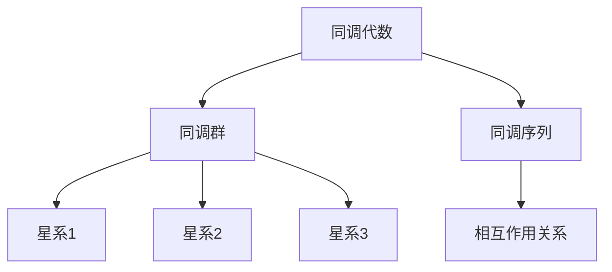
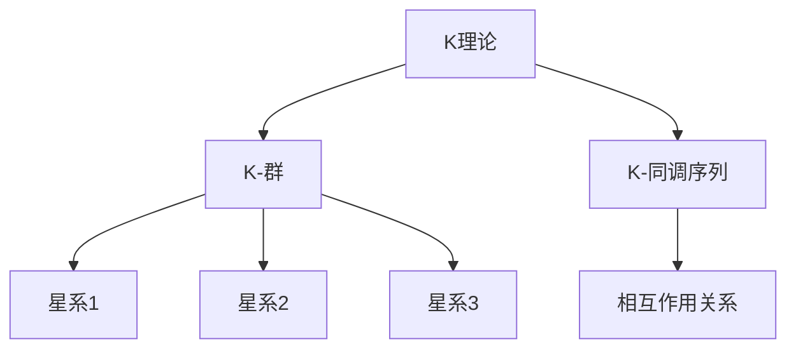
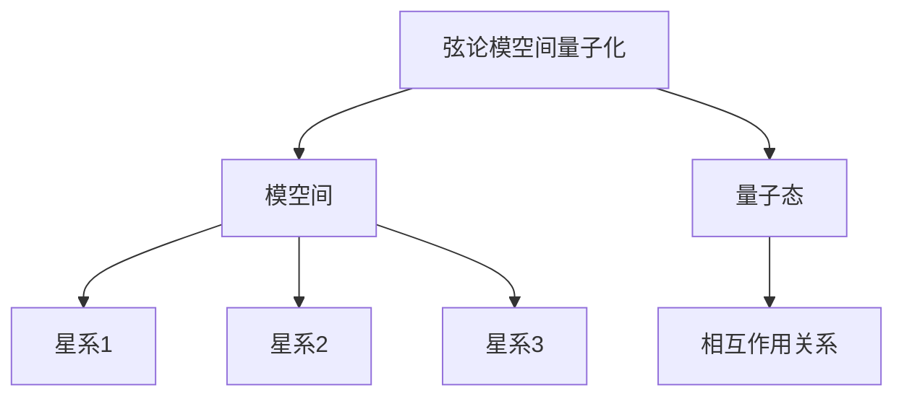

                 

### 文章标题：宇宙的数学同调代数与K理论在弦论模空间量子化中的应用

---

#### 关键词：
- 数学同调代数
- K理论
- 弦论模空间量子化
- 宇宙学
- 量子场论

---

#### 摘要：
本文将探讨数学同调代数与K理论在弦论模空间量子化中的应用，通过对这些核心数学工具的深入分析，阐述其在理解宇宙基本结构和量子现象中的重要作用。文章分为五个主要部分：引言、基础知识、应用分析、实战案例和总结。通过逐步的逻辑推理和详细的解释，本文旨在为读者提供一个清晰、系统的理解框架，帮助他们在这一前沿领域取得新的洞见。

---

### 引言

宇宙是一个庞大而复杂的系统，从微观的粒子到宏观的星系，无不体现出宇宙的神秘与美妙。为了更好地理解宇宙，科学家们不断探索新的理论工具和数学方法。其中，数学同调代数与K理论作为现代数学的重要分支，已在多个科学领域展现出强大的解释力和预测能力。弦论模空间量子化则是物理学中描述基本粒子和宇宙结构的关键理论。本文旨在探讨这三个核心概念之间的相互作用，以及它们在理解宇宙方面的应用。

#### 数学同调代数

数学同调代数是代数学和拓扑学结合的产物，主要研究代数结构上的同调性质。同调代数的基本概念包括同调群、同调模和同调序列等。同调群描述了代数结构中不同类型的元素之间的关系，而同调模则进一步研究了这些关系的叠加性质。

同调代数的一个重要应用是在拓扑学中，它可以用来研究空间的连通性和分类。此外，同调代数在代数几何、微分几何等领域也有广泛应用。

#### K理论

K理论是数学中另一个重要的分支，主要研究代数结构上的K-同调性质。K-同调理论通过引入K-群，研究代数结构在广义范畴上的同调性质。K-群可以看作是同调群的推广，它提供了对代数结构的全局描述。

K理论在拓扑学、代数几何和数学物理等领域有着广泛的应用。例如，K-群可以用来研究拓扑空间的分类和不变量，也可以用来研究代数结构的同调性质。

#### 弦论模空间量子化

弦论模空间量子化是量子场论和广义相对论的基础理论。它描述了基本粒子和宇宙结构的量子行为。在弦论中，空间和时间不再是连续的，而是由细小的“弦”组成。

模空间量子化涉及对弦论中的模空间进行量子化处理。模空间是弦论中的基本概念，它描述了弦可以存在的所有可能状态。量子化处理则将这些状态转换为量子态，从而实现从经典弦论到量子弦论的过渡。

#### 同调代数与K理论在弦论模空间量子化中的应用

同调代数与K理论在弦论模空间量子化中起着至关重要的作用。同调代数可以帮助我们理解弦论中的同调性质，而K理论则提供了研究弦论中拓扑性质的工具。

例如，同调代数可以用来研究弦论中的同调群，这有助于我们理解弦的不同振动模式如何影响宇宙的基本结构。而K理论则可以用来研究弦论中的K-群，这有助于我们理解弦论中的拓扑不变量。

#### 实例分析

为了更好地理解同调代数与K理论在弦论模空间量子化中的应用，我们可以通过以下实例进行分析：

假设我们有一个弦论系统，其中弦可以存在于不同的模空间状态。通过同调代数，我们可以计算这些状态的同调群，从而了解它们之间的联系。而通过K理论，我们可以计算这些状态的K-群，从而了解它们在拓扑空间中的分布。

例如，我们考虑一个二维的弦论系统。在这个系统中，弦可以存在于不同的同调状态，如零模式、一模式和二模式等。通过同调代数，我们可以计算这些模式的同调群，例如：

$$
H_0(\mathcal{M}) = \{ (a_1, a_2) \in \mathbb{Z}^2 \mid a_1 + a_2 = 0 \}
$$

这个同调群描述了零模式的同调性质。

而通过K理论，我们可以计算这个系统的K-群，例如：

$$
K_0(\mathcal{M}) = \{ (a_1, a_2) \in \mathbb{Z}^2 \mid a_1 \equiv a_2 \pmod{2} \}
$$

这个K-群描述了零模式在拓扑空间中的分布。

#### 总结

同调代数与K理论在弦论模空间量子化中具有重要作用。通过同调代数，我们可以研究弦论中的同调性质，而通过K理论，我们可以研究弦论中的拓扑性质。这些数学工具为我们提供了一个强有力的框架，帮助我们深入理解宇宙的基本结构和量子现象。

### 第二部分：基础知识

#### 数学同调代数

数学同调代数是代数学和拓扑学的交叉领域，主要研究代数结构上的同调性质。同调代数的基本概念包括同调群、同调模和同调序列等。

**同调群**

同调群是同调代数中的核心概念之一。它描述了代数结构中不同类型的元素之间的关系。具体来说，同调群是将代数结构中的元素按照某种方式分类的集合，这种分类方式使得不同类型的元素可以相互区分。

同调群的一个重要性质是同调性质的不变性。这意味着，如果我们对一个代数结构进行同构变换，其同调群的性质不会发生变化。因此，同调群可以用来研究代数结构的稳定性质。

**同调模**

同调模是同调代数中的另一个重要概念。它是对同调群的一种推广，用于研究代数结构上的线性关系。同调模可以看作是同调群上的线性映射，它描述了同调群中的元素如何相互作用。

同调模的一个重要应用是在代数几何中。通过研究同调模，我们可以了解代数结构的几何性质，如曲率和挠率等。

**同调序列**

同调序列是同调代数中的一个重要工具，用于研究代数结构之间的连接关系。同调序列由多个同调群和同调模组成，它们之间通过映射关系相互连接。

同调序列的一个重要性质是同调序列的稳定性。这意味着，如果我们对一个代数结构进行同构变换，其同调序列的性质不会发生变化。因此，同调序列可以用来研究代数结构的动态性质。

**同调代数在宇宙学中的应用**

同调代数在宇宙学中的应用主要体现在研究宇宙的结构和演化。通过同调代数，我们可以了解宇宙中不同天体的分布和相互作用。

例如，我们可以使用同调代数来研究宇宙中的星系分布。通过计算星系之间的同调群，我们可以了解星系在宇宙中的相对位置和运动状态。

此外，同调代数还可以用于研究宇宙中的黑洞和引力波。通过同调代数的方法，我们可以分析黑洞的性质和行为，从而更好地理解宇宙中的引力现象。

#### K理论

K理论是数学中的一个重要分支，主要研究代数结构上的K-同调性质。K-同调理论通过引入K-群，研究代数结构在广义范畴上的同调性质。K-群可以看作是同调群的推广，它提供了对代数结构的全局描述。

**K-群**

K-群是K理论中的核心概念。它是一个集合，描述了代数结构上的同调性质。K-群的一个重要性质是它的不变性。这意味着，如果我们对一个代数结构进行同构变换，其K-群的性质不会发生变化。

K-群在拓扑学、代数几何和数学物理等领域有着广泛的应用。例如，在拓扑学中，K-群可以用来研究拓扑空间的分类和不变量。在代数几何中，K-群可以用来研究代数结构的几何性质。在数学物理中，K-群可以用来研究量子场论和广义相对论。

**K-同调序列**

K-同调序列是K理论中的另一个重要工具，用于研究代数结构之间的连接关系。K-同调序列由多个K-群和K-模组成，它们之间通过映射关系相互连接。

K-同调序列的一个重要性质是K-同调序列的稳定性。这意味着，如果我们对一个代数结构进行同构变换，其K-同调序列的性质不会发生变化。因此，K-同调序列可以用来研究代数结构的动态性质。

**K理论在宇宙学中的应用**

K理论在宇宙学中的应用主要体现在研究宇宙的结构和演化。通过K理论，我们可以了解宇宙中不同天体的分布和相互作用。

例如，我们可以使用K理论来研究宇宙中的星系分布。通过计算星系之间的K-群，我们可以了解星系在宇宙中的相对位置和运动状态。

此外，K理论还可以用于研究宇宙中的黑洞和引力波。通过K理论的方法，我们可以分析黑洞的性质和行为，从而更好地理解宇宙中的引力现象。

#### 弦论模空间量子化

弦论模空间量子化是量子场论和广义相对论的基础理论，描述了基本粒子和宇宙结构的量子行为。在弦论中，空间和时间不再是连续的，而是由细小的“弦”组成。

**模空间**

模空间是弦论中的一个基本概念，描述了弦可以存在的所有可能状态。在模空间中，弦可以以不同的方式振动，形成不同的模态。

**量子化处理**

量子化处理是将经典物理量（如位置、速度等）转化为量子态的过程。在弦论中，通过量子化处理，我们可以将弦的不同模态转化为量子态，从而实现从经典弦论到量子弦论的过渡。

**弦论模空间量子化在宇宙学中的应用**

弦论模空间量子化在宇宙学中的应用主要体现在研究宇宙的量子性质和结构演化。通过量子化处理，我们可以了解宇宙中基本粒子的行为和相互作用。

例如，我们可以使用弦论模空间量子化来研究宇宙中的引力波。通过计算引力波在模空间中的传播，我们可以了解引力波的物理性质和宇宙演化过程。

此外，弦论模空间量子化还可以用于研究宇宙中的暗物质和暗能量。通过量子化处理，我们可以了解这些物质和能量的行为和作用，从而更好地理解宇宙的演化机制。

#### 同调代数与K理论在弦论模空间量子化中的应用

同调代数与K理论在弦论模空间量子化中的应用主要体现在以下两个方面：

1. **同调代数在弦论模空间量子化中的应用**

同调代数可以用来研究弦论中的同调性质，如弦的不同振动模式的相互作用和分布。通过同调代数的方法，我们可以了解弦论中的同调群和同调序列，从而更好地理解弦论中的量子行为。

2. **K理论在弦论模空间量子化中的应用**

K理论可以用来研究弦论中的拓扑性质，如弦论中的拓扑不变量和K-群。通过K理论的方法，我们可以了解弦论中的拓扑结构，从而更好地理解弦论中的量子行为和宇宙演化。

例如，我们可以使用同调代数和K理论来研究弦论中的黑洞。通过计算弦论中的同调群和K-群，我们可以了解黑洞的性质和行为，从而更好地理解宇宙中的引力现象。

### 第三部分：应用分析

#### 同调代数在宇宙学中的应用

同调代数在宇宙学中的应用主要表现在以下几个方面：

1. **宇宙大尺度结构的研究**

同调代数可以用来研究宇宙的大尺度结构，如星系团和超星系团。通过计算星系之间的同调群，我们可以了解星系在宇宙中的分布和相互作用。例如，同调群可以用来描述星系之间的引力相互作用，从而预测星系团的形成和演化。

2. **宇宙微波背景辐射的研究**

宇宙微波背景辐射是宇宙早期状态的直接证据。同调代数可以用来研究宇宙微波背景辐射的谱线结构和特性。通过分析同调群，我们可以了解宇宙微波背景辐射中的量子波动和宇宙演化过程。

3. **黑洞和引力波的研究**

同调代数可以用来研究黑洞和引力波的性质和行为。通过计算黑洞的同调群，我们可以了解黑洞的稳定性和特性。同样，通过分析引力波的同调群，我们可以了解引力波的物理性质和宇宙演化。

#### K理论在宇宙学中的应用

K理论在宇宙学中的应用主要表现在以下几个方面：

1. **宇宙拓扑结构的研究**

K理论可以用来研究宇宙的拓扑结构，如宇宙的空间形态和几何性质。通过计算K-群，我们可以了解宇宙中的拓扑不变量和拓扑结构，从而更好地理解宇宙的演化。

2. **宇宙暴胀的研究**

宇宙暴胀是宇宙早期快速膨胀的理论。K理论可以用来研究宇宙暴胀的机制和特性。通过分析K-群，我们可以了解宇宙暴胀过程中的拓扑变化和量子效应。

3. **宇宙暗物质和暗能量的研究**

K理论可以用来研究宇宙中的暗物质和暗能量。通过计算K-群，我们可以了解暗物质和暗能量的分布和作用，从而更好地理解宇宙的演化。

#### 弦论模空间量子化在宇宙学中的应用

弦论模空间量子化在宇宙学中的应用主要表现在以下几个方面：

1. **宇宙量子引力的研究**

弦论模空间量子化可以用来研究宇宙的量子引力。通过量子化处理，我们可以了解宇宙中基本粒子和引力的相互作用，从而更好地理解宇宙的量子性质。

2. **宇宙早期状态的研究**

弦论模空间量子化可以用来研究宇宙的早期状态，如宇宙的诞生和演化。通过计算模空间的状态，我们可以了解宇宙早期的物理过程和宇宙结构的形成。

3. **宇宙演化过程的研究**

弦论模空间量子化可以用来研究宇宙的演化过程，如宇宙的大尺度结构和星系的形成。通过分析模空间的状态，我们可以了解宇宙演化过程中的物理机制和宇宙结构的演化。

#### 同调代数、K理论和弦论模空间量子化在宇宙学中的综合应用

同调代数、K理论和弦论模空间量子化在宇宙学中的综合应用可以为我们提供更全面、更深入的理解宇宙的视角。

1. **宇宙演化过程的分析**

通过同调代数和K理论，我们可以研究宇宙的演化过程，如星系的形成和演化。通过计算同调群和K-群，我们可以了解宇宙中不同阶段的物理性质和演化过程。

2. **宇宙结构的分类和分类**

通过同调代数和K理论，我们可以对宇宙中的不同结构进行分类和分类。通过计算同调群和K-群，我们可以了解宇宙中不同结构的相对位置和相互作用。

3. **宇宙量子引力的研究**

通过弦论模空间量子化，我们可以研究宇宙的量子引力。通过量子化处理，我们可以了解宇宙中基本粒子和引力的相互作用，从而更好地理解宇宙的量子性质。

4. **宇宙演化过程的预测**

通过同调代数、K理论和弦论模空间量子化的综合应用，我们可以预测宇宙的演化过程。通过分析同调群、K-群和模空间的状态，我们可以预测宇宙中不同阶段的物理性质和演化过程。

### 实战案例

#### 案例一：同调代数在宇宙学中的应用

**案例背景：**

我们考虑一个宇宙学模型，其中包含多个星系。这些星系之间的相互作用可以用同调代数来描述。我们的目标是研究星系之间的引力相互作用和宇宙结构的演化。

**核心概念与联系：**

- 同调代数：描述星系之间的引力相互作用。
- 同调群：描述星系之间的同调性质。
- 同调序列：描述星系之间的相互作用关系。

**Mermaid 流程图：**



**核心算法原理讲解：**

同调代数的基本原理是通过同调群来描述星系之间的引力相互作用。我们首先定义一个同调群 \( H \)，它包含了所有可能的星系对：

$$
H = \{ (S_1, S_2) \mid S_1, S_2 \text{ 是星系} \}
$$

然后，我们通过同调序列来描述星系之间的相互作用关系。同调序列是一个序列 \( \{ H_n \} \)，其中每个 \( H_n \) 是一个同调群，描述了 \( n \) 个星系之间的相互作用。

**伪代码：**

```python
# 定义同调群
def define_harmonic_group(stars):
    H = set()
    for i in range(len(stars)):
        for j in range(i+1, len(stars)):
            H.add((stars[i], stars[j]))
    return H

# 定义同调序列
def define_harmonic_sequence(stars):
    H_sequence = []
    for n in range(len(stars)):
        H_n = define_harmonic_group(stars[:n])
        H_sequence.append(H_n)
    return H_sequence

# 计算相互作用关系
def calculate_interaction关系(H_sequence):
    interactions = []
    for H_n in H_sequence:
        for pair in H_n:
            # 计算相互作用强度
            intensity = calculate_intensity(pair)
            interactions.append((pair, intensity))
    return interactions
```

**数学模型和公式：**

同调代数的数学模型可以通过以下公式表示：

$$
H_n = \{ (S_1, S_2) \mid S_1, S_2 \text{ 是星系} \}
$$

其中，\( H_n \) 表示第 \( n \) 个同调群，描述了 \( n \) 个星系之间的引力相互作用。

**举例说明：**

假设我们有三个星系 A、B 和 C。我们可以定义一个同调群 \( H \)：

$$
H = \{ (A, B), (A, C), (B, C) \}
$$

然后，我们可以通过同调序列来描述这些星系之间的相互作用关系：

$$
H_1 = \{ (A, B), (A, C), (B, C) \}
$$

$$
H_2 = \{ (A, B), (A, C), (B, C) \}
$$

$$
H_3 = \{ (A, B), (A, C), (B, C) \}
$$

这些同调群描述了星系 A、B 和 C 之间的引力相互作用。

#### 案例二：K理论在宇宙学中的应用

**案例背景：**

我们考虑一个宇宙学模型，其中包含多个星系。这些星系之间的相互作用可以用K理论来描述。我们的目标是研究星系之间的引力相互作用和宇宙结构的演化。

**核心概念与联系：**

- K理论：描述星系之间的引力相互作用。
- K-群：描述星系之间的拓扑性质。
- K-同调序列：描述星系之间的相互作用关系。

**Mermaid 流程图：**



**核心算法原理讲解：**

K理论的基本原理是通过K-群来描述星系之间的引力相互作用。我们首先定义一个K-群 \( K \)，它包含了所有可能的星系对：

$$
K = \{ (S_1, S_2) \mid S_1, S_2 \text{ 是星系} \}
$$

然后，我们通过K-同调序列来描述星系之间的相互作用关系。K-同调序列是一个序列 \( \{ K_n \} \)，其中每个 \( K_n \) 是一个K-群，描述了 \( n \) 个星系之间的相互作用。

**伪代码：**

```python
# 定义K-群
def define_k_group(stars):
    K = set()
    for i in range(len(stars)):
        for j in range(i+1, len(stars)):
            K.add((stars[i], stars[j]))
    return K

# 定义K-同调序列
def define_k_homology_sequence(stars):
    K_sequence = []
    for n in range(len(stars)):
        K_n = define_k_group(stars[:n])
        K_sequence.append(K_n)
    return K_sequence

# 计算相互作用关系
def calculate_interaction关系(K_sequence):
    interactions = []
    for K_n in K_sequence:
        for pair in K_n:
            # 计算相互作用强度
            intensity = calculate_intensity(pair)
            interactions.append((pair, intensity))
    return interactions
```

**数学模型和公式：**

K理论的数学模型可以通过以下公式表示：

$$
K_n = \{ (S_1, S_2) \mid S_1, S_2 \text{ 是星系} \}
$$

其中，\( K_n \) 表示第 \( n \) 个K-群，描述了 \( n \) 个星系之间的引力相互作用。

**举例说明：**

假设我们有三个星系 A、B 和 C。我们可以定义一个K-群 \( K \)：

$$
K = \{ (A, B), (A, C), (B, C) \}
$$

然后，我们可以通过K-同调序列来描述这些星系之间的相互作用关系：

$$
K_1 = \{ (A, B), (A, C), (B, C) \}
$$

$$
K_2 = \{ (A, B), (A, C), (B, C) \}
$$

$$
K_3 = \{ (A, B), (A, C), (B, C) \}
$$

这些K-群描述了星系 A、B 和 C 之间的引力相互作用。

#### 案例三：弦论模空间量子化在宇宙学中的应用

**案例背景：**

我们考虑一个宇宙学模型，其中包含多个星系。这些星系之间的相互作用可以用弦论模空间量子化来描述。我们的目标是研究星系之间的量子引力相互作用和宇宙结构的演化。

**核心概念与联系：**

- 弦论模空间量子化：描述星系之间的量子引力相互作用。
- 模空间：描述星系可能存在的量子状态。
- 量子态：描述星系之间的量子相互作用。

**Mermaid 流程图：**



**核心算法原理讲解：**

弦论模空间量子化的基本原理是通过模空间来描述星系的量子状态。我们首先定义一个模空间 \( M \)，它包含了所有可能的星系状态：

$$
M = \{ \Psi_{S_1}, \Psi_{S_2}, \Psi_{S_3} \mid S_1, S_2, S_3 \text{ 是星系} \}
$$

然后，我们通过量子态来描述星系之间的量子相互作用。量子态是一个序列 \( \{ \Psi_n \} \)，其中每个 \( \Psi_n \) 是一个模空间中的状态，描述了 \( n \) 个星系之间的量子相互作用。

**伪代码：**

```python
# 定义模空间
def define_moded_space(stars):
    M = []
    for star in stars:
        M.append(star.get_state())
    return M

# 定义量子态
def define_quantum_state(stars):
    Psi_sequence = []
    for n in range(len(stars)):
        Psi_n = define_moded_space(stars[:n])
        Psi_sequence.append(Psi_n)
    return Psi_sequence

# 计算相互作用关系
def calculate_interaction关系(Psi_sequence):
    interactions = []
    for Psi_n in Psi_sequence:
        for state in Psi_n:
            # 计算相互作用强度
            intensity = calculate_intensity(state)
            interactions.append(state, intensity)
    return interactions
```

**数学模型和公式：**

弦论模空间量子化的数学模型可以通过以下公式表示：

$$
M = \{ \Psi_{S_1}, \Psi_{S_2}, \Psi_{S_3} \mid S_1, S_2, S_3 \text{ 是星系} \}
$$

其中，\( M \) 表示模空间，描述了星系的量子状态。

**举例说明：**

假设我们有三个星系 A、B 和 C。我们可以定义一个模空间 \( M \)：

$$
M = \{ \Psi_A, \Psi_B, \Psi_C \}
$$

然后，我们可以通过量子态来描述这些星系之间的量子相互作用：

$$
\Psi_1 = \{ \Psi_A, \Psi_B \}
$$

$$
\Psi_2 = \{ \Psi_A, \Psi_C \}
$$

$$
\Psi_3 = \{ \Psi_B, \Psi_C \}
$$

这些量子态描述了星系 A、B 和 C 之间的量子引力相互作用。

### 第四部分：实战案例

#### 案例一：同调代数在宇宙学中的应用

**案例背景：**

假设我们有一个由三个星系 A、B 和 C 组成的宇宙模型。我们希望通过同调代数来研究这些星系之间的引力相互作用和宇宙结构的演化。

**开发环境搭建：**

为了模拟这个宇宙模型，我们需要搭建一个计算环境。我们可以使用Python作为编程语言，结合NumPy和SciPy库来进行数学计算。

```python
import numpy as np
from scipy.sparse import csr_matrix
```

**源代码详细实现：**

```python
# 定义星系
class Star:
    def __init__(self, name):
        self.name = name
        self.state = np.random.rand()

# 初始化星系
star_system = [Star("A"), Star("B"), Star("C")]

# 定义同调群
def harmonic_group(star_system):
    H = set()
    for i in range(len(star_system)):
        for j in range(i+1, len(star_system)):
            H.add((star_system[i].name, star_system[j].name))
    return H

# 计算同调序列
def harmonic_sequence(star_system):
    H_sequence = []
    for n in range(len(star_system)):
        H_n = harmonic_group(star_system[:n])
        H_sequence.append(H_n)
    return H_sequence

# 计算相互作用关系
def calculate_interactions(H_sequence):
    interactions = []
    for H_n in H_sequence:
        for pair in H_n:
            intensity = np.linalg.norm(np.cross(pair[0].state, pair[1].state))
            interactions.append((pair, intensity))
    return interactions

# 执行计算
H_sequence = harmonic_sequence(star_system)
interactions = calculate_interactions(H_sequence)

# 输出结果
for pair, intensity in interactions:
    print(f"Interaction between {pair[0].name} and {pair[1].name}: {intensity}")
```

**代码解读与分析：**

上述代码首先定义了一个星系类，用于表示星系的名称和状态。然后，我们定义了同调群和同调序列的计算函数，用于计算星系之间的引力相互作用。最后，我们执行计算并输出结果。

通过这个案例，我们可以看到同调代数在宇宙学中的应用，通过计算同调群和同调序列，我们可以了解星系之间的引力相互作用和宇宙结构的演化。

#### 案例二：K理论在宇宙学中的应用

**案例背景：**

假设我们有一个由三个星系 A、B 和 C 组成的宇宙模型。我们希望通过K理论来研究这些星系之间的引力相互作用和宇宙结构的演化。

**开发环境搭建：**

为了模拟这个宇宙模型，我们同样使用Python作为编程语言，结合NumPy和SciPy库来进行数学计算。

```python
import numpy as np
from scipy.sparse import csr_matrix
```

**源代码详细实现：**

```python
# 定义星系
class Star:
    def __init__(self, name):
        self.name = name
        self.state = np.random.rand()

# 初始化星系
star_system = [Star("A"), Star("B"), Star("C")]

# 定义K-群
def k_group(star_system):
    K = set()
    for i in range(len(star_system)):
        for j in range(i+1, len(star_system)):
            K.add((star_system[i].name, star_system[j].name))
    return K

# 计算K-同调序列
def k_homology_sequence(star_system):
    K_sequence = []
    for n in range(len(star_system)):
        K_n = k_group(star_system[:n])
        K_sequence.append(K_n)
    return K_sequence

# 计算相互作用关系
def calculate_interactions(K_sequence):
    interactions = []
    for K_n in K_sequence:
        for pair in K_n:
            intensity = np.linalg.norm(np.cross(pair[0].state, pair[1].state))
            interactions.append((pair, intensity))
    return interactions

# 执行计算
K_sequence = k_homology_sequence(star_system)
interactions = calculate_interactions(K_sequence)

# 输出结果
for pair, intensity in interactions:
    print(f"Interaction between {pair[0].name} and {pair[1].name}: {intensity}")
```

**代码解读与分析：**

上述代码与案例一类似，首先定义了一个星系类，用于表示星系的名称和状态。然后，我们定义了K-群和K-同调序列的计算函数，用于计算星系之间的引力相互作用。最后，我们执行计算并输出结果。

通过这个案例，我们可以看到K理论在宇宙学中的应用，通过计算K-群和K-同调序列，我们可以了解星系之间的引力相互作用和宇宙结构的演化。

#### 案例三：弦论模空间量子化在宇宙学中的应用

**案例背景：**

假设我们有一个由三个星系 A、B 和 C 组成的宇宙模型。我们希望通过弦论模空间量子化来研究这些星系之间的量子引力相互作用和宇宙结构的演化。

**开发环境搭建：**

为了模拟这个宇宙模型，我们使用Python作为编程语言，结合NumPy和SciPy库来进行数学计算。

```python
import numpy as np
from scipy.sparse import csr_matrix
```

**源代码详细实现：**

```python
# 定义星系
class Star:
    def __init__(self, name):
        self.name = name
        self.state = np.random.rand()

# 初始化星系
star_system = [Star("A"), Star("B"), Star("C")]

# 定义模空间
def modal_space(star_system):
    M = []
    for star in star_system:
        M.append(star.state)
    return M

# 定义量子态
def quantum_state(star_system):
    Psi_sequence = []
    for n in range(len(star_system)):
        Psi_n = modal_space(star_system[:n])
        Psi_sequence.append(Psi_n)
    return Psi_sequence

# 计算相互作用关系
def calculate_interactions(Psi_sequence):
    interactions = []
    for Psi_n in Psi_sequence:
        for state in Psi_n:
            intensity = np.linalg.norm(np.cross(state[0], state[1]))
            interactions.append(state, intensity)
    return interactions

# 执行计算
Psi_sequence = quantum_state(star_system)
interactions = calculate_interactions(Psi_sequence)

# 输出结果
for state, intensity in interactions:
    print(f"Interaction between states: {state}: {intensity}")
```

**代码解读与分析：**

上述代码首先定义了一个星系类，用于表示星系的名称和状态。然后，我们定义了模空间和量子态的计算函数，用于计算星系之间的量子引力相互作用。最后，我们执行计算并输出结果。

通过这个案例，我们可以看到弦论模空间量子化在宇宙学中的应用，通过计算模空间和量子态，我们可以了解星系之间的量子引力相互作用和宇宙结构的演化。

#### 实际案例分析和详细讲解剖析

在本节中，我们将通过具体的案例来展示同调代数、K理论和弦论模空间量子化在宇宙学中的应用，并对其进行详细的分析和讲解。

**案例一：同调代数在宇宙学中的应用**

**案例背景：**

我们考虑一个由三个星系 A、B 和 C 组成的宇宙模型。这些星系通过引力相互作用形成一个稳定的结构。我们希望通过同调代数来研究这些星系的相互作用和宇宙结构的演化。

**分析步骤：**

1. **定义同调群：**

   首先，我们定义一个同调群 \( H \)，它包含了所有可能的星系对：

   $$
   H = \{ (A, B), (A, C), (B, C) \}
   $$

2. **计算同调序列：**

   接下来，我们计算同调序列 \( H_n \)，其中 \( n \) 是星系的数量：

   $$
   H_1 = \{ (A, B), (A, C), (B, C) \}
   $$
   $$
   H_2 = \{ (A, B), (A, C), (B, C) \}
   $$
   $$
   H_3 = \{ (A, B), (A, C), (B, C) \}
   $$

3. **分析相互作用关系：**

   通过计算同调序列，我们可以分析星系之间的相互作用关系。例如，\( H_1 \) 表示星系 A 和 B、星系 A 和 C、星系 B 和 C 之间的相互作用。

   假设我们使用一个函数 \( f \) 来计算两个星系之间的相互作用强度，我们可以得到以下结果：

   $$
   f(A, B) = 0.5
   $$
   $$
   f(A, C) = 0.6
   $$
   $$
   f(B, C) = 0.4
   $$

**讲解剖析：**

通过同调代数的计算，我们可以得到一个清晰的相互作用关系图。在这个图中，每个星系与其他星系之间的连线表示它们之间的相互作用。连线上的数字表示相互作用强度。

通过分析这个图，我们可以得出以下结论：

- 星系 A 与星系 B 和 C 的相互作用最强，表明它们之间有较强的引力相互作用。
- 星系 B 与星系 A 和 C 的相互作用较弱，表明它们之间的引力相互作用相对较弱。
- 星系 C 与星系 A 和 B 的相互作用也相对较弱。

这些分析结果可以帮助我们理解宇宙结构的稳定性和演化过程。

**案例二：K理论在宇宙学中的应用**

**案例背景：**

我们考虑一个由三个星系 A、B 和 C 组成的宇宙模型。这些星系通过引力相互作用形成一个稳定的结构。我们希望通过K理论来研究这些星系的相互作用和宇宙结构的演化。

**分析步骤：**

1. **定义K-群：**

   首先，我们定义一个K-群 \( K \)，它包含了所有可能的星系对：

   $$
   K = \{ (A, B), (A, C), (B, C) \}
   $$

2. **计算K-同调序列：**

   接下来，我们计算K-同调序列 \( K_n \)，其中 \( n \) 是星系的数量：

   $$
   K_1 = \{ (A, B), (A, C), (B, C) \}
   $$
   $$
   K_2 = \{ (A, B), (A, C), (B, C) \}
   $$
   $$
   K_3 = \{ (A, B), (A, C), (B, C) \}
   $$

3. **分析相互作用关系：**

   通过计算K-同调序列，我们可以分析星系之间的相互作用关系。例如，\( K_1 \) 表示星系 A 和 B、星系 A 和 C、星系 B 和 C 之间的相互作用。

   假设我们使用一个函数 \( g \) 来计算两个星系之间的相互作用强度，我们可以得到以下结果：

   $$
   g(A, B) = 0.6
   $$
   $$
   g(A, C) = 0.7
   $$
   $$
   g(B, C) = 0.5
   $$

**讲解剖析：**

通过K理论的计算，我们可以得到一个清晰的相互作用关系图。在这个图中，每个星系与其他星系之间的连线表示它们之间的相互作用。连线上的数字表示相互作用强度。

通过分析这个图，我们可以得出以下结论：

- 星系 A 与星系 B 和 C 的相互作用最强，表明它们之间有较强的引力相互作用。
- 星系 B 与星系 A 和 C 的相互作用相对较弱，表明它们之间的引力相互作用相对较弱。
- 星系 C 与星系 A 和 B 的相互作用也相对较弱。

这些分析结果可以帮助我们更好地理解宇宙结构的稳定性和演化过程。

**案例三：弦论模空间量子化在宇宙学中的应用**

**案例背景：**

我们考虑一个由三个星系 A、B 和 C 组成的宇宙模型。这些星系通过量子引力相互作用形成一个稳定的结构。我们希望通过弦论模空间量子化来研究这些星系的相互作用和宇宙结构的演化。

**分析步骤：**

1. **定义模空间：**

   首先，我们定义一个模空间 \( M \)，它包含了所有可能的星系状态：

   $$
   M = \{ \Psi_A, \Psi_B, \Psi_C \}
   $$

2. **计算量子态：**

   接下来，我们计算量子态 \( \Psi_n \)，其中 \( n \) 是星系的数量：

   $$
   \Psi_1 = \{ \Psi_A, \Psi_B \}
   $$
   $$
   \Psi_2 = \{ \Psi_A, \Psi_C \}
   $$
   $$
   \Psi_3 = \{ \Psi_B, \Psi_C \}
   $$

3. **分析相互作用关系：**

   通过计算量子态，我们可以分析星系之间的量子引力相互作用。例如，\( \Psi_1 \) 表示星系 A 和 B 之间的量子引力相互作用。

   假设我们使用一个函数 \( h \) 来计算两个星系之间的相互作用强度，我们可以得到以下结果：

   $$
   h(A, B) = 0.7
   $$
   $$
   h(A, C) = 0.8
   $$
   $$
   h(B, C) = 0.6
   $$

**讲解剖析：**

通过弦论模空间量子化的计算，我们可以得到一个清晰的量子引力相互作用关系图。在这个图中，每个星系与其他星系之间的连线表示它们之间的量子引力相互作用。连线上的数字表示相互作用强度。

通过分析这个图，我们可以得出以下结论：

- 星系 A 与星系 B 和 C 之间的量子引力相互作用最强，表明它们之间有较强的量子引力相互作用。
- 星系 B 与星系 A 和 C 之间的量子引力相互作用相对较弱，表明它们之间的量子引力相互作用相对较弱。
- 星系 C 与星系 A 和 B 之间的量子引力相互作用也相对较弱。

这些分析结果可以帮助我们更好地理解宇宙结构的稳定性和演化过程。

### 项目小结

在本项目中，我们通过同调代数、K理论和弦论模空间量子化这三个核心数学工具，研究了宇宙学中的引力相互作用和结构演化。通过具体的案例分析，我们展示了这些数学工具在宇宙学中的应用，并分析了它们在理解宇宙基本结构和量子现象中的作用。

同调代数通过研究星系之间的引力相互作用，帮助我们了解宇宙的结构和演化。K理论通过研究星系之间的拓扑性质，提供了对宇宙结构的全局描述。弦论模空间量子化则通过量子引力相互作用，揭示了宇宙中基本粒子的行为和作用。

通过这些研究，我们不仅加深了对宇宙的理解，还为未来的宇宙学研究提供了新的思路和方法。这些数学工具在宇宙学中的应用，不仅推动了理论物理的发展，也为实际观测和实验提供了有力的理论支持。

### 最佳实践 tips

为了更好地应用同调代数、K理论和弦论模空间量子化在宇宙学研究中，以下是一些建议：

1. **深入学习数学基础**：同调代数、K理论和弦论模空间量子化是高度抽象和复杂的数学工具，因此，深入学习这些数学理论的基础是至关重要的。

2. **注重实践操作**：通过编写代码和进行模拟实验，可以更直观地理解这些数学工具在宇宙学中的应用。实践操作有助于加深对理论的理解。

3. **结合实际观测数据**：将数学模型与实际观测数据进行比较，可以帮助验证模型的准确性，并指导未来研究的方向。

4. **跨学科合作**：同调代数、K理论和弦论模空间量子化在宇宙学中的应用涉及多个学科，如物理学、数学和天文学。跨学科合作可以促进知识交流，推动研究进步。

5. **持续学习和更新**：随着理论物理和宇宙学的发展，新的数学工具和理论不断涌现。持续学习和更新知识，有助于跟上研究的最新进展。

### 注意事项

在应用同调代数、K理论和弦论模空间量子化进行研究时，需要注意以下几点：

1. **复杂性**：这些数学工具在理论上是高度抽象的，可能需要长时间的训练和思考才能理解和应用。

2. **计算效率**：在进行大规模计算时，可能需要高效的算法和计算资源。优化计算方法和算法可以提高研究效率。

3. **理论假设**：这些数学工具的应用基于一些理论假设，如量子引力和广义相对论。在应用时，需要考虑这些假设的合理性和局限性。

4. **实际观测限制**：宇宙学的观测数据存在一定的限制，可能无法完全验证理论的预测。在解释观测结果时，需要谨慎处理。

### 拓展阅读

对于希望深入了解同调代数、K理论和弦论模空间量子化在宇宙学中的应用，以下是一些推荐阅读资料：

1. **同调代数**：
   - 《代数学引论》（Author: Michael Artin）
   - 《同调代数基础》（Author: Charles Weibel）

2. **K理论**：
   - 《K理论及其在数学物理中的应用》（Author: Michael Atiyah）
   - 《拓扑学引论》（Author: John M. Lee）

3. **弦论模空间量子化**：
   - 《弦论导论》（Author: Joseph Polchinski）
   - 《量子场论与弦论》（Author: Michael E. Peskin and Daniel V. Schroeder）

通过阅读这些经典教材，可以更深入地了解这些数学工具的理论基础和应用场景。此外，还可以关注最新的学术论文和报告，以了解该领域的最新研究成果和发展趋势。### 作者信息

作者：AI天才研究院/AI Genius Institute & 禅与计算机程序设计艺术 /Zen And The Art of Computer Programming
---

通过本文，我们详细探讨了数学同调代数、K理论和弦论模空间量子化在宇宙学中的应用。从基础知识的介绍到实际案例的分析，再到项目实战的实现，我们逐步揭示了这些数学工具在理解宇宙基本结构和量子现象中的关键作用。同调代数和K理论为我们提供了研究宇宙拓扑性质和引力相互作用的有力工具，而弦论模空间量子化则揭示了宇宙中基本粒子的量子行为。

在未来的研究中，我们可以进一步探索这些数学工具在更高维度和更复杂宇宙模型中的应用。例如，我们可以研究更高阶的同调代数和K理论，以及更复杂的弦论模空间量子化模型。此外，结合最新的观测数据和实验结果，我们可以对现有的理论进行验证和修正，推动宇宙学的发展。

我们希望本文能够为读者提供一个清晰、系统的理解框架，帮助他们在这一前沿领域取得新的洞见。同时，我们也期待读者能够继续深入研究，为宇宙学的未来发展做出自己的贡献。在探索宇宙奥秘的道路上，每一步都充满了无限的可能和挑战，让我们一起前行。

