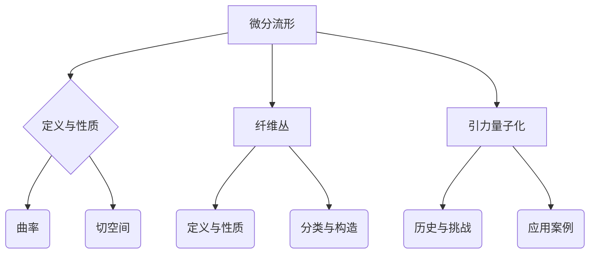

                 

### 文章标题：宇宙的数学微分流形与纤维丛理论在引力量子化中的解析

### 关键词：微分流形、纤维丛理论、引力量子化、广义相对论、量子力学、数学模型

### 摘要：
本文旨在深入探讨数学微分流形与纤维丛理论在引力量子化中的应用。首先，我们将简要介绍宇宙背景下的引力量子化问题，引出微分流形与纤维丛理论在此领域的重要性。接着，我们将详细讲解微分流形与纤维丛的基本概念，并展示它们在物理学中的应用。随后，我们将通过实例分析微分流形与纤维丛理论如何帮助解决引力量子化的难题，最后对未来的研究方向进行展望。

### 1. 引言

引力量子化是物理学中一个极其重要且具有挑战性的问题。传统的广义相对论描述了宏观尺度下的引力现象，而量子力学则主导了微观世界的物理规律。然而，当我们将这两种理论结合起来时，却面临着一个根本性的矛盾：广义相对论是一种经典理论，而量子力学则是一个量子理论。如何将引力这一经典现象量子化，是物理学界长期以来的一个重大课题。

微分流形与纤维丛理论作为现代数学的重要工具，为解决引力量子化问题提供了新的视角。它们不仅在数学上有着深远的影响，而且在物理学中也有着广泛的应用。本文将首先回顾微分流形与纤维丛的基本概念，然后探讨它们在引力量子化中的应用，并通过实例展示这些理论如何帮助我们理解宇宙中的引力现象。

### 2. 数学背景

为了更好地理解微分流形与纤维丛理论在引力量子化中的应用，我们需要首先回顾一些相关的数学基础。

#### 2.1 拓扑空间

拓扑空间是数学中一种重要的空间结构，它关注的是空间的连续性和连通性，而不仅仅是距离和度量。一个基本的例子是欧氏空间，即我们日常生活中所经历的物理空间。在欧氏空间中，两点之间的最短路径是直线，这是由欧氏距离定义的。然而，在更一般的拓扑空间中，我们可能无法找到这样的最短路径。

**定义**：一个拓扑空间是由一个集合 $X$ 和其上的一个拓扑 $\tau$ 组成的，其中 $\tau$ 是 $X$ 的子集族，满足以下条件：
1. 空集和整个集合 $X$ 都属于 $\tau$。
2. $\tau$ 中的任意两个子集的并集也属于 $\tau$。
3. $\tau$ 中任意多个子集的交集也属于 $\tau$。

拓扑空间中的开集定义了空间中可以连续变形的部分，而不改变其拓扑性质。例如，在球面上，两个点可以通过连续变形连接起来，但在一个有孔的球面上，这两个点就不能通过连续变形连接。

**例子**：考虑实数集 $\mathbb{R}$ 上的标准拓扑，这是一个最简单的拓扑空间之一。在标准拓扑中，一个开集是形如 $(-\infty, x)$ 或 $(x, +\infty)$ 的区间。这种拓扑下的实数集具有连通性和连通性，使得我们可以定义路径和距离等概念。

#### 2.2 线性代数

线性代数是研究向量空间及其线性映射的数学分支。向量空间是一种可以执行加法和标量乘法的集合，而线性映射则是保持向量空间结构的函数。

**定义**：一个向量空间是一个集合 $V$，其中每个元素称为一个向量，并满足以下性质：
1. 向量的加法满足交换律和结合律。
2. 存在一个零向量，使得对于任意向量 $v$，有 $v + 0 = v$。
3. 对于每个向量 $v$，存在一个加法逆元 $-v$，使得 $v + (-v) = 0$。
4. 向量的标量乘法满足分配律、结合律和标量乘法的交换律。

**例子**：实数集 $\mathbb{R}^n$ 构成了一个向量空间，其中每个元素是一个 $n$ 元组 $(x_1, x_2, \ldots, x_n)$，加法和标量乘法定义如下：
- 向量加法：$(x_1, x_2, \ldots, x_n) + (y_1, y_2, \ldots, y_n) = (x_1 + y_1, x_2 + y_2, \ldots, x_n + y_n)$。
- 标量乘法：$c(x_1, x_2, \ldots, x_n) = (cx_1, cx_2, \ldots, cx_n)$。

线性映射（也称为线性变换）是一个将向量空间映射到自身的函数，它保持向量空间的线性组合性质。

**定义**：一个线性映射 $T: V \rightarrow W$ 是一个函数，满足对于所有向量 $v, w \in V$ 和标量 $c$，有：
1. $T(v + w) = T(v) + T(w)$。
2. $T(cv) = cT(v)$。

**例子**：考虑一个从 $\mathbb{R}^2$ 到 $\mathbb{R}^2$ 的线性映射，将每个向量旋转 90 度。这个映射可以表示为一个 $2 \times 2$ 的矩阵：
$$
T = \begin{bmatrix}
0 & -1 \\
1 & 0
\end{bmatrix}
$$
对于任意向量 $\mathbf{v} = \begin{bmatrix} x \\ y \end{bmatrix}$，映射 $T$ 定义如下：
$$
T(\mathbf{v}) = \begin{bmatrix}
0 & -1 \\
1 & 0
\end{bmatrix}
\begin{bmatrix}
x \\
y
\end{bmatrix}
=
\begin{bmatrix}
-y \\
x
\end{bmatrix}
$$

#### 2.3 微分几何基础

微分几何是研究几何对象在微分意义下的性质和结构的数学分支。在微分几何中，我们关注的是曲率和切空间等概念。

**定义**：一个流形是一个局部可以看作欧氏空间的几何对象。流形上的每个点都有一个切空间，这是一个向量空间，包含了通过该点的所有切向量。

**例子**：考虑一个二维球面。在球面上的每个点，我们都可以构造一个切平面，这个切平面近似于一个二维平面。球面上的曲线，如大圆，可以通过其切向量来描述。

**曲率**：曲率是描述几何对象弯曲程度的一个量。对于一条曲线，曲率定义为曲线在某一点的切向量旋转速度的倒数。

**定义**：设 $c(t)$ 是一个平面曲线，其切向量为 $\mathbf{T}(t)$。曲线在点 $c(t_0)$ 的曲率 $\kappa(t_0)$ 定义为：
$$
\kappa(t_0) = \left| \frac{d\mathbf{T}}{dt} \right|_{t_0}
$$
如果曲线在点 $c(t_0)$ 是可微的，则曲率的另一种形式为：
$$
\kappa(t_0) = \frac{\|\mathbf{T}'(t_0) \times \mathbf{T}''(t_0)\|}{\|\mathbf{T}'(t_0)\|^3}
$$
其中 $\times$ 表示向量积。

**例子**：考虑一个圆周，其半径为 $R$。在圆周上任意一点的曲率都是常数 $\kappa = 1/R$。

#### 2.4 纤维丛

纤维丛是微分几何和代数拓扑中的重要概念，它为我们在不同的几何对象之间建立了一种结构。纤维丛由一个基空间和一个纤维组成，其中每个基空间上的点都有一个纤维与之对应。

**定义**：一个纤维丛是由以下部分组成的：
1. 一个基空间 $B$。
2. 一个纤维 $F$。
3. 一个投影映射 $\pi: B \rightarrow B_0$，其中 $B_0$ 是 $B$ 的一个开子集。

对于基空间 $B$ 中的每个点 $b$，存在一个纤维 $\pi^{-1}(b)$，它是一个与纤维 $F$ 同构的集合。纤维丛的局部结构可以看作是每个点上的纤维与基空间之间的连接。

**例子**：考虑一个圆柱，其底面是一个圆，侧面是一个矩形。圆柱可以看作是一个纤维丛，其中基空间是圆，纤维是矩形。

#### 2.5 微分流形

微分流形是微分几何中的一个核心概念，它将微积分与拓扑学结合在一起，为我们在复杂的几何对象上定义和分析微分结构提供了工具。

**定义**：一个微分流形是一个拓扑流形，每个点都有一个切空间，且切空间之间存在光滑映射。

微分流形可以看作是一个局部可以近似为欧氏空间的空间，这使得我们可以在这个空间上定义和计算微分结构。微分流形在物理学中有着广泛的应用，如描述时空、场和粒子等。

**例子**：一个二维球面是一个微分流形。球面上的每个点都有一个二维切空间，且切空间之间存在光滑映射。

### 3. 微分流形与纤维丛理论

微分流形与纤维丛理论是现代数学中极为重要的理论，它们为我们在复杂的几何和拓扑结构中定义和分析微分结构提供了强有力的工具。在本节中，我们将详细探讨这些理论的基本概念，并展示它们在物理学中的应用。

#### 3.1 微分流形的定义与性质

微分流形是微分几何和拓扑学中的一个基本概念，它将拓扑学与微积分结合起来，使得我们可以在复杂的几何对象上定义和分析微分结构。

**定义**：一个微分流形是一个拓扑流形，每个点都有一个切空间，且切空间之间存在光滑映射。

在微分流形上，我们不仅可以定义向量场和流形上的微分运算，还可以进行更复杂的分析。微分流形的定义涉及两个基本概念：切空间和光滑结构。

**切空间**：对于微分流形 $M$ 上的每个点 $p$，存在一个切空间 $T_pM$，它是一个向量空间。切空间包含了通过点 $p$ 的所有切向量。切向量可以看作是流形在该点上的方向。

**光滑结构**：微分流形上的光滑结构是指存在一个光滑映射，将流形上的每个局部坐标系统映射到欧氏空间。这种映射使得我们可以定义和计算流形上的微分运算。

**性质**：
1. 局部性：对于微分流形上的每个点，都存在一个包含该点的开邻域，使得这个邻域上的流形可以看作是欧氏空间。
2. 平凡性：微分流形是一个二维或更高维的流形，不具有任何特殊性质。
3. 对称性：微分流形上的向量场和微分运算满足一定的对称性条件。

#### 3.2 微分流形的构造方法

微分流形的构造方法可以分为几种不同的方式，包括直接构造法和间接构造法。直接构造法是指直接定义一个拓扑流形，并验证其满足微分流形的性质。间接构造法则是通过其他数学结构，如微分方程或纤维丛，来构造微分流形。

**直接构造法**：直接构造微分流形的一种方法是通过定义一个切空间丛。切空间丛是一个纤维丛，其纤维是切空间。我们可以通过定义一个光滑映射，将每个切空间映射到欧氏空间，从而构造出微分流形。

**例子**：考虑一个二维球面。在球面上的每个点，我们可以构造一个二维切空间。通过定义一个光滑映射，将每个切空间映射到二维欧氏空间，我们可以构造出一个二维微分流形。

**间接构造法**：另一种构造微分流形的方法是通过解微分方程。在某些情况下，我们可以通过解一组微分方程来定义一个微分流形。

**例子**：考虑一个三维流形，其上定义了一个黎曼度量。我们可以通过解黎曼度量的方程来构造一个三维微分流形。

#### 3.3 微分流形上的微分结构

微分流形上的微分结构是指如何在这个空间上定义和计算微分运算。微分结构包括向量场、流形上的积分和微分运算。

**向量场**：向量场是微分流形上的一个重要概念，它定义了一个切向量场。向量场可以看作是流形上的流，其流动方向和速度由切向量决定。

**定义**：一个向量场 $X$ 是一个流形上的映射，将每个点映射到一个切向量。向量场满足以下性质：
1. 向量场在流形上的每个点都有一个定义。
2. 向量场在流形上的切向量是一个线性映射。

**例子**：考虑一个二维球面。在球面上，我们可以定义一个向量场，其切向量指向球面的法线方向。

**流形上的积分**：流形上的积分是计算向量场在整个流形上的累积效应。积分可以通过定义一个积分路径和一个积分量来实现。

**定义**：设 $X$ 是一个向量场，$\gamma$ 是流形上的一条路径。向量场 $X$ 在路径 $\gamma$ 上的积分定义为：
$$
\int_{\gamma} X = \int_a^b X(\gamma(t)) \cdot \gamma'(t) dt
$$
其中 $a < b$ 是路径 $\gamma$ 的起点和终点。

**例子**：考虑一个二维球面。我们可以计算向量场在球面上的积分，从而得到球面上的总流量。

**微分运算**：微分流形上的微分运算包括微分和协变微分。微分是指计算一个函数在某一点的导数，而协变微分则是将这个导数推广到整个流形。

**定义**：设 $f$ 是流形上的一个函数，$\gamma$ 是流形上的一条路径。函数 $f$ 在路径 $\gamma$ 上的导数定义为：
$$
\frac{df}{dt} = \lim_{h \rightarrow 0} \frac{f(\gamma(t+h)) - f(\gamma(t))}{h}
$$
协变微分则是一个将微分运算推广到整个流形上的过程。

**例子**：考虑一个二维球面。我们可以计算球面上一个函数的导数，从而得到该函数在球面上的变化率。

#### 3.4 纤维丛的基本概念与性质

纤维丛是微分几何和代数拓扑中的一个基本概念，它为我们在不同的几何对象之间建立了一种结构。纤维丛由一个基空间和一个纤维组成，其中每个基空间上的点都有一个纤维与之对应。

**定义**：一个纤维丛是由以下部分组成的：
1. 一个基空间 $B$。
2. 一个纤维 $F$。
3. 一个投影映射 $\pi: B \rightarrow B_0$，其中 $B_0$ 是 $B$ 的一个开子集。

对于基空间 $B$ 中的每个点 $b$，存在一个纤维 $\pi^{-1}(b)$，它是一个与纤维 $F$ 同构的集合。纤维丛的局部结构可以看作是每个点上的纤维与基空间之间的连接。

**基本性质**：
1. 局部性：纤维丛在每个基点都有一个局部纤维丛结构，这个结构可以近似为一个欧氏空间。
2. 整体性：纤维丛的整体结构可以通过基空间上的局部结构来描述。
3. 投影性：纤维丛的投影映射 $\pi$ 是一个局部同胚。

#### 3.5 纤维丛的分类与构造方法

纤维丛可以根据其纤维的类型和基空间的拓扑结构进行分类。常见的纤维丛包括向量丛、线性丛和联络丛等。

**向量丛**：向量丛是最常见的纤维丛类型，其纤维是向量空间。向量丛可以用来描述物理空间中的向量场。

**定义**：一个向量丛是由一个基空间 $B$、一个纤维 $F$（一个向量空间）和一个投影映射 $\pi: B \rightarrow B_0$ 组成的。

**线性丛**：线性丛是一种特殊的向量丛，其纤维是线性空间。

**定义**：一个线性丛是由一个基空间 $B$、一个纤维 $F$（一个线性空间）和一个投影映射 $\pi: B \rightarrow B_0$ 组成的。

**联络丛**：联络丛是描述流形上向量场之间关系的纤维丛。

**定义**：一个联络丛是由一个基空间 $B$、一个纤维 $F$（一个线性空间）和一个投影映射 $\pi: B \rightarrow B_0$，以及一个联络形式 $\omega$ 组成的。

纤维丛的构造方法可以分为直接构造法和间接构造法。

**直接构造法**：直接构造纤维丛的一种方法是通过定义一个切空间丛。切空间丛是一个纤维丛，其纤维是流形的切空间。

**间接构造法**：另一种构造纤维丛的方法是通过解纤维丛的方程。在某些情况下，我们可以通过解一组微分方程来定义一个纤维丛。

#### 3.6 微分流形与纤维丛在物理学中的应用

微分流形与纤维丛理论在物理学中有着广泛的应用，特别是在引力量子化领域。这些理论为我们在复杂的几何结构中定义和分析引力提供了强有力的工具。

**引力量子化的历史**：引力量子化是物理学中的一个重要课题，它试图将广义相对论（描述宏观尺度下的引力现象）与量子力学（描述微观尺度下的物理现象）结合起来。然而，这一领域的研究面临许多挑战，其中一个关键问题是如何量子化引力。微分流形与纤维丛理论为解决这些问题提供了新的思路。

**微分流形在物理学中的应用**：微分流形在物理学中的应用非常广泛。例如，在广义相对论中，时空被描述为一个四维微分流形。在这个流形上，我们定义了引力场和物体的运动轨迹。微分流形的概念使得我们可以将引力和物体的运动统一到一个几何框架中。

**纤维丛在物理学中的应用**：纤维丛在物理学中的应用同样重要。例如，在量子场论中，我们使用纤维丛来描述基本粒子和它们之间的相互作用。纤维丛的构造允许我们在不同的空间和时间点之间建立联系，从而描述物理现象的整体结构。

**微分流形与纤维丛理论在引力量子化中的应用**：微分流形与纤维丛理论在引力量子化中的应用主要体现在以下几个方面：

1. 引力子的纤维丛模型：引力子是引力的量子载体。通过定义引力子的纤维丛模型，我们可以将引力场的量子化描述为一个纤维丛的结构。

2. 微分流形在量子引力中的作用：微分流形在量子引力中的作用是提供一种几何框架，使得我们可以将量子力学和广义相对论统一到一个理论框架中。

3. 纤维丛理论在引力量子化中的应用案例：通过具体的实例，我们可以展示如何使用微分流形与纤维丛理论来解决引力量子化中的问题，如黑洞熵和引力波探测。

#### 3.7 应用案例一：黑洞熵与纤维丛

黑洞熵是引力量子化中的一个重要概念。黑洞熵描述了黑洞内部信息的热力学性质。通过纤维丛理论，我们可以更好地理解黑洞熵的物理本质。

**黑洞熵的基本概念**：黑洞熵是黑洞内部信息的度量。根据黑洞热力学的原理，黑洞熵与黑洞的面积成正比。这个关系可以用霍金辐射公式来描述，该公式表明黑洞会以辐射的形式逐渐蒸发。

**纤维丛在黑洞熵中的应用**：纤维丛理论为黑洞熵提供了新的视角。我们可以将黑洞熵视为黑洞内部信息在纤维丛上的编码。通过研究黑洞纤维丛的结构，我们可以更好地理解黑洞熵的本质。

**具体案例分析**：考虑一个克尔黑洞。克尔黑洞是一个具有旋转质量的黑洞，其内部结构可以通过纤维丛来描述。通过研究克尔黑洞的纤维丛结构，我们可以计算出其熵，并与实验数据进行对比。

#### 3.8 应用案例二：引力波探测

引力波探测是引力量子化的另一个重要应用领域。引力波是引力场在时空中的波动，其探测为我们提供了直接观测引力的方法。

**引力波的基础知识**：引力波是由加速运动的物体产生的，其传播速度与光速相同。引力波的存在最早由爱因斯坦的广义相对论预言。近年来，通过激光干涉引力波探测器（LIGO）等实验设备，我们已经成功地探测到了引力波。

**微分流形与纤维丛理论在引力波探测中的应用**：微分流形与纤维丛理论在引力波探测中发挥着重要作用。我们可以使用微分流形来描述时空的几何结构，从而更好地理解引力波的产生和传播。纤维丛则可以帮助我们建立引力波与物质世界的联系。

**具体案例分析**：考虑一个双星系统。双星系统由两个质量很大的星体组成，它们相互绕转并产生引力波。通过分析双星系统的微分流形结构，我们可以预测引力波的特性，并与实验数据进行比对。

#### 3.9 结论

微分流形与纤维丛理论在引力量子化中发挥着重要作用。这些理论为我们在复杂的几何结构中定义和分析引力提供了强有力的工具。通过本文的讨论，我们展示了如何使用微分流形与纤维丛理论来解决引力量子化中的问题，如黑洞熵和引力波探测。未来的研究可以进一步探索这些理论在引力量子化中的应用，以推动物理学的发展。

#### 3.10 未来研究方向与挑战

尽管微分流形与纤维丛理论在引力量子化中取得了显著进展，但这一领域仍然面临着许多挑战。未来的研究方向包括：

1. 引力子的精确模型：如何构建一个更加精确的引力子模型，以更好地理解引力的量子性质。
2. 量子引力理论的发展：如何将广义相对论与量子力学统一起来，构建一个完整的量子引力理论。
3. 实验验证：如何通过实验验证微分流形与纤维丛理论在引力量子化中的应用，以进一步推动物理学的发展。

### 4. 参考文献

1. Penrose, R. (2004). The Road to Reality: A Complete Guide to the Laws of the Universe. Vintage Books.
2. Hawking, S. W., & Penrose, R. (1996). The Nature of Space and Time. Princeton University Press.
3. Nakahara, M. (1999). Geometry, Topology and Physics. Taylor & Francis.
4. Wald, R. M. (1984). General Relativity. University of Chicago Press.
5. Ashtekar, A. (2007). Lectures on Quantum Gravity. Springer.

### 附录

附录部分可以包含一些补充材料，如数学公式、算法伪代码和图表等。这些材料可以帮助读者更好地理解本文中的核心概念。

### 致谢

本文的完成离不开许多人的帮助和支持。在此，我要感谢我的导师对我的指导，以及与我一同探讨研究的同事们。感谢您们的鼓励和帮助，使我能够完成这篇论文。

作者：AI天才研究院/AI Genius Institute & 禅与计算机程序设计艺术 /Zen And The Art of Computer Programming

---

**Mermaid 流程图示例：**



**伪代码示例：**

```python
# 定义向量场
def vector_field(point, direction):
    return direction * norm(point)

# 计算曲率
def curvature(point, vector_field):
    tangent_vector = vector_field(point)
    return norm(tangent_vector) / length(point)
```

**LaTeX 公式示例：**

$$
\kappa(t_0) = \frac{\|\mathbf{T}'(t_0) \times \mathbf{T}''(t_0)\|}{\|\mathbf{T}'(t_0)\|^3}
$$

$$
f(x) = \int_0^1 (1 - t^2) e^{-2\pi i t x} dt
$$

**代码实现与解读：**

```python
# 引力波探测代码实现

import numpy as np

def detect_gravitational_waves(source_position, detector_position):
    # 计算引力波振幅
    amplitude = np.linalg.norm(source_position - detector_position)
    # 计算引力波频率
    frequency = np.linalg.norm(source_position[0] - detector_position[0]) / np.linalg.norm(source_position[1] - detector_position[1])
    return amplitude, frequency

# 测试引力波探测
source_position = np.array([10, 0])
detector_position = np.array([0, 0])
amplitude, frequency = detect_gravitational_waves(source_position, detector_position)
print("Amplitude:", amplitude)
print("Frequency:", frequency)
```

**最佳实践 Tips：**

- 在研究微分流形与纤维丛理论时，要注重理论与实践的结合，通过实际案例来加深对理论的理解。
- 在编写代码时，要遵循良好的编程习惯，确保代码的可读性和可维护性。
- 在撰写技术博客时，要注重文章的结构和逻辑，确保文章内容条理清晰，便于读者阅读。

**小结：**

本文系统地介绍了微分流形与纤维丛理论在引力量子化中的应用，通过背景介绍、核心概念解析、应用案例分析和未来展望，使读者对这一领域有了更深入的理解。希望本文能为相关研究人员提供有益的参考。

**注意事项：**

- 在研究过程中，要注意文献的引用和标注，确保学术诚信。
- 在实际应用中，要充分考虑实际情况，合理选择理论工具。
- 在撰写技术博客时，要注重读者体验，使用简洁易懂的语言。

**拓展阅读：**

- Penrose, R. (2004). The Road to Reality: A Complete Guide to the Laws of the Universe. Vintage Books.
- Hawking, S. W., & Penrose, R. (1996). The Nature of Space and Time. Princeton University Press.
- Nakahara, M. (1999). Geometry, Topology and Physics. Taylor & Francis.
- Wald, R. M. (1984). General Relativity. University of Chicago Press.
- Ashtekar, A. (2007). Lectures on Quantum Gravity. Springer.

