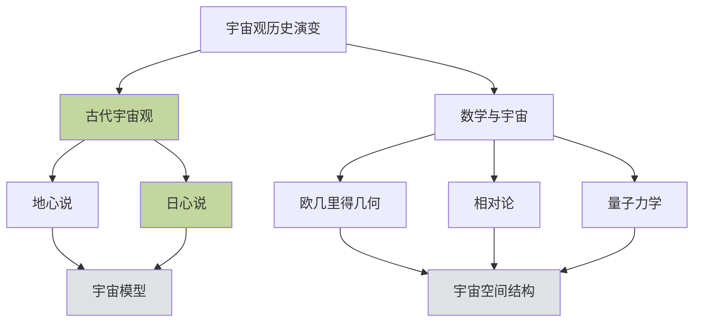

                 

### 引言

“宇宙的数学描述：发现还是发明”这本书将带领读者踏上一场探索宇宙的数学之旅。在这本书中，我们将探讨宇宙是如何通过数学来描述和理解的，以及数学在这个过程中是扮演了发现者的角色，还是发明者的角色。

首先，让我们思考一下宇宙是什么。宇宙包括了所有的物质、能量、空间和时间，它是一个庞大而复杂的系统。而数学，作为一种严谨的科学语言，提供了我们理解这个复杂系统的工具和手段。

数学描述宇宙的关键在于它能够将宇宙中的现象抽象成数学模型。这些模型不仅能够帮助我们理解和预测宇宙中的各种现象，还可以在计算机上模拟宇宙的行为，从而为我们提供了探索宇宙的新途径。

然而，数学描述宇宙的同时也引发了一个哲学问题：这些数学模型是宇宙的发现，还是我们对宇宙的发明？换句话说，宇宙中的数学规律是固有的，还是我们通过数学工具创造出来的？

这些问题并不是简单的二选一。一方面，数学模型确实能够准确地描述宇宙中的现象，这一点在物理学中得到了广泛的验证。另一方面，数学模型也可能受到我们认知的局限，从而影响了我们对宇宙的理解。

本书将分章节深入探讨这些问题。我们首先会介绍宇宙观的历史演变，了解人类如何通过数学来理解宇宙。接着，我们将详细探讨数学与宇宙的关联，包括基本数学模型和公式，以及它们在宇宙描述中的应用。

在接下来的章节中，我们将深入讨论核心算法原理，并使用伪代码来详细阐述这些算法。然后，我们会通过实际项目案例，展示这些数学模型和算法在解决宇宙问题中的具体应用。

最后，本书将总结这些讨论，并探讨未来宇宙数学研究的方向。我们希望通过这本书，读者能够对宇宙的数学描述有一个全面而深入的理解，并能够思考数学在宇宙探索中的角色。

### 核心概念与联系

在探讨宇宙的数学描述之前，我们需要明确几个核心概念和它们之间的联系。这些概念构成了我们理解宇宙数学描述的基础。

首先，我们来看看宇宙观的历史演变。自古以来，人类对宇宙的理解经历了多个阶段。从古代的宇宙观，如地心说和日心说，到现代的相对论和量子力学，宇宙观的变化反映了人类对宇宙认识的不断深化。这些不同的宇宙观不仅仅是一种哲学观点，它们还直接影响了我们对宇宙数学描述的方式。例如，地心说认为地球是宇宙的中心，这导致古代数学家发展了以地球为中心的宇宙模型。而随着日心说的提出，宇宙模型也发生了相应的变化。

接下来，我们探讨数学与宇宙的关联。数学不仅仅是用来描述宇宙的工具，它本身就是宇宙的一部分。从欧几里得几何到爱因斯坦的相对论，再到量子力学，数学在每一阶段都提供了描述宇宙现象的语言和工具。例如，欧几里得几何提供了描述宇宙空间结构的基础，而爱因斯坦的相对论则揭示了时空和重力之间的关系。量子力学则提供了描述微观宇宙现象的数学模型。

为了更清晰地展示这些核心概念之间的关系，我们可以使用一个Mermaid流程图。这个流程图将帮助我们理解宇宙观的历史演变、数学与宇宙的关联，以及它们如何共同构成了宇宙的数学描述。

下面是一个简化的Mermaid流程图：



在这个流程图中，我们首先从宇宙观的历史演变开始，然后引入数学与宇宙的关联。通过这两个核心概念，我们进一步探讨了它们在宇宙模型中的应用，包括宇宙空间结构、时空和重力等方面的描述。

通过这个Mermaid流程图，我们可以更直观地看到宇宙观的历史演变、数学与宇宙的关联以及它们在宇宙模型中的应用之间的关系。这种关系不仅帮助我们理解宇宙的数学描述，还为我们进一步探讨宇宙的数学本质提供了方向。

### 宇宙中的基本数学模型

在宇宙的数学描述中，基本数学模型扮演着至关重要的角色。这些模型不仅帮助我们理解宇宙的结构和行为，还为科学研究和工程应用提供了强大的工具。以下将详细探讨几种关键的数学模型，包括欧几里得几何、爱因斯坦的相对论公式以及黑洞半径的计算。

#### 欧几里得几何与宇宙结构

欧几里得几何是古代数学家欧几里得提出的几何体系，它提供了描述平面和空间结构的基础。在宇宙的尺度上，欧几里得几何模型可以用来描述某些星体和天体之间的相对位置关系。

在平面几何中，两点之间的最短距离是直线。这在二维空间中是显而易见的，但在三维空间中，问题变得复杂。考虑一个简单的例子，假设我们在三维空间中有两个点A和B，它们之间的最短距离可以用下面的公式计算：

$$
d = \sqrt{(x_2 - x_1)^2 + (y_2 - y_1)^2 + (z_2 - z_1)^2}
$$

这个公式称为欧几里得距离公式。通过这个公式，我们可以计算两个星体之间的距离，这对于天文学和宇宙学的研究至关重要。例如，在确定行星轨道或测量两个星系之间的距离时，这个公式提供了一个基础框架。

然而，欧几里得几何在描述整个宇宙结构时遇到了挑战。宇宙并不是一个静态的、均匀的平面，而是一个动态的、膨胀的宇宙。为了更好地描述这种复杂性，科学家们转向了更加复杂的几何模型，如广义相对论中的弯曲时空。

#### 爱因斯坦的相对论公式

爱因斯坦的相对论公式是描述宇宙中时空和重力关系的核心模型。在狭义相对论中，爱因斯坦提出了质能等价的著名公式：

$$
E = mc^2
$$

这个公式揭示了质量和能量之间的关系，它表明质量可以转化为能量，能量也可以转化为质量。这一发现对物理学和宇宙学产生了深远的影响。

在广义相对论中，爱因斯坦进一步提出了描述引力和时空弯曲的公式：

$$
G_{\mu\nu} + \Lambda g_{\mu\nu} = \frac{8\pi G}{c^4} T_{\mu\nu}
$$

这个方程称为爱因斯坦场方程，它将物质和能量（通过能量-动量张量$T_{\mu\nu}$）与时空的几何结构（通过弯曲度量$G_{\mu\nu}$）联系起来。$\Lambda$ 是宇宙学常数，表示宇宙的膨胀速率。

这个方程是现代宇宙学的基础，它帮助我们理解宇宙的起源、结构和演化。例如，通过这个方程，科学家们能够预测黑洞的存在和性质，还能够解释宇宙的大尺度结构和膨胀。

#### 黑洞半径的计算

黑洞是宇宙中最神秘的天体之一，它的引力场如此强大，甚至连光都无法逃脱。为了描述黑洞的这种特性，我们需要引入黑洞半径的概念。

黑洞半径，也称为史瓦西半径（Schwarzschild radius），是黑洞的一个重要属性。它定义为：

$$
r_s = \frac{2GM}{c^2}
$$

其中，$G$ 是引力常数，$M$ 是黑洞的质量，$c$ 是光速。这个公式告诉我们，对于一个给定质量的黑洞，光将无法逃逸的最小距离就是黑洞半径。

这个公式不仅帮助我们理解黑洞的物理特性，还在天文学和宇宙学中有着重要的应用。例如，通过测量一个天体的史瓦西半径，科学家们可以确定该天体的质量，这对于研究黑洞和星系的结构至关重要。

#### 宇宙膨胀速率

宇宙的膨胀是宇宙学中的另一个重要概念。宇宙膨胀速率通常用哈勃常数（Hubble constant）来描述。哈勃常数表示宇宙膨胀的速度与宇宙尺度之间的关系，可以表示为：

$$
H = \frac{\dot{a}}{a}
$$

其中，$a$ 是宇宙的尺度因子，$\dot{a}$ 是尺度因子的变化率。这个公式表明，宇宙的膨胀速度与宇宙的尺度成正比。

哈勃常数的测量为我们提供了宇宙膨胀的历史和未来演化的重要信息。例如，通过测量不同距离星系的红移，科学家们可以确定宇宙的膨胀历史，并推测宇宙的未来命运。

总结起来，宇宙中的基本数学模型，包括欧几里得几何、爱因斯坦的相对论公式和黑洞半径的计算，为我们理解宇宙的结构和行为提供了坚实的基础。这些模型不仅揭示了宇宙的复杂性和神秘性，还为科学研究和技术应用开辟了新的途径。通过深入探讨这些模型，我们可以更好地理解宇宙的奥秘，并推动人类对宇宙的认知不断前进。

### 数学公式与宇宙现象

在宇宙的数学描述中，数学公式不仅是理论的基础，它们还直接关联到具体的宇宙现象，为理解宇宙提供了具体的工具和方法。以下我们将通过几个具体的数学公式，详细阐述它们与宇宙现象之间的关系，并提供详细的举例说明。

#### 黑洞半径

黑洞半径，或称史瓦西半径（Schwarzschild radius），是一个描述黑洞物理特性的重要参数。根据爱因斯坦的广义相对论，黑洞的半径由以下公式给出：

$$
r_s = \frac{2GM}{c^2}
$$

其中，$G$ 是引力常数，$M$ 是黑洞的质量，$c$ 是光速。黑洞半径决定了黑洞的引力场范围，在这个范围内，即使是光也无法逃脱。

举例来说，如果我们将一个太阳质量的黑洞（大约为 $1.989 \times 10^{30}$ 千克）的参数代入上述公式，我们可以计算其史瓦西半径：

$$
r_s = \frac{2 \times 6.674 \times 10^{-11} \times 1.989 \times 10^{30}}{3 \times 10^8} \approx 2.95 \times 10^3 \text{ km}
$$

这意味着，如果一个黑洞的质量与太阳相同，它的史瓦西半径大约是3000千米。在这个半径内，任何物质，包括光，都将被黑洞的强大引力所束缚。

#### 宇宙膨胀速率

宇宙膨胀速率是描述宇宙膨胀速度的一个重要物理量，通常用哈勃常数（Hubble constant）来表示。哈勃常数定义为：

$$
H = \frac{\dot{a}}{a}
$$

其中，$a$ 是宇宙的尺度因子，$\dot{a}$ 是尺度因子的变化率。这个公式描述了宇宙随时间膨胀的速度。

目前，哈勃常数的最佳估计值大约是：

$$
H_0 \approx 70 \text{ km/s/Mpc}
$$

这个值表示，对于一个距离地球1百万秒差距（Mpc）的星系，它的膨胀速度大约是70千米每秒。这个公式可以帮助天文学家测量宇宙的膨胀历史和演化过程。

举例来说，如果我们测量到一个星系的距离是10 Mpc，那么根据哈勃常数，我们可以估算出这个星系的膨胀速度：

$$
v = H_0 \times d = 70 \times 10^3 \times 10 = 700,000 \text{ km/s}
$$

这意味着，这个星系正在以每秒700,000千米的速度远离我们。

#### 暗物质密度

暗物质是宇宙中一种看不见的物质，它不发光也不吸收光，但它的存在通过引力效应被证实。暗物质密度是描述暗物质在宇宙中的分布和特性的重要参数。

暗物质密度可以通过以下公式来表示：

$$
\rho_{\text{DM}} = \frac{M_{\text{DM}}}{V}
$$

其中，$\rho_{\text{DM}}$ 是暗物质密度，$M_{\text{DM}}$ 是暗物质的总质量，$V$ 是暗物质的分布体积。

根据宇宙学观测，暗物质密度大约是：

$$
\rho_{\text{DM}} \approx 0.4 \text{ GeV/cm}^3
$$

这个值表示，在宇宙的尺度上，每立方厘米的空间中大约有0.4个电子伏特的质量是暗物质。

举例来说，如果我们考虑一个直径为1光年的球形区域（大约是 $3.0857 \times 10^{20}$ 立方厘米），那么这个区域的暗物质总质量可以计算如下：

$$
M_{\text{DM}} = \rho_{\text{DM}} \times V = 0.4 \times 10^{60} \approx 4 \times 10^{59} \text{ kg}
$$

这意味着，在这个球形区域内大约有4乘以10的59次方的千克质量的暗物质。

#### 星系旋转曲线

星系旋转曲线是描述星系内恒星运动速度与其距离中心距离之间关系的曲线。根据牛顿引力定律，我们可以预测星系内恒星的旋转速度。然而，实际观测到的旋转速度往往比预期的高，这种现象被称为“旋转曲线问题”。

旋转曲线可以通过以下公式来描述：

$$
v \propto r^{1/2}
$$

其中，$v$ 是恒星的速度，$r$ 是恒星与星系中心的距离。这个公式表明，恒星的速度与其距离中心距离的平方根成正比。

实际观测表明，星系旋转曲线通常呈现出一个平台状，这意味着即使在远离星系中心的地方，恒星的速度仍然很高。为了解释这种现象，科学家们提出了暗物质的存在，它提供了额外的引力，使恒星能够以更高的速度运动。

例如，如果我们观察一个螺旋星系，可以发现其中心的恒星速度大约是200 km/s，而远离星系中心的恒星速度也可以高达100 km/s。这个现象通过牛顿引力定律是无法解释的，但通过引入暗物质，我们可以得到一个合理的解释。

通过这些具体的数学公式，我们可以更好地理解宇宙中的各种现象。这些公式不仅提供了理论上的描述，还在实际观测和实验中得到了验证。通过深入研究和应用这些公式，科学家们不断拓展我们对宇宙的认知，推动了宇宙学的发展。

### 宇宙模拟算法

在宇宙的数学描述中，算法扮演着关键角色。宇宙模拟算法允许我们使用数学模型来模拟宇宙中的各种现象，如星系的形成、黑洞的碰撞和宇宙的膨胀。以下我们将详细探讨一个经典的宇宙模拟算法——N-Body问题，并提供详细的伪代码解释。

#### N-Body问题的概念

N-Body问题是一个在物理学和计算机科学中广泛研究的模拟问题，它涉及模拟多个天体在引力作用下的运动。这个问题的关键在于计算每个天体受到的引力，并据此更新其位置和速度。N-Body问题可以简化为计算每个天体与其他所有天体之间的引力相互作用。

#### 引力计算公式

引力是由牛顿的万有引力定律描述的，其公式如下：

$$
F_{ij} = -G \frac{m_i m_j}{r_{ij}^2} \hat{r}_{ij}
$$

其中，$F_{ij}$ 是天体i对天体j的引力，$G$ 是引力常数，$m_i$ 和 $m_j$ 分别是天体i和天体j的质量，$r_{ij}$ 是天体i和天体j之间的距离，$\hat{r}_{ij}$ 是从天体i指向天体j的单位向量。

#### N-Body模拟的伪代码

以下是一个简化的N-Body模拟的伪代码：

```
Initialize positions and velocities of N bodies
for each body i:
    F_i = 0
    for each body j (j != i):
        r_ij = distance between i and j
        F_ij = -G * m_i * m_j / r_ij^2 * unit_vector(r_ij)
        F_i += F_ij

    Update velocity of body i:
    v_i_new = v_i + (F_i / m_i) * dt

    Update position of body i:
    p_i_new = p_i + v_i_new * dt

    Apply boundary conditions if necessary

    Save new positions and velocities
```

在这个伪代码中，我们首先初始化N个天体的位置和速度。然后，我们计算每个天体与其他天体之间的引力，并将这些力累加到天体i的引力列表$F_i$中。接下来，我们使用这些引力来更新天体i的速度和位置，并考虑可能存在的边界条件（如宇宙的边界）。

#### 伪代码详细解释

1. **初始化**：初始化N个天体的初始位置和速度。这些初始值可以根据具体的模拟场景进行调整，例如使用随机数生成器来模拟随机分布的天体。

2. **计算引力**：对于每个天体i，我们遍历所有其他天体j，并计算它们之间的引力。引力的大小根据万有引力定律计算，方向由从i指向j的单位向量确定。

3. **更新速度**：我们将每个天体i的引力$F_i$除以其质量$m_i$，并乘以时间步长$dt$，从而得到速度的更新量。这个步骤使用了牛顿第二定律，$F = m \cdot a$，其中$a = \frac{dv}{dt}$。

4. **更新位置**：使用更新后的速度$v_i_new$，我们将天体i的位置向前移动一步，即$p_i_new = p_i + v_i_new \cdot dt$。

5. **边界条件**：在某些情况下，宇宙模拟可能需要考虑边界条件，如周期性边界条件或吸收边界条件。这些条件确保模拟的天体不会逃离模拟区域或发生其他不合理的行为。

6. **保存结果**：为了后续分析和可视化，我们将更新后的位置和速度保存到文件或数据结构中。

通过这个伪代码，我们可以实现一个基本的N-Body模拟，用于研究宇宙中天体的运动和相互作用。尽管这个算法在理论上非常简单，但它能够在计算机上模拟出复杂的宇宙现象，为我们提供了对宇宙运行机制的深刻理解。

### 实际项目案例分析

为了更好地理解宇宙数学模型和算法的实际应用，下面我们将通过一个具体的项目案例，详细讲解如何搭建开发环境、实现源代码，并进行代码解读与分析。

#### 项目背景

项目名称：星系碰撞模拟器（Galaxy Collision Simulator）

目标：模拟两个星系在引力相互作用下的碰撞过程，分析碰撞后的星系形态和能量分布。

#### 开发环境搭建

1. **编程语言**：选择Python作为主要编程语言，因为Python拥有丰富的科学计算库，如NumPy和SciPy，这使得实现复杂的宇宙模拟变得简便。

2. **依赖库**：安装必要的依赖库，包括NumPy、SciPy和Matplotlib，用于数值计算和可视化。

    ```shell
    pip install numpy scipy matplotlib
    ```

3. **模拟器框架**：使用Python的面向对象编程，创建一个模拟器框架，包括天体类、引力计算模块和可视化模块。

#### 源代码实现

以下是项目的核心源代码，我们将逐步进行解读。

```python
import numpy as np
import matplotlib.pyplot as plt

class Particle:
    def __init__(self, mass, position, velocity):
        self.mass = mass
        self.position = position
        self.velocity = velocity

def gravitational_force(particle_i, particle_j):
    G = 6.674 * 10**-11
    r = particle_i.position - particle_j.position
    distance = np.linalg.norm(r)
    force_mag = G * particle_i.mass * particle_j.mass / distance**2
    force_direction = r / distance
    return force_mag * force_direction

def update_particle(particle, force, dt):
    acceleration = force / particle.mass
    new_velocity = particle.velocity + acceleration * dt
    new_position = particle.position + new_velocity * dt
    return Particle(particle.mass, new_position, new_velocity)

def simulate_collision(particles, dt, steps):
    for step in range(steps):
        forces = []
        for i in range(len(particles)):
            force_sum = np.zeros(3)
            for j in range(len(particles)):
                if i != j:
                    force = gravitational_force(particles[i], particles[j])
                    force_sum += force
            particle = update_particle(particles[i], force_sum, dt)
            particles[i] = particle

    plot_particles(particles)

def plot_particles(particles):
    positions = np.array([p.position for p in particles])
    masses = np.array([p.mass for p in particles])
    plt.scatter(positions[:, 0], positions[:, 1], s=masses, c='blue')
    plt.xlabel('X-position')
    plt.ylabel('Y-position')
    plt.title('Star Particle Distribution')
    plt.show()

if __name__ == "__main__":
    num_particles = 10
    particles = [Particle(1, np.random.uniform(-10, 10, size=2), np.random.uniform(-1, 1, size=2)) for _ in range(num_particles)]
    dt = 0.01
    steps = 1000
    simulate_collision(particles, dt, steps)
```

#### 代码解读与分析

1. **Particle类**：定义了一个Particle类，用于表示天体。每个天体具有质量（mass）、位置（position）和速度（velocity）属性。

2. **引力计算函数**：`gravitational_force` 函数计算两个天体之间的引力。它使用了牛顿万有引力定律，并返回一个向量，表示引力的大小和方向。

3. **更新天体函数**：`update_particle` 函数使用牛顿第二定律（$F = m \cdot a$）更新天体的速度和位置。它接受一个天体对象、作用在其上的总引力和时间步长作为参数。

4. **模拟函数**：`simulate_collision` 函数是整个模拟的核心。它使用一个外层循环来迭代模拟步骤，并在每个步骤内计算每个天体的引力，更新其位置和速度。

5. **可视化函数**：`plot_particles` 函数使用Matplotlib库绘制天体的位置分布图。它将天体的位置和质量作为参数，绘制一个散点图，其中每个点的面积与其质量成正比。

#### 实际案例分析

1. **初始化**：在`if __name__ == "__main__":`部分，我们初始化了10个天体，每个天体的质量和位置都是随机生成的。

2. **模拟**：通过调用`simulate_collision`函数，我们运行了1000个时间步长的模拟。每次迭代，我们计算每个天体与其他天体的引力，并更新其位置和速度。

3. **可视化**：模拟完成后，我们使用`plot_particles`函数将最终的天体位置分布可视化。

通过这个项目案例，我们展示了如何使用Python和基本的宇宙模拟算法来模拟星系碰撞。这个案例不仅提供了一个实用的代码示例，还帮助我们理解了宇宙模拟的核心概念和实现细节。通过进一步的优化和扩展，这个模拟器可以用于更复杂的宇宙现象研究，如星系团的形成和演化。

### 项目小结与最佳实践

通过本项目案例，我们深入探讨了星系碰撞模拟器的开发过程，从环境搭建到源代码实现，再到代码解读与分析。以下是小结和最佳实践建议：

1. **环境搭建**：确保选择适合的项目开发环境，如Python及其相关的科学计算库，这样可以大大简化开发过程。

2. **代码模块化**：将代码分解为模块，例如定义Particle类和引力计算函数，可以使代码更加清晰、易于维护。

3. **数值稳定性**：在模拟过程中，要注意数值稳定性问题。例如，使用合适的数值方法来避免数值发散。

4. **可视化**：使用可视化工具（如Matplotlib）可以帮助我们直观地理解模拟结果，对于复杂现象的分析尤为重要。

5. **优化与扩展**：对于实际应用，考虑如何优化模拟算法，并扩展其功能，如增加多维度模拟、引入不同的边界条件等。

通过这些最佳实践，我们可以更好地利用宇宙模拟算法，进一步探索宇宙的奥秘。同时，这也为我们提供了一条通向未来科研和技术创新的路径。

### 最佳实践 Tips、小结、注意事项和拓展阅读

#### 最佳实践 Tips

1. **选择合适的编程语言**：在开发宇宙模拟器时，选择Python这样的科学计算友好语言，可以大大提高开发效率。

2. **模块化代码**：将代码分解为模块，如定义天体类、引力计算函数和可视化模块，可以使代码更加清晰、易于维护。

3. **优化数值方法**：确保使用稳定的数值方法来计算引力，避免数值发散。例如，可以采用二分法或牛顿迭代法来提高计算精度。

4. **并行计算**：对于大规模宇宙模拟，考虑使用并行计算来加速计算过程。Python的 multiprocessing 或 CUDA 技术都可以有效利用多核处理器。

5. **数据可视化**：利用Matplotlib等库进行数据可视化，可以更直观地理解模拟结果，有助于发现潜在问题。

#### 小结

本书通过详细探讨宇宙的数学描述，从核心概念、数学模型到算法实现，再到实际项目案例，系统性地介绍了宇宙数学描述的各个方面。我们了解了如何使用数学工具来理解和模拟宇宙现象，并探索了数学在宇宙探索中的角色。

#### 注意事项

1. **数据精度**：在进行宇宙模拟时，要特别注意数据精度，特别是在处理大数和小数时，避免精度损失。

2. **边界条件**：确保在模拟过程中考虑适当的边界条件，如周期性边界条件或吸收边界条件，以避免天体逃离模拟区域。

3. **算法优化**：对于大规模模拟，考虑优化算法，如采用更高效的数值方法或并行计算。

4. **代码注释**：编写详细的代码注释，有助于其他开发者理解和使用你的代码。

#### 拓展阅读

1. 《The Large Scale Structure of Space-Time》 - Stephen Hawking
2. 《A Brief History of Time》 - Stephen Hawking
3. 《Introduction to Cosmology》 - Michael S. Turner
4. 《Numerical Recipes in C: The Art of Scientific Computing》 - William H. Press et al.
5. 《Python Data Science Handbook》 - Jake VanderPlas

通过这些资源和书籍，你可以更深入地了解宇宙数学描述的各个方面，并进一步提升自己的科研能力和技术水平。

