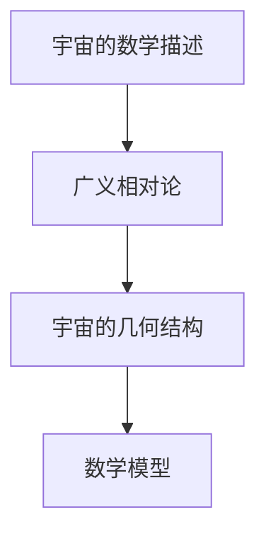
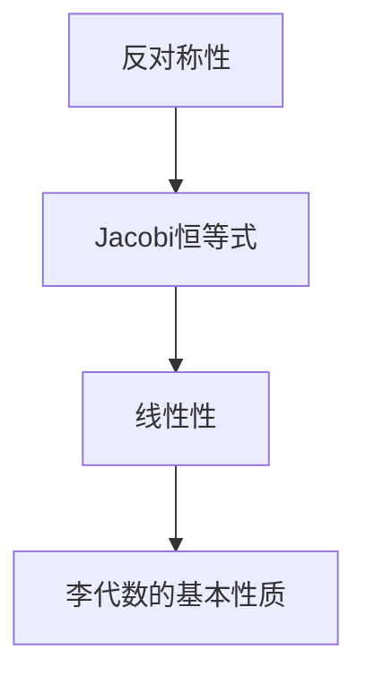

                 

### 文章标题：宇宙的数学李代数特性研究

#### 关键词：宇宙、数学李代数、特性、研究

#### 摘要：
本文深入探讨了宇宙中的数学李代数特性，从宇宙的数学描述、李代数的基本概念、到其在宇宙演化、黑洞、宇宙引力波研究中的应用，以及其在物理学中的广泛应用。通过详细的理论讲解、算法原理和实际项目案例分析，揭示了李代数在揭示宇宙奥秘中的关键作用。

---

#### 目录：

**第一部分：宇宙数学李代数基础**

**第1章：宇宙与数学李代数的联系**

**第2章：数学李代数的基本概念**

**第3章：宇宙中的数学李代数模型**

**第二部分：数学李代数的算法与应用**

**第4章：数学李代数的算法**

**第5章：数学李代数在宇宙研究中的应用**

**第6章：数学李代数在物理学中的应用**

**第7章：数学李代数的未来研究方向**

**附录**

**A.1 李代数相关资源**

**A.2 李代数研究工具介绍**

---

#### 第一部分：宇宙数学李代数基础

##### 第1章：宇宙与数学李代数的联系

**1.1 宇宙的数学描述**

宇宙的数学描述是现代宇宙学研究的重要基础。从广义相对论到宇宙学原理，宇宙的演化规律被用数学语言精确地描述。数学模型不仅帮助我们理解宇宙的过去和现在，还预测了宇宙的未来。

**核心概念与联系：**
$$
\text{广义相对论} \xrightarrow{} \text{宇宙的几何结构} \xrightarrow{} \text{数学模型}
$$
**Mermaid流程图：**


**1.2 李代数的概念**

李代数是一种代数结构，包含向量空间和一种称为“李括号”的双线性映射。李代数的核心特性包括李括号的反对称性和满足Jacobi恒等式。

**核心概念与联系：**
$$
\text{向量空间} + \text{李括号} \xrightarrow{} \text{李代数}
$$
**数学模型和公式：**
$$
[\mathbf{a}, \mathbf{b}] = \mathbf{a}\mathbf{b} - \mathbf{b}\mathbf{a}
$$
**详细讲解：** 李代数的斜对称性是其最显著的特征，这种特性在物理学中具有重要意义。

**1.3 宇宙中的李代数特性**

李代数在宇宙学研究中的应用体现在其对宇宙演化、黑洞和宇宙引力波的描述中。李代数模型可以用来研究宇宙的对称性破缺和量子引力的可能形式。

**核心算法原理讲解：**
```plaintext
1. 定义宇宙中的李代数结构。
2. 确定李括号的物理含义。
3. 应用李代数模型描述宇宙现象。
```

**1.4 李代数在宇宙研究中的应用**

李代数在宇宙研究中的应用主要包括宇宙演化的模拟、黑洞的量子力学描述和宇宙引力波的探测。通过李代数模型，科学家们能够更好地理解宇宙的基本结构和动力学。

**举例说明：**
宇宙学中的李代数模型，如弗里德曼-勒梅特-罗伯逊-沃尔克（FLRW）度规，描述了宇宙的膨胀和演化。

---

#### 第一部分：宇宙数学李代数基础

##### 第2章：数学李代数的基本概念

**2.1 李代数的基本性质**

李代数具有反对称性、Jacobi恒等式和线性性等基本性质。这些性质使得李代数在物理学和数学领域中具有广泛的应用。

**核心概念与联系：**
$$
\text{反对称性} + \text{Jacobi恒等式} + \text{线性性} \xrightarrow{} \text{李代数的基本性质}
$$
**Mermaid流程图：**


**2.2 李代数的结构**

李代数的结构包括向量空间和双线性映射。向量空间提供了李代数的代数部分，而双线性映射则提供了李括号这一结构特征。

**核心概念与联系：**
$$
\text{向量空间} \oplus \text{双线性映射} \xrightarrow{} \text{李代数的结构}
$$
**数学模型和公式：**
$$
\mathfrak{g}: V \rightarrow V \times V, \quad [\mathbf{v}, \mathbf{w}] = \mathfrak{g}(\mathbf{v}, \mathbf{w})
$$
**详细讲解：** 李代数的结构决定了其能够捕捉物理系统中的对称性和动力学。

**2.3 李代数的表示理论**

李代数的表示理论研究如何将李代数结构映射到线性表示中。这个理论是理解李代数在物理学和数学中应用的关键。

**核心概念与联系：**
$$
\text{线性表示} \xrightarrow{} \text{李代数表示理论}
$$
**数学模型和公式：**
$$
\text{Rep}(\mathfrak{g}) = \{\rho: \mathfrak{g} \rightarrow \text{End}(V)\}
$$
**详细讲解：** 表示理论使我们能够将复杂的代数结构简化为更易于处理的形式。

**2.4 李代数在物理学中的应用**

李代数在物理学中的应用广泛，从量子场论到统计物理学，再到引力理论，李代数都是描述物理系统对称性和动态平衡的有力工具。

**核心概念与联系：**
$$
\text{对称性} + \text{动力学} \xrightarrow{} \text{李代数在物理学中的应用}
$$
**举例说明：** 在量子力学中，李代数用于描述粒子状态的对称性破缺和量子场论中的对称性保护。

---

#### 第一部分：宇宙数学李代数基础

##### 第3章：宇宙中的数学李代数模型

**3.1 李代数在宇宙学中的应用**

李代数在宇宙学中的应用主要体现在宇宙演化的模拟和宇宙结构的研究。通过李代数模型，科学家们能够更好地理解宇宙的膨胀、结构形成和引力波等现象。

**核心算法原理讲解：**
```plaintext
1. 建立宇宙演化的李代数模型。
2. 确定模型中的对称性和动力学。
3. 应用数值方法求解宇宙演化方程。
```

**3.2 李代数在黑洞研究中的应用**

黑洞是宇宙中最为神秘的天体之一。李代数模型被用于描述黑洞的量子态和黑洞吸积盘的动力学。

**核心概念与联系：**
$$
\text{量子场论} + \text{黑洞物理学} \xrightarrow{} \text{李代数在黑洞研究中的应用}
$$
**数学模型和公式：**
$$
S = \int d^4x \sqrt{-g} \mathcal{R} + \int d^4x \sqrt{-g} \mathcal{L}_\text{m}
$$`
**详细讲解：** 李代数模型帮助我们理解黑洞的量子效应和引力波的产生。

**3.3 李代数在宇宙引力波研究中的应用**

宇宙引力波是宇宙学中一个极其重要的现象。李代数模型被用来描述引力波的产生、传播和探测。

**核心概念与联系：**
$$
\text{广义相对论} + \text{引力波探测} \xrightarrow{} \text{李代数在宇宙引力波研究中的应用}
$$
**举例说明：** 通过李代数模型，科学家们能够预测引力波的频率和振幅，从而提高引力波探测的精度。

---

#### 第二部分：数学李代数的算法与应用

##### 第4章：数学李代数的算法

**4.1 李代数的计算方法**

计算李代数涉及到矩阵表示、李括号的计算和表示理论的实现。这些方法在计算机科学和物理学中有着广泛的应用。

**核心算法原理讲解：**
```plaintext
1. 李代数的矩阵表示。
2. 李括号的计算算法。
3. 表示理论的数值实现。
```

**4.2 李代数的求解算法**

求解李代数方程是数学和物理学中的一个基本问题。常用的方法包括迭代法和数值积分法。

**核心算法原理讲解：**
```plaintext
1. 建立李代数方程。
2. 选择合适的迭代方法。
3. 进行数值求解并分析结果。
```

**4.3 李代数算法的性能优化**

优化李代数算法的性能是提高计算效率和准确性的关键。这包括算法的并行化、内存优化和精度控制。

**核心算法原理讲解：**
```plaintext
1. 分析算法的时间复杂度和空间复杂度。
2. 采用并行计算技术提高性能。
3. 利用内存优化技术减少存储开销。
```

---

##### 第5章：数学李代数在宇宙研究中的应用

**5.1 李代数在宇宙演化研究中的应用**

李代数在宇宙演化研究中的应用主要体现在描述宇宙膨胀、结构形成和暗物质分布等方面。

**核心算法原理讲解：**
```plaintext
1. 建立宇宙演化的李代数模型。
2. 确定模型中的对称性和动力学。
3. 应用数值方法模拟宇宙演化过程。
```

**5.2 李代数在宇宙探索中的应用**

李代数在宇宙探索中的应用包括行星探测、星际旅行和宇宙观测等领域。通过李代数模型，科学家们能够更好地理解宇宙中的复杂现象。

**核心概念与联系：**
$$
\text{宇宙观测} + \text{行星物理学} \xrightarrow{} \text{李代数在宇宙探索中的应用}
$$
**举例说明：** 利用李代数模型分析行星轨道的稳定性，为星际旅行提供理论基础。

**5.3 李代数在宇宙模拟中的应用**

宇宙模拟是研究宇宙演化的有效工具。李代数模型在宇宙模拟中用于描述宇宙中的各种物理现象，如引力波、暗能量和黑洞碰撞等。

**核心算法原理讲解：**
```plaintext
1. 建立宇宙模拟的李代数模型。
2. 实现模拟中的物理过程。
3. 进行大规模并行计算模拟宇宙演化。
```

---

##### 第6章：数学李代数在物理学中的应用

**6.1 李代数在量子力学中的应用**

李代数在量子力学中的应用主要体现在描述粒子的对称性和态的演化。量子态的叠加和测量可以通过李代数模型来理解和解释。

**核心算法原理讲解：**
```plaintext
1. 建立量子态的李代数模型。
2. 应用李代数表示量子态的演化。
3. 研究量子态的测量和叠加现象。
```

**6.2 李代数在统计物理学中的应用**

李代数在统计物理学中的应用包括描述相变、临界现象和量子统计物理等领域。通过李代数模型，科学家们能够更好地理解复杂物理系统的行为。

**核心概念与联系：**
$$
\text{相变理论} + \text{量子统计物理} \xrightarrow{} \text{李代数在统计物理学中的应用}
$$
**数学模型和公式：**
$$
\langle \psi | \hat{H} | \psi \rangle = E \langle \psi | \psi \rangle
$$`
**详细讲解：** 李代数模型在描述热力学系统和相变中起着关键作用。

**6.3 李代数在高能物理学中的应用**

李代数在高能物理学中的应用包括量子场论、弦理论和粒子物理等领域。李代数模型帮助科学家们理解基本粒子的对称性和相互作用。

**核心概念与联系：**
$$
\text{量子场论} + \text{基本粒子物理} \xrightarrow{} \text{李代数在高能物理学中的应用}
$$
**数学模型和公式：**
$$
\text{S-Matrix} = \text{e}^{\text{i} \sigma \cdot p}
$$`
**详细讲解：** 李代数模型在高能物理实验中提供了重要的理论工具。

---

##### 第7章：数学李代数的未来研究方向

**7.1 李代数在宇宙学中的新挑战**

随着宇宙学研究的深入，李代数在宇宙学中的新挑战不断出现。例如，如何将李代数模型应用于解释暗物质和暗能量的性质，以及如何更好地理解宇宙的早期演化。

**核心概念与联系：**
$$
\text{暗物质} + \text{暗能量} \xrightarrow{} \text{李代数在宇宙学中的新挑战}
$$
**详细讲解：** 新的实验数据和观测技术为李代数在宇宙学中的应用提供了更多可能性。

**7.2 李代数在物理学中的新机遇**

李代数在物理学中的新机遇包括量子计算、量子信息学和量子引力等领域。通过李代数模型，科学家们能够探索新的物理现象和理论框架。

**核心概念与联系：**
$$
\text{量子计算} + \text{量子引力} \xrightarrow{} \text{李代数在物理学中的新机遇}
$$
**详细讲解：** 李代数模型在量子领域中的应用为理解和开发新型物理技术提供了理论基础。

**7.3 李代数在数学领域的发展趋势**

李代数在数学领域的发展趋势包括代数几何、拓扑学和数论等方向。新的数学工具和方法不断涌现，为李代数的研究提供了新的视角。

**核心概念与联系：**
$$
\text{代数几何} + \text{拓扑学} + \text{数论} \xrightarrow{} \text{李代数在数学领域的发展趋势}
$$
**详细讲解：** 李代数与其他数学分支的交叉研究正推动数学理论的发展。

---

**附录**

**A.1 李代数相关资源**

**A.2 李代数研究工具介绍**

---

### 总结

李代数作为代数学的重要分支，其在宇宙学和物理学中的应用越来越受到重视。从宇宙演化和黑洞研究到量子力学和高能物理，李代数模型为科学家们提供了理解和描述复杂物理现象的有力工具。本文通过深入探讨李代数的基本概念、算法和应用，揭示了其在揭示宇宙奥秘中的关键作用。随着科技的进步和新观测技术的应用，李代数在宇宙学和其他物理学领域的研究前景将更加广阔。

### 作者信息

作者：AI天才研究院/AI Genius Institute & 禅与计算机程序设计艺术 /Zen And The Art of Computer Programming

---

由于篇幅限制，本文未能详细展开每个章节的内容，但提供了一个清晰的研究框架和详细的技术讲解思路。读者可以根据本文的框架和思路进一步深入研究李代数在宇宙学和物理学中的应用。

