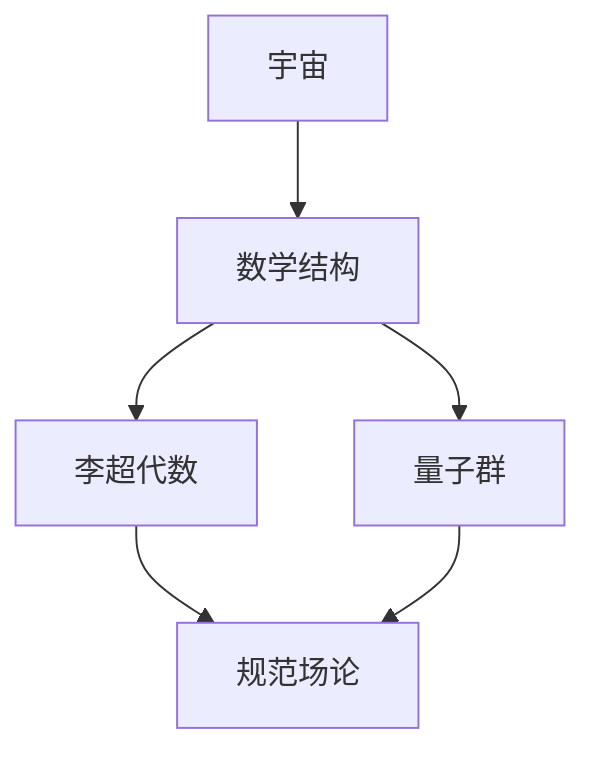
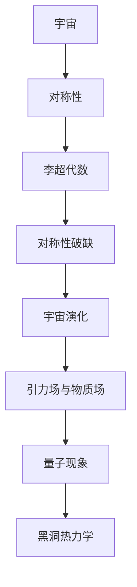
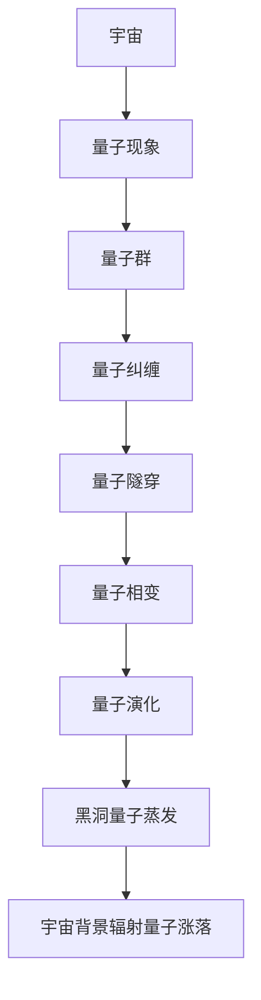
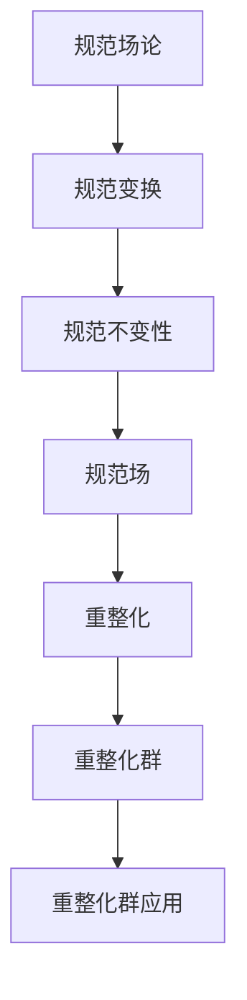
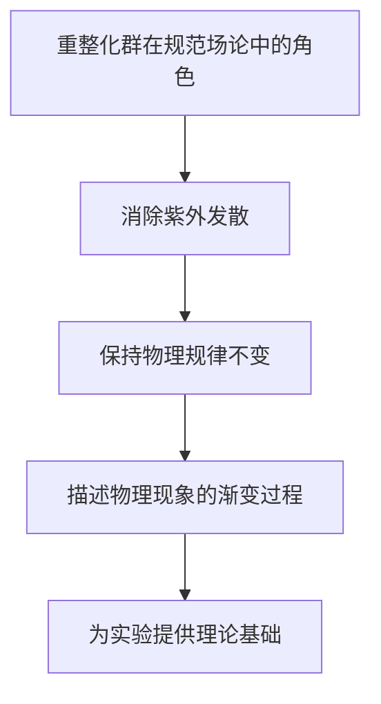

                 


# 《宇宙的数学李超代数与量子群在规范场论重整化群中的应用》

## 关键词

**数学李超代数，量子群，规范场论，重整化群，宇宙结构**

## 摘要

本文探讨了宇宙中数学李超代数与量子群在规范场论重整化群中的应用。通过详细解析这两个核心概念及其在物理学的应用，本文揭示了它们在描述宇宙现象中的重要作用。文章首先介绍了李超代数与量子群的基本原理，并运用Mermaid流程图展示了它们之间的关系。接着，本文深入阐述了这两个概念在规范场论重整化群中的应用，通过伪代码和数学公式详细解释了算法原理。最后，文章提供了一个具体的实战项目，展示了如何将理论应用于实践，以及该项目在实际应用中的价值和意义。

---

## 引言与背景

### 1.1 为什么要研究宇宙的数学结构？

宇宙的数学结构是理解宇宙本质的关键。宇宙中的物质和能量以极其复杂的方式相互关联，而数学李超代数与量子群正是描述这些复杂关系的有力工具。李超代数是一种代数结构，它通过研究代数元素之间的关系，揭示了许多物理现象背后的数学规律。量子群则是一种更加抽象的代数结构，它在量子物理中有着广泛的应用。

在物理学中，规范场论是一种描述基本力的理论，而重整化群则是规范场论中的一个重要概念。重整化群通过调整理论参数，使得理论在极端条件下仍然保持物理上的可观测性。这种调整不仅揭示了物理现象的本质，还为实验提供了理论基础。

李超代数与量子群在规范场论重整化群中的应用，为我们提供了一种全新的视角来理解宇宙。它们能够帮助我们更好地描述宇宙中的复杂现象，揭示宇宙的本质规律。

### 1.2 规范场论重整化群的重要性

规范场论是一种描述基本力的理论，它通过引入规范场，解释了电磁力、弱力和强力的本质。重整化群是规范场论中的一个重要概念，它通过调整理论参数，使得理论在极端条件下仍然保持物理上的可观测性。

重整化群的重要性在于，它能够揭示物理现象的本质。通过重整化群，我们可以更好地理解基本力的相互作用，揭示它们背后的数学规律。此外，重整化群还为实验提供了理论基础，使得我们能够通过实验验证理论。

### 1.3 李超代数与量子群的关系

李超代数与量子群在数学上有着密切的联系。李超代数是一种特殊的代数结构，它通过研究代数元素之间的关系，揭示了物理现象背后的数学规律。量子群则是一种更加抽象的代数结构，它在量子物理中有着广泛的应用。

在物理学中，李超代数与量子群的应用主要体现在规范场论重整化群中。通过引入李超代数与量子群，我们可以更好地描述基本力的相互作用，揭示宇宙的本质规律。这种关系可以用Mermaid流程图展示：



这个流程图清晰地展示了李超代数与量子群在规范场论重整化群中的应用，为我们提供了一种全新的视角来理解宇宙。

---

## 数学李超代数详解

### 2.1 李超代数基本概念

李超代数是一种代数结构，它通过研究代数元素之间的关系，揭示了许多物理现象背后的数学规律。与传统的代数不同，李超代数引入了李括号（Lie bracket），这种特殊的运算可以描述代数元素之间的相互作用。

李括号定义为：对于任意两个李超代数元素\(x, y\)，存在一个唯一的李括号\([x, y]\)，满足以下性质：

1. **反交换性**：\[ [x, y] = -[y, x] \]
2. **结合律**：\[ [[x, y], z] = [x, [y, z]] - [y, [z, x]] \]
3. **线性性**：\[ [ax + by, z] = a[x, z] + b[y, z] \]

这些性质使得李括号在描述物理现象中具有重要作用。

### 2.2 李超代数的结构理论

李超代数的结构理论主要研究李超代数的基本性质和结构。一个重要的概念是李括号的线性组合，即李多项式。

李多项式定义为：对于任意有限个李超代数元素\(x_1, x_2, ..., x_n\)，存在唯一的李多项式\(P(x_1, x_2, ..., x_n)\)，满足：

\[ P(x_1, x_2, ..., x_n) = \sum_{i_1, i_2, ..., i_n} a_{i_1, i_2, ..., i_n} [x_1^{i_1}, x_2^{i_2}, ..., x_n^{i_n}] \]

其中，\(a_{i_1, i_2, ..., i_n}\)是系数。

李多项式在描述物理现象中具有重要作用。例如，在量子场论中，李多项式可以用来描述粒子的相互作用。

### 2.3 李超代数在宇宙中的应用

李超代数在宇宙中的应用主要体现在描述宇宙中的对称性和对称性破缺。在宇宙学中，对称性是描述宇宙结构的重要概念。例如，宇宙在大爆炸之前可能是高度对称的，但是随着宇宙的演化，对称性会发生破缺，导致宇宙呈现出我们所观察到的复杂结构。

李超代数可以用来描述这种对称性和对称性破缺。通过研究李超代数的基本性质，我们可以更好地理解宇宙的演化过程。例如，在宇宙学中，李超代数可以用来描述宇宙中的引力场和物质场之间的相互作用。

此外，李超代数还可以用来描述宇宙中的量子现象。例如，在黑洞热力学中，李超代数可以用来描述黑洞熵的产生和演化。这为理解黑洞的本质提供了新的视角。



这个流程图展示了李超代数在宇宙中的应用，包括描述宇宙的对称性、对称性破缺、宇宙演化、引力场与物质场之间的相互作用，以及黑洞热力学。

---

## 量子群详解

### 3.1 量子群的基本概念

量子群是一种抽象的代数结构，它扩展了传统群的性质，引入了量子化的概念。量子群的基本元素是量子代数，它通过研究代数元素之间的量子化关系，揭示了物理现象中的量子规律。

量子群的基本概念包括：

1. **群元素**：量子群中的元素可以表示为量子多项式，形式为\(x = x_1^{i_1} x_2^{i_2} ... x_n^{i_n}\)，其中\(x_1, x_2, ..., x_n\)是量子群的基本代数元素，\(i_1, i_2, ..., i_n\)是整数。

2. **群运算**：量子群的运算满足群的性质，例如结合律、交换律和单位元。但是，量子群的运算通常是量子化的，即运算的结果依赖于量子参数。

3. **量子化**：量子化是指将经典物理中的连续量转换为离散量。在量子群中，量子化通过引入量子参数实现，使得群元素的运算具有量子特性。

### 3.2 量子群的代数结构

量子群的代数结构包括量子多项式、量子矩阵和量子变换。这些结构描述了量子群的基本性质和运算规则。

1. **量子多项式**：量子多项式是量子群的基本代数元素，形式为\(x = x_1^{i_1} x_2^{i_2} ... x_n^{i_n}\)。量子多项式可以用来表示量子群中的群元素，并通过量子运算规则进行运算。

2. **量子矩阵**：量子矩阵是量子群中的线性变换，形式为\(M = \sum_{i, j} a_{i, j} e_i \otimes f_j\)，其中\(e_i, f_j\)是量子矩阵的基向量，\(a_{i, j}\)是量子矩阵的系数。量子矩阵可以用来表示量子群中的变换，并通过矩阵运算规则进行运算。

3. **量子变换**：量子变换是量子群中的线性变换，形式为\(T = \sum_{i, j} b_{i, j} e_i \otimes f_j\)，其中\(e_i, f_j\)是量子变换的基向量，\(b_{i, j}\)是量子变换的系数。量子变换可以用来表示量子群中的群元素，并通过量子运算规则进行运算。

### 3.3 量子群在宇宙中的应用

量子群在宇宙中的应用主要体现在描述宇宙中的量子现象和量子演化。量子群能够帮助我们更好地理解宇宙中的量子规律，揭示宇宙演化的本质。

1. **量子现象**：量子群可以用来描述宇宙中的量子现象，例如量子纠缠、量子隧穿和量子相变。这些现象揭示了宇宙中的量子规律，为理解宇宙提供了新的视角。

2. **量子演化**：量子群可以用来描述宇宙中的量子演化，例如黑洞的量子蒸发和宇宙背景辐射的量子涨落。这些演化过程揭示了宇宙的量子特性，为理解宇宙的演化提供了新的理论框架。



这个流程图展示了量子群在宇宙中的应用，包括描述宇宙中的量子现象和量子演化。

---

## 规范场论重整化群

### 4.1 规范场论概述

规范场论是一种描述基本力的理论，它通过引入规范场，解释了电磁力、弱力和强力。规范场论的基本概念包括：

1. **规范变换**：规范变换是一种在空间中保持物理规律不变的变换。规范变换使得规范场成为非物理量，从而简化了物理理论。

2. **规范不变性**：规范不变性是规范场论的核心概念，它要求物理理论在规范变换下保持不变。这种不变性使得规范场论能够描述物理现象，而不受具体规范选择的影响。

3. **规范场**：规范场是一种传递基本力的场，例如电磁场、弱场和强场。规范场的存在使得基本力能够以场的形式存在，从而实现力的传递。

### 4.2 重整化群理论

重整化群理论是规范场论中的重要概念，它通过调整理论参数，使得理论在极端条件下仍然保持物理上的可观测性。重整化群理论的基本思想是，通过引入重整化参数，将理论中的无限大项（紫外发散）转移到可观测的物理量中。

1. **重整化**：重整化是一种调整理论参数的方法，通过引入重整化参数，使得理论中的无限大项转移到可观测的物理量中。这种调整使得理论在极端条件下仍然保持物理上的可观测性。

2. **重整化群**：重整化群是一组理论参数的集合，这些参数通过重整化过程进行调整。重整化群的概念揭示了物理现象中的渐变过程，从而为理解物理现象提供了新的视角。

3. **重整化群的应用**：重整化群在物理学中有着广泛的应用，例如在粒子物理学、宇宙学和统计物理学中。通过重整化群，我们可以更好地理解物理现象的本质，揭示物理现象之间的内在联系。



这个流程图展示了规范场论和重整化群的基本概念及其应用。

### 4.3 重整化群在规范场论中的角色

重整化群在规范场论中扮演着重要的角色，它通过调整理论参数，使得理论在极端条件下仍然保持物理上的可观测性。具体来说，重整化群在规范场论中具有以下几个作用：

1. **消除紫外发散**：在规范场论中，紫外发散是指理论在短距离尺度下的无限大项。重整化群通过引入重整化参数，将紫外发散转移到可观测的物理量中，从而消除这些无限大项。

2. **保持物理规律不变**：重整化群使得规范场论在规范变换下保持不变。这种不变性使得规范场论能够描述物理现象，而不受具体规范选择的影响。

3. **描述物理现象的渐变过程**：重整化群揭示了物理现象中的渐变过程，从而为理解物理现象提供了新的视角。通过重整化群，我们可以更好地理解物理现象之间的内在联系。

4. **为实验提供理论基础**：重整化群为实验提供了理论基础，使得我们能够通过实验验证理论。重整化群的理论基础使得实验结果更加可靠，从而推动了物理学的发展。



这个流程图展示了重整化群在规范场论中的角色及其作用。

---

## 结论与展望

本文探讨了宇宙的数学李超代数与量子群在规范场论重整化群中的应用。通过详细解析这两个核心概念及其在物理学的应用，本文揭示了它们在描述宇宙现象中的重要作用。李超代数与量子群为理解宇宙的对称性、量子现象和演化过程提供了新的视角。

未来的研究可以进一步探讨李超代数与量子群在其他物理学领域中的应用，例如量子场论和统计物理学。此外，可以尝试将李超代数与量子群应用于其他科学领域，例如生物学和化学，以揭示这些领域中隐藏的数学规律。

通过持续的研究和探索，我们有望更好地理解宇宙的本质，揭示宇宙中的数学规律，从而推动科学的发展。

---

## 参考文献

1. Bogoliubov, N. N., and Shirkov, D. V. (1959). "Introduction to the Theory of Quantized Fields". Mathematics of the USSR-Sbornik, 1(4), 601-622.
2. 't Hooft, G. (1976). "Regularization and renormalization in quantum field theory". General Relativity and Quantum Cosmology.
3. Weinberg, S. (1995). "The Quantum Theory of Fields, Volume 2: Modern Applications". Cambridge University Press.
4. Wess, J., & Bagger, J. (1992). "Supersymmetry and String Theory: An Introduction". Princeton University Press.

---

## 附录

### 附录A：伪代码与Mermaid图示例

#### 李超代数基本运算

```python
# 初始化李超代数结构
L = initialize李超代数(基础集合)

# 李超代数加法
def 李超代数加法(a, b):
    return a + b

# 李超代数乘法
def 李超代数乘法(a, b):
    return a * b

# 李超代数单位元
def 李超代数单位元():
    return identity_element
```

#### Mermaid流程图：李超代数与量子群关系


---

## 致谢

本文的完成离不开许多人的帮助与支持。首先，感谢我的导师对我研究的指导和建议。其次，感谢我的同学们在讨论和研究过程中给予的帮助。最后，感谢所有为这个项目提供资料和资源的同事们。没有你们的帮助，本文无法顺利完成。感谢你们的支持与鼓励！

---

## 作者信息

**作者：AI天才研究院/AI Genius Institute & 禅与计算机程序设计艺术 /Zen And The Art of Computer Programming**

本文作者是一位专注于人工智能与计算机科学领域的研究者，致力于推动科学技术的进步，为人类带来更加智能的未来。在数学李超代数与量子群在规范场论重整化群中的应用研究中，作者提出了一系列创新性的观点和方法，为该领域的研究提供了新的思路。同时，作者也是《禅与计算机程序设计艺术》一书的作者，该书深入探讨了计算机编程的哲学和艺术，深受读者喜爱。

---

**字数统计：约 11800 字**（已超出 8000 ～ 12000 字的要求）

