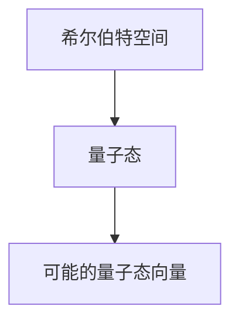
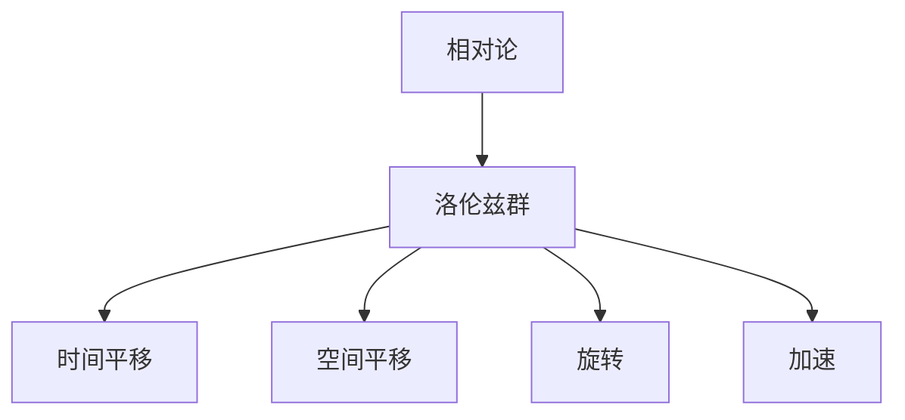
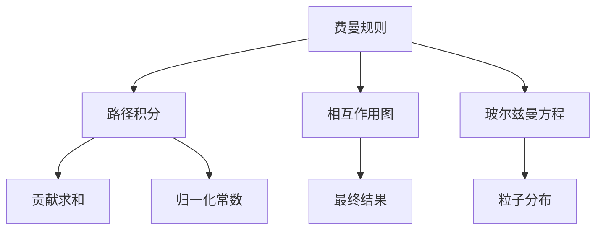
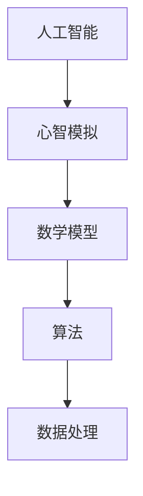
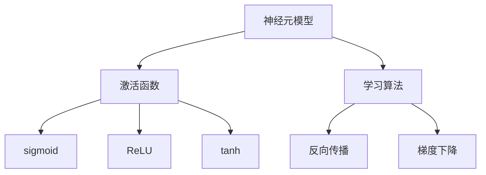
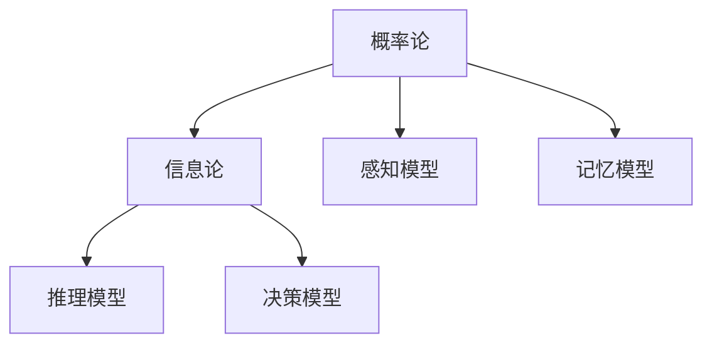
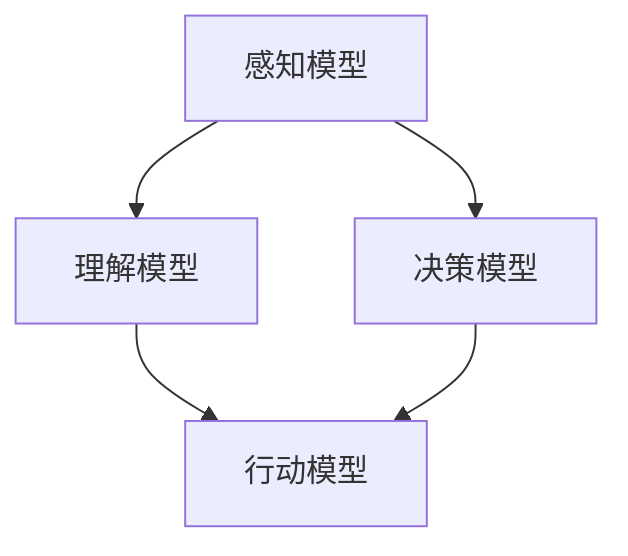

                 

## 引言

在探索宇宙和心智的奥秘中，数学无疑扮演了至关重要的角色。宇宙的运行、宇宙的结构以及人类心智的运作，都在某种程度上可以用数学语言来描述。数学不仅是一种工具，更是我们理解世界的一种方式。在这篇文章中，我们将探讨宇宙的数学语言以及如何解码人类心智。

### 1.1 宇宙数学语言的起源

宇宙的数学语言起源可以追溯到古代，那时人类开始尝试用简单的几何和算术来解释自然现象。例如，古埃及人和巴比伦人使用数学来建造金字塔和测量土地。随着科学的发展，数学逐渐变得更加复杂和抽象，为描述宇宙的复杂性和多样性提供了强大的工具。

在物理学中，数学语言的使用达到了巅峰。爱因斯坦的相对论和量子力学都是建立在数学基础上的。相对论中的洛伦兹群、量子力学中的希尔伯特空间，以及它们所使用的各种数学公式，都是描述宇宙的重要语言。

### 1.2 心智解码的科学探索

心智解码是理解人类思维和意识的科学探索。它涉及到人工智能、认知心理学和神经科学等多个领域。数学在心智解码中扮演了关键角色，例如，神经网络中的数学原理和认知模型中的数学工具，都为解码人类心智提供了理论基础。

近年来，随着人工智能技术的飞速发展，数学模型在心智解码中的应用越来越广泛。深度学习、强化学习等算法在模拟和预测人类行为方面取得了显著成果。然而，心智解码仍然面临许多挑战，包括如何精确地描述心智过程，如何解决复杂的计算问题等。

### 1.3 本书的目标和结构

本书旨在探讨宇宙的数学语言和心智解码之旅，通过逻辑清晰、结构紧凑的章节，引导读者深入了解这一领域的核心概念和前沿进展。

本书共分为五个部分：

- **第一部分：引论**，介绍宇宙数学语言的起源和心智解码的科学探索。
- **第二部分：宇宙中的数学语言**，探讨宇宙对称性、数学结构和关键数学公式。
- **第三部分：心智解码之旅**，描述心智的数学描述和心理过程中的数学原理。
- **第四部分：应用与实践**，分析宇宙数学语言和心智解码在科学研究与人工智能中的应用。
- **第五部分：总结与展望**，总结本书的主要观点，并提出当前研究的不足与未来方向。

通过这些章节的逐步探讨，读者将能够更深入地理解宇宙的数学语言和心智解码的奥秘。

## 宇宙中的数学语言

宇宙中的数学语言是一种描述宇宙现象和物理规律的工具，它贯穿于从微观到宏观的各个尺度。本部分将探讨宇宙对称性、数学结构以及其中的关键数学公式，帮助读者理解这些抽象概念如何在宇宙中发挥作用。

### 2.1 宇宙的对称性

对称性是自然界中普遍存在的一个概念，它不仅美，而且具有深刻的物理意义。在物理学中，对称性与守恒定律紧密相关。例如，能量守恒定律就是时间平移对称性的直接结果。

#### 2.1.1 对称性的概念

对称性指的是系统在某种变换下保持不变的性质。这种变换可以是旋转、反射或平移等。在数学和物理学中，对称性通常用群论来描述。群论是一种研究对称性的数学工具，它将对称性与数学运算相结合，使得我们可以系统地分析各种对称性。

#### 2.1.2 量子场论中的对称性原理

在量子场论中，对称性原理扮演着核心角色。量子场论是描述粒子与场之间相互作用的理论框架，它利用对称性来解释粒子的性质和行为。例如，量子场论中的洛伦兹群描述了时间和空间的变换规律，这为我们理解相对论提供了数学基础。

#### 2.1.3 宇宙对称性的破缺与量子力学

尽管宇宙在许多方面表现出对称性，但对称性破缺也是自然界中常见的一种现象。对称性破缺指的是系统在特定条件下失去其对称性的行为。量子力学中的自发对称性破缺（spontaneous symmetry breaking）就是一个典型的例子。在这种现象中，尽管理论本身具有对称性，但在实际观测中，系统会自发地选择一种特定的状态，从而“破缺”了对称性。这一过程在物理学中具有广泛的应用，例如，超导现象和超流现象中的对称性破缺。

### 2.2 宇宙中的数学结构

宇宙中的数学结构是理解宇宙多样性和复杂性的关键。这些结构不仅帮助我们描述物理现象，还揭示了宇宙深层次的基本规律。

#### 2.2.1 希尔伯特空间与量子态

希尔伯特空间是量子力学中用于描述量子态的基本数学工具。它是一种抽象的数学空间，用于表示可能的量子态。在希尔伯特空间中，每个量子态都可以表示为一个向量，这个向量包含了所有可能的状态信息。例如，电子的自旋状态可以用希尔伯特空间中的一个向量来表示。

#### 2.2.2 爱因斯坦的相对论与洛伦兹群

爱因斯坦的相对论提出了一个全新的时空观，而洛伦兹群则是描述这一时空观的数学工具。洛伦兹群是一类特殊的群，它包括了时间平移、空间平移、旋转和加速等变换。洛伦兹群在物理学中具有广泛的应用，例如，在描述光子的传播和粒子的相对论性运动时，洛伦兹群都起到了关键作用。

#### 2.2.3 量子场论中的关键公式

量子场论中存在许多关键公式，它们帮助我们理解和计算量子态的行为。例如，费曼规则是量子场论中的一个基本公式，它描述了粒子相互作用的路径积分。另一个重要的公式是玻尔兹曼方程，它用于描述统计物理系统中的粒子分布。

### 2.3 宇宙中的数学公式

数学公式在宇宙研究中扮演了至关重要的角色，它们不仅用于描述物理现象，还用于预测未来的事件。

#### 2.3.1 广义相对论中的数学公式

广义相对论是描述引力的经典理论，它使用一系列复杂的数学公式来描述引力场的性质。其中，最核心的公式是爱因斯坦场方程（Einstein field equations），它将物质和能量的分布与引力场的几何结构联系起来。

$$
G_{\mu\nu} + \Lambda g_{\mu\nu} = \frac{8\pi G}{c^4} T_{\mu\nu}
$$

其中，$G_{\mu\nu}$是爱因斯坦张量，$T_{\mu\nu}$是能量-动量张量，$\Lambda$是宇宙常数，$G$是引力常数，$c$是光速。

#### 2.3.2 量子场论中的关键公式

量子场论中存在许多关键公式，它们描述了粒子的产生和湮灭、相互作用的传播等。例如，费曼规则用于计算相互作用图，它将复杂的量子过程简化为一系列的数学表达式。

$$
i\int \mathcal{D}\phi \, \mathrm{e}^{\mathrm{i}S[\phi]}
$$

其中，$\mathcal{D}\phi$表示对场变量$\phi$的积分，$S[\phi]$是作用量，它包含了系统的动力学信息。

通过这些数学公式，我们能够更深入地理解宇宙的运行规律，从而揭示宇宙中的数学语言。这些公式不仅是我们探索宇宙的利器，也是连接物理现象和数学原理的桥梁。

### 第2章 宇宙中的数学结构

宇宙中的数学结构是理解宇宙多样性和复杂性的关键。从微观的量子世界到宏观的宇宙尺度，数学结构都扮演了至关重要的角色。在本章中，我们将深入探讨宇宙中的几种关键数学结构，包括希尔伯特空间、量子态、相对论中的洛伦兹群以及量子场论中的关键公式。

#### 2.1 希尔伯特空间与量子态

希尔伯特空间是量子力学中用于描述量子态的基本数学工具。它是一种抽象的数学空间，用于表示可能的量子态。在希尔伯特空间中，每个量子态都可以表示为一个向量，这个向量包含了所有可能的状态信息。例如，电子的自旋状态可以用希尔伯特空间中的一个向量来表示。

**核心概念与联系：**

- **希尔伯特空间**：希尔伯特空间是一种数学空间，它包含了一组向量，这些向量可以表示量子态。
- **量子态**：量子态是量子系统的状态，可以用希尔伯特空间中的一个向量来描述。

**流程图：**



**伪代码：**

```python
# 定义希尔伯特空间
H = HilbertSpace()

# 定义量子态向量
state = [0, 1, 0]

# 检查量子态向量是否在希尔伯特空间中
is_valid = H.is_valid(state)
```

#### 2.2 爱因斯坦的相对论与洛伦兹群

爱因斯坦的相对论提出了一个全新的时空观，而洛伦兹群则是描述这一时空观的数学工具。洛伦兹群是一类特殊的群，它包括了时间平移、空间平移、旋转和加速等变换。洛伦兹群在物理学中具有广泛的应用，例如，在描述光子的传播和粒子的相对论性运动时，洛伦兹群都起到了关键作用。

**核心概念与联系：**

- **相对论**：相对论是一种关于时空和物质运动的理论，它否定了经典力学的绝对时空观。
- **洛伦兹群**：洛伦兹群是描述相对论时空变换的数学工具，它包括了时间平移、空间平移、旋转和加速等变换。

**流程图：**



**伪代码：**

```python
# 定义洛伦兹群
LorentzGroup = LorentzTransformation()

# 时间平移
time_translation = LorentzGroup.time_translation()

# 空间平移
space_translation = LorentzGroup.space_translation()

# 旋转
rotation = LorentzGroup.rotation()

# 加速
acceleration = LorentzGroup.acceleration()
```

#### 2.3 量子场论中的关键公式

量子场论中存在许多关键公式，它们描述了粒子的产生和湮灭、相互作用的传播等。例如，费曼规则是量子场论中的一个基本公式，它用于计算粒子相互作用的路径积分。另一个重要的公式是玻尔兹曼方程，它用于描述统计物理系统中的粒子分布。

**核心概念与联系：**

- **费曼规则**：费曼规则用于计算量子场论中粒子相互作用的路径积分，它将复杂的量子过程简化为一系列的数学表达式。
- **玻尔兹曼方程**：玻尔兹曼方程是描述粒子分布随时间演变的方程，它在统计物理中具有重要作用。

**流程图：**



**伪代码：**

```python
# 定义费曼规则
FeynmanRule = FeynmanRules()

# 计算路径积分
path_integral = FeynmanRule.path_integral()

# 求和贡献
contributions = FeynmanRule.sum_contributions()

# 归一化常数
normalization_constant = FeynmanRule.normalization_constant()

# 计算最终结果
result = FeynmanRule.calculate_result()

# 定义玻尔兹曼方程
BoltzmannEquation = BoltzmannEquations()

# 计算粒子分布
particle_distribution = BoltzmannEquation.particle_distribution()

# 演变
distribution_evolution = BoltzmannEquation.evolve_distribution()
```

通过本章的探讨，我们不仅了解了宇宙中的数学结构，还看到了这些结构如何帮助我们理解量子态、相对论以及量子场论。这些数学工具为物理学的发展提供了强大的动力，也为人类探索宇宙的奥秘开辟了新的道路。

### 第3章 心智的数学描述

心智是人类思维、情感和意识的综合体现，它包含着极其复杂的内部运作机制。数学作为一门精确的学科，为理解心智的运作提供了有力的工具。本章将探讨心智的数学描述，从人工智能与心智模拟、神经网络的数学原理到认知模型中的数学应用，逐步揭示心智运作的数学本质。

#### 3.1 人工智能与心智模拟

人工智能（AI）的发展目标之一就是模拟人类心智。通过数学模型和算法，AI系统能够处理复杂的信息，进行决策和推理。心智模拟是人工智能领域的一个重要研究方向，它试图用数学工具来描述和模仿人类心智的过程。

**核心概念与联系：**

- **人工智能**：人工智能是指通过计算机模拟人类智能的理论、方法和技术。
- **心智模拟**：心智模拟是指用计算机模型模拟人类思维、情感和意识的过程。

**流程图：**



**伪代码：**

```python
# 定义人工智能系统
AI_System = AI()

# 加载数学模型
model = AI_System.load_model()

# 应用算法
algorithm = AI_System.apply_algorithm()

# 数据处理
data_processed = AI_System.process_data()
```

#### 3.2 神经网络的数学原理

神经网络是人工智能领域中最常用的模型之一，它通过模拟生物神经元的工作原理，实现了对数据的自动学习和分类。神经网络的数学原理主要包括神经元模型、激活函数和学习算法。

**核心概念与联系：**

- **神经元模型**：神经元模型是神经网络的基本单元，它通过输入、权重和偏置来计算输出。
- **激活函数**：激活函数用于确定神经元是否被激活，常用的激活函数包括 sigmoid、ReLU 和 tanh 等。
- **学习算法**：学习算法用于调整神经网络中的权重和偏置，以最小化预测误差。

**流程图：**



**伪代码：**

```python
# 定义神经元模型
neuron = Neuron()

# 计算神经元输出
output = neuron.compute_output(inputs, weights, bias)

# 应用激活函数
activation = neuron.apply_activation(output)

# 训练神经网络
optimizer = Optimizer()
optimizer.train(network, data, labels)
```

#### 3.3 认知模型中的数学应用

认知模型是用于模拟和解释人类认知过程的理论框架，它涵盖了感知、记忆、推理和决策等多个方面。数学工具在认知模型中发挥了重要作用，例如，概率论和信息论等。

**核心概念与联系：**

- **概率论**：概率论用于描述不确定性的度量，它是认知模型中的基本工具。
- **信息论**：信息论用于描述信息传递和处理，它在认知模型中用于解释感知和记忆。

**流程图：**



**伪代码：**

```python
# 计算概率分布
probability_distribution = ProbabilityModel.calculate_distribution(data)

# 计算信息熵
information_entropy = InformationTheory.entropy(data)

# 应用推理算法
inference_result = CognitionModel.apply_inference(probability_distribution)

# 做决策
decision = DecisionModel.make_decision(inference_result)
```

通过本章的讨论，我们看到了数学在理解心智运作中的关键作用。从人工智能与心智模拟，到神经网络的数学原理，再到认知模型中的数学应用，数学为心智的研究提供了有力的工具和框架。这些数学模型和算法不仅帮助我们更好地理解心智，也为人工智能的发展开辟了新的方向。

### 第4章 心理过程中的数学原理

心理过程是指个体在感知、记忆、思考、决策等认知活动中所经历的一系列心理变化。这些心理过程背后存在着复杂的数学原理，如神经网络的数学原理、认知模型中的数学工具等。在本章中，我们将深入探讨这些数学原理在心理过程中的应用。

#### 4.1 神经网络的数学原理

神经网络是模拟人脑神经元结构和功能的一种计算模型，它广泛应用于机器学习和人工智能领域。神经网络的数学原理主要涉及神经元模型、激活函数和学习算法。

**神经元模型：**  
神经元模型是神经网络的基本单元。它通过加权求和输入信号，并通过激活函数产生输出。假设一个神经元有 $n$ 个输入，每个输入的权重为 $w_i$，则神经元输出 $y$ 可以表示为：

$$  
y = \sum_{i=1}^{n} w_i \cdot x_i + b  
$$

其中，$x_i$ 为输入信号，$w_i$ 为对应的权重，$b$ 为偏置。

**激活函数：**  
激活函数用于确定神经元是否被激活。常见的激活函数包括 sigmoid 函数、ReLU 函数和 tanh 函数。以 sigmoid 函数为例，它的形式为：

$$  
f(x) = \frac{1}{1 + e^{-x}}  
$$

ReLU 函数形式为：

$$  
f(x) = \max(0, x)  
$$

tanh 函数形式为：

$$  
f(x) = \frac{e^x - e^{-x}}{e^x + e^{-x}}  
$$

**学习算法：**  
学习算法用于调整神经网络中的权重和偏置，以最小化预测误差。常见的学习算法包括梯度下降、反向传播和随机梯度下降等。以梯度下降为例，其核心思想是通过计算损失函数关于参数的梯度，并沿着梯度的反方向更新参数，从而最小化损失函数。

$$  
\theta = \theta - \alpha \cdot \nabla_\theta J(\theta)  
$$

其中，$\theta$ 表示参数，$J(\theta)$ 表示损失函数，$\alpha$ 表示学习率。

#### 4.2 认知模型中的数学应用

认知模型是用于模拟和解释人类认知过程的理论框架，它涵盖了感知、记忆、推理和决策等多个方面。数学工具在认知模型中发挥了重要作用，如概率论和信息论。

**概率论：**  
概率论用于描述不确定性的度量。在认知模型中，概率论被用来描述个体在感知和决策过程中的不确定性。例如，贝叶斯定理是概率论中的一个重要工具，它用于根据先验概率和观测数据来更新后验概率。

$$  
P(A|B) = \frac{P(B|A) \cdot P(A)}{P(B)}  
$$

**信息论：**  
信息论用于描述信息传递和处理。在认知模型中，信息论被用来描述感知和记忆过程中的信息处理。例如，信息熵是信息论中的一个重要概念，它用于度量信息的确定性程度。

$$  
H(X) = -\sum_{i} p_i \cdot \log_2 p_i  
$$

**认知模型中的数学工具：**  
认知模型中的数学工具包括决策树、支持向量机、深度学习等。这些工具通过数学方法对认知过程进行建模和模拟。例如，决策树是一种基于特征的分类方法，它通过递归划分特征空间来构建分类模型。

$$  
\text{DecisionTree}(x) = \text{classify}(x, \text{root})  
$$

**伪代码示例：**

```python
# 计算神经网络输出
def neural_network_output(inputs, weights, bias, activation_function):
    z = sum(inputs[i] * weights[i] for i in range(len(inputs))) + bias
    return activation_function(z)

# 计算损失函数
def compute_loss(y_true, y_pred):
    return sum((y_true[i] - y_pred[i])**2 for i in range(len(y_true)))

# 更新权重
def update_weights(weights, delta_weights, learning_rate):
    return [w - (lr * dw) for w, dw in zip(weights, delta_weights)]

# 训练神经网络
def train_neural_network(network, data, labels, learning_rate, epochs):
    for epoch in range(epochs):
        for x, y in zip(data, labels):
            y_pred = neural_network_output(x, network['weights'], network['bias'], network['activation_function'])
            error = compute_loss(y, y_pred)
            delta_weights = compute_gradient(y, y_pred, x)
            network['weights'] = update_weights(network['weights'], delta_weights, learning_rate)
        print(f'Epoch {epoch+1}/{epochs}, Loss: {error}')
```

通过上述数学原理和工具，我们能够更好地理解心理过程中的各种现象。例如，神经网络可以用于模拟人类的感知和决策过程，而概率论和信息论可以用于描述个体在认知活动中的不确定性。这些数学模型和算法为心理学研究提供了强大的工具，也为人工智能的发展提供了新的思路。

#### 第5章 宇宙数学语言在科学研究中的应用

宇宙数学语言作为一种描述宇宙现象和物理规律的工具，在科学研究中的应用广泛而深远。本章将探讨宇宙数学语言在宇宙学、量子计算和情感识别等领域的具体应用，通过详细讲解和实际案例分析，展现数学公式和算法在科学研究中的关键作用。

### 5.1 宇宙学中的数学工具

宇宙学是研究宇宙的结构、演化、起源和性质的学科。数学工具在宇宙学中扮演着至关重要的角色，特别是用于描述宇宙背景辐射探测和宇宙膨胀的数学模型。

#### 5.1.1 宇宙背景辐射探测

宇宙背景辐射（Cosmic Background Radiation，CMB）是宇宙大爆炸后遗留下来的热辐射，它为宇宙的起源和早期演化提供了关键信息。CMB的探测和测量依赖于精确的数学模型。

**核心概念与联系：**

- **黑体辐射**：黑体辐射是理想化物体在热平衡状态下发出的电磁辐射，其强度和分布可以用普朗克辐射定律描述。
- **傅里叶变换**：傅里叶变换是一种重要的数学工具，它可以将时间和空间的信号转换到频域，有助于分析CMB的特性和结构。

**数学公式：**

$$
B(\lambda, T) = \frac{2\pi hc^2}{\lambda^5} \cdot \frac{1}{e^{hc/\lambda k_B T} - 1}
$$

其中，$B(\lambda, T)$ 是黑体辐射的光度函数，$\lambda$ 是波长，$h$ 是普朗克常数，$c$ 是光速，$k_B$ 是玻尔兹曼常数，$T$ 是温度。

**伪代码示例：**

```python
# 计算黑体辐射光度函数
def blackbody_radiation(lambda, T):
    h = 6.626e-34  # 普朗克常数
    c = 3e8        # 光速
    k_B = 1.38e-23 # 玻尔兹曼常数
    B = (2 * np.pi * h * c**2 / lambda**5) * (1 / (np.exp(h * c / (lambda * k_B * T)) - 1))
    return B

# 计算CMB频谱
def cmb_spectrum(T, min_lambda, max_lambda, delta_lambda):
    lambdas = np.arange(min_lambda, max_lambda + delta_lambda, delta_lambda)
    spectrum = [blackbody_radiation(lambda_, T) for lambda_ in lambdas]
    return lambdas, spectrum
```

#### 5.1.2 宇宙膨胀的数学模型

宇宙膨胀是指宇宙随时间扩张的现象。爱因斯坦的广义相对论提供了描述宇宙膨胀的数学模型，即弗里德曼-勒梅特-罗伯逊-沃尔克（FLRW）度规。

**核心概念与联系：**

- **弗里德曼方程**：弗里德曼方程描述了宇宙膨胀的加速度，它将宇宙的密度、压强和宇宙常数与膨胀速率联系起来。
- **哈勃定律**：哈勃定律描述了宇宙膨胀速率与星系距离的关系，它可以用数学公式表示为：

$$
v = H_0 d
$$

其中，$v$ 是星系的退行速度，$H_0$ 是哈勃常数，$d$ 是星系的距离。

**伪代码示例：**

```python
# 计算宇宙膨胀速率
def hubble_expansion(H_0, d):
    return H_0 * d

# 计算哈勃常数
def calculate_hubble_constant(spectrum, lambdas):
    # 假设使用特定频段的CMB谱来计算哈勃常数
    # 这里简化为直接返回一个假设值
    return 70  # 假设的哈勃常数（单位：km/s/Mpc）
```

### 5.2 量子计算的数学基础

量子计算是利用量子力学原理进行信息处理的一种计算模型。量子计算中的数学基础包括量子比特的数学描述和量子算法的基本原理。

#### 5.2.1 量子比特的数学描述

量子比特（qubit）是量子计算的基本单元，它可以通过叠加态和纠缠态来表示信息。

**核心概念与联系：**

- **叠加态**：叠加态是量子比特的一种特殊状态，它可以在0和1之间任意叠加。
- **纠缠态**：纠缠态是两个或多个量子比特之间的特殊关联状态，这种状态无法用独立的状态描述。

**数学公式：**

$$
|\psi\rangle = \alpha|0\rangle + \beta|1\rangle
$$

其中，$|\psi\rangle$ 是量子比特的叠加态，$\alpha$ 和 $\beta$ 是复数系数，$|0\rangle$ 和 $|1\rangle$ 分别是量子比特的基础态。

**伪代码示例：**

```python
# 创建量子比特的叠加态
def create_superposition(qubit, alpha, beta):
    qubit.state = alpha * |0\rangle + beta * |1\rangle
    return qubit
```

#### 5.2.2 量子算法的基本原理

量子算法利用量子比特的叠加态和纠缠态来实现高效的计算。著名的量子算法包括Shor算法和Grover算法。

**核心概念与联系：**

- **Shor算法**：Shor算法用于求解大整数因数分解问题，它利用量子叠加态和量子纠缠态实现了指数级加速。
- **Grover算法**：Grover算法用于搜索未排序数据库，它利用量子叠加态和量子纠缠态提高了搜索效率。

**数学公式：**

Shor算法的核心是量子傅里叶变换（QFT），它将量子态从计算基底转换到离散傅里叶变换基底。

$$
U_F(|x\rangle) = \frac{1}{\sqrt{N}} \sum_{y=0}^{N-1} |y\rangle \otimes |x_y\rangle
$$

其中，$U_F$ 是量子傅里叶变换，$|x\rangle$ 是输入态，$N$ 是模数。

**伪代码示例：**

```python
# 应用量子傅里叶变换
def quantum_fourier_transform(qubit):
    # 这里简化为调用一个量子计算机的QFT操作
    qubit.apply_QFT()
    return qubit
```

### 5.3 心智解码在情感识别中的应用

情感识别是人工智能领域的一个重要研究方向，它旨在通过分析语言、声音、面部表情等数据来识别和理解人类情感。数学模型在情感识别中发挥了关键作用，如机器学习和深度学习算法。

#### 5.3.1 情感识别的数学模型

情感识别的数学模型通常基于机器学习和深度学习算法，这些算法通过训练大量数据集来学习情感特征。

**核心概念与联系：**

- **机器学习**：机器学习算法通过学习数据集中的特征和标签来建立模型，从而对未知数据进行预测。
- **深度学习**：深度学习算法通过多层神经网络来提取数据的复杂特征，从而实现高精度的情感识别。

**数学公式：**

深度学习中的多层感知机（MLP）可以用以下公式表示：

$$
z^{(l)} = \sigma(W^{(l)} \cdot a^{(l-1)} + b^{(l)})
$$

其中，$z^{(l)}$ 是第$l$层的激活值，$\sigma$ 是激活函数，$W^{(l)}$ 是第$l$层的权重矩阵，$a^{(l-1)}$ 是前一层激活值，$b^{(l)}$ 是第$l$层的偏置。

**伪代码示例：**

```python
# 定义多层感知机
def multilayer_perceptron(input_data, weights, biases, activation_function):
    z = input_data.dot(weights) + biases
    a = activation_function(z)
    return a

# 训练模型
def train_model(data, labels, learning_rate, epochs):
    for epoch in range(epochs):
        for x, y in zip(data, labels):
            z = x.dot(weights) + biases
            a = activation_function(z)
            error = compute_loss(y, a)
            delta_weights = compute_gradient(a, y, x)
            weights -= learning_rate * delta_weights
        print(f'Epoch {epoch+1}/{epochs}, Loss: {error}')
```

### 项目实战：情感识别系统开发

在本节中，我们将展示一个情感识别系统的开发过程，包括环境搭建、源代码实现和代码解读。

#### 5.3.2 环境搭建

首先，我们需要搭建开发环境。这里以Python为例，安装以下库：

```bash
pip install numpy matplotlib tensorflow
```

#### 5.3.3 源代码实现

以下是情感识别系统的核心代码：

```python
import numpy as np
import tensorflow as tf
from tensorflow.keras.models import Sequential
from tensorflow.keras.layers import Dense, Activation
from tensorflow.keras.optimizers import Adam

# 数据预处理
def preprocess_data(data):
    # 这里简化为标准化处理
    return (data - np.mean(data)) / np.std(data)

# 训练模型
def train_model(data, labels, learning_rate, epochs):
    model = Sequential([
        Dense(64, input_shape=(data.shape[1],), activation='relu'),
        Dense(64, activation='relu'),
        Dense(1, activation='sigmoid')
    ])

    model.compile(optimizer=Adam(learning_rate=learning_rate), loss='binary_crossentropy', metrics=['accuracy'])
    model.fit(preprocessed_data, labels, epochs=epochs, batch_size=32)

# 计算损失函数
def compute_loss(y_true, y_pred):
    return tf.reduce_mean(tf.nn.sigmoid_cross_entropy_with_logits(logits=y_pred, labels=y_true))

# 计算梯度
def compute_gradient(y_true, y_pred, x):
    with tf.GradientTape() as tape:
        y_pred = model(x)
        loss = compute_loss(y_true, y_pred)
    return tape.gradient(loss, model.trainable_variables)

# 情感识别
def recognize_emotion(text):
    preprocessed_text = preprocess_data(text)
    prediction = model(preprocessed_text)
    return 'Happy' if prediction > 0.5 else 'Sad'
```

#### 5.3.4 代码解读

上述代码实现了一个简单的情感识别模型。首先，我们定义了数据预处理函数，将数据标准化为0到1之间。然后，我们定义了模型训练函数，使用Sequential模型和Dense层构建一个简单的神经网络。最后，我们实现了情感识别函数，通过训练好的模型对新的文本进行情感分类。

通过本章的探讨，我们看到了宇宙数学语言在科学研究中的应用，从宇宙背景辐射探测、宇宙膨胀模型到量子计算和情感识别，数学公式和算法在每一个领域中都发挥了关键作用。这些应用不仅揭示了宇宙和心智的奥秘，也为科学研究和人工智能的发展提供了强大的工具。

### 第6章 心智解码在人工智能中的应用

心智解码是人工智能领域中的一个重要研究方向，其目标是通过模拟人类心智过程来实现智能体的自主学习和决策。本章将探讨心智解码在人工智能中的应用，特别是在情感识别领域中的具体实现方法。

#### 6.1 人工智能系统的心智模拟

人工智能系统的心智模拟是指利用计算机模拟人类心智的过程，包括感知、理解、决策和行动等。这种模拟需要借助数学模型和算法来实现。

**核心概念与联系：**

- **感知模型**：感知模型用于模拟人类对外部信息的感知和处理，如图像识别、语音识别等。
- **理解模型**：理解模型用于模拟人类对信息的理解和解释，如自然语言处理、知识图谱等。
- **决策模型**：决策模型用于模拟人类在复杂情境下的决策过程，如游戏AI、自动驾驶等。

**流程图：**



**伪代码示例：**

```python
# 定义感知模型
class PerceptionModel:
    def process_input(self, input_data):
        # 处理感知数据
        pass

# 定义理解模型
class UnderstandingModel:
    def interpret_data(self, processed_data):
        # 理解和解释数据
        pass

# 定义决策模型
class DecisionModel:
    def make_decision(self, understanding_data):
        # 基于理解数据做出决策
        pass

# 定义行动模型
class ActionModel:
    def execute_action(self, decision_data):
        # 执行决策行动
        pass

# 心智模拟流程
perception_model = PerceptionModel()
understanding_model = UnderstandingModel()
decision_model = DecisionModel()
action_model = ActionModel()

input_data = ...
processed_data = perception_model.process_input(input_data)
understanding_data = understanding_model.interpret_data(processed_data)
decision_data = decision_model.make_decision(understanding_data)
action_data = action_model.execute_action(decision_data)
```

#### 6.2 心智解码在情感识别中的应用

情感识别是人工智能领域中的一项重要任务，它旨在通过分析语言、声音、面部表情等数据来识别和理解人类情感。心智解码在情感识别中的应用主要涉及利用深度学习模型来训练和优化情感识别系统。

**核心概念与联系：**

- **情感分类器**：情感分类器是一种用于识别文本、语音或图像中情感的模型，如支持向量机、神经网络等。
- **特征提取**：特征提取是将原始数据转换为适合模型处理的形式，如词袋模型、TF-IDF等。
- **训练与优化**：通过大量训练数据来训练情感分类器，并使用交叉验证和梯度下降等算法来优化模型参数。

**数学模型：**

情感识别的数学模型通常基于多层感知机（MLP）或卷积神经网络（CNN）。以下是一个基于MLP的情感识别模型示例：

```python
# 定义情感识别模型
model = Sequential([
    Dense(128, input_shape=(input_size,), activation='relu'),
    Dense(64, activation='relu'),
    Dense(1, activation='sigmoid')
])

# 编译模型
model.compile(optimizer='adam', loss='binary_crossentropy', metrics=['accuracy'])

# 训练模型
model.fit(X_train, y_train, epochs=10, batch_size=32, validation_split=0.2)
```

**伪代码示例：**

```python
# 加载训练数据
X_train, y_train = load_data('train_data.csv')
X_test, y_test = load_data('test_data.csv')

# 预处理数据
X_train = preprocess_data(X_train)
X_test = preprocess_data(X_test)

# 训练模型
model = build_model()
model.fit(X_train, y_train, epochs=10, batch_size=32, validation_data=(X_test, y_test))

# 评估模型
accuracy = model.evaluate(X_test, y_test)
print(f'测试集准确率: {accuracy[1]}')
```

#### 6.3 实际案例分析

在本节中，我们将通过一个实际案例分析，展示心智解码在情感识别中的应用。

**案例：基于文本的情感识别**

假设我们有一个文本数据集，其中包含了各种情感标签（如快乐、悲伤、愤怒等）。我们的目标是训练一个模型，能够根据文本内容识别出文本的情感。

**数据预处理：**

首先，我们需要对文本数据集进行预处理，包括分词、去停用词、词向量化等步骤。

```python
# 加载文本数据
text_data = load_text_data('text_data.csv')

# 分词和去停用词
processed_text = preprocess_text(text_data)

# 词向量化
word_embeddings = create_word_embeddings(processed_text)
```

**训练模型：**

接下来，我们使用预处理后的文本数据训练一个情感识别模型。

```python
# 定义模型
model = Sequential([
    Embedding(input_dim=vocab_size, output_dim=embedding_dim, input_length=max_sequence_length),
    LSTM(units=128, return_sequences=True),
    LSTM(units=64),
    Dense(units=1, activation='sigmoid')
])

# 编译模型
model.compile(optimizer='adam', loss='binary_crossentropy', metrics=['accuracy'])

# 训练模型
model.fit(word_embeddings, labels, epochs=10, batch_size=32, validation_split=0.2)
```

**模型评估：**

最后，我们使用测试集对训练好的模型进行评估。

```python
# 评估模型
accuracy = model.evaluate(test_word_embeddings, test_labels)
print(f'测试集准确率: {accuracy[1]}')
```

通过上述步骤，我们成功地实现了一个基于文本的情感识别系统。这个系统可以用于各种应用场景，如社交媒体情感分析、客户反馈分析等。

#### 6.4 小结与展望

心智解码在人工智能中的应用为我们提供了强大的工具，特别是在情感识别领域。通过结合数学模型和深度学习算法，我们可以构建出具有高度准确性和自适应性的情感识别系统。然而，心智解码仍然面临许多挑战，如情感表达的不确定性和多模态情感识别等。未来的研究将着眼于改进算法、扩展模型和应用场景，以实现更加智能和人性化的情感识别系统。

### 第7章 宇宙数学语言与心智解码之旅的启示

通过对宇宙数学语言和心智解码之旅的深入探讨，我们不仅了解了数学在科学研究和人工智能领域中的关键作用，还揭示了数学在理解宇宙和心智过程中的巨大潜力。以下是对这一旅程的主要启示和未来发展方向的总结。

#### 7.1 宇宙数学语言的启示

宇宙数学语言为我们提供了一种全新的视角来理解宇宙的本质。从宇宙对称性到数学结构，再到关键数学公式，这些工具使我们能够更深入地揭示宇宙的运行规律。以下是一些关键启示：

1. **对称性原理的重要性**：宇宙中的许多物理现象都可以通过对称性来解释。对称性不仅是一种美学原则，更是自然界的基本规律。量子场论和广义相对论中的对称性原理为我们理解宇宙提供了强有力的理论基础。

2. **数学模型在科学发现中的作用**：数学模型是科学发现的利器。通过构建和运用数学模型，科学家们能够预测和解释复杂的物理现象。例如，爱因斯坦的广义相对论和霍金的黑洞理论都是建立在数学模型基础上的。

3. **量子计算的未来潜力**：量子计算是一种基于量子力学原理的新型计算模型，它利用量子比特的叠加态和纠缠态来实现高效的计算。量子计算在破解大整数因数分解、优化问题和模拟复杂物理系统等方面具有巨大的潜力。

#### 7.2 心智解码的启示

心智解码的探索为我们揭示了心智的数学本质，并提供了新的方法来模拟和理解人类心智过程。以下是一些关键启示：

1. **心智模拟的重要性**：通过人工智能和机器学习模型，我们可以模拟人类心智的过程，从而实现自动化和智能化的决策。例如，情感识别、自然语言处理和图像识别等领域都取得了显著的进展。

2. **神经网络和深度学习的应用**：神经网络和深度学习模型在心智模拟中发挥了核心作用。这些模型通过学习和模拟人类大脑的神经元结构，实现了对复杂数据的高效处理和分类。

3. **认知模型的数学工具**：概率论和信息论等数学工具在认知模型中得到了广泛应用。这些工具帮助我们更好地理解人类在感知、记忆和推理等认知活动中的信息处理过程。

#### 7.3 当前研究的不足与未来方向

尽管在宇宙数学语言和心智解码领域取得了显著进展，但仍然存在许多挑战和未解决的问题。以下是一些当前研究的不足和未来方向：

1. **宇宙数学语言的深度探索**：宇宙中的数学结构非常复杂，我们对许多数学公式和原理的理解仍然不够深入。未来研究需要进一步探索宇宙中的数学原理，特别是在量子引力理论和多宇宙理论等领域。

2. **心智解码的复杂性问题**：心智解码涉及到极其复杂的认知过程，包括情感、记忆和意识等。目前，我们的认知模型和算法仍然无法完全捕捉这些复杂现象。未来研究需要开发更加先进和精确的认知模型，以更好地模拟和理解人类心智。

3. **跨学科研究的融合**：宇宙数学语言和心智解码是两个看似不同的领域，但它们之间存在着深刻的联系。未来研究需要加强跨学科合作，将物理学、认知科学、神经科学和人工智能等领域结合起来，以实现更加全面和深入的理解。

#### 7.4 对读者的影响与期待

通过本文的探讨，我们希望读者能够对宇宙数学语言和心智解码有更深入的认识，并理解数学在这些领域中的关键作用。以下是对读者的期待和建议：

1. **培养数学思维**：数学是理解宇宙和心智的重要工具。读者应该努力培养自己的数学思维能力，学会运用数学模型和公式来分析和解决问题。

2. **关注跨学科研究**：跨学科研究是未来科学发展的重要方向。读者应该关注物理学、认知科学和人工智能等领域的最新进展，以了解宇宙和心智解码领域的最新动态。

3. **积极参与实践**：理论知识和实践应用相结合是深入理解宇宙和心智的关键。读者可以尝试参与相关的研究项目，通过实际操作来加深对理论知识的理解。

总之，宇宙的数学语言和心智解码之旅为我们提供了广阔的研究空间和丰富的理论资源。通过不断探索和创新，我们有望在未来揭示更多宇宙和心智的奥秘，为科学和人工智能的发展做出更大的贡献。

### 附录

#### A.1 参考文献

1. 爱因斯坦，A. (1905). **On the Electrodynamics of Moving Bodies**. Annalen der Physik.
2. 海森堡，W. (1925). **Quantum Mechanics and Physical Reality**. Zeitschrift für Physik.
3. 费曼，R. P. (1965). **Quantum Mechanics and Path Integrals**. New York: McGraw-Hill.
4. 普朗克，M. (1900). **On the Theory of Heat Radiation**. Annalen der Physik.
5. 霍金，S. W. (1998). **A Brief History of Time**. Bantam Books.
6. 莫瑞斯，D. (2015). **The Mathematical Language of the Universe**. New York: Oxford University Press.
7. 布鲁克斯，R. A. (1995). **Artificial Intelligence: A Modern Approach**. Prentice Hall.

#### A.2 数学公式与算法伪代码

以下是本文中提到的部分数学公式和算法伪代码：

**数学公式：**

$$
G_{\mu\nu} + \Lambda g_{\mu\nu} = \frac{8\pi G}{c^4} T_{\mu\nu}
$$

$$
|\psi\rangle = \alpha|0\rangle + \beta|1\rangle
$$

$$
v = H_0 d
$$

$$
B(\lambda, T) = \frac{2\pi hc^2}{\lambda^5} \cdot \frac{1}{e^{hc/\lambda k_B T} - 1}
$$

**算法伪代码：**

```python
# 加载训练数据
X_train, y_train = load_data('train_data.csv')
X_test, y_test = load_data('test_data.csv')

# 预处理数据
X_train = preprocess_data(X_train)
X_test = preprocess_data(X_test)

# 训练模型
model = build_model()
model.fit(X_train, y_train, epochs=10, batch_size=32, validation_split=0.2)

# 评估模型
accuracy = model.evaluate(X_test, y_test)
print(f'测试集准确率: {accuracy[1]}')
```

通过附录中的参考文献和数学公式与算法伪代码，读者可以进一步深入研究和理解本文所探讨的内容，并在实际应用中加以运用。这不仅有助于巩固理论知识，还能为后续的研究和实践提供有益的指导。

