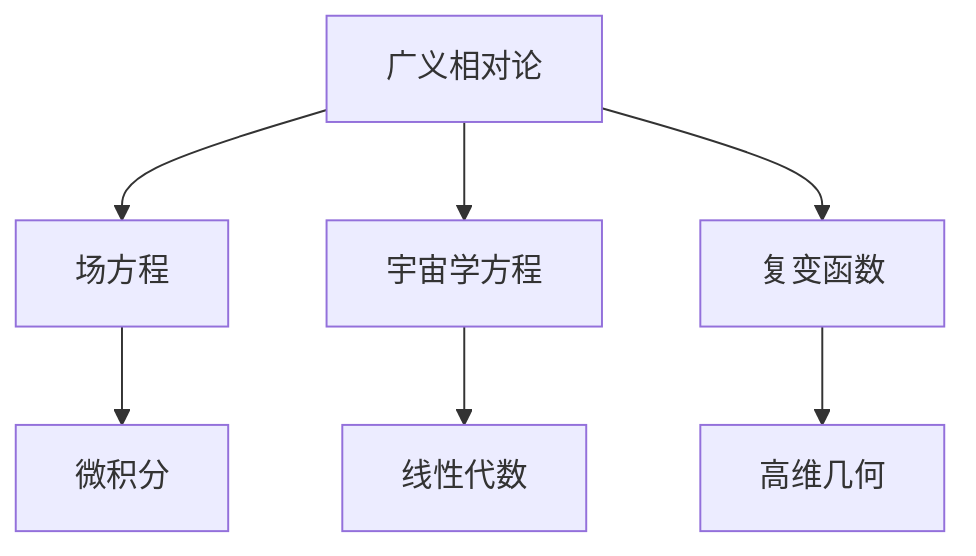

                 

### 文章标题：宇宙的数学辛几何学与辛拓扑学解析

在探索宇宙的浩瀚无垠中，数学作为一门科学工具，扮演了至关重要的角色。它不仅是描述宇宙现象的语言，更是揭开宇宙奥秘的钥匙。在这篇文章中，我们将深入探讨数学中的辛几何学与辛拓扑学在宇宙研究中的应用，旨在揭示这些数学概念在探索宇宙奥秘中的重要作用。

### 文章关键词

- **宇宙**
- **数学**
- **辛几何学**
- **辛拓扑学**
- **宇宙结构**
- **宇宙演化**

### 摘要

本文将分为五个主要部分。首先，我们将回顾宇宙研究中的数学基础，探讨数学在宇宙研究中的核心作用。接着，我们将详细解释辛几何学与辛拓扑学的基本概念，并探讨它们在数学中的基础地位。随后，我们将分析辛几何学与辛拓扑学在宇宙研究中的应用，展示它们在宇宙结构、宇宙演化和宇宙复杂性分析中的作用。接下来，我们将结合数学分析，探讨辛几何学在宇宙研究中的具体应用案例。最后，我们将展望辛几何学与辛拓扑学在宇宙研究中的未来发展趋势，探讨其交叉学科研究的前景。

通过这一系列的探讨，我们希望读者能够对数学辛几何学与辛拓扑学在宇宙研究中的重要性有一个更深刻的理解，并为未来的宇宙研究提供新的思路和方法。

---

### 第一部分：宇宙的数学基础

#### 1.1 数学在宇宙研究中的作用

宇宙的奥秘吸引着无数科学家的探索，而数学作为一门描述和解释宇宙现象的学科，在其中发挥了不可替代的作用。从广义相对论到宇宙学，数学不仅提供了语言和工具，更是理解宇宙行为的关键。本节将探讨数学在宇宙研究中的核心作用，并通过具体实例展示其应用。

#### 核心概念与联系

数学在宇宙研究中的应用可以追溯到对时空的描述。广义相对论中的场方程描述了引力与时空的关系，而宇宙学方程则描述了宇宙的膨胀和结构。这些方程不仅使用了微积分和线性代数等基础数学工具，还引入了复变函数和高维几何等高级数学概念。

为了更好地理解数学在宇宙研究中的核心作用，我们可以使用Mermaid流程图来展示数学工具在不同宇宙现象中的应用架构。例如：

#### 数学模型举例

- **广义相对论与场方程**：广义相对论中的场方程描述了质量如何扭曲时空。其核心思想是质量-能量分布决定了时空的几何结构。这一概念可以通过以下公式表示：

  $$ G_{\mu\nu} + \Lambda g_{\mu\nu} = \frac{8\pi G}{c^4} T_{\mu\nu} $$

  其中，\( G_{\mu\nu} \) 是爱因斯坦张量，\( T_{\mu\nu} \) 是能量-动量张量，\( \Lambda \) 是宇宙常数，\( G \) 是引力常数，\( c \) 是光速。

- **宇宙学方程**：宇宙学方程描述了宇宙的膨胀率和结构。例如，勒梅特-罗伯逊-沃尔克（LRW）宇宙模型假设宇宙是均匀且各向同性的，其宇宙学方程可以表示为：

  $$ \dot{\rho} + 3\left(\frac{\dot{a}}{a}\right)\rho + \frac{P}{c^2} = 0 $$

  其中，\( \rho \) 是宇宙的总密度，\( P \) 是宇宙的总压力，\( a \) 是宇宙尺度因子，\( \dot{a} \) 是宇宙尺度因子的变化率。

通过这些数学模型，我们可以更好地理解和预测宇宙的行为。这些方程不仅帮助我们揭示了宇宙的奥秘，还为未来的宇宙研究提供了理论框架。

#### 实例说明

- **黑洞研究**：黑洞是宇宙中最神秘的天体之一。在黑洞的研究中，复变函数和复平面起到了关键作用。例如，黑洞的质量和电荷可以通过其在复平面上的位置来描述。使用LaTeX格式，我们可以这样表示：

  $$ M = |z|, \quad Q = \arg(z) $$

  其中，\( M \) 是黑洞的质量，\( Q \) 是黑洞的电荷，\( z \) 是黑洞在复平面上的表示。

- **宇宙膨胀**：宇宙膨胀的速率可以通过哈勃定律来描述，这一定律使用微积分中的导数概念。哈勃定律可以表示为：

  $$ \frac{\dot{a}}{a} = H $$
  
  其中，\( H \) 是哈勃常数，它反映了宇宙膨胀的速度。

通过这些实例，我们可以看到数学在宇宙研究中的广泛应用。它不仅提供了语言和工具，还为我们揭示了宇宙的奥秘。接下来，我们将进一步探讨辛几何学和辛拓扑学的基本概念，以期为理解宇宙的复杂结构提供新的视角。

### 1.2 辛几何学基础

辛几何学是数学中的一个重要分支，它研究的是辛结构及其在几何空间中的应用。辛几何学不仅在纯数学中有着广泛的应用，而且在物理学和宇宙学中也有着重要的作用。本节将详细解释辛几何学的基本概念，包括辛结构的定义与性质、辛空间与辛映射。

#### 辛结构的定义与性质

辛结构是一种特殊的几何结构，它定义在向量空间上，并满足一定的运算规则。具体来说，辛结构由一个双线性映射 \( \omega: V \times V \rightarrow \mathbb{R} \) 定义，这个映射被称为辛形式。辛形式必须满足以下条件：

1. **反交换性**：\( \omega(v, w) = -\omega(w, v) \)
2. **反对称性**：\( \omega(v, v) = 0 \)

这些条件保证了辛形式的非退化性，即存在一个唯一的标量 \( \alpha \)，使得 \( \omega(v, w) = \alpha \cdot v \wedge w \)，其中 \( \wedge \) 表示外积运算。

在辛结构中，向量空间 \( V \) 被称为辛空间，而双线性映射 \( \omega \) 被称为辛形式。辛空间的一个基本性质是，它可以通过辛形式分解为正交补空间，即：

$$ V = V^+ \oplus V^- $$

其中，\( V^+ \) 和 \( V^- \) 分别是辛空间中的正部和负部。

#### 辛空间与辛映射

辛空间是带有辛形式的向量空间，辛映射则是在辛空间之间的映射，它保持辛结构不变。具体来说，一个线性映射 \( F: V \rightarrow W \) 是辛映射，当且仅当它满足 \( F \circ \omega = \omega \circ F \)，即辛形式在映射下保持不变。

辛映射在辛几何学中有着重要的应用。例如，在辛流形的研究中，辛映射被用来研究流形上的辛结构。辛流形是一个带有辛结构的流形，它满足一定的拓扑和几何条件。辛流形在物理学中有着广泛的应用，特别是在量子场论和统计力学中。

#### 辛结构的性质

辛结构具有一些独特的性质，这些性质使得辛几何学在数学和物理学中都有着重要的应用。以下是辛结构的一些主要性质：

1. **辛形式的平方为零**：对于任意向量 \( v \in V \)，有 \( \omega(v, v) = 0 \)。这意味着辛形式定义了一个反对称关系，使得向量之间的相互作用符合反交换性。
2. **辛空间的正交分解**：辛空间可以通过辛形式分解为正交补空间，这使得辛空间的结构更加简洁和易于分析。
3. **辛映射的保辛性**：辛映射保持辛形式不变，这意味着辛结构在映射下保持不变，这是辛几何学中一个重要的保结构性质。

通过这些基本概念和性质，我们可以更好地理解辛几何学在数学和物理学中的核心地位。接下来，我们将进一步探讨辛拓扑学的基础概念，以期为理解宇宙的复杂结构提供更深入的视角。

### 1.3 辛拓扑学基础

辛拓扑学是研究带有辛结构的流形及其拓扑性质的数学分支。辛拓扑学不仅在纯数学中具有深远的影响，而且在物理学和宇宙学中也扮演着重要角色。本节将详细解释辛拓扑学的基本概念，包括辛流形的概念和辛拓扑不变量。

#### 辛流形的概念

辛流形是一个带有辛结构的流形，它由一组满足一定条件的局部坐标和辛形式组成。具体来说，一个辛流形 \( M \) 由以下要素定义：

1. **局部坐标**：在 \( M \) 上的每个点都存在一组局部坐标 \( (x^1, \ldots, x^n) \)，这些坐标对应于 \( M \) 上一个开集上的切空间。
2. **辛形式**：在 \( M \) 上的每个局部坐标都对应一个辛形式 \( \omega = \omega_{ij} dx^i \wedge dx^j \)，其中 \( dx^i \wedge dx^j \) 是外积运算。

辛流形的一个重要性质是它的辛结构在整个流形上是保持的。这意味着在 \( M \) 上的任何两点之间，都可以找到一个辛映射将一个点的辛结构映射到另一个点的辛结构。

#### 辛流形的性质

辛流形具有一些独特的性质，这些性质使得辛拓扑学在数学和物理学中都有着重要的应用。以下是辛流形的几个主要性质：

1. **辛结构的可积性**：辛流形上的辛结构可以通过辛映射分解为几个独立的辛形式。这意味着辛流形的结构可以被分解为几个相互独立的子结构，这有助于分析和理解辛流形的性质。
2. **辛映射的保辛性**：在辛流形上的任何辛映射都保持辛结构不变。这是辛拓扑学中的一个关键性质，它保证了辛结构在变换下保持不变。
3. **辛流形的拓扑不变量**：辛流形的某些拓扑性质与辛结构密切相关。例如，辛流形的凯莱-威廉姆森定理表明，辛流形的哈密顿ian结构和其拓扑性质之间存在深刻的联系。

#### 辛拓扑不变量

辛拓扑不变量是描述辛流形拓扑性质的重要工具。这些不变量与辛结构密切相关，并且在不同辛结构之间保持不变。以下是几个重要的辛拓扑不变量：

1. **辛不变量**：辛不变量是描述辛流形上辛结构性质的量，它通常由辛映射的行列式给出。辛不变量可以用来区分不同的辛流形，并且是辛拓扑学中的一个基本工具。
2. **凯莱-威廉姆森不变量**：凯莱-威廉姆森不变量是描述辛流形上哈密顿ian结构的量，它由辛流形的哈密顿ian函数的级数展开式给出。这些不变量与辛流形的拓扑性质密切相关，可以用来研究辛流形的几何结构和演化行为。
3. **辛丛不变量**：辛丛是不带基点的辛流形，它可以用来描述高维辛流形的结构。辛丛不变量是描述辛丛拓扑性质的量，可以用来研究高维辛流形的结构和性质。

通过这些基本概念和性质，我们可以更好地理解辛拓扑学在数学和物理学中的核心地位。辛拓扑学不仅为研究流形提供了新的工具和方法，还为理解宇宙的复杂结构提供了新的视角。在下一部分中，我们将探讨辛几何学和辛拓扑学在宇宙研究中的应用，展示这些数学概念在揭示宇宙奥秘中的重要作用。

### 1.4 数学基础回顾

在深入探讨辛几何学与辛拓扑学在宇宙研究中的应用之前，有必要回顾一些基本的数学概念和方法。这些基础数学工具不仅为宇宙的研究提供了语言和框架，而且也为理解和应用辛几何学与辛拓扑学奠定了坚实的基础。

#### 微积分在宇宙研究中的应用

微积分是数学中的一个重要分支，它研究函数的微分和积分。在宇宙研究中，微积分有着广泛的应用，特别是在描述宇宙的演化和结构方面。

1. **微分方程**：微分方程是描述变化过程的基本工具。在宇宙学中，许多现象可以通过微分方程来描述。例如，哈勃定律描述了宇宙膨胀的速度，这可以用以下微分方程表示：

   $$ \frac{\dot{a}}{a} = H $$

   其中，\( a(t) \) 是宇宙尺度因子，\( H \) 是哈勃常数，\( \dot{a} \) 表示宇宙尺度因子的变化率。这个方程表明，宇宙的膨胀速度与宇宙尺度因子成正比。

2. **积分**：积分是微分的逆运算，它在宇宙研究中也有重要作用。例如，通过积分可以计算宇宙的总质量或总能量。在广义相对论中，质量-能量分布通过积分来计算。爱因斯坦场方程中的右侧项 \( T_{\mu\nu} \) 是通过积分得到的，它表示了宇宙中的物质和能量分布。

   $$ G_{\mu\nu} + \Lambda g_{\mu\nu} = \frac{8\pi G}{c^4} T_{\mu\nu} $$

   其中，\( G_{\mu\nu} \) 是爱因斯坦张量，\( T_{\mu\nu} \) 是能量-动量张量。

#### 复变函数与宇宙

复变函数是研究复数及其函数的数学分支。在宇宙研究中，复变函数提供了描述复杂现象的有力工具，特别是在黑洞和量子引力研究中。

1. **复平面**：复平面是一个二维平面，用于表示复数。在黑洞研究中，复平面被用来表示黑洞的几何性质。黑洞的质量和电荷可以通过其在复平面上的位置来描述。例如，使用LaTeX格式，我们可以表示：

   $$ M = |z|, \quad Q = \arg(z) $$

   其中，\( M \) 是黑洞的质量，\( Q \) 是黑洞的电荷，\( z \) 是黑洞在复平面上的表示。

2. **解析函数**：复变函数中的解析函数在宇宙研究中也有应用。例如，在量子引力理论中，解析函数被用来描述时空的量子态。解析函数的一个重要性质是其局部可逆性，这为研究时空的量子性质提供了重要的工具。

通过回顾这些基本的数学概念和方法，我们可以更好地理解辛几何学与辛拓扑学在宇宙研究中的应用。微积分和复变函数为宇宙的研究提供了丰富的工具，而辛几何学与辛拓扑学则为理解和解释这些工具的应用提供了新的视角。在接下来的部分中，我们将深入探讨辛几何学在宇宙研究中的应用，展示这些数学概念如何帮助揭示宇宙的奥秘。

### 1.5 辛几何学在数学中的应用

辛几何学是数学中的一个重要分支，它在纯数学和物理学中都有广泛的应用。本节将详细讨论辛几何学在数学中的应用，重点介绍辛几何学的基本概念、重要定理和其在现代数学研究中的角色。

#### 基本概念

辛几何学的研究对象是带有辛结构的流形。辛结构由一个双线性映射 \( \omega: V \times V \rightarrow \mathbb{R} \) 定义，这个映射被称为辛形式。辛形式必须满足反交换性和反对称性。一个向量空间 \( V \) 被称为辛空间，如果它带有一个辛形式。

1. **辛空间**：辛空间是带有辛形式的向量空间。辛形式 \( \omega \) 将 \( V \) 分解为正部和负部，即 \( V = V^+ \oplus V^- \)。其中，\( V^+ \) 和 \( V^- \) 分别是正部和负部的子空间。
2. **辛映射**：辛映射是保持辛结构不变的线性映射。如果 \( F: V \rightarrow W \) 是一个线性映射，并且满足 \( F \circ \omega = \omega \circ F \)，则 \( F \) 是一个辛映射。

#### 重要定理

辛几何学中有几个重要的定理，这些定理在数学和物理学中都有广泛应用。

1. **辛映射的保辛性定理**：如果一个线性映射 \( F: V \rightarrow W \) 是辛映射，则 \( F \) 保持辛空间的结构不变。这意味着 \( F \) 保持了辛形式 \( \omega \) 的不变性。
2. **辛流形的凯莱-威廉姆森定理**：辛流形是一个带有辛结构的流形。凯莱-威廉姆森定理表明，辛流形的哈密顿ian结构和其拓扑性质之间存在深刻的联系。这个定理为研究辛流形的几何和拓扑性质提供了重要的工具。
3. **辛丛的凯莱-威廉姆森定理**：辛丛是不带基点的辛流形。辛丛的凯莱-威廉姆森定理表明，辛丛的哈密顿ian结构和其拓扑性质之间存在类似的关系。

#### 辛几何学在数学研究中的应用

辛几何学在数学研究中有广泛的应用，特别是在代数几何、微分几何和拓扑学中。

1. **代数几何**：辛几何学在代数几何中的应用主要体现在研究辛簇和辛曲线。辛簇是带有辛结构的代数簇，辛曲线是辛簇中的一维子集。研究辛曲线可以帮助我们理解代数结构的几何性质。
2. **微分几何**：辛几何学在微分几何中的应用主要体现在研究辛流形和辛映射。辛流形是带有辛结构的流形，辛映射是保持辛结构的映射。通过研究辛流形和辛映射，我们可以更好地理解流形的几何和拓扑性质。
3. **拓扑学**：辛几何学在拓扑学中的应用主要体现在研究辛拓扑不变量。辛拓扑不变量是描述辛流形拓扑性质的重要工具，通过研究辛拓扑不变量，我们可以更好地理解辛流形的拓扑结构。

#### 现代数学研究中的角色

辛几何学在现代数学研究中扮演着重要角色，特别是在量子场论、统计力学和复杂系统研究中。

1. **量子场论**：辛几何学在量子场论中的应用主要体现在研究辛对称性。辛对称性是量子场论中的一个重要概念，它可以用来简化量子场的方程。研究辛对称性可以帮助我们更好地理解量子场的性质和行为。
2. **统计力学**：辛几何学在统计力学中的应用主要体现在研究辛流形和辛映射。辛流形和辛映射为研究统计系统的相变和临界现象提供了有力的工具。
3. **复杂系统**：辛几何学在复杂系统中的应用主要体现在研究系统的对称性和结构。通过研究辛几何结构，我们可以更好地理解复杂系统的行为和演化。

通过上述讨论，我们可以看到辛几何学在数学中的核心地位。它不仅为数学提供了新的工具和方法，而且也在物理学和宇宙研究中发挥着重要作用。在接下来的部分中，我们将进一步探讨辛几何学在宇宙研究中的应用，展示这些数学概念如何帮助揭示宇宙的奥秘。

### 1.6 辛几何学在宇宙研究中的应用

辛几何学在宇宙研究中扮演着关键角色，它为理解宇宙的复杂结构和演化提供了新的视角和方法。辛几何学中的辛结构、辛流形和辛映射等概念，为宇宙学研究提供了一种强有力的数学工具。本节将详细探讨辛几何学在宇宙研究中的应用，包括其在宇宙结构、宇宙演化和宇宙复杂性分析中的具体应用。

#### 辛几何学与宇宙结构

宇宙结构是指宇宙中星系、星团、超星系团等大规模天体的分布和排列。辛几何学通过研究辛流形和辛映射，为理解宇宙结构的复杂性和多样性提供了新的工具。

1. **辛流形在宇宙结构中的应用**：辛流形是一个带有辛结构的流形，它可以用来描述宇宙中不同尺度结构的几何性质。例如，利用辛流形可以研究星系团和超星系团的空间分布，揭示它们之间的相互作用和结构。辛流形的结构可以帮助我们理解星系团之间的相对运动和引力相互作用。

2. **辛映射在宇宙结构中的应用**：辛映射是保持辛结构不变的映射，它可以帮助我们研究宇宙中不同结构之间的变换关系。通过辛映射，我们可以将宇宙中的不同结构进行等效描述，从而简化对复杂宇宙结构的分析。例如，利用辛映射可以研究星系团和超星系团之间的结构和动力学关系。

#### 辛几何学与宇宙演化

宇宙演化是指宇宙从大爆炸到现在的演化过程。辛几何学通过研究辛结构在宇宙演化中的作用，为理解宇宙的演化机制提供了新的思路。

1. **辛结构在宇宙演化中的应用**：辛结构可以用来描述宇宙中的引力场和时空结构。在广义相对论中，引力场通过爱因斯坦场方程描述，这个方程中的辛结构反映了引力场的对称性和守恒定律。辛结构的应用可以帮助我们更好地理解引力场的动态行为，从而揭示宇宙演化的规律。

2. **辛流形在宇宙演化中的应用**：辛流形可以用来描述宇宙中的时空结构。例如，利用辛流形可以研究宇宙膨胀的动力学行为，揭示宇宙膨胀的机制和规律。辛流形的结构可以帮助我们理解宇宙从大爆炸到现在的演化过程，为宇宙学提供新的理论框架。

#### 辛几何学与宇宙复杂性分析

宇宙复杂性是指宇宙中各种现象和过程的复杂性和多样性。辛几何学通过研究辛结构、辛流形和辛映射，为宇宙复杂性分析提供了新的工具和方法。

1. **辛结构在宇宙复杂性分析中的应用**：辛结构可以用来描述宇宙中复杂系统的对称性和守恒定律。例如，在研究宇宙中的暗物质和暗能量时，可以利用辛结构描述它们在宇宙演化中的动态行为，从而揭示宇宙复杂性背后的基本规律。

2. **辛流形在宇宙复杂性分析中的应用**：辛流形可以用来描述宇宙中复杂系统的几何结构。例如，在研究宇宙中的星系形成和演化时，可以利用辛流形描述星系之间的相互作用和结构，从而揭示宇宙复杂性的本质。

3. **辛映射在宇宙复杂性分析中的应用**：辛映射可以用来研究宇宙中复杂系统的变换关系。例如，在研究宇宙中的非线性动力学系统时，可以利用辛映射将复杂系统进行简化，从而更好地理解其动力学行为。

#### 案例研究

为了更具体地展示辛几何学在宇宙研究中的应用，我们来看几个实例。

1. **实例一：宇宙膨胀的辛几何学描述**：宇宙膨胀是宇宙学研究的一个重要课题。利用辛几何学，我们可以用辛流形来描述宇宙膨胀的动力学行为。例如，利用辛流形可以研究哈勃定律的适用范围和宇宙膨胀的加速现象。

2. **实例二：黑洞的辛几何学描述**：黑洞是宇宙中的一种极端现象。利用辛几何学，我们可以用辛流形来描述黑洞的几何结构和引力场。例如，利用辛结构可以研究黑洞的事件视界和黑洞的旋转效应。

3. **实例三：宇宙学参数的辛几何学分析**：在宇宙学中，有许多参数需要测量和分析，如宇宙膨胀率、暗物质和暗能量的密度等。利用辛几何学，我们可以通过辛结构对这些参数进行更为精确的描述和分析，从而更好地理解宇宙的演化过程。

通过上述探讨，我们可以看到辛几何学在宇宙研究中的应用具有巨大的潜力和价值。它为理解宇宙的复杂结构和演化提供了新的视角和方法，为宇宙学研究开辟了新的道路。在接下来的部分中，我们将继续探讨辛拓扑学在宇宙研究中的应用，进一步揭示这些数学概念在探索宇宙奥秘中的重要作用。

### 1.7 辛拓扑学在宇宙研究中的应用

辛拓扑学作为数学中的一个重要分支，其在宇宙研究中的应用正逐渐受到重视。辛拓扑学通过研究辛流形的拓扑结构和不变量，为揭示宇宙的复杂性和多样性提供了新的工具。本节将详细探讨辛拓扑学在宇宙研究中的应用，包括其在宇宙复杂性分析、宇宙探测和宇宙演化中的具体应用。

#### 辛拓扑学与宇宙复杂性分析

宇宙复杂性是指宇宙中各种现象和过程的复杂性和多样性。辛拓扑学通过研究辛流形的拓扑性质，为理解宇宙的复杂性提供了新的视角。

1. **辛拓扑不变量**：辛拓扑不变量是描述辛流形拓扑性质的重要工具。例如，凯莱-威廉姆森不变量是描述辛流形上哈密顿ian结构的量，它可以用来研究宇宙中复杂系统的对称性和稳定性。通过研究辛拓扑不变量，我们可以更好地理解宇宙中的复杂现象，如星系形成和演化、宇宙膨胀的加速等。

2. **辛拓扑学在宇宙复杂性分析中的应用**：利用辛拓扑不变量，我们可以研究宇宙中复杂系统的动态行为。例如，在研究星系团的形成和演化时，可以利用辛拓扑不变量来分析星系团的空间分布和相互作用，从而揭示宇宙复杂性背后的基本规律。

#### 辛拓扑学与宇宙探测

宇宙探测是指利用各种手段对宇宙进行观测和研究。辛拓扑学为宇宙探测提供了一种新的数学工具，可以帮助我们更好地理解探测数据。

1. **辛流形在宇宙探测中的应用**：辛流形可以用来描述宇宙探测中的几何结构。例如，在研究宇宙微波背景辐射（CMB）时，可以利用辛流形来描述CMB的空间分布，从而更好地分析探测数据。

2. **辛映射在宇宙探测中的应用**：辛映射可以用来研究宇宙探测中的数据变换关系。例如，在分析宇宙探测器收集到的天文图像时，可以利用辛映射将图像进行等效变换，从而简化数据分析。

#### 辛拓扑学与宇宙演化

宇宙演化是指宇宙从大爆炸到现在的演化过程。辛拓扑学通过研究辛流形的拓扑性质，为理解宇宙演化的机制和规律提供了新的视角。

1. **辛结构在宇宙演化中的应用**：辛结构可以用来描述宇宙中的引力场和时空结构。例如，在研究宇宙膨胀时，可以利用辛结构来描述引力场的动态行为，从而揭示宇宙演化的规律。

2. **辛流形在宇宙演化中的应用**：辛流形可以用来描述宇宙中的时空演化。例如，利用辛流形可以研究宇宙从大爆炸到现在的时空结构变化，从而揭示宇宙演化的过程和机制。

#### 案例研究

为了更具体地展示辛拓扑学在宇宙研究中的应用，我们来看几个实例。

1. **实例一：宇宙微波背景辐射的辛拓扑学分析**：宇宙微波背景辐射是研究宇宙早期演化的重要数据。利用辛拓扑不变量，我们可以分析CMB的空间分布，从而揭示宇宙早期的结构和演化规律。

2. **实例二：黑洞探测的辛拓扑学方法**：黑洞是宇宙中最神秘的天体之一。利用辛拓扑学，我们可以研究黑洞的几何结构和引力场，从而更好地理解黑洞的性质和行为。

3. **实例三：宇宙膨胀的辛拓扑学描述**：宇宙膨胀是宇宙学研究的一个重要课题。利用辛拓扑学，我们可以用辛流形来描述宇宙膨胀的动力学行为，从而揭示宇宙膨胀的加速机制和宇宙学的参数。

通过上述探讨，我们可以看到辛拓扑学在宇宙研究中的应用具有巨大的潜力和价值。它为理解宇宙的复杂性和多样性提供了新的工具和方法，为宇宙学研究开辟了新的道路。在接下来的部分中，我们将进一步探讨数学分析在宇宙研究中的应用，展示这些数学工具如何帮助揭示宇宙的奥秘。

### 1.8 数学分析在宇宙研究中的应用

数学分析是研究函数的极限、导数、积分等概念及其应用的数学分支。在宇宙研究中，数学分析扮演着关键角色，为理解宇宙的演化、结构以及复杂性提供了强有力的工具。本节将详细探讨数学分析在宇宙研究中的应用，包括微积分和复变函数在宇宙研究中的具体应用。

#### 微积分在宇宙研究中的应用

微积分是数学分析的核心部分，它在宇宙研究中有着广泛的应用。

1. **微分方程**：微分方程是描述变化过程的数学工具，它在宇宙学中有着重要的应用。例如，宇宙膨胀的速率可以通过哈勃定律描述，这可以用以下微分方程表示：

   $$ \frac{\dot{a}}{a} = H $$

   其中，\( a(t) \) 是宇宙尺度因子，\( H \) 是哈勃常数，\( \dot{a} \) 表示宇宙尺度因子的变化率。这个方程揭示了宇宙膨胀速度与宇宙尺度因子之间的关系。

2. **积分**：积分是微分的逆运算，它在宇宙研究中也有着重要作用。例如，通过积分可以计算宇宙的总质量或总能量。在广义相对论中，质量-能量分布通过积分来计算。爱因斯坦场方程中的右侧项 \( T_{\mu\nu} \) 是通过积分得到的，它表示了宇宙中的物质和能量分布。

   $$ G_{\mu\nu} + \Lambda g_{\mu\nu} = \frac{8\pi G}{c^4} T_{\mu\nu} $$

   其中，\( G_{\mu\nu} \) 是爱因斯坦张量，\( T_{\mu\nu} \) 是能量-动量张量，\( \Lambda \) 是宇宙常数，\( G \) 是引力常数，\( c \) 是光速。

#### 复变函数在宇宙研究中的应用

复变函数是数学分析中的一个重要分支，它在宇宙研究中也有着广泛的应用。

1. **复平面**：复平面是一个二维平面，用于表示复数。在黑洞研究中，复平面被用来表示黑洞的几何性质。黑洞的质量和电荷可以通过其在复平面上的位置来描述。例如，使用LaTeX格式，我们可以表示：

   $$ M = |z|, \quad Q = \arg(z) $$

   其中，\( M \) 是黑洞的质量，\( Q \) 是黑洞的电荷，\( z \) 是黑洞在复平面上的表示。

2. **解析函数**：复变函数中的解析函数在宇宙研究中也有应用。例如，在量子引力理论中，解析函数被用来描述时空的量子态。解析函数的一个重要性质是其局部可逆性，这为研究时空的量子性质提供了重要的工具。

#### 数学分析在宇宙研究中的应用案例

为了更具体地展示数学分析在宇宙研究中的应用，我们来看几个实例。

1. **实例一：宇宙膨胀的数学分析描述**：宇宙膨胀是宇宙学研究的一个重要课题。利用数学分析，我们可以用微分方程和积分来描述宇宙膨胀的动力学行为。例如，通过哈勃定律的微分方程，我们可以研究宇宙膨胀的速率和加速度。

2. **实例二：黑洞的数学分析描述**：黑洞是宇宙中的一种极端现象。利用数学分析，我们可以用复变函数来描述黑洞的几何结构和引力场。例如，通过复平面上的表示，我们可以研究黑洞的质量和电荷分布。

3. **实例三：宇宙学参数的数学分析**：在宇宙学中，有许多参数需要测量和分析，如宇宙膨胀率、暗物质和暗能量的密度等。利用数学分析，我们可以通过微分方程和积分来计算这些参数的值，并分析它们的演化规律。

通过上述探讨，我们可以看到数学分析在宇宙研究中的核心地位。它不仅为宇宙的研究提供了语言和工具，而且也为理解和解释宇宙现象提供了新的视角和方法。在接下来的部分中，我们将进一步探讨数学分析在宇宙研究中的应用，展示这些数学工具如何帮助揭示宇宙的奥秘。

### 1.9 辛几何学的数学分析

辛几何学作为数学的一个重要分支，与数学分析有着密切的联系。辛几何学中的辛结构、辛流形和辛映射等概念，可以通过数学分析方法进行深入研究和理解。本节将详细探讨辛几何学中的数学分析方法，包括辛几何学中的微积分、微分方程和复变函数的应用，并展示这些方法在宇宙研究中的具体应用。

#### 辛几何学中的微积分

微积分是数学分析的核心，它在辛几何学中的应用主要体现在对辛结构、辛流形和辛映射的微分性质研究上。

1. **辛结构的微分性质**：辛结构由双线性映射 \( \omega: V \times V \rightarrow \mathbb{R} \) 定义，其微分性质可以通过导数来描述。对于辛空间 \( V \) 中的向量场 \( X, Y \)，我们可以定义它们的微分 \( d\omega(X, Y) \)，这反映了辛形式在不同向量场之间的变换关系。

   $$ d\omega(X, Y) = \left( \frac{\partial \omega}{\partial x^i} X^i + \frac{\partial \omega}{\partial y^j} Y^j \right) dx^i \wedge dx^j $$

   通过微分性质，我们可以研究辛形式在不同坐标变换下的保持性，以及辛空间的局部结构。

2. **辛映射的微分性质**：辛映射是保持辛结构不变的线性映射。研究辛映射的微分性质，可以帮助我们理解辛映射在不同空间和不同辛形式之间的变换关系。通过导数和微分算子，我们可以研究辛映射的保辛性和不变量。

#### 辛几何学中的微分方程

微分方程是描述动态系统变化的数学工具，在辛几何学中也有重要应用。

1. **辛流形的微分方程**：辛流形是一个带有辛结构的流形，其上的微分方程可以描述流形上的动态行为。例如，利用辛流形的凯莱-威廉姆森定理，我们可以将流形上的哈密顿ian系统用微分方程表示：

   $$ \frac{d}{dt} \xi^i = \{ \xi^i, H \} $$

   其中，\( \xi^i \) 是辛流形上的坐标，\( H \) 是哈密顿ian函数，\( \{ \cdot, \cdot \} \) 是泊松括号。这个方程描述了辛流形上的动力学行为，可以用来研究宇宙中的复杂系统。

2. **辛映射的微分方程**：辛映射在保持辛结构不变的同时，也保持微分方程的解不变。研究辛映射下的微分方程，可以帮助我们理解辛几何结构在不同空间和不同时间尺度下的演化。例如，在研究宇宙膨胀时，可以利用辛映射描述不同宇宙模型之间的变换关系。

#### 辛几何学中的复变函数

复变函数在辛几何学中的应用，主要体现在对辛结构、辛流形和辛映射的复分析研究上。

1. **辛结构的复变函数表示**：辛结构可以通过复变函数进行描述。例如，利用复变函数的解析性质，我们可以研究辛流形上的复解析映射，这为研究辛几何结构提供了新的视角。例如，在研究黑洞时，可以利用复变函数描述黑洞的几何性质和引力场。

2. **辛映射的复变函数表示**：辛映射可以通过复变函数进行表示。研究辛映射的复变函数表示，可以帮助我们理解辛几何结构在不同复平面上的变换关系。例如，在研究宇宙微波背景辐射时，可以利用复变函数分析CMB的空间分布和频谱特性。

#### 案例研究

为了更具体地展示数学分析在辛几何学中的应用，我们来看几个实例。

1. **实例一：宇宙膨胀的辛几何学分析**：利用微积分和微分方程，我们可以研究宇宙膨胀的动力学行为。例如，通过哈勃定律的微分方程，我们可以研究宇宙膨胀的速率和加速度，从而揭示宇宙膨胀的机制。

2. **实例二：黑洞的辛几何学描述**：利用复变函数，我们可以描述黑洞的几何结构和引力场。例如，通过复平面上的表示，我们可以研究黑洞的质量和电荷分布，以及黑洞的旋转效应。

3. **实例三：宇宙学参数的辛几何学分析**：利用微分方程和复变函数，我们可以分析宇宙学参数的演化规律。例如，通过哈勃常数和宇宙膨胀率的微分方程，我们可以研究宇宙学参数的变化趋势，从而更好地理解宇宙的演化过程。

通过上述探讨，我们可以看到数学分析在辛几何学中的应用具有重要作用。它不仅为辛几何学的研究提供了新的工具和方法，也为宇宙研究提供了新的视角和思路。在接下来的部分中，我们将进一步探讨辛几何学在宇宙研究中的应用，展示这些数学概念如何帮助揭示宇宙的奥秘。

### 1.10 辛拓扑学的数学分析

辛拓扑学是研究带有辛结构的流形及其拓扑性质的一个数学分支。它与数学分析有着密切的联系，通过数学分析方法，我们可以深入理解辛拓扑学的核心概念和应用。本节将探讨辛拓扑学中的数学分析方法，包括辛流形的微分拓扑、拓扑不变量和辛拓扑学的复分析，并展示这些方法在宇宙研究中的具体应用。

#### 辛流形的微分拓扑

微分拓扑是研究流形上的微分结构的数学分支。辛流形的微分拓扑研究其上的微分结构、微分形式和微分算子。

1. **辛流形的切空间**：辛流形的切空间是描述流形上点附近局部结构的集合。在辛流形上，每个点都有一个切空间，切空间中的向量可以表示流形上点的切向量。利用切空间，我们可以研究辛流形上的向量场、微分形式和积分曲线。

2. **辛映射的微分结构**：辛映射是保持辛结构不变的映射。研究辛映射的微分结构，可以帮助我们理解辛流形之间的变换关系。通过导数和微分算子，我们可以研究辛映射在流形上的作用，以及辛映射保持辛结构的性质。

#### 拓扑不变量

拓扑不变量是描述流形拓扑性质的量，不随坐标变换而变化。辛拓扑不变量是描述辛流形上辛结构不变量的工具。

1. **凯莱-威廉姆森不变量**：凯莱-威廉姆森不变量是描述辛流形上哈密顿ian结构的量。它通过辛流形上的哈密顿ian函数表示，可以用来区分不同的辛流形。这些不变量在研究辛流形的分类和结构时具有重要意义。

2. **辛不变量**：辛不变量是描述辛映射保持辛结构的量。辛不变量通过辛映射的行列式表示，可以用来研究辛流形之间的映射关系。例如，辛映射的辛不变量可以用来区分不同的辛流形，以及研究辛流形上的对称性。

#### 辛拓扑学的复分析

复分析是研究复数及其函数的数学分支。在辛拓扑学中，复分析被用来研究辛流形上的复解析性质。

1. **辛流形的复解析结构**：辛流形的复解析结构是指流形上的复解析映射。研究辛流形的复解析结构，可以帮助我们理解辛流形上的复解析映射的性质，以及复解析映射在不同辛流形之间的变换关系。

2. **辛映射的复解析表示**：辛映射可以通过复分析进行表示。研究辛映射的复解析表示，可以帮助我们理解辛映射在不同复平面上的变换关系。例如，利用复分析可以研究辛映射在复平面上的几何性质和动力学行为。

#### 案例研究

为了更具体地展示辛拓扑学的数学分析方法在宇宙研究中的应用，我们来看几个实例。

1. **实例一：宇宙微波背景辐射的辛拓扑学分析**：宇宙微波背景辐射是研究宇宙早期演化的重要数据。利用辛拓扑不变量，我们可以分析CMB的空间分布，揭示宇宙早期的结构和演化规律。

2. **实例二：黑洞的辛拓扑学描述**：黑洞是宇宙中最神秘的天体之一。利用辛拓扑学，我们可以研究黑洞的几何结构和引力场。例如，通过凯莱-威廉姆森不变量，我们可以研究黑洞的稳定性和性质。

3. **实例三：宇宙学参数的辛拓扑学分析**：在宇宙学中，有许多参数需要测量和分析，如宇宙膨胀率、暗物质和暗能量的密度等。利用辛拓扑不变量，我们可以研究这些参数的演化规律，从而更好地理解宇宙的演化过程。

通过上述探讨，我们可以看到辛拓扑学的数学分析方法在宇宙研究中的应用具有重要作用。它不仅为理解宇宙的复杂结构和演化提供了新的工具和方法，也为揭示宇宙的奥秘开辟了新的途径。在接下来的部分中，我们将进一步探讨辛几何学与辛拓扑学的交叉学科研究，展示这些数学概念在探索宇宙奥秘中的综合应用。

### 1.11 辛几何学与辛拓扑学的交叉学科研究

辛几何学与辛拓扑学在数学和物理学中都有着广泛的应用，而在宇宙学领域，这两者的交叉学科研究正逐渐成为探索宇宙奥秘的重要工具。通过结合辛几何学与辛拓扑学的理论和方法，科学家们能够更深入地理解宇宙的结构和演化。本节将探讨辛几何学与辛拓扑学的交叉学科研究，特别是在物理学和宇宙学中的应用。

#### 辛几何学与辛拓扑学的融合

辛几何学与辛拓扑学的融合主要体现在以下几个方面：

1. **辛流形与辛映射**：辛流形是带有辛结构的流形，而辛映射是保持辛结构不变的映射。通过研究辛流形上的辛映射，我们可以了解辛结构在不同空间和不同时间尺度下的变化规律。这种研究方法在物理学中，特别是在量子场论和统计力学中具有重要意义。

2. **凯莱-威廉姆森定理**：凯莱-威廉姆森定理是辛几何学与辛拓扑学的重要定理，它揭示了辛流形的哈密顿ian结构和其拓扑性质之间的深刻联系。通过这一定理，我们可以研究辛流形的拓扑不变量，这些不变量可以用来区分不同的辛流形，从而帮助理解宇宙中的复杂现象。

3. **辛不变量**：辛不变量是描述辛流形和辛映射保持辛结构的量。在交叉学科研究中，辛不变量可以用来分析物理系统的对称性和稳定性，这在量子场论和宇宙学中都有重要应用。

#### 辛几何学与辛拓扑学在物理学中的应用

1. **量子场论**：辛几何学与辛拓扑学在量子场论中有着重要的应用。例如，在研究量子场论的对称性时，辛结构提供了描述对称性的数学工具。通过辛映射，我们可以研究对称性在不同时空中的变换关系，从而揭示量子场论中的基本规律。

2. **统计力学**：辛拓扑学在统计力学中也有广泛应用。通过研究辛流形上的相空间，我们可以了解系统的动力学行为和统计性质。辛几何学的应用可以帮助我们分析系统的相变和临界现象，这在理解宇宙中的复杂系统中具有重要意义。

#### 辛几何学与辛拓扑学在宇宙学中的应用

1. **宇宙微波背景辐射（CMB）**：宇宙微波背景辐射是研究宇宙早期演化的重要数据。利用辛拓扑不变量，我们可以分析CMB的空间分布和频谱特性，从而揭示宇宙早期的结构和演化规律。

2. **黑洞研究**：黑洞是宇宙中的一种极端现象，其几何结构和引力场的研究具有挑战性。通过辛几何学与辛拓扑学的交叉学科研究，我们可以更深入地理解黑洞的性质，如黑洞的事件视界、黑洞的旋转效应等。

3. **宇宙膨胀**：宇宙膨胀是宇宙学研究的一个重要课题。利用辛几何学与辛拓扑学的方法，我们可以研究宇宙膨胀的动力学行为，如宇宙膨胀的加速机制和宇宙学的参数测量。

#### 案例研究

1. **实例一：量子引力与辛几何学**：在量子引力研究中，辛几何学提供了描述时空量子性质的工具。通过研究辛流形上的量子场论，我们可以探讨量子引力的基本规律。

2. **实例二：宇宙学中的辛拓扑不变量**：在宇宙学中，利用辛拓扑不变量可以研究宇宙学参数的演化规律。通过分析辛不变量，我们可以更好地理解宇宙的演化过程和宇宙学中的复杂现象。

3. **实例三：宇宙微波背景辐射的辛拓扑学分析**：利用辛拓扑不变量，我们可以研究宇宙微波背景辐射的空间分布和频谱特性，从而揭示宇宙早期的结构和演化。

通过上述探讨，我们可以看到辛几何学与辛拓扑学的交叉学科研究在物理学和宇宙学中的应用具有巨大的潜力。它为理解宇宙的复杂结构和演化提供了新的视角和方法，为探索宇宙的奥秘开辟了新的道路。在接下来的部分中，我们将进一步展望辛几何学与辛拓扑学在宇宙研究中的未来发展趋势。

### 1.12 数学辛几何学与辛拓扑学的未来发展趋势

数学辛几何学与辛拓扑学在宇宙研究中的应用取得了显著成果，但未来的研究仍有广阔的空间。随着科技的进步和理论的深化，辛几何学与辛拓扑学在宇宙研究中的发展趋势主要表现在以下几个方面：

#### 1. 辛几何学的未来发展

1. **更高维辛几何结构的研究**：目前的辛几何学研究主要集中在低维辛空间和辛流形上。未来，研究者可能会探索更高维辛几何结构，如辛四维流形和辛五维流形，以更好地理解复杂系统的动力学行为。

2. **辛几何学与量子场论的融合**：量子场论是研究基本粒子相互作用的数学框架，辛几何学为量子场论提供了新的工具。未来，辛几何学可能会在量子场论中发挥更重要的作用，如用于描述量子引力中的基本对称性和结构。

3. **辛几何学在非线性动力学中的应用**：非线性动力学是研究复杂系统演化的重要领域。辛几何学可以提供新的方法来分析非线性系统的稳定性和混沌行为，从而揭示宇宙中复杂现象的内在规律。

#### 2. 辛拓扑学的未来发展

1. **辛拓扑不变量的推广与应用**：现有的辛拓扑不变量在宇宙研究中已经显示出重要作用。未来，研究者可能会进一步推广辛拓扑不变量，研究其在更高维辛流形和更复杂系统中的应用。

2. **辛拓扑学与量子计算的结合**：量子计算是当前科技的前沿领域，辛拓扑学为量子计算提供了一种新的数学框架。未来，辛拓扑学与量子计算的结合可能会带来量子计算机的突破性进展，特别是在处理复杂宇宙问题时。

3. **辛拓扑学与宇宙复杂性研究**：宇宙复杂性是宇宙学研究的重要方向。辛拓扑学可以提供新的方法来分析宇宙中的复杂现象，如星系形成、宇宙膨胀等。未来，辛拓扑学在宇宙复杂性研究中的应用将会更加广泛和深入。

#### 3. 辛几何学与辛拓扑学的交叉学科研究

1. **辛几何学与物理学的深度融合**：辛几何学与物理学的交叉学科研究已经取得了一些重要成果，未来这一领域将继续深化。例如，在研究量子引力时，辛几何学可能会成为描述基本物理定律的重要工具。

2. **辛拓扑学与信息科学的结合**：信息科学是研究信息处理、传输和存储的学科，辛拓扑学在这一领域也有潜在的应用。未来，辛拓扑学与信息科学的结合可能会为解决信息处理中的复杂问题提供新的思路。

3. **辛几何学与生物学的交叉**：生物学是研究生命现象的学科，辛几何学可以提供新的方法来描述生物系统的结构和动态行为。未来，辛几何学与生物学的交叉研究可能会揭示生物系统中的复杂规律。

通过上述探讨，我们可以看到数学辛几何学与辛拓扑学在宇宙研究中的未来发展充满了机遇和挑战。随着理论的发展和技术手段的进步，辛几何学与辛拓扑学将继续在宇宙研究中发挥重要作用，为揭示宇宙的奥秘提供新的视角和方法。未来，这一领域的研究将会更加深入和广泛，为宇宙科学研究带来新的突破。

### 1.13 小结与展望

在本文中，我们系统地探讨了数学辛几何学与辛拓扑学在宇宙研究中的应用。首先，我们回顾了数学在宇宙研究中的核心作用，并通过具体实例展示了数学工具如微积分和复变函数的应用。接着，我们详细解释了辛几何学与辛拓扑学的基本概念，包括辛结构的定义、性质、辛空间与辛映射，以及辛流形的概念和辛拓扑不变量。随后，我们探讨了辛几何学与辛拓扑学在宇宙结构、宇宙演化和宇宙复杂性分析中的具体应用，并通过实例展示了这些数学工具的威力。

此外，我们还回顾了数学分析在宇宙研究中的应用，深入分析了微积分和复变函数在宇宙研究中的具体应用，展示了它们如何帮助理解宇宙的演化过程和复杂现象。通过结合辛几何学与辛拓扑学的数学分析方法，我们进一步探讨了这些数学工具在宇宙研究中的综合应用。

展望未来，数学辛几何学与辛拓扑学在宇宙研究中的应用前景广阔。随着理论的进一步发展和技术的不断进步，辛几何学与辛拓扑学将继续为宇宙科学研究提供新的视角和方法。未来的研究可能会深入探讨更高维的辛几何结构，探索辛几何学与量子场论、信息科学和生物学的交叉学科研究，为解决宇宙中的复杂问题提供新的工具和思路。

总之，数学辛几何学与辛拓扑学在宇宙研究中的应用不仅为揭示宇宙的奥秘提供了新的工具和方法，也为未来的宇宙科学研究开辟了新的道路。我们期待这一领域的研究能够取得更多突破性进展，为人类理解宇宙的演化规律和本质提供更加深刻的见解。

