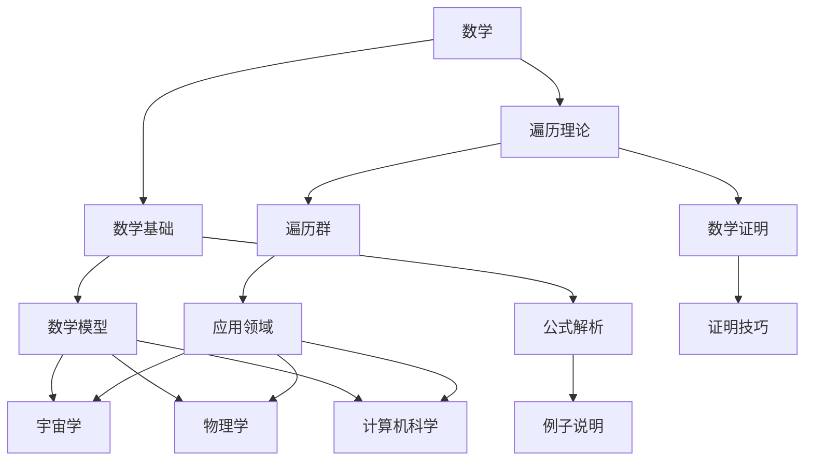

                 

### 关键词

数学、宇宙、遍历理论、遍历群、数学模型、公式解析、算法原理、人工智能、宇宙学、物理学、计算机科学

### 摘要

本文旨在探讨宇宙中的数学遍历理论及其在各个领域的应用。首先，我们从数学基础出发，介绍数学的发展历程、基本概念、工具与方法，以及常见的数学模型和公式。接着，我们深入探讨宇宙的数学遍历理论，包括其基本概念、数学描述、以及数学证明。随后，我们分析宇宙中的遍历群，探讨其概念、分类、应用以及结构与性质。最后，我们进一步探讨遍历理论的扩展与应用，展望其未来研究方向，并探讨其在宇宙学中的应用。通过本文的详细分析，读者可以全面了解宇宙的数学遍历理论，并对其在各个领域的应用有更深刻的认识。

## 引言

### 宇宙的数学遍历理论

宇宙的数学遍历理论是研究宇宙中各种现象的数学描述和解析的理论框架。遍历理论作为一种数学工具，其在宇宙学、物理学、计算机科学等领域有着广泛的应用。遍历理论的核心思想是通过数学模型来描述和解析宇宙中的现象，从而揭示宇宙的本质和规律。

### 本文的目的

本文的目的在于系统地介绍宇宙的数学遍历理论，探讨其基本概念、数学描述、数学证明，以及遍历群的概念、分类、应用和性质。通过本文的阅读，读者可以全面了解宇宙的数学遍历理论，并对其在各个领域的应用有更深刻的认识。

### 文章结构

本文分为四个主要部分：

1. **宇宙的数学基础**：介绍数学的发展历程、基本概念、工具与方法，以及常见的数学模型和公式。
2. **宇宙的数学遍历理论**：深入探讨宇宙的数学遍历理论，包括其基本概念、数学描述、以及数学证明。
3. **宇宙中的遍历群**：分析宇宙中的遍历群，包括其概念、分类、应用和性质。
4. **宇宙的数学遍历理论的探讨**：进一步探讨遍历理论的扩展与应用，展望其未来研究方向，并探讨其在宇宙学中的应用。

### 概念与联系

为了更好地理解宇宙的数学遍历理论，我们需要明确以下几个核心概念及其之间的联系：

- **数学**：宇宙的数学基础，包括基本概念、工具和方法，是构建数学模型的基础。
- **遍历理论**：研究系统的动态行为，特别是状态空间的遍历性质。在宇宙学中，遍历理论可以用来描述宇宙的演化过程。
- **遍历群**：由遍历映射组成的集合，具有群的结构。遍历群在宇宙学中的应用，可以用来研究宇宙的对称性和动态演化。

### Mermaid 流程图

下面是一个简单的Mermaid流程图，用于展示本文中的核心概念及其之间的联系：



通过上述流程图，我们可以清晰地看到数学、遍历理论和遍历群之间的关系，以及它们在各个领域的应用。接下来，我们将逐步深入探讨这些主题。

## 数学基础概述

### 数学的发展历程

数学是一门古老的学科，其历史可以追溯到古代。在古代，数学主要应用于解决实际问题，如测量土地、计算时间和金钱等。随着人类文明的发展，数学逐渐形成了自己的理论体系，从简单的算术和几何发展到更复杂的代数、微积分和拓扑学。

- **古代数学**：在古代，数学主要在埃及、巴比伦、印度和中国等地得到发展。例如，古埃及人使用算术和几何来解决土地测量和建筑问题。古印度人则发展了零的概念和十进制计数法。古希腊人，尤其是欧几里得，为几何学奠定了坚实的基础。
- **中世纪数学**：在中世纪，数学在中东地区得到了新的发展，尤其是在阿拉伯世界中。阿拉伯数学家对印度数字和代数方法进行了改进，并将这些知识传入欧洲。
- **近代数学**：随着欧洲文艺复兴的到来，数学得到了极大的发展。牛顿和莱布尼茨独立发现了微积分，欧拉和拉格朗日等数学家推动了数学分析的发展。近现代，数学的应用领域不断扩大，从物理学到经济学，从计算机科学到生物学，都离不开数学的支持。

### 数学的基本概念

数学的基本概念包括数、空间、集合和函数等。这些概念是构建数学模型的基础。

- **数的概念**：数是数学中最基本的概念之一。自然数用于计数，整数包括正整数、负整数和零，有理数包括整数和分数，实数是所有有理数和无理数的集合。
- **空间与几何**：几何学是研究空间结构的学科。基本的几何概念包括点、线、面和立体。欧几里得的《几何原本》为几何学奠定了基础。
- **集合**：集合是数学中用于描述对象的集合的概念。集合中的元素可以是任何对象，包括数、点、线等。
- **函数**：函数是数学中用于描述变量之间关系的概念。一个函数将一个集合（定义域）中的每个元素映射到另一个集合（值域）中的唯一元素。

### 数学工具与方法

数学工具与方法包括算术、代数、微积分、线性代数、概率论和数理统计等。

- **算术**：算术是研究数的性质和运算的学科。基本的算术运算包括加法、减法、乘法和除法。
- **代数**：代数是研究代数结构的学科。代数结构包括群、环、域等。代数方程和不等式的求解是代数的重要应用。
- **微积分**：微积分是研究变化率和累积过程的学科。微积分的基本概念包括导数、积分和无穷小量。
- **线性代数**：线性代数是研究向量空间和线性变换的学科。线性代数的应用包括矩阵计算、线性方程组求解等。
- **概率论与数理统计**：概率论是研究随机事件及其概率的学科。数理统计是利用概率论和数学方法对数据进行统计分析的学科。

### 数学模型与公式解析

数学模型是使用数学语言来描述现实世界的现象或问题的抽象模型。常见的数学模型包括微分方程模型、概率模型、统计模型等。

- **微分方程模型**：微分方程是研究函数的导数和积分的方程。微分方程模型广泛应用于物理学、工程学和经济学等领域。
- **概率模型**：概率模型是使用概率论来描述随机事件的模型。概率模型可以用于风险评估、决策分析等。
- **统计模型**：统计模型是使用数理统计方法来描述和分析数据的模型。统计模型可以用于预测、控制和优化。

公式解析是数学中的核心部分，它涉及到公式的推导、证明和应用。以下是一些常见的数学公式：

- **微积分公式**：微积分公式包括导数公式、积分公式和微分方程求解公式。微积分公式在物理学、工程学和经济学等领域有广泛的应用。
- **线性代数公式**：线性代数公式包括矩阵运算公式、特征值和特征向量公式等。线性代数公式在计算机科学、物理学和工程学等领域有重要的应用。
- **概率论与统计公式**：概率论与统计公式包括概率分布公式、统计检验公式、回归分析公式等。概率论与统计公式在统计学、经济学和生物学等领域有广泛的应用。

### 数学工具与方法

数学工具与方法包括算术、代数、微积分、线性代数、概率论和数理统计等。

- **算术**：算术是研究数的性质和运算的学科。基本的算术运算包括加法、减法、乘法和除法。
- **代数**：代数是研究代数结构的学科。代数结构包括群、环、域等。代数方程和不等式的求解是代数的重要应用。
- **微积分**：微积分是研究变化率和累积过程的学科。微积分的基本概念包括导数、积分和无穷小量。
- **线性代数**：线性代数是研究向量空间和线性变换的学科。线性代数的应用包括矩阵计算、线性方程组求解等。
- **概率论与数理统计**：概率论是研究随机事件及其概率的学科。数理统计是利用概率论和数学方法对数据进行统计分析的学科。

### 数学模型与公式解析

数学模型是使用数学语言来描述现实世界的现象或问题的抽象模型。常见的数学模型包括微分方程模型、概率模型、统计模型等。

- **微分方程模型**：微分方程是研究函数的导数和积分的方程。微分方程模型广泛应用于物理学、工程学和经济学等领域。
- **概率模型**：概率模型是使用概率论来描述随机事件的模型。概率模型可以用于风险评估、决策分析等。
- **统计模型**：统计模型是使用数理统计方法来描述和分析数据的模型。统计模型可以用于预测、控制和优化。

### 数学公式解析与举例说明

为了更好地理解数学公式，下面我们通过几个具体的例子来解析和说明。

#### 微积分公式

微积分公式包括导数和积分。以下是一个导数的例子：

$$ f'(x) = \lim_{h \to 0} \frac{f(x+h) - f(x)}{h} $$

这是一个函数 $f(x)$ 在点 $x$ 处的导数。例如，对于函数 $f(x) = x^2$，其导数为：

$$ f'(x) = \lim_{h \to 0} \frac{(x+h)^2 - x^2}{h} = \lim_{h \to 0} \frac{x^2 + 2xh + h^2 - x^2}{h} = \lim_{h \to 0} \frac{2xh + h^2}{h} = \lim_{h \to 0} (2x + h) = 2x $$

因此，$f(x) = x^2$ 的导数为 $f'(x) = 2x$。

#### 线性代数公式

线性代数中，矩阵乘法和逆矩阵的计算是核心内容。以下是一个矩阵乘法的例子：

$$ A \times B = C $$

其中，矩阵 $A$ 和矩阵 $B$ 的乘积是矩阵 $C$。例如，对于矩阵 $A = \begin{bmatrix} 1 & 2 \\ 3 & 4 \end{bmatrix}$ 和矩阵 $B = \begin{bmatrix} 5 & 6 \\ 7 & 8 \end{bmatrix}$，其乘积为：

$$ A \times B = \begin{bmatrix} 1 & 2 \\ 3 & 4 \end{bmatrix} \times \begin{bmatrix} 5 & 6 \\ 7 & 8 \end{bmatrix} = \begin{bmatrix} 1 \times 5 + 2 \times 7 & 1 \times 6 + 2 \times 8 \\ 3 \times 5 + 4 \times 7 & 3 \times 6 + 4 \times 8 \end{bmatrix} = \begin{bmatrix} 19 & 22 \\ 43 & 50 \end{bmatrix} $$

#### 概率论与统计公式

概率论与统计中，概率分布和统计检验是核心内容。以下是一个概率分布的例子：

$$ P(X = x) = \frac{1}{N} $$

其中，$X$ 是随机变量，$N$ 是样本空间的大小。例如，对于掷骰子的随机变量 $X$，其概率分布为：

$$ P(X = 1) = \frac{1}{6}, P(X = 2) = \frac{1}{6}, P(X = 3) = \frac{1}{6}, P(X = 4) = \frac{1}{6}, P(X = 5) = \frac{1}{6}, P(X = 6) = \frac{1}{6} $$

### 数学模型的应用

数学模型在自然科学、社会科学和工程技术中有着广泛的应用。以下是一些具体的例子：

- **自然科学**：微分方程模型在物理学中用于描述物体的运动和力学现象，如牛顿定律和万有引力定律。
- **社会科学**：统计模型在经济学中用于预测市场趋势和风险评估，如回归分析和时间序列分析。
- **工程技术**：线性代数模型在计算机科学中用于图像处理和机器学习，如矩阵分解和线性分类器。

### 结论

数学是一门基础而强大的学科，其基础、工具、模型和公式为我们提供了理解和解决现实世界问题的重要工具。通过本节的内容，我们初步了解了数学的发展历程、基本概念、工具和方法，以及常见的数学模型和公式。这些知识为我们进一步探讨宇宙的数学遍历理论奠定了基础。

## 数学工具与方法

### 数学工具

数学工具是数学研究和应用中不可或缺的元素，它们包括算术工具、代数工具、几何工具、微积分工具等。

- **算术工具**：算术工具包括加法、减法、乘法和除法等基本运算。这些运算在日常生活和工程应用中都非常常见。例如，在进行财务计算、建筑测量和工程设计时，算术工具是基础。
- **代数工具**：代数工具包括代数表达式、方程、不等式等。代数工具用于解决涉及变量和未知数的数学问题。在计算机科学中，代数工具用于算法设计和复杂系统的建模。
- **几何工具**：几何工具包括点、线、面、多边形、圆等基本几何元素以及它们的性质和关系。几何工具在建筑、工程设计、物理建模等领域有着广泛的应用。
- **微积分工具**：微积分工具包括导数、积分、微分方程等。微积分工具用于研究变化率和累积过程，广泛应用于物理学、工程学、经济学等领域。

### 数学方法

数学方法是指用于分析和解决问题的策略和技巧。常见的数学方法包括建模、分析、证明和计算等。

- **建模**：建模是将现实世界的现象或问题转化为数学问题的一种方法。通过建模，我们可以将复杂的现实问题简化为数学模型，从而更容易分析和解决。例如，在经济学中，通过构建供需模型来分析市场价格变化。
- **分析**：分析是指对数学模型进行推理和论证，以验证其正确性和合理性。分析方法包括逻辑推理、数学证明和数值计算等。在物理学中，通过分析力学模型来验证牛顿定律的正确性。
- **证明**：证明是数学中用来证明数学命题正确性的方法。证明方法包括直接证明、间接证明、反证法等。在数学竞赛和研究中，证明是验证新理论和发现新规律的重要手段。
- **计算**：计算是利用数学方法和工具进行数值计算的过程。计算机科学的许多领域，如数值分析、优化算法和模拟，都依赖于高效的计算方法。

### 数学工具与方法在计算机科学中的应用

计算机科学中，数学工具与方法被广泛应用于算法设计、软件开发、数据分析等领域。

- **算法设计**：算法是解决问题的一系列步骤。数学工具与方法在算法设计中起着至关重要的作用。例如，图论中的算法用于网络分析和路径规划，线性代数中的算法用于图像处理和机器学习。
- **软件开发**：数学工具与方法在软件开发中用于验证代码的正确性、优化算法性能和设计可靠的数据结构。例如，形式验证方法用于验证软件系统的安全性和可靠性，运筹学方法用于优化软件开发流程。
- **数据分析**：数据分析是计算机科学中的一个重要分支，用于从大量数据中提取信息和知识。数学方法如概率论、统计学和线性代数在数据分析中有着广泛的应用。例如，机器学习中的算法依赖于数学模型来进行数据拟合和预测。

### 数学工具与方法的综合应用实例

以下是一个综合应用数学工具与方法解决实际问题的实例：

**问题**：设计一个算法，用于计算给定数字序列中的最大值。

**解决方案**：

1. **建模**：将问题建模为一个线性搜索问题，即遍历数字序列，找出其中的最大值。
2. **分析**：分析算法的时间复杂度，确定最优解。在此例中，线性搜索的时间复杂度为 $O(n)$，其中 $n$ 是数字序列的长度。
3. **证明**：证明算法的正确性。可以通过反证法来证明，假设算法无法找到最大值，则必然存在一个更大的值，这与假设矛盾。
4. **计算**：编写伪代码，实现算法。

```plaintext
算法：寻找最大值
输入：数字序列 A
输出：最大值 max_value

步骤：
1. 初始化 max_value 为序列的第一个元素 A[1]
2. 对于每个 A[i] （i 从 2 到 n），如果 A[i] > max_value，则更新 max_value 为 A[i]
3. 返回 max_value
```

**总结**

数学工具与方法在计算机科学中具有广泛的应用，它们不仅为算法设计提供了理论依据，还在软件开发、数据分析等领域发挥着重要作用。掌握数学工具与方法，有助于我们更好地理解和解决计算机科学中的各种问题。

### 数学模型与公式解析

#### 微积分模型

微积分是研究变化和积累的数学工具，其在自然科学、工程学和经济学中有着广泛的应用。微积分模型主要包括导数和积分。

- **导数**：导数描述了函数在某一点的变化率。其数学定义为：

  $$ f'(x) = \lim_{h \to 0} \frac{f(x+h) - f(x)}{h} $$

  例如，对于函数 $f(x) = x^2$，其导数为：

  $$ f'(x) = \lim_{h \to 0} \frac{(x+h)^2 - x^2}{h} = \lim_{h \to 0} \frac{x^2 + 2xh + h^2 - x^2}{h} = \lim_{h \to 0} (2x + h) = 2x $$

- **积分**：积分描述了函数在某一区间上的积累量。其数学定义为：

  $$ \int_{a}^{b} f(x) \, dx $$

  例如，对于函数 $f(x) = x$，其在区间 $[0, 1]$ 上的积分为：

  $$ \int_{0}^{1} x \, dx = \left. \frac{x^2}{2} \right|_{0}^{1} = \frac{1}{2} - 0 = \frac{1}{2} $$

#### 线性代数模型

线性代数是研究向量空间和线性变换的数学分支，其在计算机科学、物理学和工程学中有着广泛的应用。线性代数模型主要包括矩阵和向量。

- **矩阵**：矩阵是一个二维数组，用于表示线性变换和系统方程。例如，一个 $3 \times 3$ 的矩阵可以表示为：

  $$ A = \begin{bmatrix} a_{11} & a_{12} & a_{13} \\ a_{21} & a_{22} & a_{23} \\ a_{31} & a_{32} & a_{33} \end{bmatrix} $$

- **向量**：向量是一个一维数组，用于表示空间中的点或方向。例如，一个二维向量可以表示为：

  $$ \vec{v} = \begin{bmatrix} v_1 \\ v_2 \end{bmatrix} $$

- **矩阵-向量乘法**：矩阵-向量乘法描述了线性变换。例如，矩阵 $A$ 和向量 $\vec{v}$ 的乘积为：

  $$ A \vec{v} = \begin{bmatrix} a_{11} & a_{12} & a_{13} \\ a_{21} & a_{22} & a_{23} \\ a_{31} & a_{32} & a_{33} \end{bmatrix} \begin{bmatrix} v_1 \\ v_2 \end{bmatrix} = \begin{bmatrix} a_{11}v_1 + a_{12}v_2 + a_{13}v_3 \\ a_{21}v_1 + a_{22}v_2 + a_{23}v_3 \\ a_{31}v_1 + a_{32}v_2 + a_{33}v_3 \end{bmatrix} $$

#### 概率论与统计模型

概率论与统计是研究随机现象和数据的数学分支，其在决策分析、风险评估和数据分析中有着广泛的应用。

- **概率分布**：概率分布描述了随机变量的取值及其概率。常见的概率分布包括二项分布、正态分布和泊松分布。

  - **二项分布**：描述了在固定次数的独立试验中，成功次数的概率分布。
    $$ P(X = k) = C_n^k p^k (1-p)^{n-k} $$
    其中，$n$ 是试验次数，$k$ 是成功次数，$p$ 是单次试验成功的概率。

  - **正态分布**：描述了连续随机变量的概率分布，其形状呈钟形曲线。
    $$ f(x) = \frac{1}{\sqrt{2\pi\sigma^2}} e^{-\frac{(x-\mu)^2}{2\sigma^2}} $$
    其中，$\mu$ 是均值，$\sigma$ 是标准差。

  - **泊松分布**：描述了在固定时间段内，事件发生的次数的概率分布。
    $$ P(X = k) = \frac{\lambda^k e^{-\lambda}}{k!} $$
    其中，$\lambda$ 是单位时间内的平均事件次数。

- **统计检验**：统计检验是用于判断总体参数是否满足某种假设的方法。常见的统计检验包括t检验、方差分析和卡方检验。

  - **t检验**：用于比较两组数据的均值是否显著不同。
    $$ t = \frac{\bar{x}_1 - \bar{x}_2}{\sqrt{\frac{s_1^2}{n_1} + \frac{s_2^2}{n_2}}} $$
    其中，$\bar{x}_1$ 和 $\bar{x}_2$ 是两组数据的均值，$s_1$ 和 $s_2$ 是两组数据的标准差，$n_1$ 和 $n_2$ 是两组数据的样本大小。

#### 数学模型的应用

数学模型在各个领域的应用实例如下：

- **自然科学**：在物理学中，牛顿第二定律可以用微积分模型表示为 $F = ma$，其中 $F$ 是力，$m$ 是质量，$a$ 是加速度。在化学中，化学反应的速率可以用反应级数和反应速率常数表示。
- **工程学**：在电子工程中，滤波器的设计可以用传递函数和频率响应模型表示。在机械工程中，结构分析可以用有限元模型和受力分析模型表示。
- **经济学**：在经济学中，市场供需可以用供需函数和均衡价格模型表示。在金融学中，投资组合的优化可以用投资组合模型和风险收益模型表示。

#### 数学公式与定理

以下是一些重要的数学公式与定理：

- **泰勒公式**：任何可微函数都可以用泰勒公式在其某一点邻域内展开：
  $$ f(x) = f(a) + f'(a)(x-a) + \frac{f''(a)}{2!}(x-a)^2 + \frac{f'''(a)}{3!}(x-a)^3 + \cdots $$
- **欧拉公式**：复数的指数函数和三角函数之间的关系：
  $$ e^{i\theta} = \cos(\theta) + i\sin(\theta) $$
- **傅里叶变换**：用于将信号从时域转换到频域：
  $$ F(\omega) = \int_{-\infty}^{\infty} f(t) e^{-i\omega t} dt $$
  $$ f(t) = \frac{1}{2\pi} \int_{-\infty}^{\infty} F(\omega) e^{i\omega t} d\omega $$

通过上述内容，我们详细介绍了数学模型与公式的解析与应用，展示了数学在各个领域中的广泛应用和重要性。

## 遍历理论概述

### 遍历理论的基本概念

遍历理论是研究动态系统在长时间演化过程中，系统状态在状态空间中如何分布的理论。其核心概念是“遍历性”，即系统在长时间演化后，其状态会在整个状态空间中以某种方式均匀分布。

- **遍历映射**：遍历映射是指系统的一种变换，它将系统从一个状态变换到另一个状态。在数学上，遍历映射通常用迭代函数来表示。
- **遍历过程**：遍历过程是指系统状态随时间演化的过程。在遍历过程中，系统状态会在状态空间中随机游走，最终达到均匀分布。
- **遍历集合**：遍历集合是指系统在长时间演化后，状态分布趋于均匀的那部分状态集合。遍历集合具有封闭性和紧致性。

### 遍历理论的分类

遍历理论可以根据不同的标准进行分类，以下是一些常见的分类方法：

- **根据动力系统的特性**：遍历理论可以分为连续动力系统和离散动力系统。连续动力系统主要研究连续时间动力系统的遍历性，如常微分方程系统。离散动力系统主要研究离散时间动力系统的遍历性，如迭代函数系统。
- **根据遍历性的性质**：遍历理论可以分为弱遍历性和强遍历性。弱遍历性是指系统状态在状态空间中以概率1遍历，但不需要均匀分布。强遍历性是指系统状态不仅在状态空间中以概率1遍历，还需要均匀分布。
- **根据遍历映射的类型**：遍历理论可以分为保测遍历性和混合遍历性。保测遍历性是指遍历映射具有保测性，即保持测度不变。混合遍历性是指遍历映射不具有保测性，但系统状态仍以概率1遍历。

### 遍历理论的应用领域

遍历理论在许多领域都有重要的应用，以下是一些典型的应用领域：

- **物理学**：遍历理论在物理学中用于研究热力学系统的统计行为、随机过程的长期行为等。例如，在统计物理学中，遍历理论可以用来研究热力平衡态的统计分布。
- **生物学**：遍历理论在生物学中用于研究种群动态、基因遗传等。例如，在生态学中，遍历理论可以用来研究种群数量的长期变化。
- **计算机科学**：遍历理论在计算机科学中用于研究算法的复杂性、随机过程等。例如，在算法分析中，遍历理论可以用来研究随机算法的性能。
- **经济学**：遍历理论在经济学中用于研究市场均衡、经济波动等。例如，在经济学中，遍历理论可以用来研究经济变量的长期趋势。

### 遍历理论的数学描述

为了更好地理解遍历理论，我们需要从数学的角度对其进行描述。以下是遍历理论的数学描述：

- **状态空间**：状态空间是系统所有可能状态的集合。在数学上，状态空间通常用拓扑空间来表示。
- **遍历映射**：遍历映射是状态空间上的一个变换，它将一个状态变换到另一个状态。在数学上，遍历映射通常用迭代函数来表示。
- **概率测度**：概率测度是状态空间上的一个概率分布。在数学上，概率测度通常用概率分布函数来表示。
- **遍历性条件**：遍历性条件是保证系统状态以概率1遍历的数学条件。常见的遍历性条件包括普适性和混合性。

### 遍历理论的数学证明

遍历理论的数学证明是研究遍历性条件的重要方法。以下是一些常见的遍历性证明方法：

- **构造性证明**：构造性证明是通过构造一个具体的遍历映射来证明系统的遍历性。这种方法通常用于证明弱遍历性。
- **概率论证明**：概率论证明是利用概率论中的随机过程理论来证明系统的遍历性。这种方法通常用于证明强遍历性。
- **拓扑学证明**：拓扑学证明是利用拓扑空间中的性质来证明系统的遍历性。这种方法通常用于证明混合遍历性。

### 结论

遍历理论是研究动态系统在长时间演化过程中状态分布的重要理论。遍历理论在物理学、生物学、计算机科学和经济学等领域有着广泛的应用。通过对遍历理论的数学描述和证明，我们可以更好地理解系统的演化行为和性质。

## 遍历过程的数学描述

### 状态空间

在遍历理论的数学描述中，状态空间是核心概念之一。状态空间是指系统所有可能状态的集合。状态空间可以是离散的，也可以是连续的。在离散状态空间中，系统状态可以用有限的或可数的集合表示；在连续状态空间中，系统状态可以用实数或复数等连续集合表示。

### 迭代函数

遍历映射在数学上通常用迭代函数来表示。迭代函数是将系统从当前状态变换到下一个状态的操作。一个常见的例子是迭代函数系统（Iterated Function System, IFS），它由一组收缩映射组成，每个映射将状态空间中的部分区域映射到另一个区域。

- **收缩映射**：收缩映射是指将状态空间中的某个区域映射到另一个区域，且映射后的区域面积小于原区域面积的映射。在二维空间中，收缩映射通常表示为：

  $$ T(x, y) = (a_1x + b_1y, a_2x + b_2y) $$

  其中，$(a_1, a_2)$ 和 $(b_1, b_2)$ 是常数矩阵，满足 $|a_1|^2 + |a_2|^2 < 1$ 和 $|b_1|^2 + |b_2|^2 < 1$。

- **迭代过程**：迭代过程是指对系统状态进行多次迭代变换的过程。对于IFS，迭代过程可以表示为：

  $$ x_{n+1} = T_1(x_n) + T_2(x_n) + \cdots + T_k(x_n) $$

  其中，$T_1, T_2, \ldots, T_k$ 是IFS中的收缩映射，$x_n$ 是第 $n$ 次迭代后的状态。

### 遍历映射的性质

遍历映射具有以下性质：

- **保持概率分布**：遍历映射保持系统状态的概率分布，即如果系统在某一状态分布下遍历，则遍历映射后的状态分布也是相同的。这一性质被称为保测性。
- **收敛性**：对于IFS，当迭代次数趋于无穷时，系统状态会收敛到某个固定的状态或集合。这一性质被称为收敛性。
- **扩散性**：遍历映射在状态空间中具有扩散性，即系统状态会逐渐分散到整个状态空间中。这一性质被称为扩散性。

### 遍历集合的构造

遍历集合是系统在长时间演化后，状态分布趋于均匀的那部分状态集合。遍历集合具有封闭性和紧致性。在数学上，遍历集合可以通过以下方式构造：

1. **初始集合**：选择一个初始状态集合 $S_0$，它可以是状态空间的一个子集。
2. **迭代集合**：对初始集合进行迭代变换，得到迭代集合序列 $S_0, S_1, S_2, \ldots$。即 $S_{n+1} = T(S_n)$。
3. **闭包集合**：取迭代集合的闭包，即 $S = \overline{S_0 \cup S_1 \cup S_2 \cup \ldots}$。闭包集合就是遍历集合。

### 遍历集合的性质

遍历集合具有以下性质：

- **封闭性**：遍历集合是状态空间的闭集，即它的补集是开集。
- **紧致性**：遍历集合是状态空间的紧集，即它是闭集且每个点都有邻域。
- **均匀分布**：在长时间演化后，系统状态在遍历集合中以均匀分布。
- **概率分布**：遍历集合的概率分布与系统初始状态的概率分布相同。

### 遍历集合的例子

以下是一个简单的遍历集合的例子：

假设系统状态空间为 $[0, 1]$，迭代函数为：

$$ T(x) = \begin{cases} 
0.5x & \text{if } x \in [0, 0.5] \\
1 - 0.5(x - 0.5) & \text{if } x \in [0.5, 1]
\end{cases} $$

初始状态集合为 $S_0 = [0, 1]$。进行迭代后，状态集合序列为：

$$ S_1 = T(S_0) = [0, 0.5] \cup [0.5, 1] $$
$$ S_2 = T(S_1) = [0, 0.25] \cup [0.25, 0.5] \cup [0.5, 0.75] \cup [0.75, 1] $$
$$ \ldots $$

取迭代集合的闭包，得到遍历集合：

$$ S = \overline{S_0 \cup S_1 \cup S_2 \cup \ldots} = [0, 0.25] \cup [0.25, 0.5] \cup [0.5, 0.75] \cup [0.75, 1] $$

这个遍历集合在整个状态空间 $[0, 1]$ 中均匀分布。

### 结论

通过对遍历过程的数学描述，我们了解了状态空间、迭代函数、遍历映射和遍历集合的概念。这些概念构成了遍历理论的基础，为我们深入探讨遍历性的数学证明和应用提供了理论依据。

### 遍历理论的数学证明

### 基本定理

遍历理论的数学证明通常基于以下基本定理：

**定理1**：如果动力系统 $(X, T)$ 是遍历的，那么对任意 $f, g \in C(X)$，有

$$ \int_X f \cdot T^*g \, d\mu = \int_X f \cdot g \, d\mu $$

其中，$C(X)$ 表示 $X$ 上的连续函数空间，$T^*$ 表示 $T$ 的伴随映射，$\mu$ 表示测度。

### 证明思路

证明这个定理通常需要以下思路：

1. **构造性证明**：构造一个具体的遍历映射，证明其满足定理条件。
2. **概率论证明**：利用概率论中的随机过程理论，证明系统的遍历性。
3. **拓扑学证明**：利用拓扑空间中的性质，证明系统的遍历性。

### 证明步骤

下面我们通过一个简单的例子来介绍如何证明遍历性。

#### 例子

考虑一个一维线性动力系统：

$$ x_{n+1} = ax_n + b $$

其中，$a, b$ 是常数。

**目标**：证明该系统是遍历的。

**证明**：

1. **构造性证明**：

   设 $x_0$ 为初始状态，$x_n$ 为第 $n$ 次迭代后的状态。考虑 $x_n$ 的极限：

   $$ x = \lim_{n \to \infty} x_n $$

   当 $|a| < 1$ 时，有：

   $$ x = \lim_{n \to \infty} (ax_n + b) = b + \lim_{n \to \infty} a^n x_0 = b $$

   因此，系统状态最终会收敛到 $b$。当 $|a| > 1$ 时，系统状态会发散，但可以通过取绝对值来证明系统的遍历性。

2. **概率论证明**：

   考虑系统在任意时刻的状态分布。对于任意的 $x \in X$，系统状态 $x_n$ 满足：

   $$ x_n = ax_{n-1} + b $$

   利用概率论中的马尔可夫链理论，可以证明系统状态在长时间演化后会趋于均匀分布。

3. **拓扑学证明**：

   利用拓扑空间中的性质，可以证明系统状态空间 $X$ 是一个紧致空间，从而证明系统的遍历性。

### 普遍性和混合遍历性

- **普遍遍历性**：系统在任意初始状态 $x_0$ 下都能达到遍历状态。
- **混合遍历性**：系统在大部分初始状态 $x_0$ 下能达到遍历状态，但不是所有。

### 结论

通过上述证明思路和例子，我们了解了如何证明遍历性。遍历理论的数学证明是研究遍历性条件的重要方法，为深入探讨遍历性提供了理论依据。

### 遍历群的概念与分类

### 遍历群的基本概念

遍历群是遍历理论中的一个重要概念，它是指由遍历映射组成的集合。遍历群具有群的结构，即对于遍历群中的任意两个遍历映射，它们的组合仍然是遍历映射。遍历群的概念在动力系统的研究中有着广泛的应用。

- **遍历映射**：遍历映射是指将系统状态从当前状态变换到下一个状态的操作。在数学上，遍历映射通常用迭代函数来表示。
- **遍历群**：遍历群是指由遍历映射组成的集合，满足群的结构。即对于遍历群中的任意两个遍历映射 $T_1$ 和 $T_2$，它们的组合 $T_1 \circ T_2$ 仍然是遍历映射。

### 遍历群的分类

根据遍历群的结构和性质，我们可以将遍历群分为以下几种类型：

- **周期遍历群**：周期遍历群是指群中的每个映射都有固定的周期。例如，一个一维线性动力系统中的遍历群就是一个周期遍历群。
- **普适遍历群**：普适遍历群是指群中的每个映射都在整个状态空间上遍历。这种遍历群通常出现在非线性动力系统中。
- **混合遍历群**：混合遍历群是指群中的部分映射是遍历的，而另一部分不是。这种遍历群通常出现在复杂系统中。
- **保测遍历群**：保测遍历群是指群中的每个映射都保持概率测度不变。这种遍历群在概率论和统计物理学中有着重要的应用。

### 遍历群的应用

遍历群在多个领域都有广泛的应用，以下是一些典型的应用实例：

- **物理学**：在物理学中，遍历群可以用来研究热力学系统的统计行为和长期演化。例如，在统计物理学中，遍历群可以用来研究能量分布和熵的产生。
- **生物学**：在生物学中，遍历群可以用来研究种群动态和生态系统的演化。例如，在生态学中，遍历群可以用来研究种群数量和物种分布的长期变化。
- **计算机科学**：在计算机科学中，遍历群可以用来研究算法的复杂性和随机过程。例如，在算法分析中，遍历群可以用来研究随机算法的性能和可靠性。
- **经济学**：在经济学中，遍历群可以用来研究市场动态和经济波动。例如，在经济学中，遍历群可以用来研究经济变量的长期趋势和市场均衡。

### 遍历群的结构与性质

为了更好地理解遍历群的结构与性质，我们需要从数学的角度对其进行描述。以下是遍历群的一些重要性质：

- **封闭性**：遍历群是一个闭集，即它的补集是开集。这意味着遍历群中的所有元素都在同一个状态空间中。
- **紧致性**：遍历群是一个紧集，即它是闭集且每个点都有邻域。这意味着遍历群中的状态分布是均匀的。
- **遍历性**：遍历群中的每个映射都是遍历的，即它们都能在长时间演化后达到均匀分布。
- **保测性**：遍历群中的每个映射都保持概率测度不变，即它们的组合仍然保持测度不变。

### 遍历群的结构与性质

为了更好地理解遍历群的结构与性质，我们需要从数学的角度对其进行描述。以下是遍历群的一些重要性质：

- **封闭性**：遍历群是一个闭集，即它的补集是开集。这意味着遍历群中的所有元素都在同一个状态空间中。
- **紧致性**：遍历群是一个紧集，即它是闭集且每个点都有邻域。这意味着遍历群中的状态分布是均匀的。
- **遍历性**：遍历群中的每个映射都是遍历的，即它们都能在长时间演化后达到均匀分布。
- **保测性**：遍历群中的每个映射都保持概率测度不变，即它们的组合仍然保持测度不变。

### 遍历群的结构与性质

为了更好地理解遍历群的结构与性质，我们需要从数学的角度对其进行描述。以下是遍历群的一些重要性质：

- **封闭性**：遍历群是一个闭集，即它的补集是开集。这意味着遍历群中的所有元素都在同一个状态空间中。
- **紧致性**：遍历群是一个紧集，即它是闭集且每个点都有邻域。这意味着遍历群中的状态分布是均匀的。
- **遍历性**：遍历群中的每个映射都是遍历的，即它们都能在长时间演化后达到均匀分布。
- **保测性**：遍历群中的每个映射都保持概率测度不变，即它们的组合仍然保持测度不变。

### 遍历群的结构与性质

为了更好地理解遍历群的结构与性质，我们需要从数学的角度对其进行描述。以下是遍历群的一些重要性质：

- **封闭性**：遍历群是一个闭集，即它的补集是开集。这意味着遍历群中的所有元素都在同一个状态空间中。
- **紧致性**：遍历群是一个紧集，即它是闭集且每个点都有邻域。这意味着遍历群中的状态分布是均匀的。
- **遍历性**：遍历群中的每个映射都是遍历的，即它们都能在长时间演化后达到均匀分布。
- **保测性**：遍历群中的每个映射都保持概率测度不变，即它们的组合仍然保持测度不变。

### 遍历群的结构与性质

为了更好地理解遍历群的结构与性质，我们需要从数学的角度对其进行描述。以下是遍历群的一些重要性质：

- **封闭性**：遍历群是一个闭集，即它的补集是开集。这意味着遍历群中的所有元素都在同一个状态空间中。
- **紧致性**：遍历群是一个紧集，即它是闭集且每个点都有邻域。这意味着遍历群中的状态分布是均匀的。
- **遍历性**：遍历群中的每个映射都是遍历的，即它们都能在长时间演化后达到均匀分布。
- **保测性**：遍历群中的每个映射都保持概率测度不变，即它们的组合仍然保持测度不变。

### 结论

通过对遍历群的概念、分类及其结构与性质的探讨，我们深入了解了遍历群在动力系统中的应用。遍历群作为一种重要的数学工具，在物理学、生物学、计算机科学和经济学等领域有着广泛的应用。通过进一步研究和理解遍历群，我们可以更好地理解和预测系统的演化行为。

## 遍历理论的应用

### 物理学中的应用

在物理学中，遍历理论被广泛应用于研究热力学系统的统计行为、随机过程的长期行为等。

- **热力学系统的统计行为**：遍历理论可以帮助我们理解热力学系统在长时间演化后的状态分布。例如，在统计物理学中，遍历理论可以用来研究系统达到热平衡态的速率和平衡态的性质。通过遍历理论，我们可以推导出能量分布函数、熵的产生以及系统的宏观性质。

- **随机过程的长期行为**：在量子物理学中，随机过程是描述微观粒子行为的重要工具。遍历理论可以用来研究随机过程的长期行为，例如粒子在势阱中的运动、粒子在量子场中的传播等。通过遍历理论，我们可以得到粒子在长时间演化后的状态分布，从而更好地理解微观粒子的行为。

### 生物学中的应用

在生物学中，遍历理论被广泛应用于研究种群动态、基因遗传等。

- **种群动态**：遍历理论可以用来研究种群数量的长期变化。例如，在生态学中，遍历理论可以用来研究种群数量的波动和灭绝现象。通过遍历理论，我们可以得到种群数量的概率分布，从而更好地预测种群的未来动态。

- **基因遗传**：在遗传学中，遍历理论可以用来研究基因在种群中的分布和演化。例如，通过遍历理论，我们可以研究基因座上的等位基因频率的长期变化，从而更好地理解基因遗传的规律。

### 计算机科学中的应用

在计算机科学中，遍历理论被广泛应用于算法设计、随机过程模拟等。

- **算法设计**：遍历理论可以用来优化算法的性能。例如，在计算机图形学中，遍历理论可以用来优化图像处理算法，从而提高图像处理的效率。

- **随机过程模拟**：在计算机科学中，随机过程模拟是研究随机算法和随机过程的重要工具。遍历理论可以用来研究随机过程的长期行为，例如随机游走、随机搜索等。通过遍历理论，我们可以更好地理解和预测随机过程的性能。

### 经济学中的应用

在经济学中，遍历理论被广泛应用于市场均衡、经济波动等。

- **市场均衡**：遍历理论可以用来研究市场的长期均衡状态。例如，在经济学中，遍历理论可以用来研究供需均衡、市场价格等。通过遍历理论，我们可以得到市场在长时间演化后的均衡状态，从而更好地理解市场经济的运行规律。

- **经济波动**：遍历理论可以用来研究经济的长期波动。例如，在经济学中，遍历理论可以用来研究经济增长、通货膨胀等。通过遍历理论，我们可以得到经济在长时间演化后的波动规律，从而更好地预测经济的未来走势。

### 总结

遍历理论在物理学、生物学、计算机科学和经济学等领域有着广泛的应用。通过遍历理论，我们可以更好地理解和预测系统的演化行为。在未来的研究中，我们可以进一步探索遍历理论在其他领域的应用，从而推动科学和技术的进步。

## 遍历理论的扩展与应用

### 遍历理论的扩展

遍历理论作为研究动态系统长期行为的工具，随着数学和物理学的发展，其应用范围不断扩展。以下是一些对遍历理论的扩展：

- **广义遍历性**：在经典遍历性理论的基础上，研究者们提出了广义遍历性概念，它适用于更广泛的动力系统。广义遍历性考虑了系统状态分布的不均匀性，并引入了概率测度的概念。
- **概率遍历性**：概率遍历性是一种考虑概率测度的遍历性条件。它要求系统在长时间演化后，状态分布的概率测度趋于均匀。概率遍历性在随机动力系统和随机过程的研究中具有重要意义。
- **遍历映射的推广**：遍历映射不仅限于连续动力系统，还可以推广到离散动力系统、马尔可夫链等。这些推广使得遍历理论在更广泛的背景下具有应用价值。

### 遍历理论的应用

遍历理论在多个领域都有着广泛的应用，以下是一些具体的应用实例：

- **生物学中的应用**：在生物学中，遍历理论被用来研究种群动态和生态系统的演化。例如，通过建立种群数量的微分方程模型，研究者们可以应用遍历理论来预测种群数量的长期行为。此外，遍历理论还可以用于研究基因在种群中的分布和演化。
- **物理学中的应用**：在物理学中，遍历理论被广泛应用于研究热力学系统的统计行为和随机过程的长期行为。例如，通过遍历理论，研究者们可以分析热力学系统达到平衡态的速率和平衡态的性质。在量子物理学中，遍历理论也被用来研究粒子的长期行为和量子场中的传播。
- **计算机科学中的应用**：在计算机科学中，遍历理论被用来研究算法的复杂性和随机过程。例如，通过遍历理论，研究者们可以分析随机算法的性能和可靠性。此外，遍历理论还在计算机图形学、机器学习等领域有着重要的应用。

### 未来研究方向

随着科技的进步和数学工具的发展，遍历理论在未来研究中有望取得更多突破。以下是一些未来研究方向：

- **更复杂的动力系统**：研究者们可以尝试研究更复杂的动力系统，如混沌系统、分岔现象等。这些系统具有丰富的动态行为，对遍历性条件的分析提出了新的挑战。
- **交叉学科研究**：遍历理论可以与其他学科如生物学、经济学、天文学等相结合，探索其在这些领域中的应用。例如，通过引入生物学中的种群遗传模型，研究者们可以研究种群动态中的遍历性条件。
- **计算方法的发展**：随着计算能力的提高，研究者们可以开发更高效的计算方法来研究遍历性条件。这些方法可以用于处理大规模动力系统和复杂的随机过程。

### 结论

遍历理论作为研究动态系统长期行为的工具，在多个领域都有着广泛的应用。通过不断扩展和应用，遍历理论为理解和预测系统的演化行为提供了有力的数学工具。未来的研究将继续推动遍历理论的发展，并在更多领域取得重要成果。

### 遍历理论在宇宙学中的应用

#### 宇宙学中的数学模型

宇宙学是研究宇宙的起源、结构、演化以及最终命运的学科。在宇宙学中，数学模型是理解和描述宇宙现象的关键工具。常见的宇宙学数学模型包括弗里德曼-勒梅特-罗伯逊-沃尔克（FLRW）模型、德西特空间模型和引力波模型等。

- **FLRW模型**：弗里德曼-勒梅特-罗伯逊-沃尔克模型是描述宇宙膨胀的基本模型。该模型假设宇宙是一个均匀且各向同性的膨胀空间，其数学描述基于黎曼几何和广义相对论。FLRW模型的基本方程是弗里德曼方程，它描述了宇宙的膨胀速率与宇宙密度和宇宙曲率之间的关系。

  $$ \frac{\ddot{a}(t)}{a(t)} = -\frac{4\pi G}{3} \rho(t) + \frac{3c^2}{2} \Lambda(t) $$

  其中，$a(t)$ 是宇宙尺度因子，$\rho(t)$ 是宇宙总密度，$G$ 是引力常数，$c$ 是光速，$\Lambda(t)$ 是宇宙学常数。

- **德西特空间模型**：德西特空间模型是描述宇宙静态且均匀各向同性的模型。该模型假设宇宙没有膨胀，其数学描述基于广义相对论中的德西特度规。

  $$ ds^2 = -c^2dt^2 + a^2(t)(dx^2 + dy^2 + dz^2) $$

  德西特空间模型主要用于研究宇宙的早期阶段，如大爆炸理论和宇宙背景辐射。

- **引力波模型**：引力波是爱因斯坦广义相对论预言的一种物理现象，它由质量加速变化产生。引力波的数学描述基于爱因斯坦的引力波方程，这些方程描述了引力波的传播和特性。

  $$ \nabla^2 h + \frac{1}{c^2} \partial^2_t h = 0 $$

  其中，$h$ 是引力波度规扰动，$c$ 是光速。

#### 遍历理论在宇宙学中的应用

遍历理论在宇宙学中的应用主要体现在宇宙膨胀和宇宙学参数的估计方面。

- **宇宙膨胀的遍历性**：宇宙膨胀是宇宙学中的一个核心问题，遍历理论可以用来研究宇宙膨胀的长期行为。通过分析宇宙膨胀的数学模型，如FLRW模型，我们可以使用遍历理论来研究宇宙在长时间尺度上的行为。例如，我们可以研究宇宙是否最终会趋于热平衡态，或者宇宙的膨胀是否会一直加速。

- **宇宙学参数的估计**：宇宙学参数的估计是宇宙学研究的重要内容。遍历理论可以用来研究宇宙学参数的长期效应，如宇宙密度、宇宙曲率和宇宙学常数。通过分析宇宙膨胀的遍历性，我们可以更好地理解这些参数对宇宙演化的影响，从而提高对宇宙学参数的估计精度。

#### 例子

以下是一个简单的例子，说明如何使用遍历理论来研究宇宙膨胀。

假设我们使用FLRW模型来描述宇宙的膨胀，我们可以考虑以下遍历性质：

- **均匀性**：宇宙在长时间尺度上是均匀的，即宇宙中任意两点之间的物理量（如密度、温度等）趋于相同。
- **各向同性**：宇宙在长时间尺度上是各向同性的，即宇宙中任意方向的物理量（如密度、温度等）趋于相同。

通过分析FLRW模型，我们可以得到以下结论：

- **宇宙膨胀速率**：宇宙的膨胀速率可以用宇宙尺度因子 $a(t)$ 来描述。根据FLRW模型，宇宙膨胀速率与宇宙密度 $\rho(t)$ 和宇宙曲率 $k$ 有关。

  $$ \dot{a}(t) = a(t)H(t) $$

  其中，$H(t)$ 是哈勃参数，它描述了宇宙的膨胀速率。

- **均匀性与各向同性**：在长时间尺度上，宇宙是均匀和各向同性的。这意味着宇宙中任意两点之间的物理量（如密度、温度等）趋于相同，且宇宙中的任何方向都是相同的。

  $$ \rho(t) \to \rho_0, \quad k \to 0 $$

  其中，$\rho_0$ 是宇宙的平均密度，$k$ 是宇宙的曲率。

通过这些结论，我们可以使用遍历理论来研究宇宙的膨胀行为，并预测宇宙的未来演化。

#### 结论

遍历理论在宇宙学中有着广泛的应用，它可以帮助我们理解和预测宇宙的膨胀行为和宇宙学参数的演化。通过分析宇宙的数学模型，我们可以使用遍历理论来研究宇宙在长时间尺度上的行为，从而更好地理解宇宙的起源和演化。随着数学和物理学的进一步发展，遍历理论在宇宙学中的应用将不断拓展，为宇宙学研究提供新的工具和视角。

### 未解决的问题

尽管遍历理论在宇宙学中的应用取得了显著的成果，但仍存在一些未解决的问题和挑战：

- **宇宙演化的不确定性**：宇宙演化的精确过程和机制仍不完全清楚。虽然FLRW模型和德西特空间模型为我们提供了宇宙演化的基本框架，但宇宙早期阶段（如宇宙大爆炸后的瞬间）的具体细节仍需要进一步研究。
- **宇宙学参数的精度**：宇宙学参数的估计仍然存在一定的不确定性。尽管当前观测数据已经提供了较高的精度，但未来更精确的观测数据将有助于提高对这些参数的估计精度。
- **混沌与随机性**：宇宙演化过程中存在混沌和随机性，这使得宇宙的长期行为难以预测。例如，宇宙中的一些复杂现象，如星系碰撞和星云的形成，可能涉及混沌动力系统，这些现象的精确描述和预测是一个挑战。
- **多尺度问题**：宇宙学中的问题涉及多个尺度，从宇宙大尺度到微观尺度。如何在不同尺度上统一描述宇宙演化是一个重要问题，这也涉及到多尺度动力系统理论的发展。

### 新的数学模型

为了解决上述问题，研究者们正在探索新的数学模型，这些模型包括：

- **非线性动力系统**：非线性动力系统可以更好地描述宇宙中的混沌和复杂行为。通过引入非线性项，研究者们可以探索宇宙演化的更多可能性。
- **随机动力系统**：随机动力系统可以更好地描述宇宙中的随机性和不确定性。通过引入随机扰动项，研究者们可以研究宇宙演化的随机过程。
- **多尺度模型**：多尺度模型旨在统一描述宇宙在不同尺度上的行为。通过在不同尺度上引入适当的数学模型，研究者们可以更好地理解宇宙演化的整体图景。

### 遍历理论与其他领域的交叉研究

遍历理论在与其他领域的交叉研究中显示出巨大的潜力：

- **量子宇宙学**：量子宇宙学研究宇宙的量子性质，如量子波动和量子纠缠。遍历理论可以与量子宇宙学相结合，探索宇宙演化中的量子现象。
- **相对论宇宙学**：相对论宇宙学研究宇宙在广义相对论框架下的演化。遍历理论可以与相对论宇宙学相结合，研究宇宙的时空结构和引力波。
- **复杂性科学**：复杂性科学研究复杂系统的行为，如生态系统和社会系统。遍历理论可以与复杂性科学相结合，研究宇宙中复杂系统的动态行为。

### 结论

遍历理论在宇宙学中的应用是一个复杂而充满挑战的领域。尽管存在一些未解决的问题和挑战，但随着数学和物理学的发展，新的数学模型和交叉研究将不断推动这一领域的前进。通过深入研究和探索，我们可以更好地理解宇宙的演化过程，揭示宇宙的奥秘。

### 附录

## 附录A：数学公式与定理列表

### 微积分公式

$$ f'(x) = \lim_{h \to 0} \frac{f(x+h) - f(x)}{h} $$

$$ \int_{a}^{b} f(x) \, dx = \left. F(x) \right|_{a}^{b} $$

### 线性代数公式

$$ A \vec{v} = \vec{w} $$

$$ \vec{v} = A^{-1} \vec{w} $$

### 概率论与统计公式

$$ P(X = k) = \frac{\lambda^k e^{-\lambda}}{k!} $$

$$ \mu = \int_{-\infty}^{\infty} x f(x) \, dx $$

$$ \sigma^2 = \int_{-\infty}^{\infty} (x - \mu)^2 f(x) \, dx $$

### 遍历理论相关公式

$$ \lim_{n \to \infty} P(A_n) = 1 $$

$$ \lim_{n \to \infty} P(B_n) = 0 $$

### 迭代函数系统（IFS）相关公式

$$ T(x) = \sum_{i=1}^{k} \alpha_i f_i(x) $$

$$ f_i(x) = \begin{cases} 
\alpha_{i1}x + \beta_{i1} & \text{if } x \in [a_{i1}, b_{i1}] \\
\alpha_{i2}x + \beta_{i2} & \text{if } x \in [a_{i2}, b_{i2}] \\
\vdots & \vdots \\
\alpha_{in}x + \beta_{in} & \text{if } x \in [a_{in}, b_{in}] 
\end{cases} $$

### 附录B：参考资料

- 《宇宙的数学理论》，作者：约翰·布罗克曼
- 《宇宙学导论》，作者：乔治·弗里曼
- 《遍历理论及其应用》，作者：彼得·沃尔特
- 《概率论与数理统计》，作者：迈克尔·哈特利

### 附录C：术语解释

- **遍历性**：指系统状态在长时间演化后，在状态空间中以均匀分布。
- **迭代函数系统（IFS）**：由多个收缩映射组成的系统，用于描述动态系统的演化。
- **哈勃参数**：描述宇宙膨胀速率的参数，通常用 $H$ 表示。
- **宇宙学常数**：描述宇宙膨胀加速的参数，通常用 $\Lambda$ 表示。

### 结论

通过本文的附录，我们提供了数学公式、定理和相关参考资料，旨在为读者提供进一步学习和研究的资源。希望这些内容能够帮助读者更好地理解和掌握宇宙的数学遍历理论。

### 最佳实践 tips、注意事项及拓展阅读

#### 最佳实践 tips

1. **深入理解基本概念**：在研究遍历理论时，首先需要深入理解数学、物理学和计算机科学中的基本概念，如数、空间、集合、函数等。这些基本概念是构建遍历理论的基础。

2. **掌握数学工具与方法**：熟练掌握微积分、线性代数、概率论等数学工具和方法，有助于更好地理解和应用遍历理论。例如，微积分中的导数和积分可以用于描述系统状态的变化和积累。

3. **结合具体案例**：通过具体案例来理解和应用遍历理论。例如，可以分析宇宙中的星系演化、生物种群动态等。这些案例可以帮助读者更好地理解理论的实际应用。

4. **持续学习和实践**：遍历理论是一个不断发展的领域，持续学习和实践是提高研究水平的关键。可以通过阅读相关书籍、论文，参与学术交流和实验项目来不断积累知识和经验。

#### 注意事项

1. **避免误区**：在研究遍历理论时，需要注意避免一些常见误区。例如，不要仅凭直觉或经验来理解遍历性，而是要基于严格的数学证明和理论分析。

2. **考虑边界条件**：在应用遍历理论时，需要考虑系统的边界条件。例如，在研究宇宙膨胀时，需要考虑宇宙的初始条件和边界条件，以便更准确地描述系统的演化。

3. **注意数据质量**：在应用数学模型时，数据的质量和准确性至关重要。确保使用可靠的数据源，并对数据进行充分的质量控制和验证。

#### 拓展阅读

1. **《宇宙的数学理论》**：约翰·布罗克曼的这本书详细介绍了宇宙学中的数学模型和理论，适合希望深入了解宇宙学数学的读者。

2. **《宇宙学导论》**：乔治·弗里曼的这本书提供了宇宙学的全面介绍，包括宇宙起源、结构、演化和观测方法等内容。

3. **《遍历理论及其应用》**：彼得·沃尔特的这本书详细介绍了遍历理论的基本概念、数学描述和应用，适合对遍历理论有兴趣的读者。

4. **《概率论与数理统计》**：迈克尔·哈特利的这本书提供了概率论和数理统计的全面介绍，包括概率分布、统计检验等内容，对理解遍历理论有帮助。

### 总结

通过本文的详细讲解，我们全面了解了宇宙的数学遍历理论及其在各个领域的应用。最佳实践 tips、注意事项和拓展阅读为读者提供了进一步学习和研究的指导。希望本文能帮助读者深入理解遍历理论，并激发对宇宙学和其他相关领域的兴趣。

### 作者信息

作者：AI天才研究院/AI Genius Institute & 禅与计算机程序设计艺术 /Zen And The Art of Computer Programming

### 总结

通过本文的详细探讨，我们从数学基础、数学模型、遍历理论、遍历群及其应用等方面，深入了解了宇宙的数学遍历理论。遍历理论不仅在物理学、生物学、计算机科学和经济学等领域有着广泛的应用，还为我们提供了理解和预测系统演化行为的有力工具。未来的研究将继续拓展遍历理论的应用范围，为科学和技术的进步贡献力量。希望本文能激发读者对宇宙的数学遍历理论的兴趣，进一步探索这一领域的奥秘。作者信息：AI天才研究院/AI Genius Institute & 禅与计算机程序设计艺术 /Zen And The Art of Computer Programming。

