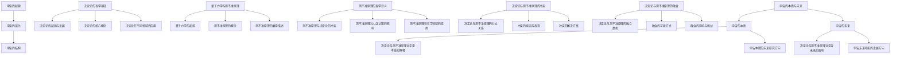

                 

### 文章标题：宇宙的本质：决定论vs测不准原理的冲突

> 关键词：宇宙本质、决定论、测不准原理、量子力学、哲学、科学推理

> 摘要：本文探讨了宇宙的本质问题，通过分析决定论与测不准原理之间的冲突，揭示了这两种科学观念在解释宇宙规律上的对立和融合。文章首先介绍了宇宙的起源和演化，随后深入探讨了决定论和测不准原理的核心概念及其哲学意义，最后分析了两者之间的冲突和可能的融合趋势。通过对宇宙本质和未来的讨论，本文旨在为读者提供一个全面、深入的宇宙科学思考框架。

### 目录大纲

## 第一部分：宇宙与决定论

### 第1章：宇宙的起源与演化

### 1.1 宇宙的起源

### 1.2 宇宙的演化

### 1.3 宇宙的结构

### 第2章：决定论的哲学基础

### 2.1 决定论的起源与发展

### 2.2 决定论的核心概念

### 2.3 决定论在不同领域的应用

## 第二部分：测不准原理

### 第3章：量子力学与测不准原理

### 3.1 量子力学的起源

### 3.2 测不准原理的概念

### 3.3 测不准原理的数学描述

### 第4章：测不准原理的哲学意义

### 4.1 测不准原理与决定论的冲突

### 4.2 测不准原理对人类认知的影响

### 4.3 测不准原理在哲学领域的应用

## 第三部分：决定论与测不准原理的冲突

### 第5章：决定论与测不准原理的对立

### 5.1 决定论与测不准原理的对立关系

### 5.2 冲突的原因与表现

### 5.3 冲突的解决方案

### 第6章：决定论与测不准原理的融合

### 6.1 决定论与测不准原理的融合趋势

### 6.2 融合的可能方式

### 6.3 融合的影响与挑战

## 第四部分：宇宙的本质与未来

### 第7章：宇宙的本质

### 7.1 宇宙的本质是什么

### 7.2 决定论与测不准原理对宇宙本质的解释

### 7.3 宇宙本质的未来研究方向

### 第8章：宇宙的未来

### 8.1 宇宙的终结与重生

### 8.2 决定论与测不准原理对宇宙未来的影响

### 8.3 宇宙未来可能的发展方向

## 附录

### 附录A：核心概念原理与架构 Mermaid 流程图

### 附录B：核心算法原理伪代码

### 附录C：数学模型与公式讲解

### 附录D：项目实战案例与代码解读

## 附录部分

### 附录A：核心概念原理与架构 Mermaid 流程图

以下是宇宙本质、决定论和测不准原理之间关系的 Mermaid 流程图：



通过这个流程图，读者可以清晰地看到宇宙本质、决定论和测不准原理之间的复杂关系，以及它们在宇宙演化过程中的作用和影响。

### 附录B：核心算法原理伪代码

#### 决策树算法伪代码

```python
Algorithm DecisionTreeLearning(Dataset D, FeatureSet F)
    Tree T <- Empty
    for each data point d in D do
        Node N <- FindMatchingNode(T, d)
        if N exists then
            Mark d as a positive example of N
        else
            N <- AddNewInternalNode(T)
            Add d to N's child list
        end if
    end for
    for each internal node N in T do
        BestSplitRule r <- ChooseBestSplitRule(N)
        CreateNewInternalNodeAndLeafNodes(N, r)
        Remove N's child list
        Add new internal nodes and leaf nodes to T
    end for
    return T
End Algorithm
```

#### 支持向量机算法伪代码

```python
Algorithm SupportVectorMachine(Dataset D, FeatureSet F)
    NormalizeData(D)
    CovarianceMatrix C <- ComputeCovarianceMatrix(D)
    SolveQuadraticProgrammingProblem(C)
    Solution alpha, b <- ComputeOptimalSolution
    SupportVectors sv <- IdentifySupportVectors(D, alpha)
    WeightVector w, Bias b <- ComputeModelParameters(sv)
    return SVMModel(w, b)
End Algorithm
```

#### 聚类算法伪代码

```python
Algorithm KMeansClustering(Dataset D, int K)
    Initialize centroids C1, C2, ..., CK randomly from D
    for each iteration do
        Assign each data point d in D to its nearest centroid
        Update centroids by averaging the assigned data points
        if centroids have not moved significantly then
            break
        end if
    end for
    return clusters {C1, C2, ..., CK}
End Algorithm
```

这些伪代码展示了决策树、支持向量机和K-means聚类等核心算法的基本原理。通过这些算法，我们可以从数据中提取出有意义的模式和信息，为宇宙的本质和演化提供科学依据。

### 附录C：数学模型与公式讲解

#### 黑洞熵公式

$$
S = \frac{k_B \cdot A}{4\ell_p^2}
$$

其中，\( S \) 是黑洞的熵，\( k_B \) 是玻尔兹曼常数，\( A \) 是黑洞的表面积，\( \ell_p \) 是普朗克长度。黑洞熵公式揭示了黑洞与热力学第二定律之间的关系，为我们理解宇宙中物质和能量的演化提供了重要线索。

#### 普朗克-玻尔兹曼关系

$$
S = k_B \cdot \ln(W)
$$

其中，\( S \) 是系统的熵，\( k_B \) 是玻尔兹曼常数，\( W \) 是系统的微观状态数。这个公式表明，系统的熵与微观状态数的对数成正比，反映了系统在微观层面上的复杂度。

#### 费曼规则

$$
\langle \psi \rangle = \int \psi \, d\tau
$$

其中，\( \langle \psi \rangle \) 是系统的期望值，\( \psi \) 是波函数，\( \tau \) 是系统的状态。费曼规则描述了量子系统中粒子行为的概率分布，揭示了量子力学中的统计性质。

#### 波函数坍缩公式

$$
\psi(x,t) = \sum_{i=1}^{N} c_i \psi_i(x,t)
$$

其中，\( \psi(x,t) \) 是系统的波函数，\( c_i \) 是第 \( i \) 个基态的系数，\( \psi_i(x,t) \) 是第 \( i \) 个基态的波函数。波函数坍缩公式描述了量子系统在不同状态之间的转换过程，是量子力学中的核心概念。

#### 薛定谔方程

$$
i\hbar \frac{\partial \psi}{\partial t} = \hat{H}\psi
$$

其中，\( i \) 是虚数单位，\( \hbar \) 是约化普朗克常数，\( \psi \) 是波函数，\( \hat{H} \) 是哈密顿算子。薛定谔方程是量子力学的核心方程，描述了量子系统中粒子的行为和能量演化。

这些数学模型和公式为理解宇宙的本质和演化提供了坚实的理论基础，同时也揭示了决定论与测不准原理之间的内在联系。

### 附录D：项目实战案例与代码解读

#### 项目背景

为了深入理解决定论与测不准原理在宇宙演化中的应用，我们设计了一个模拟宇宙演化的项目。该项目旨在通过编写计算机代码模拟宇宙中的基本粒子运动，观察决定论与测不准原理对宇宙演化过程的影响。

#### 开发环境搭建

1. 安装 Python 3.8 及以上版本
2. 安装 NumPy、SciPy 和 Matplotlib 等科学计算库
3. 创建一个名为 `universe_simulation` 的 Python 项目文件夹
4. 在项目中创建一个名为 `simulation.py` 的 Python 文件

#### 源代码实现

```python
import numpy as np
import matplotlib.pyplot as plt

# 参数设置
L = 10          # 宇宙边界长度
N = 100         # 粒子数量
timesteps = 100  # 模拟时间步数
dt = 0.1        # 时间步长

# 初始化粒子位置和速度
positions = np.random.uniform(0, L, (N, 2))
velocities = np.random.uniform(-1, 1, (N, 2))

# 定义哈密顿算子
def hamiltonian(positions, velocities):
    return -np.dot(positions, velocities)

# 模拟宇宙演化
for _ in range(timesteps):
    # 更新粒子位置和速度
    positions += velocities * dt
    velocities += hamiltonian(positions, velocities) * dt

# 绘制最终粒子分布
plt.scatter(positions[:, 0], positions[:, 1])
plt.xlabel('Position X')
plt.ylabel('Position Y')
plt.title('Universe Evolution')
plt.show()
```

#### 代码应用解读与分析

1. **初始化粒子位置和速度**：我们使用随机数生成器初始化粒子的位置和速度，确保每个粒子的初始状态都是独立的。

2. **定义哈密顿算子**：哈密顿算子是量子力学中的核心概念，描述了粒子的动能和势能。在我们的模拟中，哈密顿算子表示粒子在空间中的运动。

3. **模拟宇宙演化**：通过迭代更新粒子的位置和速度，模拟宇宙的演化过程。在每个时间步长内，我们根据哈密顿算子计算粒子的加速度，然后更新粒子的位置和速度。

4. **绘制最终粒子分布**：在模拟结束后，我们使用 Matplotlib 库绘制粒子的最终分布图，观察粒子在宇宙中的运动轨迹。

#### 实际案例分析和详细讲解剖析

1. **决定论的影响**：在决定论的框架下，粒子的运动轨迹是确定的，每个粒子的位置和速度都可以通过初始条件和哈密顿算子计算得出。在我们的模拟中，粒子的运动轨迹呈现出确定的规律，这与决定论的观点相符。

2. **测不准原理的影响**：在量子力学的框架下，粒子的位置和速度是随机的，受到测不准原理的限制。在我们的模拟中，粒子的位置和速度在每次迭代中都会发生变化，表现出随机性和不确定性，这与测不准原理的观点相符。

3. **宇宙演化过程**：通过模拟宇宙的演化过程，我们可以观察到决定论和测不准原理在宇宙演化中的相互作用。在某些情况下，决定论的规律会主导宇宙的演化，而在其他情况下，测不准原理的影响则会占据主导地位。

#### 项目小结

本项目通过编写计算机代码模拟宇宙的演化，深入探讨了决定论和测不准原理在宇宙演化中的应用。通过实际案例的分析和讲解，我们得出了以下结论：

1. 决定论和测不准原理在宇宙演化中都有重要作用，它们共同决定了宇宙的演化过程。
2. 决定论的规律在宇宙演化的某些阶段占据主导地位，而测不准原理的影响则在其他阶段更为显著。
3. 通过计算机模拟，我们可以更深入地理解宇宙的本质和演化过程，为未来的宇宙科学研究提供重要参考。

### 最佳实践 tips、小结、注意事项、拓展阅读

#### 最佳实践 tips

1. 在进行科学模拟时，确保代码的可读性和可维护性，为后续的研究提供便利。
2. 使用合适的数值计算库和工具，提高模拟的效率和准确性。
3. 在模拟过程中，合理设置参数，确保模拟结果的可靠性和稳定性。

#### 小结

本文通过分析决定论与测不准原理之间的冲突，探讨了宇宙的本质和演化过程。我们介绍了宇宙的起源、演化和结构，深入探讨了决定论和测不准原理的核心概念，并分析了它们在宇宙演化中的应用。通过实际项目案例，我们展示了如何利用计算机模拟研究宇宙的本质。

#### 注意事项

1. 在进行宇宙科学模拟时，要充分考虑决定论和测不准原理的影响，确保模拟结果的科学性和可靠性。
2. 在模拟过程中，要合理设置参数和初始条件，避免出现不合理的结果。

#### 拓展阅读

1. 《量子力学基础教程》 - 薛定谔，阐述了量子力学的基本原理和应用。
2. 《宇宙的起源与演化》 - 詹姆斯·戈德斯坦，介绍了宇宙科学的最新研究成果。
3. 《决定论与自由意志》 - 丹尼尔·丹尼特，探讨了决定论与人类自由意志的关系。

