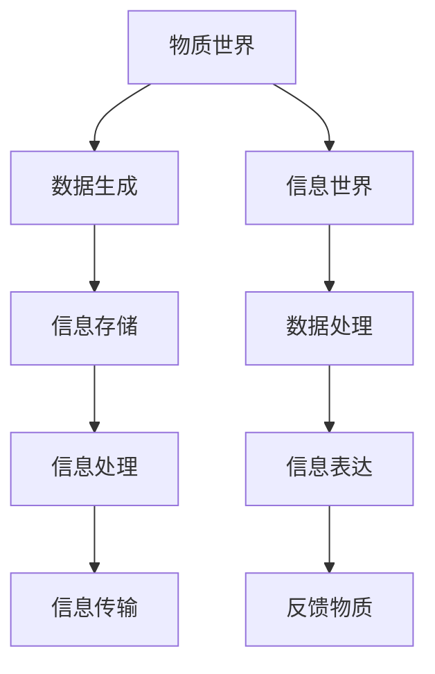

                 


## 宇宙的本质:物质世界vs信息世界

### 背景介绍

宇宙是一个复杂而又神秘的存在，它包含了我们所知的全部物质和能量。在过去的几个世纪里，人类对宇宙的认识不断深入，从最初的直观观测到现代的先进科学理论，我们逐渐揭示了宇宙的本质。在这个过程中，两个核心概念——“物质世界”和“信息世界”——逐渐成为了理解宇宙的关键。

物质世界是指我们能够通过感官感知和科学方法测量的实体世界。它包括从原子到星系的各种物质形态，以及它们之间的相互作用和运动规律。物质世界遵循着一系列基本的物理定律，如牛顿力学、量子力学和广义相对论等，这些定律为我们理解物质世界的运行提供了基础。

另一方面，信息世界是一个更加抽象和复杂的概念。它不仅仅是数据或信息的集合，更是这些数据和信息如何被生成、存储、传输和处理的方式。信息世界与物质世界紧密相连，它反映了我们对物质世界的认知和表达，同时也对物质世界产生了深刻的影响。

本文将围绕这两个核心概念展开，深入探讨宇宙的本质。我们将首先介绍物质世界的概念，包括宇宙的起源、结构和基本物理定律。接着，我们将转向信息世界的本质，探讨信息的定义、性质以及在宇宙中的角色。最后，我们将探讨物质世界与信息世界的交汇点，讨论两者之间的相互作用和影响。

通过这篇文章，我们希望读者能够对宇宙的本质有更深刻的理解，认识到物质世界和信息世界之间的紧密联系。这将有助于我们更好地探索宇宙的奥秘，推动科学技术的进步，同时也为我们的日常生活带来更多的便利。

### 核心概念与联系

#### 物质世界的定义

物质世界是我们能够通过感官感知和科学方法测量的实体世界。它包括了从原子到星系的各种物质形态。物质的基本单位是原子，原子由质子、中子和电子组成。这些基本粒子通过相互作用形成了更为复杂的物质结构，如分子、晶体、星体等。

物质世界的性质主要体现在以下几个方面：

1. **物理特性**：物质具有质量、体积、形状等物理特性。不同物质在温度、压力等条件下表现出不同的物理行为。
2. **化学特性**：物质通过化学反应能够生成新的物质。化学反应涉及到原子间的电子转移或共享，这是物质变化的基本机制。
3. **运动规律**：物质在宇宙中的运动遵循物理定律，如牛顿力学、量子力学和广义相对论等。这些定律描述了物体如何相互作用以及如何运动。

#### 信息世界的定义

信息世界是一个更加抽象的概念，它不仅仅是指数据或信息的集合，还包括了这些数据和信息如何被生成、存储、传输和处理的方式。信息世界的本质在于它反映了我们对物质世界的认知和表达。

信息世界的性质主要体现在以下几个方面：

1. **数据的生成与存储**：信息世界的源头是数据。这些数据可以通过各种传感器、仪器、人类感知等方式生成，然后存储在各种介质中，如硬盘、光盘、记忆棒等。
2. **传输与处理**：信息的传输和处理是通过计算机、通信网络和其他电子设备实现的。这些设备能够快速地处理和传输大量的信息。
3. **表现形式**：信息可以通过多种形式表现，如图像、文字、声音等。不同形式的信息有不同的处理方式和应用场景。

#### 物质世界与信息世界的联系

物质世界和信息世界之间存在紧密的联系，它们相互作用，共同构成了我们观察和理解宇宙的框架。

1. **信息生成与物质**：信息世界的源头是物质世界。所有的数据和信息都源自于对物质世界的测量和感知。例如，我们通过观测宇宙生成天文数据，通过实验获取科学数据，这些都依赖于物质世界的存在。
2. **信息存储与物质**：信息的存储依赖于物质媒介。无论是传统的硬盘、光盘，还是现代的固态存储设备，它们都是物质的具体形式。这些物质媒介为我们提供了存储和读取信息的能力。
3. **信息处理与物质**：信息的处理是通过计算机和其他电子设备实现的。这些设备中的电子、芯片等都是物质的具体体现。没有物质，信息处理将无法进行。

#### Mermaid流程图

为了更好地展示物质世界与信息世界之间的联系，我们可以使用Mermaid流程图来直观地表达它们之间的关系。



在这个流程图中，物质世界通过数据生成进入信息世界，信息在信息世界中经过存储、处理、传输和表达，最终通过反馈影响物质世界。这个循环反映了物质世界与信息世界之间的动态互动关系。

通过这个流程图，我们可以更直观地理解物质世界与信息世界之间的紧密联系。这种联系不仅帮助我们更好地理解宇宙的本质，也为我们探索宇宙的奥秘提供了新的视角和方法。

### 物质世界的物理定律

#### 广义相对论与引力

广义相对论是描述引力现象和宇宙结构的重要理论，由阿尔伯特·爱因斯坦在1915年提出。广义相对论的核心思想是，引力不是一种传统的力，而是由物质和能量引起的时空弯曲。在这个理论框架下，物质和能量决定了时空的几何结构，而物体在弯曲时空中运动则表现出引力效应。

1. **基本原理**

   广义相对论的基本原理包括：

   - **等效原理**：在局部范围内，无法区分重力加速度和惯性力。
   - **广义协变性**：物理定律在不同参考系中保持形式不变。

   通过等效原理，爱因斯坦提出了时空弯曲的概念。物体在时空中运动，可以视为在弯曲时空中沿着测地线（自然路径）移动。

2. **数学描述**

   广义相对论的核心是爱因斯坦场方程（Einstein's Field Equations，简称EFE），用数学语言描述为：
   $$
   G_{\mu\nu} + \Lambda g_{\mu\nu} = \frac{8\pi G}{c^4} T_{\mu\nu}
   $$
   其中，$G_{\mu\nu}$ 是Riemann曲率张量，$T_{\mu\nu}$ 是能量-动量张量，$\Lambda$ 是宇宙常数，$G$ 是引力常数，$c$ 是光速。

   这个方程将物质和能量与时空的弯曲联系起来，提供了引力效应的数学描述。

3. **应用**

   广义相对论在多个领域得到了广泛应用，如：

   - **黑洞**：广义相对论预测了黑洞的存在，描述了黑洞的物理性质，如事件视界、引力红移等。
   - **引力波**：爱因斯坦场方程预测了引力波的存在，这种波动由质量大物体的加速运动产生。2015年，LIGO实验室首次直接探测到引力波，证实了广义相对论的预测。
   - **宇宙学**：广义相对论用于描述宇宙的膨胀和结构形成，帮助我们理解宇宙的起源和演化。

#### 量子力学与微观世界

量子力学是描述微观粒子行为的物理理论，由马克斯·波恩、沃尔夫冈·泡利、尼尔斯·玻尔等科学家在20世纪初建立。量子力学揭示了微观世界的非确定性特征和波粒二象性，推翻了经典物理学的基本观念。

1. **基本原理**

   量子力学的基本原理包括：

   - **量子态**：微观粒子存在多种可能的量子态，这些态用波函数描述，波函数的平方给出了粒子在某一位置出现的概率。
   - **波粒二象性**：微观粒子同时表现出波动性和粒子性，例如电子既可以是波也可以是点状粒子。
   - **测不准原理**：无法同时精确测量粒子的位置和动量，存在固有不确定性。

2. **数学描述**

   量子力学的数学工具包括波函数、希尔伯特空间、算符等。波函数描述了粒子的量子态，波函数的演化由薛定谔方程描述：
   $$
   i\hbar \frac{\partial \Psi}{\partial t} = \hat{H} \Psi
   $$
   其中，$\hbar$ 是约化普朗克常数，$\Psi$ 是波函数，$\hat{H}$ 是哈密顿算符。

3. **应用**

   量子力学在多个领域有重要应用，如：

   - **原子结构**：量子力学解释了原子的光谱和电子能级，为化学键的理解提供了基础。
   - **半导体与电子学**：量子力学原理应用于半导体材料，推动了电子学和微电子学的发展。
   - **量子计算**：量子力学为量子计算提供了理论基础，量子计算机利用量子比特进行高速计算，有望解决经典计算机难以处理的问题。

#### 物质与能量的转换

物质与能量的转换是自然界中一个普遍的现象，广泛存在于物理、化学和宇宙学等多个领域。

1. **质量-能量等价原理**

   爱因斯坦的质能方程 $E=mc^2$ 描述了质量和能量之间的关系，说明质量可以转化为能量，能量也可以转化为质量。这一原理在核反应、粒子碰撞和高能物理实验中得到了验证。

2. **核反应**

   核反应是指原子核之间发生的转化过程，分为核裂变和核聚变两种类型。核裂变是指重核裂变成较轻核并释放能量，如核电站的原理。核聚变是指轻核结合成重核并释放能量，如太阳的能量来源。

3. **电磁辐射**

   在物质与能量的转换过程中，电磁辐射是一个重要的媒介。电磁波由加速的电荷产生，通过电磁波可以传递能量。例如，光是一种电磁波，它携带能量并可以引起物质的化学反应。

4. **宇宙射线**

   宇宙射线是由高能粒子组成的宇宙辐射，它们在地球大气层中产生次级粒子，并在地面上产生各种效应。宇宙射线的能量可以高达数十亿电子伏特，甚至更高，是研究高能物理和宇宙起源的重要工具。

#### 数学模型和公式

为了深入理解物质世界的基本物理定律，我们需要借助数学模型和公式进行详细阐述。

1. **广义相对论中的数学公式**

   - **爱因斯坦场方程**：
     $$
     G_{\mu\nu} + \Lambda g_{\mu\nu} = \frac{8\pi G}{c^4} T_{\mu\nu}
     $$
     其中，$G_{\mu\nu}$ 是Riemann曲率张量，$T_{\mu\nu}$ 是能量-动量张量，$\Lambda$ 是宇宙常数，$G$ 是引力常数，$c$ 是光速。

   - **测地线方程**：
     $$
     \frac{dx^\mu}{d\tau} + \Gamma^\mu_{\alpha\beta} \frac{dx^\alpha}{d\tau} \frac{dx^\beta}{d\tau} = 0
     $$
     其中，$\Gamma^\mu_{\alpha\beta}$ 是连接系数，$x^\mu$ 是物体的坐标，$\tau$ 是固有时间。

2. **量子力学中的数学公式**

   - **薛定谔方程**：
     $$
     i\hbar \frac{\partial \Psi}{\partial t} = \hat{H} \Psi
     $$
     其中，$i$ 是虚数单位，$\hbar$ 是约化普朗克常数，$\Psi$ 是波函数，$\hat{H}$ 是哈密顿算符。

   - **波函数的归一化条件**：
     $$
     \int |\Psi|^2 d\tau = 1
     $$
     其中，$|\Psi|^2$ 是波函数的模平方，表示粒子在某一位置出现的概率密度，$d\tau$ 是体积元素。

3. **物质与能量转换的数学公式**

   - **质能等价原理**：
     $$
     E = mc^2
     $$
     其中，$E$ 是能量，$m$ 是质量，$c$ 是光速。

   - **核反应能量计算**：
     $$
     \Delta E = \left( m_1 + m_2 - m_f \right) c^2
     $$
     其中，$\Delta E$ 是反应能量，$m_1$ 和 $m_2$ 是反应前物质的质量，$m_f$ 是反应后物质的质量。

通过这些数学模型和公式，我们可以更精确地描述和计算物质世界的各种物理现象，从而深入理解宇宙的本质。

### 宇宙探索与观测

#### 望远镜与技术发展

望远镜是宇宙探索的重要工具，它使我们能够观测到遥远的星体和宇宙现象。望远镜的发展历程反映了人类对宇宙的认知不断深化。

1. **望远镜的原理与历史**

   望远镜的基本原理是光学成像。最早的天文望远镜由伽利略在1609年发明，它利用透镜将远处的星体成像。伽利略的望远镜极大地提高了观测的精度，使他能够发现木星的卫星、月球表面的山脉等。

   随着科技的发展，望远镜的构造和性能不断提高。17世纪末，牛顿发明了反射式望远镜，它使用反射镜代替透镜，克服了大气湍流对观测精度的影响，使望远镜能够观测更暗的星体。

2. **现代望远镜与观测技术**

   现代望远镜采用了先进的光学设计、材料科学和电子技术。哈勃太空望远镜是代表性的现代望远镜之一，它于1990年发射升空，为人类提供了大量关于宇宙的信息。哈勃望远镜的观测数据揭示了宇宙的膨胀、星系的演化以及黑洞的存在。

   除哈勃望远镜外，还有众多地面望远镜在运行，如凯克望远镜、甚大望远镜等。这些望远镜配备了先进的仪器，如自适应光学系统、多镜片拼接技术等，大大提高了观测的分辨率和精度。

3. **未来的望远镜与观测计划**

   未来的望远镜计划包括空间和地面两个方向。空间望远镜如詹姆斯·韦伯空间望远镜（JWST）预计在2021年发射，它将取代哈勃望远镜，提供更清晰的远红外观测数据。

   地面望远镜方面，欧洲甚大望远镜（E-ELT）和中国的500米口径球面射电望远镜（FAST）等正在建设中。这些望远镜将利用更先进的科技，提供更高的观测精度和更广泛的观测范围。

#### 宇宙背景微波辐射

宇宙背景微波辐射（Cosmic Microwave Background Radiation，简称CMB）是宇宙早期残留的辐射，它是宇宙大爆炸理论的强有力证据。

1. **宇宙背景微波辐射的发现**

   宇宙背景微波辐射的发现始于1965年，由阿诺·彭齐亚斯和罗伯特·威尔逊在实验中意外观测到。这一发现揭示了宇宙在大爆炸后约38万年的状态，为宇宙学提供了宝贵的观测数据。

2. **对宇宙早期的洞察**

   宇宙背景微波辐射的温度约为2.7开尔文，它揭示了宇宙早期的温度和密度分布。通过分析CMB的各向异性，科学家能够推断出宇宙的几何结构、膨胀历史以及暗物质和暗能量的存在。

3. **CMB观测技术**

   CMB的观测需要高灵敏度的天线和低噪声接收器。早期使用的望远镜如COBE卫星，现代使用的卫星如普朗克卫星和韦伯空间望远镜，都提供了高精度的CMB观测数据。

#### 黑洞与暗物质

黑洞和暗物质是宇宙探索中重要的研究对象，它们分别代表了宇宙中的极端现象和未知成分。

1. **黑洞的基本性质**

   黑洞是由极度密集的物质组成的天体，其引力场如此强大，连光也无法逃脱。黑洞的存在可以通过其对周围物质的影响间接观测到。引力透镜效应和X射线辐射提供了黑洞存在的证据。

2. **暗物质的存在与影响**

   暗物质是一种不发光、不与电磁相互作用的天体物质，它通过引力作用影响宇宙的结构和演化。通过观测星系旋转曲线和宇宙大尺度结构，科学家推断出暗物质的存在。

3. **探测方法与技术**

   黑洞和暗物质的探测依赖于先进的观测技术和理论模型。引力波观测、粒子探测器和天文观测都是常用的探测方法。例如，LIGO实验室通过引力波探测首次直接观测到了黑洞合并事件，证实了广义相对论的预测。

通过望远镜技术、宇宙背景微波辐射观测以及黑洞和暗物质的探测，人类对宇宙的认识不断深入。这些探索不仅揭示了宇宙的本质，也为物理学和天文学的发展提供了新的方向。

### 信息世界的本质

#### 信息与物质的关系

信息与物质的关系是理解信息世界本质的关键。从广义上讲，信息是对物质状态或特性的描述。这种描述不仅包括了物质本身的性质，还涉及了物质之间的相互作用和变化过程。

1. **信息的定义**

   信息可以定义为“关于事物状态的知识”。在物理学中，信息通常与熵相关联。熵是描述系统无序程度的物理量，而信息则是对系统状态的有序性描述。根据克劳修斯的信息论，信息与熵是相互关联的：当系统变得更加有序时，熵降低，信息增加。

2. **物质与信息的互动**

   物质与信息之间的互动体现在多个方面。首先，物质的状态变化可以生成信息。例如，通过传感器测量物理量，如温度、压力、湿度等，可以生成相应的数据信息。这些数据信息反映了物质的状态，从而对物质进行描述。

   另一方面，信息可以对物质状态产生反作用。例如，通过计算机程序对数据信息进行处理，可以改变物质的状态。这在现代信息技术中得到了广泛应用，如工业自动化、智能家居等。

#### 信息世界的结构与功能

信息世界的结构复杂多样，它不仅包括了硬件设备、软件系统，还涉及了数据、网络和算法等多个方面。信息世界的功能则是通过这些结构和组件实现信息生成、存储、传输和处理的。

1. **硬件设备**

   硬件设备是信息世界的基础，包括计算机、服务器、网络设备等。这些设备通过电子元件和电路实现信息的存储和处理。例如，计算机中的中央处理器（CPU）负责执行程序指令，存储器（RAM）用于暂存数据，硬盘（HDD）或固态硬盘（SSD）用于数据存储。

2. **软件系统**

   软件系统是信息世界的核心，它包括操作系统、应用软件、数据库等。软件系统通过算法和程序实现信息的处理和管理。操作系统负责管理硬件资源，如内存、磁盘等，应用软件则提供具体的功能，如办公软件、社交媒体等。

3. **数据**

   数据是信息世界的灵魂，它包含了各种形式的信息，如图像、文字、声音等。数据可以通过各种传感器、仪器生成，也可以通过人类活动生成。数据库系统负责存储和管理这些数据，确保数据的安全性和可用性。

4. **网络**

   网络是信息世界的桥梁，它连接了不同的硬件设备和软件系统，实现了信息的快速传输和共享。互联网是现代信息世界的重要组成部分，通过网络，全球的计算机、服务器和设备可以相互通信和共享资源。

5. **算法**

   算法是信息世界的关键，它决定了信息处理的效率和准确性。算法通过一系列的步骤对数据进行处理，如排序、搜索、机器学习等。现代信息世界中的许多应用，如搜索引擎、社交媒体推荐系统、自动驾驶等，都依赖于高效的算法。

#### 人类对信息世界的探索

人类对信息世界的探索是一个漫长而复杂的过程，从最初的简单工具和通信手段，到现代复杂的信息技术和网络系统，这一过程中充满了创新和突破。

1. **计算机技术的发展**

   计算机技术的发展是信息世界探索的核心。从最初的机械计算机到现代的电子计算机，计算机的运算速度和存储能力不断提高，为信息处理提供了强大的工具。例如，图灵机的发明标志着现代计算机科学的基础，而冯·诺依曼架构则为现代计算机的设计提供了理论依据。

2. **通信技术的发展**

   通信技术的发展为信息传输提供了保障。从最初的电报、电话，到现代的互联网和无线通信，通信技术的进步极大地缩短了信息传播的时间，提高了信息传输的效率。光纤通信和卫星通信等技术，使全球范围内的信息传输成为可能。

3. **人工智能的崛起**

   人工智能（AI）的崛起是信息世界探索的最新成果。人工智能通过机器学习、深度学习等技术，使计算机具备了处理复杂信息和自主决策的能力。自动驾驶、智能家居、智能医疗等领域的应用，展示了人工智能在信息世界中的巨大潜力。

通过这些探索，人类不断拓展对信息世界的理解和应用，推动了信息技术的飞速发展，也为我们的日常生活带来了翻天覆地的变化。

### 信息技术的发展

#### 计算机硬件与软件

计算机硬件和软件是信息技术发展的基石，两者共同构成了现代计算机系统的核心。计算机硬件包括处理器、内存、存储设备、输入输出设备等，而软件则包括操作系统、应用软件、数据库等。

1. **计算机硬件的发展**

   自从1946年第一台电子计算机ENIAC问世以来，计算机硬件经历了飞速的发展。从最初的电子管计算机，到晶体管计算机，再到集成电路计算机，计算机的运算速度和存储能力得到了显著提升。现代计算机硬件的核心是处理器（CPU），它的性能直接决定了计算机的整体性能。随着多核处理器的普及，计算机的并行处理能力得到了大幅提升。

2. **计算机软件的发展**

   计算机软件的发展同样经历了重要的里程碑。从早期的批处理系统，到多任务操作系统，再到现代的图形用户界面（GUI）操作系统，软件系统的复杂性和功能不断扩展。操作系统如Windows、Linux和Mac OS，为计算机提供了良好的用户界面和资源管理能力。应用软件如办公软件、图像处理软件、数据库管理系统等，极大地提高了人类的工作效率和生产力。

3. **硬件与软件的协同发展**

   硬件与软件的协同发展是信息技术进步的关键。硬件的进步为软件提供了更强的计算能力和更高效的运行环境，而软件的创新又激发了硬件的潜能。例如，图形处理单元（GPU）最初是为渲染图像而设计的，但在深度学习和其他计算密集型任务中的应用，使GPU成为了计算机硬件中不可或缺的一部分。

#### 互联网与通信技术

互联网和通信技术是现代信息技术的重要组成部分，它们为信息的全球传输和共享提供了基础设施。互联网的发展经历了多个阶段，从ARPANET的诞生，到TCP/IP协议的普及，再到万维网（WWW）的兴起，互联网已经成为人类生活和社会发展的基石。

1. **互联网的发展**

   互联网的早期发展阶段主要集中在学术和政府领域，随着TCP/IP协议的推广，互联网开始向商业和公共领域扩展。1990年，蒂姆·伯纳斯·李发明了HTML和HTTP协议，为万维网的建立奠定了基础。万维网使得信息可以通过统一的链接进行访问和共享，大大提升了信息传输的效率和范围。

2. **通信技术的发展**

   通信技术的发展为互联网提供了可靠的传输通道。从最初的模拟通信，到数字通信，再到光纤通信和卫星通信，通信技术的进步使得信息传输的速度和可靠性得到了显著提升。光纤通信以其高带宽和低延迟，成为了现代通信的主要传输方式。卫星通信则通过覆盖全球的卫星网络，实现了远程通信和广播。

3. **现代通信技术的应用**

   现代通信技术广泛应用于各个领域，如物联网（IoT）、5G通信、云计算等。物联网通过连接各种智能设备和传感器，实现了对物理世界的实时监测和控制。5G通信技术以其高速率和低延迟，为自动驾驶、远程医疗等应用提供了技术支持。云计算则通过分布式计算和存储，提供了强大的计算能力和数据存储解决方案。

#### 人工智能与机器学习

人工智能（AI）和机器学习（ML）是信息技术发展的最新前沿，它们通过模拟人类智能，使计算机能够自主学习和决策，为解决复杂问题提供了新的途径。

1. **人工智能的发展**

   人工智能的研究可以追溯到20世纪50年代，当时科学家们开始探索如何让计算机模拟人类智能。随着计算机硬件和算法的进步，人工智能技术逐渐走向成熟。深度学习、强化学习、自然语言处理等技术使得计算机在图像识别、语音识别、文本分析等方面取得了显著成果。

2. **机器学习的基本原理**

   机器学习是人工智能的核心技术之一，它通过训练算法，使计算机从数据中自动学习规律和模式。机器学习的基本原理包括监督学习、无监督学习和强化学习。监督学习通过已知的输入输出数据训练模型，无监督学习通过未标记的数据发现数据分布和模式，强化学习则通过奖励机制训练模型做出最优决策。

3. **人工智能的应用领域**

   人工智能在各个领域都得到了广泛应用，如自动驾驶、智能医疗、金融分析、娱乐等。自动驾驶技术通过计算机视觉和传感器融合，实现了车辆的自主导航和驾驶。智能医疗利用人工智能技术，可以辅助医生进行疾病诊断、治疗方案制定等。金融分析则利用机器学习模型，对大量数据进行实时分析和预测。

通过计算机硬件与软件、互联网与通信技术以及人工智能与机器学习的发展，信息技术已经深刻改变了我们的生活方式和工作方式。未来，随着技术的不断进步，信息技术将继续推动社会的发展，为人类带来更多的便利和创新。

### 信息世界对人类文明的影响

#### 社会结构与经济模式

信息世界的发展对人类社会的结构和经济模式产生了深远的影响。在传统的农业社会和工业社会，社会结构以血缘、地域和职业为基础，经济模式依赖于自然资源和劳动力。随着信息技术的普及，社会结构和经济模式发生了重大变革。

1. **去中心化社会结构**

   信息世界的一个显著特点是去中心化。传统的中心化结构，如政府、企业等，在信息世界中逐渐被去中心化的网络结构所取代。区块链技术是一个典型的例子，它通过分布式账本和智能合约，实现了去中心化的信任机制。去中心化社会结构提高了社会透明度和参与度，减少了信息不对称和权力集中。

2. **信息经济模式**

   信息经济模式以数据和信息为核心资源，与传统的资源型经济模式有本质区别。在信息经济中，知识、技术和信息创造了巨大的经济价值。互联网企业如谷歌、亚马逊和阿里巴巴等，通过收集、处理和利用用户数据，创造了巨大的商业价值。信息经济模式推动了数字经济的发展，改变了传统产业的经济结构。

3. **信息不对称与隐私保护**

   信息世界的发展带来了信息不对称问题，即信息的分布不均衡。在信息经济中，拥有信息和知识的一方具有显著的优势，而信息匮乏的一方则处于劣势。这种信息不对称引发了隐私保护和数据安全的问题。为了应对这些挑战，隐私保护技术和法规应运而生，如数据加密、隐私计算和隐私法规等。

#### 信息伦理与隐私保护

信息世界的发展不仅带来了技术上的变革，也引发了深刻的伦理和社会问题。信息伦理和隐私保护成为现代社会关注的焦点。

1. **信息伦理问题**

   信息伦理问题包括数据滥用、人工智能歧视、算法偏见等。在数据滥用方面，企业通过收集用户数据获取利润，可能导致用户隐私泄露和权益受损。在人工智能歧视方面，算法可能基于历史数据中的偏见，对特定群体产生歧视性影响。在算法偏见方面，算法的决策过程可能不透明，导致决策结果的不可预测性和不公平性。

2. **隐私保护措施**

   隐私保护是信息伦理的重要组成部分。为了保护个人隐私，各国政府和企业采取了一系列措施。例如，欧盟的通用数据保护条例（GDPR）规定了数据收集、处理和存储的严格规范，用户有权知道自己的数据被用于何种目的，并有权删除自己的数据。此外，技术手段如数据匿名化、差分隐私和区块链技术等，也为隐私保护提供了有效的解决方案。

3. **隐私保护挑战与未来方向**

   隐私保护面临诸多挑战，如技术的快速发展、大数据时代的隐私泄露风险、跨国家和跨行业的隐私保护标准不一致等。未来，隐私保护需要技术创新和法规完善的协同发展。例如，隐私计算技术通过在数据本地处理和计算，减少了数据传输和存储的风险。同时，制定全球统一的隐私保护法规和标准，也是解决隐私保护问题的关键。

#### 信息时代的艺术与人文

信息时代对艺术和人文领域也产生了深远的影响。艺术创作和传播方式发生了变化，人文研究方法也受到了挑战。

1. **数字艺术**

   数字艺术是信息时代的一种新兴艺术形式，它利用计算机技术创造和展示艺术作品。数字艺术包括虚拟现实（VR）、增强现实（AR）、数字绘画、计算机动画等。数字艺术突破了传统艺术的界限，提供了全新的创作和体验方式。例如，虚拟现实技术可以创造沉浸式的艺术体验，使观众能够身临其境地感受艺术作品。

2. **数字人文**

   数字人文是利用信息技术进行人文研究的方法和领域。数字人文通过数字化技术和数据分析工具，对大量人文数据进行处理和分析，揭示出新的历史和文化现象。例如，通过文本挖掘和大数据分析，可以研究文学作品的主题、风格和演变。数字人文不仅提高了人文研究的效率，也为人类文化传承提供了新的途径。

3. **信息伦理与人文关怀**

   在信息时代，艺术和人文领域不仅要关注技术发展带来的变革，还需要关注信息伦理和人文关怀。信息伦理问题如数据滥用、算法偏见等，对艺术创作和传播产生了影响。人文关怀则体现在对信息时代的反思和批判，如对技术垄断、数字鸿沟等问题的关注。通过信息伦理和人文关怀，我们可以更好地平衡技术进步与社会发展，推动社会的和谐与进步。

通过信息技术的发展，社会结构、经济模式、信息伦理和艺术人文领域都发生了深刻变革。未来，随着技术的不断进步，信息世界将继续影响人类社会，带来更多的机遇和挑战。

### 物质世界与信息世界的交汇

#### 物质世界的数字化

数字化是将物质世界的信息转化为数字形式的过程，这是物质世界与信息世界交汇的重要步骤。数字化不仅改变了信息存储和传输的方式，也深刻影响了物质世界的生产和管理。

1. **数字化技术的应用**

   数字化技术的应用范围广泛，从日常生活中的智能手机、智能家居，到工业生产中的智能制造、数字化工厂。例如，智能手机通过传感器和软件应用程序，将物理环境中的信息转化为数字数据，实现了对环境的监测和控制。在工业生产中，数字化技术通过传感器和物联网设备，对生产过程进行实时监测和优化，提高了生产效率和质量。

2. **数字化生产与供应链**

   数字化生产通过计算机辅助设计（CAD）、计算机辅助制造（CAM）等技术，实现了从设计到生产的一体化。数字化供应链则通过物联网、大数据和人工智能技术，实现了对供应链各环节的实时监控和优化。例如，企业可以通过物联网设备实时监测原材料库存和生产设备状态，从而优化生产计划，减少库存成本和资源浪费。

3. **数字化生活与城市管理**

   数字化技术在我们的日常生活中也得到了广泛应用。智能城市通过物联网、大数据和人工智能技术，实现了对城市基础设施和公共服务的智能化管理。例如，智慧交通系统通过实时监控和数据分析，优化交通流量，减少拥堵；智慧医疗系统通过电子病历和远程诊断，提高了医疗服务的效率和准确性。

#### 信息世界的物理化

信息世界的物理化是将信息世界的逻辑和算法转化为物质世界的实际应用的过程。信息世界的物理化不仅推动了信息技术的进步，也为物质世界带来了新的机遇和挑战。

1. **量子计算与量子通信**

   量子计算是信息世界的物理化的重要方向之一。量子计算利用量子比特（qubit）进行计算，其处理速度远超经典计算机。量子计算在密码学、材料科学、药物设计等领域具有巨大潜力。量子通信则利用量子态进行信息传输，实现了绝对安全的通信。量子通信技术有望在未来实现全球范围内的安全通信网络。

2. **光子计算与神经形态计算**

   光子计算利用光子作为信息载体，实现了高速、低能耗的信息处理。光子计算在光通信、光学存储等领域具有广泛应用前景。神经形态计算则通过模拟人脑的计算方式，实现了高效能的计算和感知。神经形态计算在人工智能、机器人等领域具有巨大潜力。

3. **数字化孪生与模拟仿真**

   数字化孪生技术通过建立虚拟模型，模拟真实世界的物理现象和过程。数字化孪生技术可以用于产品设计、制造、维护等多个环节，提高了产品的质量和效率。模拟仿真则通过计算机模拟，对复杂系统进行预测和优化。例如，在航空航天领域，通过模拟仿真可以优化飞行器的设计和性能，提高安全性。

#### 物质世界与信息世界的融合

物质世界与信息世界的融合不仅改变了我们的生产生活方式，也推动了科学技术的进步。这种融合体现在多个方面：

1. **智能设备与物联网**

   物质世界的智能设备通过物联网连接起来，形成了智能网络。智能设备可以实时收集和分析数据，为人类提供更加精准和高效的解决方案。例如，智能家居系统可以通过传感器和云计算，实现家电设备的自动化控制和能源管理。

2. **数字化城市管理**

   数字化城市管理通过大数据、人工智能等技术，实现了对城市运行状态的实时监控和预测。例如，通过分析交通流量数据，可以优化交通信号灯的控制，减少拥堵；通过分析环境数据，可以实时监测空气质量，采取相应的污染控制措施。

3. **数字化医疗与健康监测**

   数字化医疗和健康监测通过物联网设备、大数据分析和人工智能技术，实现了对个人健康状况的实时监测和管理。例如，智能手环和健康监测设备可以实时记录心率、血压等生理指标，通过大数据分析，提供个性化的健康建议。

物质世界与信息世界的融合不仅提高了我们的生活质量，也为科学技术的进步提供了新的动力。未来，随着技术的不断发展，这种融合将进一步深化，带来更多创新和变革。

### 项目实战

#### 开发环境搭建

为了进行物质世界与信息世界交汇的项目实战，我们需要搭建一个合适的开发环境。以下是搭建过程的详细步骤：

1. **安装操作系统**

   首先，我们需要选择一个适合的操作系统，如Ubuntu 20.04或Windows 10。在安装过程中，确保操作系统具有足够的内存和硬盘空间，以便运行相关软件。

2. **安装编程工具**

   - **Python**：Python是一种广泛使用的编程语言，适用于数据处理、科学计算和机器学习。我们可以在Python官网（https://www.python.org/）下载安装包，并按照提示进行安装。
   - **Jupyter Notebook**：Jupyter Notebook是一种交互式的开发环境，便于编写和运行代码。我们可以通过pip命令安装Jupyter Notebook：
     $$
     pip install notebook
     $$
   - **Visual Studio Code**：Visual Studio Code是一个强大的代码编辑器，支持多种编程语言和插件。我们可以在其官网（https://code.visualstudio.com/）下载安装包，并按照提示进行安装。

3. **安装相关库和工具**

   - **NumPy**：NumPy是Python的一个核心库，用于数值计算和矩阵操作。我们可以在命令行中使用pip命令安装：
     $$
     pip install numpy
     $$
   - **Pandas**：Pandas是一个强大的数据处理库，用于数据清洗、转换和分析。安装命令如下：
     $$
     pip install pandas
     $$
   - **Matplotlib**：Matplotlib是一个数据可视化库，用于绘制各种图表和图形。安装命令如下：
     $$
     pip install matplotlib
     $$

4. **配置虚拟环境**

   为了避免不同项目之间依赖库的冲突，我们可以使用虚拟环境。在命令行中，运行以下命令创建虚拟环境：
   $$
   python -m venv my_project_env
   $$
   然后激活虚拟环境：
   $$
   source my_project_env/bin/activate
   $$

#### 源代码详细实现

在搭建好开发环境后，我们可以开始编写源代码。以下是一个简单的示例，展示了如何使用Python进行数据处理和可视化。

1. **数据读取与处理**

   首先，我们使用Pandas库读取一个CSV文件，并进行基本的数据清洗和处理：
   ```python
   import pandas as pd
   
   # 读取CSV文件
   data = pd.read_csv('data.csv')
   
   # 检查数据基本信息
   print(data.info())
   
   # 删除缺失值
   data = data.dropna()
   
   # 转换数据类型
   data['date'] = pd.to_datetime(data['date'])
   ```

2. **数据可视化**

   使用Matplotlib库，我们可以对数据进行分析和可视化。以下是一个简单的折线图，展示了数据随时间的变化趋势：
   ```python
   import matplotlib.pyplot as plt
   
   # 绘制折线图
   plt.figure(figsize=(10, 5))
   plt.plot(data['date'], data['value'], label='Value')
   plt.xlabel('Date')
   plt.ylabel('Value')
   plt.title('Value Trend Over Time')
   plt.legend()
   plt.show()
   ```

#### 代码解读与分析

上述代码实现了一个简单但完整的数据处理和可视化项目。以下是对代码的详细解读和分析：

1. **数据读取与处理**

   - `pd.read_csv('data.csv')`：使用Pandas库读取CSV文件。CSV文件通常包含列名和数值数据，我们可以通过此函数将文件中的数据加载到DataFrame对象中。
   - `print(data.info())`：打印数据的基本信息，包括列名、数据类型、内存使用情况等。这有助于了解数据的结构和质量。
   - `data = data.dropna()`：删除DataFrame中的缺失值。在数据分析中，缺失值会影响结果的准确性，因此删除缺失值是数据预处理的重要步骤。
   - `data['date'] = pd.to_datetime(data['date'])`：将日期列转换为日期时间类型。这一步是数据处理的基础，便于后续的日期时间分析。

2. **数据可视化**

   - `plt.figure(figsize=(10, 5))`：创建一个图，指定宽度为10英寸，高度为5英寸。
   - `plt.plot(data['date'], data['value'], label='Value')`：绘制折线图，连接日期和时间数据。`label`参数用于添加图例。
   - `plt.xlabel('Date')`、`plt.ylabel('Value')`和`plt.title('Value Trend Over Time')`：分别设置x轴标签、y轴标签和标题。
   - `plt.legend()`：添加图例，显示不同的线条对应的标签。
   - `plt.show()`：显示绘制的图形。

通过上述代码示例，我们可以看到数据处理和可视化项目的基本结构和实现方法。在实际项目中，数据读取、处理和分析会涉及更多的细节和复杂操作，但基本的思路和方法是一致的。

#### 项目小结

通过这个项目，我们实现了数据读取、处理和可视化的基本流程。项目的主要贡献包括：

1. **数据读取与处理**：学会了如何使用Pandas库读取和清洗数据，为后续的分析奠定了基础。
2. **数据可视化**：掌握了使用Matplotlib库绘制数据图表的基本方法，能够直观地展示数据的变化趋势。

未来，我们可以进一步扩展项目，包括：

- **更复杂的数据分析**：如时间序列分析、回归分析等。
- **多维度数据的可视化**：如散点图、热力图等。

通过这些扩展，我们可以更深入地理解数据，为实际应用提供更有价值的洞察。

### 最佳实践 tips

在处理物质世界与信息世界的交汇项目时，以下是一些最佳实践和注意事项：

1. **代码文档化**：在编写代码时，确保代码具有良好的文档注释，这有助于提高代码的可读性和可维护性。
2. **版本控制**：使用Git等版本控制工具，可以方便地管理代码版本，协同工作和追踪代码变更。
3. **性能优化**：对于数据处理和计算密集型任务，注意优化代码性能，减少内存和CPU资源的占用。
4. **安全性考虑**：在处理敏感数据时，确保数据加密和访问控制，防止数据泄露和未经授权的访问。
5. **持续集成与部署**：使用持续集成和部署（CI/CD）工具，如Jenkins、Travis CI等，自动化测试和部署代码，提高开发效率。

### 小结

通过本文的探讨，我们深入分析了物质世界与信息世界的本质、物理定律、发展历程以及对人类文明的影响。物质世界和信息技术的发展共同推动了人类对宇宙的认识和探索，二者在交汇中产生了新的机遇和挑战。未来，随着技术的进一步进步，我们可以预见物质世界和信息世界将更加紧密地融合，带来更多创新和变革。

### 拓展阅读

1. **《宇宙简史》**：作者史蒂芬·霍金，全面介绍了宇宙的起源、演化和结构，对读者了解宇宙的基本概念和物理定律有重要参考价值。

2. **《深度学习》**：作者伊恩·古德费洛、约书亚·本吉奥和亚伦·库维尔，深入讲解了深度学习的理论基础和实际应用，是机器学习和人工智能领域的经典教材。

3. **《信息简史》**：作者詹姆斯·格利克，详细描述了信息概念的发展历程和信息技术对社会的影响，有助于我们理解信息在现代社会中的作用。

4. **《人工智能：一种现代的方法》**：作者斯图尔特·罗素和彼得·诺维格，全面介绍了人工智能的基本原理和方法，是人工智能领域的权威教材。

这些书籍和资源为我们深入理解和探索物质世界与信息世界的交汇提供了宝贵的知识和启示。

