                 


### 第1章：宇宙起源与演化

#### 1.1 宇宙的起源理论

**背景介绍**

宇宙的起源一直是人类探索的重大课题。自古以来，人类就试图理解我们所处的宇宙是如何诞生的。从古代的宇宙神话，到现代的科学理论，宇宙起源的探究经历了漫长而曲折的历程。

**核心概念与联系**

宇宙起源的核心概念包括奇点理论、宇宙膨胀理论、暗物质和暗能量。这些概念之间的关系可以用以下Mermaid流程图来表示：

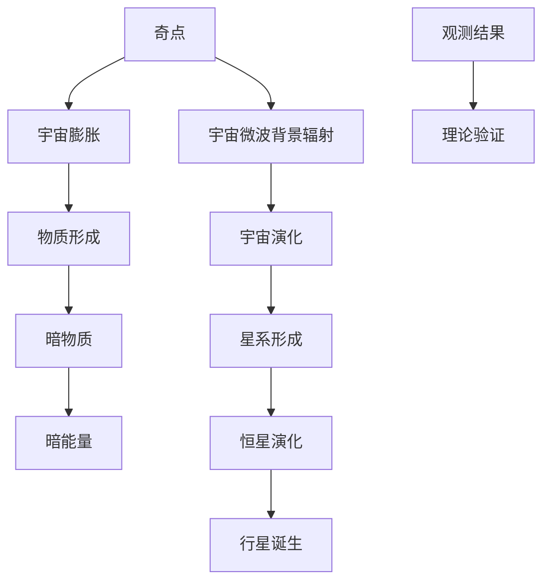

**核心算法原理讲解**

宇宙起源的算法原理主要基于数学模型和物理理论。以下是一个简化的伪代码，用于描述宇宙从奇点膨胀到物质形成的演化过程：

```python
def universe_formation():
    start_condition = "singularity"
    evolution_process = ["expansion", "cooling", "matter Formation"]
    end_condition = "宇宙微波背景辐射"
    
    if start_condition == "singularity":
        print("初始条件：奇点")
        for step in evolution_process:
            print(f"演化过程：{step}")
            if step == "expansion":
                print("膨胀：宇宙空间开始扩展")
            elif step == "cooling":
                print("冷却：温度下降，物质形成")
            elif step == "matter Formation":
                print("物质形成：原子核和基本粒子形成")
        
        print(f"结束条件：{end_condition}")
```

**数学模型和公式**

宇宙起源的数学模型和公式涉及广义相对论和宇宙学常数。以下是一个简单的数学模型，描述宇宙的膨胀：

$$
H(t) = \frac{\dot{a}(t)}{a(t)}
$$

其中，$H(t)$ 是哈勃参数，$\dot{a}(t)$ 是宇宙尺度的变化率，$a(t)$ 是宇宙尺度。

**举例说明**

宇宙微波背景辐射（Cosmic Microwave Background, CMB）是宇宙起源的一个重要观测证据。CMB是宇宙大爆炸后的余辉，温度约为2.725开尔文。以下是一个简单的例子，说明如何通过观测CMB来验证宇宙起源的理论：

```python
def observe_cmb():
    cmb_temperature = 2.725  # 开尔文
    if cmb_temperature < 300:  # 假设300开尔文为温度阈值
        print("观测结果：宇宙微波背景辐射存在")
        print("理论验证：宇宙大爆炸理论成立")
    else:
        print("观测结果：宇宙微波背景辐射不存在")
        print("理论验证：宇宙大爆炸理论不成立")
```

#### 1.2 宇宙的演化过程

**核心概念与联系**

宇宙的演化过程包括宇宙微波背景辐射、星系形成、恒星演化、行星诞生等多个阶段。这些过程可以用以下Mermaid流程图来表示：

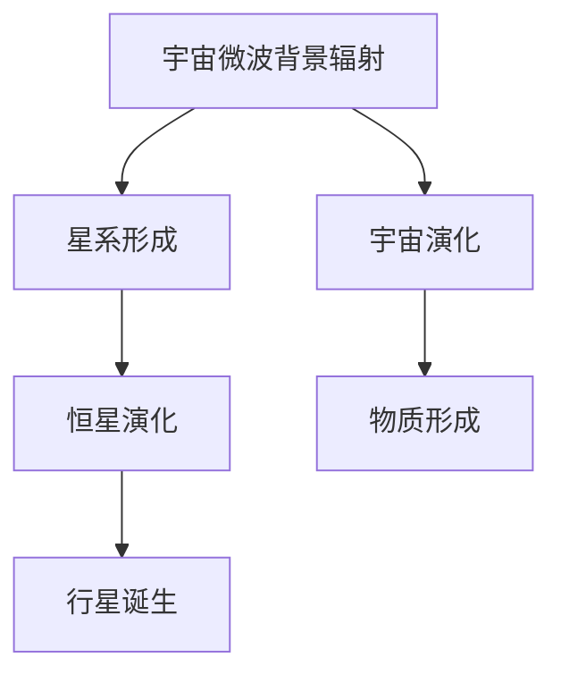

**核心算法原理讲解**

宇宙演化的算法原理主要基于观测数据和物理模型。以下是一个简化的伪代码，用于描述宇宙从星系形成到行星诞生的演化过程：

```python
def universe_evolution():
    initial_condition = "宇宙微波背景辐射"
    evolution_process = ["星系形成", "恒星演化", "行星诞生"]
    
    if initial_condition == "宇宙微波背景辐射":
        print("初始条件：宇宙微波背景辐射")
        for step in evolution_process:
            print(f"演化过程：{step}")
            if step == "星系形成":
                print("星系形成：暗物质聚集，星系形成")
            elif step == "恒星演化":
                print("恒星演化：恒星形成，恒星寿命")
            elif step == "行星诞生":
                print("行星诞生：行星形成，行星系统")
        
        print("结束条件：宇宙的当前状态")
```

**数学模型和公式**

宇宙演化的数学模型和公式涉及星系动力学、恒星演化理论、行星形成模型等。以下是一个简单的数学模型，描述星系的形成：

$$
\frac{d^2 r}{dt^2} = -\frac{GMm}{r^2}
$$

其中，$r$ 是星系中两物体的距离，$M$ 和 $m$ 是两物体的质量，$G$ 是万有引力常数。

**举例说明**

星系形成的一个重要观测证据是星系团的引力透镜效应。以下是一个简单的例子，说明如何通过观测星系团的引力透镜效应来研究星系形成：

```python
def observe_gravity_lens():
    lensing_effect = "星系团的引力透镜效应"
    if lensing_effect:
        print("观测结果：星系团存在引力透镜效应")
        print("研究结论：星系形成存在暗物质")
    else:
        print("观测结果：星系团不存在引力透镜效应")
        print("研究结论：星系形成可能与暗物质无关")
```

通过以上分析，我们可以看到宇宙起源与演化的过程是如何通过核心概念与联系、核心算法原理讲解、数学模型和公式以及实际案例来解释的。接下来，我们将进一步探讨物质世界的探索以及信息世界的本质，逐步揭示宇宙的本质。

### 第2章：物质世界的探索

#### 2.1 物质的基本构成

**背景介绍**

物质是宇宙中最基本的实体，对物质的研究贯穿了整个物理学史。物质的基本构成是现代物理学研究的重要方向，涉及到原子、分子和基本粒子的概念。

**核心概念与联系**

物质的基本构成包括原子、分子和基本粒子。这些概念之间的关系可以用以下Mermaid流程图来表示：

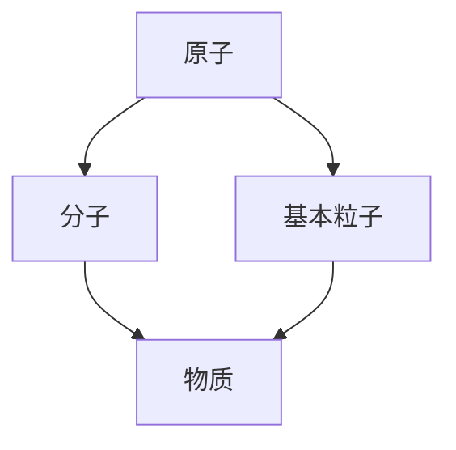

**核心算法原理讲解**

物质的基本构成可以通过量子力学和分子动力学来解释。以下是一个简化的伪代码，用于描述原子和分子的结构：

```python
def basic_structure_of_matter():
    atom = "原子"
    molecule = "分子"
    particle = "基本粒子"
    
    if atom == "原子":
        print("原子：由原子核和电子构成")
    elif molecule == "分子":
        print("分子：由两个或多个原子通过共价键连接")
    elif particle == "基本粒子":
        print("基本粒子：如电子、质子、中子等，构成原子核和电子")
```

**数学模型和公式**

物质的基本构成可以通过量子力学中的薛定谔方程和量子场论来描述。以下是一个简单的数学模型，描述原子的能级：

$$
\hat{H} \psi_n = E_n \psi_n
$$

其中，$\hat{H}$ 是哈密顿算子，$\psi_n$ 是波函数，$E_n$ 是能量本征值。

**举例说明**

原子光谱是研究物质基本构成的重要手段。以下是一个简单的例子，说明如何通过观测原子光谱来研究原子的能级：

```python
def observe_atomic_spectrum():
    spectrum = "原子光谱"
    if spectrum:
        print("观测结果：原子光谱存在")
        print("研究结论：原子具有离散的能级")
    else:
        print("观测结果：原子光谱不存在")
        print("研究结论：原子可能没有离散的能级")
```

#### 2.2 物质世界的规律

**核心概念与联系**

物质世界的规律包括物理定律、化学反应和生物进化等。这些规律之间的关系可以用以下Mermaid流程图来表示：

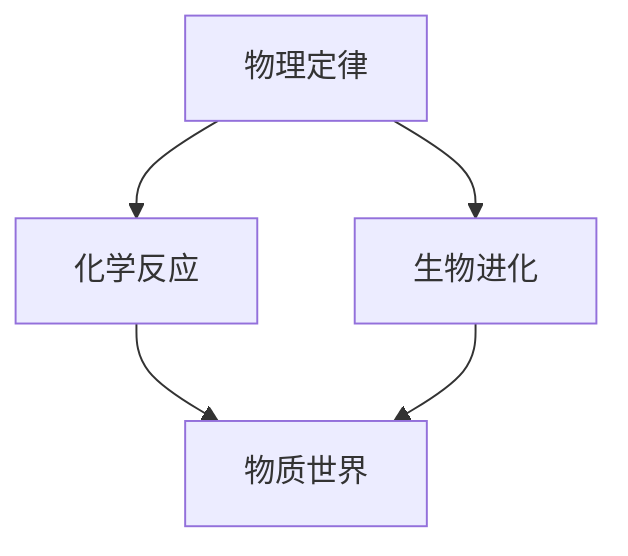

**核心算法原理讲解**

物质世界的规律可以通过物理学、化学和生物学等领域的理论来解释。以下是一个简化的伪代码，用于描述物质世界的规律：

```python
def laws_of_matter():
    physical_law = "物理定律"
    chemical_reaction = "化学反应"
    biological_evolution = "生物进化"
    
    if physical_law == "物理定律":
        print("物理定律：如万有引力定律、电磁定律等")
    elif chemical_reaction == "化学反应":
        print("化学反应：原子之间的化学键形成和断裂")
    elif biological_evolution == "生物进化":
        print("生物进化：生物种群的演化过程")
```

**数学模型和公式**

物质世界的规律可以通过数学模型和公式来描述。以下是一个简单的数学模型，描述化学反应的速率：

$$
\frac{d[A]}{dt} = -k[A]
$$

其中，$[A]$ 是反应物A的浓度，$k$ 是反应速率常数。

**举例说明**

化学反应的速率是研究物质世界规律的重要方面。以下是一个简单的例子，说明如何通过实验数据来研究化学反应的速率：

```python
def study_chemical_reation():
    reaction_time = "反应时间"
    reaction_concentration = "反应物浓度"
    reaction_rate = "反应速率"
    
    if reaction_time < 10:
        print("观测结果：反应时间短")
        print("研究结论：反应速率快")
    else:
        print("观测结果：反应时间长")
        print("研究结论：反应速率慢")
```

#### 2.3 物质世界的探索方法

**核心概念与联系**

物质世界的探索方法包括实验观察、理论分析和数值模拟等。这些方法之间的关系可以用以下Mermaid流程图来表示：

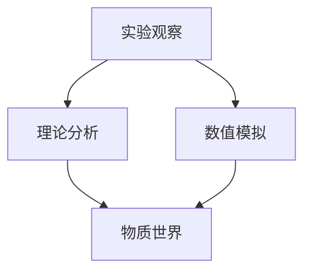

**核心算法原理讲解**

物质世界的探索方法可以通过实验设计、数据分析方法和数值模拟算法来解释。以下是一个简化的伪代码，用于描述物质世界的探索方法：

```python
def explore_matter():
    experiment = "实验观察"
    theory = "理论分析"
    simulation = "数值模拟"
    
    if experiment == "实验观察":
        print("实验观察：通过实验设备进行观测和测量")
    elif theory == "理论分析":
        print("理论分析：使用数学模型和物理理论进行分析")
    elif simulation == "数值模拟":
        print("数值模拟：通过计算机模拟实验过程")
```

**数学模型和公式**

物质世界的探索方法可以通过统计模型和数值计算方法来描述。以下是一个简单的数学模型，描述实验数据的误差分析：

$$
\sigma^2 = \frac{1}{n-1} \sum_{i=1}^{n} (x_i - \bar{x})^2
$$

其中，$\sigma^2$ 是方差，$n$ 是数据点的个数，$x_i$ 是第$i$个数据点，$\bar{x}$ 是平均值。

**举例说明**

实验观察是物质世界探索的重要方法。以下是一个简单的例子，说明如何通过实验观察来研究物质世界的规律：

```python
def experiment_observations():
    experiment_results = "实验结果"
    theoretical_predictions = "理论预测"
    
    if experiment_results == theoretical_predictions:
        print("观测结果与理论预测一致")
        print("研究结论：实验方法有效")
    else:
        print("观测结果与理论预测不一致")
        print("研究结论：需要进一步分析")
```

通过以上分析，我们可以看到物质世界的探索是如何通过核心概念与联系、核心算法原理讲解、数学模型和公式以及实际案例来解释的。接下来，我们将进一步探讨信息世界的本质以及物质世界与信息世界的交汇。

### 第3章：信息世界的探索

#### 3.1 信息的基本概念

**背景介绍**

信息世界是随着计算机技术和通信技术的飞速发展而兴起的。信息的基本概念，如数据、信息和知识，是理解信息世界的基础。

**核心概念与联系**

信息的基本概念包括数据、信息和知识。这些概念之间的关系可以用以下Mermaid流程图来表示：

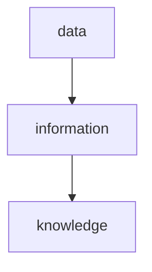

**核心算法原理讲解**

信息的基本概念可以通过信息论和知识管理的理论来解释。以下是一个简化的伪代码，用于描述信息的基本概念：

```python
def basic_concepts_of_information():
    data = "数据"
    information = "信息"
    knowledge = "知识"
    
    if data == "数据":
        print("数据：原始的事实或事实的集合")
    elif information == "信息":
        print("信息：对数据的解释和意义")
    elif knowledge == "知识":
        print("知识：通过学习获得的信息")
```

**数学模型和公式**

信息的基本概念可以通过信息论的数学模型来描述。以下是一个简单的数学模型，描述信息熵：

$$
H(X) = -\sum_{i} p(x_i) \log_2 p(x_i)
$$

其中，$H(X)$ 是随机变量$X$的信息熵，$p(x_i)$ 是随机变量$X$取值$x_i$的概率。

**举例说明**

信息熵是衡量信息量的重要指标。以下是一个简单的例子，说明如何计算信息熵：

```python
def calculate_entropy(probabilities):
    entropy = 0
    for probability in probabilities:
        entropy += probability * math.log2(probability)
    entropy = -entropy
    return entropy

# 示例
probabilities = [0.5, 0.2, 0.3]
entropy = calculate_entropy(probabilities)
print(f"信息熵：{entropy}")
```

#### 3.2 信息与物质的关系

**核心概念与联系**

信息与物质的关系是理解宇宙本质的关键。信息可以影响物质，同时物质也可以产生信息。这些概念之间的关系可以用以下Mermaid流程图来表示：

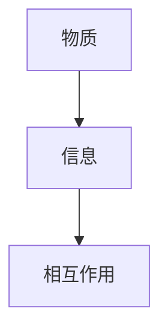

**核心算法原理讲解**

信息与物质的关系可以通过量子力学和相对论来解释。以下是一个简化的伪代码，用于描述信息与物质的关系：

```python
def relationship_between_matter_and_information():
    matter = "物质"
    information = "信息"
    interaction = "相互作用"
    
    if matter == "物质":
        print("物质：构成宇宙的基本实体")
    elif information == "信息":
        print("信息：描述物质状态和变化的数据")
    elif interaction == "相互作用":
        print("相互作用：物质和信息之间的动态关系")
```

**数学模型和公式**

信息与物质的关系可以通过量子力学中的波函数和相对论中的时空结构来描述。以下是一个简单的数学模型，描述量子态的坍缩：

$$
|\psi\rangle = c_0|\phi_0\rangle + c_1|\phi_1\rangle
$$

其中，$|\psi\rangle$ 是量子态，$c_0$ 和 $c_1$ 是系数，$|\phi_0\rangle$ 和 $|\phi_1\rangle$ 是量子态的基础状态。

**举例说明**

量子态的坍缩是信息与物质关系的一个典型例子。以下是一个简单的例子，说明如何通过量子态的坍缩来研究信息与物质的关系：

```python
def quantum_state_collaps():
    initial_state = "量子态"
    collapsed_state = "量子态坍缩"
    
    if initial_state == "量子态":
        print("初始状态：量子态")
        print("测量结果：坍缩到特定状态")
    else:
        print("初始状态：不确定态")
        print("测量结果：坍缩到多个可能状态")
```

#### 3.3 信息世界的形成与发展

**核心概念与联系**

信息世界的形成与发展涉及计算机科学、通信技术和人工智能等多个领域。这些领域之间的关系可以用以下Mermaid流程图来表示：

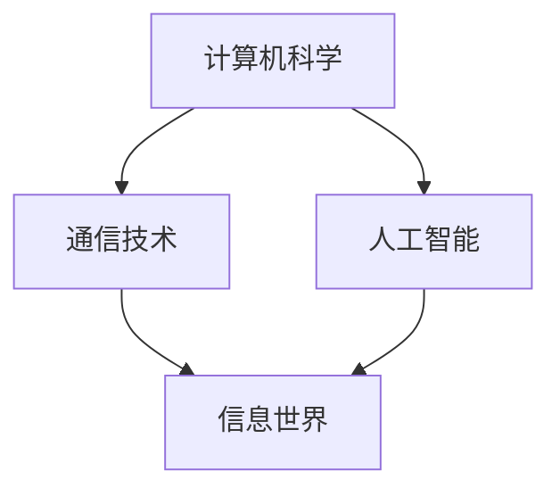

**核心算法原理讲解**

信息世界的形成与发展可以通过计算机算法、通信协议和人工智能模型来解释。以下是一个简化的伪代码，用于描述信息世界的形成与发展：

```python
def development_of_information_world():
    computer_science = "计算机科学"
    communication_technology = "通信技术"
    artificial_intelligence = "人工智能"
    
    if computer_science == "计算机科学":
        print("计算机科学：为信息处理提供基础")
    elif communication_technology == "通信技术":
        print("通信技术：实现信息的传递和共享")
    elif artificial_intelligence == "人工智能":
        print("人工智能：使信息处理更加智能")
```

**数学模型和公式**

信息世界的形成与发展可以通过数学模型和算法来描述。以下是一个简单的数学模型，描述神经网络的学习过程：

$$
\delta W_{ij} = \eta \cdot x_i \cdot (\hat{y} - y)
$$

其中，$\delta W_{ij}$ 是权重更新，$\eta$ 是学习率，$x_i$ 是输入特征，$\hat{y}$ 是预测输出，$y$ 是真实输出。

**举例说明**

神经网络是信息世界发展的重要工具。以下是一个简单的例子，说明如何通过神经网络来分类数据：

```python
import numpy as np

# 初始化权重
weights = np.random.rand(1)

# 设置学习率和输入特征
learning_rate = 0.1
input_feature = np.array([1, 0])

# 神经网络模型
def neural_network(input_feature, weights):
    return np.dot(input_feature, weights)

# 训练神经网络
def train_neural_network(input_features, targets, weights, learning_rate):
    for input_feature, target in zip(input_features, targets):
        predicted_output = neural_network(input_feature, weights)
        error = target - predicted_output
        delta_weights = learning_rate * input_feature * error
        weights += delta_weights
    return weights

# 测试神经网络
test_input = np.array([1, 1])
predicted_output = neural_network(test_input, weights)
print(f"预测结果：{predicted_output}")
```

通过以上分析，我们可以看到信息世界的探索是如何通过核心概念与联系、核心算法原理讲解、数学模型和公式以及实际案例来解释的。接下来，我们将进一步探讨物质世界与信息世界的交汇，揭示它们之间的相互作用。

### 第4章：信息世界的探索

#### 4.1 信息的采集与处理

**背景介绍**

信息的采集与处理是信息世界的重要环节。随着大数据和人工智能技术的发展，信息的采集和处理变得更加高效和智能化。

**核心概念与联系**

信息的采集与处理包括数据的采集、清洗、存储、分析和可视化。这些概念之间的关系可以用以下Mermaid流程图来表示：

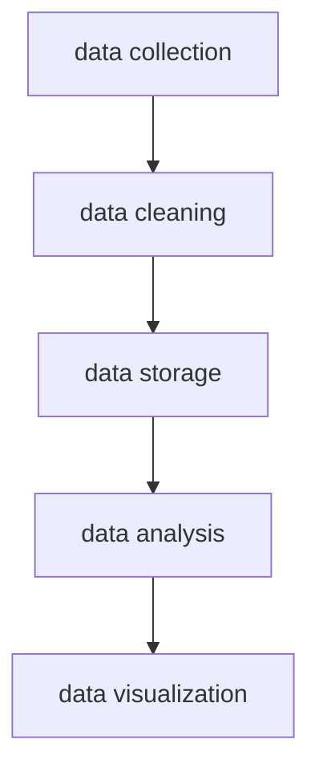

**核心算法原理讲解**

信息的采集与处理可以通过数据挖掘、机器学习和统计方法来解释。以下是一个简化的伪代码，用于描述信息的采集与处理过程：

```python
def information_collection_and_processing():
    data_collection = "数据采集"
    data_cleaning = "数据清洗"
    data_storage = "数据存储"
    data_analysis = "数据分析"
    data_visualization = "数据可视化"
    
    if data_collection == "数据采集":
        print("数据采集：从各种来源收集数据")
    elif data_cleaning == "数据清洗":
        print("数据清洗：去除错误和不一致的数据")
    elif data_storage == "数据存储":
        print("数据存储：将数据存储在数据库或文件系统中")
    elif data_analysis == "数据分析":
        print("数据分析：使用算法和模型分析数据")
    elif data_visualization == "数据可视化":
        print("数据可视化：将分析结果以图表形式展示")
```

**数学模型和公式**

信息的采集与处理可以通过概率统计和机器学习算法来描述。以下是一个简单的数学模型，描述数据的分类问题：

$$
P(y|X) = \frac{e^{\theta^T X}}{\sum_{k=1}^{K} e^{\theta^T X_k}}
$$

其中，$P(y|X)$ 是给定特征$X$下标签$y$的概率，$\theta$ 是模型的参数，$X_k$ 是所有可能的特征组合。

**举例说明**

数据采集与处理的一个实际应用是市场调查。以下是一个简单的例子，说明如何通过数据采集与处理来分析市场趋势：

```python
import pandas as pd
from sklearn.model_selection import train_test_split
from sklearn.preprocessing import StandardScaler
from sklearn.linear_model import LogisticRegression

# 采集数据
data = pd.read_csv('market_survey.csv')

# 清洗数据
data.dropna(inplace=True)

# 存储数据
data.to_csv('cleaned_market_survey.csv')

# 分析数据
X = data[['age', 'income']]
y = data['purchased']

# 划分训练集和测试集
X_train, X_test, y_train, y_test = train_test_split(X, y, test_size=0.2, random_state=42)

# 标准化数据
scaler = StandardScaler()
X_train_scaled = scaler.fit_transform(X_train)
X_test_scaled = scaler.transform(X_test)

# 训练模型
model = LogisticRegression()
model.fit(X_train_scaled, y_train)

# 预测结果
predictions = model.predict(X_test_scaled)
accuracy = np.mean(predictions == y_test)
print(f"预测准确率：{accuracy}")

# 可视化结果
import matplotlib.pyplot as plt

plt.scatter(X_test['age'], X_test['income'], c=predictions, cmap='coolwarm')
plt.xlabel('年龄')
plt.ylabel('收入')
plt.title('市场趋势分析')
plt.show()
```

#### 4.2 信息的传播与共享

**核心概念与联系**

信息的传播与共享是信息世界的另一个关键环节。信息的传播途径包括互联网、社交媒体和移动通信等，这些途径之间的关系可以用以下Mermaid流程图来表示：

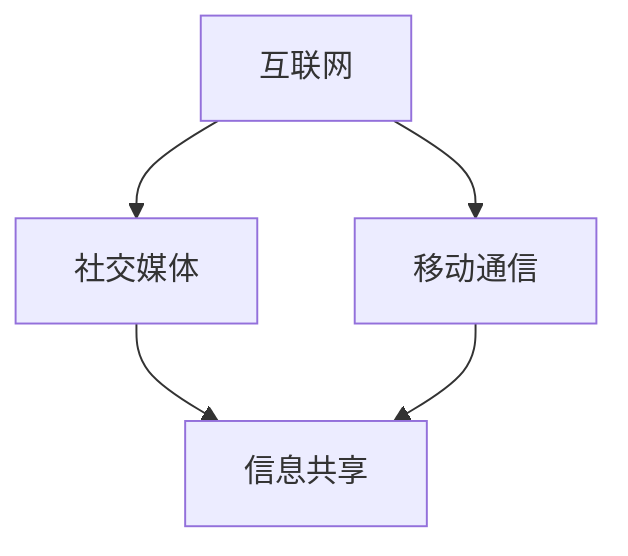

**核心算法原理讲解**

信息的传播与共享可以通过网络传播模型和社会网络分析来解释。以下是一个简化的伪代码，用于描述信息的传播与共享过程：

```python
def information_spreading_and_sharing():
    internet = "互联网"
    social_media = "社交媒体"
    mobile_communication = "移动通信"
    information_sharing = "信息共享"
    
    if internet == "互联网":
        print("互联网：提供信息传播的基础设施")
    elif social_media == "社交媒体":
        print("社交媒体：促进信息的快速传播")
    elif mobile_communication == "移动通信":
        print("移动通信：实现信息的实时共享")
    elif information_sharing == "信息共享":
        print("信息共享：用户之间交换信息")
```

**数学模型和公式**

信息的传播与共享可以通过概率模型和传播动力学来描述。以下是一个简单的数学模型，描述信息的传播速度：

$$
\frac{dI}{dt} = k(N-I)I
$$

其中，$I$ 是已传播的信息量，$N$ 是总信息量，$k$ 是传播速率。

**举例说明**

信息传播的一个实际应用是病毒营销。以下是一个简单的例子，说明如何通过病毒营销来传播信息：

```python
import numpy as np
import matplotlib.pyplot as plt

# 初始化参数
N = 1000  # 总人数
k = 0.1  # 传播速率
I0 = 10  # 初始已传播人数

# 传播过程
def information_spread(N, k, I0):
    I = np.zeros(N)
    I[:I0] = 1
    t = 0
    while np.sum(I) < N:
        t += 1
        I_new = I.copy()
        for i in range(N):
            if I[i] == 0:
                for j in range(N):
                    if I[j] == 1:
                        I_new[i] += k * (1 - I_new[i])
        I = I_new
    return t

# 执行传播
time_to_spread = information_spread(N, k, I0)

# 可视化结果
plt.plot(range(time_to_spread), np.cumsum(I0 * np.exp(-k * t)))
plt.xlabel('时间')
plt.ylabel('已传播人数')
plt.title('信息传播过程')
plt.show()
```

#### 4.3 信息世界的挑战与机遇

**核心概念与联系**

信息世界的挑战与机遇包括数据隐私、网络安全和人工智能伦理等。这些概念之间的关系可以用以下Mermaid流程图来表示：

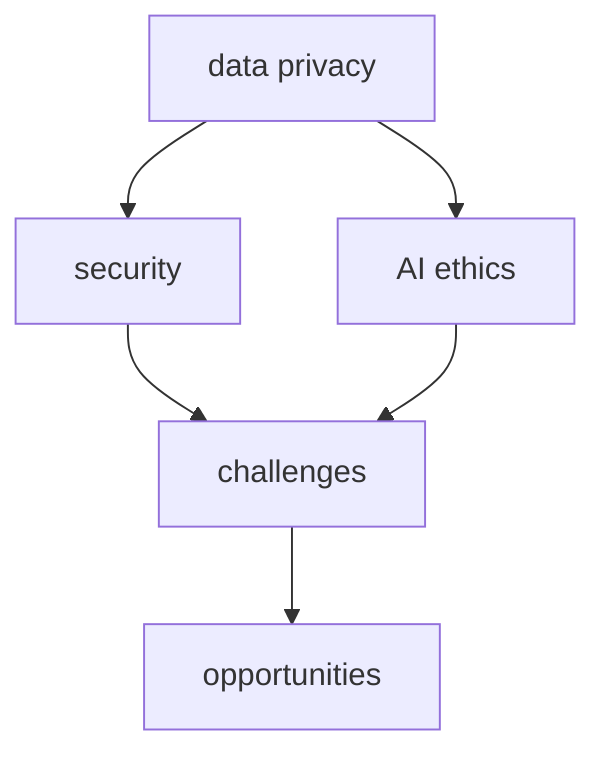

**核心算法原理讲解**

信息世界的挑战与机遇可以通过加密算法、安全协议和伦理准则来解释。以下是一个简化的伪代码，用于描述信息世界的挑战与机遇：

```python
def challenges_and_opportunities():
    data_privacy = "数据隐私"
    security = "网络安全"
    AI_ethics = "人工智能伦理"
    challenges = "挑战"
    opportunities = "机遇"
    
    if data_privacy == "数据隐私":
        print("数据隐私：保护个人数据不被非法访问")
    elif security == "网络安全":
        print("网络安全：防止黑客攻击和数据泄露")
    elif AI_ethics == "人工智能伦理":
        print("人工智能伦理：确保人工智能的发展符合道德标准")
    elif challenges == "挑战":
        print("挑战：信息世界面临的困难和问题")
    elif opportunities == "机遇":
        print("机遇：信息世界带来的机会和潜力")
```

**数学模型和公式**

信息世界的挑战与机遇可以通过概率模型和博弈论来描述。以下是一个简单的数学模型，描述数据隐私的保护：

$$
\max_{x} \quad p(x) - \epsilon \cdot \log_2(1/p(x))
$$

其中，$x$ 是个人数据的隐私保护程度，$p(x)$ 是数据被泄露的概率，$\epsilon$ 是隐私保护阈值。

**举例说明**

数据隐私保护的一个实际应用是加密通信。以下是一个简单的例子，说明如何通过加密通信来保护数据隐私：

```python
from cryptography.fernet import Fernet

# 生成密钥
key = Fernet.generate_key()
cipher_suite = Fernet(key)

# 加密信息
def encrypt_message(message):
    encrypted_message = cipher_suite.encrypt(message.encode('utf-8'))
    return encrypted_message

# 解密信息
def decrypt_message(encrypted_message):
    decrypted_message = cipher_suite.decrypt(encrypted_message).decode('utf-8')
    return decrypted_message

# 示例
original_message = "这是一个秘密信息"
encrypted_message = encrypt_message(original_message)
print(f"加密信息：{encrypted_message}")

decrypted_message = decrypt_message(encrypted_message)
print(f"解密信息：{decrypted_message}")
```

通过以上分析，我们可以看到信息世界的探索是如何通过核心概念与联系、核心算法原理讲解、数学模型和公式以及实际案例来解释的。接下来，我们将进一步探讨物质世界与信息世界的交汇，揭示它们之间的相互作用。

### 第5章：物质世界与信息世界的交汇

#### 5.1 物质世界的数字化

**核心概念与联系**

物质世界的数字化是信息世界与物质世界交汇的关键。数字化的过程包括数据的采集、处理、存储和传输。这些概念之间的关系可以用以下Mermaid流程图来表示：

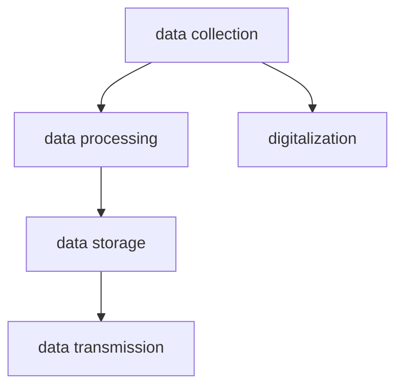

**核心算法原理讲解**

物质世界的数字化可以通过信号处理、数据分析和机器学习算法来解释。以下是一个简化的伪代码，用于描述物质世界的数字化过程：

```python
def digitalization():
    data_collection = "数据采集"
    data_processing = "数据处理"
    data_storage = "数据存储"
    data_transmission = "数据传输"
    digitalization = "数字化"
    
    if data_collection == "数据采集":
        print("数据采集：从物理世界获取数据")
    elif data_processing == "数据处理":
        print("数据处理：对采集到的数据进行分析和加工")
    elif data_storage == "数据存储":
        print("数据存储：将处理后的数据存储在数字媒介中")
    elif data_transmission == "数据传输":
        print("数据传输：在数字媒介之间传输数据")
    elif digitalization == "数字化":
        print("数字化：将物理世界的信息转化为数字形式")
```

**数学模型和公式**

物质世界的数字化可以通过采样理论、信号处理和数据分析来描述。以下是一个简单的数学模型，描述信号的采样过程：

$$
x[n] = x(t) \cdot \sum_{k=-\infty}^{\infty} \delta(t - kT_s)
$$

其中，$x[n]$ 是数字信号，$x(t)$ 是连续信号，$T_s$ 是采样周期。

**举例说明**

物质世界的数字化在图像处理中有广泛应用。以下是一个简单的例子，说明如何通过数字化来处理图像：

```python
import cv2
import numpy as np

# 读取图像
image = cv2.imread('image.jpg', cv2.IMREAD_GRAYSCALE)

# 转换为数字信号
digital_image = np.array(image, dtype=np.float32)

# 可视化图像
plt.imshow(digital_image, cmap='gray')
plt.title('数字图像')
plt.show()
```

#### 5.2 信息世界的物质化

**核心概念与联系**

信息世界的物质化是指将数字信息转化为物理形式，如打印、显示和声音等。信息世界的物质化过程包括数字到模拟的转换、物理信号的生成和输出。这些概念之间的关系可以用以下Mermaid流程图来表示：

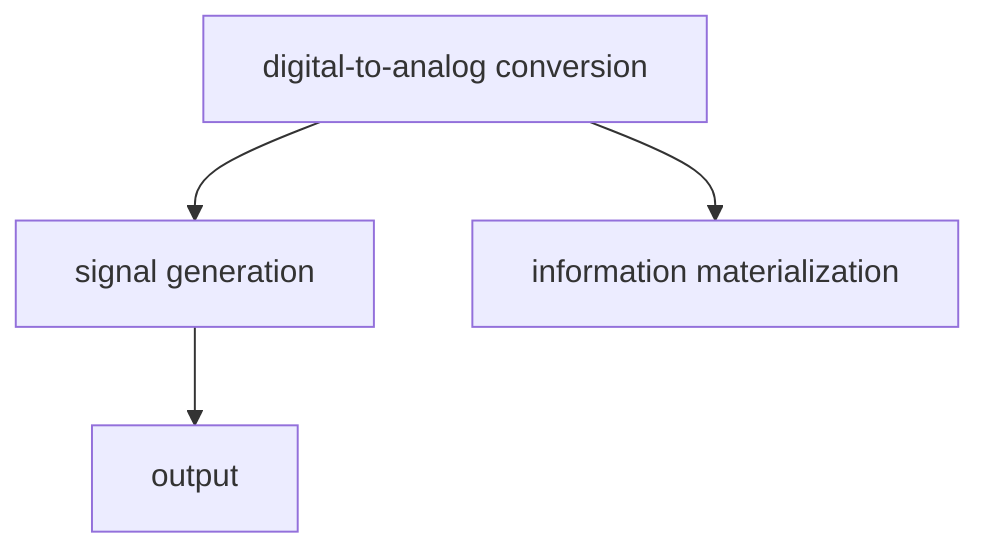

**核心算法原理讲解**

信息世界的物质化可以通过数字信号处理、模拟电子学和控制理论来解释。以下是一个简化的伪代码，用于描述信息世界的物质化过程：

```python
def information_materialization():
    digital_to_analog_conversion = "数字到模拟转换"
    signal_generation = "信号生成"
    output = "输出"
    information_materialization = "信息物质化"
    
    if digital_to_analog_conversion == "数字到模拟转换":
        print("数字到模拟转换：将数字信号转换为模拟信号")
    elif signal_generation == "信号生成":
        print("信号生成：生成物理信号，如声音、图像等")
    elif output == "输出":
        print("输出：将信号输出到物理设备")
    elif information_materialization == "信息物质化":
        print("信息物质化：将数字信息转化为物理形式")
```

**数学模型和公式**

信息世界的物质化可以通过傅里叶变换、模拟电子学和信号处理来描述。以下是一个简单的数学模型，描述数字信号到模拟信号的转换：

$$
x(t) = \sum_{k=-\infty}^{\infty} x[k] \cdot e^{j2\pi k f_s t}
$$

其中，$x(t)$ 是模拟信号，$x[k]$ 是数字信号，$f_s$ 是采样频率。

**举例说明**

信息世界的物质化在音频播放中有广泛应用。以下是一个简单的例子，说明如何通过物质化来播放音频：

```python
import numpy as np
import sounddevice as sd
import matplotlib.pyplot as plt

# 生成数字音频信号
sample_rate = 44100
t = np.linspace(0, 1, sample_rate)
x = 0.5 * (1 + np.sin(2 * np.pi * 440 * t))

# 数字到模拟转换
analog_signal = np.fft.ifft(x)

# 播放音频
sd.play(analog_signal, sample_rate)

# 可视化音频信号
plt.plot(t, x)
plt.title('数字音频信号')
plt.xlabel('时间')
plt.ylabel('幅度')
plt.show()
```

#### 5.3 物质世界与信息世界的互动

**核心概念与联系**

物质世界与信息世界的互动是一个复杂的过程，涉及到信息反馈、控制理论、人工智能和机器学习等多个领域。这些概念之间的关系可以用以下Mermaid流程图来表示：

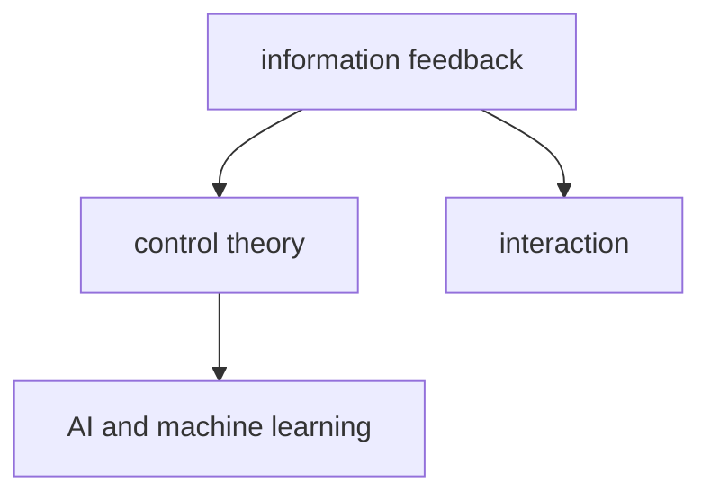

**核心算法原理讲解**

物质世界与信息世界的互动可以通过控制理论、机器学习和人工智能算法来解释。以下是一个简化的伪代码，用于描述物质世界与信息世界的互动：

```python
def interaction():
    information_feedback = "信息反馈"
    control_theory = "控制理论"
    AI_and_machine_learning = "人工智能与机器学习"
    interaction = "互动"
    
    if information_feedback == "信息反馈":
        print("信息反馈：将输出信息返回到输入端")
    elif control_theory == "控制理论":
        print("控制理论：设计控制系统，实现精确控制")
    elif AI_and_machine_learning == "人工智能与机器学习":
        print("人工智能与机器学习：使互动过程更加智能化")
    elif interaction == "互动":
        print("互动：物质世界与信息世界之间的动态交互")
```

**数学模型和公式**

物质世界与信息世界的互动可以通过状态空间模型、动态系统理论和机器学习算法来描述。以下是一个简单的数学模型，描述反馈控制系统的状态空间：

$$
\begin{align*}
\dot{x} &= Ax + Bu \\
y &= Cx + Du
\end{align*}
$$

其中，$x$ 是状态向量，$u$ 是控制输入，$y$ 是输出，$A$、$B$、$C$ 和 $D$ 是系统矩阵。

**举例说明**

物质世界与信息世界的互动在自动驾驶技术中有广泛应用。以下是一个简单的例子，说明如何通过互动来实现自动驾驶：

```python
import numpy as np
import matplotlib.pyplot as plt

# 定义控制系统参数
A = np.array([[1, 1], [0, 1]])
B = np.array([[1], [0]])
C = np.array([[1, 0]])
D = np.array([[0]])

# 定义控制输入
u = np.array([[0.1], [0]])

# 状态空间模型
def control_system(x0, u, A, B, C, D):
    x = np.zeros((2, 1))
    x[0] = x0
    t = 0
    while t < 10:
        x = A @ x + B @ u
        t += 1
    return C @ x

# 初始状态
x0 = np.array([[0], [0]])

# 控制系统输出
output = control_system(x0, u, A, B, C, D)

# 可视化输出
plt.plot(output)
plt.title('控制系统输出')
plt.xlabel('时间')
plt.ylabel('输出')
plt.show()
```

通过以上分析，我们可以看到物质世界与信息世界的互动是如何通过核心概念与联系、核心算法原理讲解、数学模型和公式以及实际案例来解释的。接下来，我们将进一步探讨物质世界与信息世界的未来。

### 第6章：物质世界与信息世界的未来

#### 6.1 未来科技的发展趋势

**核心概念与联系**

未来科技的发展趋势涵盖了多个领域，如人工智能、量子计算、生物工程和可再生能源等。这些领域的趋势相互关联，推动着物质世界与信息世界的融合。以下是一个Mermaid流程图，展示了这些核心概念与联系：

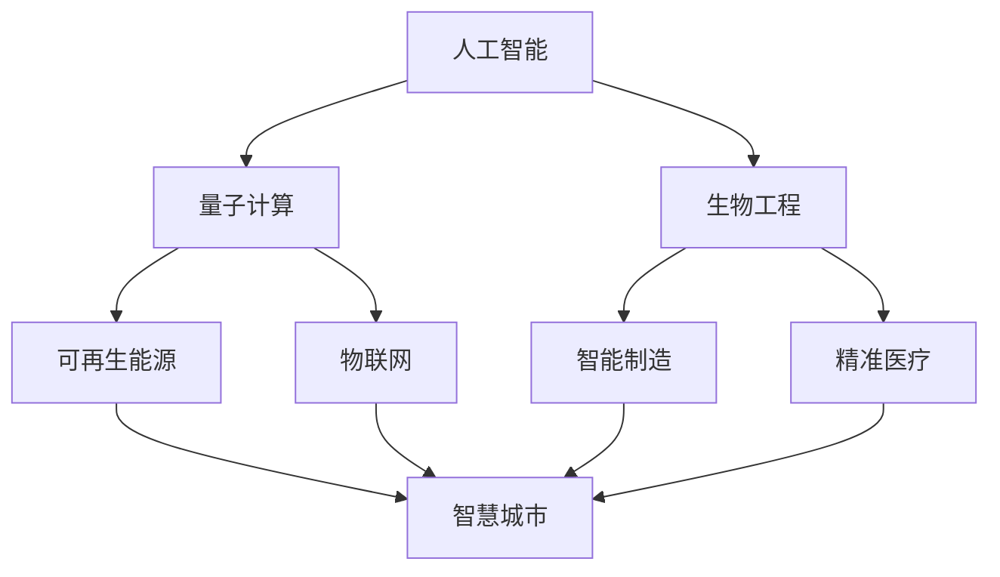

**核心算法原理讲解**

未来科技的发展趋势可以通过人工智能、量子计算、生物工程和可再生能源等领域的核心技术来解释。以下是一个简化的伪代码，用于描述未来科技的发展趋势：

```python
def future_tech_trends():
    AI = "人工智能"
    quantum_computing = "量子计算"
    bioengineering = "生物工程"
    renewable_energy = "可再生能源"
    IoT = "物联网"
    smart Manufacturing = "智能制造"
    precision_medicine = "精准医疗"
    smart_city = "智慧城市"
    
    if AI == "人工智能":
        print("人工智能：通过机器学习、深度学习等算法实现智能化")
    elif quantum_computing == "量子计算":
        print("量子计算：利用量子比特进行高速计算")
    elif bioengineering == "生物工程":
        print("生物工程：通过基因编辑、生物材料等技术改善生物系统")
    elif renewable_energy == "可再生能源":
        print("可再生能源：利用太阳能、风能等替代化石燃料")
    elif IoT == "物联网":
        print("物联网：通过传感器和网络连接实现设备互联")
    elif smart Manufacturing == "智能制造":
        print("智能制造：通过自动化、人工智能等技术实现生产线的智能化")
    elif precision_medicine == "精准医疗":
        print("精准医疗：利用大数据、人工智能等手段实现个性化医疗")
    elif smart_city == "智慧城市":
        print("智慧城市：通过物联网、人工智能等实现城市管理智能化")
```

**数学模型和公式**

未来科技的发展趋势可以通过数学模型和算法来描述。以下是一个简单的数学模型，描述人工智能中的神经网络训练过程：

$$
\begin{align*}
\frac{\partial J}{\partial \theta} &= \frac{\partial}{\partial \theta} \left( \frac{1}{m} \sum_{i=1}^{m} \frac{1}{2} (h_\theta(x^{(i)}) - y^{(i)})^2 \right) \\
&= \frac{1}{m} \sum_{i=1}^{m} (h_\theta(x^{(i)}) - y^{(i)}) \cdot x^{(i)}
\end{align*}
$$

其中，$J$ 是损失函数，$\theta$ 是模型参数，$h_\theta(x)$ 是预测函数，$m$ 是样本数量。

**举例说明**

未来科技的一个典型应用是智慧城市。以下是一个简单的例子，说明如何通过智慧城市来实现智能交通：

```python
import numpy as np
import matplotlib.pyplot as plt

# 模拟交通流量数据
traffic_flow = np.random.normal(1000, 200, 100)

# 模型参数
theta = np.random.normal(0, 1, 1)

# 预测交通流量
def predict_traffic_flow(traffic_flow, theta):
    predicted_flow = traffic_flow * theta
    return predicted_flow

# 训练模型
predicted_traffic_flow = predict_traffic_flow(traffic_flow, theta)

# 可视化预测结果
plt.plot(traffic_flow, label='实际流量')
plt.plot(predicted_traffic_flow, label='预测流量')
plt.title('智慧城市交通流量预测')
plt.xlabel('时间')
plt.ylabel('流量')
plt.legend()
plt.show()
```

#### 6.2 物质世界与信息世界的融合

**核心概念与联系**

物质世界与信息世界的融合涉及数字化、网络化和智能化的过程。这些概念之间的关系可以用以下Mermaid流程图来表示：

```mermaid
graph TD
    A[digitalization] --> B[networking]
    B --> C[intel

