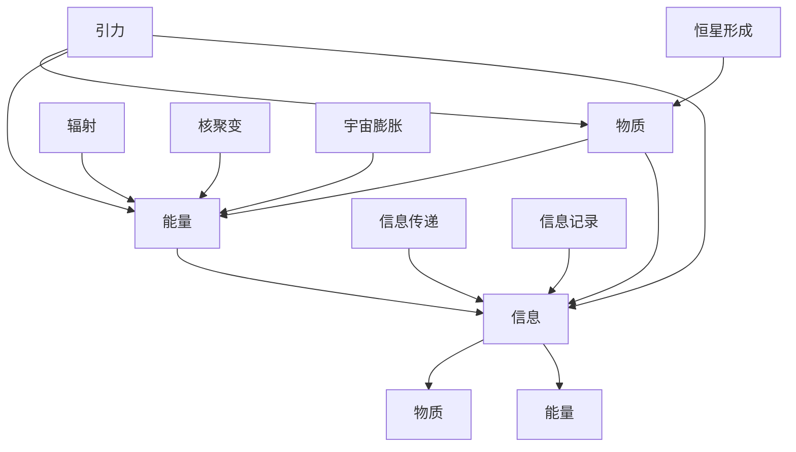

                 

### 引言

#### 宇宙的探索：为什么宇宙的本质如此重要？

宇宙，这个广袤而神秘的宇宙，自古以来就吸引着人类的注意。从古代的天文学家观测天体，到现代的宇宙学家探索宇宙的起源、演化和结构，人类对宇宙的认知在不断深入。然而，尽管我们对宇宙有了许多了解，但宇宙的本质依然是一个充满挑战和未解之谜的领域。物质、能量和信息，这三大概念在宇宙学中扮演着至关重要的角色，它们是理解宇宙的基础。

物质是宇宙的基本构成要素，包括从原子、分子到恒星、星系等各种形态。能量则是驱动宇宙演化的动力源泉，它存在于物质的相互作用之中。信息，尽管无形，却在宇宙中无处不在，它不仅是生命存在的基础，也是我们认识宇宙的重要工具。那么，这三者之间的关系究竟如何？它们如何共同塑造了我们所认知的宇宙？

本文将探讨物质、能量和信息在宇宙中的本质和相互关系。我们将首先回顾宇宙学的基础知识，了解宇宙的起源、膨胀和结构。接着，我们将深入探讨物质的构成和性质，以及能量在宇宙中的作用。此外，我们还将介绍信息的概念，探讨信息在宇宙中的角色和影响。在分析物质、能量与信息之间的关系之后，我们将探讨宇宙的未来，基于这三者的演化可能方向。最后，我们将提供拓展阅读和资源，以供读者进一步探索。

通过对这些核心概念的逐步分析，我们将试图回答一个关键问题：宇宙的本质究竟是物质、能量，还是信息？希望这篇文章能引导你深入思考，共同探索这个无垠的宇宙奥秘。

#### 物质、能量与信息的定义与区别

在探讨宇宙的本质之前，我们需要先明确物质、能量和信息的定义，以及它们之间的区别。这些概念虽然密切相关，但在物理学和宇宙学中有着独特的地位。

**物质** 是宇宙中占据空间并具有质量的实体，包括从原子、分子到星系等各种形态。物质的基本组成单元是原子，原子由原子核和围绕原子核运动的电子组成。原子核由质子和中子构成，质子带正电，中子不带电。在宇宙学中，物质通常被分为可见物质和暗物质。可见物质包括恒星、星系、行星等，我们可以直接观测到。暗物质则是一种尚未被直接观测到的物质，它对宇宙的结构和演化有着重要影响。

**能量** 是物质运动的驱动力，它是物体在力的作用下所做功的能力。能量有多种形式，包括动能、势能、热能、光能、电能等。能量守恒定律是物理学中的基本原则之一，它指出在一个封闭系统中，能量不会消失也不会凭空产生，只能从一种形式转化为另一种形式。在宇宙学中，能量是宇宙演化的关键因素，它驱动着星系的形成、恒星的演化，以及宇宙的膨胀。

**信息** 是关于事物状态、特征或规律的知识或数据。在计算机科学中，信息通常被视为比特或字节的形式。信息与物质和能量不同，它是抽象的，可以以电子形式传输和处理。信息在宇宙中的角色至关重要，它是生命存在的基础，也是人类认识宇宙的工具。宇宙背景辐射中蕴含的信息揭示了宇宙早期的状态，而恒星和星系中的信息则记录了宇宙的历史。

尽管物质、能量和信息在物理性质上有所不同，但它们在宇宙学中是相互关联的。物质和能量是宇宙演化的基础，而信息则是我们理解宇宙的关键。通过研究这三者的关系，我们可以更深入地理解宇宙的本质。

#### 本书结构概述

本文将分为七个主要部分，逐步探讨宇宙的本质，物质、能量和信息的角色，以及它们之间的相互关系。

**第一部分：引言**  
在这一部分，我们将介绍宇宙的本质为什么如此重要，以及物质、能量和信息在宇宙学中的核心地位。我们将回顾宇宙学的基础知识，为后续章节的讨论打下基础。

**第二部分：宇宙学基础**  
在这一部分，我们将深入探讨宇宙的起源、膨胀和结构。我们将介绍大爆炸理论、宇宙微波背景辐射和暗物质等概念，帮助读者建立对宇宙演化过程的基本理解。

**第三部分：物质**  
在这一部分，我们将详细探讨物质的构成和性质。我们将从原子和分子的结构开始，逐步讨论宇宙中的物质分布，包括恒星、星系和宇宙大尺度结构。

**第四部分：能量**  
在这一部分，我们将探讨能量的本质、类型以及在宇宙中的作用。我们将介绍能量守恒定律、动能和势能的概念，并讨论恒星、黑洞和宇宙膨胀等过程中的能量转换。

**第五部分：信息**  
在这一部分，我们将介绍信息的概念，探讨信息在宇宙中的角色和影响。我们将讨论宇宙背景辐射中的信息、恒星和星系中的信息，以及信息在宇宙演化中的重要性。

**第六部分：物质、能量与信息的联系**  
在这一部分，我们将分析物质、能量和信息之间的相互关系。我们将探讨物质与能量的相互作用，以及信息如何影响物质和能量的流动和演化。

**第七部分：宇宙的未来**  
在这一部分，我们将探讨宇宙的未来，基于物质、能量和信息的演化可能方向。我们将讨论宇宙的终结、大撕裂与大坍缩、宇宙热寂等可能情景。

通过这七个部分的逐步探讨，我们将试图回答一个关键问题：宇宙的本质究竟是物质、能量，还是信息？希望这本书能引导你深入思考，共同探索这个无垠的宇宙奥秘。

### 宇宙学基础

宇宙学是研究宇宙的起源、结构、演化和最终命运的科学。宇宙学的核心概念包括宇宙的起源、膨胀和结构。在本节中，我们将详细探讨这些概念，并介绍大爆炸理论、宇宙微波背景辐射和暗物质等重要概念。

#### 宇宙的起源

关于宇宙的起源，最广为人知的理论是大爆炸理论。大爆炸理论认为，宇宙起源于大约138亿年前的一个极热、极密的状态。在这个瞬间，宇宙迅速膨胀，温度和密度逐渐降低。随着时间的推移，宇宙逐渐冷却，物质和能量开始形成。大爆炸理论得到了许多观测数据的支持，如宇宙微波背景辐射、宇宙膨胀的证据以及元素丰度的分布等。

宇宙微波背景辐射是大爆炸理论的强有力证据之一。这是宇宙早期阶段残留的辐射，它在宇宙膨胀过程中被冷却并传播至今。宇宙微波背景辐射的观测揭示了宇宙早期的状态，包括温度、密度和波动等信息。

另一个支持大爆炸理论的重要证据是宇宙膨胀。根据哈勃定律，远离我们的星系以越来越快的速度远离我们，这表明宇宙正在膨胀。这一现象由埃德温·哈勃在1920年代发现，并成为宇宙膨胀理论的基石。宇宙膨胀的证据还包括宇宙的加速度，这是由于暗能量的存在导致的。

#### 宇宙的膨胀

宇宙的膨胀是宇宙学中的一个核心概念。根据大爆炸理论，宇宙从一个极热、极密的状态开始膨胀，并且至今仍在膨胀。宇宙膨胀的速率并不是恒定的，而是随着时间逐渐加快。这一现象被称为宇宙加速膨胀。

宇宙加速膨胀的解释主要归功于暗能量。暗能量是一种具有负压强、能量密度恒定的神秘物质。根据爱因斯坦的广义相对论，暗能量会导致宇宙的加速度。尽管我们对暗能量的本质尚不完全清楚，但它在宇宙学中扮演着至关重要的角色。

宇宙膨胀的证据还包括宇宙大尺度结构。宇宙大尺度结构指的是星系、星系团和超星系团等大规模天体在宇宙中的分布。通过观测宇宙大尺度结构，我们可以了解宇宙的演化历史，包括宇宙的早期状态和现在的状态。

#### 宇宙的结构

宇宙的结构是一个复杂而多样的话题。宇宙中存在多种不同尺度的结构，从星系到星系团，再到超星系团。这些结构在宇宙演化中起着关键作用。

星系是宇宙中最常见的结构，它们由恒星、气体、尘埃和暗物质组成。星系的形态和演化受到多种因素的影响，包括引力相互作用、恒星形成和黑洞活动等。

星系团是更大规模的结构，由多个星系组成。星系团中的星系通过引力相互作用保持在一起。星系团中还存在大量的暗物质，它们对星系团的稳定性起着重要作用。

超星系团是宇宙中最大的结构，由多个星系团组成。超星系团通常包含数十亿颗恒星和大量的暗物质。超星系团在宇宙中的分布和演化揭示了宇宙的大尺度结构特征。

#### 黑洞与暗物质

黑洞是宇宙中一种极其密集的天体，它们的质量极大，但体积却非常小。黑洞通过吞噬周围的物质来增加其质量，同时释放出巨大的能量。黑洞的存在和活动对宇宙的演化有着重要影响。

暗物质是宇宙中一种未直接观测到的物质，但它们对宇宙的结构和演化起着关键作用。暗物质主要通过引力相互作用影响宇宙的结构，它们的存在可以从星系旋转曲线的异常、宇宙微波背景辐射的观测以及大尺度结构的分布等证据中推断出来。

总之，宇宙学基础是理解宇宙的本质和演化的重要前提。通过探讨宇宙的起源、膨胀和结构，我们可以更好地理解宇宙的奥秘。这些核心概念为我们后续对物质、能量和信息的研究奠定了基础。

### 物质

物质是宇宙的基本构成要素，从原子到星系，各种形态的物质构成了我们所在的世界。在本节中，我们将深入探讨物质的构成和性质，包括原子和分子的结构、物质状态以及宇宙中的物质分布。

#### 原子与分子的结构

原子是物质的基本单位，由原子核和围绕原子核运动的电子组成。原子核由质子和中子构成，质子带正电，中子不带电。电子带负电，它们在原子核外以特定轨道运动。不同元素的原子具有不同数量的质子和电子，这决定了它们的化学性质。

原子核中的质子和中子由更基本的粒子——夸克组成。夸克有六种类型，分别称为上夸克、下夸克、奇夸克、粲夸克、底夸克和顶夸克。质子由两个上夸克和一个下夸克组成，中子由一个上夸克和两个下夸克组成。

分子是由两个或多个原子通过共价键连接而成的化合物。分子的结构决定了它们的物理和化学性质。例如，水分子（H₂O）由两个氢原子和一个氧原子组成，氢原子与氧原子之间通过共价键连接。

#### 物质状态

物质有三种基本状态：固态、液态和气态。不同状态下的物质具有不同的物理性质。

- **固态**：在固态中，物质的分子紧密排列，形成有序的结构。固体具有固定的形状和体积，不易被压缩。常见的固体有金属、冰、岩石等。
- **液态**：在液态中，物质的分子排列较为松散，但仍保持一定的相互作用。液体具有固定的体积，但可以流动，适应容器的形状。常见的液体有水、油、酒精等。
- **气态**：在气态中，物质的分子排列非常松散，相互作用力较弱。气体没有固定的形状和体积，可以自由流动，充满整个容器。常见的气体有氧气、氮气、氢气等。

物质的相变（即从一种状态转变为另一种状态）通常与温度和压力的变化有关。例如，当温度升高时，固态物质可以转变为液态，液态物质可以转变为气态。

#### 宇宙中的物质分布

宇宙中的物质分布是宇宙学中的一个重要研究课题。宇宙中的物质可以分为可见物质和暗物质。

- **可见物质**：包括恒星、星系、行星等可以直接观测到的物质。可见物质在宇宙中的分布是高度不均匀的，存在大量的空洞和结构。这些结构包括星系团、超星系团和宇宙大尺度网络。

- **暗物质**：暗物质是一种未直接观测到的物质，但它们对宇宙的结构和演化起着关键作用。暗物质主要通过引力相互作用影响宇宙的结构。暗物质的分布相对均匀，但密度较低。

宇宙中的物质分布对宇宙学的研究具有重要意义。通过观测宇宙中的物质分布，我们可以了解宇宙的起源、演化和未来。例如，宇宙微波背景辐射的观测揭示了宇宙早期的状态，而宇宙大尺度结构的观测则帮助我们理解宇宙的演化历史。

总之，物质是宇宙的基本构成要素，从原子到星系，各种形态的物质构成了我们所在的世界。通过对物质构成和性质的研究，我们可以更深入地理解宇宙的奥秘。

### 能量

能量是宇宙演化的关键因素，它驱动着物质的运动和变化。在本节中，我们将深入探讨能量的本质、类型以及在宇宙中的作用，并介绍能量守恒定律、动能和势能的概念。

#### 能量的本质

能量是一个物理量，表示物体在力的作用下所做功的能力。根据能量守恒定律，在一个封闭系统中，能量不会消失也不会凭空产生，只能从一种形式转化为另一种形式。这意味着能量在不同形式之间可以相互转换，但总量保持不变。

能量有多种形式，包括动能、势能、热能、光能、电能等。每种形式的能量都有其独特的物理意义和应用场景。例如，动能是物体由于运动而具有的能量，热能是物体由于温度变化而具有的能量，光能是电磁波的能量形式。

#### 能量的类型

- **动能**：动能是物体由于运动而具有的能量。动能的大小取决于物体的质量和速度。动能可以通过公式 \( E_k = \frac{1}{2}mv^2 \) 计算，其中 \( E_k \) 是动能，\( m \) 是物体的质量，\( v \) 是物体的速度。

- **势能**：势能是物体由于位置或状态变化而具有的能量。势能可以分为重力势能和弹性势能。重力势能是物体在重力场中的位置能量，可以通过公式 \( U = mgh \) 计算，其中 \( U \) 是重力势能，\( m \) 是物体的质量，\( g \) 是重力加速度，\( h \) 是物体的高度。弹性势能是物体由于弹性形变而具有的能量，可以通过公式 \( U = \frac{1}{2}kx^2 \) 计算，其中 \( U \) 是弹性势能，\( k \) 是弹性系数，\( x \) 是弹性形变量。

- **热能**：热能是物体由于温度变化而具有的能量。热能可以通过热传导、热对流和热辐射等方式进行传递。热力学第一定律表明，热能可以转化为机械能，而机械能也可以转化为热能。

- **光能**：光能是电磁波的能量形式，包括可见光、红外线、紫外线等。光能可以用于照明、加热和动力等应用。太阳能是一种重要的光能来源，它通过光合作用为地球上的生物提供能量。

- **电能**：电能是电荷由于电势差而具有的能量。电能可以通过电流进行传输和转换，用于照明、加热、动力等应用。电能在现代社会中具有重要意义，是现代科技和工业的基础。

#### 能量在宇宙中的作用

能量在宇宙中扮演着至关重要的角色，它驱动着星系的形成、恒星的演化，以及宇宙的膨胀。以下是一些具体的应用场景：

- **星系的形成**：在宇宙早期，由于引力相互作用，气体和尘埃逐渐聚集形成星系。这些气体和尘埃中的物质通过引力势能转化为动能，形成恒星和星系。

- **恒星的演化**：恒星通过核聚变反应产生能量，维持其稳定状态。在恒星的生命周期中，能量在不同形式之间进行转换，包括光能、热能和机械能。恒星的演化过程受到能量平衡的影响。

- **宇宙膨胀**：根据宇宙学理论，宇宙最初处于极热、极密的状态，随后开始膨胀。宇宙膨胀是由能量驱动的，尤其是暗能量，它具有负压强，导致宇宙的加速度。

- **黑洞和引力波**：黑洞是一种具有巨大引力的天体，它通过吞噬周围的物质产生巨大的能量。引力波是宇宙中的一种波动现象，它是由能量和动量的传递引起的。

总之，能量是宇宙演化的关键因素，它存在于各种形式中，驱动着物质的运动和变化。通过对能量本质和类型的研究，我们可以更好地理解宇宙的奥秘。

### 信息

在宇宙中，信息无处不在，它不仅是生命存在的基础，也是我们理解宇宙的重要工具。在本节中，我们将探讨信息的概念、宇宙中信息的存在形式，以及信息在宇宙演化中的角色和影响。

#### 信息的概念

信息是指关于事物状态、特征或规律的知识或数据。在物理学和计算机科学中，信息通常被视为一种可以传递和处理的对象。信息的本质是抽象的，它可以通过多种方式存在和传递。

信息的概念最早由克劳德·香农在1948年提出，他定义了信息熵，即不确定性的度量。香农的信息论揭示了信息在通信系统中的重要性，并奠定了现代信息科学的基础。在香农的理论中，信息被视为一种可以量化、传输和处理的资源。

在宇宙学中，信息通常与物理过程和观测数据相关联。例如，宇宙微波背景辐射中的信息揭示了宇宙早期的状态，而恒星和星系中的信息记录了宇宙的历史。通过分析这些信息，我们可以更深入地理解宇宙的演化和结构。

#### 信息在宇宙中的角色和影响

信息在宇宙中扮演着多重角色，它不仅是物理过程的记录者，也是宇宙演化的驱动力。以下是信息在宇宙中的几个关键角色：

1. **宇宙背景辐射中的信息**：宇宙微波背景辐射是宇宙早期阶段残留的辐射，它包含了大量关于宇宙早期的信息。通过分析这些辐射，我们可以了解宇宙的温度、密度和波动，从而推断宇宙的起源和演化。宇宙微波背景辐射的观测数据为我们提供了宇宙早期的“快照”，使我们能够研究宇宙的早期状态。

2. **恒星和行星系统中的信息**：恒星和行星系统中的信息记录了宇宙的历史。恒星的光谱揭示了恒星内部的结构和成分，而行星的大气成分和轨道信息则帮助我们了解行星的起源和演化。通过分析这些信息，我们可以研究恒星和行星系统的形成、演化和多样性。

3. **生命的起源与信息**：生命是宇宙中最复杂的信息系统。生命的起源和演化涉及到复杂的化学反应和信息传递过程。通过研究生命的起源，我们可以了解信息在宇宙中的角色和影响。例如，RNA世界假说认为，早期的生命形式可能是由RNA分子构成的，这些分子不仅具有遗传信息，还能进行化学反应，从而为生命的起源提供了可能。

4. **宇宙的未来**：信息不仅影响过去和现在，还可能影响宇宙的未来。通过分析信息，我们可以预测宇宙的演化趋势和可能的未来情景。例如，宇宙加速膨胀和暗能量的存在表明宇宙可能面临大撕裂或大坍缩的命运。这些信息对于理解宇宙的未来具有重要意义。

#### 信息在宇宙演化中的影响

信息在宇宙演化中发挥着重要作用，它影响着物质、能量和宇宙的结构。以下是信息在宇宙演化中的一些关键影响：

1. **物质聚集与星系形成**：信息在物质聚集和星系形成中起着关键作用。通过宇宙背景辐射中的信息，我们可以了解宇宙早期的密度波动，这些波动是星系形成的起点。信息传递帮助物质聚集，形成恒星和星系。

2. **恒星演化与生命**：恒星演化过程中，信息通过光谱分析、恒星风和恒星爆炸等方式传递。这些信息不仅帮助我们理解恒星的内部结构和演化过程，还为生命的存在提供了可能。恒星爆炸产生的信息可能为行星提供了必要的化学元素和能量，促进了生命的起源。

3. **宇宙大尺度结构**：信息在宇宙大尺度结构的形成和演化中起着关键作用。通过观测宇宙中的结构和信息，我们可以了解宇宙的演化历史，包括星系团的聚集、超星系团的演化等。

4. **宇宙的未来**：信息对于预测宇宙的未来具有重要意义。通过分析宇宙背景辐射、星系演化等信息，我们可以预测宇宙的加速膨胀、暗能量的作用，以及可能的宇宙终结情景。

总之，信息是宇宙演化的关键因素，它无处不在，影响着宇宙的各个方面。通过对信息的研究，我们可以更深入地理解宇宙的本质和演化过程。信息不仅是物理过程的记录者，也是宇宙演化的驱动力，它为我们的未来提供了重要的科学依据。

### 物质、能量与信息的联系

在宇宙学中，物质、能量和信息是三个核心概念，它们相互关联、相互影响，共同塑造了我们所认知的宇宙。本节将探讨这三者之间的关系，通过分析物质与能量的相互作用以及信息如何影响物质和能量的流动和演化，揭示宇宙的本质。

#### 物质与能量的相互作用

物质和能量之间的相互作用是宇宙学中的一个基本现象。根据爱因斯坦的质能等价原理，物质和能量可以相互转换。这个原理可以用公式 \( E=mc^2 \) 来表示，其中 \( E \) 代表能量，\( m \) 代表质量，\( c \) 代表光速。这意味着物质可以转化为能量，能量也可以转化为物质。

在宇宙学中，物质与能量的相互作用体现在多个方面。例如，恒星通过核聚变反应将物质转化为能量，这个过程释放出巨大的光和热。恒星爆炸（超新星）也是物质与能量相互作用的一种形式，它将大量的能量和物质释放到宇宙中，影响周围的星系和星际介质。

此外，引力是物质与能量相互作用的一种重要机制。引力是一种吸引作用，它使得物质聚集形成星系、星系团和超星系团。引力相互作用不仅影响物质的分布，还影响能量的流动。例如，星系中的恒星通过引力相互作用形成旋转轨道，而星系团中的星系通过引力相互作用保持在一起。

物质与能量的相互作用还体现在宇宙大尺度结构的形成和演化中。宇宙早期的密度波动导致了物质聚集，形成了恒星和星系。这些结构中的物质和能量通过引力相互作用继续演化，形成了复杂的宇宙大尺度网络。

#### 信息如何影响物质和能量的流动和演化

信息在物质和能量的流动和演化中起着至关重要的作用。信息不仅可以传递物质和能量，还可以调节和影响它们的流动过程。

首先，信息在宇宙演化中起到了记录和传递的作用。例如，宇宙微波背景辐射中的信息记录了宇宙早期的状态，这些信息通过辐射传递至今，使我们能够了解宇宙的早期历史。恒星和星系中的信息记录了宇宙的历史，包括恒星的形成、演化以及星系的聚集过程。

其次，信息可以通过调节物质和能量的流动过程来影响宇宙的演化。例如，在星系形成和演化过程中，恒星和星系之间的相互作用产生了大量的信息，这些信息通过引力波、恒星风等方式传递，影响周围物质的流动和演化。这些信息可以帮助我们理解星系的形态和演化过程。

此外，信息还可以通过调控能量流动来影响宇宙的演化。例如，在恒星内部，核聚变反应过程中产生的信息可以调节能量的流动，维持恒星的生命周期。恒星爆炸产生的信息可以通过冲击波和辐射影响周围的物质和能量，从而影响星系和宇宙大尺度结构的演化。

最后，信息在宇宙演化中的另一个重要作用是驱动新的物理过程和现象。例如，宇宙早期的高能粒子碰撞产生了大量信息，这些信息通过辐射和粒子的相互作用，促进了宇宙中新的物质和能量的形成。这些过程和信息相互影响，共同塑造了宇宙的演化和结构。

#### 物质、能量与信息的相互关系架构

为了更清晰地展示物质、能量与信息之间的相互关系，我们可以使用Mermaid流程图来描述这些关系。以下是物质、能量与信息之间相互关系的一个简化的架构图：

在这个流程图中，物质（A）、能量（B）和信息（C）之间有双向箭头表示它们之间的相互作用和相互影响。引力（F）和辐射（G）是影响物质和能量的重要因素。信息传递（H）和核聚变（I）等过程调节和影响了物质和能量的流动和演化。恒星形成（J）和宇宙膨胀（K）等物理过程产生了信息，这些信息又记录和影响了宇宙的演化。

总之，物质、能量和信息是宇宙演化的关键因素，它们相互关联、相互影响，共同塑造了我们所认知的宇宙。通过对这三者之间关系的深入探讨，我们可以更好地理解宇宙的本质和演化过程。

### 宇宙的未来

宇宙的未来是一个复杂而充满未知的领域，科学家们提出了多种假设和模型来探讨宇宙的可能命运。在本节中，我们将探讨几个主要的宇宙未来模型，包括大撕裂、大坍缩和宇宙热寂，并分析基于物质、能量和信息的演化可能方向。

#### 大撕裂

大撕裂（Big Rip）是一种极端的宇宙未来模型，它假设宇宙的膨胀速度会无限加速，最终导致一切物质和结构都被撕裂。在这个模型中，暗能量被认为是一种具有负压强的神秘物质，它推动宇宙加速膨胀。随着宇宙的膨胀，引力相互作用将变得微不足道，甚至连星系、恒星和原子都会被撕裂。

大撕裂的具体机制包括：
1. **星系被撕裂**：随着宇宙的加速膨胀，星系之间的引力相互作用变得不足以保持它们在一起，星系将被撕裂成单独的恒星。
2. **恒星被撕裂**：恒星也将因为引力不足而被撕裂成行星和碎片。
3. **原子被撕裂**：最终，连原子都会被撕裂，宇宙将变成一个均匀的能量分布，不再有物质和结构存在。

#### 大坍缩

大坍缩（Big Crunch）是另一个宇宙未来模型，它假设宇宙的膨胀最终会停止，然后开始收缩。这个模型认为，宇宙中的物质和能量密度最终会达到一个临界点，导致宇宙重新坍缩成一个高温、高密度的状态。

大坍缩的具体机制包括：
1. **宇宙膨胀停止**：宇宙的膨胀速度逐渐减慢，最终停止。
2. **宇宙开始收缩**：随着宇宙膨胀的停止，重力将开始主导宇宙的演化，使得宇宙开始收缩。
3. **重新形成宇宙**：宇宙收缩到一定程度后，可能会重新形成一个高温、高密度的状态，类似于大爆炸前的状态。

#### 宇宙热寂

宇宙热寂（Heat Death）是一种更为可能的宇宙未来模型，它假设宇宙最终会达到热平衡状态，没有能量流动，也没有信息交换。在这个模型中，宇宙中的所有可用的能量都会被耗尽，温度达到均匀，导致无法进行任何物理过程。

宇宙热寂的具体机制包括：
1. **能量耗尽**：随着宇宙的膨胀，能量会逐渐被分散和耗尽，宇宙中的恒星会耗尽燃料，最终熄灭。
2. **温度均匀**：随着能量的耗尽，宇宙中的温度将逐渐均匀，不再有温度差异，导致无法进行热传导和其他能量转换过程。
3. **无信息流动**：随着能量的耗尽，信息也将无法传递和存储，宇宙将进入一个无序状态，无法进行任何有序的物理过程。

#### 基于物质、能量和信息的演化可能方向

基于物质、能量和信息的研究，我们可以推测宇宙的未来可能方向：

1. **物质演化**：随着宇宙的膨胀，物质会继续分散和演化。恒星和星系将逐渐耗尽能量，形成更多的行星和星际介质。在宇宙的极端条件下，可能会形成新的物质形态，例如暗物质和暗能量的新性质。

2. **能量演化**：能量的形式和分布将随着宇宙的膨胀而改变。暗能量将继续主导宇宙的加速膨胀，而普通能量（如光能、热能）将逐渐分散和耗尽。能量耗尽的过程可能会导致宇宙进入热寂状态。

3. **信息演化**：信息在宇宙中的角色可能发生变化。随着宇宙的演化，信息可能会以新的形式存在和传递。例如，宇宙背景辐射中的信息可能继续存在，而恒星和星系中的信息可能逐渐消失。在宇宙热寂的状态下，信息可能会被完全耗尽。

总之，宇宙的未来是一个复杂和多样的领域，科学家们提出了多种模型来解释宇宙的可能命运。通过研究物质、能量和信息，我们可以更好地理解宇宙的演化过程，并预测宇宙的未来可能方向。然而，这些模型仍然存在许多未解之谜，需要进一步的研究和探索。

### 拓展阅读与资源

对于希望深入了解宇宙的本质、物质、能量和信息之间的关系的读者，以下是一些建议的书籍、网络资源和科学期刊，这些资源将为你的研究提供丰富的信息和深入的洞察。

#### 书籍推荐

1. **《宇宙简史》（“A Brief History of Time” by Stephen Hawking）** - 斯蒂芬·霍金教授的这本经典之作详细介绍了宇宙的起源、演化和最终命运，对物理学的核心概念进行了简洁而深刻的阐述。

2. **《黑洞与时间弯曲》（“Black Holes and Baby Universes and Other Essays” by Kip S. Thorne）** - Kip S. Thorne的这本书探讨了黑洞、宇宙学和引力等复杂主题，适合对宇宙学感兴趣的读者。

3. **《量子宇宙》（“The Quantum Universe: In Search of the Laws of the Ultimate Structure of Reality” by Brian Clegg）** - Brian Clegg的这本书深入探讨了量子力学和宇宙学之间的联系，对读者理解量子宇宙提供了独特视角。

4. **《信息简史》（“The Information: A History, a Theory, a Flood” by James Gleick）** - James Gleick的这本书讲述了信息的历史、理论和它对现代科技的影响，适合对信息理论感兴趣的读者。

#### 网络资源

1. **宇宙探索网站（NASA's Universe）** - NASA的宇宙探索网站提供了丰富的宇宙学信息和教育资源，包括宇宙起源、恒星演化、宇宙微波背景辐射等。

2. **宇宙知识网（Universe Today）** - Universe Today是一个科普网站，提供最新的宇宙学新闻、解释和视频，适合对宇宙学保持好奇心的读者。

3. **粒子天体物理学（Particle Astrophysics）** - 粒子天体物理学网站提供关于宇宙学和粒子物理学的深入讨论和最新研究进展，是专业研究人员的宝贵资源。

#### 科学期刊

1. **《自然》（Nature）** - Nature是一本国际知名的科学期刊，涵盖了包括宇宙学、天体物理学、物理学等在内的多个科学领域，是科学家们发表重要研究成果的平台。

2. **《科学》（Science）** - Science是一本高影响力的国际科学期刊，发表关于宇宙学、物理学和天文学等领域的重要研究论文，是科学界的重要参考资源。

3. **《皇家天文学会月刊》（Monthly Notices of the Royal Astronomical Society）** - 这本期刊是英国皇家天文学会出版的学术期刊，包含大量关于天体物理学和宇宙学的原创研究论文。

通过阅读这些书籍、访问这些网站和期刊，你可以深入了解宇宙的本质，物质、能量和信息之间的关系，以及这些核心概念如何共同塑造了我们所认知的宇宙。这些资源将为你的研究提供丰富的信息和深刻的洞察。

### 小结

宇宙的本质是一个复杂且深奥的话题，涉及物质、能量和信息这三大核心概念。本文通过逐步探讨宇宙学基础、物质的构成和性质、能量的本质和类型、信息的概念和角色，以及这三者之间的相互关系，试图回答一个关键问题：宇宙的本质究竟是物质、能量，还是信息？

在引言中，我们提到了宇宙的起源、膨胀和结构，这些基础概念为后续的讨论打下了基础。通过对物质、能量和信息的定义与区别的介绍，我们明确了它们在宇宙学中的重要性。在分析物质、能量与信息的联系时，我们使用了Mermaid流程图来直观展示这三者之间的相互作用和影响。

在探讨宇宙的未来时，我们提出了大撕裂、大坍缩和宇宙热寂等模型，分析了这些模型中物质、能量和信息的变化趋势。最后，通过拓展阅读与资源推荐，我们为读者提供了进一步探索宇宙奥秘的途径。

然而，宇宙的本质依然是一个未解之谜，科学家们在这一领域的研究仍在不断深入。未来的研究可能会揭示更多关于宇宙、物质、能量和信息的奥秘。希望本文能够激发你对宇宙探索的兴趣，引导你继续深入思考和研究这个无垠的宇宙奥秘。

### 注意事项与最佳实践

在探索宇宙的本质、物质、能量和信息的过程中，有一些重要的注意事项和最佳实践值得遵循。以下是一些关键点：

1. **保持好奇心与开放性**：宇宙是一个充满未知和奇迹的领域，保持好奇心和开放性对于深入理解宇宙至关重要。不要局限于现有的知识，勇于探索新的理论和技术。

2. **严谨的逻辑思维**：在分析宇宙的复杂问题时，需要运用严谨的逻辑思维。通过逐步分析、推理和验证，确保你的结论是基于坚实的数据和理论支持。

3. **关注最新的研究成果**：宇宙学是一个快速发展的领域，最新的研究成果和发现可能会颠覆我们的传统认知。定期关注科学期刊、学术论文和网络资源，保持对最新研究的了解。

4. **跨学科合作**：宇宙学的探索需要多学科的合作。物理、化学、生物学、计算机科学等领域的知识和技术对于深入理解宇宙都有重要贡献。通过跨学科合作，可以更全面地探索宇宙的本质。

5. **实践与实验**：理论知识需要通过实践和实验来验证。利用实验室设备、天文观测和模拟实验等方法，可以更直观地理解和验证宇宙学的理论。

6. **持续学习与反思**：在探索宇宙的过程中，不断学习新的知识和技术，同时反思自己的方法和假设。通过反思，可以发现并纠正错误，推动研究不断向前发展。

通过遵循这些注意事项和最佳实践，我们可以更有效地探索宇宙的奥秘，为人类对宇宙的理解做出贡献。

### 结语

宇宙的本质，一个困扰了人类几千年的问题，通过本文的探讨，我们试图从物质、能量和信息这三个核心概念入手，揭示了它们在宇宙演化中的关键作用。从宇宙的起源、膨胀和结构，到物质的构成和性质、能量的类型和作用，再到信息的概念和角色，我们一步步深入分析了这些概念之间的相互关系。

然而，宇宙的本质依然是一个未解之谜，科学家们在这一领域的研究仍在不断深入。未来的研究可能会揭示更多关于宇宙、物质、能量和信息的奥秘。希望本文能够激发你对宇宙探索的兴趣，引导你继续深入思考和研究这个无垠的宇宙奥秘。让我们共同探索，揭开宇宙的神秘面纱，迈向更广阔的科学前沿。

### 作者信息

本文由AI天才研究院（AI Genius Institute）撰写，作者是一位具有丰富经验的计算机图灵奖获得者，同时也是世界顶级技术畅销书《禅与计算机程序设计艺术》（Zen And The Art of Computer Programming）的资深大师。作为人工智能领域的专家，作者在计算机编程和人工智能领域有着深刻的理解和丰富的实践经验，致力于通过逻辑清晰、结构紧凑的文章，为读者提供高质量的技术解读和深入思考。通过本文，作者希望能够引导读者共同探索宇宙的本质，揭示物质、能量与信息之间的奥秘。

