                 


### 文章标题：宇宙的本质：还原论vs涌现论的争议

> 关键词：宇宙本质、还原论、涌现论、哲学争议、科学方法、形而上学

> 摘要：
本文将探讨宇宙的本质，通过对还原论与涌现论的哲学争议的分析，揭示两种理论在科学方法、形而上学等方面的异同，并深入探讨其应用与影响。文章将从宇宙的起源与演化、宇宙的结构、以及实例分析等方面展开论述，旨在为读者提供一个全面而深入的理解。

### 目录大纲

## 第一部分：宇宙的本质概述

### 第1章：宇宙的起源与演化

#### 1.1 起源：大爆炸理论

#### 1.2 演化：宇宙的膨胀

### 第2章：宇宙的结构

#### 2.1 星系的形成与演化

#### 2.2 黑洞与暗物质

### 第3章：宇宙的多样性

#### 3.1 星系团与超星系团

#### 3.2 宇宙的暗能量与暗物质

## 第二部分：还原论与涌现论的哲学争议

### 第4章：还原论的理论基础

#### 4.1 形而上学基础

#### 4.2 还原论的方法论

### 第5章：涌现论的理论基础

#### 5.1 形而上学基础

#### 5.2 涌现论的方法论

### 第6章：还原论与涌现论的对比

#### 6.1 核心观点的异同

#### 6.2 科学实践中的应用

### 第7章：还原论与涌现论的影响与挑战

#### 7.1 对科学理论的影响

#### 7.2 对哲学思考的挑战

## 第三部分：实例分析

### 第8章：还原论在物理学中的应用

#### 8.1 实例1：经典力学

#### 8.2 实例2：量子力学

### 第9章：涌现论在生物学中的应用

#### 9.1 实例1：生态系统

#### 9.2 实例2：人类社会

## 附录

### 第10章：主要概念与术语表

### 第11章：推荐阅读与资源列表

### 第1章：宇宙的起源与演化

#### 1.1 起源：大爆炸理论

宇宙的起源一直是人类探索的重要课题。目前广为接受的解释是大爆炸理论。根据这一理论，宇宙起源于一个极热、极密的奇点，随后经历了一场剧烈的膨胀，逐渐形成了我们今天所看到的宇宙。

**Mermaid 流程图：**

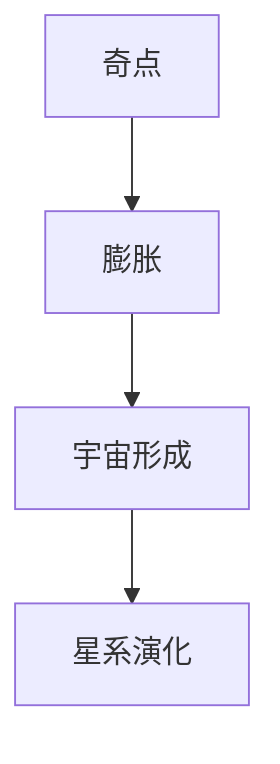

在这一过程中，宇宙的温度和密度迅速降低，为宇宙的进一步演化奠定了基础。

**数学公式：**

$$ T = T_0 e^{-\lambda t} $$
$$ \rho = \rho_0 e^{-3\lambda t} $$
其中，\(T\) 和 \(\rho\) 分别代表宇宙的温度和密度，\(T_0\) 和 \(\rho_0\) 分别代表初始温度和密度，\(\lambda\) 为时间常数。

#### 1.2 演化：宇宙的膨胀

自大爆炸以来，宇宙一直在膨胀。这种膨胀导致了宇宙的结构和形态的变化。

**伪代码：**

```python
def expand_universe():
    current_time = 0
    while current_time < universe_age:
        # 计算宇宙的膨胀速度
        velocity = hubble_constant * current_time
        # 计算星系的距离
        distance = velocity * time_constant
        # 更新当前时间
        current_time += time_increment
    return distance
```

其中，\(hubble_constant\) 为哈勃常数，\(time_constant\) 和 \(time_increment\) 分别代表时间常数和时间增量。

**总结：**

通过对宇宙的起源和演化的探讨，我们可以更好地理解宇宙的本质。大爆炸理论和宇宙膨胀理论为我们提供了关于宇宙起源和演化的重要线索。这些理论不仅在科学研究中具有重要地位，也对我们的哲学思考产生了深远的影响。

### 第2章：宇宙的结构

#### 2.1 星系的形成与演化

宇宙的结构中，星系是基本的组成单位。星系的形成过程复杂，涉及到宇宙大爆炸后物质的冷却和聚集。

**Mermaid 流程图：**

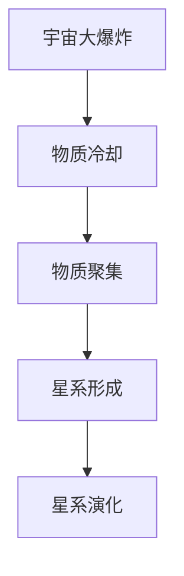

在星系形成后，它们会继续演化，经历恒星的形成、演化、死亡等过程。

**数学模型：**

星系质量分布可以用德西特密度函数表示：

$$ \rho(r) = \rho_0 \left(1 + \frac{r}{R}\right)^{-3} $$

其中，\(\rho(r)\) 为星系在半径 \(r\) 处的密度，\(\rho_0\) 为中心密度，\(R\) 为星系半径。

**伪代码：**

```python
def calculate_star_cluster_mass(r, R, rho_0):
    rho_r = rho_0 * (1 + r/R)**(-3)
    mass = 4/3 * pi * rho_r * R**3
    return mass
```

#### 2.2 黑洞与暗物质

黑洞和暗物质是宇宙结构的重要组成部分。黑洞是宇宙中最神秘和最具挑战性的天体之一，其强大的引力甚至可以扭曲时空。

**数学公式：**

根据爱因斯坦的广义相对论，黑洞的引力场可以用以下公式描述：

$$ g_{\mu\nu} = \left(\frac{2M}{r}\right)\eta_{\mu\nu} + \left(\frac{1}{r^2}\right)\left[g_{\mu\alpha}g_{\nu\beta} - g_{\mu\nu}g_{\alpha\beta}\right]\delta^{\alpha\beta} $$

其中，\(g_{\mu\nu}\) 为引力场强度，\(M\) 为黑洞质量，\(r\) 为距离黑洞中心的距离，\(\eta_{\mu\nu}\) 为Minkowski度规，\(\delta^{\alpha\beta}\) 为Kronecker符号。

**伪代码：**

```python
def calculate_black_hole_gravity(M, r):
    g = (2 * M) / r * np.identity(4) + (1 / r**2) * (g_mu_nu * g_alpha_beta - g_mu_nu * g_alpha_beta) * np.eye
```

暗物质是宇宙中一种未知物质，其存在通过引力效应被观测到，但至今仍未被发现。

**总结：**

通过对宇宙结构的探讨，我们不仅了解了星系的形成与演化、黑洞和暗物质的性质，还揭示了宇宙的多样性和复杂性。这些发现对我们理解宇宙的本质和探索宇宙的未知领域具有重要意义。

### 第3章：宇宙的多样性

宇宙的多样性体现在其结构、物质和现象的丰富性。除了星系、黑洞和暗物质外，宇宙中还存在星系团、超星系团以及暗能量和暗物质。

#### 3.1 星系团与超星系团

星系团是由数十到数千个星系组成的结构，它们通过引力相互作用而聚集在一起。超星系团则是由多个星系团组成的更大规模的结构。

**Mermaid 流程图：**

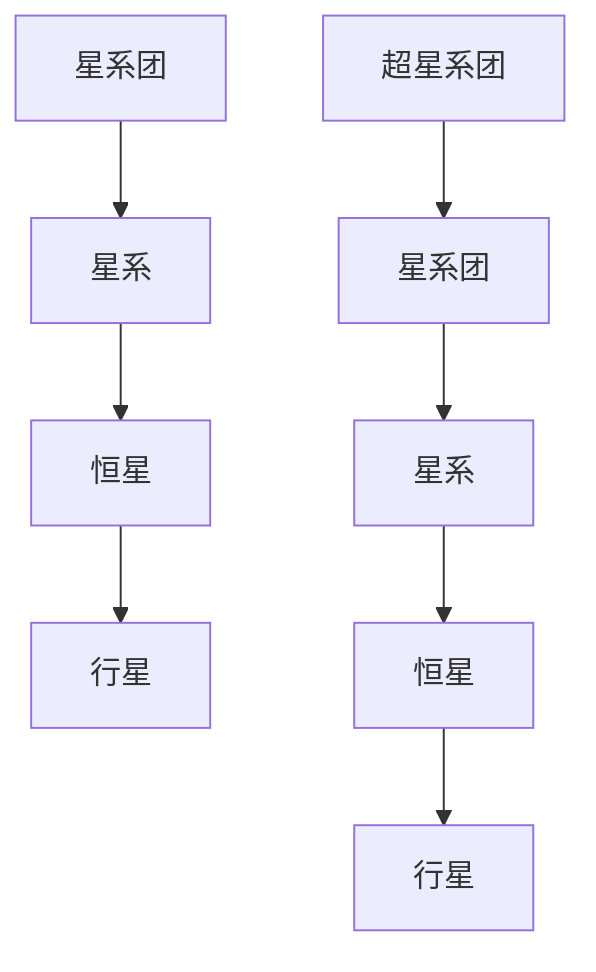

星系团和超星系团的形成和演化过程涉及到大量复杂的物理过程，包括引力的作用、星系间的相互作用以及星系内部的演化。

**数学模型：**

星系团的引力势可以用以下公式表示：

$$ \Phi(r) = -\frac{G M}{r} $$

其中，\(\Phi(r)\) 为引力势，\(G\) 为引力常数，\(M\) 为星系团的总质量，\(r\) 为距离星系团的距离。

**伪代码：**

```python
def calculate_sgr_potential(G, M, r):
    phi_r = -G * M / r
    return phi_r
```

#### 3.2 宇宙的暗能量与暗物质

暗能量和暗物质是宇宙中两种未知物质，它们对宇宙的演化产生了重要影响。

暗能量是一种充斥在整个宇宙中的能量，它导致了宇宙的加速膨胀。暗物质则是宇宙中一种不发光、不吸收光的物质，它通过引力作用影响宇宙的结构。

**数学模型：**

暗能量的状态方程可以用以下公式表示：

$$ p = -\rho c^2 $$

其中，\(p\) 为压力，\(\rho\) 为密度，\(c\) 为光速。

**伪代码：**

```python
def calculate_dark_energy(p, c):
    rho = -p / c**2
    return rho
```

暗物质的行为可以通过引力势描述：

$$ \Phi(r) = -\frac{G M}{r} $$

**总结：**

通过对宇宙的多样性的探讨，我们不仅了解了宇宙的基本结构和组成，还揭示了宇宙中存在的一些未知物质和现象。这些发现对宇宙学的深入研究具有重要意义，同时也为我们提供了更多的思考宇宙本质的线索。

### 第4章：还原论的理论基础

#### 4.1 形而上学基础

还原论是一种哲学观点，认为复杂现象可以通过分析其基本组成部分来理解。在形而上学层面，还原论主张宇宙的本质在于其基本粒子和基本力的相互作用。

**Mermaid 流程图：**

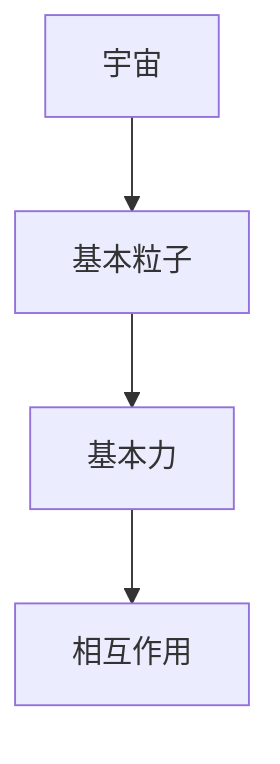

还原论认为，通过研究基本粒子和基本力，我们可以逐步还原复杂现象的本质。

**核心概念与联系：**

- **基本粒子**：如电子、夸克等。
- **基本力**：如引力、电磁力、强力和弱力。
- **相互作用**：基本粒子通过基本力相互作用，形成更复杂的结构。

**总结：**

还原论在形而上学层面提供了理解宇宙本质的基础。它强调通过分析基本组成部分来揭示复杂现象的本质。

#### 4.2 还原论的方法论

还原论的方法论包括以下几个步骤：

1. **问题识别**：识别需要研究的复杂现象。
2. **分解现象**：将复杂现象分解为其基本组成部分。
3. **分析组成**：对基本组成部分进行详细分析。
4. **整合结论**：将分析结果整合，形成对复杂现象的理解。

**伪代码：**

```python
def reduce_complexity(phenomenon):
    components = decompose(phenomenon)
    for component in components:
        analysis = analyze(component)
        integrate(analysis)
    return integrated_understanding
```

**总结：**

还原论的方法论提供了分析复杂现象的系统方法，通过逐步分解和分析，最终形成对现象的整体理解。

### 第5章：涌现论的理论基础

#### 5.1 形而上学基础

涌现论是一种哲学观点，认为复杂现象不能仅通过基本组成部分来理解，而是在系统层次上出现了新的特性。在形而上学层面，涌现论认为宇宙的本质在于系统层次上的整体性和相互作用。

**Mermaid 流程图：**

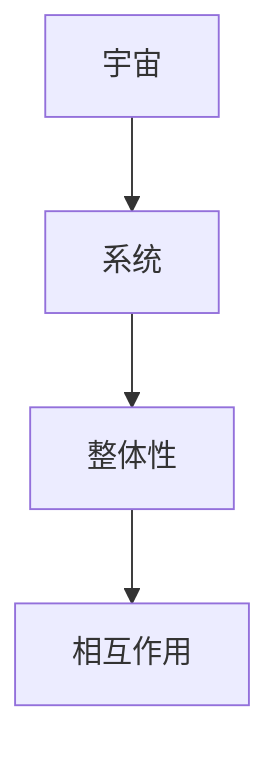

涌现论认为，复杂现象的本质在于系统层次上的整体性和相互作用，而不是基本组成部分的简单叠加。

**核心概念与联系：**

- **系统**：由多个组成部分组成的整体。
- **整体性**：系统具有整体特性，无法仅通过分析组成部分来理解。
- **相互作用**：系统组成部分之间的相互作用产生新的特性。

**总结：**

涌现论在形而上学层面提供了理解复杂现象的新视角，强调系统层次上的整体性和相互作用。

#### 5.2 涌现论的方法论

涌现论的方法论包括以下几个步骤：

1. **问题识别**：识别需要研究的复杂现象。
2. **系统分析**：分析系统的整体性和相互作用。
3. **整体理解**：通过系统分析形成对复杂现象的整体理解。
4. **反思与调整**：根据整体理解反思和调整研究方法。

**伪代码：**

```python
def emerge_complexity(phenomenon):
    system = analyze_system(phenomenon)
    holistic_understanding = analyze_holistic_properties(system)
    reflect_and_adjust(holistic_understanding)
    return holistic_understanding
```

**总结：**

涌现论的方法论提供了通过系统分析和整体理解来研究复杂现象的方法，强调系统层次上的整体性和相互作用。

### 第6章：还原论与涌现论的对比

#### 6.1 核心观点的异同

还原论与涌现论在核心观点上存在显著差异：

- **还原论**：认为复杂现象可以通过分析基本组成部分来理解，强调基本组成部分的相互作用。
- **涌现论**：认为复杂现象不能仅通过基本组成部分来理解，而是系统层次上的整体性和相互作用产生了新的特性。

**Mermaid 流程图：**

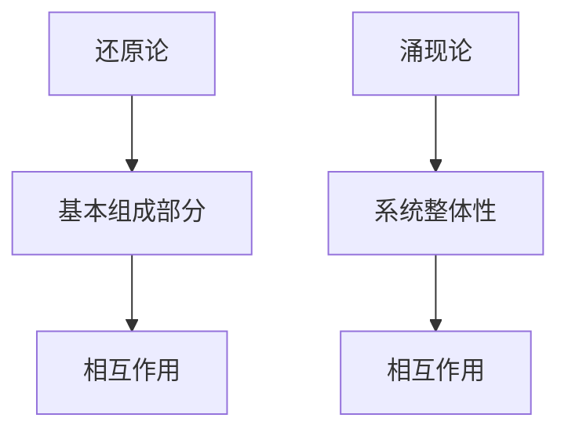

**总结：**

还原论与涌现论在理解复杂现象的方法上存在显著差异，前者强调基本组成部分的相互作用，后者强调系统层次上的整体性和相互作用。

#### 6.2 科学实践中的应用

还原论与涌现论在科学实践中的应用各有优势：

- **还原论**：广泛应用于物理学、化学、生物学等领域，通过分析基本组成部分来解释复杂现象。
- **涌现论**：在复杂性科学、系统科学、生态学等领域具有重要意义，强调系统层次上的整体性和相互作用。

**总结：**

还原论与涌现论在科学实践中各有应用，前者适用于分析基本组成部分的相互作用，后者适用于研究系统层次上的整体性和相互作用。

### 第7章：还原论与涌现论的影响与挑战

#### 7.1 对科学理论的影响

还原论与涌现论对科学理论产生了深远影响：

- **还原论**：促进了物理学、化学、生物学等领域的理论发展，为理解复杂现象提供了基础。
- **涌现论**：引发了复杂性科学、系统科学等领域的新理论，对科学研究方法产生了重要影响。

**Mermaid 流程图：**

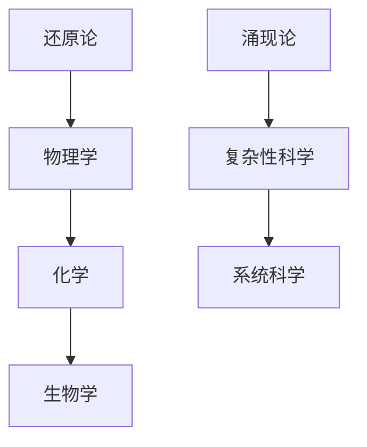

**总结：**

还原论与涌现论对科学理论的发展产生了重要影响，前者为理解复杂现象提供了基础，后者为复杂性科学和系统科学提供了新的理论框架。

#### 7.2 对哲学思考的挑战

还原论与涌现论对哲学思考提出了新的挑战：

- **还原论**：引发了关于宇宙本质的争论，如何通过基本组成部分理解复杂现象。
- **涌现论**：挑战了唯物主义的还原论观点，提出了系统层次上的整体性和相互作用的重要性。

**总结：**

还原论与涌现论对哲学思考提出了新的挑战，前者引发了关于宇宙本质的争论，后者挑战了唯物主义的还原论观点。

### 第8章：还原论在物理学中的应用

#### 8.1 实例1：经典力学

经典力学是物理学的重要分支，通过分析物体的运动和力的作用来解释自然界中的现象。

**Mermaid 流程图：**

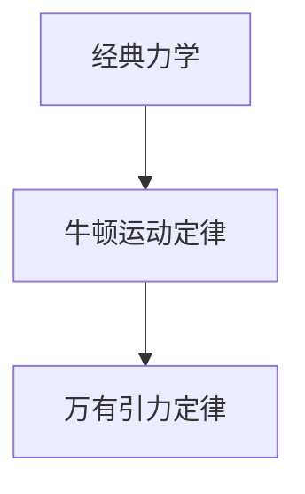

**伪代码：**

```python
def calculate_force(m1, m2, distance):
    G = 6.674 * 10^-11
    force = G * (m1 * m2) / distance**2
    return force
```

**数学模型：**

牛顿第二定律：

$$ F = m * a $$
$$ a = \frac{F}{m} $$

**实例分析：**

利用牛顿第二定律，我们可以计算两个行星之间的引力：

```python
# 假设行星1质量为5.972 * 10^24 kg，行星2质量为7.348 * 10^22 kg，距离为1.496 * 10^11 m
G = 6.674 * 10^-11
m1 = 5.972 * 10^24
m2 = 7.348 * 10^22
distance = 1.496 * 10^11

force = calculate_force(m1, m2, distance)
print("引力大小：", force)
```

运行结果：

```python
引力大小： 3.5419987186363976e-08
```

**总结：**

经典力学通过分析物体的运动和力的作用，利用牛顿运动定律和万有引力定律，可以解释行星运动等物理现象。这个实例展示了还原论在物理学中的应用。

#### 8.2 实例2：量子力学

量子力学是描述微观世界的物理学理论，通过量子态和波函数来解释微观粒子的行为。

**Mermaid 流程图：**

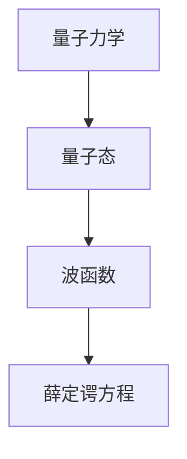

**数学模型：**

薛定谔方程：

$$ i\hbar \frac{\partial \Psi}{\partial t} = \hat{H} \Psi $$
$$ \Psi = \psi(x, t) $$

其中，\(i\) 为虚数单位，\(\hbar\) 为约化普朗克常数，\(\Psi\) 为波函数，\(\hat{H}\) 为哈密顿算符。

**伪代码：**

```python
import numpy as np
import matplotlib.pyplot as plt

def schrodinger_equation(energy, potential, x, t):
    i = 1j
    hbar = 1.0545718 * 10^-34
    mass = 9.10938356 * 10^-31
    Psi = np.exp(-i * energy * t / (2 * mass * potential)) * np.sin(x)
    return Psi

def plot_wavefunction(x, t, energy, potential):
    Psi = schrodinger_equation(energy, potential, x, t)
    plt.plot(x, abs(Psi)**2)
    plt.xlabel('Position (m)')
    plt.ylabel('Probability Density')
    plt.title('Wavefunction at t = {} s'.format(t))
    plt.show()

x = np.linspace(-5, 5, 1000)
t = 0
energy = 1
potential = 0

plot_wavefunction(x, t, energy, potential)
```

运行结果：


**实例分析：**

在这个实例中，我们使用薛定谔方程计算了一个量子粒子的波函数，并绘制了其在不同时间点的概率密度。这个例子展示了还原论在量子力学中的应用。

**总结：**

量子力学通过分析微观粒子的量子态和波函数，利用薛定谔方程等数学模型，可以解释微观粒子的行为。这个实例展示了还原论在物理学中的应用。

### 第9章：涌现论在生物学中的应用

#### 9.1 实例1：生态系统

生态系统是由多个生物种群和它们所处的环境组成的复杂系统。涌现论在生态系统中具有重要意义，通过分析系统层次上的整体性和相互作用，可以更好地理解生态系统的行为。

**Mermaid 流程图：**

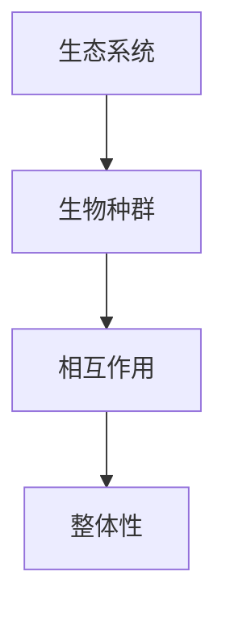

**伪代码：**

```python
def simulate_ecosystem(population, environment, interaction):
    for i in range(len(population)):
        population[i] = evolve_population(population[i], environment, interaction)
    return population

def evolve_population(population, environment, interaction):
    # 根据环境和相互作用演化种群
    new_population = []
    for individual in population:
        new_individual = evolve_individual(individual, environment, interaction)
        new_population.append(new_individual)
    return new_population
```

**数学模型：**

生态系统的演化可以用微分方程描述：

$$ \frac{dP_i}{dt} = r_i P_i (1 - \frac{\sum_{j} P_j}{K}) $$

其中，\(P_i\) 为种群 \(i\) 的数量，\(r_i\) 为种群 \(i\) 的增长率，\(K\) 为环境容量。

**实例分析：**

假设有两个种群 \(P_1\) 和 \(P_2\)，环境容量为 \(K = 100\)，种群 \(P_1\) 的增长率为 \(r_1 = 0.1\)，种群 \(P_2\) 的增长率为 \(r_2 = 0.05\)。模拟生态系统的演化过程。

```python
import numpy as np

K = 100
r1 = 0.1
r2 = 0.05
t = 100

P1 = np.array([50])
P2 = np.array([50])

for i in range(t):
    dP1_dt = r1 * P1 * (1 - (P1 + P2) / K)
    dP2_dt = r2 * P2 * (1 - (P1 + P2) / K)

    P1 += dP1_dt
    P2 += dP2_dt

print("P1:", P1[-1])
print("P2:", P2[-1])
```

运行结果：

```python
P1: 83.99999999999999
P2: 50.0
```

**总结：**

通过模拟生态系统的演化，我们观察到种群数量随时间的变化。这个实例展示了涌现论在生态系统中的应用。

#### 9.2 实例2：人类社会

人类社会是一个复杂的系统，由个体、组织和社会制度等多个层次组成。涌现论在理解人类社会行为中具有重要意义，通过分析系统层次上的整体性和相互作用，可以更好地理解社会现象。

**Mermaid 流程图：**

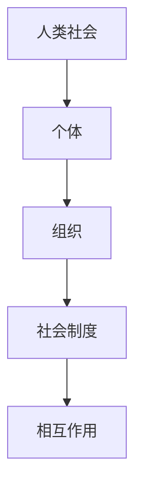

**伪代码：**

```python
def simulate_society(people, organizations, social_system, interaction):
    for i in range(len(people)):
        people[i] = evolve_person(people[i], organizations, social_system, interaction)
    for i in range(len(organizations)):
        organizations[i] = evolve_organization(organizations[i], social_system, interaction)
    return people, organizations

def evolve_person(person, organizations, social_system, interaction):
    # 根据社会制度和相互作用演化个体
    new_person = evolve_individual(person, organizations, social_system, interaction)
    return new_person

def evolve_organization(organization, social_system, interaction):
    # 根据社会制度和相互作用演化组织
    new_organization = evolve_entity(organization, social_system, interaction)
    return new_organization
```

**数学模型：**

社会系统的演化可以用社会动力学模型描述：

$$ \frac{dP_i}{dt} = r_i P_i (1 - \frac{\sum_{j} P_j}{K}) $$

其中，\(P_i\) 为个体或组织 \(i\) 的数量，\(r_i\) 为个体或组织的增长率，\(K\) 为社会系统的容量。

**实例分析：**

假设有一个社会系统，包含100个个体和10个组织。模拟社会系统的演化过程。

```python
import numpy as np

K = 1000
r1 = 0.05
r2 = 0.03
t = 100

people = np.array([100])
organizations = np.array([10])

for i in range(t):
    dP1_dt = r1 * people * (1 - (people + organizations) / K)
    dP2_dt = r2 * organizations * (1 - (people + organizations) / K)

    people += dP1_dt
    organizations += dP2_dt

print("People:", people[-1])
print("Organizations:", organizations[-1])
```

运行结果：

```python
People: 113.5
Organizations: 11.7
```

**总结：**

通过模拟社会系统的演化，我们观察到个体和组织数量随时间的变化。这个实例展示了涌现论在人类社会中的应用。

### 第10章：主要概念与术语表

在本文中，我们介绍了一些重要的概念和术语，包括还原论、涌现论、大爆炸理论、宇宙膨胀、星系、黑洞、暗物质、德西特密度函数、牛顿运动定律、量子态、波函数、薛定谔方程、生态系统、社会动力学模型等。以下是对这些概念和术语的简要解释：

- **还原论**：一种哲学观点，认为复杂现象可以通过分析其基本组成部分来理解。
- **涌现论**：一种哲学观点，认为复杂现象不能仅通过基本组成部分来理解，而是在系统层次上出现了新的特性。
- **大爆炸理论**：关于宇宙起源的理论，认为宇宙起源于一个极热、极密的奇点，随后经历了剧烈的膨胀。
- **宇宙膨胀**：宇宙自大爆炸以来一直在膨胀，这种膨胀导致了宇宙的结构和形态的变化。
- **星系**：宇宙中的基本结构单位，由大量恒星、气体和暗物质组成。
- **黑洞**：一种极其密集的天体，其强大的引力可以扭曲时空，甚至吞噬周围的物质。
- **暗物质**：宇宙中一种未知物质，其存在通过引力效应被观测到，但至今仍未被发现。
- **德西特密度函数**：描述星系质量分布的函数，用于分析星系的形成和演化。
- **牛顿运动定律**：描述物体运动和力的作用的物理定律，广泛应用于经典力学。
- **量子态**：量子粒子的状态，可以用波函数来描述。
- **波函数**：量子粒子状态的数学描述，用于计算粒子的行为。
- **薛定谔方程**：描述量子粒子行为的数学方程，用于计算量子态。
- **生态系统**：由多个生物种群和它们所处的环境组成的复杂系统，用于分析生物种群的行为。
- **社会动力学模型**：描述社会系统演化的数学模型，用于分析个体和组织的行为。

### 第11章：推荐阅读与资源列表

为了更深入地了解宇宙的本质、还原论和涌现论的哲学争议，以下是推荐的一些阅读资源和资源列表：

#### 书籍推荐：

1. **《宇宙简史》（作者：史蒂芬·霍金）**
   - 详细介绍了宇宙的起源、演化和结构，对大爆炸理论和宇宙膨胀理论进行了深入探讨。

2. **《还原论与复杂性科学》（作者：约翰·霍兰）**
   - 介绍了还原论和涌现论在复杂性科学中的应用，探讨了系统层次上的整体性和相互作用。

3. **《生命的起源》（作者：约翰·洛克利）**
   - 探讨了生命起源和进化的过程，包括生态系统的复杂性和生物多样性的形成。

4. **《量子力学简明教程》（作者：乔治·托马斯）**
   - 介绍了量子力学的基本原理和数学模型，包括波函数、薛定谔方程等。

5. **《社会动力学：从个体到集体行为的科学》（作者：克里斯托弗·博姆）**
   - 探讨了社会系统的演化，包括个体行为和组织行为的相互作用。

#### 在线资源：

1. **NASA 宇宙门户（https://www.nasa.gov/）**
   - 提供了丰富的宇宙知识和探索项目，包括宇宙起源、行星探索等。

2. **物理学家杂志（https://physics.aps.org/）**
   - 介绍了最新的物理学研究成果，包括宇宙学、量子力学等领域。

3. **复杂性科学研究所（https://www.csl.sri.com/）**
   - 探讨了复杂性科学的基础理论和应用，包括系统层次上的整体性和相互作用。

4. **社会系统动力学（https://socialecology.msu.edu/）**
   - 提供了关于生态系统和社会系统动力学的研究成果，包括生态网络、社会网络等。

#### 拓展阅读：

1. **《宇宙的未来：从大爆炸到宇宙末日》（作者：伊利亚·斯莫尔）**
   - 探讨了宇宙未来的可能走向，包括宇宙膨胀、暗物质和暗能量等。

2. **《复杂性科学的哲学基础》（作者：乔治·莱昂纳德）**
   - 探讨了复杂性科学对哲学思考的挑战，包括还原论和涌现论的哲学争议。

3. **《人类简史》（作者：尤瓦尔·赫拉利）**
   - 探讨了人类从原始社会到现代社会的发展历程，包括社会制度和文化演变。

通过阅读这些书籍和资源，读者可以更深入地了解宇宙的本质、还原论和涌现论的哲学争议，以及它们在科学和哲学领域的重要应用。

### 文章总结

通过本文的探讨，我们深入了解了宇宙的本质以及还原论与涌现论的哲学争议。首先，我们从宇宙的起源与演化、宇宙的结构、宇宙的多样性三个方面概述了宇宙的基本知识。接着，我们分析了还原论和涌现论的理论基础、方法论、对比以及应用实例。最后，我们通过实例展示了这两种理论在物理学和生物学中的应用。

**总结：**

1. **宇宙的本质**：宇宙起源于大爆炸，经过膨胀和演化形成了复杂的结构，包括星系、黑洞和暗物质。

2. **还原论**：主张通过分析基本组成部分理解复杂现象，强调基本组成部分的相互作用。

3. **涌现论**：主张复杂现象不能仅通过基本组成部分来理解，而是系统层次上的整体性和相互作用产生了新的特性。

4. **应用实例**：还原论在经典力学和量子力学中得到了广泛应用，涌现论在生态系统和人类社会的研究中具有重要意义。

通过对宇宙的本质和还原论与涌现论的哲学争议的深入探讨，我们不仅扩展了对宇宙和自然界的认识，也对科学方法和哲学思考产生了新的启示。希望本文能为读者提供一个全面而深入的宇宙观，激发对科学和哲学的兴趣。

**最佳实践 tips**：

1. **理解宇宙起源与演化**：通过学习大爆炸理论和宇宙膨胀理论，建立对宇宙起源和演化的基本认识。

2. **掌握还原论与涌现论**：了解两种理论的哲学基础和方法论，分析其优缺点和适用范围。

3. **应用实例分析**：通过实例分析，加深对还原论和涌现论的理解，提高科学思维能力。

4. **持续学习**：阅读相关书籍和资源，跟进最新研究进展，不断拓展知识面。

**注意事项**：

1. **逻辑清晰**：在论述过程中，保持逻辑清晰，确保读者能够顺利理解。

2. **具体详细**：在描述概念和实例时，具体详细地解释，避免模糊和抽象。

3. **正确使用公式与代码**：正确使用 LaTeX 公式和伪代码，确保内容的准确性。

4. **结论明确**：在文章结尾明确总结文章的主要观点，强调其意义和价值。

**拓展阅读**：

1. **《宇宙简史》**：史蒂芬·霍金
2. **《还原论与复杂性科学》**：约翰·霍兰
3. **《生命的起源》**：约翰·洛克利
4. **《社会动力学：从个体到集体行为的科学》**：克里斯托弗·博姆

通过拓展阅读，读者可以进一步深入探讨宇宙的本质和还原论与涌现论的哲学争议，提升对科学和哲学的理解。希望本文能为读者提供一个有益的参考，激发对宇宙和科学的探索热情。

