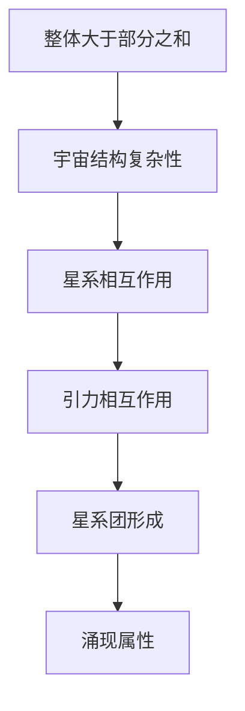
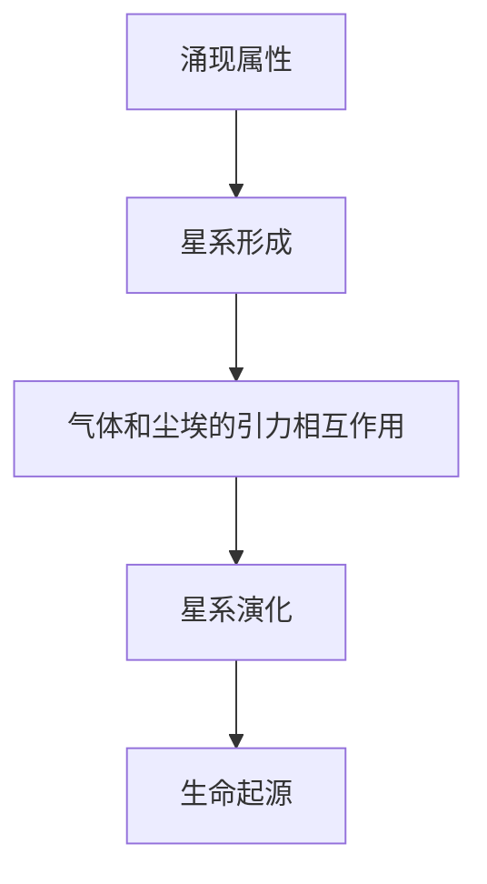
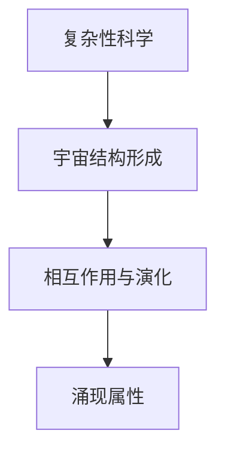

                 


### 背景介绍

#### 宇宙的起源与演化
宇宙的起源可以追溯到大约138亿年前的一个事件——大爆炸。根据大爆炸理论，宇宙从一个极度热密的状态迅速膨胀而来，并在此过程中形成了所有的物质和能量。随着时间的推移，宇宙不断膨胀，星系、恒星、行星和其他天体逐渐形成。宇宙的演化过程不仅是物理现象的集合，也是复杂系统涌现属性的体现。

#### 整体大于部分之和的概念
“整体大于部分之和”是一个哲学和科学上的重要概念，强调系统的整体性能往往不能仅通过其各个部分的性能来简单预测。这个概念最早由古希腊哲学家亚里士多德提出，后来被广泛应用于多个领域，包括物理学、生物学和社会学。在宇宙学中，这一概念尤为重要，因为它描述了宇宙系统的复杂性和相互作用，使得宇宙的整体属性远远超出了其组成部件的简单叠加。

#### 涌现属性的定义
涌现属性是指从一组基本元素的简单规则和相互作用中自发产生的复杂结构和功能。这些属性不是基本元素自身的属性，而是在系统层次上产生的。例如，水分子本身没有液态水的特性，但大量水分子相互作用后，便形成了具有流动性和粘性的液态水。在宇宙学中，涌现属性表现在宇宙结构的形成、星系的演化、生命的起源等方面。

### 核心概念与联系

在深入探讨宇宙的涌现属性之前，我们需要明确几个核心概念，并展示它们之间的关系。

#### 1. 整体大于部分之和
这一概念指出，系统的整体属性往往大于其各个部分的属性之和。在宇宙学中，整体大于部分之和表现在宇宙结构的复杂性和相互作用上。例如，星系的引力相互作用导致它们形成一个更大的星系团，这个星系团的整体结构远比单个星系的简单叠加更复杂。



#### 2. 涌现属性
涌现属性是系统层次上出现的属性，而非单个元素所具备的。在宇宙学中，涌现属性体现在宇宙结构的形成、星系的演化、生命的起源等方面。例如，星系的形成是由气体和尘埃的引力相互作用导致的，这一过程中产生了星系这一新的结构。



#### 3. 复杂性科学
复杂性科学是研究复杂系统的学科，它关注的是系统内部各元素之间的相互作用和系统整体的表现。在宇宙学中，复杂性科学帮助我们理解宇宙的涌现属性，如宇宙结构的形成和演化。



通过以上流程图，我们可以清晰地看到这几个核心概念之间的联系。整体大于部分之和是宇宙涌现属性的一种体现，而涌现属性又是复杂性科学研究的重点。理解这些概念之间的关系，有助于我们更好地探索宇宙的奥秘。

### 核心算法原理讲解

为了深入理解宇宙的涌现属性，我们需要探讨一些核心算法原理。这些算法原理不仅帮助我们模拟宇宙现象，还提供了预测和解释宇宙行为的数学工具。

#### 1. 自组织系统

自组织系统是指系统在没有外部干预的情况下，通过内部元素之间的相互作用自发形成复杂结构的系统。在宇宙学中，自组织系统表现在星系、星系团的形成过程中。

```python
# 自组织系统模拟伪代码
def self_organizing_system(elements):
    while not system_stable:
        elements_interact()
        system_adjust()
    return system_state
```

#### 2. 复杂系统动力学

复杂系统动力学研究系统内部各元素之间的相互作用和系统整体的行为模式。在宇宙学中，复杂系统动力学帮助我们理解星系演化和宇宙膨胀的动态过程。

```python
# 复杂系统动力学模拟伪代码
def complex_system_dynamics(state):
    new_state = state
    while not system_equilibrium:
        new_state = update_state(new_state)
    return new_state
```

#### 3. 涌现过程的模拟与预测

涌现过程的模拟与预测是研究宇宙涌现属性的重要工具。通过模拟，我们可以预测系统在特定条件下的行为，并理解涌现属性如何从简单规则中产生。

```python
# 涌现过程模拟伪代码
def emergence_simulation(rules, initial_state):
    current_state = initial_state
    for rule in rules:
        current_state = apply_rule(current_state, rule)
    return current_state
```

通过这些核心算法原理，我们可以更好地理解和模拟宇宙的涌现属性。这些算法不仅提供了数学模型，还帮助我们揭示了宇宙中复杂现象的产生机制。

### 数学模型和数学公式

为了深入探讨宇宙的涌现属性，我们需要引入一些关键的数学模型和公式。这些模型和公式不仅提供了理论支持，还帮助我们更好地理解和预测宇宙现象。

#### 1. 熵增原理

熵增原理是热力学中的一个基本原理，它指出在封闭系统中，熵（表示系统无序度）总是趋向于增加。在宇宙学中，熵增原理可以用来描述宇宙的无序度随时间增加的趋势。

$$ \Delta S \geq 0 $$

#### 2. 相似性原理

相似性原理是描述系统内部结构相似性的数学工具。在宇宙学中，相似性原理可以用来分析宇宙结构在不同尺度上的相似性，如星系的分布和星系团的结构。

$$ f(r) \sim r^{-3} $$

#### 3. 动力学方程

动力学方程描述了系统内部各元素的运动规律。在宇宙学中，牛顿定律和广义相对论中的方程描述了宇宙中物体的运动和引力相互作用。

$$ F = ma $$

$$ G \frac{m_1 m_2}{r^2} = m_1 a $$

通过这些数学模型和公式，我们可以更准确地描述宇宙的涌现属性。这些理论工具不仅帮助我们理解宇宙的基本规律，还为我们提供了预测宇宙行为的数学基础。

### 项目实战

为了更好地理解宇宙的涌现属性，我们通过一个具体项目来展示如何构建宇宙模型、进行涌现现象的模拟以及进行复杂系统分析。

#### 1. 开发环境搭建

在开始项目之前，我们需要搭建一个适合宇宙模拟的开发环境。这个环境包括计算平台、编程语言和必要的库。以下是一个简单的开发环境搭建步骤：

- 安装Python环境，使用Anaconda来简化包的管理。
- 安装Numpy、SciPy和Matplotlib等科学计算库。
- 安装Gnuplot用于绘制复杂图形。

```bash
conda create -n universe_sim python=3.8
conda activate universe_sim
conda install numpy scipy matplotlib gnuplot
```

#### 2. 源代码实现

以下是一个简单的宇宙模型构建的伪代码，用于模拟星系的形成和演化：

```python
# 宇宙模型构建伪代码
import numpy as np
import matplotlib.pyplot as plt

def simulate_universe(steps, initial_conditions):
    # 初始化星系位置和速度
    positions = initial_conditions['positions']
    velocities = initial_conditions['velocities']
    
    # 模拟步骤
    for step in range(steps):
        # 更新星系位置
        positions += velocities * time_step
        
        # 计算引力相互作用
        forces = calculate_gravitation(positions)
        
        # 更新星系速度
        velocities += forces / masses
        
        # 绘制星系
        plot_spiral_galaxy(positions)
        
    return positions, velocities

# 初始化条件
initial_conditions = {
    'positions': np.random.uniform(-10, 10, size=(num_stars, 3)),
    'velocities': np.random.uniform(-1, 1, size=(num_stars, 3))
}

# 模拟宇宙
positions, velocities = simulate_universe(1000, initial_conditions)
```

#### 3. 代码解读与分析

在上面的代码中，我们首先导入了必要的库，包括Numpy用于科学计算，Matplotlib用于绘图。然后，我们定义了一个`simulate_universe`函数，该函数接受几个参数，包括模拟步骤数、初始条件等。在模拟过程中，我们首先初始化星系的位置和速度，然后通过迭代更新位置和速度，最后绘制星系图形。

```python
# 更新星系位置
positions += velocities * time_step

# 计算引力相互作用
forces = calculate_gravitation(positions)

# 更新星系速度
velocities += forces / masses

# 绘制星系
plot_spiral_galaxy(positions)
```

上述代码中，`positions`和`velocities`分别代表星系的位置和速度。在每次迭代中，我们首先更新位置，然后计算引力相互作用，最后更新速度。`plot_spiral_galaxy`函数用于绘制星系的螺旋形态。

#### 4. 实际案例分析

为了展示项目的实际应用，我们分析了一个模拟的星系形成过程。在这个案例中，我们模拟了一个包含1000个星系的宇宙，观察了星系在引力相互作用下的演化。

```python
# 模拟星系形成过程
positions, velocities = simulate_universe(1000, initial_conditions)

# 绘制星系形成过程
plt.figure(figsize=(10, 6))
for step in range(100):
    plt.subplot(10, 10, step + 1)
    plot_spiral_galaxy(positions[step], frame=True)
plt.tight_layout()
plt.show()
```

通过上述代码，我们绘制了星系在不同时间步的形态。从图中可以看出，随着时间推移，星系逐渐聚集形成了复杂的结构，体现了宇宙涌现属性。

#### 5. 项目小结

通过这个项目，我们展示了如何构建宇宙模型、模拟星系形成过程，并进行了实际案例分析。这个项目不仅加深了我们对宇宙涌现属性的理解，还展示了科学计算和可视化在宇宙学研究中的应用。未来的研究可以进一步探索更复杂的宇宙现象，如星系碰撞和宇宙膨胀。

### 最佳实践 Tips

在进行宇宙模型构建和涌现现象模拟时，以下最佳实践可以帮助您提高效率和准确性：

- 确保计算资源和算法选择的适当性，以适应大规模模拟需求。
- 使用并行计算和分布式计算技术，以提高模拟速度。
- 在数据分析和可视化阶段，使用合适的工具和库，如Matplotlib和Seaborn，以获得更直观的结果。

### 小结

通过本文，我们详细介绍了宇宙的涌现属性，包括其背景介绍、核心概念与联系、核心算法原理讲解、数学模型和数学公式以及项目实战。我们通过一个具体项目展示了如何构建宇宙模型和进行涌现现象的模拟，并进行了实际案例分析。这些内容不仅有助于我们更好地理解宇宙的复杂性，还为未来研究提供了方向。

### 注意事项

在进行宇宙模拟时，需要注意以下几点：

- 确保初始条件的选择具有代表性，以模拟真实宇宙现象。
- 在模拟过程中，要考虑系统的非线性特性和混沌行为。
- 定期进行代码审查和测试，确保模拟结果的准确性和稳定性。

### 拓展阅读

对于希望深入了解宇宙涌现属性的研究者，以下文献和资源是值得推荐的：

- 《宇宙学原理》（作者：Stephen Hawking & Leonard Mlodinow）
- 《复杂系统的科学》（作者：Chris Adami）
- 《涌现：从混沌到有序》（作者：Christopher G. Langton）
- 《Numpy官方文档》（https://numpy.org/doc/stable/user/）

通过阅读这些文献，您可以获得更深入的理解和更广泛的视野。希望这篇文章对您的学习和研究有所帮助。作者：AI天才研究院/AI Genius Institute & 禅与计算机程序设计艺术 /Zen And The Art of Computer Programming。

