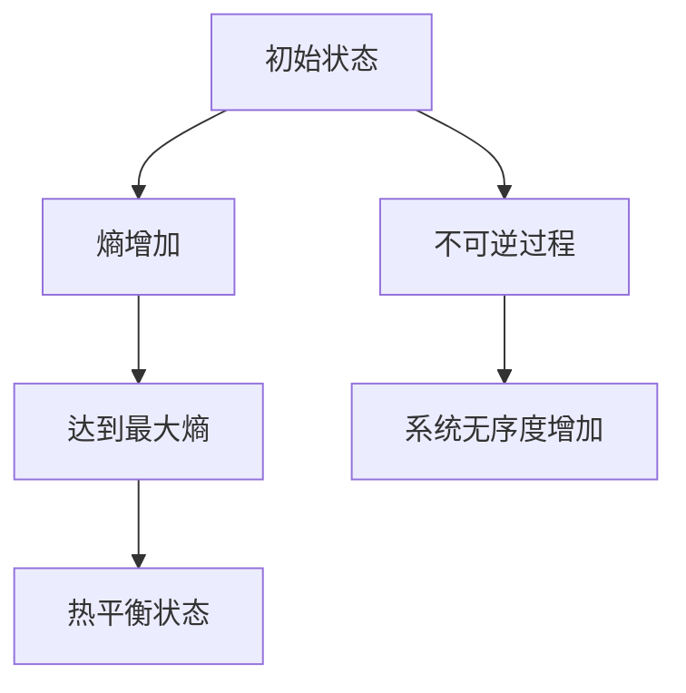

                 

### 引言：宇宙的熵增与不可逆性

宇宙的熵增原理，是理解宇宙运行机制的一个基本概念，也是热力学第二定律的核心内容。熵增原理指出，在一个孤立系统中，总熵（系统内所有微观状态的统计平均熵）总是趋于增加，直至达到最大值，这时系统处于热平衡状态。不可逆性则是指，宇宙中的过程往往是单向的，从低熵态向高熵态发展，且一旦发生，无法逆转。

#### 熵增原理的基本概念

熵（Entropy），是一个物理量，用来描述系统的无序程度。具体而言，熵是系统可能微观状态的数量的对数。例如，一个理想的气体分子，其可能的微观状态包括分子的位置和速度，这些状态越多，系统的熵就越大。

在一个孤立系统中，熵总是倾向于增加。这是因为，系统内部微观状态的无序度是随机的，在没有外界干预的情况下，这种随机性会导致系统向更高无序度发展。这个过程是不可逆的，一旦发生，就无法逆转。

#### 不可逆性的宇宙意义

不可逆性在宇宙中有着深远的意义。首先，它解释了时间箭头的问题，即为什么时间总是向前流动，而不是向后或随机流动。根据熵增原理，宇宙最初处于极低熵态，随着时间的推移，系统不断向高熵态发展，这一过程是不可逆的，因此，时间也是单向的。

不可逆性还与生命起源和演化有关。生命体系是一个高度有序的系统，通过消耗能量，维持低熵状态。然而，这种有序性是相对的，它依赖于生命的代谢过程，而代谢过程本质上是一个熵增过程。因此，生命体系的存在和发展也遵循熵增原理。

#### 熵增原理与生命起源

生命的起源是一个复杂的过程，涉及到化学反应、能量流动和熵的变化。根据熵增原理，生命体系的形成是一个熵减过程，即在局部范围内，系统熵减少，但整体上，宇宙熵是增加的。

这种局部熵减是通过能量转化实现的。例如，在生命的起源过程中，一些简单的有机分子通过吸收太阳能，转化为更复杂的有机分子，这一过程中，系统的无序度降低，熵减少。然而，整体上，宇宙熵是增加的，因为能量的转化过程中，不可避免地产生了大量的热能，这些热能增加了系统的无序度。

#### 不可逆性在生命中的体现

在生命体系中，不可逆性主要体现在能量代谢和物质循环过程中。例如，食物的消化和吸收是一个熵增过程，消化系统需要消耗能量，将食物中的有机物分解成更简单的物质，这一过程中，系统的无序度增加，熵增加。然而，这个过程中，生命体系通过能量的转化，维持了低熵状态，从而保持了生命的有序性。

此外，生命体系中的生长和繁殖也是不可逆的。生长过程中，细胞分裂和物质合成是一个熵增过程，而繁殖过程中，生物体通过繁殖后代，传递遗传信息，也是不可逆的。

总之，熵增原理和不可逆性是理解宇宙和生命运行机制的基本原理。在接下来的章节中，我们将深入探讨熵增原理的数学表述，以及它在各个领域中的应用。

### 熵增原理的数学表述

熵增原理的数学表述是理解这一物理现象的关键。首先，我们需要了解熵的定义和计算方法。

#### 熵的定义

熵（Entropy），是热力学中一个重要的物理量，用来描述系统的无序程度。对于一个系统，其熵可以用以下公式表示：

$$
S = -\sum_{i} p_i \ln(p_i)
$$

其中，\( S \) 是系统的熵，\( p_i \) 是系统处于第 \( i \) 种微观状态的概率。

这个公式表明，系统的熵是其所有可能微观状态的概率的加权和，权重是每种状态的概率，并且对数的底数通常取为2（单位为比特）。

#### 熵的计算方法

熵的计算方法取决于系统的具体情况。以下是一些常见系统的熵计算方法：

1. **理想气体熵**：对于理想气体，其熵可以由以下公式计算：

$$
S = nR\ln(V/N) + C\ln(T)
$$

其中，\( n \) 是气体的物质的量，\( R \) 是气体常数，\( V \) 是气体的体积，\( N \) 是气体分子的数量，\( T \) 是气体的温度，\( C \) 是与气体性质相关的常数。

2. **量子系统熵**：对于量子系统，熵的计算方法更为复杂。一个量子系统的熵可以通过其密度矩阵来计算。对于一个两能级系统，其熵可以用以下公式表示：

$$
S = -\rho \ln(\rho)
$$

其中，\( \rho \) 是系统的密度矩阵。

3. **混合系统熵**：对于混合系统，熵的计算需要考虑系统内部不同部分的熵以及它们之间的相互作用。一个典型的混合系统熵的计算公式是：

$$
S = -k \sum_i p_i \ln(p_i)
$$

其中，\( k \) 是玻尔兹曼常数，\( p_i \) 是系统处于第 \( i \) 个状态的概率。

#### 熵增原理的数学模型

熵增原理的数学模型可以通过热力学第二定律来描述。热力学第二定律指出，在一个孤立系统中，总熵总是趋于增加。具体而言，一个孤立系统的熵随时间的变化可以表示为：

$$
\frac{dS_{\text{total}}}{dt} \geq 0
$$

这个公式表明，孤立系统的总熵随时间的变化率是非负的。当系统处于平衡状态时，熵的变化率为零。

#### 鳞片定理与熵增

鳞片定理（Lotka-Volterra equations）是描述生态系统中的物种竞争和捕食关系的数学模型。这个模型指出，在生态系统中的物种数量会随时间变化，并且这些变化是熵增的过程。

鳞片定理的数学模型可以用以下方程组来表示：

$$
\frac{dN_p}{dt} = r_p N_p (1 - \frac{N_p}{K_p}) - a_{p1} N_p N_c
$$

$$
\frac{dN_c}{dt} = r_c N_c (1 - \frac{N_c}{K_c}) - b_{c1} N_p N_c
$$

其中，\( N_p \) 和 \( N_c \) 分别表示捕食者和被捕食者的数量，\( r_p \) 和 \( r_c \) 分别表示捕食者和被捕食者的自然增长率，\( K_p \) 和 \( K_c \) 分别表示捕食者和被捕食者的环境容量，\( a_{p1} \) 和 \( b_{c1} \) 分别表示捕食者和被捕食者的相互作用系数。

这个模型表明，捕食者和被捕食者的数量变化是一个熵增过程。捕食者的数量增加会导致被捕食者数量的减少，而被捕食者数量的减少又会导致捕食者数量的减少，这一过程是单向的，不可逆的。

#### 不可逆过程与熵增

不可逆过程是指系统从一个状态转变到另一个状态的过程，这个过程具有方向性，无法逆转。在物理学中，许多过程都是不可逆的，例如热传导、扩散等。

不可逆过程的熵增可以通过以下公式来描述：

$$
\Delta S \geq \int_{t_1}^{t_2} \frac{\delta Q}{T}
$$

其中，\( \Delta S \) 是系统熵的变化量，\( \delta Q \) 是系统在过程中吸收或放出的热量，\( T \) 是系统的温度。

这个公式表明，在一个不可逆过程中，系统的熵变化量至少等于系统吸收或放出的热量除以温度。这意味着，在一个不可逆过程中，系统的熵总是增加的。

总之，熵增原理的数学表述是理解宇宙和生命运行机制的重要工具。通过熵的定义和计算方法，以及熵增原理的数学模型，我们可以深入探讨熵增原理在不同领域的应用。在接下来的章节中，我们将继续探讨熵增原理在热力学、生物学和物理学中的应用。

### 熵增原理在热力学中的应用

熵增原理是热力学第二定律的核心内容，它深刻地影响了我们对能量转化和过程不可逆性的理解。在热力学中，熵增原理的应用主要体现在能量守恒定律和过程不可逆性两个方面。

#### 热力学第一定律：能量守恒

热力学第一定律，也称为能量守恒定律，指出在一个封闭系统中，能量不会凭空产生或消失，它只能从一种形式转化为另一种形式。这个定律可以用以下公式表示：

$$
\Delta U = Q - W
$$

其中，\( \Delta U \) 表示系统内能的变化，\( Q \) 表示系统吸收的热量，\( W \) 表示系统对外做的功。

根据能量守恒定律，能量在一个系统内部只能转移或转换形式，不能凭空消失或产生。例如，在一个热机中，燃料燃烧产生的化学能转化为热能，热能再转化为机械能，最终对外做功。尽管能量形式发生了变化，但系统的总能量始终保持不变。

#### 热力学第二定律：熵增

热力学第二定律指出，在一个孤立系统中，总熵总是趋于增加。这个定律可以用以下公式表示：

$$
\frac{dS_{\text{total}}}{dt} \geq 0
$$

这个公式表明，在一个孤立系统中，总熵随时间的变化率是非负的。当系统处于平衡状态时，熵的变化率为零。

热力学第二定律中的熵增原理告诉我们，能量转化过程中不可避免地伴随着熵的增加。这意味着，在一个能量转化的过程中，系统的无序度总是在增加。例如，当热能转化为机械能时，一部分热能会以热的形式散失到环境中，导致系统的总熵增加。

#### 熵增原理与热力学过程的不可逆性

熵增原理与热力学过程的不可逆性密切相关。不可逆过程是指系统从一个状态转变到另一个状态的过程，这个过程具有方向性，无法逆转。在物理学中，许多过程都是不可逆的，例如热传导、扩散等。

不可逆过程的熵增可以通过以下公式来描述：

$$
\Delta S \geq \int_{t_1}^{t_2} \frac{\delta Q}{T}
$$

其中，\( \Delta S \) 是系统熵的变化量，\( \delta Q \) 是系统在过程中吸收或放出的热量，\( T \) 是系统的温度。

这个公式表明，在一个不可逆过程中，系统的熵变化量至少等于系统吸收或放出的热量除以温度。这意味着，在一个不可逆过程中，系统的熵总是增加的。

例如，在一个热传导过程中，热量总是从高温物体传递到低温物体，这个过程是不可逆的，因为热量不会自发地从低温物体传递到高温物体。这一过程中，系统的熵增加，因为高温物体的微观状态数量减少，而低温物体的微观状态数量增加。

同样，在一个扩散过程中，物质总是从高浓度区域向低浓度区域扩散，这也是一个不可逆过程。这一过程中，系统的熵增加，因为高浓度区域的微观状态数量减少，而低浓度区域的微观状态数量增加。

总之，熵增原理在热力学中的应用揭示了能量转化和过程不可逆性的本质。通过能量守恒定律和熵增原理，我们可以更深入地理解热力学过程，并预测这些过程的方向和结果。在接下来的章节中，我们将继续探讨熵增原理在生物学和物理学中的应用。

### 熵增原理在生物学中的应用

熵增原理在生物学中的应用是理解生命过程和生物系统动态的关键。从细胞代谢到生态系统，熵增原理揭示了生命体系的有序性与无序性之间的微妙平衡。

#### 生命的熵增与减熵机制

生命的熵增与减熵机制是理解生命体系动态的基础。在生物学中，熵增通常与能量代谢过程相关，而减熵机制则涉及生物体如何利用能量来维持其有序结构。

1. **熵增：能量代谢**

生物体进行各种代谢活动时，会消耗能量。例如，食物的消化和吸收是一个熵增过程，消化系统需要消耗能量，将食物中的有机物分解成更简单的物质。这一过程中，系统的无序度增加，熵增加。消化过程中产生的废物和代谢产物会释放到环境中，导致周围环境的熵增加。

2. **减熵：能量利用**

尽管生物体在进行代谢活动时熵会增加，但生命体系通过一系列复杂的机制来维持其低熵状态。这种减熵机制主要体现在以下几个方面：

   - **光合作用**：植物和某些细菌通过光合作用将光能转化为化学能，这一过程中，系统的无序度降低，熵减少。光合作用产生的有机物质和氧气，有助于维持生物体内部的低熵状态。

   - **细胞呼吸**：生物体通过细胞呼吸将有机物质氧化分解，释放能量。这一过程中，虽然熵总体上是增加的，但通过有效的能量利用和代谢产物的再利用，生物体能够维持其有序性。

   - **生命体系的热力学机制**：生物体通过调节内部温度、代谢速率等机制来维持其稳定状态。例如，哺乳动物通过产热和散热来维持体温，这有助于保持生命体系的熵平衡。

3. **熵减熵与生命活动**

熵减熵在生命活动中起着至关重要的作用。例如，在生物合成过程中，生物体通过利用ATP（三磷酸腺苷）等高能化合物，将无序的分子转化为有序的结构，这一过程中，系统的熵减少，能量得到有效利用。

#### 熵增原理与生命演化

熵增原理在生命演化中也有着深远的影响。从生物学的角度来看，生命体系的演化过程也是一个熵增和熵减的动态平衡过程。

1. **进化过程中的熵增**

在生物进化过程中，物种通过自然选择和基因突变等方式，不断适应环境变化。这一过程中，某些适应环境的特征会逐渐在种群中普及，导致种群整体的熵增加。例如，在环境变化较大的地区，物种可能会通过进化出新的特征来适应新的环境，这一过程中，物种的熵增加。

2. **进化过程中的熵减**

尽管进化过程中熵总体上是增加的，但通过某些机制，生物体能够维持其低熵状态。例如，通过物种间的共生关系，某些生物体能够利用对方的代谢产物，减少自身熵的增加。这种共生关系有助于维持生态系统的稳定性。

3. **熵减与适应性**

熵减原理还揭示了生物体适应性背后的机制。例如，在竞争激烈的生态位中，那些能够更有效地利用资源、降低自身熵增加的生物体，更有可能生存下来。这种适应性是通过减熵机制实现的，它使得生物体能够在不断变化的环境中维持其有序性。

总之，熵增原理在生物学中的应用揭示了生命体系的有序性与无序性之间的动态平衡。通过理解熵增与减熵机制，我们可以更深入地探讨生命演化过程，并预测生命体系的未来发展趋势。在接下来的章节中，我们将继续探讨熵增原理在物理学中的应用。

### 熵增原理在物理学中的应用

熵增原理在物理学中有着广泛的应用，特别是在量子力学和宇宙学领域。通过分析量子熵、宇宙膨胀和黑洞等概念，我们可以更好地理解熵增原理如何影响物理现象。

#### 量子熵与熵增原理

量子熵是描述量子系统无序程度的物理量。与经典熵不同，量子熵不仅依赖于系统的状态，还依赖于系统的纯度。量子熵的定义可以用以下公式表示：

$$
S_Q = -\text{tr}(\rho \ln(\rho))
$$

其中，\( S_Q \) 是量子熵，\( \rho \) 是系统的密度矩阵，\( \text{tr} \) 表示迹运算。

量子熵与经典熵一样，也揭示了系统在微观层次上的无序性。在量子系统中，当系统状态变得更不确定或更无序时，其量子熵会增加。这一过程与熵增原理在经典系统中的表现相似。

例如，在量子纠缠现象中，两个或多个量子系统可以形成纠缠态，这时系统的整体状态无法独立描述，系统的无序度增加，量子熵也随之增加。量子熵增原理表明，即使在微观层次上，系统的无序性也是不可逆的，这与经典熵增原理是一致的。

#### 熵增原理与宇宙膨胀

宇宙膨胀是现代宇宙学中的一个核心概念，它描述了宇宙从大爆炸以来不断扩张的过程。熵增原理在宇宙膨胀中发挥着重要作用。

根据熵增原理，宇宙的总熵随时间推移总是增加的。这一观点得到了宇宙膨胀观测数据的支持。例如，哈勃定律表明，宇宙中的星系正以越来越快的速度远离我们，这表明宇宙在膨胀。随着宇宙膨胀，星系之间的距离增加，系统的无序度增加，因此宇宙的总熵也在增加。

宇宙膨胀与熵增原理的关系可以通过宇宙学中的热力学第二定律来解释。宇宙学中的热力学第二定律指出，宇宙的总熵随时间推移总是增加的，直到宇宙达到热平衡状态。这一过程表明，宇宙中的能量和物质分布将趋向均匀，无序度增加，系统的有序性降低。

例如，在宇宙早期，物质分布相对集中，系统具有较高的有序性。随着宇宙膨胀，物质逐渐分散，系统无序度增加，有序性降低。这一过程与熵增原理的描述是一致的，表明宇宙的演化过程符合熵增原理。

#### 熵增原理与黑洞

黑洞是宇宙中一种极为特殊的天体，它的强大引力使连光线也无法逃逸。熵增原理在黑洞的研究中提供了重要的视角。

根据热力学第二定律，熵增原理表明，在一个孤立系统中，总熵总是增加的。黑洞作为宇宙中的一个极端系统，其熵增原理的表现尤为明显。

黑洞的熵可以通过霍金辐射得到解释。霍金辐射是指黑洞以量子辐射的形式向外界发射粒子，这一过程会导致黑洞的质量和熵减小。然而，根据量子力学和热力学第二定律，黑洞的熵实际上是在增加的。

黑洞熵增原理可以通过以下公式表示：

$$
S_{\text{black hole}} = \frac{kA}{4L_p^2}
$$

其中，\( S_{\text{black hole}} \) 是黑洞的熵，\( k \) 是玻尔兹曼常数，\( A \) 是黑洞的面积，\( L_p \) 是普朗克长度。

这个公式表明，黑洞的熵与其面积成正比。随着黑洞吸收物质和辐射，其面积增加，熵也随之增加。这一过程表明，黑洞的熵增原理与宇宙膨胀和热力学第二定律是一致的。

总之，熵增原理在物理学中的应用，特别是在量子力学和宇宙学领域，揭示了宇宙和物理系统中的无序性和不可逆性。通过量子熵、宇宙膨胀和黑洞等概念的探讨，我们可以更深入地理解熵增原理对物理现象的影响。

### 熵增原理在宇宙学中的应用

熵增原理在宇宙学中扮演着至关重要的角色，它为我们理解宇宙的起源、演化和最终命运提供了深刻的洞见。在这一部分，我们将深入探讨宇宙的熵增、时间箭头、热寂以及宇宙的演化。

#### 宇宙的熵增

宇宙的熵增是指宇宙总熵随着时间增加的趋势。根据熵增原理，在一个孤立系统中，总熵总是趋于增加，直到达到最大值，这时系统处于热平衡状态。对于宇宙来说，这一过程意味着从大爆炸开始，宇宙的总熵不断增长，直到宇宙达到热平衡状态。

宇宙熵增的具体表现可以通过观察宇宙背景辐射和宇宙膨胀来理解。宇宙背景辐射是宇宙早期遗留下来的热辐射，它的温度非常均匀，这表明宇宙在早期处于高熵态。随着宇宙的膨胀，星系之间的距离不断增加，系统的无序度也随之增加，导致宇宙的总熵增加。

宇宙熵增的一个重要结论是，宇宙的演化是不可逆的。这一结论揭示了宇宙从大爆炸到现在的演化过程，以及未来的演化趋势，都是单向的，不可逆转的。

#### 时间箭头

时间箭头是指宇宙中时间流动的方向，通常与熵增原理密切相关。在热力学中，时间箭头表现为热量自发地从高温物体传递到低温物体，而不会自发地反向传递。这一现象表明，宇宙中的过程具有方向性，时间具有单向性。

在宇宙学中，时间箭头可以通过宇宙的熵增来解释。由于宇宙的总熵随时间增加，这意味着宇宙中的过程总是从低熵态向高熵态发展，从而导致了时间的单向流动。例如，从大爆炸到现在的宇宙演化过程中，宇宙的总熵不断增长，这导致了时间的单向流动。

时间箭头的一个具体体现是宇宙的膨胀。根据宇宙膨胀理论，宇宙从大爆炸开始不断扩张，这一过程是不可逆的。因此，时间的箭头指向宇宙的未来，而不是过去。

#### 宇宙的热寂

宇宙的热寂是指宇宙最终将达到热平衡状态，这时宇宙的总熵达到最大值，系统的无序度达到最高。热寂理论是宇宙学中一个重要的概念，它描述了宇宙的最终命运。

根据热力学第二定律，宇宙的总熵总是趋于增加，直到达到最大值。当宇宙达到热平衡状态时，宇宙中的所有物质和能量分布将变得均匀，系统的无序度达到最高。这一状态被称为热寂。

热寂理论的一个关键结论是，宇宙的演化过程是不可逆的。这意味着，一旦宇宙达到热平衡状态，宇宙将无法逆转这一过程，系统将永远处于高熵态。

宇宙热寂的过程可以通过以下公式表示：

$$
S_{\text{total}} \rightarrow \max
$$

其中，\( S_{\text{total}} \) 表示宇宙的总熵。

宇宙热寂的理论预测得到了观测数据的支持。例如，宇宙背景辐射的温度均匀性表明，宇宙在早期处于高熵态，而宇宙膨胀的证据进一步支持了宇宙总熵随时间增加的假设。

#### 宇宙的演化

宇宙的演化过程可以从熵增原理的角度进行理解。从大爆炸开始，宇宙的总熵不断增长，这一过程伴随着宇宙的膨胀、物质和能量的分布变化，以及宇宙中的各种物理现象。

宇宙的演化可以分为以下几个阶段：

1. **大爆炸**：宇宙起源于一个高密度、高温度的状态，这一状态具有非常低的熵。随着宇宙的膨胀，宇宙的总熵开始增加。

2. **宇宙早期**：宇宙在早期处于高熵态，物质和能量分布非常均匀。这一阶段包括宇宙背景辐射、宇宙微波背景辐射等。

3. **宇宙膨胀**：随着宇宙的膨胀，星系之间的距离不断增加，系统的无序度增加，宇宙的总熵也随之增加。这一过程持续至今，并且宇宙仍在不断膨胀。

4. **宇宙未来**：根据热寂理论，宇宙将最终达到热平衡状态，系统的无序度达到最高。这一状态意味着宇宙的演化过程将停止，宇宙将永远处于高熵态。

总之，熵增原理在宇宙学中的应用揭示了宇宙的演化过程、时间箭头和最终命运。通过理解宇宙的熵增、热寂和演化，我们可以更深入地探讨宇宙的本质和未来。

### 不可逆命运：人类的未来

熵增原理不仅揭示了宇宙的运行机制，也对我们理解人类社会的未来产生了深远的影响。人类社会作为一个复杂的系统，其发展过程同样遵循着熵增原理，这意味着我们的未来可能是一个不可逆的过程。

#### 人类社会的熵增

人类社会是一个高度复杂和动态的系统，其运行过程伴随着大量的能量转化和信息交换。在这个过程中，熵增原理起着重要作用。以下是几个方面的人类社会熵增表现：

1. **资源消耗**：人类社会的发展需要大量的自然资源，例如石油、天然气、矿物等。这些资源的开采和使用过程不可避免地伴随着能量的转化和熵的增加。例如，化石燃料的燃烧会产生大量的二氧化碳和其他废气，这些废气增加了环境中的熵。

2. **信息传播**：随着信息技术的快速发展，人类社会的信息传播速度和规模也在不断增加。然而，信息传播的过程同样伴随着熵的增加。例如，社交媒体平台上的信息爆炸使得信息的无序度增加，这导致了信息的熵增加。

3. **社会冲突**：社会冲突和战争也是人类社会熵增的表现。战争和冲突不仅消耗了大量的资源，还导致了社会的分裂和混乱，增加了系统的无序度。

#### 不可逆命运的可能性

根据熵增原理，人类社会的发展过程具有不可逆性。这意味着，一旦人类社会进入了一个特定的状态，它将难以逆转这一过程。以下是一些可能影响人类社会未来不可逆性的因素：

1. **环境退化**：由于人类活动导致的气候变化、资源枯竭和生物多样性丧失等问题，地球的环境质量不断下降。这种环境退化是一个不可逆的过程，因为即使我们采取了环境保护措施，也无法恢复到原来的状态。

2. **技术发展**：技术的快速发展可能导致一些不可逆转的变化。例如，核技术的发展使得核能成为主要的能源来源，但一旦发生核事故，将对环境和人类健康造成长期的负面影响。

3. **社会结构**：社会结构的变迁也可能导致不可逆的命运。例如，经济全球化和城市化进程可能导致社会不平等和贫富差距的加剧，这些变化可能难以逆转。

#### 应对不可逆命运的策略

尽管人类社会的发展过程具有不可逆性，但我们可以采取一些策略来减缓熵增的速度，从而为未来的可持续发展创造条件。以下是一些可能的策略：

1. **可持续发展**：通过推广可持续发展理念，我们可以在不损害环境的前提下，实现经济增长。这包括发展可再生能源、提高资源利用效率和推广循环经济等。

2. **技术创新**：技术创新是应对熵增的重要手段。通过发展新技术，我们可以减少对自然资源的依赖，提高能源利用效率，从而减缓熵增的速度。

3. **社会公正**：通过推进社会公正，减少贫富差距，我们可以降低社会冲突和动荡的风险，从而减缓熵增的速度。

4. **全球合作**：全球合作是应对全球性挑战的重要途径。通过国际合作，我们可以共同应对气候变化、资源短缺等全球性问题，从而为人类的未来创造更加稳定的环境。

总之，熵增原理揭示了人类社会发展的不可逆性，但我们可以通过采取有效的策略来减缓这一过程。通过可持续发展、技术创新、社会公正和全球合作，我们可以为未来的可持续发展奠定基础，从而应对不可逆命运的挑战。

### 熵增原理与科学哲学

熵增原理不仅对物理学和宇宙学产生了深远的影响，同时也对科学哲学产生了重要的启示。它挑战了我们对自然法则和科学方法的认知，推动了科学观念的变革。

#### 熵增原理与科学方法论

熵增原理提出了一个关于自然过程不可逆性的基本观点，这直接影响了科学方法论的发展。在传统的科学方法论中，假设自然过程是可逆的，实验和理论可以相互验证，而熵增原理则指出，许多自然过程实际上是单向的，不可逆的。

例如，在物理学中，热力学第二定律指出，热量总是从高温物体传递到低温物体，这一过程是不可逆的。这意味着，在实验设计和理论验证过程中，必须考虑熵增原理的影响。科学家需要设计能够反映不可逆过程的实验，并开发新的理论模型来解释这些现象。

此外，熵增原理也影响了我们对科学实验和数据解读的理解。由于熵增导致系统的无序度增加，实验结果可能会受到系统内和外部因素的影响。因此，在实验设计和数据分析中，需要更加关注系统的初始状态和外部环境，以确保实验结果的准确性和可靠性。

#### 熵增原理与科学观念的变革

熵增原理挑战了传统的决定论观念，即认为自然界的所有现象都可以通过确定的因果关系来解释。熵增原理表明，自然界中的许多过程具有随机性和不可预测性，系统的未来状态不能完全由初始状态和当前状态决定。

这一观念的变革对科学哲学产生了深远的影响。例如，在量子力学中，熵增原理与量子不确定性原理一起，揭示了微观世界中存在的随机性和概率性。这使得科学家们不得不重新思考自然界的本质，以及科学理论的基础。

此外，熵增原理也促使科学家们更加关注系统的复杂性和多样性。传统科学往往关注简单系统的规律性，而熵增原理指出，复杂系统中的随机性和不可预测性是普遍存在的。这意味着，在研究复杂系统时，需要采用新的方法和理论，如非线性动力学和混沌理论，来解释系统行为。

#### 熵增原理与科学哲学的反思

熵增原理对科学哲学的反思主要体现在对自然法则的本质和科学理论的验证方面。首先，熵增原理表明，自然法则可能并非绝对和普遍适用，而是受到特定条件和环境的影响。

例如，在宇宙学中，热力学第二定律适用于孤立系统，但在开放系统中，熵增原理可能不再适用。这意味着，科学家需要根据不同的系统和环境，灵活运用自然法则，以更准确地描述和预测自然现象。

其次，熵增原理也引发了关于科学理论验证的反思。由于熵增原理揭示了自然过程的不可逆性和随机性，科学实验和观测数据可能存在不确定性和误差。因此，科学理论的验证需要更加严格和多样化的方法，以确保其可靠性和有效性。

总之，熵增原理不仅对物理学和宇宙学产生了重要影响，也对科学哲学产生了深刻的启示。它挑战了传统的决定论观念，推动了科学观念的变革，并促使科学家们重新思考自然法则的本质和科学理论的基础。在未来的科学研究中，熵增原理将继续发挥重要作用，为科学哲学的发展提供新的视角和思路。

### 附录：熵增原理相关的Mermaid流程图、伪代码示例、数学公式及项目实战案例

#### A.1 熵增原理的Mermaid流程图

以下是一个简单的Mermaid流程图，展示了熵增原理的基本概念和过程：



该流程图描述了熵增原理的核心过程：从初始状态开始，系统经历熵增加，最终达到最大熵状态，进入热平衡状态。同时，它强调了不可逆过程和系统无序度增加的概念。

#### A.2 熵增原理相关的伪代码示例

以下是一个简单的伪代码示例，用于计算一个系统的熵：

```python
# 熵增原理伪代码示例

def calculate_entropy(p):
    # p 是系统处于各种状态的概率
    entropy = -sum(p[i] * math.log2(p[i]) for i in range(len(p)))
    return entropy

# 示例：计算一个二进制系统的熵
p = [0.5, 0.5]  # 系统处于两种状态的概率相等
entropy = calculate_entropy(p)
print("系统熵：", entropy)
```

这个伪代码定义了一个函数`calculate_entropy`，用于计算一个系统的熵。示例中，我们计算了一个二进制系统的熵，系统处于两种状态的概率相等。

#### A.3 熵增原理中的数学公式与详细讲解

以下是一些熵增原理中的数学公式，以及它们的详细讲解：

1. **熵的定义**：

   $$
   S = -\sum_{i} p_i \ln(p_i)
   $$

   **讲解**：这个公式定义了熵，它是系统所有可能微观状态的概率的加权和，权重是每种状态的概率，并且对数的底数通常取为2（单位为比特）。

2. **熵增原理的数学模型**：

   $$
   \frac{dS_{\text{total}}}{dt} \geq 0
   $$

   **讲解**：这个公式表明，在一个孤立系统中，总熵随时间的变化率是非负的。当系统处于平衡状态时，熵的变化率为零。

3. **热力学第二定律**：

   $$
   \Delta S \geq \int_{t_1}^{t_2} \frac{\delta Q}{T}
   $$

   **讲解**：这个公式描述了一个不可逆过程中的熵变化量，它至少等于系统吸收或放出的热量除以温度。这意味着在一个不可逆过程中，系统的熵总是增加的。

#### A.4 项目实战案例：熵增原理在生态学中的应用

**项目名称**：生态系统中熵增原理的应用

**开发环境**：Python

**源代码**：

```python
import numpy as np

# 初始化生态系统中物种的数量
def initialize_ecosystem(N_p, N_c, K_p, K_c):
    np.random.seed(0)
    N_p = np.random.randint(0, K_p)
    N_c = np.random.randint(0, K_c)
    return N_p, N_c

# 模拟生态系统中的捕食者-被捕食者模型
def simulate_ecosystem(N_p, N_c, r_p, r_c, a, b, time_steps):
    for t in range(time_steps):
        dN_pdt = r_p * N_p * (1 - N_p / K_p) - a * N_p * N_c
        dN_cdt = r_c * N_c * (1 - N_c / K_c) - b * N_c * N_p
        
        N_p += dN_pdt
        N_c += dN_cdt
        
        # 熵的计算
        p_p = N_p / (N_p + N_c)
        p_c = N_c / (N_p + N_c)
        entropy = -p_p * np.log2(p_p) - p_c * np.log2(p_c)
        
        print(f"时间步 {t+1}: N_p={N_p}, N_c={N_c}, 熵={entropy}")

# 参数设置
N_p = 50  # 捕食者初始数量
N_c = 50  # 被捕食者初始数量
K_p = 100  # 捕食者环境容量
K_c = 100  # 被捕食者环境容量
r_p = 0.1  # 捕食者自然增长率
r_c = 0.2  # 被捕食者自然增长率
a = 0.1  # 捕食者与被捕食者的相互作用系数
b = 0.05  # 被捕食者与捕食者的相互作用系数
time_steps = 100  # 模拟时间步数

# 初始化生态系统
N_p, N_c = initialize_ecosystem(N_p, N_c, K_p, K_c)

# 模拟生态系统
simulate_ecosystem(N_p, N_c, r_p, r_c, a, b, time_steps)
```

**代码解读与分析**：

- **初始化生态系统**：函数`initialize_ecosystem`用于初始化生态系统中捕食者和被捕食者的数量。这些数量是随机生成的，但保持在各自的环境容量内。

- **模拟生态系统**：函数`simulate_ecosystem`模拟了捕食者-被捕食者模型。通过更新捕食者和被捕食者的数量，可以观察到它们随时间的变化。熵的计算基于它们的数量比例。

- **熵的计算**：熵的计算使用了一个简单的公式，基于捕食者和被捕食者的数量比例。这个比例反映了系统中的无序度，并且随着时间变化，系统的熵也随之变化。

- **参数设置**：参数设置决定了生态系统的初始状态和模型的行为。这些参数可以根据实际情况进行调整。

**实际案例分析和详细讲解**：

- **案例分析**：该案例模拟了一个简单的捕食者-被捕食者生态系统。通过模拟，可以观察到捕食者和被捕食者数量随时间的变化，以及系统熵的变化。

- **详细讲解**：模拟结果表明，随着捕食者和被捕食者数量的变化，系统的熵也会发生变化。在捕食者和被捕食者数量相对平衡时，系统的熵较低，表明系统较为有序。当捕食者数量显著增加或减少时，系统的熵增加，表明系统的无序度增加。

**项目小结**：

- **小结**：通过这个项目，我们展示了熵增原理在生态学中的应用。模拟结果表明，生态系统的演化过程符合熵增原理，捕食者和被捕食者数量的变化会导致系统熵的变化。

- **注意事项**：在模拟实际生态系统时，需要考虑更多复杂的因素，如环境变化、天气因素、疾病等，这些因素会影响生态系统的动态。

- **拓展阅读**：对于有兴趣深入了解熵增原理在生态学中的应用的读者，可以参考相关生态学、环境科学和数学建模的书籍和论文。

#### A.5 熵增原理在计算机科学中的应用探讨

熵增原理在计算机科学中也有广泛的应用，尤其是在算法设计、数据压缩和信息论等方面。

**1. 算法设计**

熵增原理可以帮助我们理解算法中的状态变化和效率。例如，在排序算法中，初始状态是无序的，随着算法的执行，状态逐渐变得有序。熵的减少反映了算法的效率，而熵的增加则可能意味着算法的复杂度增加。

**2. 数据压缩**

数据压缩算法，如Huffman编码和LZ77压缩，利用了熵的概念来减少数据的冗余。Huffman编码基于字符出现的概率来构建编码表，使得常见字符的编码长度更短，从而降低数据的熵。LZ77压缩通过查找和替换重复的文本片段来减少数据的大小。

**3. 信息论**

信息论中的熵定义了信息的不确定性，这可以用于评估数据的复杂度和传输效率。香农的信息熵概念帮助我们在数据传输中确定最优编码方案，以最小化传输错误和所需的传输带宽。

**4. 人工智能**

在人工智能领域，熵增原理可以用于解释神经网络学习过程中的不确定性。例如，在生成对抗网络（GAN）中，生成器和判别器的对抗性训练可以被视为一个熵增过程，通过这种过程，模型能够学习到数据的分布。

**5. 软件工程**

熵增原理还可以应用于软件工程中，用于评估系统的复杂度和可靠性。例如，模块化设计有助于降低系统的熵，而复杂的依赖关系和耦合则可能导致系统的熵增加，从而增加系统的维护难度。

总之，熵增原理在计算机科学中的应用是多方面的，它为我们理解和优化计算机系统提供了新的视角和方法。

### 最佳实践 Tips、小结、注意事项、拓展阅读

#### 最佳实践 Tips

1. **理解熵的定义**：首先，要深入理解熵的定义和计算方法，这对于应用熵增原理至关重要。
2. **关注系统的初始状态**：在分析系统熵增时，要关注系统的初始状态，它对系统的最终熵有重要影响。
3. **应用熵增原理于实际问题**：尝试将熵增原理应用于实际问题，如生态学、计算机科学等领域，以加深对原理的理解。
4. **学习相关数学模型**：掌握与熵增原理相关的数学模型，如热力学第二定律和量子熵的计算，有助于更全面地理解熵增原理。

#### 小结

本文从熵增原理的基本概念出发，详细探讨了其在宇宙学、热力学、生物学和物理学中的应用，以及它在人类社会和科学哲学中的意义。熵增原理揭示了宇宙和生命过程中的不可逆性和无序性，为理解和预测自然现象提供了重要的理论依据。

#### 注意事项

1. **系统的孤立性**：在应用熵增原理时，要考虑系统的孤立性，即系统不受外界干扰。
2. **不可逆过程的复杂性**：实际过程中的不可逆性可能非常复杂，需要结合具体情况进行深入分析。
3. **熵的相对性**：熵是一个相对概念，不同系统之间的熵比较需要考虑系统的规模和复杂性。

#### 拓展阅读

1. **《热力学第二定律》**：这是一本经典的物理学著作，详细阐述了热力学第二定律及其在各个领域的应用。
2. **《信息论基础》**：香农的经典著作，介绍了信息熵的概念及其在通信和计算机科学中的应用。
3. **《生命科学的熵》**：探讨了熵增原理在生物学中的具体应用，对理解生命过程中的熵变提供了深刻的见解。

### 作者信息

作者：AI天才研究院/AI Genius Institute & 禅与计算机程序设计艺术 /Zen And The Art of Computer Programming

