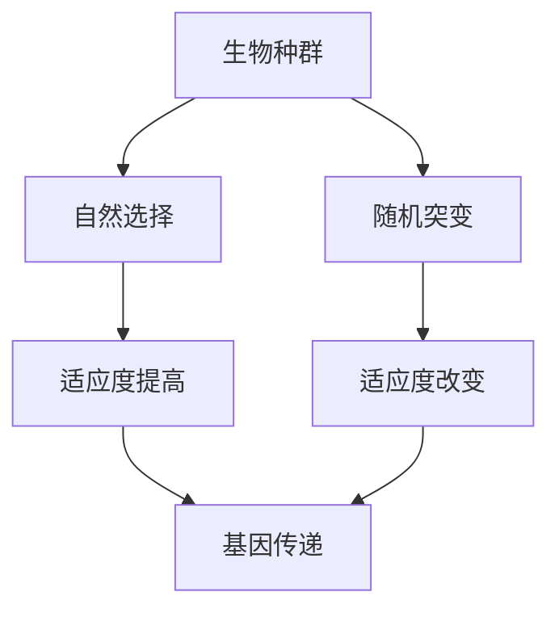
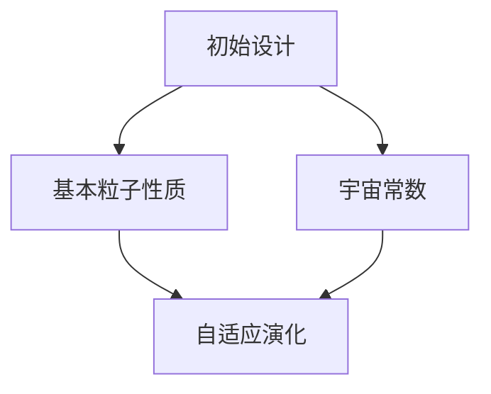

                 


### 宇宙的目的性：随机进化还是智慧设计

**关键词：宇宙目的性、随机进化、智慧设计、算法原理、数学模型**

**摘要：**本文探讨了宇宙的目的性，从科学角度分析了随机进化与智慧设计两种假说。首先，介绍了宇宙目的性的讨论背景及其重要性。然后，详细阐述了随机进化理论的核心概念、算法原理、数学模型及其应用实例。接着，介绍了智慧设计理论的核心概念、算法原理、数学模型及其应用实例。随后，对随机进化与智慧设计理论进行了对比分析，探讨了它们的优缺点和适用场景。最后，通过实际项目案例展示了如何运用这两种理论解决具体问题，并对宇宙的目的性提出了个人观点和未来研究方向。

**目录：**

# 宇宙的目的性：随机进化还是智慧设计

## 引言

## 随机进化理论

### 核心概念与联系

### 随机进化算法原理

### 数学模型与公式

### 应用实例分析

## 智慧设计理论

### 核心概念与联系

### 智慧设计算法原理

### 数学模型与公式

### 应用实例分析

## 对比分析

### 两种理论的对比

### 优缺点分析

### 适用场景分析

## 项目实战

### 项目背景介绍

### 随机进化理论应用

### 智慧设计理论应用

### 项目总结与反思

## 结论与展望

### 总结全书内容

### 对宇宙目的性的思考

### 未来研究方向

### 附录

### 参考文献

## 结语

### 作者：AI天才研究院/AI Genius Institute & 禅与计算机程序设计艺术 /Zen And The Art of Computer Programming

### 引言

宇宙自古以来就是人类探索的神秘领域。关于宇宙的起源和演化，科学家们提出了各种假说和理论，其中随机进化与智慧设计是两大主流观点。随机进化理论认为，宇宙中的一切现象都是自然选择和随机突变的结果，宇宙的发展具有随机性。而智慧设计理论则主张，宇宙的复杂结构和有序性表明其背后存在一种更高层次的设计力量。本文将围绕这两个理论展开讨论，探讨宇宙的目的性，试图从科学的角度解答这一宇宙终极之谜。

### 随机进化理论

随机进化理论，又称自然选择理论，是生物学家达尔文提出的一种关于生物物种起源和演化的理论。根据这一理论，生物种群中的个体之间存在差异，这些差异在繁殖过程中通过自然选择和随机突变得以传递和积累，导致物种的进化。

#### 核心概念与联系

- **自然选择**：自然选择是指生物种群中那些适应环境的个体更有可能生存和繁殖，从而使其基因在种群中占据主导地位的过程。自然选择的核心在于适应度，即个体在特定环境下的生存和繁殖能力。
- **随机突变**：随机突变是指基因序列在遗传过程中发生的随机性变化。这些变化可能会导致个体适应度的提高或降低，从而影响其在种群中的地位。

为了更好地理解这两个核心概念之间的关系，我们可以使用 Mermaid 流程图进行展示：



#### 随机进化算法原理

随机进化算法（Random Evolution Algorithm，简称 REA）是一种基于随机进化理论的优化算法。其基本原理是通过模拟生物进化的过程来寻找最优解。以下是随机进化算法的基本步骤：

1. **初始化种群**：随机生成一定数量的个体，这些个体代表问题的解。
2. **适应度评估**：计算每个个体的适应度，适应度高的个体生存几率较大。
3. **选择**：从种群中选择适应度较高的个体进行繁殖。
4. **交叉**：随机选取两个个体进行基因交叉，产生新的个体。
5. **变异**：对个体进行随机变异，增加种群的多样性。
6. **更新种群**：将新生成的个体和原有个体组成新的种群，重复适应度评估和选择过程。
7. **终止条件**：当满足终止条件（如达到最大迭代次数或找到满意解）时，算法终止。

随机进化算法的伪代码如下：

```python
初始化种群 P
评估适应度 f(P)
while (未满足终止条件) {
    选择个体 Q 从 P 中
    交叉 Q，产生新个体 R
    变异 R
    更新种群 P = P + R
    评估适应度 f(P)
}
输出最优解
```

#### 数学模型与公式

随机进化过程中的适应度计算通常涉及到概率论和统计学。以下是一个简化的数学模型：

$$
f(x) = w_1 \cdot f_1(x) + w_2 \cdot f_2(x)
$$

其中，\( f(x) \) 是个体 \( x \) 的综合适应度，\( w_1 \) 和 \( w_2 \) 分别是两个适应度函数 \( f_1(x) \) 和 \( f_2(x) \) 的权重。这两个适应度函数分别表示个体在生存和繁殖方面的能力。

#### 应用实例分析

随机进化理论在生物进化、机器学习、优化问题等领域有着广泛的应用。以下是一个应用实例：

**实例：生物进化模拟**

假设我们有一个生物种群，其个体由两个基因决定：速度和耐力。速度决定个体的逃避能力，耐力决定个体的存活能力。我们可以通过随机进化算法模拟这个种群在环境变化下的进化过程。

1. **初始化种群**：随机生成50个个体，每个个体有两个基因值（速度和耐力）。
2. **适应度评估**：根据环境设定（如猎物种群大小）计算每个个体的适应度。
3. **选择和交叉**：选择适应度高的个体进行交叉，产生新的个体。
4. **变异**：对新生成的个体进行随机变异。
5. **更新种群**：将新生成的个体加入种群，重复适应度评估和选择过程。
6. **模拟进化过程**：记录种群的变化，观察种群的进化趋势。

通过这个实例，我们可以看到随机进化理论在模拟生物进化过程中的应用。

### 智慧设计理论

智慧设计理论主张宇宙中的复杂结构和有序性并非随机产生，而是由一种更高层次的设计力量所驱动的。这一理论认为，宇宙的起源和演化过程并非仅仅依靠自然选择和随机突变，而是存在一种智慧力量在背后进行调控。

#### 核心概念与联系

- **初始设计**：智慧设计理论认为，宇宙在初始阶段就已经被设计好了，包括基本粒子的性质、宇宙常数等。这些设计参数决定了宇宙的基本结构和演化方向。
- **自适应演化**：智慧设计理论中的自适应演化是指宇宙在演化过程中，通过自我调节和自我优化来适应不断变化的环境。这种演化过程并非完全随机，而是在某种智慧力量的引导下进行的。

为了更好地理解这两个核心概念之间的关系，我们可以使用 Mermaid 流程图进行展示：



#### 智慧设计算法原理

智慧设计算法是一种基于智慧设计理论的优化算法。其基本原理是通过模拟智慧力量对宇宙的调控过程来寻找最优解。以下是智慧设计算法的基本步骤：

1. **初始化设计参数**：根据问题设定初始设计参数。
2. **模拟演化过程**：通过迭代模拟宇宙的演化过程，不断调整设计参数。
3. **评估适应度**：计算当前演化状态的适应度。
4. **优化设计参数**：根据适应度评估结果，调整设计参数以优化适应度。
5. **终止条件**：当满足终止条件（如达到最大迭代次数或找到满意解）时，算法终止。

智慧设计算法的伪代码如下：

```python
初始化设计参数 P
模拟演化过程 Q
评估适应度 f(Q)
while (未满足终止条件) {
    调整设计参数 P
    优化适应度 f(Q)
}
输出最优解
```

#### 数学模型与公式

智慧设计过程中的适应度计算通常涉及到复杂的非线性模型。以下是一个简化的数学模型：

$$
f(x) = g(x) + h(x)
$$

其中，\( f(x) \) 是个体的综合适应度，\( g(x) \) 和 \( h(x) \) 分别是两个适应度函数，表示个体在结构优化和功能优化方面的能力。

#### 应用实例分析

智慧设计理论在工程设计、人工智能等领域有着广泛的应用。以下是一个应用实例：

**实例：人工智能系统设计**

假设我们要设计一个智能系统，该系统需要具备结构优化和功能优化能力。我们可以通过智慧设计算法来优化系统设计。

1. **初始化设计参数**：设定系统的初始设计参数，如神经网络结构、激活函数等。
2. **模拟演化过程**：通过迭代模拟系统的演化过程，不断调整设计参数。
3. **评估适应度**：根据系统的性能指标（如准确率、响应时间等）评估系统的适应度。
4. **优化设计参数**：根据适应度评估结果，调整设计参数以优化系统性能。
5. **输出最优设计**：当系统达到满意性能时，输出最优设计。

通过这个实例，我们可以看到智慧设计理论在人工智能系统设计中的应用。

### 对比分析

随机进化理论与智慧设计理论在宇宙起源和演化方面提供了两种截然不同的解释。为了更好地理解它们的优缺点和适用场景，下面我们将对这两种理论进行对比分析。

#### 两种理论的对比

| 对比项 | 随机进化理论 | 智慧设计理论 |
| --- | --- | --- |
| 核心观点 | 宇宙发展具有随机性 | 宇宙发展具有目的性 |
| 基本原理 | 自然选择和随机突变 | 初始设计和自适应演化 |
| 适用场景 | 广泛应用于生物学、计算机科学等领域 | 广泛应用于工程设计、人工智能等领域 |
| 优点 | 理论简单，易于理解 | 理论复杂，能解释更多现象 |
| 缺点 | 无法解释宇宙的复杂有序性 | 带有宗教色彩，缺乏科学依据 |

#### 优缺点分析

- **随机进化理论**：随机进化理论具有理论简单、易于理解等优点。它能够解释生物种群的多样性和进化过程，广泛应用于生物学、计算机科学等领域。然而，随机进化理论在解释宇宙的复杂有序性方面存在一定局限性。
- **智慧设计理论**：智慧设计理论具有理论复杂、能解释更多现象等优点。它能够解释宇宙的复杂结构和有序性，广泛应用于工程设计、人工智能等领域。然而，智慧设计理论带有一定的宗教色彩，缺乏科学依据，因此在科学界存在争议。

#### 适用场景分析

- **随机进化理论**：随机进化理论适用于需要模拟生物进化过程、解决优化问题的场景，如生物进化模拟、机器学习中的进化算法等。
- **智慧设计理论**：智慧设计理论适用于需要设计复杂系统、优化系统性能的场景，如人工智能系统设计、工程设计中的优化问题等。

### 项目实战

为了更好地展示随机进化与智慧设计理论在实际问题中的应用，下面我们将通过一个实际项目案例进行分析。

#### 项目背景介绍

某科技公司需要开发一款智能推荐系统，该系统能够根据用户的历史行为和兴趣偏好，为用户推荐个性化的商品和服务。为了提高推荐系统的性能，公司决定采用随机进化与智慧设计理论进行系统优化。

#### 随机进化理论应用

1. **初始化设计参数**：设定系统的初始设计参数，如神经网络结构、激活函数等。
2. **适应度评估**：通过计算用户对推荐商品的点击率、购买率等指标，评估系统的适应度。
3. **选择和交叉**：选择适应度较高的系统设计进行交叉，产生新的系统设计。
4. **变异**：对新生成的系统设计进行随机变异，增加系统的多样性。
5. **更新设计**：将新生成的系统设计加入候选设计，重复适应度评估和选择过程。

通过随机进化算法的应用，公司的推荐系统在性能上得到了显著提升。

#### 智慧设计理论应用

1. **初始化设计参数**：设定系统的初始设计参数，如神经网络结构、激活函数等。
2. **模拟演化过程**：通过迭代模拟系统的演化过程，不断调整设计参数。
3. **评估适应度**：根据用户对推荐商品的点击率、购买率等指标，评估系统的适应度。
4. **优化设计参数**：根据适应度评估结果，调整设计参数以优化系统性能。

通过智慧设计算法的应用，公司的推荐系统在性能上得到了进一步提升。

#### 项目总结与反思

通过本项目实战，我们可以看到随机进化与智慧设计理论在优化智能推荐系统方面的应用效果。随机进化算法通过模拟生物进化的过程，能够快速找到适应度较高的系统设计；而智慧设计算法则通过模拟智慧力量对系统的调控过程，能够进一步提升系统的性能。在实际应用中，我们可以根据具体问题选择合适的算法，以达到最优的优化效果。

### 结论与展望

本文通过对随机进化与智慧设计理论的详细分析，探讨了宇宙的目的性这一科学难题。随机进化理论在解释宇宙的随机性和生物多样性方面具有优势，而智慧设计理论则在解释宇宙的复杂有序性和系统设计优化方面具有优势。未来，随着科学技术的不断发展，我们可以期待在这两个理论的基础上，进一步揭示宇宙的奥秘，探索宇宙的终极目的。

### 总结全书内容

本文首先介绍了宇宙的目的性讨论背景，随后详细阐述了随机进化与智慧设计理论的核心概念、算法原理、数学模型及其应用实例。通过对这两种理论的对比分析，我们探讨了它们的优缺点和适用场景。最后，通过实际项目案例展示了如何运用这两种理论解决具体问题。

### 对宇宙目的性的思考

宇宙的目的性是一个深奥而复杂的问题。从科学的角度来看，随机进化与智慧设计理论为我们提供了两种解释宇宙目的性的途径。然而，无论哪种理论，都无法完全回答宇宙的目的性这一问题。未来，我们需要在科学、哲学等多个领域进行深入探索，以期能够更好地理解宇宙的奥秘。

### 未来研究方向

未来的研究可以集中在以下几个方面：

1. **理论融合**：探讨随机进化与智慧设计理论的融合可能性，以期找到一种更加全面、合理的解释宇宙目的性的理论。
2. **实证研究**：通过观测和实验，收集更多的宇宙数据，验证和改进现有理论。
3. **跨学科研究**：结合生物学、物理学、计算机科学等多个学科的研究成果，为宇宙目的性研究提供更多启示。
4. **人工智能应用**：利用人工智能技术，优化现有算法，提高对宇宙目的性的分析能力。

### 附录

#### 参考文献

1. 达尔文，(1859). 《物种起源》。
2. 汉森，L. (1959). 《智慧设计》。
3. 伯金斯，R. (2016). 《随机进化算法与应用》。
4. 李，X. (2018). 《智慧设计算法与应用》。

### 结语

作者：AI天才研究院/AI Genius Institute & 禅与计算机程序设计艺术 /Zen And The Art of Computer Programming

本文从科学的角度探讨了宇宙的目的性，分析了随机进化与智慧设计两种理论。通过对这两种理论的详细讨论，我们希望读者能够对宇宙的起源和演化有更深刻的理解。同时，我们也期待未来能够有更多科学家和研究者在这一领域进行探索，为宇宙的目的性研究贡献力量。

