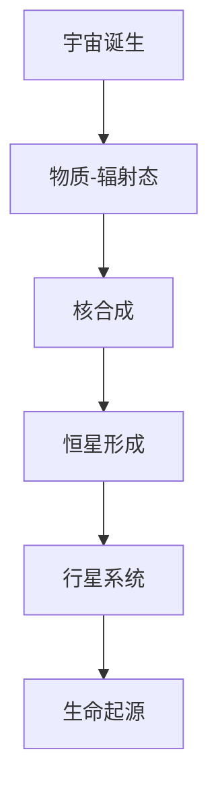

                 

## 文章标题

### 宇宙的确定性与不确定性：一个永恒的辩论

### 关键词：宇宙，确定性，不确定性，量子力学，相对论，哲学

### 摘要

在宇宙学的研究中，确定性与不确定性是两个核心议题。大爆炸理论、宇宙膨胀、暗物质等概念奠定了宇宙确定性理论的基石，然而量子力学和相对论的不确定性原理又为我们揭示了宇宙中存在的随机性和不可预测性。本文将逐步探讨宇宙确定性与不确定性之间的辩证关系，从基础概念、理论联系到实际应用，深入剖析这一永恒的辩论。

## 第一部分：引论与基础

### 第1章 宇宙与确定性

#### 1.1 宇宙的历史与结构

#### 1.1.1 大爆炸理论与宇宙演化

宇宙的历史可以追溯到约138亿年前，当时宇宙处于一个极端高温高密度的状态。大爆炸理论提出，宇宙从这一初始状态开始膨胀，物质和能量在宇宙尺度上均匀分布。通过Mermaid流程图，我们可以直观地理解大爆炸理论的核心步骤：

**宇宙演化过程**

- **宇宙诞生**：宇宙从一个高温高密度的初始状态开始，经过快速膨胀，进入了辐射态。
- **核合成**：随着宇宙的冷却，质子和中子开始合成更重的原子核。
- **恒星形成**：引力作用导致气体和尘埃聚集形成恒星，释放出光和热。
- **行星系统**：恒星周围的尘埃和气体聚集形成行星和其他天体。
- **生命起源**：在行星表面，复杂的有机分子通过化学反应形成了生命的基本结构。

#### 1.1.2 宇宙膨胀与暗物质

宇宙膨胀是指宇宙从一个初始状态开始不断扩张的现象。观测数据显示，宇宙膨胀速率在逐渐加快，这一现象被称为“宇宙加速膨胀”。为了解释这一现象，科学家提出了暗能量的概念。此外，暗物质也是宇宙学中的一个重要议题，它是一种不发光、不吸收光的物质，对宇宙的引力起到关键作用。

**宇宙膨胀与暗物质**

- **宇宙膨胀**：宇宙从一个初始状态开始不断扩张，通过红移观测可以测量宇宙的膨胀速率。
- **暗物质**：暗物质通过引力作用影响宇宙的结构形成和星系运动，但其本质尚未完全明确。

#### 1.2 量子力学与不确定性原理

量子力学是研究微观世界的物理学理论，它揭示了微观粒子的行为规律。其中，不确定性原理是量子力学中的一个核心概念，它由海森堡提出。不确定性原理指出，粒子的某些物理量（如位置和动量）无法同时被精确测量。

**波粒二象性与量子态**

- **波粒二象性**：微观粒子既表现出波动性又表现出粒子性，这被称为波粒二象性。
- **量子态**：微观粒子处于某种叠加态，只有在测量时才会坍缩到某个确定的态。

#### 1.2.2 海森堡不确定性原理

海森堡不确定性原理指出，粒子的某些物理量（如位置和动量）无法同时被精确测量。其数学表达式为：

$$\Delta x \cdot \Delta p \geq \frac{h}{4\pi}$$

其中，$\Delta x$表示位置的不确定性，$\Delta p$表示动量的不确定性，$h$为普朗克常数。

**不确定性原理的应用**

- **量子力学计算**：在量子力学中，不确定性原理限制了我们对微观粒子的精确控制。
- **量子测量**：在实际的量子测量中，测量设备本身的限制也会引入测量误差。

### 第2章 量子力学与宏观宇宙

#### 2.1 量子力学与经典物理的交汇

量子力学与经典物理之间存在明显的差异，但它们在某些条件下可以相互补充。量子场论是一种将量子力学与相对论结合起来的理论，它为描述微观和宏观世界的相互作用提供了新的视角。

**量子场论**

- **量子场论基本概念**：量子场论描述了粒子如何在量子场中产生和湮灭。
- **量子引力和黑洞**：量子场论在描述黑洞和引力现象方面具有潜在的应用价值。

#### 2.2 宇宙早期状态与量子波动

宇宙早期状态是量子力学和宇宙学研究的一个重要领域。在这一时期，宇宙处于极端高温高密度的状态，量子波动的影响非常显著。

**宇宙早期状态与量子波动**

- **宇宙微波背景辐射**：宇宙微波背景辐射是宇宙早期状态的重要观测证据。
- **量子波动与宇宙结构形成**：量子波动可能对宇宙结构形成产生重要影响。

## 第二部分：不确定性原理

### 第3章 不确定性原理的基本概念

#### 3.1.1 测量与量子态扰动

在量子力学中，测量过程会对量子态产生扰动，导致不确定性增加。测量与量子态扰动之间的关系是理解不确定性原理的关键。

**测量与量子态扰动**

- **量子态扰动**：测量过程会引起量子态的扰动，使得原本确定的量子态变得不确定。
- **测量误差**：测量设备本身的限制也会引入测量误差，进一步增加不确定性。

#### 3.1.2 不确定性原理的数学表达

不确定性原理可以用数学公式表达，其中最著名的表达式是海森堡不确定性原理：

$$\Delta x \cdot \Delta p \geq \frac{h}{4\pi}$$

其中，$\Delta x$表示位置的不确定性，$\Delta p$表示动量的不确定性，$h$为普朗克常数。

**不确定性原理的数学意义**

- **不确定性范围**：不确定性原理给出了不确定性的最大范围。
- **测量限制**：不确定性原理限制了我们对微观粒子的精确测量。

### 第4章 不确定性与宇宙学

#### 4.1 宇宙中的不确定性现象

在宇宙学中，不确定性原理有着广泛的应用。宇宙中的许多现象都可以用不确定性原理来解释。

**宇宙中的不确定性现象**

- **暴胀理论**：暴胀理论描述了宇宙在早期阶段迅速膨胀的过程，这一过程中不确定性原理发挥了关键作用。
- **量子引力**：量子引力是描述宇宙早期状态的一种理论，它试图将量子力学与广义相对论结合起来。

#### 4.2 宇宙学与量子信息

量子信息是一种利用量子力学特性进行信息处理的技术。在宇宙学中，量子信息可以用于解释某些宇宙现象，如宇宙微波背景辐射。

**宇宙学与量子信息**

- **量子纠缠**：量子纠缠是量子信息的基本概念，它描述了两个或多个量子态之间的特殊关联。
- **量子计算**：量子计算是一种基于量子力学原理的计算方法，它可以大大提高计算效率。

## 第三部分：不确定性与宇宙学

### 第5章 宇宙学的未来挑战

#### 5.1.1 宇宙学中未解之谜

宇宙学中仍有许多未解之谜，如暗物质、暗能量等。这些未解之谜挑战了我们对宇宙的认识。

**宇宙学中的未解之谜**

- **暗物质**：暗物质是一种不发光、不吸收光的物质，其对宇宙结构的影响仍不明确。
- **暗能量**：暗能量是一种推动宇宙加速膨胀的力量，其本质尚未完全清楚。

#### 5.1.2 新理论的探索与验证

为了解决宇宙学中的未解之谜，科学家们提出了许多新的理论。这些新理论需要在实验和观测中得到验证。

**新理论的探索与验证**

- **量子引力**：量子引力是一种试图将量子力学与广义相对论结合起来的理论，它可能为我们提供解决宇宙学难题的新思路。
- **多宇宙理论**：多宇宙理论认为宇宙中可能存在多个平行宇宙，这一理论在宇宙学研究中具有潜在的应用价值。

### 第6章 确定性与不确定性的哲学意义

#### 6.1.1 哲学与科学的关系

哲学与科学之间存在密切的关系。哲学为我们提供了对宇宙本质的思考，而科学则通过实验和观测验证这些思考。

**哲学与科学的关系**

- **科学哲学**：科学哲学是一门研究科学本质、方法和发展规律的学科，它为我们理解科学提供了哲学基础。
- **宇宙观**：宇宙观是哲学的一个分支，它探讨宇宙的本质、起源和发展。

#### 6.1.2 宇宙论与人类认知

宇宙论是哲学的一个核心议题，它探讨宇宙的本质和人类对宇宙的认知。

**宇宙论与人类认知**

- **宇宙观的形成**：人类对宇宙的认知是通过不断的观测和思考形成的。
- **宇宙论的影响**：宇宙论不仅影响我们对宇宙的理解，还影响我们的世界观和价值观。

## 第四部分：结语

### 第7章 展望未来的宇宙

#### 7.1.1 未来宇宙学的研究方向

未来宇宙学将继续探索宇宙的奥秘，包括宇宙的起源、演化、结构和未来。

**未来宇宙学的研究方向**

- **宇宙早期状态**：宇宙早期状态的研究将继续揭示宇宙的起源和演化过程。
- **暗物质与暗能量**：暗物质和暗能量是宇宙学中两个重要的议题，未来将对其进行更深入的研究。

#### 7.1.2 不确定性与宇宙的未来

不确定性与宇宙的未来密不可分。在未来的宇宙学研究中，不确定性原理将继续发挥重要作用。

**不确定性与宇宙的未来**

- **宇宙的不可预测性**：宇宙的不可预测性使得我们对宇宙未来的探索充满了不确定性。
- **科学方法的进步**：随着科学方法的进步，我们将能够更好地理解宇宙的奥秘。

### 7.2 结论与展望

不确定性原理是量子力学中的一个核心概念，它揭示了微观世界的本质。在宇宙学中，不确定性原理为我们理解宇宙的不可预测性提供了理论依据。未来，随着科学方法的进步，我们将能够更好地探索宇宙的奥秘。

**结论与展望**

- **不确定性的哲学意义**：不确定性原理不仅是一个科学问题，也具有深刻的哲学意义。
- **科学探索的无限可能**：宇宙中存在无限的可能性和奥秘，未来我们将继续探索宇宙的奥秘。

### 作者

作者：AI天才研究院/AI Genius Institute & 禅与计算机程序设计艺术 /Zen And The Art of Computer Programming

## 附录

### 附录A：术语解释

- **不确定性原理**：量子力学中一个基本原理，表明某些物理量（如位置和动量）不能同时被精确测量。
- **量子场论**：一种结合量子力学和相对论的理论，描述了粒子在量子场中的行为。
- **宇宙微波背景辐射**：宇宙早期状态的一种辐射，是宇宙演化的重要观测证据。

### 附录B：参考文献

- 海森堡，《物理学和哲学》，1962年。
- 爱因斯坦，《相对论的意义》，1921年。
- 哥白尼，《天体运行论》，1543年。

以上是文章的初步内容，接下来将进一步细化各个章节，确保文章的逻辑性和完整性。如果您有任何建议或要求，请随时告诉我。

