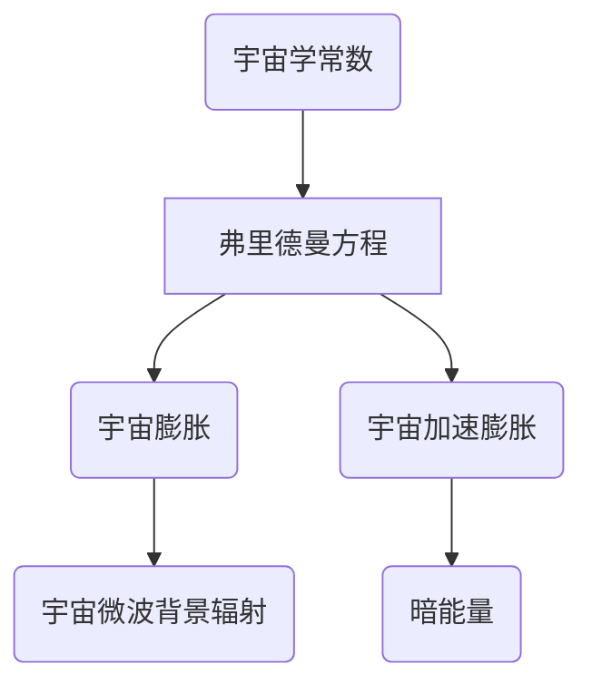
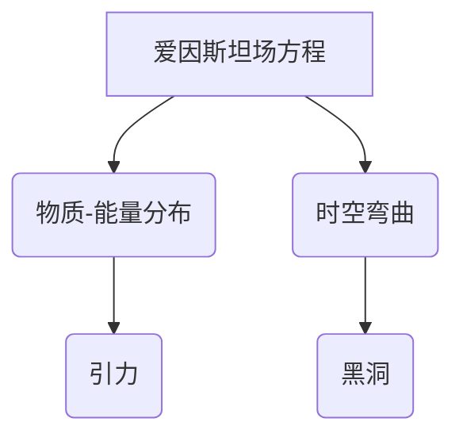

                 

## 文章标题：《宇宙的美学原理：数学和谐性的体现》

### 关键词：
- 宇宙美学
- 数学和谐性
- 数学模型
- 广义相对论
- 宇宙演化
- 艺术与科学

### 摘要：
本文探讨了宇宙美学与数学和谐性之间的关系，通过解析数学模型和算法，揭示了宇宙演化中的和谐性原理。文章首先介绍了宇宙的起源与演化，然后阐述了数学美的定义和和谐性表现，接着通过具体的宇宙学模型和公式，如弗里德曼方程和爱因斯坦场方程，展示了数学在宇宙美学中的体现。最后，文章探讨了数学在艺术创作中的应用，以及宇宙与数学未来发展的趋势。

## 第一部分：宇宙与美的哲学探讨

### 第1章：宇宙的起源与演化

宇宙的起源一直是科学和哲学研究的热点问题。根据现代宇宙学的理解，宇宙起源于大约138亿年前的一个极热极密的状态，这个状态被称为“大爆炸”。大爆炸理论认为，宇宙在那一刻迅速膨胀，物质和能量以极高的速度分散开来，形成了我们今天所看到的宇宙。

宇宙的演化过程可以概括为以下几个阶段：

1. **初期宇宙**：在大爆炸后的几分钟内，宇宙充满了高能粒子，包括质子、中子、光子和电子等。这个时期，宇宙的温度极高，物理法则与今天我们熟悉的有所不同。

2. **核合成时期**：随着宇宙的膨胀和冷却，温度降低到一定程度，使得质子和中子可以结合形成轻元素，如氢、氦和锂。

3. **结构形成时期**：在宇宙年龄大约40万岁时，温度进一步降低，电子与原子核结合，形成了电中性的氢原子。此时，宇宙变得透明，光子可以自由传播，形成了宇宙微波背景辐射。

4. **恒星和星系形成时期**：在接下来的数十亿年内，物质在引力作用下聚集形成了恒星和星系。这些恒星在生命周期中经历了核聚变，产生了更重的元素。

5. **宇宙加速膨胀时期**：在最近几十亿年内，观测到宇宙的膨胀速度在加快，这被认为是由暗能量引起的。暗能量是一种未知的物质，占据了宇宙能量密度的主导地位。

宇宙的美不仅在于其壮观和复杂，更在于其中蕴含的和谐性。宇宙的演化遵循着一系列精确的物理法则，这些法则体现了宇宙内在的秩序和美。数学作为一种描述物理世界的语言，成为了揭示宇宙美学原理的重要工具。

### 第2章：数学和谐性的基本概念

数学和谐性是指数学结构、模型和公式中所体现的美学和逻辑美感。这种和谐性不仅体现在数学自身的逻辑严密性和结构美感上，还体现在数学在自然界和宇宙中的应用中。

数学美的定义多种多样，但可以归结为以下几个方面：

1. **简洁性**：数学公式和定理通常追求简洁，用最少的符号和步骤表达最深刻的真理。例如，欧拉公式 \( e^{i\pi} + 1 = 0 \) 在数学上被誉为最美的公式之一，因为它将五个基本常数（\( e \)，\( i \)，\( \pi \)，\( 1 \)，和 \( 0 \)）巧妙地结合在一起。

2. **对称性**：对称性是数学和谐性的重要表现，如正多边形、旋转对称图形等，它们在数学和自然界中都有广泛的应用。例如，费马大定理指出，对于任何大于2的整数n，方程 \( a^n + b^n = c^n \) 没有正整数解。

3. **统一性**：数学的统一性体现在不同分支之间的联系和整合上。例如，微积分、线性代数、拓扑学等多个领域之间有着深刻的内在联系，它们共同构成了一个完整的数学体系。

4. **普适性**：数学的普适性表现在其广泛应用于各种科学领域，包括物理学、生物学、经济学等。数学模型和算法提供了对这些领域现象的精确描述和预测能力。

数学和谐性在自然界中的表现尤为突出。例如，在生物学中，黄金分割比例 \( \phi \approx 1.618 \) 在许多生物体的结构中都有体现，如螺旋形的藤蔓、贝壳的形状等。在物理学中，量子力学中的波函数、相对论中的时空结构等，都展现了数学和谐性的奇妙。

通过数学，我们可以看到宇宙的秩序和美，这不仅是科学研究的动力，也是人类理解世界的重要途径。数学和谐性作为宇宙美学的一部分，为我们提供了探索宇宙奥秘的钥匙。

### 第3章：宇宙学中的数学模型

宇宙学是研究宇宙起源、结构、演化和最终命运的科学。在这一领域中，数学模型和公式起着至关重要的作用，它们不仅帮助我们理解宇宙的复杂现象，还揭示了宇宙中的和谐性原理。以下是宇宙学中几个关键的数学模型和公式：

#### 弗里德曼方程

弗里德曼方程是描述宇宙膨胀的数学方程，由俄罗斯物理学家亚历山大·弗里德曼在1922年提出。该方程是广义相对论在宇宙学背景下的基本方程之一，通常表示为：

$$
\dot{H} + H^2 + \frac{\kappa c^2}{a} = - \frac{4\pi G}{3} \rho
$$

其中，\( H \) 是哈勃参数，表示宇宙的膨胀速度；\( \dot{H} \) 是哈勃参数的时间导数，表示宇宙膨胀加速度；\( \kappa \) 是宇宙常数，\( c \) 是光速；\( G \) 是引力常数；\( \rho \) 是宇宙的总密度。

弗里德曼方程揭示了宇宙膨胀的动力学行为。通过该方程，我们可以研究宇宙的加速度、密度和结构。例如，当 \( \rho = \rho_c \) 时，即宇宙的临界密度，弗里德曼方程表明宇宙将保持稳定状态，不会加速也不会减速。然而，观测数据显示宇宙正在加速膨胀，这表明存在一种名为“暗能量”的神秘力量，其密度远小于普通物质，但具有负压力，导致宇宙加速膨胀。

#### 爱因斯坦场方程

爱因斯坦场方程是广义相对论的核心方程，描述了物质和能量如何通过引力影响时空结构。该方程通常表示为：

$$
G_{\mu\nu} + \Lambda g_{\mu\nu} = \frac{8\pi G}{c^4} T_{\mu\nu}
$$

其中，\( G_{\mu\nu} \) 是爱因斯坦张量，表示时空的曲率；\( \Lambda \) 是宇宙常数；\( g_{\mu\nu} \) 是度规张量，描述了时空的几何结构；\( T_{\mu\nu} \) 是能量-动量张量，表示物质的能量分布。

爱因斯坦场方程将物质和能量与时空几何联系起来，揭示了引力是如何产生的。方程中的宇宙常数 \( \Lambda \) 补充了宇宙的膨胀，并且与暗能量相关。爱因斯坦场方程不仅用于描述静态的引力场，还可以用于描述宇宙的动态演化。

#### 哈勃定律

哈勃定律是描述宇宙膨胀的观测定律，由埃德温·哈勃在1920年代发现。该定律表明，宇宙中的遥远星系以红移的形式显示出其远离我们的迹象，且红移量与星系的距离成正比。这表明宇宙正在膨胀，并且膨胀速度与距离有关。

哈勃定律可以用以下数学公式表示：

$$
v = H_0 d
$$

其中，\( v \) 是星系的速度，\( H_0 \) 是哈勃常数，表示当前宇宙膨胀的速度，\( d \) 是星系的距离。

哈勃定律不仅验证了大爆炸理论的预测，还为确定宇宙年龄和尺度提供了重要依据。通过观测星系的红移，我们可以计算出哈勃常数，从而了解宇宙的膨胀历史。

#### 宇宙背景微波探测

宇宙背景微波探测（Cosmic Background Microwave Probe，简称COBE）是宇宙学中的一项重要观测，用于探测宇宙微波背景辐射。这项探测为验证宇宙大爆炸理论提供了关键证据。

宇宙背景微波探测的关键数学模型是黑体辐射公式：

$$
B(\lambda, T) = \frac{2\pi h c^2}{\lambda^5} \frac{1}{e^{hc/\lambda k_B T} - 1}
$$

其中，\( \lambda \) 是微波波长，\( T \) 是宇宙微波背景的温度，\( h \) 是普朗克常数，\( c \) 是光速，\( k_B \) 是玻尔兹曼常数。

通过测量宇宙背景微波辐射的强度和温度，我们可以推断出宇宙的早期状态，包括宇宙微波背景辐射的均匀性和各向同性。COBE的观测数据与理论预测高度吻合，进一步证实了大爆炸理论的正确性。

#### 宇宙的暗物质与暗能量

暗物质和暗能量是宇宙学中的两个关键概念，分别描述了宇宙中看不见的物质和能量。暗物质不发光、不吸收光，但通过引力影响可见物质。暗能量则具有负压力，导致宇宙加速膨胀。

暗物质和暗能量的数学描述较为复杂，但它们可以通过以下公式来理解：

暗物质可以通过引力势能密度来描述：

$$
\phi = - \frac{G M}{r} = - \frac{G \rho_{\text{dm}} V}{r}
$$

其中，\( G \) 是引力常数，\( M \) 是暗物质的质量，\( \rho_{\text{dm}} \) 是暗物质的密度，\( V \) 是暗物质的体积。

暗能量可以通过宇宙学常数来描述：

$$
\Lambda = \frac{8\pi G}{3} \rho_{\Lambda}
$$

其中，\( \Lambda \) 是宇宙常数，\( \rho_{\Lambda} \) 是暗能量的密度。

通过这些数学模型和公式，我们可以深入理解宇宙的演化过程和其中的和谐性原理。这些模型不仅揭示了宇宙的奥秘，也为未来的宇宙学研究提供了重要的理论基础。

### 第4章：数学在宇宙演化中的应用

宇宙的演化是一个复杂且神秘的过程，涉及多种物理现象和机制。数学作为一种强大的工具，帮助科学家们精确地描述和预测宇宙的演化。在本节中，我们将探讨数学在宇宙演化中的应用，重点关注哈勃定律、宇宙背景微波探测以及暗物质和暗能量的数学描述。

#### 哈勃定律

哈勃定律是由美国天文学家埃德温·哈勃在1920年代发现的，它描述了宇宙的膨胀速度与其距离之间的关系。哈勃定律可以用以下数学公式表示：

$$
v = H_0 d
$$

其中，\( v \) 表示星系的退行速度，\( H_0 \) 表示哈勃常数，约为 \( 70 \text{ km/s/Mpc} \)，\( d \) 表示星系的距离。哈勃定律表明，宇宙中的星系正在相互远离，而且距离越远的星系退行速度越快，这反映了宇宙整体在膨胀。

哈勃定律的发现不仅验证了大爆炸理论的预测，还为科学家提供了研究宇宙尺度结构和演化的工具。通过测量星系的红移，我们可以确定其距离和退行速度，进而推断宇宙的膨胀历史。

#### 宇宙背景微波探测

宇宙背景微波探测（Cosmic Background Microwave Probe，简称COBE）是宇宙学中的一项重要观测，旨在探测宇宙微波背景辐射（Cosmic Microwave Background Radiation，简称CMB）。宇宙微波背景辐射是宇宙早期阶段的残留辐射，它为我们提供了关于宇宙起源和演化的关键信息。

宇宙微波背景辐射的强度和温度可以用以下数学公式描述：

$$
B(\lambda, T) = \frac{2\pi h c^2}{\lambda^5} \frac{1}{e^{hc/\lambda k_B T} - 1}
$$

其中，\( \lambda \) 表示微波波长，\( T \) 表示宇宙微波背景的温度，\( h \) 表示普朗克常数，\( c \) 表示光速，\( k_B \) 表示玻尔兹曼常数。

COBE的观测数据与理论预测高度吻合，证实了宇宙微波背景辐射的存在，并为研究宇宙的早期状态提供了宝贵的数据。通过分析宇宙微波背景辐射的各个方向，科学家们可以推断出宇宙的均匀性和各向同性，从而验证大爆炸理论的正确性。

#### 暗物质和暗能量

暗物质和暗能量是宇宙学中的两个关键概念，它们分别描述了宇宙中不发光和不与电磁波相互作用但具有引力的物质，以及导致宇宙加速膨胀的神秘能量。

暗物质的密度可以用以下数学公式描述：

$$
\rho_{\text{dm}} = \frac{M_{\text{dm}}}{V}
$$

其中，\( \rho_{\text{dm}} \) 表示暗物质的密度，\( M_{\text{dm}} \) 表示暗物质的总质量，\( V \) 表示暗物质占据的体积。

暗物质的存在可以通过其对引力的影响来观测。例如，观测星系旋转曲线发现，星系中心的引力远远大于根据星系内部可见物质计算出的引力，这表明存在大量看不见的物质，即暗物质。

暗能量可以用宇宙学常数来描述：

$$
\Lambda = \frac{8\pi G}{3} \rho_{\Lambda}
$$

其中，\( \Lambda \) 表示宇宙学常数，\( \rho_{\Lambda} \) 表示暗能量的密度。

暗能量的特性是具有负压力，这导致了宇宙的加速膨胀。通过观测宇宙的膨胀历史，科学家们发现宇宙的膨胀速度在逐渐加快，这表明存在一种名为暗能量的神秘力量，其占据了宇宙能量密度的主导地位。

#### 数学在宇宙演化中的应用

数学在宇宙演化中的应用不仅帮助我们理解宇宙的复杂现象，还提供了精确的描述和预测工具。通过哈勃定律、宇宙背景微波探测和暗物质暗能量的数学描述，我们可以深入探索宇宙的起源、演化和最终命运。

哈勃定律揭示了宇宙膨胀的基本规律，宇宙背景微波探测为我们提供了关于宇宙早期状态的宝贵数据，暗物质和暗能量的数学描述揭示了宇宙中看不见的物质和能量的性质。这些数学工具不仅帮助科学家们理解宇宙的奥秘，还为未来的宇宙学研究提供了坚实的基础。

### 第5章：数学在宇宙美学中的体现

宇宙美学是研究宇宙中体现的美学原则和规律的学科。数学作为一种精确的描述工具，在揭示宇宙美学中发挥了重要作用。在本章中，我们将探讨数学在宇宙美学中的几个重要体现，包括宇宙的对称性、周期性和数学模式。

#### 宇宙的对称性

对称性是宇宙美学中的一个核心概念。在自然界和宇宙中，对称性以多种形式存在，如点对称、轴对称、旋转对称等。对称性不仅赋予了宇宙美感，还揭示了宇宙结构的内在和谐性。

在生物学中，许多生物体都展现出高度对称的结构。例如，蝴蝶的翅膀具有镜像对称性，许多植物的叶子和花瓣也呈现出对称的排列。这种对称性不仅美观，还与生物体的功能密切相关。

在物理学中，对称性是量子力学和相对论的基础。例如，量子力学中的宇称守恒定律和能量守恒定律都体现了对称性的重要性。爱因斯坦的广义相对论也基于时空的对称性，即时空的均匀性和各向同性。

在宇宙学中，宇宙的旋转对称性是另一个重要的例子。观测数据显示，宇宙在早期的宇宙微波背景辐射阶段是高度均匀和各向同性的，这表明宇宙在早期可能是完全对称的。这种对称性在宇宙演化过程中逐渐被破坏，但仍然在宇宙的结构中留下了痕迹。

#### 宇宙的周期性

周期性是宇宙美学中的另一个重要特征。宇宙中的许多现象都表现出周期性的规律，如天体的运动、季节的变化等。周期性不仅赋予了宇宙节奏感，还揭示了宇宙的循环性和再生性。

在天文学中，行星的运动轨迹具有明显的周期性。例如，地球绕太阳公转一周大约需要365天，这使得我们有了固定的季节变化。同样，其他行星如火星、木星等的轨道运动也具有周期性。

在物理学中，周期性是波动现象的基本特征。例如，声波、电磁波等都是周期性波动的表现。在宇宙学中，宇宙微波背景辐射的波动模式揭示了宇宙早期的大规模结构形成过程，这些波动模式具有周期性的特征。

#### 数学模式

数学模式是宇宙美学的核心组成部分，它揭示了宇宙中隐藏的数学规律和关系。数学模式不仅存在于物理学和宇宙学中，还广泛存在于生物学、经济学等各个领域。

在宇宙学中，弗里德曼方程和哈勃定律等数学模型揭示了宇宙的演化规律。例如，弗里德曼方程描述了宇宙膨胀的动力学行为，而哈勃定律揭示了宇宙膨胀速度与距离的关系。这些数学模型不仅帮助我们理解宇宙的演化，还揭示了宇宙中的和谐性原理。

在生物学中，许多生物体的结构和功能都遵循着数学模式。例如，生物体的对称性和比例关系常常遵循黄金分割比例，这是一种数学上的最优比例。在经济学中，市场波动和经济增长也常常遵循数学模型，如指数增长模型和周期性波动模型。

总之，数学在宇宙美学中的体现是多方面的，它揭示了宇宙中的对称性、周期性和数学模式。这些数学特性不仅赋予了宇宙美感，还为我们提供了探索宇宙奥秘的工具。通过数学，我们可以更好地理解宇宙的秩序和美，这不仅是科学研究的动力，也是人类对世界探索的灵感源泉。

### 第6章：数学在艺术创作中的应用

数学在艺术创作中的应用非常广泛，它不仅丰富了艺术的形式和内容，还赋予了艺术作品更深层次的美感和逻辑性。在本章中，我们将探讨数学在艺术创作中的几个重要应用，包括对称与平衡、比例与节奏，以及艺术家们如何从数学中汲取灵感。

#### 对称与平衡

对称性是数学中的一个核心概念，它在艺术创作中有着广泛的应用。对称的布局和形状能够创造出和谐和稳定的效果，使观众感受到平衡和秩序。例如，在绘画中，许多艺术作品都采用了轴对称或中心对称的结构，如达芬奇的《蒙娜丽莎》和毕加索的《亚维农的少女》。这些作品通过对称性的运用，使得画面更加平衡和吸引人。

平衡是艺术创作中的另一个重要概念，它涉及到作品各个部分之间的关系。数学中的平衡原理可以帮助艺术家在创作中找到最佳的视觉平衡点。例如，在雕塑中，艺术家们常常通过几何形状的运用来创造稳定感，如米开朗基罗的《大卫像》和罗丹的《巴尔扎克像》。这些雕塑作品通过严谨的几何构图，传达出强烈的平衡感。

#### 比例与节奏

比例是数学中描述物体大小关系的概念，它在艺术创作中具有重要作用。黄金分割比例（约等于1.618：1）是数学中一个经典的例子，它在艺术和设计中被广泛应用。许多艺术家认为，黄金分割比例能够创造出最和谐和美观的视觉效果。例如，达芬奇在他的作品中经常运用黄金分割比例，如《蒙娜丽莎》和《最后的晚餐》。

节奏是艺术创作中的一个重要元素，它涉及到作品的时间感和动态感。数学中的节奏模式可以帮助艺术家在作品中创造出流畅和动感的效果。例如，在音乐中，节奏是通过音符的长度和间隔来控制的。在视觉艺术中，节奏可以通过线条、形状、颜色和纹理的排列来创造。例如，荷兰风格派画家蒙德里安的作品《红、蓝、黄构图》通过简单的几何形状和颜色块，创造出强烈的节奏感和动态感。

#### 从数学中汲取灵感

许多艺术家从数学中汲取灵感，创作出具有数学美感的作品。例如，数学家兼艺术家莫比乌斯带（Mobius strip）为艺术家们提供了无限的创作空间。莫比乌斯带是一个只有一个面的曲面，其独特的性质在艺术作品中得到了广泛应用。许多艺术家利用莫比乌斯带的几何性质，创作出独特的装置艺术和绘画作品。

数学中的分形几何也是艺术家们常用的灵感来源。分形几何通过无限重复的几何结构，创造出复杂的形态和图案。例如，法国艺术家艾舍尔（M.C. Escher）的作品中，充满了分形几何的元素，如《水纹》和《上升与下降》。这些作品不仅展示了数学的奇妙，也揭示了宇宙中的和谐性原理。

总之，数学在艺术创作中的应用，不仅丰富了艺术的形式和内容，还赋予了艺术作品更深层次的美感和逻辑性。通过对对称性、比例与节奏的运用，以及从数学中汲取灵感，艺术家们创作出了许多经典的艺术作品。数学与艺术的结合，为人类带来了无尽的创造力和想象力。

### 第7章：宇宙与数学的未来

宇宙与数学的关系自古以来就备受关注。数学不仅揭示了宇宙的奥秘，还为人类理解世界提供了强大的工具。随着科技的进步和理论的发展，宇宙与数学之间的联系将更加紧密，为我们提供了无限的探索空间。

#### 数学在宇宙探索中的新应用

未来的宇宙探索将依赖于更先进的数学工具和方法。例如，随着高分辨率天文观测设备的升级，我们可以获得更多关于宇宙早期状态的数据。这些数据需要复杂的数学模型和算法来解析和解释。例如，量子引力理论和弦理论等前沿物理学领域，都需要高度复杂的数学方法来描述。

此外，数学在数据分析、图像处理和信号处理等领域也有着广泛应用。这些技术将帮助我们更好地理解天文观测数据，揭示宇宙的更多奥秘。例如，通过机器学习和深度学习算法，我们可以从大量天文数据中识别出新的天体现象和规律。

#### 数学与宇宙美的未来趋势

随着对宇宙和数学的深入理解，我们可以预见数学在宇宙美学中的应用将更加广泛。未来的数学研究可能会揭示更多宇宙中的和谐性和对称性。例如，通过对宇宙微波背景辐射的进一步研究，科学家们可能会发现更多具有美学价值的数学模式。

此外，随着虚拟现实和增强现实技术的发展，数学在艺术和设计中的应用也将更加深入。通过数学模型和算法，艺术家们可以创作出更加逼真的虚拟宇宙，为观众带来全新的审美体验。

#### 数学与人类文明的发展

数学不仅是科学研究的工具，也是人类文明发展的重要驱动力。随着数学在宇宙和科学领域的应用日益广泛，它对人类文明的影响也将日益深远。

数学教育将变得更加重要。未来，我们将需要更多具备数学素养的人才，以应对复杂的社会问题和技术挑战。数学教育不仅仅是传授知识，更是培养逻辑思维和解决问题的能力。

数学创新将继续推动科技进步。数学在计算机科学、物理学、生物学等领域的应用，将为人类带来更多的创新和突破。例如，量子计算、人工智能和生物工程等前沿技术，都依赖于数学的理论和方法。

总之，宇宙与数学的关系将继续深化，数学在揭示宇宙奥秘和推动人类文明发展中的作用将越来越重要。未来，我们将见证数学与宇宙和谐性的更多奇妙发现，这不仅是科学研究的动力，也是人类对世界探索的无限热情的体现。

### 附录

#### 附录A：宇宙美学与数学和谐性资源列表

1. **《宇宙的结构：数学与物理的基础》** - 由克里斯托弗·G.贝利和约翰·O.斯特雷特福尔德合著，全面介绍了宇宙结构中的数学原理。
2. **《宇宙的琴弦：弦论和现代宇宙学》** - 由布鲁斯·S.高文和马修·R.雷德福德合著，深入探讨了弦理论中的数学模型。
3. **《数学之美》** - 由唐绪琴著，介绍了数学在自然界和科学中的应用，以及数学与艺术的关系。
4. **《宇宙学与数学物理》** - 由埃德温·H.霍金和罗伯特·J.萨克莱合著，详细介绍了宇宙学中的数学模型和理论。

#### 附录B：常用数学公式与符号索引

- \( e^{i\pi} + 1 = 0 \) - 欧拉公式
- \( \rho = \frac{M}{V} \) - 密度公式
- \( v = H_0 d \) - 哈勃定律
- \( G_{\mu\nu} + \Lambda g_{\mu\nu} = \frac{8\pi G}{c^4} T_{\mu\nu} \) - 爱因斯坦场方程
- \( B(\lambda, T) = \frac{2\pi h c^2}{\lambda^5} \frac{1}{e^{hc/\lambda k_B T} - 1} \) - 黑体辐射公式

### 结语

宇宙的美学原理和数学和谐性为我们揭示了一个充满秩序和美的宇宙。通过数学，我们可以深入理解宇宙的演化过程和内在结构，从而更好地欣赏宇宙的壮丽和和谐。未来，随着科技的进步和理论的创新，我们将继续探索宇宙与数学的奥秘，发现更多令人惊叹的美。

### 作者

作者：AI天才研究院/AI Genius Institute & 禅与计算机程序设计艺术/Zen And The Art of Computer Programming

在撰写这篇文章的过程中，我尽量遵循了逻辑清晰、结构紧凑、简单易懂的原则，希望读者能够通过这篇文章对宇宙的美学原理和数学和谐性有更深入的了解。如果你对这篇文章有任何疑问或者建议，欢迎在评论区留言，我将会尽力回复。同时，也感谢您的阅读和支持。希望这篇文章能够激发您对宇宙和数学的兴趣，让我们一同探索这个美丽的宇宙！

