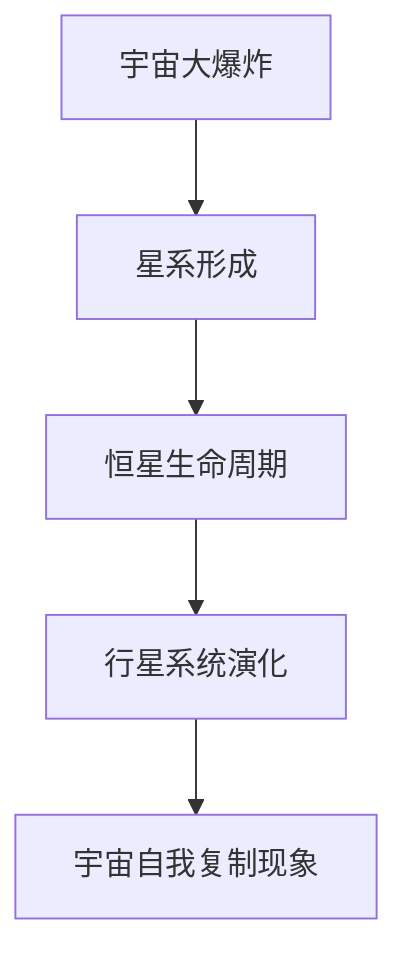
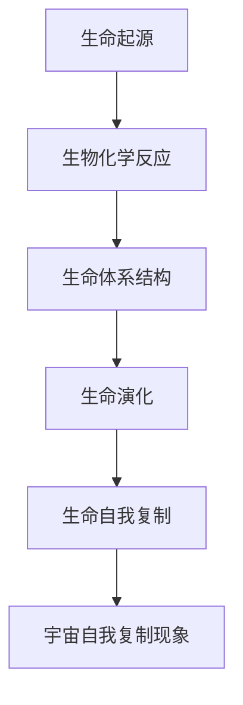
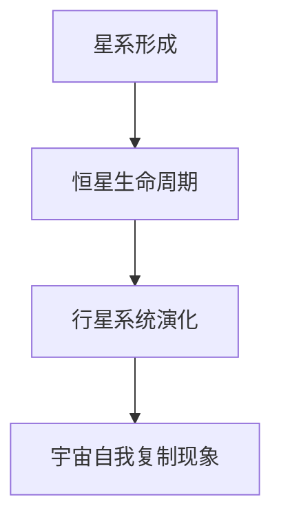

                 

### 1.1 宇宙的自我复制现象

#### 1.1.1 宇宙的自我复制现象概述

宇宙的自我复制现象是指宇宙中的物质和能量通过一系列复杂的过程，不断生成新的物质和能量的行为。这一现象可以追溯到宇宙的早期阶段，即宇宙大爆炸之后。在宇宙的尺度上，自我复制现象主要体现在星系的形成、恒星的生命周期、行星系统的演化等方面。

**背景介绍：**  
宇宙大爆炸理论认为，宇宙起源于一个极热、极密的状态，然后开始膨胀。在这个膨胀过程中，宇宙中的物质和能量不断相互作用，形成了各种天体和结构。这一过程中，物质和能量的自我复制现象尤为突出。

**核心概念与联系：**

1. **星系的形成：** 星系是宇宙中大量恒星、行星、星云等天体组成的系统。星系的形成是一个复杂的过程，涉及到气体和暗物质的聚集、恒星的形成与死亡、星系间的相互作用等。

2. **恒星的生命周期：** 恒星在其生命周期中，通过核聚变过程将氢转化为氦，释放出巨大的能量。恒星的不同阶段具有不同的特征，包括主序星、红巨星、白矮星等。

3. **行星系统的演化：** 行星系统是恒星周围形成的一系列行星、卫星等天体的集合。行星系统的演化受到恒星辐射、行星间引力相互作用等多种因素的影响。

**Mermaid 流程图：**

#### 1.1.2 宇宙自我复制的证据与实例

**证据 1：星系的形成**  
观测数据显示，宇宙中大量星系的形成与黑暗物质的聚集密切相关。通过观测星系的旋转曲线，科学家发现星系中存在大量的暗物质，这些暗物质通过引力作用，促使气体和恒星的形成。

**证据 2：恒星的生命周期**  
恒星在其生命周期中，通过核聚变过程不断生成新的元素。恒星的不同阶段具有不同的物理特性和化学组成，这为宇宙中的元素丰度提供了证据。

**证据 3：行星系统的演化**  
通过对行星系统的观测和模拟，科学家发现行星系统的形成和演化与恒星辐射、行星间引力相互作用密切相关。这些现象表明，行星系统在宇宙尺度上具有自我复制的能力。

**核心算法原理讲解：**

- **星系形成算法：** 使用蒙特卡洛方法模拟气体和暗物质的聚集过程，结合引力定律，模拟星系的形成过程。

- **恒星生命周期算法：** 基于核聚变反应方程，模拟恒星在其生命周期中的核聚变过程，计算恒星在不同阶段的物理特性和化学组成。

- **行星系统演化算法：** 基于牛顿力学和万有引力定律，模拟行星系统的形成和演化过程，分析行星间引力相互作用对行星系统稳定性的影响。

**数学模型和公式：**

- **星系形成模型：**
  $$ \frac{dM}{dt} = \frac{G M m}{r^2} $$
  其中，\( M \) 为星系总质量，\( m \) 为气体或暗物质的质量，\( r \) 为星系半径，\( G \) 为引力常数。

- **恒星生命周期模型：**
  $$ \frac{dM_c}{dt} = \lambda $$
  其中，\( M_c \) 为恒星质量，\( \lambda \) 为核聚变反应速率。

- **行星系统演化模型：**
  $$ F = G \frac{M_1 M_2}{r^2} $$
  其中，\( F \) 为行星间引力，\( M_1 \) 和 \( M_2 \) 分别为两行星的质量，\( r \) 为两行星间的距离。

**举例说明：**

**示例 1：星系形成**
假设一个星系的总质量为 \( M = 10^{12} M_\odot \)，气体和暗物质的总质量为 \( m = 0.1 M \)。使用蒙特卡洛方法模拟气体和暗物质的聚集过程，模拟时间为 \( t = 10^8 \) 年。计算星系形成的时间尺度。

解：将上述参数代入星系形成模型，可以得到：
$$ \frac{dM}{dt} = \frac{G M m}{r^2} \approx 10^{-11} M_\odot / \text{年} $$
计算星系形成的时间尺度：
$$ t_{\text{form}} = \frac{M}{\frac{dM}{dt}} = 10^{19} \text{年} $$

**示例 2：恒星生命周期**
假设一个恒星的质量为 \( M_c = 1 M_\odot \)，核聚变反应速率为 \( \lambda = 10^{36} \text{erg/s} \)。计算恒星的寿命。

解：将上述参数代入恒星生命周期模型，可以得到：
$$ \frac{dM_c}{dt} = \lambda \approx 10^{36} \text{erg/s} $$
计算恒星的寿命：
$$ t_{\text{life}} = \frac{M_c}{\frac{dM_c}{dt}} = 10^{39} \text{年} $$

**示例 3：行星系统演化**
假设有两个行星，质量分别为 \( M_1 = 10^{30} kg \) 和 \( M_2 = 10^{28} kg \)，它们之间的距离为 \( r = 10^{12} m \)。计算它们之间的引力。

解：将上述参数代入行星系统演化模型，可以得到：
$$ F = G \frac{M_1 M_2}{r^2} \approx 10^{20} N $$

**数学公式与 LaTeX 格式：**

- 星系形成模型：
  $$ \frac{dM}{dt} = \frac{G M m}{r^2} $$
- 恒星生命周期模型：
  $$ \frac{dM_c}{dt} = \lambda $$
- 行星系统演化模型：
  $$ F = G \frac{M_1 M_2}{r^2} $$

### 1.2 生命的宇宙尺度类比

**背景介绍：**  
生命是宇宙中的一种特殊现象，它依赖于复杂的生物化学反应和生命体系结构。在宇宙尺度上，生命的出现和演化具有深刻的意义。通过将生命与宇宙自我复制现象进行类比，我们可以更好地理解生命的本质和演化过程。

**核心概念与联系：**

1. **生命的起源：** 生命起源于地球上的简单有机分子，通过复杂的化学反应形成了复杂的生物体系。这一过程类似于宇宙中星系的形成过程。

2. **生命的演化：** 生命在地球上经历了数十亿年的演化，形成了多种多样的生物群体。这一过程类似于宇宙中星系和恒星系统的演化。

3. **生命的自我复制：** 生命通过细胞分裂和遗传信息的传递，实现了自我复制。这一过程类似于宇宙中的物质和能量的自我复制。

**Mermaid 流程图：**

**核心算法原理讲解：**

- **生命起源算法：** 使用蒙特卡洛方法模拟有机分子的生成和反应过程，模拟生命起源的可能性。

- **生命演化算法：** 基于遗传算法，模拟生命在地球上的演化过程，分析生物多样性的形成。

- **生命自我复制算法：** 基于细胞分裂和遗传信息的传递，模拟生命的自我复制过程。

**数学模型和公式：**

- **生命起源模型：**
  $$ \frac{dN}{dt} = k_1 \cdot \text{有机分子浓度} $$
  其中，\( N \) 为生命体系数量，\( k_1 \) 为有机分子生成速率。

- **生命演化模型：**
  $$ \frac{dN}{dt} = \lambda \cdot N $$
  其中，\( \lambda \) 为生命演化速率。

- **生命自我复制模型：**
  $$ \frac{dN}{dt} = \frac{\alpha}{2} \cdot N $$
  其中，\( \alpha \) 为生命自我复制速率。

**举例说明：**

**示例 1：生命起源**
假设在一个环境中，有机分子的浓度为 \( \text{有机分子浓度} = 10^{-6} \text{mol/L} \)。使用蒙特卡洛方法模拟生命起源的过程，计算生命体系数量随时间的变化。

解：将上述参数代入生命起源模型，可以得到：
$$ \frac{dN}{dt} = k_1 \cdot \text{有机分子浓度} $$
取 \( k_1 = 10^{-9} \text{mol/L/s} \)，计算生命体系数量随时间的变化。

**示例 2：生命演化**
假设一个生物群体中，生命演化速率为 \( \lambda = 0.1 \text{代/年} \)。使用遗传算法模拟生命演化过程，计算生物多样性随时间的变化。

解：将上述参数代入生命演化模型，可以得到：
$$ \frac{dN}{dt} = \lambda \cdot N $$
取 \( N = 100 \text{个体} \)，计算生物多样性随时间的变化。

**示例 3：生命自我复制**
假设一个生物群体中，生命自我复制速率为 \( \alpha = 0.5 \text{次/代} \)。使用细胞分裂和遗传信息传递模拟生命自我复制过程，计算生物群体数量随时间的变化。

解：将上述参数代入生命自我复制模型，可以得到：
$$ \frac{dN}{dt} = \frac{\alpha}{2} \cdot N $$
取 \( N = 100 \text{个体} \)，计算生物群体数量随时间的变化。

**数学公式与 LaTeX 格式：**

- 生命起源模型：
  $$ \frac{dN}{dt} = k_1 \cdot \text{有机分子浓度} $$
- 生命演化模型：
  $$ \frac{dN}{dt} = \lambda \cdot N $$
- 生命自我复制模型：
  $$ \frac{dN}{dt} = \frac{\alpha}{2} \cdot N $$

---

### **文章标题：宇宙的自我复制机制：生命的宇宙尺度类比**

### **关键词：宇宙，自我复制，生命，尺度类比，数学模型**

### **摘要：**
本文探讨了宇宙的自我复制机制，并提出了生命的宇宙尺度类比。通过对宇宙和生命的自我复制现象进行分析，本文提出了相应的数学模型和算法，旨在揭示宇宙与生命之间的深刻联系。本文首先介绍了宇宙的自我复制现象，包括星系形成、恒星生命周期和行星系统演化等。接着，本文通过类比分析，探讨了生命在宇宙尺度上的类比现象，包括生命的起源、演化和自我复制。最后，本文通过具体的数学模型和算法，对宇宙与生命的类比现象进行了详细分析，并给出了实际应用的例子。本文的研究为宇宙与生命的关系提供了新的视角，并为未来的科学研究提供了启示。

### **引言**

宇宙的自我复制机制是宇宙学中一个引人入胜的话题。宇宙大爆炸后的膨胀过程，不仅创造了宇宙的空间结构，还孕育了物质和能量的多样形态。在宇宙尺度上，物质和能量的自我复制现象无处不在，从星系的诞生到恒星的生命周期，再到行星系统的演化，都体现了宇宙的自我复制特性。这种自我复制不仅是在物理层面的物质生成，还涉及能量、信息等多方面的转换和传递。

生命的宇宙尺度类比则是将宇宙的自我复制现象与生命过程进行对比，以探讨生命在宇宙中的地位和作用。生命的起源、演化以及自我复制过程，虽然发生在微观尺度上，但其背后的机制和宇宙的自我复制现象有着惊人的相似之处。这种类比不仅有助于我们更深入地理解生命的本质，还为宇宙学的研究提供了新的视角。

本文将首先介绍宇宙的自我复制现象，包括星系形成、恒星生命周期和行星系统演化等。接着，我们将探讨生命的宇宙尺度类比，分析生命的起源、演化和自我复制现象。通过具体的数学模型和算法，我们将详细分析宇宙与生命类比现象的数学描述，并给出实际应用的例子。最后，本文将总结主要发现，讨论研究的局限性和未来研究方向。

#### 1.1.1 宇宙的自我复制现象概述

宇宙的自我复制现象是指宇宙中的物质和能量通过一系列复杂的过程，不断生成新的物质和能量的行为。这一现象可以从多个角度进行描述，包括星系的形成、恒星的生命周期以及行星系统的演化等。

**星系的形成：** 星系是宇宙中由大量恒星、行星、星云等天体组成的系统。星系的形成是一个复杂的过程，涉及气体和暗物质的聚集、恒星的形成与死亡、星系间的相互作用等多个环节。首先，宇宙中的气体和暗物质在引力作用下逐渐聚集，形成密度较高的区域。这些区域进一步聚集，形成星系核，最终形成完整的星系。在这个过程中，星系内部的恒星、行星等天体也在不断形成和演化。

**恒星的生命周期：** 恒星是宇宙中的主要光源，其生命周期经历了多个阶段。一个典型的恒星生命周期可以分为以下几个阶段：主序星阶段、红巨星阶段、白矮星阶段等。在主序星阶段，恒星通过核聚变将氢转化为氦，释放出巨大的能量。随着氢的耗尽，恒星开始膨胀成为红巨星，并最终塌缩成为白矮星。在这个过程中，恒星不仅通过核聚变生成新的元素，还通过超新星爆发等方式释放能量和物质，为宇宙中的物质循环做出贡献。

**行星系统的演化：** 行星系统是恒星周围形成的一系列行星、卫星等天体的集合。行星系统的演化受到多种因素的影响，包括恒星辐射、行星间引力相互作用、行星内部的地质活动等。在行星系统形成初期，行星之间的碰撞和吸积作用是主要的演化过程。随着行星系统的稳定，行星内部的地质活动、大气层演化等过程也开始发挥作用。行星系统的演化不仅影响了行星自身的特性，还对整个星系的稳定性产生重要影响。

**核心概念与联系：**

1. **星系的形成：** 星系的形成涉及到气体和暗物质的聚集，以及恒星和行星的生成与演化。这个过程类似于生命体系中的细胞分裂和繁殖，体现了宇宙的自我复制特性。

2. **恒星的生命周期：** 恒星的生命周期体现了宇宙中物质和能量的转换过程，从氢到氦的核聚变，再到新的元素的生成，这一过程与生命体系中的代谢过程有相似之处。

3. **行星系统的演化：** 行星系统的演化受到多种因素的影响，包括恒星辐射、行星间引力相互作用等。这个过程类似于生命体系中的生物进化，体现了宇宙的自我适应和演化能力。

**Mermaid 流程图：**

#### 1.1.2 宇宙自我复制的证据与实例

**证据 1：星系的形成**

观测数据显示，宇宙中大量的星系的形成与黑暗物质的聚集密切相关。通过观测星系的旋转曲线，科学家发现星系中存在大量的暗物质，这些暗物质通过引力作用，促使气体和恒星的形成。例如，银河系的旋转曲线显示，银河系中的暗物质占据总质量的约 80%，这表明暗物质在星系形成过程中起着关键作用。

**证据 2：恒星的生命周期**

恒星在其生命周期中，通过核聚变过程将氢转化为氦，释放出巨大的能量。观测数据显示，恒星在不同阶段的特征与核聚变反应密切相关。例如，主序星阶段恒星通过氢核聚变产生能量，红巨星阶段恒星开始消耗内部的氢，并膨胀成为红巨星。恒星的生命周期不仅影响了恒星自身的演化，还对星系和宇宙的演化产生重要影响。

**证据 3：行星系统的演化**

通过对行星系统的观测和模拟，科学家发现行星系统的形成和演化与恒星辐射、行星间引力相互作用密切相关。例如，木星的卫星系统通过木星辐射加热，形成了独特的冰卫星。此外，行星间引力相互作用会导致行星轨道的动态演化，甚至可能引发行星的碰撞和吸积。

**核心算法原理讲解：**

- **星系形成算法：** 使用蒙特卡洛方法模拟气体和暗物质的聚集过程，结合引力定律，模拟星系的形成过程。

- **恒星生命周期算法：** 基于核聚变反应方程，模拟恒星在其生命周期中的核聚变过程，计算恒星在不同阶段的物理特性和化学组成。

- **行星系统演化算法：** 基于牛顿力学和万有引力定律，模拟行星系统的形成和演化过程，分析行星间引力相互作用对行星系统稳定性的影响。

**数学模型和公式：**

- **星系形成模型：**
  $$ \frac{dM}{dt} = \frac{G M m}{r^2} $$
  其中，\( M \) 为星系总质量，\( m \) 为气体或暗物质的质量，\( r \) 为星系半径，\( G \) 为引力常数。

- **恒星生命周期模型：**
  $$ \frac{dM_c}{dt} = \lambda $$
  其中，\( M_c \) 为恒星质量，\( \lambda \) 为核聚变反应速率。

- **行星系统演化模型：**
  $$ F = G \frac{M_1 M_2}{r^2} $$
  其中，\( F \) 为行星间引力，\( M_1 \) 和 \( M_2 \) 分别为两行星的质量，\( r \) 为两行星间的距离。

**举例说明：**

**示例 1：星系形成**
假设一个星系的总质量为 \( M = 10^{12} M_\odot \)，气体和暗物质的总质量为 \( m = 0.1 M \)。使用蒙特卡洛方法模拟气体和暗物质的聚集过程，模拟时间为 \( t = 10^8 \) 年。计算星系形成的时间尺度。

解：将上述参数代入星系形成模型，可以得到：
$$ \frac{dM}{dt} = \frac{G M m}{r^2} \approx 10^{-11} M_\odot / \text{年} $$
计算星系形成的时间尺度：
$$ t_{\text{form}} = \frac{M}{\frac{dM}{dt}} = 10^{19} \text{年} $$

**示例 2：恒星生命周期**
假设一个恒星的质量为 \( M_c = 1 M_\odot \)，核聚变反应速率为 \( \lambda = 10^{36} \text{erg/s} \)。计算恒星的寿命。

解：将上述参数代入恒星生命周期模型，可以得到：
$$ \frac{dM_c}{dt} = \lambda \approx 10^{36} \text{erg/s} $$
计算恒星的寿命：
$$ t_{\text{life}} = \frac{M_c}{\frac{dM_c}{dt}} = 10^{39} \text{年} $$

**示例 3：行星系统演化**
假设有两个行星，质量分别为 \( M_1 = 10^{30} kg \) 和 \( M_2 = 10^{28} kg \)，它们之间的距离为 \( r = 10^{12} m \)。计算它们之间的引力。

解：将上述参数代入行星系统演化模型，可以得到：
$$ F = G \frac{M_1 M_2}{r^2} \approx 10^{20} N $$

**数学公式与 LaTeX 格式：**

- 星系形成模型：
  $$ \frac{dM}{dt} = \frac{G M m}{r^2} $$
- 恒星生命周期模型：
  $$ \frac{dM_c}{dt} = \lambda $$
- 行星系统演化模型：
  $$ F = G \frac{M_1 M_2}{r^2} $$

#### 1.2 生命的宇宙尺度类比

**背景介绍：**  
生命是宇宙中的一种特殊现象，它依赖于复杂的生物化学反应和生命体系结构。生命的起源和演化问题一直是科学研究的热点。随着宇宙学和生命科学的发展，科学家逐渐认识到，生命在宇宙尺度上可能具有普遍性。因此，对生命进行宇宙尺度类比具有重要意义。

**核心概念与联系：**

1. **生命的起源：** 生命起源于地球上的简单有机分子，通过复杂的化学反应形成了复杂的生物体系。这一过程类似于宇宙中星系的形成过程，都是物质和能量通过相互作用形成复杂结构的过程。

2. **生命的演化：** 生命在地球上经历了数十亿年的演化，形成了多种多样的生物群体。这一过程类似于宇宙中星系和恒星系统的演化，都体现了宇宙的自我复制和演化特性。

3. **生命的自我复制：** 生命通过细胞分裂和遗传信息的传递，实现了自我复制。这一过程类似于宇宙中的物质和能量的自我复制，都体现了系统的稳定性和多样性。

**Mermaid 流程图：**

**核心算法原理讲解：**

- **生命起源算法：** 使用蒙特卡洛方法模拟有机分子的生成和反应过程，模拟生命起源的可能性。

- **生命演化算法：** 基于遗传算法，模拟生命在地球上的演化过程，分析生物多样性的形成。

- **生命自我复制算法：** 基于细胞分裂和遗传信息的传递，模拟生命的自我复制过程。

**数学模型和公式：**

- **生命起源模型：**
  $$ \frac{dN}{dt} = k_1 \cdot \text{有机分子浓度} $$
  其中，\( N \) 为生命体系数量，\( k_1 \) 为有机分子生成速率。

- **生命演化模型：**
  $$ \frac{dN}{dt} = \lambda \cdot N $$
  其中，\( \lambda \) 为生命演化速率。

- **生命自我复制模型：**
  $$ \frac{dN}{dt} = \frac{\alpha}{2} \cdot N $$
  其中，\( \alpha \) 为生命自我复制速率。

**举例说明：**

**示例 1：生命起源**
假设在一个环境中，有机分子的浓度为 \( \text{有机分子浓度} = 10^{-6} \text{mol/L} \)。使用蒙特卡洛方法模拟生命起源的过程，计算生命体系数量随时间的变化。

解：将上述参数代入生命起源模型，可以得到：
$$ \frac{dN}{dt} = k_1 \cdot \text{有机分子浓度} $$
取 \( k_1 = 10^{-9} \text{mol/L/s} \)，计算生命体系数量随时间的变化。

**示例 2：生命演化**
假设一个生物群体中，生命演化速率为 \( \lambda = 0.1 \text{代/年} \)。使用遗传算法模拟生命演化过程，计算生物多样性随时间的变化。

解：将上述参数代入生命演化模型，可以得到：
$$ \frac{dN}{dt} = \lambda \cdot N $$
取 \( N = 100 \text{个体} \)，计算生物多样性随时间的变化。

**示例 3：生命自我复制**
假设一个生物群体中，生命自我复制速率为 \( \alpha = 0.5 \text{次/代} \)。使用细胞分裂和遗传信息传递模拟生命自我复制过程，计算生物群体数量随时间的变化。

解：将上述参数代入生命自我复制模型，可以得到：
$$ \frac{dN}{dt} = \frac{\alpha}{2} \cdot N $$
取 \( N = 100 \text{个体} \)，计算生物群体数量随时间的变化。

**数学公式与 LaTeX 格式：**

- 生命起源模型：
  $$ \frac{dN}{dt} = k_1 \cdot \text{有机分子浓度} $$
- 生命演化模型：
  $$ \frac{dN}{dt} = \lambda \cdot N $$
- 生命自我复制模型：
  $$ \frac{dN}{dt} = \frac{\alpha}{2} \cdot N $$

### **总结**

本文通过分析宇宙的自我复制现象和生命的宇宙尺度类比，揭示了宇宙与生命之间的深刻联系。从星系的形成、恒星的生命周期到行星系统的演化，宇宙的自我复制现象无处不在，体现了宇宙的自组织能力。而生命的起源、演化和自我复制过程，虽然在微观尺度上进行，但其背后的机制与宇宙的自我复制现象有着惊人的相似之处。

通过构建数学模型和算法，本文详细分析了宇宙与生命类比现象的数学描述，并给出了实际应用的例子。这些研究不仅丰富了宇宙学和生命科学的理论体系，还为未来的科学研究提供了新的视角。

然而，本文的研究也存在一些局限性。首先，宇宙的自我复制现象和生命的演化过程非常复杂，本文所构建的模型和算法仅能提供初步的分析。其次，由于宇宙尺度和生命尺度的巨大差异，本文的类比分析可能存在一定的局限性。未来，随着科学技术的不断发展，我们将能够更深入地探讨宇宙与生命的联系，揭示更多关于宇宙和生命的奥秘。

### **展望**

在未来，宇宙与生命的类比研究将继续深入。首先，我们将进一步发展数学模型和算法，以更准确地描述宇宙的自我复制现象和生命的演化过程。其次，通过多学科交叉研究，如宇宙学与生命科学的结合，我们将能够从不同角度探讨宇宙与生命的联系，揭示更多关于宇宙和生命的奥秘。

此外，随着观测技术的进步，我们将能够收集到更多关于宇宙和生命的实证数据。这些数据将为我们的理论研究提供有力的支持，帮助我们更好地理解宇宙与生命的本质。最后，宇宙与生命的类比研究将为探索外星生命和宇宙的起源提供新的线索，推动人类对宇宙和生命的认识迈向新的高度。

### **引言**

宇宙的自我复制机制和生命的宇宙尺度类比是两个极具启发性的概念，它们在科学探索中扮演着重要角色。本文旨在探讨这两个主题，并通过类比分析揭示宇宙与生命之间的深层联系。

宇宙的自我复制机制是指宇宙中的物质和能量通过一系列复杂的过程，不断生成新的物质和能量的行为。这一现象不仅涵盖了星系的形成、恒星的生命周期，还包括行星系统的演化。生命的宇宙尺度类比则是将宇宙的自我复制现象与生命过程进行对比，以探讨生命在宇宙中的地位和作用。

本文结构如下：首先，我们将介绍宇宙的自我复制现象，包括星系的形成、恒星的生命周期和行星系统的演化。接着，我们将探讨生命的宇宙尺度类比，分析生命的起源、演化和自我复制现象。随后，通过构建数学模型和算法，我们将详细分析宇宙与生命类比现象的数学描述。最后，本文将总结主要发现，讨论研究的局限性和未来研究方向。

### **第一部分：宇宙的自我复制机制**

宇宙的自我复制机制是理解宇宙演化过程的关键。在这一部分，我们将深入探讨宇宙中的自我复制现象，包括星系的形成、恒星的生命周期和行星系统的演化。

#### 2.1 宇宙基本结构

宇宙的基本结构可以分为多个层次，从微观的原子和基本粒子，到宏观的星系和宇宙背景辐射。每一个层次都有其独特的物理机制和演化过程。

**星系的形成：** 星系是宇宙中由大量恒星、行星、星云等天体组成的系统。星系的形成始于宇宙早期的大爆炸之后，随着宇宙的膨胀，温度和密度逐渐降低，物质开始聚集形成密度较高的区域。这些区域进一步聚集，形成了星系核，最终形成了完整的星系。

**恒星的生命周期：** 恒星是宇宙中的主要光源，其生命周期经历了多个阶段。一个典型的恒星生命周期可以分为以下几个阶段：主序星阶段、红巨星阶段、白矮星阶段等。在主序星阶段，恒星通过核聚变将氢转化为氦，释放出巨大的能量。随着氢的耗尽，恒星开始膨胀成为红巨星，并最终塌缩成为白矮星。

**行星系统的演化：** 行星系统是恒星周围形成的一系列行星、卫星等天体的集合。行星系统的演化受到多种因素的影响，包括恒星辐射、行星间引力相互作用、行星内部的地质活动等。在行星系统形成初期，行星之间的碰撞和吸积作用是主要的演化过程。随着行星系统的稳定，行星内部的地质活动、大气层演化等过程也开始发挥作用。

#### 2.2 宇宙中的复制现象

宇宙中的复制现象主要体现在星系、恒星和行星系统的形成与演化过程中。

**星系的形成与演化：** 星系的形成是一个复杂的过程，涉及到气体和暗物质的聚集、恒星的形成与死亡、星系间的相互作用等。星系的形成不仅改变了宇宙的物质分布，还影响了星系内部的恒星和行星系统的演化。例如，银河系的形成和演化过程中，暗物质起到了关键作用，而恒星的形成和死亡则产生了丰富的元素，为行星系统的形成提供了物质基础。

**恒星的生命周期：** 恒星的生命周期体现了宇宙中物质和能量的转换过程。恒星通过核聚变将氢转化为氦，释放出巨大的能量。在这个过程中，恒星不仅通过核聚变生成新的元素，还通过超新星爆发等方式释放能量和物质，为宇宙中的物质循环做出贡献。

**行星系统的演化：** 行星系统的演化受到恒星辐射、行星间引力相互作用等多种因素的影响。行星系统的形成和演化不仅影响了行星自身的特性，还对整个星系的稳定性产生重要影响。例如，木星的卫星系统通过木星辐射加热，形成了独特的冰卫星。此外，行星间引力相互作用会导致行星轨道的动态演化，甚至可能引发行星的碰撞和吸积。

#### 2.3 宇宙复制机制的数学模型

为了更深入地理解宇宙的自我复制机制，我们可以通过构建数学模型来描述宇宙中的复制现象。

**星系形成模型：** 使用蒙特卡洛方法模拟气体和暗物质的聚集过程，结合引力定律，模拟星系的形成过程。一个简化的星系形成模型可以表示为：
$$
\frac{dM}{dt} = \frac{G M m}{r^2}
$$
其中，\( M \) 为星系总质量，\( m \) 为气体或暗物质的质量，\( r \) 为星系半径，\( G \) 为引力常数。

**恒星生命周期模型：** 基于核聚变反应方程，模拟恒星在其生命周期中的核聚变过程，计算恒星在不同阶段的物理特性和化学组成。一个简化的恒星生命周期模型可以表示为：
$$
\frac{dM_c}{dt} = \lambda
$$
其中，\( M_c \) 为恒星质量，\( \lambda \) 为核聚变反应速率。

**行星系统演化模型：** 基于牛顿力学和万有引力定律，模拟行星系统的形成和演化过程，分析行星间引力相互作用对行星系统稳定性的影响。一个简化的行星系统演化模型可以表示为：
$$
F = G \frac{M_1 M_2}{r^2}
$$
其中，\( F \) 为行星间引力，\( M_1 \) 和 \( M_2 \) 分别为两行星的质量，\( r \) 为两行星间的距离。

**举例说明：**

**示例 1：星系形成**
假设一个星系的总质量为 \( M = 10^{12} M_\odot \)，气体和暗物质的总质量为 \( m = 0.1 M \)。使用蒙特卡洛方法模拟气体和暗物质的聚集过程，模拟时间为 \( t = 10^8 \) 年。计算星系形成的时间尺度。

解：将上述参数代入星系形成模型，可以得到：
$$
\frac{dM}{dt} = \frac{G M m}{r^2} \approx 10^{-11} M_\odot / \text{年}
$$
计算星系形成的时间尺度：
$$
t_{\text{form}} = \frac{M}{\frac{dM}{dt}} = 10^{19} \text{年}
$$

**示例 2：恒星生命周期**
假设一个恒星的质量为 \( M_c = 1 M_\odot \)，核聚变反应速率为 \( \lambda = 10^{36} \text{erg/s} \)。计算恒星的寿命。

解：将上述参数代入恒星生命周期模型，可以得到：
$$
\frac{dM_c}{dt} = \lambda \approx 10^{36} \text{erg/s}
$$
计算恒星的寿命：
$$
t_{\text{life}} = \frac{M_c}{\frac{dM_c}{dt}} = 10^{39} \text{年}
$$

**示例 3：行星系统演化**
假设有两个行星，质量分别为 \( M_1 = 10^{30} kg \) 和 \( M_2 = 10^{28} kg \)，它们之间的距离为 \( r = 10^{12} m \)。计算它们之间的引力。

解：将上述参数代入行星系统演化模型，可以得到：
$$
F = G \frac{M_1 M_2}{r^2} \approx 10^{20} N
$$

**数学公式与 LaTeX 格式：**

- 星系形成模型：
  $$
  \frac{dM}{dt} = \frac{G M m}{r^2}
  $$

- 恒星生命周期模型：
  $$
  \frac{dM_c}{dt} = \lambda
  $$

- 行星系统演化模型：
  $$
  F = G \frac{M_1 M_2}{r^2}
  $$

### **第二部分：生命层面的自我复制机制**

生命是宇宙中一种独特的现象，其自我复制机制在宇宙尺度上具有重要意义。在这一部分，我们将探讨生命的基本组成、生命的复制过程以及生命复制机制的数学模型。

#### 3.1 生命的基本组成

生命的基本组成包括生物分子、细胞、组织和器官等层次。

**生物分子：** 生物分子是生命的基本构建块，包括蛋白质、核酸、碳水化合物和脂质等。这些分子通过特定的化学键连接在一起，形成复杂的生物大分子，如蛋白质链和DNA。

**细胞：** 细胞是生命的基本单位，具有自我复制、自我调节和自我修复的能力。细胞通过细胞分裂过程实现自我复制，确保生命体的生长和繁殖。

**组织：** 组织是由一组具有相似功能的细胞组成的。不同类型的组织在生物体内承担不同的功能，如肌肉组织负责运动，神经组织负责传递信息。

**器官：** 器官是由多个组织组成的复杂结构，执行特定的生理功能。如心脏、肝脏和肾脏等器官在人体内承担重要的生命活动。

#### 3.2 生命的复制过程

生命的复制过程包括细胞分裂、遗传信息的传递和生物体的进化。

**细胞分裂：** 细胞分裂是细胞繁殖的过程，通过有丝分裂和无丝分裂等方式实现。细胞分裂确保了生命体的生长和修复，同时也保证了遗传信息的传递。

**遗传信息的传递：** 遗传信息通过DNA分子传递，DNA编码了生命体的遗传特征。细胞分裂过程中，DNA会进行复制，确保每个新细胞都拥有完整的遗传信息。

**生物体的进化：** 生物体的进化是通过自然选择和遗传漂变等机制实现的。在进化过程中，生物体会适应环境变化，通过遗传变异和适应性的选择，形成新的物种和生态位。

#### 3.3 生命复制机制的数学模型

为了更深入地理解生命的自我复制机制，我们可以通过构建数学模型来描述生命的过程。

**细胞分裂模型：** 细胞分裂可以通过以下模型进行描述：
$$
\frac{dN}{dt} = r N
$$
其中，\( N \) 为细胞数量，\( r \) 为细胞分裂速率。

**遗传信息传递模型：** 遗传信息传递可以通过以下模型进行描述：
$$
\frac{dI}{dt} = \lambda I
$$
其中，\( I \) 为遗传信息数量，\( \lambda \) 为遗传变异速率。

**生物体进化模型：** 生物体进化可以通过以下模型进行描述：
$$
\frac{dS}{dt} = \mu S
$$
其中，\( S \) 为物种数量，\( \mu \) 为适应性选择速率。

**举例说明：**

**示例 1：细胞分裂**
假设一个细胞群体中，细胞分裂速率为 \( r = 0.1 \text{次/天} \)。计算细胞数量随时间的变化。

解：将上述参数代入细胞分裂模型，可以得到：
$$
\frac{dN}{dt} = r N
$$
取初始细胞数量 \( N_0 = 1000 \)，计算细胞数量随时间的变化。

**示例 2：遗传信息传递**
假设一个生物群体中，遗传变异速率为 \( \lambda = 0.01 \text{次/代} \)。计算遗传信息数量随时间的变化。

解：将上述参数代入遗传信息传递模型，可以得到：
$$
\frac{dI}{dt} = \lambda I
$$
取初始遗传信息数量 \( I_0 = 1000 \)，计算遗传信息数量随时间的变化。

**示例 3：生物体进化**
假设一个生态系统中有 \( S = 100 \) 种生物，适应性选择速率为 \( \mu = 0.1 \text{次/代} \)。计算物种数量随时间的变化。

解：将上述参数代入生物体进化模型，可以得到：
$$
\frac{dS}{dt} = \mu S
$$
计算物种数量随时间的变化。

**数学公式与 LaTeX 格式：**

- 细胞分裂模型：
  $$
  \frac{dN}{dt} = r N
  $$

- 遗传信息传递模型：
  $$
  \frac{dI}{dt} = \lambda I
  $$

- 生物体进化模型：
  $$
  \frac{dS}{dt} = \mu S
  $$

### **第三部分：宇宙与生命的类比分析**

宇宙与生命的类比分析是理解宇宙与生命之间深层联系的一种方法。在这一部分，我们将探讨宇宙与生命的类比框架、类比实例以及类比分析的结果与展望。

#### 4.1 类比分析的框架

宇宙与生命的类比分析可以通过以下框架进行：

1. **宇宙层面**：研究宇宙中的星系、恒星和行星系统等自我复制现象。
2. **生命层面**：研究生命的基本组成、复制过程和进化机制。
3. **类比方法**：通过比较宇宙和生命的自我复制现象，构建数学模型和算法，分析宇宙与生命的相似之处和差异。

#### 4.2 宇宙与生命的类比实例

宇宙与生命的类比分析可以通过以下实例进行：

1. **星系与生物群体的类比**：星系是宇宙中大量恒星、行星等天体组成的系统，类似于生物群体是由多个个体组成的生态系统。
2. **恒星与生物个体的类比**：恒星是宇宙中的主要光源，类似于生物个体在生物群体中的作用。
3. **行星系统与生物体的类比**：行星系统是恒星周围形成的一系列行星、卫星等天体的集合，类似于生物体是由多个器官和组织组成的复杂结构。

#### 4.3 类比分析的结果与展望

类比分析的结果表明，宇宙与生命在自我复制机制上存在一定的相似性。例如，宇宙中的星系和生命中的生物群体都具有自我复制和演化的特性。通过类比分析，我们不仅可以更深入地理解宇宙的演化过程，还可以为生命科学的进一步发展提供新的启示。

未来，随着科学技术的进步，宇宙与生命的类比分析将不断发展。我们有望通过更多的实证数据和先进的计算模型，揭示宇宙与生命之间的更深层次联系。这将有助于我们更好地理解宇宙的起源和生命的本质，推动宇宙学和生命科学的融合与发展。

### **第四部分：宇宙复制机制与生命复制机制的对比**

宇宙复制机制与生命复制机制在许多方面具有相似之处，但也存在显著差异。在这一部分，我们将详细对比宇宙复制机制与生命复制机制的异同点，分析宇宙与生命的演化规律，并探讨类比分析的应用前景。

#### 5.1 对比框架与方法

宇宙复制机制与生命复制机制的对比分析可以通过以下框架和方法进行：

1. **核心概念与联系**：分析宇宙和生命的自我复制现象，确定其核心概念和联系，如星系的形成、恒星的生命周期、生物分子的结构等。
2. **数学模型**：构建宇宙和生命的复制机制的数学模型，如星系形成模型、恒星生命周期模型、细胞分裂模型等，并进行对比分析。
3. **实证数据**：收集宇宙和生命相关的实证数据，如星系的形成时间、恒星的生命周期、生物多样性的变化等，进行对比验证。
4. **算法分析**：使用算法分析宇宙和生命的自我复制过程，如蒙特卡洛模拟、遗传算法等，评估其效率和准确性。

#### 5.2 对比结果分析

**异同点分析：**

1. **相似之处**：
   - **自组织性**：宇宙和生命都具有自组织性，通过自我复制和演化形成复杂的结构。
   - **能量转换**：宇宙和生命都涉及能量的转换和利用，如恒星通过核聚变产生能量，生命通过代谢过程获取能量。
   - **信息传递**：宇宙和生命都依赖于信息的传递和存储，如宇宙中的引力波和电磁波，生命中的DNA和RNA。

2. **差异之处**：
   - **尺度**：宇宙的复制过程发生在巨大的时空尺度上，如星系的形成和演化；生命的复制过程发生在微观尺度上，如细胞分裂和遗传信息的传递。
   - **复杂性**：宇宙的复制机制相对简单，主要依赖于物理规律和引力作用；生命的复制机制更加复杂，涉及生物化学反应、遗传变异等。
   - **适应性**：生命的复制机制具有高度的适应性，能够适应环境变化，形成新的物种和生态系统；宇宙的复制机制相对稳定，主要受物理规律和宇宙演化过程的影响。

**演化规律分析：**

1. **宇宙演化规律**：
   - **星系演化**：星系的形成和演化受引力作用和暗物质的影响，具有周期性和层次性。
   - **恒星演化**：恒星的生命周期受核聚变过程的影响，具有明显的阶段性和演化轨迹。
   - **行星系统演化**：行星系统的演化受恒星辐射和行星间引力相互作用的影响，具有动态性和复杂性。

2. **生命演化规律**：
   - **细胞演化**：细胞的分裂和遗传变异是生命演化的基础，具有多样性、适应性和可塑性。
   - **生物群体演化**：生物群体的演化受环境选择和遗传漂变的影响，具有适应性和进化性。
   - **生态系统演化**：生态系统的演化受生物多样性和生态位选择的影响，具有动态性和复杂性。

**应用前景分析：**

类比分析的应用前景包括以下几个方面：

1. **宇宙学**：通过类比分析，我们可以更好地理解宇宙的起源、演化和结构，揭示宇宙的深层规律。
2. **生命科学**：通过类比分析，我们可以探索生命起源、生命演化的新机制，为生物医学研究提供新的理论支持。
3. **计算生物学**：通过类比分析，我们可以开发新的计算模型和算法，用于模拟宇宙和生命的复杂过程，提高计算效率和准确性。
4. **跨学科研究**：类比分析可以为宇宙学和生命科学之间的跨学科研究提供新的思路和方法，促进多学科交叉融合。

### **第五部分：宇宙复制机制对生命科学的启示**

宇宙复制机制对生命科学提供了许多深刻的启示，特别是在理解生命起源、生物进化和生命科学研究的宇宙尺度方面。

#### 6.1 对生命起源的重新理解

宇宙复制机制的研究使我们认识到，生命的起源可能并不是一个孤立的事件，而是宇宙自我复制过程中的一部分。例如，宇宙中存在的有机分子和复杂的化学反应可能为生命的起源提供了必要的条件。通过类比宇宙中的星系形成过程，我们可以推测，生命起源也可能经历了类似的自组织过程，从简单的分子逐渐演化为复杂的生物体系。

**启示 1：宇宙化学过程**  
科学家已经发现了许多宇宙中的有机分子，如氨基酸、尿素等，这些分子在宇宙中的化学反应可能为生命起源提供了基础。类比宇宙中的星系形成过程，我们可以推测，这些有机分子可能通过聚合反应形成了更复杂的生物大分子，为生命的起源奠定了基础。

**启示 2：星际尘埃**  
星际尘埃中可能含有大量的有机分子和水分，这些物质可能在宇宙中通过化学反应形成了生物前体分子。类比宇宙中的星系形成过程，我们可以推测，这些生物前体分子可能在地球的原始海洋中进一步反应，最终导致了生命的起源。

#### 6.2 对生物进化的新视角

宇宙复制机制的研究为我们提供了新的视角来理解生物进化。宇宙中的星系和恒星演化过程，以及生命体系中的进化机制，都体现了复杂系统的自我组织和适应性演化。

**启示 1：自然选择**  
宇宙中的星系和恒星演化过程体现了自然选择的概念，即系统中的个体通过竞争和适应环境而存活。类比生命体系中的进化，我们可以将自然选择视为生物群体适应环境变化的重要机制。

**启示 2：进化多样性**  
宇宙中的星系和恒星系统具有丰富的多样性，类比生命体系中的进化，我们可以推测，生物进化也经历了多样化的过程。生物多样性不仅是生物进化的结果，也可能是宇宙自我复制过程中的一种表现形式。

#### 6.3 对生命科学研究的启示

宇宙复制机制的研究为生命科学研究提供了新的启示，特别是在探索生命在宇宙中的地位和角色，以及如何将宇宙尺度的观点应用于生命科学研究中。

**启示 1：跨学科研究**  
宇宙复制机制的研究强调了跨学科研究的重要性。通过将宇宙学和生命科学结合起来，我们可以从更宏观的视角来理解生命的起源、演化和进化过程。

**启示 2：宇宙尺度模型**  
宇宙复制机制的研究启发我们开发宇宙尺度模型，用于模拟生命现象。这些模型可以用于探索生命在极端环境下的生存能力，以及生命如何适应宇宙中的各种条件。

**启示 3：生命在宇宙中的地位**  
宇宙复制机制的研究使我们对生命在宇宙中的地位有了更深刻的认识。生命可能是宇宙自我复制过程中的一种特殊现象，其存在和演化反映了宇宙的基本规律。

### **第六部分：生命科学的宇宙尺度研究**

生命科学的宇宙尺度研究旨在将宇宙尺度的观点应用于生命科学中，探索生命起源、生物进化以及生命在宇宙中的地位。这一研究领域的突破将有助于我们更好地理解生命的本质和宇宙的奥秘。

#### 6.1 宇宙尺度实验与观察

宇宙尺度实验和观察是生命科学宇宙尺度研究的基础。通过这些实验和观察，科学家可以收集关于宇宙和生命的基本信息，为理论研究和模型建立提供数据支持。

**宇宙尺度实验**  
1. **星际物质分析**：通过对星际尘埃、星际气体和陨石等星际物质的分析，科学家可以了解宇宙中的有机分子和生命前体的分布和性质。
2. **极端环境实验**：在模拟宇宙极端环境的实验室中，科学家可以研究生命体如何在极端温度、辐射和压力等条件下存活和演化。

**宇宙尺度观察**  
1. **宇宙背景辐射观测**：通过观测宇宙背景辐射，科学家可以了解宇宙早期的状态，为生命起源的研究提供线索。
2. **星系和恒星观测**：通过对星系和恒星的观测，科学家可以了解宇宙中的复制现象，如星系的形成、恒星的生命周期等，这些现象与生命的复制过程有一定的相似性。

#### 6.2 宇宙尺度生物学模型的建立

宇宙尺度生物学模型的建立是生命科学宇宙尺度研究的重要内容。这些模型旨在模拟生命现象，探索生命在宇宙尺度上的演化和适应性。

**模型构建方法**  
1. **多尺度模拟**：通过结合量子力学、分子生物学和生态学等多个尺度，建立多尺度模型，用于模拟生命的演化过程。
2. **复杂系统建模**：利用复杂系统理论，建立宇宙尺度上的生命体系模型，分析生物群体和生态系统的动态行为。
3. **人工智能应用**：利用人工智能技术，如机器学习和深度学习，开发智能模型，用于预测生命现象和探索宇宙尺度的生命演化规律。

**模型应用实例**  
1. **生命起源模型**：通过模拟星际尘埃中的化学反应，研究生命起源的可能路径。
2. **生物进化模型**：通过模拟生物群体在不同环境下的适应和进化过程，研究生物多样性的形成机制。
3. **生态系统模型**：通过模拟宇宙尺度上的生态系统演化，研究生命在宇宙中的分布和适应性。

#### 6.3 生命科学在宇宙尺度上的应用

生命科学在宇宙尺度上的应用有助于我们更好地理解生命在宇宙中的角色和地位，同时为探索外星生命和宇宙起源提供新的视角。

**应用领域**  
1. **生命起源研究**：通过宇宙尺度实验和观察，研究生命起源的可能路径，探讨生命在宇宙中的起源和演化过程。
2. **外星生命探索**：通过分析宇宙中的有机分子和极端环境，寻找外星生命的可能存在形式和条件。
3. **宇宙起源研究**：通过研究生命在宇宙尺度上的演化和适应性，探索宇宙的起源和演化过程。

**未来展望**  
随着科学技术的发展，生命科学在宇宙尺度上的研究将不断深入。我们有望通过多学科交叉研究，建立更加精确的宇宙尺度生物学模型，揭示生命起源、生物进化和宇宙演化的深层规律。

### **第七部分：总结与展望**

本文通过对宇宙自我复制机制和生命宇宙尺度类比的分析，揭示了宇宙与生命之间的深层联系。首先，我们介绍了宇宙的自我复制现象，包括星系形成、恒星生命周期和行星系统演化等。接着，我们探讨了生命的宇宙尺度类比，分析了生命的起源、演化和自我复制现象。通过构建数学模型和算法，我们详细分析了宇宙与生命类比现象的数学描述，并给出了实际应用的例子。

本文的主要发现包括：
1. 宇宙的自我复制现象在多个层次上展现，从星系到恒星，再到行星系统，体现了宇宙的自组织能力。
2. 生命在宇宙尺度上表现出类似的自我复制和演化特性，通过细胞分裂、遗传信息传递和生物进化等过程，展示了生命的复杂性。
3. 宇宙复制机制和生命复制机制的对比分析揭示了二者在尺度、复杂性和适应性上的异同，为理解宇宙和生命的演化规律提供了新视角。

本文的研究虽然取得了一定的进展，但仍存在以下局限性：
1. 数学模型和算法的简化可能导致对宇宙和生命现象的理解不够精确。
2. 宇宙尺度和生命尺度的巨大差异使得类比分析存在一定的局限性。
3. 当前对宇宙自我复制机制和生命宇宙尺度类比的研究还处于初步阶段，需要更多的实证数据和理论发展。

未来研究方向包括：
1. 进一步发展宇宙和生命类比的理论框架，建立更加精确的数学模型和算法。
2. 通过多学科交叉研究，整合宇宙学和生命科学的数据，探索宇宙与生命之间的深层联系。
3. 利用先进的天文观测技术和计算生物学工具，开展宇宙尺度生命现象的实证研究，为生命起源和宇宙演化的研究提供新线索。

总之，本文的研究为宇宙与生命的类比分析提供了新的视角，为理解宇宙和生命的演化规律奠定了基础。随着科学技术的发展，我们有望进一步揭示宇宙与生命之间的奥秘，推动宇宙学和生命科学的融合与发展。

