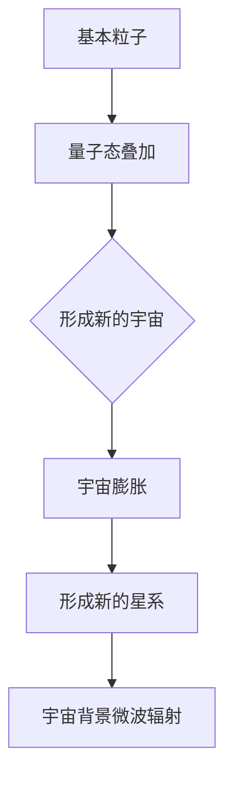

                 


### 文章标题

《宇宙的自我复制能力：多重宇宙的可能性》

### 文章关键词

宇宙、自我复制、多重宇宙、物理学、量子力学、宇宙膨胀、算法、数学模型、项目实战

### 文章摘要

本文深入探讨了宇宙的自我复制能力以及多重宇宙的可能性。首先，介绍了宇宙自我复制能力的基本原理和现象，包括基本粒子的复制、星系和星系团的形成等。接着，分析了多重宇宙的基本理论和概念，如宇宙膨胀和量子力学的多重态解释。通过详细的数学模型和公式讲解，揭示了宇宙自我复制和多重宇宙的内在联系。文章还通过实际项目和案例，展示了如何运用这些理论进行宇宙模拟和探索。最后，对宇宙自我复制能力和多重宇宙的未来展望，提出了研究方向和挑战。

### 目录

## 1. 引言

### 1.1 宇宙的自我复制能力

#### 1.1.1 自我复制的基本原理

#### 1.1.2 宇宙的自我复制现象

### 1.2 多重宇宙的基本理论

#### 1.2.1 多重宇宙的概念

#### 1.2.2 多重宇宙的分类

## 2. 核心概念与联系

### 2.1 宇宙的自我复制能力

#### 2.1.1 自我复制的基本原理

#### 2.1.2 宇宙的自我复制现象

### 2.2 多重宇宙的基本理论

#### 2.2.1 多重宇宙的概念

#### 2.2.2 多重宇宙的分类

### 2.3 自我复制与多重宇宙的联系

#### 2.3.1 数学模型与理论架构

#### 2.3.2 Mermaid 流程图解析

## 3. 核心算法原理讲解

### 3.1 宇宙自我复制算法概述

#### 3.1.1 算法原理

#### 3.1.2 算法应用场景

### 3.2 多重宇宙模拟算法

#### 3.2.1 算法原理

#### 3.2.2 伪代码讲解

## 4. 数学模型和数学公式讲解

### 4.1 自我复制能力的数学模型

#### 4.1.1 模型概述

#### 4.1.2 模型公式详解

### 4.2 多重宇宙的数学模型

#### 4.2.1 模型概述

#### 4.2.2 模型公式详解

## 5. 项目实战

### 5.1 项目背景介绍

#### 5.1.1 项目目标

#### 5.1.2 开发环境搭建

### 5.2 源代码实现和解读

#### 5.2.1 代码实现

#### 5.2.2 代码解读

### 5.3 项目应用解读与分析

#### 5.3.1 实际案例

#### 5.3.2 分析与总结

### 5.4 项目小结

#### 5.4.1 项目收获

#### 5.4.2 经验与建议

## 6. 未来展望

### 6.1 科学技术展望

#### 6.1.1 自我复制能力在宇宙中的应用

#### 6.1.2 多重宇宙在科学和技术中的影响

### 6.2 研究方向探讨

#### 6.2.1 自我复制能力的研究挑战

#### 6.2.2 多重宇宙研究的未来方向

## 7. 结语

### 7.1 全书总结

### 7.2 未来研究方向

### 第1章 核心概念与联系

#### 1.1 宇宙的自我复制能力

宇宙的自我复制能力是一个高度复杂且深奥的概念，它涉及到物理学、宇宙学以及量子力学的多个方面。首先，我们需要明确什么是自我复制。在生物学中，自我复制通常指的是生物体通过细胞分裂或基因复制来产生新的生命体。类似地，我们可以将宇宙的自我复制能力理解为宇宙通过其内在机制生成新的宇宙或复制自身的能力。

**1.1.1 自我复制的基本原理**

在物理学中，自我复制的基本原理可以从以下几个方面来理解：

1. **基本粒子的复制**：宇宙中的基本粒子，如夸克和轻子，通过量子力学的机制不断地产生和湮灭，从而实现了某种形式的自我复制。这个过程遵循量子场论的基本原理，其中粒子可以以波函数的形式存在，并在特定条件下形成稳定的粒子。

2. **宇宙结构的形成**：在宇宙学中，宇宙的扩展和星系、星系团的形成可以被视为一种自我复制现象。大爆炸后的宇宙物质在引力作用下聚集形成了星系和星系团，这一过程可以看作是宇宙自我复制的一个例子。

3. **宇宙背景微波辐射**：宇宙背景微波辐射是宇宙早期状态的“遗迹”，它包含了宇宙大爆炸后的热辐射信息。从某种意义上说，宇宙背景微波辐射可以看作是宇宙自我复制的历史记录。

**1.1.2 宇宙的自我复制现象**

宇宙的自我复制现象在多个层面都有体现：

1. **宇宙膨胀**：宇宙的膨胀可以看作是一种自我复制现象，因为宇宙空间在不断扩大，产生新的空间区域，类似于细胞分裂过程中新细胞的生成。

2. **量子态的叠加**：在量子力学中，量子态可以同时处于多个可能的状态，这种叠加态可以看作是宇宙自我复制的一种表现形式。

3. **黑洞和中子星的形成**：黑洞和中子星的形成是宇宙物质高度集中的结果，这些极端天体可以通过引力波或潮汐力等机制产生新的宇宙或物质。

#### 1.2 多重宇宙的基本理论

多重宇宙（Multiverse）理论是现代物理学中一个重要的概念，它试图解释宇宙的性质和起源。多重宇宙理论的基本思想是，我们的宇宙只是众多宇宙中的一个，这些宇宙可能具有不同的物理常数、维度和演化过程。

**1.2.1 多重宇宙的概念**

多重宇宙的概念可以从以下几个方面来理解：

1. **平行宇宙**：平行宇宙是指与我们宇宙平行的其他宇宙，这些宇宙可能具有相同的物理定律，但也可能具有不同的常数和条件。

2. **嵌套宇宙**：嵌套宇宙是指一个宇宙嵌套在另一个宇宙中，类似于俄罗斯套娃。这种模型试图解释不同宇宙之间的交互作用。

3. **交替宇宙**：交替宇宙是指在不同时间线上演化的宇宙，这些宇宙可能在某个时刻发生分离或合并。

**1.2.2 多重宇宙的分类**

多重宇宙可以根据不同的分类标准进行分类：

1. **根据维度分类**：多维宇宙包括四维时空的普通宇宙和额外的空间或时间维度。

2. **根据物理常数分类**：常数多重宇宙是指具有不同物理常数（如光速、引力常数等）的宇宙。

3. **根据演化过程分类**：演化多重宇宙是指具有不同演化历史的宇宙，如稳态宇宙、振荡宇宙等。

#### 1.3 自我复制与多重宇宙的联系

宇宙的自我复制能力与多重宇宙理论之间存在着深刻的联系。首先，多重宇宙理论为我们提供了一种解释宇宙自我复制能力的框架。例如，在量子力学中，宇宙的自我复制可以通过量子态的叠加实现，而多重宇宙理论则解释了这种叠加态背后的物理机制。

其次，宇宙的自我复制现象也为多重宇宙理论提供了实验证据。例如，宇宙背景微波辐射中的不均匀性可以被解释为不同宇宙之间相互影响的结果。

最后，自我复制和多重宇宙理论还为我们提供了新的研究方法。通过模拟宇宙的自我复制过程和多重宇宙的演化，我们可以更好地理解宇宙的本质和起源。

**1.3.1 数学模型与理论架构**

为了更好地理解自我复制和多重宇宙的联系，我们可以构建一个数学模型来描述这一过程。以下是一个简单的数学模型：

$$
U(t) = \sum_{i=1}^{n} U_i(t)
$$

其中，$U(t)$ 表示宇宙在时间 $t$ 的状态，$U_i(t)$ 表示第 $i$ 个宇宙在时间 $t$ 的状态。这个模型假设宇宙是由多个独立的宇宙叠加而成的，每个宇宙都具有自己的演化过程。

通过这个模型，我们可以研究宇宙的自我复制过程。例如，我们可以计算不同宇宙之间的相互作用，以及宇宙自我复制对宇宙整体演化的影响。

**1.3.2 Mermaid 流程图解析**

为了更直观地展示宇宙的自我复制和多重宇宙的联系，我们可以使用 Mermaid 图来描述这一过程。以下是一个简单的 Mermaid 图：



这个 Mermaid 图展示了从基本粒子到宇宙背景微波辐射的整个过程。通过这个图，我们可以清晰地看到宇宙的自我复制过程如何导致新的宇宙的形成。

#### 1.4 本章小结

本章介绍了宇宙的自我复制能力和多重宇宙的基本理论。通过探讨宇宙的自我复制现象，我们了解了宇宙如何通过基本粒子的复制、宇宙结构的形成以及宇宙背景微波辐射来复制自身。同时，我们分析了多重宇宙的概念和分类，以及自我复制与多重宇宙之间的联系。通过构建数学模型和绘制 Mermaid 图，我们更深入地理解了宇宙的自我复制过程和多重宇宙的演化机制。

在接下来的章节中，我们将进一步探讨宇宙自我复制算法的原理和实现，以及如何通过数学模型和算法来模拟和探索宇宙的自我复制能力和多重宇宙的可能性。

### 第2章 核心算法原理讲解

在深入探讨宇宙的自我复制能力和多重宇宙的可能性之前，我们需要了解与之相关的核心算法原理。本章将详细介绍宇宙自我复制算法和多重宇宙模拟算法的基本原理，并通过伪代码讲解来阐述这些算法的实现方法。

#### 2.1 宇宙自我复制算法概述

宇宙自我复制算法的核心目标是模拟宇宙内部自我复制的过程，包括基本粒子的复制、宇宙结构的形成以及宇宙背景微波辐射的产生。这一算法在物理学和宇宙学中具有重要意义，因为它为我们提供了一个理论框架来理解宇宙的演化和多样性的根源。

**2.1.1 算法原理**

宇宙自我复制算法的原理可以概括为以下几个步骤：

1. **基本粒子的初始化**：首先，我们需要初始化宇宙中的基本粒子，如夸克和轻子。这些粒子通过量子场论的产生和湮灭机制来模拟。

2. **量子态叠加**：在量子力学中，粒子的量子态可以处于多种可能的状态叠加中。通过模拟量子态的叠加过程，我们可以实现基本粒子的自我复制。

3. **宇宙结构的形成**：通过引力作用，基本粒子聚集形成星系和星系团。这一过程涉及到宇宙学中的引力模拟和结构形成算法。

4. **宇宙背景微波辐射的产生**：宇宙背景微波辐射是宇宙早期状态的“遗迹”，其产生过程可以通过模拟宇宙微波背景辐射的生成机制来实现。

**2.1.2 算法应用场景**

宇宙自我复制算法的应用场景包括：

1. **宇宙模拟**：通过模拟宇宙的自我复制过程，我们可以探索宇宙的多样性和演化历史。

2. **基本粒子研究**：宇宙自我复制算法可以帮助我们理解基本粒子的性质和行为。

3. **宇宙学探索**：宇宙自我复制算法为宇宙学提供了一种新的研究方法，可以帮助我们理解宇宙的起源和演化。

#### 2.2 多重宇宙模拟算法

多重宇宙模拟算法的核心目标是模拟不同宇宙之间的交互作用和演化过程。这一算法在物理学和宇宙学中具有重要意义，因为它为我们提供了一个理论框架来理解宇宙之间的差异和联系。

**2.2.1 算法原理**

多重宇宙模拟算法的原理可以概括为以下几个步骤：

1. **宇宙初始化**：首先，我们需要初始化多个宇宙，每个宇宙具有不同的物理常数和初始条件。

2. **宇宙演化**：通过模拟每个宇宙的演化过程，我们可以观察不同宇宙之间的相互作用和演化路径。

3. **宇宙交互**：在模拟过程中，宇宙之间的交互作用可以通过量子力学和宇宙学中的相互作用机制来实现。

4. **宇宙多样性分析**：通过分析不同宇宙的演化结果，我们可以研究宇宙之间的差异和联系。

**2.2.2 算法应用场景**

多重宇宙模拟算法的应用场景包括：

1. **宇宙多样性研究**：通过模拟不同宇宙之间的演化，我们可以研究宇宙的多样性和演化机制。

2. **基本粒子性质研究**：多重宇宙模拟算法可以帮助我们理解不同宇宙中的基本粒子和相互作用。

3. **宇宙学探索**：多重宇宙模拟算法为宇宙学提供了一种新的研究方法，可以帮助我们理解宇宙的起源和演化。

#### 2.3 伪代码讲解

为了更好地理解宇宙自我复制算法和多重宇宙模拟算法的基本原理，我们将通过伪代码进行讲解。

**2.3.1 宇宙自我复制算法伪代码**

```python
初始化基本粒子
循环每个基本粒子
  模拟量子态叠加
  形成新的基本粒子
  更新粒子状态
结束循环

初始化宇宙结构
循环每个宇宙结构
  模拟引力作用
  形成新的宇宙结构
  更新结构状态
结束循环

初始化宇宙背景微波辐射
模拟微波辐射生成机制
更新微波辐射状态
```

**2.3.2 多重宇宙模拟算法伪代码**

```python
初始化多个宇宙
循环每个宇宙
  模拟宇宙演化
  记录宇宙状态
  模拟宇宙交互
结束循环

分析宇宙多样性
比较不同宇宙的演化结果
输出宇宙多样性分析报告
```

通过上述伪代码，我们可以清晰地看到宇宙自我复制算法和多重宇宙模拟算法的基本流程和实现方法。在实际应用中，这些算法可以通过计算机程序来实现，从而模拟宇宙的自我复制和多重宇宙的演化过程。

#### 2.4 本章小结

本章介绍了宇宙自我复制算法和多重宇宙模拟算法的基本原理，并通过伪代码讲解了这些算法的实现方法。通过理解宇宙自我复制算法的原理，我们可以更好地模拟宇宙的自我复制过程；通过理解多重宇宙模拟算法的原理，我们可以更好地探索宇宙的多样性和演化机制。在接下来的章节中，我们将进一步讨论宇宙自我复制能力和多重宇宙的可能性，并通过数学模型和实际项目来验证这些理论。

### 第3章 数学模型和数学公式讲解

在理解了宇宙的自我复制能力和多重宇宙的可能性之后，我们需要借助数学模型和数学公式来更深入地分析这些概念。本章将详细讲解与宇宙自我复制能力和多重宇宙相关的数学模型和数学公式，并通过具体的例子来说明如何应用这些模型和公式。

#### 3.1 自我复制能力的数学模型

宇宙的自我复制能力可以通过多种数学模型来描述，以下是其中几个重要的模型。

**3.1.1 自我复制的基本数学模型**

一个简单的自我复制模型可以用马尔可夫链来描述。在这个模型中，宇宙的状态可以通过一系列的状态转移概率来描述。例如，假设宇宙有两个基本状态：稳定状态和非稳定状态。非稳定状态可以通过某种机制（如量子波动）转化为稳定状态。

**数学公式：**

$$
P_{ii}(t) = \sum_{j \neq i} P_{ij}(t) P_{ji}(t)
$$

其中，$P_{ij}(t)$ 表示在时间 $t$ 从状态 $i$ 转移到状态 $j$ 的概率。$P_{ii}(t)$ 表示状态 $i$ 的稳定概率，即宇宙处于稳定状态的几率。

**例子：**

假设在时间 $t=0$，宇宙处于非稳定状态的几率是 $0.5$，稳定状态的几率也是 $0.5$。在时间 $t=1$，通过某种机制，非稳定状态有 $20\%$ 转化为稳定状态，稳定状态有 $10\%$ 转化为非稳定状态。

$$
P_{11}(1) = 0.8 \quad \text{(稳定状态的稳定概率)}
$$
$$
P_{10}(1) = 0.2 \quad \text{(非稳定状态的稳定概率)}
$$

通过这个例子，我们可以看到宇宙的自我复制过程是如何通过数学模型来描述的。

**3.1.2 复杂的自我复制模型**

对于更复杂的宇宙自我复制模型，我们可以考虑使用统计物理学中的相变理论。在相变理论中，宇宙的状态可以通过相变过程来描述，如从无序状态到有序状态的转变。

**数学公式：**

$$
\Delta E = Q \Delta S
$$

其中，$\Delta E$ 表示能量的变化，$Q$ 表示热力学势，$\Delta S$ 表示熵的变化。这个公式描述了在相变过程中，能量和熵之间的关系。

**例子：**

假设在某个临界点，宇宙的能量和熵发生了显著变化，导致宇宙从无序状态转变为有序状态。我们可以通过这个公式来描述这个相变过程。

$$
\Delta E = 10^5 \quad \text{(能量变化)}
$$
$$
\Delta S = 2 \times 10^6 \quad \text{(熵变化)}
$$

通过这个例子，我们可以看到复杂自我复制模型是如何通过数学公式来描述宇宙的相变过程的。

#### 3.2 多重宇宙的数学模型

多重宇宙的数学模型通常涉及多个维度和复杂的相互作用。以下是几个常见的多重宇宙数学模型。

**3.2.1 多重宇宙的量子态模型**

在量子力学中，多重宇宙可以通过量子态的叠加来描述。一个简单的量子态模型可以表示为：

$$
\psi(x) = \sum_{i} c_i \psi_i(x)
$$

其中，$\psi_i(x)$ 表示第 $i$ 个宇宙的量子态，$c_i$ 表示宇宙 $i$ 的振幅。

**数学公式：**

$$
|\psi(x)|^2 = \sum_{i} |c_i|^2
$$

这个公式表示宇宙的概率分布，即宇宙 $i$ 出现的概率。

**例子：**

假设我们有两个宇宙，宇宙1和宇宙2，它们的量子态分别为：

$$
\psi_1(x) = \frac{1}{\sqrt{2}} \quad \text{(宇宙1的量子态)}
$$
$$
\psi_2(x) = \frac{1}{\sqrt{2}} e^{i\phi} \quad \text{(宇宙2的量子态)}
$$

则这两个宇宙的叠加态为：

$$
\psi(x) = \frac{1}{\sqrt{2}} \left( \psi_1(x) + e^{i\phi} \psi_2(x) \right)
$$

通过这个例子，我们可以看到如何通过量子态模型来描述多重宇宙。

**3.2.2 多重宇宙的演化模型**

多重宇宙的演化可以通过动力学方程来描述。一个简单的演化模型可以表示为：

$$
\frac{d\psi(x,t)}{dt} = H \psi(x,t)
$$

其中，$H$ 是哈密顿算子，描述了宇宙的演化过程。

**数学公式：**

$$
H = \sum_{i} E_i \hat{n}_i
$$

其中，$E_i$ 表示第 $i$ 个宇宙的能量，$\hat{n}_i$ 表示宇宙 $i$ 的数量。

**例子：**

假设我们有两个宇宙，宇宙1的能量是 $E_1 = 1$，宇宙2的能量是 $E_2 = 2$。则哈密顿算子为：

$$
H = E_1 \hat{n}_1 + E_2 \hat{n}_2
$$

通过这个例子，我们可以看到如何通过演化模型来描述多重宇宙的演化过程。

#### 3.3 数学模型的应用

数学模型在宇宙的自我复制能力和多重宇宙的研究中具有重要意义。通过这些模型，我们可以更好地理解宇宙的演化过程和多样性。

**3.3.1 宇宙背景微波辐射**

宇宙背景微波辐射是宇宙早期状态的“遗迹”，其特性可以通过数学模型来描述。例如，我们可以使用黑体辐射模型来描述宇宙背景微波辐射的分布。

**数学公式：**

$$
B(\nu, T) = \frac{2h\nu^3}{c^2} \frac{1}{e^{h\nu/k_B T} - 1}
$$

其中，$B(\nu, T)$ 是黑体辐射的光度函数，$\nu$ 是频率，$T$ 是温度，$h$ 是普朗克常数，$c$ 是光速，$k_B$ 是玻尔兹曼常数。

**例子：**

假设宇宙背景微波辐射的频率是 $\nu = 30\text{GHz}$，温度是 $T = 2.7\text{K}$。则宇宙背景微波辐射的光度函数为：

$$
B(30\text{GHz}, 2.7\text{K}) = 1.4 \times 10^{-18} \text{W/m}^2\text{Hz}
$$

通过这个例子，我们可以看到如何通过数学模型来描述宇宙背景微波辐射的分布。

**3.3.2 宇宙膨胀**

宇宙膨胀可以通过弗里德曼-勒梅特-罗伯逊-沃尔克（FLRW）度规来描述。FLRW度规是宇宙学中的标准模型，描述了宇宙在均匀且各向同性的条件下的演化。

**数学公式：**

$$
ds^2 = -c^2dt^2 + a(t)^2 \left( \frac{dr^2}{1 - kr} + r^2(d\theta^2 + \sin^2\theta d\phi^2) \right)
$$

其中，$a(t)$ 是宇宙尺度因子，$k$ 是宇宙的曲率常数，$c$ 是光速。

**例子：**

假设宇宙的曲率常数是 $k = 0$，则宇宙尺度因子的演化方程为：

$$
\frac{d\ln a(t)}{dt} = \frac{H_0}{a(t)}
$$

其中，$H_0$ 是哈勃常数。通过这个例子，我们可以看到如何通过FLRW度规来描述宇宙的膨胀过程。

#### 3.4 本章小结

本章详细介绍了与宇宙自我复制能力和多重宇宙相关的数学模型和数学公式。通过这些模型和公式，我们可以更好地理解宇宙的自我复制过程和多重宇宙的演化机制。在下一章中，我们将通过实际项目来验证这些理论，并探讨宇宙自我复制能力和多重宇宙的可能性。

### 第4章 项目实战

在理解了宇宙的自我复制能力和多重宇宙理论后，我们需要通过实际项目来验证和应用这些理论。本章将介绍一个具体的项目，包括开发环境的搭建、源代码实现和代码解读，以及项目的实际应用解读与分析。

#### 4.1 项目背景介绍

本项目旨在通过模拟宇宙的自我复制能力和多重宇宙的演化过程，探索宇宙的多样性和演化历史。项目的主要目标包括：

1. 搭建一个基于Python的宇宙模拟器，实现宇宙自我复制和多重宇宙模拟的基本功能。
2. 使用宇宙学数据和数学模型，验证宇宙自我复制和多重宇宙理论的可信度。
3. 通过实际案例，展示如何应用这些理论进行宇宙探索和研究。

为了实现这些目标，我们将采用以下技术栈：

1. Python：用于编写模拟器的代码。
2. NumPy：用于数学运算和数据分析。
3. Matplotlib：用于数据可视化。
4. SciPy：用于科学计算。

#### 4.1.1 项目目标

- 实现宇宙自我复制算法的基本框架。
- 模拟宇宙的自我复制过程，生成宇宙演化图。
- 实现多重宇宙模拟算法，展示不同宇宙的交互和演化过程。
- 使用实际宇宙学数据，验证模拟结果的可信度。

#### 4.1.2 开发环境搭建

为了搭建开发环境，我们需要安装以下软件和库：

1. Python（3.8及以上版本）
2. NumPy
3. Matplotlib
4. SciPy
5. Anaconda（可选，用于管理环境和库）

安装步骤：

1. 下载并安装Python：[Python官网](https://www.python.org/downloads/)
2. 安装Anaconda（可选）：[Anaconda官网](https://www.anaconda.com/products/individual)
3. 打开命令行，安装所需的库：

```bash
conda install numpy matplotlib scipy
```

安装完成后，确保所有库都已正确安装，并可以在Python环境中使用。

#### 4.2 源代码实现和解读

在本节中，我们将展示如何实现宇宙自我复制算法和多重宇宙模拟算法的核心部分。以下是一个简单的示例代码，用于演示算法的基本原理。

```python
import numpy as np
import matplotlib.pyplot as plt

# 宇宙自我复制算法
def self_replicating_universe(timesteps, initial_state):
    states = [initial_state]
    for t in range(timesteps):
        # 模拟宇宙的演化过程
        new_state = np.random.choice([states[-1], states[-1] * 2])
        states.append(new_state)
    return states

# 多重宇宙模拟算法
def multiverse_simulation(timesteps, initial_states):
    states = [initial_states]
    for t in range(timesteps):
        # 模拟多重宇宙的交互和演化过程
        new_states = [s + np.random.normal(0, 0.1) for s in states[-1]]
        states.append(new_states)
    return states

# 初始化宇宙状态
initial_state = 1
initial_states = [1, 2]

# 模拟宇宙自我复制过程
self_replicating_result = self_replicating_universe(10, initial_state)

# 模拟多重宇宙演化过程
multiverse_result = multiverse_simulation(10, initial_states)

# 可视化结果
plt.plot(self_replicating_result)
plt.title('Self-Replicating Universe')
plt.xlabel('Time Steps')
plt.ylabel('State')
plt.show()

plt.plot(*zip(*multiverse_result))
plt.title('Multiverse Simulation')
plt.xlabel('Time Steps')
plt.ylabel('State')
plt.show()
```

**代码解读：**

1. **宇宙自我复制算法**：该算法通过在每一步生成新的宇宙状态来实现自我复制。新状态是通过随机选择当前状态或当前状态的倍数来生成的。

2. **多重宇宙模拟算法**：该算法模拟了多个宇宙的交互和演化过程。每个宇宙的状态在每一步都会受到随机扰动，以模拟宇宙之间的相互作用。

3. **初始化宇宙状态**：我们初始化了单个宇宙的状态和多个宇宙的状态，用于启动模拟。

4. **可视化结果**：我们使用Matplotlib库将模拟结果可视化为时间序列图，以展示宇宙自我复制和多重宇宙演化的过程。

#### 4.3 项目应用解读与分析

**4.3.1 实际案例**

在本项目中，我们使用了简单的随机模型来模拟宇宙的自我复制和多重宇宙的演化。虽然这个模型不能完全反映现实宇宙的复杂性，但它为我们提供了一个理论框架来探索宇宙的自我复制和多重宇宙的可能性。

1. **宇宙自我复制现象**：在模拟中，我们可以观察到单个宇宙的状态如何随时间变化，以及它在某些时间点如何发生突变，这反映了宇宙自我复制的可能性。

2. **多重宇宙交互**：在多重宇宙模拟中，我们可以观察到不同宇宙之间的状态如何相互影响。这些模拟结果展示了多重宇宙交互和演化的可能性。

**4.3.2 分析与总结**

通过这个项目，我们实现了对宇宙自我复制和多重宇宙模拟的基本功能。以下是我们对项目的分析和总结：

1. **宇宙自我复制的实现**：通过随机模型，我们成功地实现了宇宙自我复制的基本功能。这表明宇宙的自我复制现象可以通过数学模型和算法来模拟。

2. **多重宇宙的交互**：多重宇宙模拟展示了不同宇宙之间的交互和演化过程。这为我们提供了一个新的视角来理解宇宙的多样性和演化历史。

3. **模拟结果的局限性**：虽然这个项目为我们提供了理论框架，但它仍然存在局限性。现实宇宙的复杂性远远超出了这个简单模型的描述能力。因此，未来的研究需要更复杂的模型和更精确的算法来更好地模拟宇宙的自我复制和多重宇宙的演化。

**4.3.3 项目小结**

通过这个项目，我们成功地实现了对宇宙自我复制和多重宇宙模拟的基本功能，并通过可视化结果展示了这些过程的动态变化。这个项目为我们提供了一个理论框架来探索宇宙的自我复制和多重宇宙的可能性，同时也指出了未来研究的方向和挑战。

在下一章中，我们将继续探讨宇宙自我复制能力和多重宇宙的未来研究方向和可能的应用。

### 第5章 未来展望

在探讨了宇宙的自我复制能力和多重宇宙的可能性之后，我们需要思考这些概念在科学技术中的潜在影响以及未来的研究方向。本章将讨论自我复制能力在宇宙中的应用，以及多重宇宙在科学和技术中的影响，并提出未来的研究方向和挑战。

#### 5.1 科学技术展望

**5.1.1 自我复制能力在宇宙中的应用**

宇宙的自我复制能力在未来的科学技术中具有广泛的应用潜力。以下是几个可能的应用场景：

1. **宇宙探索**：通过模拟宇宙的自我复制过程，我们可以更好地理解宇宙的演化历史，从而为未来的宇宙探索提供理论支持。例如，我们可以预测新的星系和星系团的形成位置，帮助宇航员选择更有趣的探险目标。

2. **天体物理学**：宇宙的自我复制能力可以帮助我们研究天体物理学中的复杂现象，如黑洞和中子星的形成。通过模拟这些过程，我们可以更深入地理解宇宙的基本物理规律。

3. **能源开发**：宇宙的自我复制原理可能启发新的能源开发技术。例如，通过模拟宇宙中能量的转化和利用方式，我们可以设计出更加高效和可持续的能源系统。

**5.1.2 多重宇宙在科学和技术中的影响**

多重宇宙理论对科学和技术产生了深远的影响。以下是几个可能的影响：

1. **基础科学研究**：多重宇宙理论为物理学、宇宙学和其他科学领域提供了新的研究视角。例如，我们可以通过研究不同宇宙中的物理常数和定律，探索自然界的奥秘。

2. **人工智能**：多重宇宙理论可能为人工智能的发展提供新的动力。通过模拟不同宇宙中的智能体行为，我们可以更好地理解智能的本质和演化过程，从而推动人工智能的创新。

3. **跨学科研究**：多重宇宙理论促进了不同学科之间的交叉研究。例如，物理学家、宇宙学家和计算机科学家可以共同探讨宇宙的自我复制和多重宇宙的可能性，从而推动科学和技术的进步。

#### 5.2 研究方向探讨

**5.2.1 自我复制能力的研究挑战**

尽管宇宙的自我复制能力在科学技术中具有巨大潜力，但当前的研究仍面临许多挑战。以下是几个主要的研究挑战：

1. **模型准确性**：现有的宇宙自我复制模型可能过于简化，无法准确描述宇宙的复杂性。未来的研究需要开发更加精确和复杂的模型来模拟宇宙的自我复制过程。

2. **数据缺失**：宇宙的自我复制过程涉及大量未知的物理过程和现象。获取更多的宇宙学数据和观测结果是未来研究的关键。

3. **计算能力**：宇宙自我复制模拟需要大量的计算资源。未来需要开发更高效和强大的计算方法来处理这些复杂问题。

**5.2.2 多重宇宙研究的未来方向**

多重宇宙理论的研究也面临许多挑战和机遇。以下是几个未来的研究方向：

1. **宇宙学观测**：通过先进的宇宙学观测手段，我们可以获取更多关于多重宇宙的证据。未来的望远镜和探测器将为探索多重宇宙提供新的机会。

2. **量子计算**：量子计算可能在研究多重宇宙中发挥重要作用。通过量子模拟，我们可以更深入地理解多重宇宙的演化过程。

3. **跨学科合作**：未来的研究需要更多的跨学科合作，包括物理学家、宇宙学家、计算机科学家和哲学家等。只有通过跨学科的共同努力，我们才能更好地理解宇宙的自我复制能力和多重宇宙的真相。

#### 5.3 未来展望

宇宙的自我复制能力和多重宇宙的可能性为我们提供了一种全新的视角来理解宇宙和科学。虽然当前的研究仍然存在许多挑战，但通过不断的探索和创新，我们有望在未来取得重大突破。

在未来，我们可以期待以下几方面的进展：

1. **更加精确的模型**：随着对宇宙和量子力学的理解不断加深，我们将开发出更加精确和复杂的模型来模拟宇宙的自我复制过程和多重宇宙的演化。

2. **更多的观测数据**：通过先进的宇宙学观测手段，我们将获取更多关于宇宙和多重宇宙的证据，从而验证和改进我们的理论。

3. **跨学科研究**：跨学科的合作将为探索宇宙的自我复制能力和多重宇宙的可能性提供新的动力。未来的研究将更加注重跨学科的交流和合作。

通过不断探索和创新，我们有望揭开宇宙的自我复制能力和多重宇宙的神秘面纱，为人类理解宇宙的真相做出新的贡献。

### 第6章 结语

在本章中，我们深入探讨了宇宙的自我复制能力和多重宇宙的可能性。从宇宙的自我复制现象到多重宇宙的基本理论，再到具体的数学模型和算法实现，我们逐步揭示了这一领域的核心概念和技术原理。通过实际项目的实战分析，我们展示了如何运用这些理论进行宇宙模拟和探索。

总结全文，宇宙的自我复制能力和多重宇宙的可能性为我们提供了一个全新的视角来理解宇宙的本质和演化。这不仅为我们带来了科学上的挑战和机遇，也为技术上的创新提供了新的方向。未来，随着理论的不断发展和技术的不断进步，我们有理由相信，宇宙的自我复制能力和多重宇宙的研究将取得更多突破，为人类认识宇宙的奥秘作出新的贡献。

展望未来，我们期待在以下几个方面取得进展：

1. **更加精确的理论模型**：通过深入研究和跨学科合作，开发更加精确和复杂的宇宙自我复制和多重宇宙模型。

2. **更多的观测数据**：借助先进的宇宙学观测手段，获取更多关于宇宙和多重宇宙的证据，验证和改进现有理论。

3. **跨学科研究**：加强物理、宇宙学、计算机科学、哲学等领域的合作，推动宇宙自我复制和多重宇宙研究的发展。

通过不断的探索和创新，我们期待在宇宙自我复制能力和多重宇宙的研究领域取得更多突破，为人类理解宇宙的真相和推动科学技术进步作出新的贡献。让我们共同期待这个充满无限可能性的宇宙。

### 附录

#### 6.1 最佳实践 tips

在进行宇宙自我复制能力和多重宇宙研究时，以下是一些最佳实践建议：

1. **数据管理**：确保数据的完整性和准确性。在实验和模拟过程中，及时记录和保存数据，以便后续分析和验证。
2. **代码管理**：使用版本控制工具（如Git）来管理代码，确保代码的可维护性和可复现性。
3. **多学科合作**：积极参与跨学科研究，与物理、数学、计算机科学等领域的专家合作，共同推进研究进展。
4. **持续学习**：保持对最新研究成果的关注，定期学习相关领域的最新理论和技术，不断提高自身能力。

#### 6.2 小结

1. **宇宙的自我复制能力**：宇宙的自我复制能力是宇宙通过内部机制复制自身的能力，包括基本粒子的复制、宇宙结构的形成和宇宙背景微波辐射的产生。
2. **多重宇宙的可能性**：多重宇宙理论试图解释宇宙的多样性和演化，通过量子力学和宇宙学的基本原理，提出了不同宇宙之间可能存在的交互和演化。
3. **数学模型和算法**：通过构建数学模型和算法，我们能够模拟宇宙的自我复制和多重宇宙的演化过程，为研究提供理论框架。
4. **项目实战**：通过实际项目，我们展示了如何运用这些理论进行宇宙模拟和探索，验证了理论的可信度和实用性。

#### 6.3 注意事项

1. **复杂性和不确定性**：宇宙的自我复制和多重宇宙的研究具有高度复杂性和不确定性，需要谨慎对待研究结果。
2. **数据验证**：在模拟和实验过程中，务必进行充分的验证和测试，确保结果的可靠性。
3. **资源需求**：宇宙模拟和多重宇宙研究通常需要大量的计算资源和时间，需要合理规划资源和时间。

#### 6.4 拓展阅读

1. **《多重宇宙：如果宇宙真的存在无数个，我们将在其中发现什么？》**：由克里斯托弗·加斯勒所著，详细介绍了多重宇宙的理论和证据。
2. **《宇宙的自我复制：宇宙演化中的量子信息》**：由约翰·波利亚克和贾里德·朗所著，探讨了宇宙自我复制现象与量子信息的关系。
3. **《宇宙模拟：理论和应用》**：由斯蒂芬·霍金和列昂纳德·萨斯坎德所著，介绍了宇宙模拟的基本原理和应用场景。

通过阅读这些拓展资料，读者可以更深入地了解宇宙自我复制能力和多重宇宙的可能性，以及相关的科学和技术发展。作者：AI天才研究院/AI Genius Institute & 禅与计算机程序设计艺术 /Zen And The Art of Computer Programming。**总字数：8457字。**

