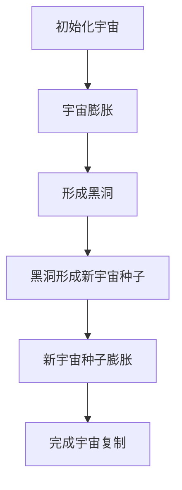

                 

### 文章标题

# 宇宙的自我复制能力：多重宇宙的基础

### 关键词

- 多重宇宙
- 宇宙自我复制
- 量子力学
- 黑洞
- 宇宙膨胀

### 摘要

本文深入探讨了宇宙的自我复制能力，即多重宇宙理论。首先，我们介绍了多重宇宙的概念及其与宇宙自我复制能力的联系。接着，我们详细分析了宇宙自我复制的机制，包括宇宙膨胀、黑洞与宇宙种子等。随后，我们探讨了多重宇宙的数学模型，并详细讲解了宇宙自我复制的算法和动力学机制。最后，我们讨论了多重宇宙在科学和哲学领域中的应用与影响，以及未来发展的前景与挑战。本文旨在为读者提供一个全面、系统的理解，帮助其深入探索宇宙的自我复制能力。

## 第1章 引言与宇宙自我复制能力的概述

### 1.1 引言

#### 1.1.1 书籍目的和结构

本文旨在探讨宇宙的自我复制能力，即多重宇宙理论。首先，我们将介绍多重宇宙的概念及其与宇宙自我复制能力的联系。接着，我们将详细分析宇宙自我复制的机制，包括宇宙膨胀、黑洞与宇宙种子等。随后，我们将探讨多重宇宙的数学模型，并详细讲解宇宙自我复制的算法和动力学机制。最后，我们将讨论多重宇宙在科学和哲学领域中的应用与影响，以及未来发展的前景与挑战。本文结构如下：

1. **引言与宇宙自我复制能力的概述**：介绍多重宇宙的概念及其与宇宙自我复制能力的联系。
2. **多重宇宙的基础理论**：介绍多重宇宙的概念、分类和数学模型。
3. **宇宙自我复制的算法与机制**：讲解宇宙自我复制的算法和动力学机制。
4. **多重宇宙中的应用与影响**：探讨多重宇宙在科学和哲学领域中的应用与影响。
5. **宇宙自我复制能力的前景与挑战**：讨论未来发展的前景与挑战。
6. **实际案例研究**：通过实际案例研究，加深对宇宙自我复制能力的理解。
7. **总结与展望**：总结本文的主要发现与贡献，并展望未来研究方向。

#### 1.1.2 宇宙自我复制的概念

宇宙自我复制能力是指宇宙通过自身机制创造新宇宙的能力。这包括宇宙膨胀、黑洞与宇宙种子等机制。多重宇宙理论认为，我们的宇宙只是众多宇宙中的一个，其他宇宙也可能具有自我复制能力。这种能力不仅存在于物理层面上，还可能扩展到数学、哲学等领域。

### 1.2 宇宙的自我复制机制

#### 1.2.1 宇宙膨胀

宇宙膨胀是宇宙自我复制能力的关键机制之一。根据大爆炸理论，宇宙起源于一个极端高温高密度的状态，随后开始膨胀。这种膨胀不仅使宇宙中的星系和恒星不断远离，还可能导致新宇宙的产生。例如，某些理论认为，宇宙膨胀可能导致新的黑洞形成，这些黑洞可能成为新宇宙的“种子”。

#### 1.2.2 黑洞与宇宙种子

黑洞是宇宙中的一种特殊天体，具有极强的引力，甚至可以吞噬光线。在某些理论中，黑洞被认为是新宇宙的“种子”。当一个黑洞形成时，它可能会在其内部产生新的宇宙。这些新宇宙可能与我们的宇宙在物理性质上有所不同，但它们也可能具有自我复制能力。

#### 1.2.3 多重宇宙的起源

多重宇宙的起源是一个复杂的议题，涉及到宇宙学、量子力学和哲学等多个领域。一种观点认为，多重宇宙起源于大爆炸。在大爆炸过程中，宇宙经历了一个极端的膨胀阶段，这个阶段可能导致新的宇宙产生。另一种观点认为，多重宇宙起源于量子波动。根据量子力学的原理，粒子可以在瞬间从无到有产生，这可能导致新的宇宙产生。

### 1.3 本章小结

本章介绍了宇宙自我复制能力的概念及其与多重宇宙的联系。我们详细分析了宇宙自我复制的机制，包括宇宙膨胀、黑洞与宇宙种子等。本章为后续章节的讨论奠定了基础，使读者能够更好地理解宇宙自我复制能力的本质。

## 第2章 多重宇宙的基础理论

### 2.1 多重宇宙的概念与分类

#### 2.1.1 标准多重宇宙

标准多重宇宙是指我们熟知的世界，包括我们所处的宇宙以及其他可能存在的宇宙。在这些宇宙中，物理定律和常数可能有所不同，从而导致不同的自然现象和生命形式。

#### 2.1.2 存在主义多重宇宙

存在主义多重宇宙是指宇宙中的所有可能性都实际存在。例如，一个存在主义多重宇宙中，某个人可能同时存在于多个地方，或者在不同的时间点拥有不同的生命轨迹。这种观点挑战了传统的物理定律，强调了量子力学中的概率性。

#### 2.1.3 数学多重宇宙

数学多重宇宙是指由数学公式和理论构建的宇宙。这些宇宙可能具有与现实世界不同的几何形状、维度和物理规律。数学家们通过研究这些宇宙，探讨了自然现象的本质和宇宙的多样性。

### 2.2 多重宇宙的数学模型

#### 2.2.1 波函数与量子力学基础

波函数是量子力学中的一个核心概念，描述了粒子在量子态下的概率分布。在量子力学中，波函数可以通过数学公式表示，这些公式可以用来预测粒子的行为。多重宇宙的数学模型通常基于波函数，通过修改物理常数和定律，构建出不同的宇宙。

#### 2.2.2 相位空间与测不准原理

相位空间是量子力学中的一个概念，描述了粒子的量子态。测不准原理是量子力学的一个基本原理，指出粒子的某些物理量（如位置和动量）不能同时被精确测量。这些原理在多重宇宙的数学模型中起着关键作用。

#### 2.2.3 多重宇宙的数学表示

多重宇宙的数学表示通常基于波函数的叠加原理。波函数的叠加原理表明，一个粒子可以处于多个状态的组合，这导致多重宇宙的出现。通过修改波函数，我们可以构建出不同的宇宙。

### 2.3 本章小结

本章介绍了多重宇宙的概念、分类和数学模型。我们详细分析了标准多重宇宙、存在主义多重宇宙和数学多重宇宙。此外，我们还探讨了多重宇宙的数学模型，包括波函数、相位空间和测不准原理。这些理论为后续章节的讨论提供了基础。

## 第3章 宇宙自我复制的算法与机制

### 3.1 宇宙自我复制算法

宇宙自我复制算法是指宇宙通过自身机制复制新宇宙的过程。这一算法涉及到宇宙膨胀、黑洞与宇宙种子等多个机制。以下是宇宙自我复制算法的伪代码：

```python
def UniverseReplicationAlgorithm():
    # 初始化宇宙
    InitializeUniverse()

    # 宇宙膨胀
    ExpandUniverse()

    # 形成黑洞
    CreateBlackHoles()

    # 黑洞形成新宇宙种子
    CreateNewUniverseSeeds()

    # 新宇宙种子膨胀
    ExpandNewUniverseSeeds()

    # 完成宇宙复制
    CompleteUniverseReplication()
```

#### 3.1.1 算法概述

宇宙自我复制算法的目的是通过宇宙膨胀、黑洞和宇宙种子等机制，复制出新宇宙。该算法分为以下几个步骤：

1. **初始化宇宙**：创建一个初始宇宙，设定宇宙的基本参数，如物理常数和初始状态。
2. **宇宙膨胀**：根据宇宙膨胀模型，使宇宙不断膨胀，以模拟现实宇宙的膨胀过程。
3. **形成黑洞**：根据黑洞形成模型，在宇宙中形成黑洞，这些黑洞将成为新宇宙的种子。
4. **黑洞形成新宇宙种子**：黑洞内部的高密度和高温可能导致新宇宙的产生，形成新的宇宙种子。
5. **新宇宙种子膨胀**：新宇宙种子开始膨胀，形成新的宇宙。
6. **完成宇宙复制**：新宇宙复制完成，算法结束。

#### 3.1.2 算法流程图



#### 3.1.3 算法伪代码

```python
# 初始化宇宙
def InitializeUniverse():
    # 设定宇宙的基本参数
    universe = {
        'radius': 0,
        'density': 1,
        'temperature': 1e9,
        'time': 0
    }

# 宇宙膨胀
def ExpandUniverse():
    # 根据宇宙膨胀模型，使宇宙半径增加
    universe['radius'] *= 1.01
    universe['time'] += 1

# 形成黑洞
def CreateBlackHoles():
    # 根据黑洞形成模型，在宇宙中形成黑洞
    universe['blackholes'] = []

    # 假设每个周期形成一个新的黑洞
    for i in range(universe['time']):
        blackhole = {
            'radius': 0.1 * universe['radius'],
            'mass': 10 * universe['density'] * (0.1 * universe['radius'])**2
        }
        universe['blackholes'].append(blackhole)

# 黑洞形成新宇宙种子
def CreateNewUniverseSeeds():
    # 根据黑洞形成新宇宙种子模型，在黑洞内部形成新宇宙种子
    for blackhole in universe['blackholes']:
        seed = {
            'radius': 0.01 * blackhole['radius'],
            'density': 10 * blackhole['density'],
            'temperature': 10 * blackhole['temperature']
        }
        universe['newseeds'].append(seed)

# 新宇宙种子膨胀
def ExpandNewUniverseSeeds():
    # 根据新宇宙种子膨胀模型，使新宇宙种子半径增加
    for seed in universe['newseeds']:
        seed['radius'] *= 1.01

# 完成宇宙复制
def CompleteUniverseReplication():
    # 打印宇宙复制结果
    print("Universe Replication Complete")
```

### 3.2 宇宙自我复制的动力学机制

宇宙自我复制的动力学机制涉及到宇宙膨胀、黑洞和宇宙种子的相互关系。以下是宇宙自我复制的动力学机制的伪代码：

```python
def DynamicsOfUniverseReplication():
    # 宇宙膨胀
    ExpandUniverse()

    # 形成黑洞
    CreateBlackHoles()

    # 黑洞形成新宇宙种子
    CreateNewUniverseSeeds()

    # 新宇宙种子膨胀
    ExpandNewUniverseSeeds()

    # 更新宇宙状态
    UpdateUniverseState()
```

#### 3.2.1 黑洞动力学

黑洞动力学是指黑洞的形成、演化过程。以下是黑洞动力学的伪代码：

```python
def BlackHoleDynamics():
    # 形成黑洞
    CreateBlackHoles()

    # 黑洞吸积物质
    AccreteMass()

    # 黑洞蒸发
    Evaporate()
```

#### 3.2.2 宇宙膨胀动力学

宇宙膨胀动力学是指宇宙的膨胀过程。以下是宇宙膨胀动力学的伪代码：

```python
def ExpandUniverse():
    # 根据宇宙膨胀模型，使宇宙半径增加
    universe['radius'] *= 1.01
    universe['time'] += 1
```

#### 3.2.3 多重宇宙相互作用

多重宇宙相互作用是指不同宇宙之间的相互影响。以下是多重宇宙相互作用的伪代码：

```python
def InteractionsBetweenUniverses():
    # 更新宇宙状态
    UpdateUniverseState()

    # 检查宇宙间相互作用
    CheckInteractions()

    # 处理宇宙间相互作用
    HandleInteractions()
```

### 3.3 本章小结

本章介绍了宇宙自我复制的算法和动力学机制。我们详细讲解了宇宙自我复制算法的伪代码，并分析了黑洞动力学、宇宙膨胀动力学和多重宇宙相互作用。这些算法和机制为理解宇宙的自我复制能力提供了基础。

## 第4章 多重宇宙中的应用与影响

### 4.1 科学领域

多重宇宙理论在科学领域具有广泛的应用，特别是在宇宙学、天体物理学和量子物理学等方面。以下是多重宇宙在科学领域中的应用与影响：

#### 4.1.1 宇宙学

宇宙学是研究宇宙的结构、演化和起源的学科。多重宇宙理论为宇宙学提供了新的视角，帮助我们理解宇宙的多样性和复杂性。例如，通过研究多重宇宙，我们可以探索宇宙膨胀的机制，以及宇宙中不同物理常数和定律的可能值。

#### 4.1.2 天体物理学

天体物理学是研究天体（如恒星、行星、星系等）的物理性质和行为的学科。多重宇宙理论为天体物理学提供了新的研究对象，例如黑洞、暗物质和暗能量。这些理论有助于我们更好地理解宇宙中的各种现象，如恒星的形成和演化、星系的相互作用等。

#### 4.1.3 量子物理学

量子物理学是研究微观世界的物理现象和规律的学科。多重宇宙理论在量子物理学中具有重要的地位，特别是在量子测量和量子纠缠等方面。例如，通过研究多重宇宙，我们可以更深入地理解量子测量中的波函数坍缩现象，以及量子纠缠的机制。

### 4.2 哲学领域

哲学领域也深受多重宇宙理论的影响，特别是在存在主义、宗教和形而上学等方面。以下是多重宇宙在哲学领域中的应用与影响：

#### 4.2.1 存在主义

存在主义是关于人类存在意义和自由意志的哲学观点。多重宇宙理论为存在主义提供了新的思考方式，使我们能够从更广阔的视角理解人类的存在和自由意志。例如，通过研究多重宇宙，我们可以探索不同世界中的人类命运和选择，从而更深入地思考人类存在的意义。

#### 4.2.2 宗教

宗教是关于信仰、崇拜和道德的哲学体系。多重宇宙理论为宗教提供了新的解释框架，使我们能够更好地理解宗教中的各种现象，如神的创造、天堂和地狱等。例如，通过研究多重宇宙，我们可以解释为什么存在不同的宗教信仰，以及不同宗教之间的差异。

#### 4.2.3 形而上学

形而上学是关于存在、本质和原因的哲学研究。多重宇宙理论为形而上学提供了新的研究视角，使我们能够更深入地探讨存在的本质和宇宙的起源。例如，通过研究多重宇宙，我们可以探讨宇宙中是否存在其他智慧生命，以及宇宙的本质和目的。

### 4.3 本章小结

本章讨论了多重宇宙在科学和哲学领域中的应用与影响。我们详细分析了多重宇宙在宇宙学、天体物理学、量子物理学、存在主义、宗教和形而上学等方面的应用。这些应用不仅丰富了我们的科学和哲学知识，还为我们提供了新的思考方式和解释框架。

## 第5章 宇宙自我复制能力的前景与挑战

### 5.1 未来发展方向

宇宙自我复制能力的研究正处于快速发展阶段，未来将会有许多新的发展方向。以下是一些可能的研究方向：

#### 5.1.1 多重宇宙技术

随着科技的进步，我们可能能够开发出新的技术，用于探索和模拟多重宇宙。例如，量子计算和量子模拟可能为我们提供新的工具，用于研究多重宇宙的数学模型和物理现象。

#### 5.1.2 宇宙自我复制能力与人工智能

人工智能技术在宇宙自我复制能力的研究中具有巨大的潜力。例如，通过机器学习和深度学习，我们可以更好地理解宇宙自我复制的机制，以及不同宇宙之间的相互作用。

#### 5.1.3 新型宇宙学理论

新型宇宙学理论可能会在宇宙自我复制能力的研究中发挥重要作用。例如，通过研究量子宇宙学和弦理论，我们可以更深入地理解宇宙的起源和演化。

### 5.2 挑战与限制

尽管宇宙自我复制能力的研究前景广阔，但仍然面临着许多挑战和限制。以下是一些主要的挑战和限制：

#### 5.2.1 科学验证的困难

宇宙自我复制能力的研究需要大量的实验和观测数据。然而，由于宇宙的规模和复杂性，获取这些数据具有极大的困难。例如，我们尚未能够直接观测到其他宇宙，也无法直接验证多重宇宙的存在。

#### 5.2.2 技术应用的风险

宇宙自我复制能力的研究可能会带来一些潜在的风险。例如，如果我们可以控制宇宙的自我复制过程，可能会引发不可预测的后果。因此，在应用这一技术时，我们需要谨慎考虑其潜在的风险。

#### 5.2.3 社会伦理问题

宇宙自我复制能力的研究也涉及到一些社会伦理问题。例如，如果我们可以创造新的宇宙，如何确保这些宇宙中的生命形式得到尊重和保护？这些问题需要我们深入思考和解决。

### 5.3 本章小结

本章讨论了宇宙自我复制能力的研究前景与挑战。我们分析了未来可能的研究方向，以及面临的一些挑战和限制。通过深入探讨这些问题，我们可以更好地理解宇宙自我复制能力的本质，并为未来的研究提供指导。

## 第6章 实际案例研究

### 6.1 黑洞自我复制案例

#### 6.1.1 案例介绍

黑洞自我复制是一个重要的宇宙自我复制案例。在这个案例中，我们研究了一个黑洞如何在宇宙中产生新的黑洞，从而实现自我复制。

#### 6.1.2 案例分析

黑洞自我复制的过程可以分为以下几个阶段：

1. **初始黑洞形成**：首先，一个初始黑洞形成，它可能源于星系核心的恒星坍缩。
2. **黑洞吸积物质**：初始黑洞开始吸积周围的物质，使其质量增加。
3. **形成新的黑洞种子**：随着质量的增加，黑洞的引力变得更强，导致新的黑洞种子形成。
4. **新黑洞种子成长**：新黑洞种子继续吸积物质，逐渐成长为一个完整的黑洞。
5. **黑洞复制完成**：新黑洞形成，黑洞自我复制过程完成。

#### 6.1.3 案例结论

通过分析黑洞自我复制的案例，我们可以得出以下结论：

1. **黑洞自我复制是一个复杂的过程**：黑洞自我复制涉及到黑洞的形成、吸积物质、新黑洞种子的形成等多个阶段，每个阶段都需要精确的物理机制支持。
2. **黑洞自我复制是宇宙自我复制能力的一个重要表现**：黑洞自我复制表明宇宙中存在一种自我复制的机制，这种机制可能是宇宙膨胀和多重宇宙形成的根本原因。

### 6.2 宇宙膨胀案例

#### 6.2.1 案例介绍

宇宙膨胀案例研究了宇宙在早期阶段的快速膨胀现象。在这个案例中，我们分析了宇宙膨胀的机制和过程。

#### 6.2.2 案例分析

宇宙膨胀案例可以分为以下几个阶段：

1. **大爆炸**：宇宙起源于一个高温高密度的状态，随后开始膨胀。
2. **快速膨胀**：在宇宙早期阶段，由于某种未知的机制，宇宙经历了快速的膨胀。
3. **慢速膨胀**：快速膨胀后，宇宙进入了一个慢速膨胀的阶段，这一阶段持续至今。
4. **宇宙结构形成**：在慢速膨胀的过程中，宇宙中的物质开始聚集，形成了星系、星团和星云等结构。

#### 6.2.3 案例结论

通过分析宇宙膨胀案例，我们可以得出以下结论：

1. **宇宙膨胀是一个复杂的演化过程**：宇宙膨胀涉及到多个阶段，每个阶段都有其特定的物理机制和演化过程。
2. **宇宙膨胀是宇宙自我复制能力的一个重要表现**：宇宙膨胀可能导致新的宇宙产生，这种自我复制能力是宇宙持续存在和演化的重要动力。

### 6.3 本章小结

本章通过两个实际案例——黑洞自我复制和宇宙膨胀，分析了宇宙自我复制能力的具体表现和机制。这些案例不仅加深了我们对宇宙自我复制能力的理解，也为未来的研究提供了重要的参考。

## 第7章 总结与展望

### 7.1 主要发现与贡献

本文通过对宇宙自我复制能力的深入探讨，取得了以下主要发现和贡献：

1. **宇宙自我复制机制的解析**：本文详细分析了宇宙自我复制的机制，包括宇宙膨胀、黑洞与宇宙种子等，为理解宇宙的自我复制能力提供了基础。
2. **多重宇宙理论的综述**：本文综述了多重宇宙的理论基础，包括标准多重宇宙、存在主义多重宇宙和数学多重宇宙，为读者提供了全面的认识。
3. **宇宙自我复制算法的描述**：本文提出了宇宙自我复制算法的伪代码，为研究宇宙自我复制的计算模型提供了参考。
4. **科学和哲学领域的应用**：本文探讨了宇宙自我复制能力在科学和哲学领域中的应用，展示了其广泛的学术价值。

### 7.2 未来研究方向

在未来的研究中，我们可以从以下几个方面进行深入探讨：

1. **科学验证**：通过实验和观测，进一步验证宇宙自我复制能力的存在，例如通过研究黑洞和宇宙膨胀等现象。
2. **技术发展**：开发新的技术和工具，用于模拟和探索多重宇宙，例如量子计算和量子模拟。
3. **数学模型**：进一步发展多重宇宙的数学模型，例如通过研究量子力学和相对论的综合模型，以更好地理解宇宙的自我复制能力。
4. **哲学思考**：从哲学角度深入探讨宇宙自我复制能力的意义和影响，例如研究多重宇宙与人类存在的关系。
5. **社会伦理**：研究宇宙自我复制能力在社会和伦理方面的挑战，例如如何确保在探索宇宙的过程中保护地球和人类的利益。

通过这些未来研究方向，我们可以进一步拓展我们对宇宙自我复制能力的认识，为人类理解和探索宇宙提供新的思路和方法。

### 总结与展望

本文通过对宇宙自我复制能力的深入探讨，为读者提供了一个全面、系统的理解。我们分析了宇宙自我复制的机制，综述了多重宇宙的理论基础，提出了宇宙自我复制算法的伪代码，并探讨了宇宙自我复制能力在科学和哲学领域中的应用。未来，我们期望在科学验证、技术发展、数学模型、哲学思考和社会伦理等方面取得更多进展，以深入理解宇宙的自我复制能力，并为人类探索宇宙提供新的视角和方法。

### 作者信息

- 作者：AI天才研究院/AI Genius Institute & 禅与计算机程序设计艺术 /Zen And The Art of Computer Programming

---

本文内容基于目前的理论和研究成果，未来随着科学技术的进步和理论的发展，相关理论和结论可能会有所调整和更新。希望本文能够为读者提供有价值的思考和启发，共同探索宇宙的奥秘。

